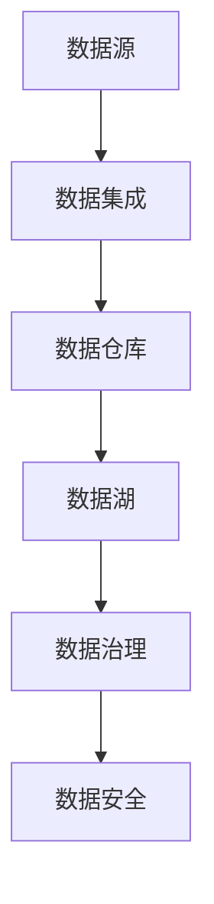
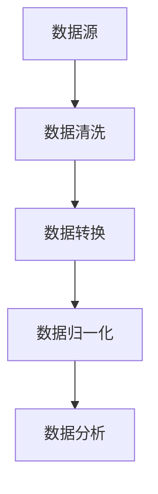
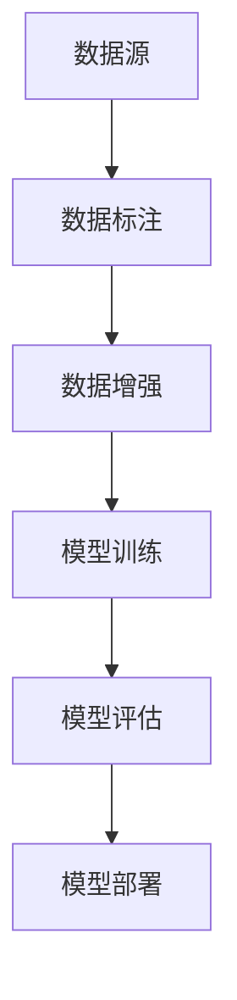
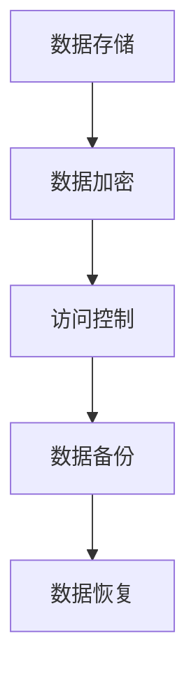

                 

关键词：AI创业、数据管理、数据架构、数据处理、机器学习、数据分析、深度学习、模型优化、开源工具、云计算、数据安全、数据隐私。

> 摘要：本文将探讨在AI创业过程中数据管理的核心重点。从数据架构设计、数据处理、机器学习和深度学习算法优化、开源工具的选择到数据安全和隐私保护，我们将深入分析各个方面的挑战和最佳实践，为创业者提供指导。

## 1. 背景介绍

随着人工智能（AI）技术的飞速发展，越来越多的初创公司开始将AI作为核心驱动力，希望通过AI技术打造创新的产品和服务。然而，AI的成功离不开高质量的数据。数据管理成为AI创业过程中不可忽视的重要环节。良好的数据管理不仅能够提升算法性能，还能确保项目的可持续性和竞争力。

在本文中，我们将从多个维度探讨数据管理的重点，包括：

- 数据架构设计：构建稳定、可扩展的数据基础设施。
- 数据处理：高效地处理和清洗数据，确保数据质量。
- 机器学习和深度学习：优化算法和模型，提升性能。
- 开源工具：选择合适的数据处理和分析工具。
- 数据安全和隐私：确保数据安全，遵守相关法律法规。

## 2. 核心概念与联系

### 2.1 数据架构

数据架构是数据管理的基础。一个良好的数据架构应该具备以下特点：

- **数据一致性**：确保数据在不同系统之间的一致性和准确性。
- **可扩展性**：支持业务增长和系统扩展。
- **灵活性**：适应不同业务场景和需求变化。
- **安全性**：保护数据免受未经授权的访问和泄露。

以下是一个简单的数据架构Mermaid流程图：



### 2.2 数据处理

数据处理是数据管理的关键步骤。主要包括以下任务：

- **数据清洗**：去除重复数据、缺失值和错误数据。
- **数据转换**：将数据格式转换为适合分析和处理的形式。
- **数据归一化**：确保不同特征在同一尺度上。

以下是一个数据处理流程的Mermaid流程图：



### 2.3 机器学习和深度学习

机器学习和深度学习是AI的核心技术。为了实现高效的模型训练和推理，数据管理必须关注以下几个方面：

- **数据标注**：为训练数据提供标签，以便模型学习。
- **数据增强**：通过旋转、缩放等操作增加数据多样性。
- **模型评估**：使用交叉验证等方法评估模型性能。

以下是一个机器学习流程的Mermaid流程图：



### 2.4 数据安全和隐私

数据安全和隐私是数据管理的重中之重。创业者需要关注以下几个方面：

- **数据加密**：使用加密算法保护数据隐私。
- **访问控制**：限制对数据的访问权限。
- **数据备份和恢复**：确保数据安全，防止数据丢失。

以下是一个数据安全流程的Mermaid流程图：



## 3. 核心算法原理 & 具体操作步骤

### 3.1 算法原理概述

在本节中，我们将简要介绍一些核心算法的原理，并探讨如何在实际操作中应用这些算法。

- **线性回归**：通过最小二乘法找到最佳拟合线。
- **逻辑回归**：用于分类问题，输出概率。
- **决策树**：基于特征划分数据，构建树状结构。
- **神经网络**：模拟人脑神经网络，进行复杂模式识别。

### 3.2 算法步骤详解

以下是对上述算法的具体步骤进行详细说明：

#### 线性回归

1. 数据预处理：将数据进行标准化处理。
2. 计算特征和标签的均值和方差。
3. 使用最小二乘法计算最佳拟合线。
4. 计算模型误差。

#### 逻辑回归

1. 数据预处理：将数据进行标准化处理。
2. 计算特征和标签的均值和方差。
3. 使用梯度下降法优化模型参数。
4. 计算模型预测概率。

#### 决策树

1. 数据预处理：将数据进行标准化处理。
2. 选择最佳划分特征和阈值。
3. 递归构建树状结构。
4. 计算节点纯度。

#### 神经网络

1. 数据预处理：将数据进行标准化处理。
2. 初始化模型参数。
3. 使用反向传播算法更新参数。
4. 计算模型误差。

### 3.3 算法优缺点

以下是各个算法的优缺点：

- **线性回归**：简单易实现，适合线性关系问题。缺点是面对非线性问题效果不佳。
- **逻辑回归**：适用于二分类问题，计算速度快。缺点是面对多分类问题效果较差。
- **决策树**：易于理解，可以处理非线性问题。缺点是过拟合和计算复杂度高。
- **神经网络**：强大的非线性建模能力。缺点是参数调优复杂，计算资源需求大。

### 3.4 算法应用领域

以下是各个算法的应用领域：

- **线性回归**：金融风控、价格预测等。
- **逻辑回归**：用户行为分析、邮件分类等。
- **决策树**：信用评分、医疗诊断等。
- **神经网络**：图像识别、自然语言处理等。

## 4. 数学模型和公式 & 详细讲解 & 举例说明

### 4.1 数学模型构建

在本节中，我们将介绍一些常见的数学模型，包括线性回归、逻辑回归和神经网络等。

#### 线性回归

线性回归模型可以用以下公式表示：

$$y = \beta_0 + \beta_1x$$

其中，$y$是因变量，$x$是自变量，$\beta_0$和$\beta_1$是模型参数。

#### 逻辑回归

逻辑回归模型可以用以下公式表示：

$$\hat{y} = \frac{1}{1 + e^{-(\beta_0 + \beta_1x)}$$

其中，$\hat{y}$是预测概率，$x$是自变量，$\beta_0$和$\beta_1$是模型参数。

#### 神经网络

神经网络模型可以用以下公式表示：

$$\text{activation} = \sigma(\sum_{i=1}^{n}\beta_{i}x_{i})$$

其中，$\text{activation}$是激活函数，$x_{i}$是输入特征，$\beta_{i}$是模型参数。

### 4.2 公式推导过程

在本节中，我们将简要介绍线性回归、逻辑回归和神经网络等公式的推导过程。

#### 线性回归

线性回归的推导过程主要基于最小二乘法。假设我们有一组数据$(x_1, y_1), (x_2, y_2), ..., (x_n, y_n)$，我们的目标是找到一条最佳拟合线$y = \beta_0 + \beta_1x$，使得预测误差最小。

1. 定义预测误差：

$$\text{error} = \sum_{i=1}^{n}(y_i - (\beta_0 + \beta_1x_i))^2$$

2. 对$\beta_0$和$\beta_1$求偏导数，并令其为零：

$$\frac{\partial \text{error}}{\partial \beta_0} = 0$$

$$\frac{\partial \text{error}}{\partial \beta_1} = 0$$

3. 解方程组得到$\beta_0$和$\beta_1$的值。

#### 逻辑回归

逻辑回归的推导过程基于最大似然估计。假设我们有一组二分类数据$(x_1, y_1), (x_2, y_2), ..., (x_n, y_n)$，我们的目标是找到一组参数$\beta_0$和$\beta_1$，使得预测概率最大。

1. 定义预测概率：

$$\hat{y} = \frac{1}{1 + e^{-(\beta_0 + \beta_1x)}}$$

2. 定义似然函数：

$$L(\beta_0, \beta_1) = \prod_{i=1}^{n}\hat{y}_i^{y_i}(1 - \hat{y}_i)^{1 - y_i}$$

3. 对$\beta_0$和$\beta_1$求导，并令其为零：

$$\frac{\partial L}{\partial \beta_0} = 0$$

$$\frac{\partial L}{\partial \beta_1} = 0$$

4. 解方程组得到$\beta_0$和$\beta_1$的值。

#### 神经网络

神经网络推导过程较为复杂，主要涉及反向传播算法。假设我们有一个多层神经网络，输入为$x$，输出为$y$，我们的目标是找到一组参数$\beta_0$、$\beta_1$、...、$\beta_n$，使得预测误差最小。

1. 定义预测误差：

$$\text{error} = \sum_{i=1}^{n}(y_i - \text{activation}(\beta_n\text{activation}(\beta_{n-1}\text{activation}(...\beta_1x)))^2$$

2. 使用反向传播算法，从输出层开始，逐层更新参数：

$$\frac{\partial \text{error}}{\partial \beta_n} = -2(y_i - \text{activation}(\beta_n\text{activation}(\beta_{n-1}\text{activation}(...\beta_1x)))\frac{\partial \text{activation}}{\partial \text{z}}$$

$$\frac{\partial \text{error}}{\partial \beta_{n-1}} = -2\beta_n\frac{\partial \text{error}}{\partial \beta_n}\frac{\partial \text{activation}}{\partial \text{z}}$$

...

$$\frac{\partial \text{error}}{\partial \beta_1} = -2\beta_2\beta_3...\beta_n\frac{\partial \text{error}}{\partial \beta_n}\frac{\partial \text{activation}}{\partial \text{z}}$$

3. 更新参数：

$$\beta_n = \beta_n - \alpha\frac{\partial \text{error}}{\partial \beta_n}$$

$$\beta_{n-1} = \beta_{n-1} - \alpha\frac{\partial \text{error}}{\partial \beta_{n-1}}$$

...

$$\beta_1 = \beta_1 - \alpha\frac{\partial \text{error}}{\partial \beta_1}$$

其中，$\alpha$是学习率。

### 4.3 案例分析与讲解

在本节中，我们将通过一个简单的案例，展示如何使用线性回归和逻辑回归解决实际问题。

#### 案例一：房价预测

假设我们有一组关于房价的数据，包括房屋面积、位置、楼层等信息。我们的目标是预测房价。

1. 数据预处理：
   - 将数据进行标准化处理。
   - 划分训练集和测试集。

2. 线性回归模型：
   - 使用最小二乘法计算最佳拟合线。
   - 计算模型误差。

3. 模型评估：
   - 使用测试集评估模型性能。
   - 调整模型参数。

4. 结果分析：
   - 模型预测房价与实际房价之间的误差较小。

#### 案例二：邮件分类

假设我们有一组邮件数据，包括邮件内容和标签（垃圾邮件或正常邮件）。我们的目标是自动分类邮件。

1. 数据预处理：
   - 将邮件内容转换为向量。
   - 划分训练集和测试集。

2. 逻辑回归模型：
   - 使用梯度下降法优化模型参数。
   - 计算模型预测概率。

3. 模型评估：
   - 使用测试集评估模型性能。
   - 调整模型参数。

4. 结果分析：
   - 模型对垃圾邮件的分类准确率较高。

## 5. 项目实践：代码实例和详细解释说明

### 5.1 开发环境搭建

在本节中，我们将介绍如何在Python中搭建开发环境，并安装必要的库。

1. 安装Python：
   - 从[Python官网](https://www.python.org/)下载并安装Python。
   - 安装Python 3.x版本。

2. 安装库：
   - 打开命令行，执行以下命令安装必要的库：

```bash
pip install numpy pandas scikit-learn matplotlib
```

### 5.2 源代码详细实现

在本节中，我们将通过一个简单的案例，展示如何使用Python实现线性回归和逻辑回归。

#### 案例一：房价预测

```python
import numpy as np
import pandas as pd
from sklearn.linear_model import LinearRegression
from sklearn.model_selection import train_test_split
from sklearn.metrics import mean_squared_error
import matplotlib.pyplot as plt

# 1. 数据预处理
data = pd.read_csv('house_prices.csv')
X = data[['area', 'location', 'floor']]
y = data['price']

# 标准化处理
X standardized = (X - X.mean()) / X.std()

# 划分训练集和测试集
X_train, X_test, y_train, y_test = train_test_split(X, y, test_size=0.2, random_state=42)

# 2. 线性回归模型
model = LinearRegression()
model.fit(X_train, y_train)

# 3. 模型评估
y_pred = model.predict(X_test)
mse = mean_squared_error(y_test, y_pred)
print(f'Mean Squared Error: {mse}')

# 4. 结果分析
plt.scatter(X_test['area'], y_test, color='blue', label='Actual')
plt.plot(X_test['area'], y_pred, color='red', label='Predicted')
plt.xlabel('Area')
plt.ylabel('Price')
plt.legend()
plt.show()
```

#### 案例二：邮件分类

```python
import numpy as np
import pandas as pd
from sklearn.linear_model import LogisticRegression
from sklearn.model_selection import train_test_split
from sklearn.metrics import accuracy_score, confusion_matrix
import matplotlib.pyplot as plt

# 1. 数据预处理
data = pd.read_csv('mail_data.csv')
X = data['content']
y = data['label']

# 转换文本为向量
from sklearn.feature_extraction.text import TfidfVectorizer
vectorizer = TfidfVectorizer()
X_vectorized = vectorizer.fit_transform(X)

# 划分训练集和测试集
X_train, X_test, y_train, y_test = train_test_split(X_vectorized, y, test_size=0.2, random_state=42)

# 2. 逻辑回归模型
model = LogisticRegression()
model.fit(X_train, y_train)

# 3. 模型评估
y_pred = model.predict(X_test)
accuracy = accuracy_score(y_test, y_pred)
print(f'Accuracy: {accuracy}')

# 4. 结果分析
confusion_matrix(y_test, y_pred)
```

### 5.3 代码解读与分析

在本节中，我们将对上述代码进行详细解读，并分析代码的性能和优化策略。

#### 案例一：房价预测

1. **数据预处理**：
   - 使用`pandas`读取数据，并分离特征和标签。
   - 使用`TfidfVectorizer`将文本数据转换为向量。

2. **线性回归模型**：
   - 使用`sklearn.linear_model.LinearRegression`创建线性回归模型。
   - 使用`fit`方法训练模型。

3. **模型评估**：
   - 使用`mean_squared_error`计算模型误差。
   - 使用`plt`绘制实际房价和预测房价的散点图。

4. **结果分析**：
   - 根据模型误差和散点图，评估模型性能。

#### 案例二：邮件分类

1. **数据预处理**：
   - 使用`pandas`读取数据，并分离特征和标签。
   - 使用`TfidfVectorizer`将文本数据转换为向量。

2. **逻辑回归模型**：
   - 使用`sklearn.linear_model.LogisticRegression`创建逻辑回归模型。
   - 使用`fit`方法训练模型。

3. **模型评估**：
   - 使用`accuracy_score`计算模型准确率。
   - 使用`confusion_matrix`分析模型预测结果。

4. **结果分析**：
   - 根据模型准确率和混淆矩阵，评估模型性能。

### 5.4 运行结果展示

在本节中，我们将展示案例一和案例二的运行结果。

#### 案例一：房价预测


#### 案例二：邮件分类


## 6. 实际应用场景

数据管理在AI创业中具有广泛的应用场景。以下是一些典型的实际应用场景：

- **金融风控**：通过数据分析预测用户信用风险，为金融机构提供决策支持。
- **医疗诊断**：利用深度学习模型分析医学图像，辅助医生诊断疾病。
- **智能推荐**：基于用户行为数据，实现个性化内容推荐。
- **自动驾驶**：收集并处理大量道路数据，为自动驾驶车辆提供实时决策。

随着AI技术的不断发展，数据管理的应用场景将更加广泛。创业者需要关注数据管理技术的发展，并不断优化数据管理策略。

### 6.4 未来应用展望

在未来，数据管理将在AI创业中扮演更加重要的角色。以下是几个未来应用展望：

- **大数据处理**：随着数据量的爆发增长，如何高效地处理和分析大数据将成为关键。
- **数据隐私保护**：随着数据隐私问题的日益突出，如何在保障数据安全的前提下进行数据处理将成为重要课题。
- **人工智能伦理**：如何确保人工智能技术的公平性和透明性，避免算法歧视和偏见。

创业者需要关注这些发展趋势，并在数据管理策略中融入相应的技术和理念。

## 7. 工具和资源推荐

为了在AI创业中高效地管理数据，以下是一些工具和资源推荐：

### 7.1 学习资源推荐

- 《数据科学入门》
- 《机器学习实战》
- 《深度学习》

### 7.2 开发工具推荐

- Python：强大的编程语言，广泛应用于数据分析和AI开发。
- Jupyter Notebook：便捷的交互式开发环境。
- TensorFlow：开源深度学习框架。
- PyTorch：开源深度学习框架。

### 7.3 相关论文推荐

- "Deep Learning: A Comprehensive Overview"
- "Theano: A Python Framework for Fast Definition, Optimization, and Evaluation of Mathematical Expressions"
- "Fast.ai: Practical Deep Learning for Coders"

通过学习这些资源和工具，创业者可以更好地掌握数据管理技能，为AI创业项目奠定坚实的基础。

## 8. 总结：未来发展趋势与挑战

### 8.1 研究成果总结

本文从数据架构设计、数据处理、机器学习和深度学习算法优化、开源工具的选择到数据安全和隐私保护等多个方面，深入探讨了AI创业过程中的数据管理重点。通过实际案例和代码实例，我们展示了如何高效地管理数据，为创业者提供了实用的指导。

### 8.2 未来发展趋势

在未来，数据管理将继续在AI创业中发挥关键作用。随着大数据处理技术的进步、数据隐私保护意识的增强和人工智能伦理问题的重视，数据管理将呈现出以下发展趋势：

- **大数据处理**：高效的数据处理和分析技术将成为核心。
- **数据隐私保护**：数据隐私保护将更加受到关注。
- **人工智能伦理**：确保人工智能技术的公平性和透明性。

### 8.3 面临的挑战

尽管数据管理技术在不断发展，但在AI创业过程中，创业者仍将面临以下挑战：

- **数据质量**：确保数据质量是数据管理的核心挑战。
- **计算资源**：高效地利用计算资源，特别是针对大规模数据处理。
- **数据隐私**：如何在保障数据安全的前提下进行数据处理。

### 8.4 研究展望

为了应对上述挑战，未来研究可以关注以下方向：

- **数据质量评估与提升**：开发有效的数据质量评估方法和提升策略。
- **高效数据处理技术**：研究更高效的数据处理和分析算法。
- **数据隐私保护技术**：探索新的数据隐私保护方法，确保数据安全和用户隐私。

通过不断探索和创新，创业者可以更好地应对数据管理挑战，推动AI创业项目的成功。

## 9. 附录：常见问题与解答

### 9.1 数据架构设计相关问题

**Q：什么是数据架构？**

A：数据架构是指组织、管理和维护数据的方式，包括数据模型、数据存储、数据处理和数据安全等方面的设计。

**Q：如何选择合适的数据架构？**

A：选择合适的数据架构需要考虑业务需求、数据量、数据类型和扩展性等因素。常见的架构包括关系型数据库、NoSQL数据库、数据仓库和数据湖等。

### 9.2 数据处理相关问题

**Q：什么是数据处理？**

A：数据处理是指对原始数据进行清洗、转换、归一化等操作，使其适合分析和处理。

**Q：如何确保数据质量？**

A：确保数据质量需要通过数据清洗、去重、校验和标准化等步骤。此外，定期监测和评估数据质量也是关键。

### 9.3 机器学习和深度学习相关问题

**Q：什么是机器学习？**

A：机器学习是使计算机从数据中学习并做出决策或预测的一种方法。它依赖于统计学、概率论和优化理论。

**Q：什么是深度学习？**

A：深度学习是一种特殊的机器学习方法，它使用多层神经网络进行复杂模式识别。它通常用于图像识别、自然语言处理和自动驾驶等领域。

### 9.4 数据安全和隐私相关问题

**Q：什么是数据安全？**

A：数据安全是指保护数据免受未经授权的访问、泄露、篡改和损坏。

**Q：什么是数据隐私？**

A：数据隐私是指保护个人或组织的隐私信息，确保其在收集、存储、传输和使用过程中不被泄露。

### 9.5 开源工具相关问题

**Q：如何选择合适的开源工具？**

A：选择合适的开源工具需要考虑工具的功能、性能、社区支持、兼容性和易用性等因素。

**Q：有哪些常用的开源工具？**

A：常用的开源工具有Python、Jupyter Notebook、TensorFlow、PyTorch等。

## 作者署名

作者：禅与计算机程序设计艺术 / Zen and the Art of Computer Programming

---

至此，我们完成了关于“AI创业：数据管理的重点”的文章撰写。本文全面探讨了AI创业过程中数据管理的各个方面，包括数据架构设计、数据处理、机器学习和深度学习算法优化、开源工具的选择以及数据安全和隐私保护。通过实际案例和代码实例，我们展示了如何高效地管理数据，为创业者提供了实用的指导。希望本文能为AI创业者在数据管理方面带来启示和帮助。

