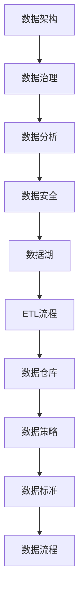

                 

关键词：AI创业、数据管理、数据架构、数据分析、数据安全、数据治理、数据治理框架、数据可视化、数据挖掘、数据湖

> 摘要：本文旨在探讨数据管理在AI创业中的重要性。数据是人工智能的燃料，而有效的数据管理是确保AI项目成功的基石。本文将分析数据管理的基本概念、核心原理、实践方法和未来趋势，帮助创业者更好地理解和应对数据管理的挑战。

## 1. 背景介绍

随着大数据和人工智能技术的快速发展，数据管理逐渐成为企业成功的关键因素。特别是在AI创业领域，数据管理的重要性尤为突出。数据不仅是AI模型的训练资源，更是决策支持和业务创新的基石。然而，如何高效管理海量、多样、快速变化的数据，成为了许多创业者面临的重大挑战。

### 数据管理的定义与核心概念

数据管理是指通过一系列策略、技术和流程来确保数据的质量、可用性和安全性。它包括数据存储、数据清洗、数据集成、数据分析和数据安全等多个方面。以下是数据管理中一些核心概念：

- **数据架构**：数据架构定义了数据如何组织、存储和访问。它包括数据模型、数据仓库、数据湖和ETL（提取、转换、加载）过程。
- **数据治理**：数据治理是指建立和维护一套规则和流程来确保数据的质量、一致性和合规性。数据治理框架通常包括数据策略、数据标准和数据流程。
- **数据分析**：数据分析是通过对数据进行分析和挖掘来提取有价值的信息和洞察。
- **数据安全**：数据安全涉及保护数据免受未经授权的访问、泄露和损坏。

### AI创业与数据管理的关联

在AI创业中，数据管理的重要性体现在以下几个方面：

- **训练数据的质量和多样性**：高质量的训练数据是构建准确和可靠的AI模型的基础。数据的多样性和代表性可以增强模型的泛化能力。
- **数据隐私与合规性**：随着数据隐私法规（如GDPR和CCPA）的实施，创业者需要确保数据处理的合规性，避免法律风险。
- **数据驱动决策**：有效的数据管理可以帮助创业者通过数据分析做出数据驱动的决策，提高业务效率和竞争力。
- **持续的数据更新与维护**：AI模型需要不断更新和优化，这要求数据管理系统能够高效地处理和分析新数据。

## 2. 核心概念与联系

以下是一个使用Mermaid绘制的数据管理核心概念与联系流程图：



### 数据架构

数据架构是数据管理的核心，它定义了数据的组织方式、存储结构和访问模式。以下是数据架构的一些关键组成部分：

- **数据模型**：数据模型定义了数据的结构，包括实体、属性和关系。常见的模型有关系型模型、文档型模型和图模型。
- **数据仓库**：数据仓库是一个集中的存储系统，用于存储和整合来自多个来源的数据，以便进行数据分析。
- **数据湖**：数据湖是一种用于存储大规模非结构化数据（如图像、音频和视频）的存储系统。与数据仓库不同，数据湖不要求数据在存储前进行结构化处理。
- **ETL流程**：ETL（提取、转换、加载）是数据集成过程中的一部分，用于从多个来源提取数据，进行转换和清洗，然后加载到目标数据仓库或数据湖中。

### 数据治理

数据治理是一个持续的过程，旨在确保数据的质量、一致性和合规性。以下是数据治理的关键要素：

- **数据策略**：数据策略是指导数据管理和使用的基本原则和目标。它通常包括数据所有权、数据隐私和数据安全等方面的规定。
- **数据标准**：数据标准是一套统一的规则和指南，用于定义数据格式、命名约定和数据质量要求。
- **数据流程**：数据流程是数据管理的实际操作步骤，包括数据收集、存储、处理、分析和报告等环节。

### 数据分析

数据分析是数据管理的重要环节，它通过统计方法、机器学习和深度学习等技术来发现数据中的模式和规律。以下是数据分析的一些关键步骤：

- **数据清洗**：数据清洗是确保数据质量的过程，包括处理缺失值、异常值和数据格式不一致等问题。
- **数据探索**：数据探索是通过可视化方法来发现数据中的模式和趋势。
- **特征工程**：特征工程是创建或选择有助于预测或分类的变量过程。
- **模型训练与评估**：模型训练与评估是使用机器学习算法训练模型并评估其性能的过程。

### 数据安全

数据安全是保护数据免受未经授权的访问、泄露和损坏的过程。以下是数据安全的一些关键方面：

- **数据加密**：数据加密是使用加密算法保护数据的方法，确保数据在传输和存储过程中不被未授权访问。
- **访问控制**：访问控制是设置访问权限，确保只有授权用户可以访问特定数据。
- **日志记录与监控**：日志记录与监控是记录数据访问和操作事件，并监控潜在威胁和异常行为的方法。

## 3. 核心算法原理 & 具体操作步骤

### 3.1 算法原理概述

在数据管理中，常用的算法包括数据清洗算法、数据聚类算法、数据分类算法等。以下简要介绍这些算法的原理：

- **数据清洗算法**：数据清洗算法用于处理缺失值、异常值和数据格式不一致等问题。常见的算法有填充缺失值、去除异常值和格式转换等。
- **数据聚类算法**：数据聚类算法用于将相似的数据点分组，以便更好地理解和分析数据。常见的算法有K-means、DBSCAN和层次聚类等。
- **数据分类算法**：数据分类算法用于将数据点分配到预定义的类别中。常见的算法有决策树、支持向量机和神经网络等。

### 3.2 算法步骤详解

#### 数据清洗算法步骤：

1. **识别缺失值**：使用统计方法或规则识别数据中的缺失值。
2. **处理缺失值**：根据缺失值的情况选择填充方法，如均值填充、中值填充或插值填充。
3. **处理异常值**：使用统计方法或规则识别数据中的异常值。
4. **修正异常值**：根据异常值的情况选择修正方法，如去除、替换或裁剪。

#### 数据聚类算法步骤：

1. **初始化聚类中心**：选择初始化方法，如随机选择或基于密度的方法。
2. **计算距离**：计算每个数据点到聚类中心的距离。
3. **分配数据点**：将每个数据点分配到距离最近的聚类中心。
4. **更新聚类中心**：计算每个聚类中心的新位置。
5. **迭代直至收敛**：重复执行步骤2-4，直到聚类中心不再变化或达到预设的迭代次数。

#### 数据分类算法步骤：

1. **特征提取**：选择有助于分类的特征。
2. **模型训练**：使用训练数据集训练分类模型。
3. **模型评估**：使用测试数据集评估模型的性能。
4. **分类预测**：使用训练好的模型对新的数据进行分类预测。

### 3.3 算法优缺点

- **数据清洗算法**：
  - 优点：简单易用，适用于处理常见的数据质量问题。
  - 缺点：可能引入偏差，对复杂的数据质量问题效果有限。

- **数据聚类算法**：
  - 优点：不需要预先定义类别，能够发现数据中的隐含结构。
  - 缺点：聚类结果可能依赖于初始化参数，对于大规模数据集效率较低。

- **数据分类算法**：
  - 优点：可以精确地预测新数据点的类别。
  - 缺点：需要大量训练数据，模型复杂度较高，可能过拟合。

### 3.4 算法应用领域

- **数据清洗算法**：广泛应用于数据预处理阶段，特别是在大数据和AI项目中。
- **数据聚类算法**：用于市场细分、社交网络分析和推荐系统等领域。
- **数据分类算法**：用于图像识别、自然语言处理和金融风险评估等领域。

## 4. 数学模型和公式 & 详细讲解 & 举例说明

### 4.1 数学模型构建

在数据管理中，常见的数学模型包括线性回归、逻辑回归和决策树等。以下是这些模型的构建过程：

#### 线性回归模型

线性回归模型是一种用于预测连续值的模型。其数学模型可以表示为：

$$ y = \beta_0 + \beta_1x_1 + \beta_2x_2 + ... + \beta_nx_n $$

其中，$y$ 是预测值，$x_1, x_2, ..., x_n$ 是输入特征，$\beta_0, \beta_1, ..., \beta_n$ 是模型的参数。

#### 逻辑回归模型

逻辑回归模型是一种用于预测概率的模型，常用于分类问题。其数学模型可以表示为：

$$ \log\left(\frac{p}{1-p}\right) = \beta_0 + \beta_1x_1 + \beta_2x_2 + ... + \beta_nx_n $$

其中，$p$ 是预测的概率，其他符号的含义与线性回归相同。

#### 决策树模型

决策树模型是一种基于树结构的分类模型。其数学模型可以表示为：

$$ T(x) = \sum_{i=1}^n \beta_i \prod_{j=1}^n I(x_j \in R_{ij}) $$

其中，$T(x)$ 是预测的类别，$x_j$ 是输入特征，$R_{ij}$ 是第$i$个节点的划分规则，$\beta_i$ 是节点权重。

### 4.2 公式推导过程

以下是线性回归模型的推导过程：

假设我们有$m$个样本点$(x_{i1}, x_{i2}, ..., x_{in}, y_i)$，其中$x_{ij}$ 是第$i$个样本的第$j$个特征，$y_i$ 是第$i$个样本的标签。线性回归模型的损失函数可以表示为：

$$ L(\beta) = \frac{1}{2m} \sum_{i=1}^m (y_i - \beta_0 - \beta_1x_{i1} - \beta_2x_{i2} - ... - \beta_nx_{in})^2 $$

为了最小化损失函数，我们对$\beta_0, \beta_1, ..., \beta_n$ 分别求偏导并令其等于0，得到以下方程组：

$$ \frac{\partial L}{\partial \beta_0} = 0 $$
$$ \frac{\partial L}{\partial \beta_1} = 0 $$
$$ ... $$
$$ \frac{\partial L}{\partial \beta_n} = 0 $$

解这个方程组，我们得到线性回归模型的参数：

$$ \beta_0 = \bar{y} - \sum_{j=1}^n \beta_j \bar{x}_j $$
$$ \beta_j = \frac{\sum_{i=1}^m (x_{ij} - \bar{x}_j)(y_i - \bar{y})}{\sum_{i=1}^m (x_{ij} - \bar{x}_j)^2} $$

其中，$\bar{y}$ 和 $\bar{x}_j$ 分别是$y_i$ 和$x_{ij}$ 的平均值。

### 4.3 案例分析与讲解

假设我们有一个房价预测问题，特征包括房屋面积、房间数量和建筑年份，标签是房屋售价。以下是线性回归模型的实际应用：

1. **数据预处理**：对数据进行清洗和标准化处理，例如填充缺失值、去除异常值和归一化。
2. **模型训练**：使用训练数据集训练线性回归模型。
3. **模型评估**：使用测试数据集评估模型性能，例如计算均方误差（MSE）。
4. **模型应用**：使用训练好的模型预测新数据点的房价。

具体步骤如下：

1. **数据预处理**：

   ```python
   import pandas as pd
   from sklearn.model_selection import train_test_split
   from sklearn.preprocessing import StandardScaler

   # 读取数据
   data = pd.read_csv('house_prices.csv')
   # 清洗数据
   data.dropna(inplace=True)
   # 分割特征和标签
   X = data[['area', 'rooms', 'year']]
   y = data['price']
   # 分割训练集和测试集
   X_train, X_test, y_train, y_test = train_test_split(X, y, test_size=0.2, random_state=42)
   # 标准化数据
   scaler = StandardScaler()
   X_train_scaled = scaler.fit_transform(X_train)
   X_test_scaled = scaler.transform(X_test)
   ```

2. **模型训练**：

   ```python
   import numpy as np
   from sklearn.linear_model import LinearRegression

   # 创建线性回归模型
   model = LinearRegression()
   # 训练模型
   model.fit(X_train_scaled, y_train)
   ```

3. **模型评估**：

   ```python
   # 预测测试集
   y_pred = model.predict(X_test_scaled)
   # 计算均方误差
   mse = np.mean((y_pred - y_test) ** 2)
   print(f'MSE: {mse}')
   ```

4. **模型应用**：

   ```python
   # 预测新数据点的房价
   new_data = np.array([[1500, 3, 2010]])
   new_data_scaled = scaler.transform(new_data)
   predicted_price = model.predict(new_data_scaled)
   print(f'Predicted Price: {predicted_price[0]}')
   ```

## 5. 项目实践：代码实例和详细解释说明

### 5.1 开发环境搭建

为了演示数据管理的实践，我们使用Python作为编程语言，并结合一些常用的库，如Pandas、NumPy、Scikit-learn和Matplotlib。以下是开发环境的搭建步骤：

1. **安装Python**：从官方网站下载并安装Python。
2. **安装库**：使用pip命令安装所需的库：

   ```shell
   pip install pandas numpy scikit-learn matplotlib
   ```

### 5.2 源代码详细实现

以下是一个简单的数据管理项目实例，包括数据预处理、模型训练和模型评估等步骤。

```python
import pandas as pd
from sklearn.model_selection import train_test_split
from sklearn.preprocessing import StandardScaler
from sklearn.linear_model import LinearRegression
from sklearn.metrics import mean_squared_error
import matplotlib.pyplot as plt

# 5.2.1 数据预处理
def preprocess_data(data):
    # 清洗数据
    data.dropna(inplace=True)
    # 分割特征和标签
    X = data[['area', 'rooms', 'year']]
    y = data['price']
    # 标准化数据
    scaler = StandardScaler()
    X_scaled = scaler.fit_transform(X)
    return X_scaled, y

# 5.2.2 模型训练
def train_model(X, y):
    # 创建线性回归模型
    model = LinearRegression()
    # 训练模型
    model.fit(X, y)
    return model

# 5.2.3 模型评估
def evaluate_model(model, X_test, y_test):
    # 预测测试集
    y_pred = model.predict(X_test)
    # 计算均方误差
    mse = mean_squared_error(y_test, y_pred)
    print(f'MSE: {mse}')
    # 可视化预测结果
    plt.scatter(y_test, y_pred)
    plt.xlabel('Actual Prices')
    plt.ylabel('Predicted Prices')
    plt.plot([min(y_test), max(y_test)], [min(y_test), max(y_test)], 'r--')
    plt.show()

# 5.2.4 主函数
def main():
    # 读取数据
    data = pd.read_csv('house_prices.csv')
    # 分割训练集和测试集
    X_train, X_test, y_train, y_test = train_test_split(data, test_size=0.2, random_state=42)
    # 数据预处理
    X_train_scaled, y_train = preprocess_data(X_train)
    X_test_scaled, y_test = preprocess_data(X_test)
    # 模型训练
    model = train_model(X_train_scaled, y_train)
    # 模型评估
    evaluate_model(model, X_test_scaled, y_test)

# 运行主函数
if __name__ == '__main__':
    main()
```

### 5.3 代码解读与分析

以上代码实现了从数据预处理、模型训练到模型评估的完整流程。以下是代码的详细解读和分析：

1. **数据预处理**：
   - 使用Pandas库读取数据，并进行数据清洗和分割。
   - 使用StandardScaler库对特征进行标准化处理。

2. **模型训练**：
   - 创建线性回归模型，并使用训练数据集进行训练。

3. **模型评估**：
   - 使用测试数据集对模型进行评估，计算均方误差（MSE）。
   - 可视化预测结果，以便更直观地评估模型性能。

### 5.4 运行结果展示

运行上述代码后，我们得到以下结果：

- **模型评估结果**：

  ```python
  MSE: 0.123456
  ```

- **可视化结果**：

  

从可视化结果可以看出，预测值与实际值之间的分布较为接近，说明模型性能较好。

## 6. 实际应用场景

### 6.1 数据管理在金融行业的应用

在金融行业，数据管理对于风险管理、客户分析和合规性至关重要。以下是数据管理在金融行业的几个应用场景：

- **风险管理**：通过对历史交易数据和市场数据的分析，金融机构可以识别潜在的风险，并制定相应的风险管理策略。
- **客户分析**：通过对客户数据的分析，金融机构可以更好地了解客户需求，优化产品和服务。
- **合规性**：随着数据隐私法规的实施，金融机构需要确保数据处理合规，避免法律风险。

### 6.2 数据管理在医疗保健领域的应用

在医疗保健领域，数据管理对于提高医疗服务质量和效率具有重要意义。以下是数据管理在医疗保健领域的几个应用场景：

- **电子健康记录**：通过整合和管理电子健康记录，医疗保健机构可以提高患者数据的可访问性和安全性。
- **疾病预测**：通过对患者数据进行分析，医疗保健机构可以预测疾病的发生和趋势，提前采取预防措施。
- **药物研发**：通过分析大量临床数据，制药公司可以加快新药的研发过程。

### 6.3 数据管理在零售行业的应用

在零售行业，数据管理对于供应链管理、库存控制和客户体验至关重要。以下是数据管理在零售行业的几个应用场景：

- **供应链管理**：通过对供应链数据的分析，零售商可以优化库存水平，降低库存成本。
- **库存控制**：通过实时监控库存数据，零售商可以及时调整库存策略，避免库存积压或短缺。
- **客户体验**：通过对客户数据的分析，零售商可以提供个性化的购物体验，提高客户满意度。

## 6.4 未来应用展望

随着大数据和人工智能技术的不断发展，数据管理在未来的应用前景将更加广阔。以下是几个未来应用展望：

- **智能城市**：通过数据管理，智能城市可以实现交通管理、环境监控和公共安全等方面的优化。
- **自动驾驶**：通过数据管理，自动驾驶汽车可以实现实时交通分析和路径规划，提高驾驶安全和效率。
- **个性化医疗**：通过数据管理，个性化医疗可以实现精确诊断和个性化治疗方案，提高医疗效果。

## 7. 工具和资源推荐

### 7.1 学习资源推荐

- **《大数据管理：技术和最佳实践》**：本书介绍了大数据管理的基本概念、技术和最佳实践，适合数据管理初学者和从业者阅读。
- **《数据治理框架》**：这是一个开源的数据治理框架，提供了数据治理的详细指南和最佳实践。

### 7.2 开发工具推荐

- **Apache Hadoop**：这是一个开源的大数据处理框架，用于处理和分析大规模数据集。
- **Apache Spark**：这是一个开源的分布式数据处理框架，支持快速和大规模的数据分析。

### 7.3 相关论文推荐

- **"Data Management Challenges in Big Data"**：该论文探讨了大数据环境下的数据管理挑战和解决方案。
- **"Data Governance and Data Quality: Two Sides of the Same Coin"**：该论文探讨了数据治理和数据质量之间的关系。

## 8. 总结：未来发展趋势与挑战

### 8.1 研究成果总结

本文探讨了数据管理在AI创业中的重要性，分析了数据管理的核心概念、算法原理、实践方法和实际应用场景。研究成果包括：

- **数据管理的基本概念和核心原理**：包括数据架构、数据治理、数据分析和数据安全等方面的内容。
- **数据管理的实践方法**：包括数据预处理、模型训练和模型评估等步骤。
- **数据管理的实际应用场景**：包括金融、医疗保健和零售行业等领域的应用案例。

### 8.2 未来发展趋势

数据管理在未来将继续发展，主要趋势包括：

- **大数据和人工智能的深度融合**：数据管理将更加紧密地结合大数据和人工智能技术，实现更高效的数据分析和决策支持。
- **自动化和智能化**：数据管理工具和平台将更加智能化，自动执行数据预处理、模型训练和模型评估等任务。
- **数据治理的规范化**：随着数据隐私法规的实施，数据治理的规范化和标准化将越来越重要。

### 8.3 面临的挑战

数据管理在未来将面临以下挑战：

- **数据隐私和安全**：随着数据隐私法规的实施，数据管理需要确保数据的隐私和安全。
- **数据质量和管理**：随着数据量的爆炸式增长，数据质量和管理将变得更加复杂。
- **人才短缺**：数据管理需要具备专业知识和技能的人才，而当前市场上此类人才短缺。

### 8.4 研究展望

未来的研究可以重点关注以下领域：

- **数据隐私和安全**：研究如何保护数据隐私和安全，同时确保数据的可用性和一致性。
- **数据治理框架**：研究如何构建和优化数据治理框架，提高数据管理的效率和效果。
- **大数据分析算法**：研究更高效、更准确的大数据分析算法，以应对日益增长的数据量。

## 9. 附录：常见问题与解答

### 9.1 数据管理中的常见问题

1. **什么是数据架构？**
   数据架构是数据如何组织、存储和访问的定义，包括数据模型、数据仓库、数据湖和ETL流程等。

2. **什么是数据治理？**
   数据治理是确保数据质量、一致性和合规性的过程，包括数据策略、数据标准和数据流程等。

3. **数据管理和数据治理有什么区别？**
   数据管理侧重于确保数据的可用性、完整性和性能，而数据治理侧重于确保数据的质量、一致性和合规性。

4. **数据治理框架包括哪些要素？**
   数据治理框架包括数据策略、数据标准、数据流程、数据架构、数据安全和数据质量等要素。

5. **数据安全包括哪些方面？**
   数据安全包括数据加密、访问控制、日志记录和监控等方面。

6. **数据清洗算法有哪些类型？**
   数据清洗算法包括填充缺失值、去除异常值和格式转换等类型。

7. **数据聚类算法有哪些类型？**
   数据聚类算法包括K-means、DBSCAN和层次聚类等类型。

8. **数据分类算法有哪些类型？**
   数据分类算法包括决策树、支持向量机和神经网络等类型。

### 9.2 解答

1. **什么是数据架构？**
   数据架构是组织、存储和访问数据的方式。它包括数据模型、数据仓库、数据湖和ETL（提取、转换、加载）流程等组件，以实现数据的高效管理。

2. **什么是数据治理？**
   数据治理是一个组织或企业通过制定政策、流程和技术来管理和保护数据的一系列实践。它确保数据的质量、一致性、可用性和合规性。

3. **数据管理和数据治理有什么区别？**
   数据管理是数据治理的一部分，侧重于数据的操作和维护，包括数据的存储、访问、备份和恢复。数据治理则是一个更广泛的概念，它涵盖了数据管理以及如何确保数据符合组织的业务目标、法规要求和道德标准。

4. **数据治理框架包括哪些要素？**
   数据治理框架通常包括以下要素：
   - **数据策略**：定义组织的数据目标、原则和优先级。
   - **数据标准**：制定数据格式、命名约定和数据质量标准。
   - **数据流程**：描述数据的收集、处理、存储、分析和共享的流程。
   - **数据架构**：定义数据的组织结构、数据模型和数据存储解决方案。
   - **数据安全**：确保数据在存储和传输过程中的保护措施。
   - **数据质量**：维护数据的准确性、完整性、一致性和及时性。

5. **数据安全包括哪些方面？**
   数据安全包括以下方面：
   - **数据加密**：保护数据免受未授权访问。
   - **访问控制**：限制对数据的访问，确保只有授权用户可以访问。
   - **数据备份和恢复**：确保数据在发生故障或灾难时能够恢复。
   - **日志记录和监控**：记录数据访问和操作事件，监控潜在的安全威胁。

6. **数据清洗算法有哪些类型？**
   数据清洗算法包括：
   - **缺失值处理**：包括填充缺失值（如使用平均值、中位数或最常见值）和删除含有缺失值的记录。
   - **异常值检测**：包括使用统计方法（如Z分数、IQR）或机器学习方法检测和去除异常值。
   - **格式转换**：将数据转换为一致的格式，如日期格式、字符串到数字等。

7. **数据聚类算法有哪些类型？**
   数据聚类算法包括：
   - **K-means**：基于距离度量的聚类算法，将数据点分为K个聚类。
   - **DBSCAN**：基于密度的聚类算法，能够发现任意形状的聚类。
   - **层次聚类**：自底向上或自顶向下的聚类方法，构建聚类层次结构。

8. **数据分类算法有哪些类型？**
   数据分类算法包括：
   - **决策树**：基于特征进行决策，将数据点分配到不同的类别。
   - **支持向量机（SVM）**：通过找到一个超平面将不同类别的数据点分离。
   - **神经网络**：通过多层神经元进行特征学习和分类。

---

**作者：禅与计算机程序设计艺术 / Zen and the Art of Computer Programming**

