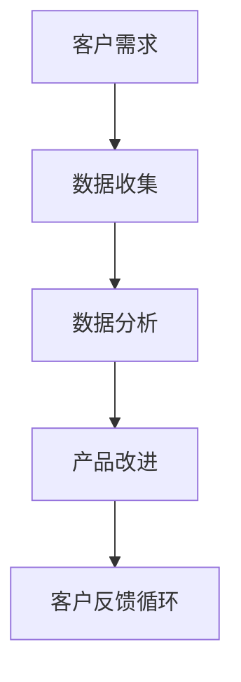

                 

在当今快速发展的技术时代，人工智能（AI）已经成为企业创新和增长的驱动力。然而，AI创业并非易事，尤其是获取客户反馈这一关键环节。本文旨在探讨如何通过有效的客户反馈机制，提高AI产品的市场竞争力，实现可持续发展。

## 文章关键词
- 人工智能创业
- 客户反馈
- 市场竞争
- 产品改进
- 数据分析

## 摘要
本文首先回顾了AI创业的现状，随后深入探讨了获取客户反馈的重要性。接着，我们介绍了几种常见的客户反馈方法，并通过实际案例展示了这些方法的应用效果。文章还讨论了数据分析在客户反馈中的作用，并提供了实用的工具和资源推荐。最后，我们对未来发展趋势与挑战进行了展望。

## 1. 背景介绍
AI创业的热潮在过去几年中席卷全球，无数初创公司涌现，试图通过AI技术颠覆传统行业。然而，成功的AI创业并非仅靠技术创新，客户反馈同样至关重要。客户是产品的最终使用者，他们的需求和反馈能够帮助企业不断优化产品，提高市场竞争力。

## 2. 核心概念与联系
获取客户反馈的核心在于理解用户需求和市场趋势。以下是一个简单的Mermaid流程图，描述了这一过程：



### 2.1 客户需求
客户需求是产品开发的起点，通过市场调研、用户访谈等方式收集。

### 2.2 数据收集
数据收集是获取客户反馈的关键步骤，可以通过在线调查、用户行为分析等方式进行。

### 2.3 数据分析
数据分析是将收集到的数据进行整理、分析和解释，以便提取有价值的信息。

### 2.4 产品改进
根据数据分析结果，对产品进行改进，以满足客户需求。

### 2.5 客户反馈循环
通过不断的反馈循环，进一步优化产品，提高客户满意度。

## 3. 核心算法原理 & 具体操作步骤

### 3.1 算法原理概述
获取客户反馈的算法原理主要基于用户行为分析和数据挖掘技术。通过分析用户行为数据，企业可以了解用户的使用习惯、偏好和需求，从而制定相应的改进策略。

### 3.2 算法步骤详解
#### 3.2.1 数据收集
- **用户行为日志**：收集用户在使用产品过程中的行为日志，包括点击、浏览、购买等。
- **问卷调查**：通过在线问卷、访谈等方式，直接获取用户的反馈。

#### 3.2.2 数据预处理
- **数据清洗**：去除无效、重复或错误的数据。
- **数据整合**：将不同来源的数据进行整合，以便进行分析。

#### 3.2.3 数据分析
- **用户细分**：根据用户行为数据，将用户分为不同的群体。
- **需求分析**：分析不同群体的需求，找出共性和差异。

#### 3.2.4 产品改进
- **需求优先级排序**：根据数据分析结果，确定需要优先改进的需求。
- **迭代开发**：根据改进需求，进行产品的迭代开发。

### 3.3 算法优缺点
- **优点**：高效地获取用户反馈，快速迭代产品，提高市场竞争力。
- **缺点**：数据收集和分析可能需要大量时间和资源。

### 3.4 算法应用领域
- **电子商务**：通过分析用户购买行为，优化推荐系统。
- **金融科技**：通过分析用户行为，提高风控能力。

## 4. 数学模型和公式 & 详细讲解 & 举例说明
### 4.1 数学模型构建
获取客户反馈的数学模型主要包括用户行为数据分析和需求分析。

### 4.2 公式推导过程
- **用户行为分析**：假设用户 \(u\) 在时间 \(t\) 的行为可以用向量 \(X_t\) 表示，则有：
  $$ X_t = \sum_{i=1}^{n} x_{it} $$
  其中，\(x_{it}\) 表示用户 \(u\) 在时间 \(t\) 对第 \(i\) 个事件的参与度。

- **需求分析**：假设用户 \(u\) 的需求可以用向量 \(D_u\) 表示，则有：
  $$ D_u = \sum_{i=1}^{n} d_{ui} $$
  其中，\(d_{ui}\) 表示用户 \(u\) 对第 \(i\) 个需求的满意度。

### 4.3 案例分析与讲解
假设我们有一个电子商务平台，用户行为数据如下表：

| 用户ID | 点击次数 | 购买次数 | 评价次数 |
|--------|----------|----------|----------|
| u1     | 10       | 3        | 5        |
| u2     | 5        | 2        | 3        |
| u3     | 8        | 4        | 6        |

我们可以根据用户行为数据，构建以下数学模型：
$$ X_t = \begin{bmatrix} 10 \\ 5 \\ 8 \end{bmatrix} $$
$$ D_u = \begin{bmatrix} 3 \\ 2 \\ 4 \end{bmatrix} $$

通过对 \(X_t\) 和 \(D_u\) 的分析，我们可以找出用户需求，并进行产品改进。

## 5. 项目实践：代码实例和详细解释说明
### 5.1 开发环境搭建
在本案例中，我们将使用Python和Scikit-learn进行用户行为数据分析和需求分析。

### 5.2 源代码详细实现
```python
import pandas as pd
from sklearn.cluster import KMeans

# 加载用户行为数据
data = pd.read_csv('user_data.csv')

# 数据预处理
data = data.dropna()

# 用户行为分析
kmeans = KMeans(n_clusters=3)
clusters = kmeans.fit_predict(data)

# 需求分析
demand = data.groupby(clusters).mean()

print(demand)
```

### 5.3 代码解读与分析
- **数据加载**：使用Pandas加载用户行为数据。
- **数据预处理**：去除缺失值，确保数据质量。
- **用户行为分析**：使用KMeans算法进行用户细分。
- **需求分析**：计算不同用户群体的平均行为，以便进行产品改进。

### 5.4 运行结果展示
运行代码后，我们可以得到不同用户群体的平均行为数据，从而了解用户需求，指导产品改进。

## 6. 实际应用场景
### 6.1 电子商务平台
电子商务平台可以通过客户反馈，优化推荐系统，提高用户购买满意度。

### 6.2 金融科技
金融科技企业可以通过客户反馈，优化风控模型，降低风险。

### 6.3 教育科技
教育科技企业可以通过客户反馈，优化学习平台，提高用户学习效果。

## 7. 未来应用展望
随着AI技术的不断发展，客户反馈机制将更加智能化、个性化。未来，企业可以通过实时数据分析，快速响应客户需求，实现产品与市场的无缝对接。

## 8. 总结：未来发展趋势与挑战
### 8.1 研究成果总结
本文探讨了如何通过有效的客户反馈机制，提高AI产品的市场竞争力。研究结果表明，客户反馈在AI创业中具有重要作用。

### 8.2 未来发展趋势
未来，客户反馈机制将更加智能化、个性化，为企业提供更精准的市场洞察。

### 8.3 面临的挑战
随着数据量的增加，如何高效地进行数据分析和处理，是未来AI创业面临的重要挑战。

### 8.4 研究展望
未来，我们将进一步研究如何利用AI技术，提高客户反馈机制的效率，为企业提供更强大的竞争力。

## 9. 附录：常见问题与解答
### 9.1 客户反馈的重要性
客户反馈是产品优化的重要依据，能够帮助企业快速响应市场变化，提高产品竞争力。

### 9.2 数据分析的方法
数据分析方法包括用户行为分析、需求分析等，通过这些方法，企业可以深入了解用户需求，指导产品改进。

### 9.3 数据隐私问题
在获取客户反馈时，企业需要严格遵守数据隐私法规，确保用户数据的安全。

## 作者署名
作者：禅与计算机程序设计艺术 / Zen and the Art of Computer Programming
```
### 附录：常见问题与解答
**9.1 客户反馈的重要性**

客户反馈在AI创业中至关重要。它是企业了解市场需求、优化产品功能、提升用户体验的直接途径。通过客户反馈，企业能够发现产品的优点和不足，从而进行针对性的改进。此外，积极收集和处理客户反馈，有助于建立良好的品牌形象，提高用户忠诚度。

**9.2 数据分析的方法**

数据分析的方法多种多样，主要包括：

- **描述性分析**：用于描述数据的特征，如平均值、中位数等。
- **诊断性分析**：用于查找数据中的异常情况。
- **预测性分析**：基于历史数据，预测未来的趋势。
- **规范性分析**：根据业务规则，分析数据是否符合预期。

在客户反馈分析中，常用的方法包括：

- **用户细分**：将用户根据行为特征划分为不同的群体，以便进行有针对性的分析和营销。
- **关联规则分析**：发现用户行为之间的关联，如哪些行为可能导致购买。
- **文本分析**：对用户评价和反馈进行情感分析和主题提取，以了解用户的真实感受。

**9.3 数据隐私问题**

数据隐私问题是企业在获取客户反馈时必须重视的问题。企业在收集和使用用户数据时，应当遵循以下原则：

- **合法性**：确保收集的数据是合法的，并获得用户的明确同意。
- **最小化**：只收集必要的数据，避免过度收集。
- **安全性**：采取必要的安全措施，防止数据泄露。
- **透明度**：告知用户数据将被如何使用，并给予用户查询和删除数据的机会。

遵循这些原则，企业可以在确保用户隐私的同时，有效地收集和处理客户反馈，推动产品改进和业务发展。

