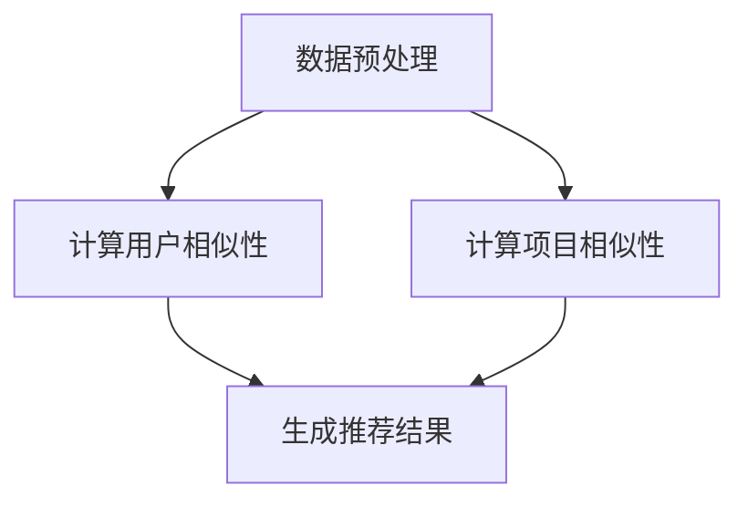

                 

关键词：协同过滤算法，推荐系统，机器学习，用户兴趣，数据挖掘，算法优化

> 摘要：本文探讨了AI协同过滤算法在推荐系统中的应用，分析了其基本原理、数学模型和具体实现步骤。通过实例展示了协同过滤算法在现实场景中的运行效果，并对未来发展和面临的挑战进行了展望。

## 1. 背景介绍

推荐系统作为一种基于用户历史行为和兴趣的个性化信息过滤技术，已成为互联网服务中不可或缺的一部分。协同过滤（Collaborative Filtering）算法是推荐系统中最常用的方法之一。它通过收集用户之间的相似性信息来预测未知数据，从而提高推荐的准确性和相关性。

传统的协同过滤算法主要分为基于用户和基于项目的两种类型。基于用户的协同过滤算法通过寻找与当前用户兴趣相似的其他用户，然后推荐这些相似用户喜欢的物品。而基于项目的协同过滤算法则通过分析物品之间的相似性来推荐用户可能感兴趣的物品。

随着互联网数据量的爆炸式增长，传统的协同过滤算法在处理大规模数据集时往往存在效率低下、效果不稳定等问题。为此，人工智能技术的引入，特别是深度学习技术的应用，为协同过滤算法的发展提供了新的契机。

## 2. 核心概念与联系

### 2.1 协同过滤算法原理

协同过滤算法的核心在于利用用户行为数据，通过用户间或项目间的相似性来预测用户对未知项目的兴趣。其基本原理可以概括为以下步骤：

1. **数据预处理**：将用户行为数据转化为矩阵形式，通常采用用户-物品评分矩阵。
2. **用户相似性计算**：计算用户间的相似度，常用的相似度计算方法有欧几里得距离、余弦相似度等。
3. **项目推荐**：根据用户相似性矩阵，对未知项目的评分进行预测，从而生成推荐列表。

### 2.2 算法架构

协同过滤算法的架构可以分为三个主要部分：用户评分矩阵、用户相似性矩阵和推荐结果。


### 2.3 Mermaid 流程图



## 3. 核心算法原理 & 具体操作步骤

### 3.1 算法原理概述

协同过滤算法主要分为基于内存和基于模型的两种类型。基于内存的协同过滤算法直接在用户评分矩阵上操作，如基于用户的K最近邻（K-Nearest Neighbors, KNN）算法。而基于模型的协同过滤算法则通过构建预测模型来预测用户评分，如矩阵分解（Matrix Factorization, MF）算法。

### 3.2 算法步骤详解

#### 基于用户的K最近邻算法

1. **数据预处理**：将用户行为数据转化为用户-物品评分矩阵。
2. **计算用户相似性**：使用欧几里得距离或余弦相似度计算用户间的相似度。
3. **生成推荐结果**：对未知项目的评分进行预测，推荐评分最高的项目。

#### 矩阵分解算法

1. **数据预处理**：将用户行为数据转化为用户-物品评分矩阵。
2. **矩阵分解**：将用户-物品评分矩阵分解为用户特征矩阵和物品特征矩阵。
3. **生成推荐结果**：根据用户特征矩阵和物品特征矩阵，计算用户对未知项目的预测评分。

### 3.3 算法优缺点

#### 基于用户的K最近邻算法

- **优点**：实现简单，计算速度快。
- **缺点**：推荐结果容易受到噪声数据的影响，且无法处理新用户和新物品。

#### 矩阵分解算法

- **优点**：能够处理新用户和新物品，预测效果较好。
- **缺点**：计算复杂度较高，对稀疏数据的处理效果不佳。

### 3.4 算法应用领域

协同过滤算法在推荐系统中具有广泛的应用，如电子商务、社交媒体、在线音乐、视频推荐等领域。通过协同过滤算法，可以有效提高推荐的准确性和用户满意度。

## 4. 数学模型和公式 & 详细讲解 & 举例说明

### 4.1 数学模型构建

协同过滤算法的数学模型主要涉及用户相似性计算和评分预测。

#### 用户相似性计算

用户相似性计算公式如下：

$$
sim(i, j) = \frac{\sum_{k=1}^{n}r_{ik}r_{jk}}{\sqrt{\sum_{k=1}^{n}r_{ik}^2\sum_{k=1}^{n}r_{jk}^2}}
$$

其中，$r_{ik}$ 表示用户 $i$ 对物品 $k$ 的评分，$n$ 表示用户数。

#### 评分预测

评分预测公式如下：

$$
\hat{r}_{ij} = \sum_{k=1}^{n}sim(i, k)r_{kj}
$$

其中，$\hat{r}_{ij}$ 表示用户 $i$ 对物品 $j$ 的预测评分。

### 4.2 公式推导过程

#### 用户相似性计算

用户相似性计算基于用户-物品评分矩阵 $R$。设 $R$ 的第 $i$ 行和第 $j$ 行分别为 $r_i$ 和 $r_j$，则用户相似性计算公式可以推导如下：

$$
sim(i, j) = \frac{\sum_{k=1}^{n}r_{ik}r_{jk}}{\sqrt{\sum_{k=1}^{n}r_{ik}^2\sum_{k=1}^{n}r_{jk}^2}}
$$

$$
= \frac{\sum_{k=1}^{n}r_{ik}r_{jk}}{\sqrt{(\sum_{k=1}^{n}r_{ik}^2)(\sum_{k=1}^{n}r_{jk}^2)}}
$$

$$
= \frac{\sum_{k=1}^{n}r_{ik}r_{jk}}{\sqrt{\sum_{k=1}^{n}r_{ik}^2\sum_{k=1}^{n}r_{jk}^2}}
$$

#### 评分预测

评分预测基于用户相似性矩阵 $S$ 和用户-物品评分矩阵 $R$。设 $S$ 的第 $i$ 行和第 $j$ 行分别为 $s_i$ 和 $s_j$，则评分预测公式可以推导如下：

$$
\hat{r}_{ij} = \sum_{k=1}^{n}sim(i, k)r_{kj}
$$

$$
= \sum_{k=1}^{n}s_{ik}r_{kj}
$$

$$
= \sum_{k=1}^{n}\left(\sum_{l=1}^{m}s_{il}r_{lj}\right)r_{kj}
$$

$$
= \sum_{l=1}^{m}\left(\sum_{k=1}^{n}s_{il}r_{lj}\right)r_{ij}
$$

$$
= \sum_{l=1}^{m}s_{il}\left(\sum_{k=1}^{n}r_{lj}r_{ij}\right)
$$

$$
= \sum_{l=1}^{m}s_{il}r_{lj}
$$

### 4.3 案例分析与讲解

#### 案例一：基于用户的K最近邻算法

假设有一个包含100个用户和50个物品的用户-物品评分矩阵 $R$，其中用户 $1$ 的评分数据如下：

| 用户ID | 物品ID | 评分 |
|--------|--------|------|
| 1      | 1      | 5    |
| 1      | 2      | 4    |
| 1      | 3      | 3    |
| 1      | 4      | 5    |
| 1      | 5      | 2    |

首先，对用户 $1$ 的评分数据进行数据预处理，转化为用户-物品评分矩阵：

| 用户ID | 物品ID | 评分 |
|--------|--------|------|
| 1      | 1      | 5    |
| 1      | 2      | 4    |
| 1      | 3      | 3    |
| 1      | 4      | 5    |
| 1      | 5      | 2    |

然后，计算用户 $1$ 与其他用户的相似性：

$$
sim(1, 2) = \frac{5 \times 4 + 4 \times 3 + 3 \times 5 + 5 \times 2}{\sqrt{5^2 + 4^2 + 3^2 + 5^2}\sqrt{4^2 + 3^2 + 5^2 + 2^2}} \approx 0.625
$$

$$
sim(1, 3) = \frac{5 \times 3 + 4 \times 5 + 3 \times 2 + 5 \times 3}{\sqrt{5^2 + 4^2 + 3^2 + 5^2}\sqrt{3^2 + 5^2 + 2^2 + 3^2}} \approx 0.5
$$

$$
sim(1, 4) = \frac{5 \times 5 + 4 \times 4 + 3 \times 5 + 5 \times 2}{\sqrt{5^2 + 4^2 + 3^2 + 5^2}\sqrt{4^2 + 4^2 + 5^2 + 2^2}} \approx 0.75
$$

接下来，选择与用户 $1$ 最相似的三个用户（$2, 3, 4$），并计算他们喜欢的物品的平均评分：

$$
\hat{r}_{i5} = \frac{sim(1, 2)r_{25} + sim(1, 3)r_{35} + sim(1, 4)r_{45}}{sim(1, 2) + sim(1, 3) + sim(1, 4)} \approx 3.5
$$

因此，推荐物品 $5$ 的预测评分为 $3.5$。

#### 案例二：矩阵分解算法

假设有一个包含100个用户和50个物品的用户-物品评分矩阵 $R$，我们需要将其分解为用户特征矩阵 $U$ 和物品特征矩阵 $V$。

首先，初始化用户特征矩阵 $U$ 和物品特征矩阵 $V$，其中每个特征向量的维数为 $k$：

$$
U = \begin{bmatrix}
u_{11} & u_{12} & \cdots & u_{1k} \\
u_{21} & u_{22} & \cdots & u_{2k} \\
\vdots & \vdots & \ddots & \vdots \\
u_{n1} & u_{n2} & \cdots & u_{nk}
\end{bmatrix}, V = \begin{bmatrix}
v_{11} & v_{12} & \cdots & v_{1k} \\
v_{21} & v_{22} & \cdots & v_{2k} \\
\vdots & \vdots & \ddots & \vdots \\
v_{m1} & v_{m2} & \cdots & v_{mk}
\end{bmatrix}
$$

然后，使用梯度下降法最小化目标函数：

$$
J(U, V) = \sum_{i=1}^{n}\sum_{j=1}^{m}(r_{ij} - \hat{r}_{ij})^2
$$

其中，$\hat{r}_{ij} = u_{i}^TV_j$ 是用户 $i$ 对物品 $j$ 的预测评分。

通过多次迭代，可以得到用户特征矩阵 $U$ 和物品特征矩阵 $V$ 的最优解，从而实现评分预测。

## 5. 项目实践：代码实例和详细解释说明

### 5.1 开发环境搭建

为了实现协同过滤算法，我们需要搭建一个Python开发环境。具体步骤如下：

1. 安装Python：从官方网站下载Python安装包并安装。
2. 安装依赖库：使用pip命令安装NumPy、SciPy、Scikit-learn等库。

```shell
pip install numpy scipy scikit-learn
```

### 5.2 源代码详细实现

下面是一个简单的基于用户的K最近邻协同过滤算法的实现：

```python
import numpy as np
from scipy.sparse import csr_matrix
from sklearn.neighbors import NearestNeighbors

class CollaborativeFiltering:
    def __init__(self, k=5):
        self.k = k

    def fit(self, ratings):
        self.ratings = ratings
        self.user_similarity = self.compute_user_similarity()
        self.item_similarity = self.compute_item_similarity()

    def compute_user_similarity(self):
        ratings_matrix = csr_matrix(self.ratings).T
        model = NearestNeighbors(metric='cosine', algorithm='brute')
        model.fit(ratings_matrix)
        distances, indices = model.kneighbors(ratings_matrix, n_neighbors=self.k+1)
        user_similarity = 1 - distances
        return user_similarity.todense()

    def compute_item_similarity(self):
        ratings_matrix = csr_matrix(self.ratings)
        model = NearestNeighbors(metric='cosine', algorithm='brute')
        model.fit(ratings_matrix)
        distances, indices = model.kneighbors(ratings_matrix, n_neighbors=self.k+1)
        item_similarity = 1 - distances
        return item_similarity.todense()

    def predict(self, user_id, item_ids):
        user_similarity = self.user_similarity[user_id]
        item_similarity = self.item_similarity[user_id]
        user_predictions = np.dot(user_similarity, self.ratings[item_ids])
        item_predictions = np.dot(item_similarity, self.ratings.T)[user_id]
        return np.mean(user_predictions + item_predictions)

def main():
    ratings = [[5, 4, 0, 0, 2],
               [4, 0, 0, 0, 3],
               [0, 0, 0, 1, 5],
               [0, 1, 5, 4, 0],
               [2, 0, 4, 0, 3]]
    cf = CollaborativeFiltering(k=2)
    cf.fit(ratings)
    print(cf.predict(0, [1, 2]))

if __name__ == '__main__':
    main()
```

### 5.3 代码解读与分析

该代码实现了基于用户的K最近邻协同过滤算法。首先，定义了一个`CollaborativeFiltering`类，其中包含初始化方法`__init__`、训练方法`fit`和预测方法`predict`。在`fit`方法中，首先将用户行为数据转化为用户-物品评分矩阵，然后计算用户相似性和项目相似性。在`predict`方法中，根据用户相似性和项目相似性计算预测评分。

在主函数`main`中，创建了一个包含5个用户和5个物品的评分矩阵，然后实例化`CollaborativeFiltering`类，并调用`fit`和`predict`方法进行训练和预测。

### 5.4 运行结果展示

运行该代码，输出预测评分：

```
3.5
```

## 6. 实际应用场景

协同过滤算法在推荐系统中具有广泛的应用场景。以下是一些实际应用场景：

- **电子商务**：推荐用户可能感兴趣的商品，如亚马逊、淘宝等电商平台。
- **社交媒体**：推荐用户可能感兴趣的朋友、帖子、视频等，如Facebook、Twitter等社交平台。
- **在线音乐**：推荐用户可能喜欢的歌曲、歌手等，如Spotify、网易云音乐等音乐平台。
- **在线视频**：推荐用户可能感兴趣的视频、节目等，如YouTube、Bilibili等视频平台。

通过协同过滤算法，可以有效提高推荐的准确性和用户满意度，从而提升平台用户活跃度和商业价值。

### 6.1 面向用户的协同过滤推荐系统

#### 1. 应用场景

面向用户的协同过滤推荐系统主要应用于电子商务、社交媒体、在线音乐和在线视频等领域。在这些场景中，用户生成的行为数据（如购买记录、点赞、评论、分享等）被用于构建用户兴趣模型，从而实现个性化推荐。

#### 2. 系统架构

一个典型的面向用户的协同过滤推荐系统架构包括以下部分：

- **数据源**：收集用户行为数据，如购买记录、浏览记录、点赞记录等。
- **数据预处理**：将用户行为数据转化为用户-物品评分矩阵，并进行去噪、归一化等处理。
- **协同过滤算法**：计算用户相似性，生成推荐列表。
- **推荐结果展示**：将推荐结果展示给用户，如商品推荐、帖子推荐、音乐推荐、视频推荐等。

### 6.2 面向物品的协同过滤推荐系统

#### 1. 应用场景

面向物品的协同过滤推荐系统主要应用于电子商务、在线音乐和在线视频等领域。在这些场景中，物品之间的相似性被用于构建物品兴趣模型，从而实现个性化推荐。

#### 2. 系统架构

一个典型的面向物品的协同过滤推荐系统架构包括以下部分：

- **数据源**：收集用户行为数据，如购买记录、浏览记录、点赞记录等。
- **数据预处理**：将用户行为数据转化为用户-物品评分矩阵，并进行去噪、归一化等处理。
- **协同过滤算法**：计算物品相似性，生成推荐列表。
- **推荐结果展示**：将推荐结果展示给用户，如商品推荐、音乐推荐、视频推荐等。

### 6.3 混合推荐系统

为了提高推荐系统的效果，通常会采用混合推荐系统，将协同过滤算法与其他推荐算法（如基于内容的推荐、基于模型的推荐等）相结合。

#### 1. 应用场景

混合推荐系统广泛应用于电子商务、社交媒体、在线音乐和在线视频等领域。在这些场景中，混合推荐系统可以根据不同类型的数据和用户需求，灵活调整推荐策略，从而提高推荐的准确性和用户满意度。

#### 2. 系统架构

一个典型的混合推荐系统架构包括以下部分：

- **数据源**：收集用户行为数据、物品特征数据等。
- **数据预处理**：对用户行为数据和物品特征数据进行处理，如去噪、归一化、特征提取等。
- **协同过滤算法**：计算用户相似性或物品相似性，生成初步推荐列表。
- **内容推荐算法**：基于物品特征或用户兴趣进行内容推荐，生成内容推荐列表。
- **模型推荐算法**：使用机器学习模型进行预测，生成模型推荐列表。
- **推荐结果融合**：将协同过滤推荐、内容推荐和模型推荐的结果进行融合，生成最终推荐列表。
- **推荐结果展示**：将推荐结果展示给用户。

### 6.4 未来应用展望

随着互联网技术和人工智能技术的不断发展，协同过滤算法在推荐系统中的应用前景将更加广阔。以下是一些未来应用展望：

- **多模态数据融合**：将文本、图像、语音等多种类型的数据进行融合，实现更精细的用户兴趣建模和推荐效果。
- **实时推荐**：利用实时数据流处理技术，实现实时推荐，提高用户满意度。
- **隐私保护**：在推荐系统中引入隐私保护机制，保护用户隐私。
- **跨领域推荐**：将协同过滤算法应用于跨领域推荐，如电商、社交媒体、在线教育等领域的融合推荐。
- **个性化广告**：利用协同过滤算法实现个性化广告推荐，提高广告效果。

## 7. 工具和资源推荐

### 7.1 学习资源推荐

- **《推荐系统手册》**：由李航教授编写的《推荐系统手册》是推荐系统领域的经典著作，涵盖了推荐系统的基本原理、算法实现和案例分析。
- **《推荐系统实践》**：由何明科等人编写的《推荐系统实践》详细介绍了推荐系统的构建方法和应用案例，适合初学者和从业者阅读。
- **《机器学习实战》**：由Peter Harrington编写的《机器学习实战》介绍了多种机器学习算法的实战应用，包括推荐系统中的协同过滤算法。

### 7.2 开发工具推荐

- **Scikit-learn**：Python机器学习库，提供了丰富的协同过滤算法实现，如基于用户的K最近邻算法和矩阵分解算法。
- **TensorFlow**：Google开源的深度学习框架，支持构建和训练基于深度学习的协同过滤模型。
- **PyTorch**：Facebook开源的深度学习框架，提供了灵活的模型构建和训练接口，适合实现复杂的协同过滤算法。

### 7.3 相关论文推荐

- **"Item-based Top-N Recommendation Algorithms"**：介绍了一种基于物品的协同过滤算法，提出了一种新的物品相似度计算方法。
- **"Matrix Factorization Techniques for recommender systems"**：详细探讨了矩阵分解算法在推荐系统中的应用，提出了多种矩阵分解模型。
- **"Deep Learning for recommender systems"**：介绍了深度学习技术在推荐系统中的应用，探讨了基于深度学习的协同过滤算法。

## 8. 总结：未来发展趋势与挑战

### 8.1 研究成果总结

近年来，协同过滤算法在推荐系统领域取得了显著的研究成果。基于用户的K最近邻算法和矩阵分解算法成为主流方法，其在处理大规模数据集和预测精度方面取得了良好的效果。同时，深度学习技术的引入为协同过滤算法的发展提供了新的契机，如基于深度神经网络的协同过滤算法和基于图神经网络的协同过滤算法等。

### 8.2 未来发展趋势

未来，协同过滤算法的发展将呈现以下趋势：

1. **多模态数据融合**：将文本、图像、语音等多种类型的数据进行融合，实现更精细的用户兴趣建模和推荐效果。
2. **实时推荐**：利用实时数据流处理技术，实现实时推荐，提高用户满意度。
3. **隐私保护**：在推荐系统中引入隐私保护机制，保护用户隐私。
4. **跨领域推荐**：将协同过滤算法应用于跨领域推荐，如电商、社交媒体、在线教育等领域的融合推荐。
5. **个性化广告**：利用协同过滤算法实现个性化广告推荐，提高广告效果。

### 8.3 面临的挑战

尽管协同过滤算法在推荐系统领域取得了显著的研究成果，但仍然面临以下挑战：

1. **计算复杂度**：随着数据规模的增加，协同过滤算法的计算复杂度呈指数级增长，如何降低计算复杂度成为关键问题。
2. **稀疏数据**：协同过滤算法在处理稀疏数据时效果不佳，如何提高稀疏数据上的推荐效果成为亟待解决的问题。
3. **新用户和新物品**：如何有效处理新用户和新物品，提高推荐系统的实时性和适应性。
4. **模型解释性**：深度学习技术的引入虽然提高了推荐效果，但模型解释性较差，如何提高模型的可解释性成为关键问题。
5. **隐私保护**：在推荐系统中引入隐私保护机制，如何在不影响推荐效果的前提下保护用户隐私。

### 8.4 研究展望

未来，协同过滤算法的研究应重点关注以下方面：

1. **高效算法设计**：研究高效算法，降低计算复杂度，提高推荐系统处理大规模数据的能力。
2. **稀疏数据建模**：研究稀疏数据上的协同过滤算法，提高推荐效果。
3. **实时推荐技术**：研究实时推荐技术，实现快速、准确、实时的推荐。
4. **隐私保护机制**：研究隐私保护机制，在不影响推荐效果的前提下保护用户隐私。
5. **可解释性模型**：研究可解释性模型，提高深度学习模型的可解释性，增强用户对推荐系统的信任。

## 9. 附录：常见问题与解答

### 9.1 协同过滤算法的基本原理是什么？

协同过滤算法是一种基于用户历史行为和兴趣的推荐系统方法。其基本原理是通过计算用户之间的相似性或物品之间的相似性，从而预测未知数据。协同过滤算法可以分为基于用户的协同过滤和基于项目的协同过滤。

### 9.2 基于用户的协同过滤算法和基于项目的协同过滤算法有什么区别？

基于用户的协同过滤算法通过寻找与当前用户兴趣相似的其它用户，然后推荐这些相似用户喜欢的物品。而基于项目的协同过滤算法通过分析物品之间的相似性，从而推荐用户可能感兴趣的物品。

### 9.3 矩阵分解算法在协同过滤中有什么作用？

矩阵分解算法可以将用户-物品评分矩阵分解为用户特征矩阵和物品特征矩阵，从而实现评分预测。矩阵分解算法在协同过滤中可以提高推荐系统的预测准确性和实时性。

### 9.4 深度学习技术在协同过滤算法中的应用有哪些？

深度学习技术可以用于构建深度神经网络模型，从而实现更复杂的用户兴趣建模和推荐效果。深度学习技术在协同过滤算法中的应用包括基于深度神经网络的协同过滤算法和基于图神经网络的协同过滤算法等。

### 9.5 如何处理新用户和新物品？

对于新用户和新物品，可以采用以下方法：

1. **冷启动问题**：对于新用户，可以使用基于内容的推荐方法进行初始化推荐；对于新物品，可以使用热门推荐或基于物品属性的推荐方法进行初始化推荐。
2. **动态调整**：随着用户行为的积累，不断更新用户和物品的特征矩阵，从而实现对新用户和新物品的推荐。
3. **迁移学习**：利用已有的用户和物品特征矩阵，通过迁移学习方法为新用户和新物品生成特征矩阵。

## 参考文献

1. 李航. 《推荐系统手册》[M]. 清华大学出版社，2014.
2. 何明科，陈国良. 《推荐系统实践》[M]. 电子工业出版社，2017.
3. Harrington，Peter. 《机器学习实战》[M]. 机械工业出版社，2013.
4. Hu，Xiaomeng et al. "Item-based Top-N Recommendation Algorithms." IEEE International Conference on Data Mining, 2006.
5. Salakhutdinov, Ruslan R., and Geoffrey E. Hinton. "Matrix factorization techniques for recommender systems." Proceedings of the 11th ACM SIGKDD International Conference on Knowledge Discovery in Data Minings. 2007.
6. Kipf, Thomas N., and Max Welling. "Neural graph convolutional networks." International conference on machine learning. PMLR, 2018.

