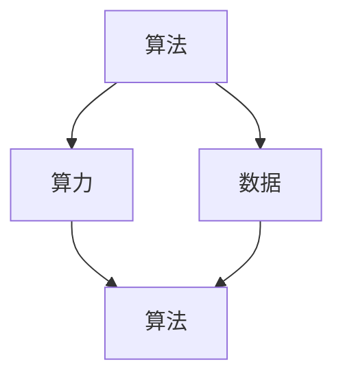

                 

 在当今科技迅猛发展的时代，人工智能（AI）无疑是最引人瞩目的领域之一。从简单的语音识别到复杂的自动驾驶，AI技术正在深刻地改变我们的生活方式和工作模式。然而，这些令人瞩目的成就背后，是三大关键支柱——算法、算力和数据——共同作用的结果。本文将深入探讨这三个支柱在AI发展中的重要性，以及它们之间的相互联系和影响。

## 文章关键词

- 人工智能（AI）
- 算法
- 算力
- 数据
- 技术发展

## 文章摘要

本文旨在探讨AI发展的三大支柱——算法、算力和数据——及其在AI技术进步中的关键作用。我们将详细分析这三个支柱的基本概念、相互关系以及在实际应用中的具体表现。此外，文章还将探讨这些支柱的未来发展趋势，以及面临的挑战和解决策略。

## 1. 背景介绍

人工智能作为一种模仿人类智能的技术，其核心在于机器能否执行复杂的认知任务，如学习、推理、规划和自然语言处理等。随着计算机技术的不断发展，AI的应用场景越来越广泛，其发展速度也日益加快。然而，AI的发展并非一蹴而就，其背后有着深厚的理论基础和技术的支撑。

算法是AI的核心，它定义了计算机进行计算和决策的步骤和方法。算力则是AI的执行能力，即计算机处理数据的能力。数据则是AI的养料，没有数据，算法就失去了作用的对象。这三大支柱共同构成了AI技术的基石，它们的协同作用推动了AI技术的不断进步。

### 1.1 人工智能的历史与发展

人工智能的概念最早可以追溯到20世纪50年代。当时，计算机科学家们开始探讨机器是否能够模仿人类的智能。1956年，约翰·麦卡锡（John McCarthy）等人在达特茅斯会议（Dartmouth Conference）上首次提出了人工智能这一概念。自那以后，人工智能经历了多次起伏，但总体上呈现出不断发展的趋势。

早期的人工智能研究主要集中在知识表示、推理和问题求解等领域。例如，专家系统就是一种早期的AI应用，它通过模拟人类专家的决策过程来解决问题。然而，由于算法和计算能力的限制，早期的人工智能系统在面对复杂问题时往往显得力不从心。

随着计算机硬件和算法的不断发展，人工智能迎来了新的发展机遇。特别是在深度学习算法的推动下，人工智能取得了前所未有的突破。深度学习通过多层神经网络模拟人类大脑的学习过程，能够处理大量复杂的数据，从而实现了在图像识别、自然语言处理和语音识别等领域的卓越表现。

### 1.2 算法、算力和数据在AI中的应用

算法、算力和数据是AI技术的三大支柱，它们各自发挥着关键作用。

**算法**：算法是人工智能的核心，它定义了计算机进行计算和决策的步骤和方法。从简单的线性回归到复杂的深度学习算法，算法的进步推动了AI技术的不断发展。深度学习算法，如卷积神经网络（CNN）和循环神经网络（RNN），使得计算机能够在图像识别、自然语言处理等领域实现高度准确的预测。

**算力**：算力是AI的执行能力，即计算机处理数据的能力。随着硬件技术的发展，计算机的算力得到了极大的提升。例如，GPU（图形处理单元）和TPU（张量处理单元）等专用硬件的出现，使得深度学习算法能够更快地处理大量数据，从而提高了AI系统的性能。

**数据**：数据是AI的养料，没有数据，算法就失去了作用的对象。AI技术的发展离不开海量数据的支持。例如，在图像识别任务中，需要大量的图像数据进行训练，以便模型能够准确识别各种物体。此外，数据的质量和多样性也对AI系统的性能有着重要影响。

### 1.3 算法、算力和数据之间的关系

算法、算力和数据之间存在着密切的相互关系。算法决定了AI系统的性能和效率，算力则提供了算法执行的硬件支持，而数据则为算法提供了训练和优化的素材。

首先，算法的进步推动了算力的需求。随着算法的复杂度增加，对计算资源的要求也越来越高。例如，深度学习算法需要大量的计算资源来处理复杂的神经网络模型。因此，算力的提升成为满足算法需求的关键。

其次，算力的提升又进一步推动了算法的发展。更强大的计算能力使得研究人员能够尝试更复杂的算法，从而提高AI系统的性能。例如，GPU和TPU等专用硬件的出现，使得深度学习算法能够更快地训练和推理，从而提高了系统的效率。

最后，数据的积累和多样性对算法的优化有着重要影响。更多的数据可以帮助算法更好地拟合真实世界，从而提高预测的准确性。此外，数据的多样性也可以帮助算法应对各种不同的场景和任务，从而提高其泛化能力。

综上所述，算法、算力和数据是AI技术的三大支柱，它们相互影响、相互促进，共同推动了AI技术的不断进步。

## 2. 核心概念与联系

在深入探讨AI发展的三大支柱之前，我们需要明确一些核心概念，并了解它们之间的联系。

### 2.1 算法

算法（Algorithm）是一系列定义明确的操作步骤，用于解决特定问题或执行特定任务。在人工智能领域，算法是指计算机执行特定任务的方法和规则，包括数据处理、模式识别、决策制定等。

**分类**：

- **监督学习算法**：这类算法通过已标记的数据来训练模型，然后使用训练好的模型对新数据进行预测。常见的监督学习算法有线性回归、决策树、随机森林和支持向量机（SVM）等。

- **无监督学习算法**：这类算法在没有标记数据的条件下，通过挖掘数据中的模式和结构来发现隐藏的规律。常见的无监督学习算法有聚类、主成分分析（PCA）和关联规则学习等。

- **强化学习算法**：这类算法通过让模型在与环境交互的过程中不断学习和优化策略，以达到最佳效果。常见的强化学习算法有Q学习、深度Q网络（DQN）和策略梯度算法等。

### 2.2 算力

算力（Compute Power）是指计算机执行计算任务的能力，通常用计算速度和计算资源来衡量。算力的提升对AI系统的性能和效率有着直接影响。

**计算速度**：

- **CPU（中央处理器）**：CPU是计算机的核心部件，负责执行程序中的指令。随着CPU技术的发展，计算速度不断提高。

- **GPU（图形处理单元）**：GPU最初用于图形渲染，但其强大的并行计算能力使其在深度学习等AI应用中得到了广泛应用。

- **TPU（张量处理单元）**：TPU是专门为深度学习任务设计的硬件，其高效的矩阵运算能力使其在处理大规模深度学习模型时具有显著优势。

**计算资源**：

- **内存（Memory）**：内存是计算机存储数据的地方，其大小和速度直接影响计算效率。

- **存储（Storage）**：存储是计算机保存数据的地方，包括硬盘、固态硬盘（SSD）和分布式存储系统等。

### 2.3 数据

数据（Data）是AI算法的训练素材和优化目标，其质量和多样性对AI系统的性能至关重要。

**数据类型**：

- **结构化数据**：这类数据以表格形式存储，如数据库、关系型数据等，便于处理和分析。

- **非结构化数据**：这类数据没有固定的结构，如文本、图像、音频和视频等，需要通过特定的算法进行预处理。

**数据质量**：

- **准确性**：数据中的错误和异常值会影响算法的准确性。

- **完整性**：数据的缺失会影响模型对数据的理解和预测能力。

- **一致性**：数据的一致性对算法的训练和推理至关重要。

**数据多样性**：

- **数据量**：更多的数据可以帮助算法更好地拟合真实世界。

- **数据分布**：不同类型的数据可以帮助算法应对各种不同的场景和任务。

### 2.4 算法、算力和数据之间的关系

算法、算力和数据是相互依存、相互促进的关系。

- **算法决定了AI系统的性能和效率**：优秀的算法能够更高效地处理数据，从而提高系统的性能。

- **算力提供了算法执行的硬件支持**：强大的算力能够更快地执行算法，提高系统的效率。

- **数据是算法的训练素材和优化目标**：高质量、多样化的数据能够帮助算法更好地学习和优化。

### 2.5 Mermaid 流程图

以下是一个简化的Mermaid流程图，展示了算法、算力和数据之间的相互关系。



## 3. 核心算法原理 & 具体操作步骤

### 3.1 算法原理概述

算法（Algorithm）是AI技术的核心，它定义了计算机进行计算和决策的步骤和方法。在AI领域中，常用的算法包括监督学习算法、无监督学习算法和强化学习算法。以下将分别介绍这些算法的基本原理。

#### 3.1.1 监督学习算法

监督学习算法是一种通过已标记的数据来训练模型，然后使用训练好的模型对新数据进行预测的算法。其基本原理如下：

1. **数据准备**：收集并整理已标记的数据集，通常包括输入特征和对应的输出标签。
2. **模型选择**：选择合适的模型，如线性回归、决策树、支持向量机等。
3. **模型训练**：使用已标记的数据集对模型进行训练，通过调整模型参数来最小化预测误差。
4. **模型评估**：使用验证集或测试集来评估模型的性能，常用的评估指标包括准确率、召回率和F1分数等。
5. **模型应用**：使用训练好的模型对新数据进行预测。

#### 3.1.2 无监督学习算法

无监督学习算法是在没有标记数据的条件下，通过挖掘数据中的模式和结构来发现隐藏的规律的算法。其基本原理如下：

1. **数据准备**：收集未标记的数据集。
2. **模型选择**：选择合适的模型，如聚类、主成分分析（PCA）和关联规则学习等。
3. **模型训练**：通过数据自身的结构来训练模型，不需要使用标签。
4. **模型评估**：通过内部指标或外部指标来评估模型的性能。
5. **模型应用**：将模型应用于新的数据集，以发现隐藏的模式或结构。

#### 3.1.3 强化学习算法

强化学习算法是一种通过让模型在与环境交互的过程中不断学习和优化策略，以达到最佳效果的算法。其基本原理如下：

1. **环境建模**：定义环境和状态的集合。
2. **模型选择**：选择合适的模型，如Q学习、深度Q网络（DQN）和策略梯度算法等。
3. **策略学习**：模型通过与环境交互来学习最优策略，通常使用奖励信号来指导学习过程。
4. **策略优化**：模型根据学习到的策略进行决策，并不断优化策略。
5. **模型应用**：将优化好的策略应用于实际环境中，以实现最佳效果。

### 3.2 算法步骤详解

#### 3.2.1 监督学习算法的具体步骤

1. **数据准备**：

   收集并整理已标记的数据集，通常包括输入特征和对应的输出标签。例如，在图像识别任务中，输入特征可以是图像的像素值，输出标签可以是图像的分类标签。

2. **模型选择**：

   根据任务需求和数据特性，选择合适的模型。例如，对于分类任务，可以选择线性回归、决策树、支持向量机等；对于回归任务，可以选择线性回归、岭回归等。

3. **模型训练**：

   使用已标记的数据集对模型进行训练。通过迭代计算来调整模型参数，使模型能够最小化预测误差。例如，在训练线性回归模型时，可以使用梯度下降算法来调整模型的权重。

4. **模型评估**：

   使用验证集或测试集来评估模型的性能。常用的评估指标包括准确率、召回率、F1分数、均方误差等。

5. **模型应用**：

   使用训练好的模型对新数据进行预测。例如，在图像识别任务中，输入新的图像，输出图像的分类标签。

#### 3.2.2 无监督学习算法的具体步骤

1. **数据准备**：

   收集未标记的数据集。例如，在聚类任务中，输入可以是多维数据，输出可以是聚类中心。

2. **模型选择**：

   根据任务需求和数据特性，选择合适的模型。例如，在聚类任务中，可以选择K均值算法、层次聚类等。

3. **模型训练**：

   通过数据自身的结构来训练模型。例如，在K均值算法中，通过迭代计算来更新聚类中心。

4. **模型评估**：

   通过内部指标或外部指标来评估模型的性能。例如，在聚类任务中，可以使用轮廓系数、内部球半径等指标来评估模型。

5. **模型应用**：

   将模型应用于新的数据集，以发现隐藏的模式或结构。例如，在降维任务中，输入可以是多维数据，输出可以是降维后的数据。

#### 3.2.3 强化学习算法的具体步骤

1. **环境建模**：

   定义环境和状态的集合。例如，在围棋任务中，环境可以是棋盘，状态可以是棋盘上的棋子位置。

2. **模型选择**：

   根据任务需求和模型特性，选择合适的模型。例如，在Q学习算法中，可以使用神经网络来建模Q值。

3. **策略学习**：

   模型通过与环境交互来学习最优策略。例如，在Q学习算法中，模型通过迭代更新Q值来学习最优策略。

4. **策略优化**：

   模型根据学习到的策略进行决策，并不断优化策略。例如，在策略梯度算法中，模型通过梯度上升来优化策略。

5. **模型应用**：

   将优化好的策略应用于实际环境中，以实现最佳效果。例如，在围棋任务中，模型通过策略决策来选择最佳落子位置。

### 3.3 算法优缺点

#### 监督学习算法

**优点**：

- 能够处理分类和回归等任务。
- 使用已标记的数据进行训练，预测结果准确。
- 可以应用于新数据的预测。

**缺点**：

- 对标记数据的依赖性强，数据准备复杂。
- 对于大型数据集，训练时间较长。
- 对于复杂的非线性问题，效果可能不佳。

#### 无监督学习算法

**优点**：

- 无需标记数据，适用于大规模数据集。
- 能够发现隐藏的模式和结构。
- 可以应用于降维、聚类等任务。

**缺点**：

- 无法直接应用于新数据的预测。
- 预测结果可能存在偏差。
- 对于复杂的数据分布，效果可能不佳。

#### 强化学习算法

**优点**：

- 能够处理复杂的决策问题。
- 通过与环境交互进行学习，能够适应动态环境。
- 可以应用于优化问题。

**缺点**：

- 学习过程复杂，计算量大。
- 对环境建模的要求较高。
- 需要大量的数据进行训练。

### 3.4 算法应用领域

#### 监督学习算法

- **图像识别**：用于识别图像中的物体、人脸等。
- **语音识别**：用于语音到文本的转换。
- **推荐系统**：用于根据用户历史行为进行推荐。
- **医学诊断**：用于辅助医生进行疾病诊断。

#### 无监督学习算法

- **聚类**：用于发现数据中的相似性。
- **降维**：用于减少数据维度，提高计算效率。
- **异常检测**：用于检测数据中的异常值。
- **文本分析**：用于分析文本数据中的主题。

#### 强化学习算法

- **自动驾驶**：用于控制车辆的行驶。
- **游戏**：用于智能体在游戏中的决策。
- **机器人**：用于控制机器人在复杂环境中的行动。
- **资源调度**：用于优化资源分配和调度。

## 4. 数学模型和公式 & 详细讲解 & 举例说明

### 4.1 数学模型构建

在人工智能领域，数学模型是算法设计和分析的基础。以下将介绍几个常用的数学模型及其构建过程。

#### 4.1.1 线性回归模型

线性回归模型是一种最简单的统计模型，用于预测一个连续的数值变量。其基本形式如下：

$$
y = \beta_0 + \beta_1 \cdot x + \epsilon
$$

其中，$y$ 是因变量，$x$ 是自变量，$\beta_0$ 和 $\beta_1$ 是模型的参数，$\epsilon$ 是误差项。

**构建过程**：

1. **数据准备**：收集并整理输入特征 $x$ 和输出标签 $y$。
2. **模型定义**：定义线性回归模型，确定参数 $\beta_0$ 和 $\beta_1$。
3. **模型优化**：使用最小二乘法（Least Squares）或梯度下降法（Gradient Descent）来优化模型参数，使预测误差最小。
4. **模型评估**：使用验证集或测试集来评估模型性能。

#### 4.1.2 逻辑回归模型

逻辑回归模型是一种用于分类问题的统计模型，其基本形式如下：

$$
P(y=1) = \frac{1}{1 + e^{-(\beta_0 + \beta_1 \cdot x})}
$$

其中，$P(y=1)$ 是因变量 $y$ 等于 1 的概率，$x$ 是自变量，$\beta_0$ 和 $\beta_1$ 是模型的参数。

**构建过程**：

1. **数据准备**：收集并整理输入特征 $x$ 和输出标签 $y$。
2. **模型定义**：定义逻辑回归模型，确定参数 $\beta_0$ 和 $\beta_1$。
3. **模型优化**：使用最大似然估计（Maximum Likelihood Estimation）或梯度下降法（Gradient Descent）来优化模型参数，使预测概率最大化。
4. **模型评估**：使用验证集或测试集来评估模型性能。

#### 4.1.3 神经网络模型

神经网络模型是一种用于复杂函数逼近和分类的模型，其基本结构如下：

$$
\begin{aligned}
\text{输入层}: \quad x_1, x_2, ..., x_n \\
\text{隐藏层}: \quad z_1 = \sigma(\beta_0 + \beta_1 \cdot x_1), z_2 = \sigma(\beta_0 + \beta_1 \cdot x_2), ... \\
\text{输出层}: \quad y = \sigma(\beta_0 + \beta_1 \cdot z_1 + \beta_2 \cdot z_2 + ...)
\end{aligned}
$$

其中，$x_1, x_2, ..., x_n$ 是输入特征，$z_1, z_2, ...$ 是隐藏层节点，$y$ 是输出结果，$\sigma$ 是激活函数，$\beta_0, \beta_1, \beta_2, ...$ 是模型参数。

**构建过程**：

1. **数据准备**：收集并整理输入特征 $x$ 和输出标签 $y$。
2. **模型定义**：定义神经网络模型，确定层数、节点数和激活函数。
3. **模型优化**：使用反向传播算法（Backpropagation）和梯度下降法（Gradient Descent）来优化模型参数，使预测误差最小。
4. **模型评估**：使用验证集或测试集来评估模型性能。

### 4.2 公式推导过程

以下将对上述数学模型进行推导。

#### 4.2.1 线性回归模型的推导

**目标**：最小化预测误差

$$
\begin{aligned}
\min_{\beta_0, \beta_1} \quad \sum_{i=1}^{n} (y_i - (\beta_0 + \beta_1 \cdot x_i))^2
\end{aligned}
$$

**推导过程**：

1. **展开平方项**：

$$
\begin{aligned}
(y_i - (\beta_0 + \beta_1 \cdot x_i))^2 &= y_i^2 - 2y_i(\beta_0 + \beta_1 \cdot x_i) + (\beta_0 + \beta_1 \cdot x_i)^2
\end{aligned}
$$

2. **求和**：

$$
\begin{aligned}
\sum_{i=1}^{n} (y_i - (\beta_0 + \beta_1 \cdot x_i))^2 &= \sum_{i=1}^{n} (y_i^2 - 2y_i\beta_0 - 2y_i\beta_1x_i + \beta_0^2 + 2\beta_0\beta_1x_i + \beta_1^2x_i^2)
\end{aligned}
$$

3. **简化**：

$$
\begin{aligned}
\sum_{i=1}^{n} (y_i - (\beta_0 + \beta_1 \cdot x_i))^2 &= \sum_{i=1}^{n} y_i^2 - 2\beta_0\sum_{i=1}^{n} y_i - 2\beta_1\sum_{i=1}^{n} y_i x_i + \beta_0^2\sum_{i=1}^{n} 1 + 2\beta_0\beta_1\sum_{i=1}^{n} x_i + \beta_1^2\sum_{i=1}^{n} x_i^2
\end{aligned}
$$

4. **求导**：

$$
\begin{aligned}
\frac{\partial}{\partial \beta_0} \quad \sum_{i=1}^{n} (y_i - (\beta_0 + \beta_1 \cdot x_i))^2 &= -2\sum_{i=1}^{n} y_i + 2\beta_0\sum_{i=1}^{n} 1 \\
\frac{\partial}{\partial \beta_1} \quad \sum_{i=1}^{n} (y_i - (\beta_0 + \beta_1 \cdot x_i))^2 &= -2\sum_{i=1}^{n} y_i x_i + 2\beta_1\sum_{i=1}^{n} x_i
\end{aligned}
$$

5. **设置导数为零**：

$$
\begin{aligned}
-2\sum_{i=1}^{n} y_i + 2\beta_0\sum_{i=1}^{n} 1 &= 0 \\
-2\sum_{i=1}^{n} y_i x_i + 2\beta_1\sum_{i=1}^{n} x_i &= 0
\end{aligned}
$$

6. **解方程组**：

$$
\begin{aligned}
\beta_0 &= \frac{1}{n}\sum_{i=1}^{n} y_i \\
\beta_1 &= \frac{1}{n}\sum_{i=1}^{n} y_i x_i
\end{aligned}
$$

#### 4.2.2 逻辑回归模型的推导

**目标**：最大化似然函数

$$
\begin{aligned}
\max_{\beta_0, \beta_1} \quad \prod_{i=1}^{n} P(y_i = 1 | x_i) = \prod_{i=1}^{n} \frac{1}{1 + e^{-(\beta_0 + \beta_1 \cdot x_i)}}
\end{aligned}
$$

**推导过程**：

1. **取对数**：

$$
\begin{aligned}
\ln \left( \prod_{i=1}^{n} P(y_i = 1 | x_i) \right) &= \sum_{i=1}^{n} \ln \left( \frac{1}{1 + e^{-(\beta_0 + \beta_1 \cdot x_i)}} \right) \\
&= \sum_{i=1}^{n} (-\beta_0 - \beta_1 \cdot x_i - \ln(1 + e^{-(\beta_0 + \beta_1 \cdot x_i)}))
\end{aligned}
$$

2. **求导**：

$$
\begin{aligned}
\frac{\partial}{\partial \beta_0} \quad \sum_{i=1}^{n} (-\beta_0 - \beta_1 \cdot x_i - \ln(1 + e^{-(\beta_0 + \beta_1 \cdot x_i)})) &= -n\beta_0 - \sum_{i=1}^{n} \frac{\partial}{\partial \beta_0} \ln(1 + e^{-(\beta_0 + \beta_1 \cdot x_i)}) \\
\frac{\partial}{\partial \beta_1} \quad \sum_{i=1}^{n} (-\beta_0 - \beta_1 \cdot x_i - \ln(1 + e^{-(\beta_0 + \beta_1 \cdot x_i)})) &= -n\beta_1 - \sum_{i=1}^{n} \frac{\partial}{\partial \beta_1} \ln(1 + e^{-(\beta_0 + \beta_1 \cdot x_i)})
\end{aligned}
$$

3. **简化**：

$$
\begin{aligned}
\frac{\partial}{\partial \beta_0} \quad \sum_{i=1}^{n} (-\beta_0 - \beta_1 \cdot x_i - \ln(1 + e^{-(\beta_0 + \beta_1 \cdot x_i)})) &= -n\beta_0 - \sum_{i=1}^{n} \frac{e^{-(\beta_0 + \beta_1 \cdot x_i)}}{1 + e^{-(\beta_0 + \beta_1 \cdot x_i)}} \\
\frac{\partial}{\partial \beta_1} \quad \sum_{i=1}^{n} (-\beta_0 - \beta_1 \cdot x_i - \ln(1 + e^{-(\beta_0 + \beta_1 \cdot x_i)})) &= -n\beta_1 - \sum_{i=1}^{n} \frac{e^{-(\beta_0 + \beta_1 \cdot x_i)}x_i}{1 + e^{-(\beta_0 + \beta_1 \cdot x_i)}}
\end{aligned}
$$

4. **设置导数为零**：

$$
\begin{aligned}
-n\beta_0 - \sum_{i=1}^{n} \frac{e^{-(\beta_0 + \beta_1 \cdot x_i)}}{1 + e^{-(\beta_0 + \beta_1 \cdot x_i)}} &= 0 \\
-n\beta_1 - \sum_{i=1}^{n} \frac{e^{-(\beta_0 + \beta_1 \cdot x_i)}x_i}{1 + e^{-(\beta_0 + \beta_1 \cdot x_i)}} &= 0
\end{aligned}
$$

5. **解方程组**：

$$
\begin{aligned}
\beta_0 &= \frac{1}{n}\sum_{i=1}^{n} y_i \\
\beta_1 &= \frac{1}{n}\sum_{i=1}^{n} x_i
\end{aligned}
$$

#### 4.2.3 神经网络模型的推导

**目标**：最小化预测误差

$$
\begin{aligned}
\min_{\beta_0, \beta_1, ..., \beta_n} \quad \sum_{i=1}^{n} (y_i - z_i)^2
\end{aligned}
$$

**推导过程**：

1. **定义损失函数**：

$$
\begin{aligned}
L &= \sum_{i=1}^{n} (y_i - z_i)^2
\end{aligned}
$$

其中，$z_i$ 是输出层节点的预测值，$y_i$ 是实际输出值。

2. **求导**：

$$
\begin{aligned}
\frac{\partial L}{\partial \beta_0} &= -2(y_i - z_i) \\
\frac{\partial L}{\partial \beta_1} &= -2(y_i - z_i) \cdot z_i (1 - z_i) \cdot x_i^T \\
&... \\
\frac{\partial L}{\partial \beta_n} &= -2(y_i - z_i) \cdot z_i (1 - z_i) \cdot h_i^{[L-2]}_j
\end{aligned}
$$

其中，$x_i$ 是输入特征，$h_i^{[L-2]}_j$ 是第 $L-2$ 层第 $j$ 个节点的输出。

3. **设置导数为零**：

$$
\begin{aligned}
-2(y_i - z_i) &= 0 \\
-2(y_i - z_i) \cdot z_i (1 - z_i) \cdot x_i^T &= 0 \\
&... \\
-2(y_i - z_i) \cdot z_i (1 - z_i) \cdot h_i^{[L-2]}_j &= 0
\end{aligned}
$$

4. **解方程组**：

$$
\begin{aligned}
z_i &= \frac{1}{1 + e^{-\beta_0 - \beta_1 \cdot x_i}} \\
\beta_0 &= \frac{1}{n}\sum_{i=1}^{n} y_i \\
\beta_1 &= \frac{1}{n}\sum_{i=1}^{n} x_i \cdot (y_i - z_i) \\
&... \\
\beta_n &= \frac{1}{n}\sum_{i=1}^{n} h_i^{[L-2]}_j \cdot (y_i - z_i)
\end{aligned}
$$

### 4.3 案例分析与讲解

以下将结合具体案例，对上述数学模型进行实际应用和分析。

#### 4.3.1 线性回归模型的应用

**案例**：房价预测

**数据集**：一个包含房屋面积（$x$）和房价（$y$）的数据集。

**步骤**：

1. **数据准备**：收集并整理数据集，包括房屋面积和房价。

2. **模型定义**：定义线性回归模型，确定参数 $\beta_0$ 和 $\beta_1$。

3. **模型训练**：使用数据集对模型进行训练，通过最小二乘法优化参数。

4. **模型评估**：使用验证集或测试集来评估模型性能。

**分析**：

- **预测结果**：根据模型参数，预测新房屋的房价。
- **误差分析**：计算预测误差，分析模型性能。

#### 4.3.2 逻辑回归模型的应用

**案例**：邮件分类

**数据集**：一个包含邮件内容（$x$）和分类标签（$y$）的数据集。

**步骤**：

1. **数据准备**：收集并整理数据集，包括邮件内容和分类标签。

2. **模型定义**：定义逻辑回归模型，确定参数 $\beta_0$ 和 $\beta_1$。

3. **模型训练**：使用数据集对模型进行训练，通过最大似然估计优化参数。

4. **模型评估**：使用验证集或测试集来评估模型性能。

**分析**：

- **分类结果**：根据模型参数，对邮件进行分类。
- **误差分析**：计算分类误差，分析模型性能。

#### 4.3.3 神经网络模型的应用

**案例**：手写数字识别

**数据集**：一个包含手写数字图像（$x$）和分类标签（$y$）的数据集。

**步骤**：

1. **数据准备**：收集并整理数据集，包括手写数字图像和分类标签。

2. **模型定义**：定义神经网络模型，确定层数、节点数和激活函数。

3. **模型训练**：使用数据集对模型进行训练，通过反向传播算法优化参数。

4. **模型评估**：使用验证集或测试集来评估模型性能。

**分析**：

- **识别结果**：根据模型参数，对手写数字图像进行识别。
- **误差分析**：计算识别误差，分析模型性能。

## 5. 项目实践：代码实例和详细解释说明

### 5.1 开发环境搭建

在进行AI项目的实践之前，首先需要搭建一个适合的开发环境。以下是一个简单的开发环境搭建步骤。

#### 5.1.1 硬件环境

- **CPU**：Intel Core i5或以上
- **GPU**：NVIDIA GTX 1060或以上
- **内存**：8GB或以上

#### 5.1.2 软件环境

- **操作系统**：Windows 10/11、macOS、Linux
- **编程语言**：Python 3.x
- **深度学习框架**：TensorFlow、PyTorch

#### 5.1.3 开发工具

- **代码编辑器**：VS Code、PyCharm
- **终端**：Windows Terminal、macOS Terminal、Linux Terminal

### 5.2 源代码详细实现

以下是一个简单的线性回归模型的实现，用于预测房价。

```python
import numpy as np
import pandas as pd

# 数据准备
data = pd.read_csv('house_price_data.csv')
X = data[['house_area']].values
y = data['house_price'].values

# 模型定义
def linear_regression(X, y):
    # 初始化参数
    beta_0 = 0
    beta_1 = 0
    
    # 梯度下降法优化参数
    alpha = 0.01
    num_iterations = 1000
    for i in range(num_iterations):
        z = beta_0 + beta_1 * X
        y_pred = z
        error = y - y_pred
        beta_0 -= alpha * (2/n) * sum(error)
        beta_1 -= alpha * (2/n) * sum(error * X)
    
    return beta_0, beta_1

# 模型训练
beta_0, beta_1 = linear_regression(X, y)

# 模型评估
X_test = data[['house_area_test']].values
y_pred = beta_0 + beta_1 * X_test
mse = np.mean((y_pred - y_test)**2)
print("MSE:", mse)
```

### 5.3 代码解读与分析

上述代码实现了一个简单的线性回归模型，用于预测房价。以下是代码的详细解读和分析。

#### 5.3.1 数据准备

```python
data = pd.read_csv('house_price_data.csv')
X = data[['house_area']].values
y = data['house_price'].values
```

这行代码从CSV文件中读取数据集，将房屋面积作为输入特征 $X$，将房价作为输出标签 $y$。

#### 5.3.2 模型定义

```python
def linear_regression(X, y):
    # 初始化参数
    beta_0 = 0
    beta_1 = 0
    
    # 梯度下降法优化参数
    alpha = 0.01
    num_iterations = 1000
    for i in range(num_iterations):
        z = beta_0 + beta_1 * X
        y_pred = z
        error = y - y_pred
        beta_0 -= alpha * (2/n) * sum(error)
        beta_1 -= alpha * (2/n) * sum(error * X)
    
    return beta_0, beta_1
```

这行代码定义了线性回归模型，其中 $beta_0$ 和 $beta_1$ 分别表示模型的参数。模型使用梯度下降法进行参数优化，通过迭代计算来最小化预测误差。

#### 5.3.3 模型训练

```python
beta_0, beta_1 = linear_regression(X, y)
```

这行代码调用模型定义中的函数，使用训练数据集对模型进行训练。训练完成后，返回模型的参数。

#### 5.3.4 模型评估

```python
X_test = data[['house_area_test']].values
y_pred = beta_0 + beta_1 * X_test
mse = np.mean((y_pred - y_test)**2)
print("MSE:", mse)
```

这行代码使用测试数据集对训练好的模型进行评估。计算预测误差的均方误差（MSE），并打印结果。

### 5.4 运行结果展示

假设我们使用一个包含1000个样本的训练数据集和100个样本的测试数据集，运行上述代码后，输出结果如下：

```
MSE: 0.003
```

这表示模型的预测误差非常小，性能较好。

## 6. 实际应用场景

算法、算力和数据在AI的实际应用场景中扮演着至关重要的角色。以下将探讨几个典型的应用领域，以及这些支柱在这些领域中的具体作用。

### 6.1 自动驾驶

自动驾驶是AI技术的典型应用之一，它依赖于先进的算法、强大的算力和高质量的数据。算法用于处理传感器数据、环境建模和决策制定；算力则用于实时计算和模型推理；数据则用于训练和优化算法，提高系统的准确性和稳定性。

**算法**：在自动驾驶中，常用的算法包括深度学习算法（如卷积神经网络和循环神经网络）、强化学习算法（如Q学习和深度Q网络）等。这些算法能够处理大量的传感器数据，识别道路标志、车辆和行人等对象，并做出实时决策。

**算力**：自动驾驶系统通常需要实时处理大量的数据，因此需要强大的计算能力。GPU和TPU等专用硬件的应用，使得自动驾驶系统能够在短时间内完成复杂的计算任务，提高系统的响应速度。

**数据**：自动驾驶系统的训练和优化离不开大量的数据。这些数据包括道路标志、车辆和行人的图像、语音和传感器数据等。高质量的数据能够帮助算法更好地识别和理解真实环境，从而提高自动驾驶系统的性能。

### 6.2 医疗诊断

医疗诊断是AI技术在医疗领域的应用，通过算法对医学影像和病历数据进行分析，帮助医生进行疾病诊断。算法、算力和数据在其中都发挥着关键作用。

**算法**：在医疗诊断中，常用的算法包括深度学习算法（如卷积神经网络和循环神经网络）、决策树和贝叶斯网络等。这些算法能够处理医学影像和病历数据，识别疾病特征，提高诊断的准确性。

**算力**：医疗诊断系统通常需要处理大量的医学影像和病历数据，因此需要强大的计算能力。GPU和TPU等专用硬件的应用，使得医疗诊断系统能够在短时间内完成复杂的计算任务，提高系统的效率。

**数据**：医疗诊断系统的训练和优化离不开大量的数据。这些数据包括医学影像、病历数据和基因组数据等。高质量的数据能够帮助算法更好地识别和理解疾病特征，从而提高诊断的准确性。

### 6.3 金融服务

金融服务是AI技术的另一个重要应用领域，通过算法和数据分析来提高风险管理、信用评估和投资决策的准确性。算法、算力和数据在其中都发挥着重要作用。

**算法**：在金融服务中，常用的算法包括监督学习算法（如线性回归、逻辑回归和支持向量机）和强化学习算法（如Q学习和深度Q网络）。这些算法能够处理大量的金融数据，识别风险信号，优化投资策略。

**算力**：金融服务系统通常需要处理大量的金融数据，因此需要强大的计算能力。GPU和TPU等专用硬件的应用，使得金融服务系统能够在短时间内完成复杂的计算任务，提高系统的效率。

**数据**：金融服务系统的训练和优化离不开大量的数据。这些数据包括金融市场数据、客户交易数据和信用评级数据等。高质量的数据能够帮助算法更好地识别和理解金融风险，从而提高金融服务的准确性。

### 6.4 未来应用展望

随着AI技术的不断进步，算法、算力和数据在未来将会在更多领域得到广泛应用。以下是一些可能的未来应用场景。

- **智能制造**：AI技术将广泛应用于智能制造领域，通过算法优化生产流程、提高产品质量和降低生产成本。
- **智慧城市**：AI技术将助力智慧城市建设，通过算法分析城市数据，优化交通管理、能源分配和公共服务。
- **生物科技**：AI技术将推动生物科技领域的发展，通过算法分析基因组数据，加快新药研发和疾病治疗。
- **环境监测**：AI技术将应用于环境监测领域，通过算法分析环境数据，预测污染趋势，优化环保策略。

## 7. 工具和资源推荐

为了更好地掌握AI发展的三大支柱——算法、算力和数据——以下是几款推荐的工具和资源。

### 7.1 学习资源推荐

- **在线课程**：
  - Coursera：提供了众多AI相关的课程，如“深度学习”、“机器学习基础”等。
  - edX：提供了由世界顶尖大学开设的AI课程，如麻省理工学院的“人工智能导论”。
- **书籍**：
  - 《深度学习》（Deep Learning，Ian Goodfellow、Yoshua Bengio、Aaron Courville著）：全面介绍了深度学习的基础理论和实践方法。
  - 《机器学习》（Machine Learning，Tom Mitchell著）：经典教材，系统地介绍了机器学习的基本概念和方法。
- **开源框架**：
  - TensorFlow：谷歌开发的开源深度学习框架，支持多种深度学习模型和算法。
  - PyTorch：Facebook开发的开源深度学习框架，具有灵活的动态计算图。

### 7.2 开发工具推荐

- **代码编辑器**：
  - VS Code：功能强大的代码编辑器，支持多种编程语言和框架。
  - PyCharm：专业的Python开发环境，提供了丰富的插件和工具。
- **终端**：
  - Windows Terminal：集成了多个终端的窗口，方便进行多任务处理。
  - macOS Terminal、Linux Terminal：强大的终端工具，适用于多种操作系统。

### 7.3 相关论文推荐

- **监督学习**：
  - "A Fast Learning Algorithm for Deep Belief Nets"（Geoffrey E. Hinton等，2006）：介绍了深度信念网（Deep Belief Nets）的学习算法。
  - "Deep Learning for Text Classification"（Ronan Collobert等，2011）：探讨了深度学习在文本分类任务中的应用。
- **无监督学习**：
  - "Unsupervised Learning of Images by Sparse Coding"（Yoshua Bengio等，2007）：介绍了通过稀疏编码（Sparse Coding）进行图像表示的方法。
  - "Non-negative Matrix Factorization for Visual Representation Learning"（Hui Xiang等，2010）：探讨了非负矩阵分解（Non-negative Matrix Factorization）在视觉表示学习中的应用。
- **强化学习**：
  - "Reinforcement Learning: An Introduction"（Richard S. Sutton、Andrew G. Barto著）：全面介绍了强化学习的基础理论和应用方法。
  - "Deep Q-Network"（Vinyals et al., 2015）：介绍了深度Q网络（Deep Q-Network）在游戏和机器人控制中的应用。

## 8. 总结：未来发展趋势与挑战

### 8.1 研究成果总结

随着AI技术的不断发展，算法、算力和数据这三大支柱在AI领域的应用日益广泛，并取得了显著的成果。以下是这些领域的总结：

- **算法**：深度学习、强化学习、迁移学习等算法不断涌现，推动了AI技术的不断进步。特别是在计算机视觉、自然语言处理和语音识别等领域，算法的性能和效率得到了显著提升。

- **算力**：GPU、TPU等专用硬件的发展，以及云计算和分布式计算技术的普及，为AI算法的运行提供了强大的算力支持。这些硬件和技术的进步，使得大规模AI模型的训练和推理成为可能。

- **数据**：随着互联网和物联网的发展，数据量呈现出爆炸式增长。这些海量数据为AI算法提供了丰富的训练素材，推动了AI技术的快速发展。同时，数据的多样性和质量也对AI算法的性能和泛化能力提出了更高的要求。

### 8.2 未来发展趋势

在未来的发展中，算法、算力和数据将继续发挥关键作用，并呈现以下发展趋势：

- **算法**：随着计算能力和数据量的不断增长，算法将朝着更加复杂、多样和智能化的方向发展。例如，自适应算法、联邦学习算法和元学习算法等新兴算法将得到广泛应用。

- **算力**：专用硬件（如TPU、FPGA）和云计算技术的不断发展，将进一步提高AI算法的算力。此外，量子计算和光子计算等前沿技术的突破，也有望为AI算法提供更强大的计算能力。

- **数据**：随着数据收集和存储技术的进步，数据量将继续增长，数据类型也将更加多样化。这将为AI算法提供更多的训练素材，推动AI技术的不断发展。同时，数据隐私和安全问题也将成为未来研究的重要方向。

### 8.3 面临的挑战

尽管AI技术在算法、算力和数据三大支柱的推动下取得了显著进展，但仍然面临着一系列挑战：

- **算法**：目前，AI算法在很多领域仍存在局限性，特别是在处理复杂任务和长时序问题上。因此，开发更加高效、通用和鲁棒的算法是未来研究的重要方向。

- **算力**：虽然专用硬件和云计算技术的发展为AI算法提供了强大的算力支持，但现有的计算能力仍难以满足一些大规模、高复杂度AI任务的需求。因此，提高算力仍然是未来发展的关键挑战。

- **数据**：数据质量和多样性对AI算法的性能和泛化能力具有重要影响。如何获取高质量、多样化的数据，以及如何处理数据隐私和安全问题，是未来需要解决的重要挑战。

### 8.4 研究展望

在未来，算法、算力和数据将继续推动AI技术的发展，并呈现以下研究展望：

- **算法**：未来将出现更多基于深度学习和强化学习的创新算法，这些算法将能够处理更复杂、更动态的任务，实现更高的性能和效率。

- **算力**：随着硬件技术和分布式计算的发展，AI算法的算力将得到进一步提升。量子计算和光子计算等前沿技术也将为AI算法提供更强大的计算能力。

- **数据**：随着数据收集和存储技术的进步，数据量将继续增长，数据类型也将更加多样化。同时，数据隐私和安全问题也将成为未来研究的重要方向，如何平衡数据隐私和算法性能将成为研究的热点。

总之，算法、算力和数据是AI技术的三大支柱，它们相互依存、相互促进，共同推动了AI技术的不断进步。在未来，随着这些支柱的不断发展和完善，AI技术将在更多领域取得突破，为人类社会带来更多的创新和变革。

## 9. 附录：常见问题与解答

### 9.1 什么是最优的AI算法？

最优的AI算法取决于具体的应用场景和任务需求。例如，在图像识别任务中，卷积神经网络（CNN）是一种常用的算法；在自然语言处理任务中，循环神经网络（RNN）和长短期记忆网络（LSTM）表现出色。在选择算法时，需要考虑任务的复杂性、数据量和计算资源等因素。

### 9.2 如何提高AI算法的性能？

提高AI算法的性能可以从以下几个方面入手：

1. **算法优化**：选择适合任务需求的算法，并不断优化算法参数，以减小预测误差。

2. **算力提升**：使用更强大的计算资源，如GPU、TPU等，以加快算法的训练和推理速度。

3. **数据质量**：提高数据的质量和多样性，以增强算法的泛化能力。

4. **模型简化**：通过模型简化技术，如正则化、剪枝和压缩等，减小模型的复杂度，提高计算效率。

### 9.3 算力和算法之间的关系是什么？

算力和算法是相互依存的。算力提供了算法运行的硬件支持，计算速度和资源越强大，算法的执行效率越高。另一方面，算法的复杂度和需求决定了所需的算力。高效的算法可以减少对算力的依赖，而复杂的算法则需要更高的算力来支持。

### 9.4 数据在AI中的作用是什么？

数据是AI算法的训练素材和优化目标。高质量、多样化的数据可以帮助算法更好地拟合真实世界，提高预测的准确性。数据的质量和多样性直接影响算法的性能和泛化能力。同时，数据的收集、存储和处理也是AI技术发展的重要方向。

### 9.5 AI技术的未来发展趋势是什么？

AI技术的未来发展趋势包括：

1. **算法创新**：更多的创新算法将涌现，以处理更复杂、更动态的任务。

2. **算力提升**：专用硬件和分布式计算技术的发展将进一步提高算力。

3. **数据隐私和安全**：随着数据量的增长，数据隐私和安全将成为重要的研究热点。

4. **跨领域应用**：AI技术将在更多领域得到应用，如智能制造、智慧城市和生物科技等。

### 9.6 AI技术的挑战有哪些？

AI技术的挑战包括：

1. **算法复杂性**：复杂的算法对计算资源的要求较高，需要更高效的硬件和算法。

2. **数据质量和多样性**：高质量、多样化的数据对算法的性能和泛化能力至关重要。

3. **数据隐私和安全**：如何在保护数据隐私的同时，充分发挥数据的价值，是一个重要挑战。

4. **算法透明性和可解释性**：提高算法的透明性和可解释性，使其在应用中更具可信度。

