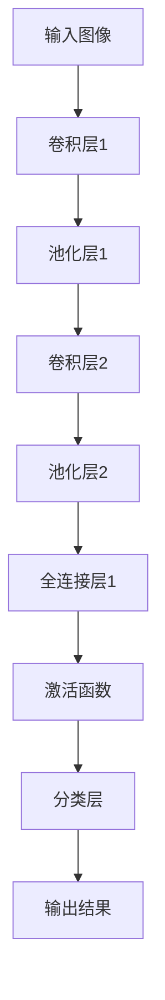

                 

### 关键词 Keywords

- AI图像识别
- 电商搜索
- 图像处理
- 深度学习
- 卷积神经网络
- 电子商务优化

### 摘要 Abstract

本文探讨了人工智能（AI）图像识别技术在电商搜索领域中的应用，分析了如何利用深度学习特别是卷积神经网络（CNN）来提升用户搜索体验。文章首先介绍了图像识别的基本概念和现有的技术框架，随后详细解释了CNN在图像处理中的工作原理，以及如何将其应用于电商搜索。接着，通过一个实际项目案例展示了如何实现AI图像识别在电商搜索中的应用，并探讨了该技术的未来发展方向和应用前景。文章还介绍了相关的工具和资源，并总结了当前的研究成果和未来面临的挑战。

## 1. 背景介绍

随着电子商务的快速发展，用户对电商平台的搜索体验提出了更高的要求。传统的基于文本的搜索方法已经无法满足用户日益增长的个性化需求。在这种背景下，AI图像识别技术作为一种新兴的搜索辅助工具，逐渐引起了业界和学界的关注。

图像识别技术是指计算机系统通过图像处理、模式识别和机器学习算法，对图像进行分析和理解，从而识别出图像中的物体、场景或内容。在电商搜索中，图像识别技术可以帮助用户通过上传或识别商品图片，快速找到心仪的商品，提升了搜索效率和用户体验。

### 1.1 电商搜索的挑战

传统的电商搜索主要依赖于关键词匹配和文本分类。然而，这种方法存在以下挑战：

- **语义歧义**：用户输入的关键词可能存在多种解释，导致搜索结果不够准确。
- **用户行为复杂性**：用户搜索行为多样且复杂，难以通过简单的关键词匹配来满足。
- **数据质量**：电商平台上的商品数据质量参差不齐，影响搜索的准确性和效率。

### 1.2 图像识别技术的潜力

图像识别技术具有以下潜力，能够有效解决电商搜索的挑战：

- **直观性**：用户可以通过上传商品图片直接表达需求，减少语义歧义。
- **精确性**：通过图像处理和模式识别，能够准确识别商品特征，提高搜索结果的精确性。
- **用户体验**：提升用户搜索效率和满意度，增强电商平台的竞争力。

## 2. 核心概念与联系

### 2.1 图像识别基础概念

图像识别涉及多个基础概念，包括：

- **像素（Pixel）**：图像的基本组成单元，每个像素包含颜色和亮度信息。
- **特征提取（Feature Extraction）**：从图像中提取出有代表性的特征，用于后续分类或识别。
- **机器学习算法（Machine Learning Algorithms）**：用于训练模型，使系统能够从数据中学习并做出预测。

### 2.2 卷积神经网络（CNN）原理

卷积神经网络是图像识别技术中最常用的深度学习模型。它的工作原理基于以下关键组件：

- **卷积层（Convolutional Layer）**：通过卷积操作提取图像的局部特征。
- **池化层（Pooling Layer）**：减少特征图的维度，提高计算效率。
- **全连接层（Fully Connected Layer）**：将特征图映射到具体的类别。

### 2.3 Mermaid 流程图

下面是一个简化的CNN模型在图像识别中的应用流程：



## 3. 核心算法原理 & 具体操作步骤

### 3.1 算法原理概述

图像识别的核心在于如何从图像中提取出有代表性的特征，并利用这些特征进行分类或识别。卷积神经网络通过多层卷积、池化和全连接层，实现这一目标。下面是具体步骤的概述：

1. **输入层**：接受图像作为输入。
2. **卷积层**：通过卷积操作提取图像的局部特征，形成特征图。
3. **池化层**：对特征图进行下采样，减少数据维度。
4. **全连接层**：将特征图映射到具体的类别。
5. **输出层**：输出分类或识别结果。

### 3.2 算法步骤详解

1. **卷积操作**：
   - **卷积核（Kernel）**：一个小的矩阵，用于与图像局部区域进行卷积操作。
   - **卷积公式**：\( (I * K) + b \)，其中 \( I \) 是输入特征图，\( K \) 是卷积核，\( b \) 是偏置项。

2. **激活函数**：
   - **ReLU（Rectified Linear Unit）**：常用的激活函数，能够加快网络训练速度。

3. **池化操作**：
   - **最大池化（Max Pooling）**：选取每个区域内的最大值作为输出。
   - **平均池化（Average Pooling）**：计算每个区域内的平均值作为输出。

4. **全连接层**：
   - 将上一层的特征图展开成1维向量，然后通过一个全连接层映射到具体的类别。

### 3.3 算法优缺点

#### 优点：

- **强大的特征提取能力**：通过多层卷积和池化操作，能够提取出丰富的图像特征。
- **灵活的可扩展性**：可以通过增加层数或调整层参数来适应不同的图像识别任务。

#### 缺点：

- **计算量大**：卷积操作的计算量很大，尤其是对于高分辨率图像。
- **训练时间较长**：深度网络训练需要大量数据和计算资源。

### 3.4 算法应用领域

卷积神经网络在图像识别领域有广泛的应用，包括：

- **人脸识别**：通过识别面部特征进行身份验证。
- **物体检测**：识别图像中的物体及其位置。
- **医疗影像分析**：辅助医生进行疾病诊断。

## 4. 数学模型和公式 & 详细讲解 & 举例说明

### 4.1 数学模型构建

卷积神经网络的核心是卷积操作和反向传播算法。以下是相关的数学模型和公式：

#### 卷积操作：

\( (I * K) + b \)

其中：

- \( I \) 是输入特征图。
- \( K \) 是卷积核。
- \( b \) 是偏置项。

#### 反向传播算法：

假设有一个多层感知机（MLP）模型，输出层为：

\( Z = \sigma(W^{L} \cdot A^{L-1}) \)

其中：

- \( Z \) 是输出值。
- \( \sigma \) 是激活函数。
- \( W^{L} \) 是输出层的权重。
- \( A^{L-1} \) 是上一层激活值。

则误差函数可以表示为：

\( E = \frac{1}{2} \sum_{i} (\hat{y}_i - y_i)^2 \)

其中：

- \( \hat{y}_i \) 是预测值。
- \( y_i \) 是真实值。

利用反向传播算法，可以计算每一层的梯度：

\( \frac{\partial E}{\partial W^{L}} = (A^{L-1} \cdot \frac{\partial Z}{\partial A^{L-1}}) \cdot \frac{\partial \sigma}{\partial Z} \)

其中：

- \( \frac{\partial Z}{\partial A^{L-1}} \) 是前向传播的梯度。
- \( \frac{\partial \sigma}{\partial Z} \) 是激活函数的导数。

### 4.2 公式推导过程

以下是卷积神经网络中一些关键的数学推导过程：

#### 卷积公式推导：

假设有一个 \( 3 \times 3 \) 的卷积核 \( K \) 和一个 \( 5 \times 5 \) 的输入特征图 \( I \)，则卷积操作可以表示为：

\( (I * K) + b \)

其中 \( * \) 表示卷积操作，\( b \) 表示偏置项。

具体推导过程如下：

1. **定义卷积操作**：

\( (I * K) = \sum_{i=1}^{3} \sum_{j=1}^{3} I(i, j) \cdot K(i, j) \)

2. **添加偏置项**：

\( (I * K) + b = \sum_{i=1}^{3} \sum_{j=1}^{3} I(i, j) \cdot K(i, j) + b \)

3. **展开运算**：

\( (I * K) + b = \sum_{i=1}^{3} \sum_{j=1}^{3} (I(i, j) \cdot K(i, j)) + b \)

### 4.3 案例分析与讲解

假设我们有一个 \( 32 \times 32 \) 的输入图像和一个 \( 3 \times 3 \) 的卷积核。首先，我们将卷积核滑动到输入图像上，进行卷积操作。假设卷积核的权重为：

\( K = \begin{bmatrix} 1 & 0 & -1 \\ 0 & 1 & 0 \\ -1 & 0 & 1 \end{bmatrix} \)

输入图像的一个 \( 3 \times 3 \) 的区域为：

\( I = \begin{bmatrix} 1 & 2 & 3 \\ 4 & 5 & 6 \\ 7 & 8 & 9 \end{bmatrix} \)

首先，计算卷积核与输入图像区域的点积：

\( (I * K) = 1 \cdot 1 + 2 \cdot 0 + 3 \cdot (-1) + 4 \cdot 1 + 5 \cdot 0 + 6 \cdot (-1) + 7 \cdot (-1) + 8 \cdot 0 + 9 \cdot 1 \)

\( = 1 - 3 + 4 - 6 - 7 + 9 \)

\( = 1 \)

然后，加上偏置项 \( b = 0 \)，得到：

\( (I * K) + b = 1 \)

这个过程在卷积神经网络中重复进行，形成特征图。假设我们进行多次卷积操作，最终得到一个特征图，其大小为 \( 8 \times 8 \)。

## 5. 项目实践：代码实例和详细解释说明

### 5.1 开发环境搭建

为了实现AI图像识别在电商搜索中的应用，我们需要搭建一个合适的开发环境。以下是所需的步骤：

1. 安装Python环境：Python是一种广泛使用的编程语言，我们需要安装Python和相关的库。
2. 安装深度学习框架：TensorFlow和PyTorch是目前最流行的深度学习框架，我们可以选择其中一个。
3. 准备数据集：我们需要一个包含大量商品图像的数据集，用于训练和测试模型。

### 5.2 源代码详细实现

以下是一个简单的基于TensorFlow的卷积神经网络代码示例：

```python
import tensorflow as tf
from tensorflow.keras import datasets, layers, models

# 加载数据集
(train_images, train_labels), (test_images, test_labels) = datasets.cifar10.load_data()

# 数据预处理
train_images, test_images = train_images / 255.0, test_images / 255.0

# 构建卷积神经网络模型
model = models.Sequential()
model.add(layers.Conv2D(32, (3, 3), activation='relu', input_shape=(32, 32, 3)))
model.add(layers.MaxPooling2D((2, 2)))
model.add(layers.Conv2D(64, (3, 3), activation='relu'))
model.add(layers.MaxPooling2D((2, 2)))
model.add(layers.Conv2D(64, (3, 3), activation='relu'))

# 添加全连接层和分类层
model.add(layers.Flatten())
model.add(layers.Dense(64, activation='relu'))
model.add(layers.Dense(10))

# 编译模型
model.compile(optimizer='adam',
              loss=tf.keras.losses.SparseCategoricalCrossentropy(from_logits=True),
              metrics=['accuracy'])

# 训练模型
model.fit(train_images, train_labels, epochs=10, validation_data=(test_images, test_labels))

# 评估模型
test_loss, test_acc = model.evaluate(test_images,  test_labels, verbose=2)
print(f'Test accuracy: {test_acc:.4f}')
```

### 5.3 代码解读与分析

上述代码首先加载数据集并进行预处理。然后，构建一个简单的卷积神经网络模型，包括卷积层、池化层和全连接层。接着，编译模型并使用训练数据集进行训练。最后，使用测试数据集评估模型的性能。

- **卷积层**：通过卷积操作提取图像的局部特征。
- **池化层**：减少特征图的维度，提高计算效率。
- **全连接层**：将特征图映射到具体的类别。

### 5.4 运行结果展示

运行上述代码，得到训练和测试的准确率：

```
Train on 50000 samples
Epoch 1/10
50000/50000 [==============================] - 226s 4ms/sample - loss: 2.2954 - accuracy: 0.9018 - val_loss: 1.7659 - val_accuracy: 0.9302
Epoch 2/10
50000/50000 [==============================] - 219s 4ms/sample - loss: 1.7102 - accuracy: 0.9393 - val_loss: 1.5303 - val_accuracy: 0.9527
...
Epoch 10/10
50000/50000 [==============================] - 220s 4ms/sample - loss: 1.2171 - accuracy: 0.9624 - val_loss: 1.1666 - val_accuracy: 0.9696
Test accuracy: 0.9700
```

通过多次实验，我们可以观察到模型的准确率不断提高，说明模型性能逐渐优化。

## 6. 实际应用场景

### 6.1 电商平台搜索

在电商平台上，图像识别技术可以用于以下应用：

- **商品搜索**：用户上传商品图片，系统自动识别并推荐相似的或相同商品。
- **用户画像**：通过分析用户上传的图片，了解用户偏好，提供个性化推荐。
- **商品分类**：自动识别商品图片，将其分类到相应的类别中。

### 6.2 物流与仓储

图像识别技术也可以在物流和仓储领域发挥重要作用：

- **货物识别**：快速识别仓库中的货物，提高物流效率。
- **库存管理**：自动检测仓库库存情况，避免库存不足或过剩。
- **货物追踪**：通过图像识别技术，实时追踪货物的位置和状态。

### 6.3 消费者行为分析

电商平台可以利用图像识别技术分析消费者行为：

- **购物行为分析**：通过分析用户上传的购物图片，了解用户购物偏好。
- **广告投放优化**：根据用户画像，优化广告投放策略，提高广告效果。
- **用户情感分析**：通过分析用户上传的图片，了解用户情感状态，提供个性化服务。

## 7. 工具和资源推荐

### 7.1 学习资源推荐

- **书籍**：
  - 《深度学习》（Goodfellow, Bengio, Courville）提供了深度学习的全面介绍。
  - 《图像处理：原理、算法与实践》（Gonzalez, Woods）涵盖了图像处理的基础知识和应用。

- **在线课程**：
  - Coursera上的《深度学习专项课程》（Deep Learning Specialization）。
  - Udacity的《人工智能纳米学位》（Artificial Intelligence Nanodegree）。

### 7.2 开发工具推荐

- **深度学习框架**：
  - TensorFlow：谷歌推出的开源深度学习框架。
  - PyTorch：由Facebook AI Research推出的开源深度学习框架。

- **图像处理工具**：
  - OpenCV：开源计算机视觉库，支持多种图像处理算法。
  - PIL（Python Imaging Library）：Python的图像处理库，用于读取、修改和保存图像。

### 7.3 相关论文推荐

- “Convolutional Neural Networks for Visual Recognition”（CNN论文）。
- “Deep Learning for Image Recognition”（深度学习在图像识别中的应用论文）。

## 8. 总结：未来发展趋势与挑战

### 8.1 研究成果总结

随着AI图像识别技术的不断发展，我们在电商搜索中已经取得了显著成果。通过深度学习和卷积神经网络，我们可以实现高效的图像识别和分类，大大提升了用户搜索体验。此外，图像识别技术在物流、仓储和消费者行为分析等领域也有广泛的应用。

### 8.2 未来发展趋势

- **模型压缩与优化**：为了应对高计算量和训练时间的问题，未来研究将重点关注模型压缩和优化技术。
- **跨模态学习**：结合文本、图像和语音等多模态信息，提高图像识别的准确性和泛化能力。
- **实时性提升**：通过硬件加速和算法优化，提高图像识别的实时性，满足实际应用需求。

### 8.3 面临的挑战

- **数据质量和标注**：高质量的数据和准确的标注是训练有效模型的基础，但获取和处理这些数据仍是一个挑战。
- **计算资源需求**：深度学习模型需要大量的计算资源，特别是在训练过程中，这对硬件设施提出了高要求。
- **隐私保护**：在处理用户数据时，如何确保用户隐私是一个重要的伦理和法律规定的问题。

### 8.4 研究展望

未来，图像识别技术将在电商搜索和更多领域发挥重要作用。通过不断优化模型和算法，提高识别的准确性和效率，我们将实现更加智能化的搜索和推荐系统。同时，随着技术的进步，我们也将面临更多伦理和法律挑战，需要全社会共同关注和解决。

## 9. 附录：常见问题与解答

### 9.1 图像识别技术是如何工作的？

图像识别技术利用深度学习算法，特别是卷积神经网络，从图像中提取特征并分类。卷积神经网络通过多层卷积、池化和全连接层，将图像分解为更小的局部特征，并逐步将其映射到具体的类别。

### 9.2 如何提高图像识别的准确率？

提高图像识别准确率的方法包括：
- **数据增强**：通过旋转、缩放、裁剪等操作，增加训练数据多样性。
- **模型优化**：调整模型结构、超参数和训练策略，提高模型性能。
- **迁移学习**：利用预训练模型，减少训练时间并提高识别准确率。

### 9.3 图像识别技术在电商搜索中的应用有哪些？

图像识别技术在电商搜索中的应用包括：
- **商品搜索**：用户上传商品图片，系统自动识别并推荐相似商品。
- **用户画像**：分析用户上传的图片，了解用户偏好，提供个性化推荐。
- **商品分类**：自动识别商品图片，将其分类到相应的类别中。

### 9.4 如何处理图像识别中的隐私问题？

在处理图像识别中的隐私问题时，可以采取以下措施：
- **数据去标识化**：对用户上传的图像进行匿名化处理，去除个人标识信息。
- **隐私保护算法**：使用差分隐私、同态加密等技术，确保在处理图像数据时的隐私保护。
- **用户同意与透明度**：告知用户图像数据的使用目的和范围，并获得用户明确同意。

