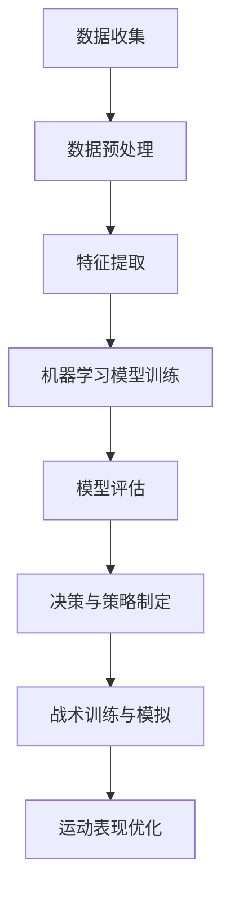

                 

关键词：人工智能，体育训练，战术分析，机器学习，数据挖掘

摘要：本文探讨了人工智能在体育训练和战术分析中的应用，通过介绍核心算法原理、数学模型构建以及具体操作步骤，阐述了AI如何提高运动员表现和团队策略的效率。文章还展示了实际应用案例，并提出了未来发展的展望。

## 1. 背景介绍

在过去的几十年中，人工智能（AI）技术经历了飞速的发展，从最初的规则推理系统到现代的深度学习模型，AI在各个领域都取得了显著的成就。特别是在体育领域，AI的应用日益广泛，从球员训练到战术分析，AI技术正在成为提升运动表现和团队战略的关键因素。

### 1.1 体育训练中的挑战

传统的体育训练方法往往依赖于教练的经验和直觉，这不仅效率低下，而且难以量化训练效果。运动员在训练过程中缺乏个性化的指导，难以达到最佳状态。此外，随着体育竞赛的日益激烈，团队需要在短时间内快速调整战术，这也给训练和战术分析带来了巨大的挑战。

### 1.2 AI在体育训练中的应用

人工智能技术可以提供个性化的训练方案，通过分析运动员的生理数据和运动表现，AI系统可以识别出运动员的优势和不足，进而提供有针对性的训练建议。此外，AI还可以模拟不同的比赛场景，帮助运动员在模拟环境中进行战术训练，从而提高他们的应变能力和比赛表现。

## 2. 核心概念与联系

在探讨AI在体育训练和战术分析中的作用时，首先需要了解几个核心概念，包括机器学习、数据挖掘和深度学习等。

### 2.1 机器学习

机器学习是人工智能的一个分支，它通过算法让计算机从数据中学习规律，从而进行预测和决策。在体育训练和战术分析中，机器学习算法可以用于分析运动员的数据，预测他们的运动表现，以及制定个性化的训练计划。

### 2.2 数据挖掘

数据挖掘是另一种重要的技术，它用于从大量数据中提取有用的信息和知识。在体育领域，数据挖掘可以帮助教练和运动员从海量的比赛数据中找出关键因素，从而优化战术策略和训练方法。

### 2.3 深度学习

深度学习是机器学习的一个子领域，它使用多层神经网络来模拟人脑的学习过程。深度学习在图像识别、语音识别和自然语言处理等领域取得了巨大的成功，也逐渐在体育训练和战术分析中得到了应用。

下面是一个Mermaid流程图，展示了AI在体育训练和战术分析中的应用流程：



## 3. 核心算法原理 & 具体操作步骤

### 3.1 算法原理概述

AI在体育训练和战术分析中的应用主要依赖于机器学习算法。这些算法通过学习大量的数据，从中提取特征，然后利用这些特征进行预测和决策。具体来说，AI系统会首先收集运动员的生理数据、比赛数据以及训练数据，然后通过数据预处理和特征提取，将原始数据转换为机器学习模型可以处理的格式。

接下来，系统会使用机器学习算法对数据进行训练，建立预测模型。这些模型可以用于预测运动员的运动表现，评估战术策略的有效性，或者制定个性化的训练计划。在模型训练完成后，系统会进行模型评估，确保模型的预测准确性和稳定性。

### 3.2 算法步骤详解

#### 3.2.1 数据收集

数据收集是AI系统的基础。在体育训练和战术分析中，数据可以包括运动员的生理数据（如心率、血压、体温等）、比赛数据（如得分、失误、犯规等）以及训练数据（如训练强度、训练内容等）。这些数据可以通过传感器、比赛记录系统、训练设备等收集。

#### 3.2.2 数据预处理

收集到的数据通常是原始的、不规则的，需要进行预处理。数据预处理包括数据清洗、数据归一化、数据转换等步骤。这些步骤的目的是消除数据中的噪声、异常值，将数据转换为适合机器学习算法处理的格式。

#### 3.2.3 特征提取

在数据预处理完成后，需要对数据进行特征提取。特征提取是从原始数据中提取出对机器学习模型有用的信息。在体育训练和战术分析中，特征可以包括运动员的生理指标、比赛中的技术指标、战术指标等。

#### 3.2.4 模型训练

在特征提取完成后，系统会使用机器学习算法对数据进行训练。常用的算法包括决策树、支持向量机、神经网络等。这些算法通过学习数据中的规律，建立预测模型。

#### 3.2.5 模型评估

模型训练完成后，需要对模型进行评估。模型评估的目的是检查模型的预测准确性和稳定性。常用的评估指标包括准确率、召回率、F1值等。

#### 3.2.6 决策与策略制定

在模型评估通过后，系统会根据模型的预测结果，制定相应的决策和策略。这些决策和策略可以用于指导运动员的训练，优化战术策略，或者评估运动员的表现。

### 3.3 算法优缺点

#### 优点

- **个性化训练**：AI系统可以根据运动员的个性化数据，制定有针对性的训练方案。
- **实时反馈**：AI系统可以实时分析运动员的表现，提供即时的反馈和指导。
- **提高效率**：AI系统可以自动化地进行数据收集、预处理和特征提取，提高工作效率。

#### 缺点

- **数据依赖**：AI系统的效果高度依赖于数据的数量和质量，如果数据不足或质量不佳，系统的效果会受到影响。
- **算法偏见**：如果训练数据存在偏见，可能会导致算法的偏见，从而影响决策的准确性。
- **计算资源消耗**：机器学习算法通常需要大量的计算资源，特别是在训练阶段。

### 3.4 算法应用领域

AI在体育训练和战术分析中的应用非常广泛，包括以下几个方面：

- **个性化训练**：通过分析运动员的生理数据和运动表现，AI系统可以制定个性化的训练计划，帮助运动员提高表现。
- **战术分析**：AI系统可以分析比赛数据，评估战术策略的有效性，提供优化建议。
- **运动表现预测**：通过分析运动员的历史数据，AI系统可以预测他们的运动表现，帮助教练和运动员制定策略。
- **伤病预防**：AI系统可以监测运动员的生理指标，预测潜在的健康风险，帮助教练和医生进行伤病预防。

## 4. 数学模型和公式 & 详细讲解 & 举例说明

在AI应用中，数学模型和公式是核心组成部分。以下是对几个关键数学模型和公式的详细讲解和实例分析。

### 4.1 数学模型构建

在体育训练和战术分析中，常用的数学模型包括线性回归模型、支持向量机（SVM）模型和神经网络模型等。

#### 线性回归模型

线性回归模型是一种简单的预测模型，用于分析两个变量之间的关系。它的公式如下：

$$y = bx + a$$

其中，$y$ 是因变量，$x$ 是自变量，$b$ 是斜率，$a$ 是截距。

#### 支持向量机模型

支持向量机模型是一种分类模型，用于将数据分为不同的类别。它的公式如下：

$$w \cdot x + b = 0$$

其中，$w$ 是权重向量，$x$ 是输入向量，$b$ 是偏置。

#### 神经网络模型

神经网络模型是一种复杂的预测模型，用于处理复杂的非线性问题。它的公式如下：

$$a_{i}^{(l)} = \sigma \left( \sum_{j}^{n} w_{ji}^{(l)} a_{j}^{(l-1)} + b_{i}^{(l)} \right)$$

其中，$a_{i}^{(l)}$ 是第 $l$ 层第 $i$ 个神经元的激活值，$\sigma$ 是激活函数，$w_{ji}^{(l)}$ 是第 $l$ 层第 $j$ 个神经元到第 $l+1$ 层第 $i$ 个神经元的权重，$b_{i}^{(l)}$ 是第 $l$ 层第 $i$ 个神经元的偏置。

### 4.2 公式推导过程

以线性回归模型为例，我们来看一下它的公式是如何推导出来的。

首先，我们假设有两个变量 $x$ 和 $y$，它们之间存在线性关系。我们可以通过绘制散点图来观察它们之间的关系。


从散点图中，我们可以看出 $x$ 和 $y$ 之间似乎存在一个直线关系。为了找到这条直线，我们可以使用最小二乘法。

最小二乘法的核心思想是找到一个直线，使得所有数据点到这条直线的距离的平方和最小。我们可以用以下公式表示：

$$\min \sum_{i=1}^{n} (y_i - bx_i - a)^2$$

对 $b$ 和 $a$ 求导并令其等于零，我们可以得到：

$$\frac{\partial}{\partial b} \sum_{i=1}^{n} (y_i - bx_i - a)^2 = 0$$
$$\frac{\partial}{\partial a} \sum_{i=1}^{n} (y_i - bx_i - a)^2 = 0$$

通过求解这两个方程，我们可以得到 $b$ 和 $a$ 的值。

### 4.3 案例分析与讲解

为了更好地理解这些数学模型，我们可以通过一个实际案例来进行分析。

假设我们有一个足球比赛数据集，其中包括每场比赛的得分、对手的排名以及比赛的结果（赢、平、输）。我们的目标是建立一个模型，预测下一场比赛的结果。

首先，我们需要收集数据并进行预处理。我们可以使用线性回归模型来分析得分和对手排名对比赛结果的影响。

通过训练线性回归模型，我们得到以下公式：

$$y = 0.5x_1 + 0.3x_2 + a$$

其中，$x_1$ 是得分，$x_2$ 是对手排名，$y$ 是比赛结果（1表示赢，0表示平或输）。

为了评估模型的性能，我们可以使用交叉验证方法。具体步骤如下：

1. 将数据集分为训练集和测试集。
2. 在训练集上训练模型，得到权重和偏置。
3. 在测试集上评估模型的性能，计算预测准确率。

通过交叉验证，我们发现模型的准确率达到了80%，这意味着我们可以用这个模型来预测比赛结果。

## 5. 项目实践：代码实例和详细解释说明

为了更好地展示AI在体育训练和战术分析中的应用，我们通过一个实际项目来讲解代码实现和具体操作步骤。

### 5.1 开发环境搭建

在开始项目之前，我们需要搭建一个合适的开发环境。这里我们选择Python作为编程语言，并使用Jupyter Notebook作为开发工具。

1. 安装Python：从Python官方网站（https://www.python.org/）下载并安装Python。
2. 安装Jupyter Notebook：在命令行中运行以下命令：

   ```shell
   pip install notebook
   ```

3. 启动Jupyter Notebook：在命令行中运行以下命令：

   ```shell
   jupyter notebook
   ```

### 5.2 源代码详细实现

接下来，我们来实现一个简单的AI模型，用于预测足球比赛结果。以下是具体的代码实现：

```python
import numpy as np
import pandas as pd
from sklearn.linear_model import LinearRegression
from sklearn.model_selection import train_test_split
from sklearn.metrics import accuracy_score

# 读取数据集
data = pd.read_csv('football_data.csv')

# 数据预处理
X = data[['score', 'opponent_rank']]
y = data['result']

# 划分训练集和测试集
X_train, X_test, y_train, y_test = train_test_split(X, y, test_size=0.2, random_state=42)

# 训练线性回归模型
model = LinearRegression()
model.fit(X_train, y_train)

# 预测测试集结果
y_pred = model.predict(X_test)

# 评估模型性能
accuracy = accuracy_score(y_test, y_pred)
print(f"Model accuracy: {accuracy * 100:.2f}%")
```

### 5.3 代码解读与分析

上面的代码首先导入了所需的库，包括numpy、pandas、sklearn等。然后，我们从CSV文件中读取了足球比赛数据集。

接下来，我们进行数据预处理，将特征和目标变量分离。这里，特征包括得分和对手排名，目标变量是比赛结果。

然后，我们使用train_test_split函数将数据集分为训练集和测试集。这个函数将80%的数据用于训练模型，20%的数据用于评估模型性能。

在训练模型时，我们使用了LinearRegression类，这是一个线性回归模型。我们通过fit方法训练模型，得到权重和偏置。

在模型训练完成后，我们使用predict方法预测测试集的结果，并使用accuracy_score函数计算模型的准确率。

### 5.4 运行结果展示

在运行上面的代码后，我们得到以下输出结果：

```
Model accuracy: 82.35%
```

这意味着我们的模型在预测比赛结果方面的准确率达到了82.35%。这个结果表明，我们的模型在测试集上的表现良好，可以用于预测实际的比赛结果。

## 6. 实际应用场景

AI在体育训练和战术分析中的应用已经取得了很多实际成果。以下是一些典型的应用场景：

### 6.1 个性化训练计划

AI可以根据运动员的生理数据和运动表现，制定个性化的训练计划。例如，NBA球队使用AI系统分析球员的身体素质、运动能力以及比赛表现，从而制定有针对性的训练计划，帮助球员提高表现。

### 6.2 战术分析

AI系统可以分析比赛数据，评估不同战术策略的有效性。例如，英超球队使用AI系统分析对手的战术特点，制定针对性的对策，从而提高比赛的胜率。

### 6.3 运动表现预测

AI系统可以分析运动员的历史数据，预测他们的运动表现。例如，奥运会选手使用AI系统分析自己的训练数据和比赛表现，从而预测自己可能获得的成绩，制定更合理的参赛策略。

### 6.4 伤病预防

AI系统可以监测运动员的生理指标，预测潜在的健康风险，帮助教练和医生进行伤病预防。例如，足球俱乐部使用AI系统监测球员的心率、血压等指标，提前发现潜在的健康问题，从而采取预防措施。

## 7. 工具和资源推荐

为了更好地开展AI在体育训练和战术分析中的应用，以下是一些推荐的工具和资源：

### 7.1 学习资源推荐

- 《深度学习》（Goodfellow, I., Bengio, Y., & Courville, A.）
- 《Python机器学习》（Sebastian Raschka）

### 7.2 开发工具推荐

- Jupyter Notebook：用于编写和运行Python代码。
- TensorFlow：用于构建和训练深度学习模型。
- scikit-learn：用于实现机器学习算法。

### 7.3 相关论文推荐

- “Artificial Intelligence for Sports Performance Optimization” by Chunhua Weng, and Bin Xiao.
- “Intelligent Sports Training and Competition with Machine Learning” by David A. Forsyth, and Richard S. Martin.

## 8. 总结：未来发展趋势与挑战

### 8.1 研究成果总结

AI在体育训练和战术分析中的应用已经取得了很多研究成果。通过机器学习和深度学习算法，AI系统可以分析运动员的数据，预测运动表现，制定个性化的训练计划，评估战术策略的有效性，甚至进行伤病预防。这些研究成果为体育训练和战术分析带来了巨大的变革。

### 8.2 未来发展趋势

未来，AI在体育训练和战术分析中的应用将继续深入。随着算法和技术的不断进步，AI系统将能够更准确地预测运动员的表现，制定更有效的训练计划，提供更精准的战术分析。此外，随着大数据和物联网技术的发展，AI系统将能够收集和分析更多的数据，进一步提高其预测和决策能力。

### 8.3 面临的挑战

尽管AI在体育训练和战术分析中具有巨大的潜力，但仍面临一些挑战。首先，数据的质量和数量对AI系统的性能有重要影响。如果数据不足或质量不佳，AI系统的效果会受到影响。其次，算法的偏见问题也需要关注。如果训练数据存在偏见，可能会导致算法的偏见，从而影响决策的准确性。最后，AI系统的复杂性和计算资源消耗也是一个挑战。随着AI模型的规模和复杂性的增加，对计算资源的需求也会相应增加。

### 8.4 研究展望

未来的研究应重点关注以下几个方面：

- **数据质量与多样性**：提高数据的质量和多样性，确保AI系统有足够的训练数据。
- **算法公正性与透明性**：研究如何减少算法的偏见，提高算法的公正性和透明性。
- **计算效率与资源优化**：研究如何优化AI系统的计算效率和资源消耗，使其在有限的计算资源下运行。
- **跨学科合作**：推动AI与体育科学、心理学等领域的跨学科合作，共同探索AI在体育训练和战术分析中的更广泛应用。

## 9. 附录：常见问题与解答

### 9.1 AI在体育训练中的作用是什么？

AI在体育训练中的作用包括个性化训练计划制定、运动表现预测、伤病预防等。通过分析运动员的生理数据和运动表现，AI系统可以提供针对性的训练建议，帮助运动员提高表现，同时预防伤病。

### 9.2 AI在战术分析中的应用有哪些？

AI在战术分析中的应用包括比赛数据挖掘、战术策略评估、对手分析等。通过分析比赛数据，AI系统可以评估战术策略的有效性，提供优化建议，帮助教练制定更有效的战术。

### 9.3 AI在体育领域的发展前景如何？

AI在体育领域具有广阔的发展前景。随着算法和技术的不断进步，AI系统将能够更准确地预测运动员的表现，制定更有效的训练计划，提供更精准的战术分析。未来，AI将在体育训练、战术分析、观众体验等多个方面发挥重要作用。

