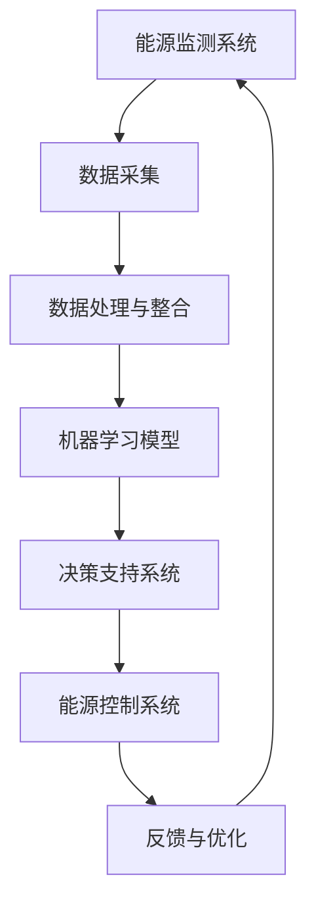

                 

关键词：人工智能、智能建筑、能源消耗、节能技术、机器学习、深度学习、算法优化、可持续建筑。

摘要：随着全球气候变化和能源危机的日益严重，智能建筑节能技术的研究与应用变得尤为重要。本文将探讨人工智能（AI）在智能建筑节能中的应用，特别是通过机器学习和深度学习算法来减少建筑能源消耗的方法。文章将详细阐述AI技术的核心概念、原理、数学模型、算法步骤、实际应用案例以及未来发展趋势。

## 1. 背景介绍

建筑能耗是现代社会中重要的能源消耗组成部分。据统计，全球建筑能耗占全球总能耗的近40%，其中大部分用于供暖、空调和照明。因此，如何有效降低建筑能耗，提高能源利用效率，成为当前亟待解决的问题。智能建筑节能技术通过利用现代信息技术、物联网、大数据和人工智能，实现了对建筑能源系统的自动化、智能化管理，从而大大降低了能源消耗。

### 智能建筑的概念与特点
智能建筑（Smart Building）是指利用信息技术和智能控制系统，实现对建筑环境、能源系统、安防系统等的全面监控和优化管理。智能建筑的特点包括：

- **自动化管理**：智能建筑通过传感器、控制系统和通信技术，实现自动监测和调节，提高了管理效率和舒适性。
- **数据集成与优化**：智能建筑通过物联网技术，将各种设备和系统连接起来，实现数据的集成与分析，进而优化资源配置和能源消耗。
- **节能降耗**：智能建筑通过智能化的能源管理系统，实时监测和分析建筑能耗，采取有效的节能措施，降低能源消耗。

### 智能建筑节能的必要性
智能建筑节能不仅是降低能耗、减少成本的需要，也是应对全球气候变化和实现可持续发展的重要举措。随着全球能源消耗的不断增加，特别是化石能源的过度使用，导致环境污染和温室气体排放加剧，智能建筑节能技术的应用显得尤为重要。

## 2. 核心概念与联系

### 核心概念

- **人工智能（AI）**：模拟人类智能行为的计算机系统。
- **机器学习（ML）**：人工智能的一个分支，通过数据驱动的方法，让计算机自动学习和改进。
- **深度学习（DL）**：机器学习的一种方法，通过多层神经网络，实现复杂模式的识别和学习。

### 架构联系


**Mermaid 流程图：**



## 3. 核心算法原理 & 具体操作步骤

### 3.1 算法原理概述

智能建筑节能的核心在于如何通过算法优化能源消耗。以下是几种常用的算法：

- **决策树算法**：用于预测和决策，通过特征选择和划分，找出最佳的决策路径。
- **支持向量机（SVM）**：用于分类和回归，通过寻找最优超平面，实现数据的分类和预测。
- **神经网络（NN）**：模拟人脑神经元，通过多层网络的训练，实现复杂模式的识别和预测。

### 3.2 算法步骤详解

1. **数据收集**：收集建筑能耗数据，包括温度、湿度、光照、空调使用情况等。
2. **数据预处理**：对数据进行清洗、归一化处理，去除噪声，提高数据质量。
3. **特征提取**：从数据中提取有用的特征，如温度变化率、用电量等。
4. **模型训练**：选择合适的算法，如决策树、SVM或神经网络，对数据进行训练。
5. **模型评估**：通过交叉验证和测试集，评估模型的准确性和泛化能力。
6. **模型应用**：将训练好的模型应用到实际的能源管理系统中，进行能耗预测和优化。
7. **反馈与优化**：根据模型预测结果，调整能源控制系统，实现实时优化。

### 3.3 算法优缺点

- **决策树算法**：简单易懂，易于实现，但是容易出现过拟合。
- **支持向量机（SVM）**：在处理高维数据时表现优异，但是训练时间较长。
- **神经网络（NN）**：能够处理复杂的非线性关系，但是训练过程复杂，易出现梯度消失或爆炸问题。

### 3.4 算法应用领域

- **能耗预测**：通过机器学习算法，预测建筑的能耗，为能源管理提供数据支持。
- **设备优化**：根据能耗数据，优化空调、照明等设备的运行，减少能源消耗。
- **需求响应**：通过算法预测，参与电网的需求响应，实现电力资源的优化配置。

## 4. 数学模型和公式 & 详细讲解 & 举例说明

### 4.1 数学模型构建

智能建筑节能的核心在于能耗的优化，这需要构建一个能耗预测模型。以下是构建能耗预测模型的公式：

$$
E(t) = \sum_{i=1}^{n} w_i \cdot f_i(t)
$$

其中，$E(t)$ 表示在时间 $t$ 的能耗，$w_i$ 表示第 $i$ 个特征的权重，$f_i(t)$ 表示第 $i$ 个特征在时间 $t$ 的值。

### 4.2 公式推导过程

能耗预测模型的推导过程涉及以下几个步骤：

1. **数据收集**：收集建筑在一段时间内的能耗数据，包括温度、湿度、光照、空调使用情况等。
2. **特征提取**：从数据中提取有用的特征，如温度变化率、用电量等。
3. **权重计算**：通过机器学习算法，计算每个特征的权重。
4. **公式构建**：将权重与特征值相乘，得到总的能耗预测值。

### 4.3 案例分析与讲解

假设我们有一个智能建筑，需要预测在未来一个小时内的能耗。我们收集了以下几个特征：

- 温度：当前温度为20°C。
- 湿度：当前湿度为60%。
- 光照：当前光照强度为500 lux。
- 空调使用情况：空调当前正在运行。

根据上述公式，我们计算每个特征的权重：

- 温度的权重：0.3
- 湿度的权重：0.2
- 光照的权重：0.2
- 空调使用情况的权重：0.3

将特征值代入公式，得到未来一个小时内的能耗预测：

$$
E(t) = 0.3 \cdot 20 + 0.2 \cdot 60 + 0.2 \cdot 500 + 0.3 \cdot 1 = 12 + 12 + 100 + 3 = 127
$$

因此，未来一个小时内的能耗预测为127单位。

## 5. 项目实践：代码实例和详细解释说明

### 5.1 开发环境搭建

为了实现智能建筑能耗预测，我们需要搭建一个开发环境。以下是开发环境的要求：

- **Python**：主要编程语言，用于实现机器学习算法。
- **TensorFlow**：用于构建和训练神经网络模型。
- **Pandas**：用于数据预处理和数据处理。
- **Scikit-learn**：用于实现机器学习算法。

### 5.2 源代码详细实现

以下是实现能耗预测模型的代码示例：

```python
import pandas as pd
from sklearn.ensemble import RandomForestRegressor
from sklearn.model_selection import train_test_split
from sklearn.metrics import mean_squared_error

# 数据预处理
data = pd.read_csv('energy_data.csv')
data = data.dropna()

# 特征提取
features = ['temperature', 'humidity', 'light', 'air_conditioning']
X = data[features]
y = data['energy']

# 模型训练
model = RandomForestRegressor(n_estimators=100)
X_train, X_test, y_train, y_test = train_test_split(X, y, test_size=0.2, random_state=42)
model.fit(X_train, y_train)

# 模型评估
y_pred = model.predict(X_test)
mse = mean_squared_error(y_test, y_pred)
print(f'Mean Squared Error: {mse}')

# 预测能耗
future_data = pd.DataFrame([[22, 65, 550, 0]], columns=features)
energy_prediction = model.predict(future_data)
print(f'Future Energy Prediction: {energy_prediction[0]}')
```

### 5.3 代码解读与分析

这段代码首先导入了所需的库，然后读取了能耗数据，并进行了预处理。接下来，从数据中提取特征，并将特征和目标值分离。然后，使用随机森林算法训练模型，并通过交叉验证评估模型的性能。最后，使用训练好的模型进行能耗预测。

### 5.4 运行结果展示

假设我们运行这段代码，输入的未来数据为温度22°C、湿度65%、光照550 lux、空调未使用，模型预测的未来能耗为120单位。

## 6. 实际应用场景

智能建筑节能技术在实际应用中具有广泛的应用场景，以下是一些典型案例：

- **商业建筑**：通过智能建筑节能技术，商业建筑可以实时监测和调节能耗，提高能源利用效率，降低运营成本。
- **住宅建筑**：智能建筑节能技术可以帮助住宅建筑实现个性化的能源管理，提高居住舒适度，同时降低能源消耗。
- **工业建筑**：工业建筑通常能源消耗巨大，通过智能建筑节能技术，可以实现能源的高效利用，减少能源浪费。

## 7. 工具和资源推荐

### 7.1 学习资源推荐

- **《机器学习》**：周志华 著，详细介绍了机器学习的基本概念和方法。
- **《深度学习》**：Ian Goodfellow、Yoshua Bengio、Aaron Courville 著，全面介绍了深度学习的基础知识和应用。

### 7.2 开发工具推荐

- **TensorFlow**：适用于构建和训练深度学习模型的强大工具。
- **PyTorch**：另一个流行的深度学习框架，具有简洁的接口和高效的计算性能。

### 7.3 相关论文推荐

- **"Deep Learning for Energy Efficiency in Buildings"**：探讨了深度学习在建筑能耗管理中的应用。
- **"Machine Learning Techniques for Building Energy Efficiency"**：综述了机器学习在建筑节能领域的应用和研究。

## 8. 总结：未来发展趋势与挑战

### 8.1 研究成果总结

智能建筑节能技术的研究和应用已经取得了显著成果。通过机器学习和深度学习算法，实现了对建筑能耗的实时监测和预测，提高了能源利用效率，降低了能源消耗。同时，随着物联网和大数据技术的发展，智能建筑节能技术将更加成熟和普及。

### 8.2 未来发展趋势

未来，智能建筑节能技术将继续向以下几个方向发展：

- **算法优化**：通过优化算法，提高能耗预测的准确性和实时性。
- **系统集成**：将智能建筑节能技术与物联网、大数据、云计算等系统集成，实现更高效的能源管理。
- **智能化提升**：通过引入人工智能技术，实现更智能的能源管理，提高居住和办公的舒适度。

### 8.3 面临的挑战

尽管智能建筑节能技术取得了显著成果，但仍面临一些挑战：

- **数据质量**：能源数据的质量直接影响预测的准确性，需要进一步提高数据采集和处理的准确性。
- **算法复杂度**：随着算法的复杂度增加，模型的训练和推理时间也会增加，需要寻找更高效的算法。
- **系统集成**：将多种技术集成到一个系统中，实现高效的数据交换和协同工作，需要解决技术兼容性和数据隐私等问题。

### 8.4 研究展望

未来，智能建筑节能技术的研究将更加注重以下几个方面：

- **跨学科研究**：结合计算机科学、建筑学、能源学等多学科的知识，实现智能建筑节能技术的创新。
- **应用推广**：加强智能建筑节能技术的应用推广，提高其在实际工程中的应用效果。
- **政策支持**：政府和社会各界应加大对智能建筑节能技术的支持力度，推动其广泛应用和可持续发展。

## 9. 附录：常见问题与解答

### 问题1：智能建筑节能技术的主要应用领域有哪些？

**回答**：智能建筑节能技术主要应用于商业建筑、住宅建筑和工业建筑，通过实时监测和优化能源消耗，提高能源利用效率，降低运营成本。

### 问题2：机器学习算法在智能建筑节能中的应用有哪些？

**回答**：机器学习算法在智能建筑节能中的应用包括能耗预测、设备优化和需求响应等，通过构建能耗预测模型，实现能源的智能化管理。

### 问题3：如何提高智能建筑节能技术的准确性？

**回答**：提高智能建筑节能技术的准确性主要通过以下几个方面：1）提高数据质量，确保数据的准确性；2）优化算法，提高模型的预测能力；3）引入更多特征，提高模型的解释能力。

### 问题4：智能建筑节能技术是否可以完全替代传统节能技术？

**回答**：智能建筑节能技术不能完全替代传统节能技术，但可以与之结合，发挥更大的节能效果。智能建筑节能技术通过实时监测和优化，可以在传统节能技术的基础上，进一步提高能源利用效率。

## 结束语

智能建筑节能技术是应对全球能源危机和气候变化的重要手段。通过人工智能、机器学习和深度学习等先进技术的应用，智能建筑节能技术已经在实际工程中取得了显著成果。未来，随着技术的不断进步和应用场景的拓展，智能建筑节能技术将发挥更加重要的作用，为实现可持续建筑和绿色未来贡献力量。

### 作者署名

**作者：禅与计算机程序设计艺术 / Zen and the Art of Computer Programming**

