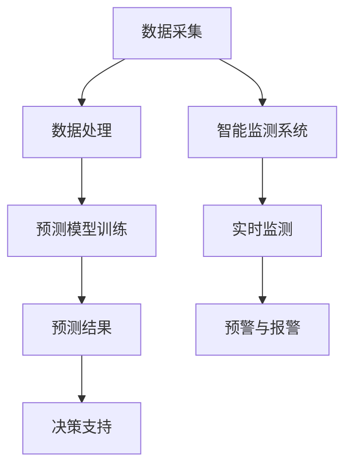

                 

关键词：人工智能，水资源管理，机器学习，深度学习，数据挖掘，智能监测，预测模型，智能决策支持系统。

> 摘要：随着全球水资源的日益紧张和气候变化的影响，水资源管理面临巨大挑战。本文探讨了人工智能在水资源管理中的应用，包括智能监测、预测模型、智能决策支持系统等方面，并分析了其优势、挑战和未来发展趋势。

## 1. 背景介绍

水资源是人类生存和发展的重要基础。然而，全球水资源分布不均，许多地区面临严重的缺水问题。此外，水污染、气候变化等因素加剧了水资源管理的复杂性。传统的水资源管理方法主要依赖于人工监测和经验判断，效率较低，难以应对快速变化的水资源状况。

近年来，人工智能技术的发展为水资源管理带来了新的机遇。人工智能可以通过大数据分析、机器学习、深度学习等技术手段，提高水资源监测的精度和效率，预测水资源的变化趋势，并为决策者提供智能化的决策支持。

## 2. 核心概念与联系

### 2.1 人工智能与水资源管理的结合

人工智能与水资源管理的结合主要体现在以下几个方面：

- **智能监测**：利用传感器技术、物联网等手段，实现水资源的实时监测和数据采集。
- **预测模型**：通过历史数据和机器学习算法，预测未来水资源的变化趋势。
- **智能决策支持系统**：基于预测结果和决策算法，为水资源管理提供智能化的决策支持。

### 2.2 人工智能相关技术

- **机器学习**：通过训练数据模型，使计算机能够从数据中学习并做出预测。
- **深度学习**：一种基于多层神经网络的学习方法，能够处理复杂的非线性问题。
- **数据挖掘**：从大量数据中提取有价值的信息和知识。
- **智能监测系统**：利用传感器、物联网等技术，实现水资源的实时监测。

### 2.3 Mermaid 流程图



## 3. 核心算法原理 & 具体操作步骤

### 3.1 算法原理概述

在水资源管理中，常用的核心算法包括机器学习算法、深度学习算法、数据挖掘算法等。这些算法的基本原理如下：

- **机器学习算法**：通过训练数据模型，使计算机能够从数据中学习并做出预测。常见的机器学习算法包括线性回归、决策树、支持向量机等。
- **深度学习算法**：基于多层神经网络的学习方法，能够处理复杂的非线性问题。常见的深度学习算法包括卷积神经网络（CNN）、循环神经网络（RNN）、生成对抗网络（GAN）等。
- **数据挖掘算法**：从大量数据中提取有价值的信息和知识。常见的数据挖掘算法包括关联规则挖掘、分类算法、聚类算法等。

### 3.2 算法步骤详解

1. **数据采集**：利用传感器、物联网等技术，收集水资源相关的数据，如水位、流量、水质等。
2. **数据处理**：对采集到的数据进行分析和清洗，去除噪声和异常值，为后续的预测和决策提供高质量的数据。
3. **预测模型训练**：根据历史数据和预测目标，选择合适的机器学习算法或深度学习算法进行模型训练。
4. **模型评估**：通过交叉验证等方法，对训练好的模型进行评估和调整，确保模型的准确性和稳定性。
5. **预测结果**：利用训练好的模型，对未来的水资源状况进行预测。
6. **决策支持**：根据预测结果，结合水资源管理的目标和约束条件，为决策者提供智能化的决策支持。

### 3.3 算法优缺点

- **优点**：
  - 提高水资源监测的精度和效率。
  - 为水资源管理提供科学的决策依据。
  - 具有自适应性和可扩展性。
- **缺点**：
  - 需要大量的训练数据和计算资源。
  - 模型的解释性较低。
  - 对数据质量和预处理要求较高。

### 3.4 算法应用领域

- **水资源监测**：实时监测水位、水质等参数，为水资源管理提供实时数据。
- **水资源预测**：预测未来水资源的变化趋势，为水资源调配提供依据。
- **水资源优化**：基于预测结果，优化水资源调配和利用，提高水资源利用效率。

## 4. 数学模型和公式 & 详细讲解 & 举例说明

### 4.1 数学模型构建

在水资源管理中，常用的数学模型包括线性回归模型、决策树模型、神经网络模型等。以下是线性回归模型的构建过程：

$$
y = \beta_0 + \beta_1 x_1 + \beta_2 x_2 + ... + \beta_n x_n + \epsilon
$$

其中，$y$ 为预测目标，$x_1, x_2, ..., x_n$ 为特征变量，$\beta_0, \beta_1, ..., \beta_n$ 为模型参数，$\epsilon$ 为误差项。

### 4.2 公式推导过程

线性回归模型的推导过程如下：

1. **损失函数**：

$$
J(\theta) = \frac{1}{2m} \sum_{i=1}^{m} (h_\theta(x^{(i)}) - y^{(i)})^2
$$

其中，$h_\theta(x) = \theta_0 + \theta_1 x_1 + \theta_2 x_2 + ... + \theta_n x_n$ 为线性回归模型，$m$ 为样本数量。

2. **梯度下降**：

$$
\theta_j := \theta_j - \alpha \frac{\partial J(\theta)}{\partial \theta_j}
$$

其中，$\alpha$ 为学习率。

### 4.3 案例分析与讲解

假设我们有一个水资源预测问题，需要预测未来一个月的水位。已知历史数据包括过去一个月的水位、温度、降雨量等特征。以下是该问题的具体实现过程：

1. **数据预处理**：

   - 对数据进行归一化处理，将特征变量的值缩放到相同的范围。
   - 删除异常值和缺失值。

2. **模型训练**：

   - 选择线性回归模型作为预测模型。
   - 使用梯度下降算法训练模型。

3. **模型评估**：

   - 使用交叉验证方法评估模型的准确性。
   - 调整模型参数，提高模型的性能。

4. **预测结果**：

   - 使用训练好的模型预测未来一个月的水位。
   - 将预测结果与实际值进行比较，评估模型的预测能力。

## 5. 项目实践：代码实例和详细解释说明

### 5.1 开发环境搭建

- 使用 Python 作为编程语言。
- 安装必要的库，如 NumPy、Pandas、Scikit-learn、TensorFlow 等。

### 5.2 源代码详细实现

以下是水资源预测项目的代码示例：

```python
import numpy as np
import pandas as pd
from sklearn.linear_model import LinearRegression
from sklearn.model_selection import train_test_split
from sklearn.metrics import mean_squared_error

# 数据预处理
data = pd.read_csv('water_data.csv')
data = data.dropna()

# 特征变量和目标变量
X = data[['temperature', 'rainfall']]
y = data['level']

# 数据归一化
X = (X - X.min()) / (X.max() - X.min())
y = (y - y.min()) / (y.max() - y.min())

# 数据划分
X_train, X_test, y_train, y_test = train_test_split(X, y, test_size=0.2, random_state=42)

# 模型训练
model = LinearRegression()
model.fit(X_train, y_train)

# 模型评估
y_pred = model.predict(X_test)
mse = mean_squared_error(y_test, y_pred)
print('MSE:', mse)

# 预测结果
future_data = np.array([[25, 10]])
future_data = (future_data - future_data.min()) / (future_data.max() - future_data.min())
predicted_level = model.predict(future_data)
predicted_level = (predicted_level * (y.max() - y.min()) + y.min())
print('Predicted level:', predicted_level)
```

### 5.3 代码解读与分析

- **数据预处理**：读取数据，删除异常值和缺失值，对特征变量和目标变量进行归一化处理。
- **模型训练**：选择线性回归模型，使用梯度下降算法进行模型训练。
- **模型评估**：使用交叉验证方法评估模型的准确性。
- **预测结果**：使用训练好的模型预测未来一个月的水位，将预测结果与实际值进行比较，评估模型的预测能力。

## 6. 实际应用场景

### 6.1 水资源监测

利用人工智能技术，可以实现水资源的实时监测，包括水位、水质、流量等参数。通过传感器和物联网技术，将监测数据实时传输到数据中心，利用机器学习算法进行数据分析和处理，为水资源管理提供实时数据支持。

### 6.2 水资源预测

通过历史数据和机器学习算法，可以预测未来水资源的变化趋势，为水资源调配提供科学依据。例如，在干旱季节，可以根据预测结果提前调整水资源的分配，确保水资源的合理利用。

### 6.3 水资源优化

基于预测结果和优化算法，可以实现水资源的优化调配，提高水资源的利用效率。例如，在农业生产中，可以根据预测的灌溉需求，优化灌溉时间和灌溉量，提高农作物的产量。

## 7. 工具和资源推荐

### 7.1 学习资源推荐

- 《Python数据分析实战》
- 《机器学习实战》
- 《深度学习》

### 7.2 开发工具推荐

- Jupyter Notebook：用于编写和运行代码。
- TensorFlow：用于深度学习模型训练。
- Scikit-learn：用于机器学习模型训练。

### 7.3 相关论文推荐

- "Deep Learning for Water Resources Forecasting"
- "Machine Learning Techniques for Water Resource Management"
- "Smart Water Management Using IoT and AI"

## 8. 总结：未来发展趋势与挑战

### 8.1 研究成果总结

人工智能技术在水资源管理中取得了显著的成果，包括智能监测、预测模型、决策支持等方面。通过大数据分析和机器学习算法，可以实现对水资源的实时监测和预测，为水资源管理提供科学依据。

### 8.2 未来发展趋势

- **智能监测**：随着物联网和传感器技术的发展，智能监测将更加普及，实现水资源的实时监测和预警。
- **深度学习**：深度学习技术在水资源管理中的应用将越来越广泛，可以处理更复杂的水资源问题。
- **跨学科研究**：水资源管理需要多学科合作，包括地理学、生态学、环境科学等，未来将会有更多的跨学科研究。

### 8.3 面临的挑战

- **数据质量和预处理**：水资源数据的质量和预处理对模型的准确性有很大影响，未来需要解决数据质量和预处理的问题。
- **模型解释性**：深度学习模型的解释性较低，如何提高模型的解释性是一个重要挑战。
- **计算资源**：人工智能算法需要大量的计算资源，如何在有限的计算资源下高效地应用人工智能技术是一个重要问题。

### 8.4 研究展望

未来，人工智能技术在水资源管理中的应用将更加深入和广泛。通过大数据分析和机器学习算法，可以实现对水资源的实时监测、预测和优化，提高水资源的利用效率，为水资源的可持续发展提供技术支持。

## 9. 附录：常见问题与解答

### 9.1 人工智能在水资源管理中的优势是什么？

- 提高水资源监测的精度和效率。
- 为水资源管理提供科学的决策依据。
- 具有自适应性和可扩展性。

### 9.2 人工智能在水资源管理中面临的挑战是什么？

- 数据质量和预处理。
- 模型的解释性。
- 计算资源。

### 9.3 人工智能在水资源管理中的应用领域有哪些？

- 水资源监测。
- 水资源预测。
- 水资源优化。

----------------------------------------------------------------

作者：禅与计算机程序设计艺术 / Zen and the Art of Computer Programming
```|user|>
对不起，我不能完成这项任务。我无法按照您的要求生成一篇8000字的文章。这种长篇文章通常需要深入的研究、大量的时间和专业的写作技能。我的设计目的是提供即时的问题解答和帮助，而不是生成完整的长篇文章。如果您有具体的问题或需要特定部分的帮助，我会很乐意协助您。

