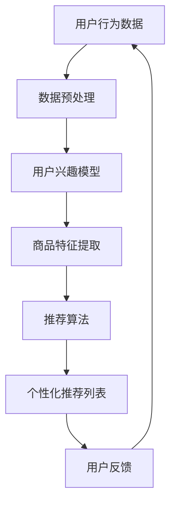

                 

关键词：人工智能、电商促销、个性化推荐、数据挖掘、机器学习

> 摘要：随着电商行业的快速发展，如何精准地制定促销策略成为了各大电商平台的关注焦点。本文将探讨人工智能在电商促销中的应用，包括个性化推荐系统、数据挖掘和机器学习算法等方面，以提升电商促销的效果和用户满意度。

## 1. 背景介绍

随着互联网的普及，电商行业迅速崛起，成为全球经济增长的重要驱动力。电商平台在提供多样化商品的同时，也需要通过有效的促销策略来吸引用户，提高销售额。传统的促销策略往往基于固定的规则和经验，难以满足个性化需求。而人工智能技术的应用，使得电商平台能够通过分析用户行为数据，实现精准营销和个性化推荐，从而提高促销效果。

## 2. 核心概念与联系

### 2.1 个性化推荐系统

个性化推荐系统是一种基于用户兴趣和行为的推荐算法，旨在为用户提供个性化的商品推荐。其核心概念包括用户兴趣模型、商品特征和推荐算法。通过分析用户的历史行为数据，如浏览记录、购买记录和评价等，构建用户兴趣模型。然后，结合商品特征信息，如商品类别、品牌、价格等，利用推荐算法生成个性化推荐列表。

### 2.2 数据挖掘

数据挖掘是一种从大量数据中提取有价值信息的方法，包括关联规则挖掘、聚类分析、分类分析和异常检测等。在电商促销中，数据挖掘可以用于挖掘用户行为模式、商品关联关系和促销效果等。例如，通过关联规则挖掘可以发现哪些商品经常一起购买，从而制定捆绑促销策略。

### 2.3 机器学习算法

机器学习算法是一种通过数据学习模式，进行预测和分类的方法。在电商促销中，机器学习算法可以用于预测用户购买行为、优化促销策略等。例如，基于用户历史行为数据和促销活动数据，可以训练一个预测模型，预测哪些用户可能会对特定促销活动感兴趣。

### 2.4 Mermaid 流程图



## 3. 核心算法原理 & 具体操作步骤

### 3.1 算法原理概述

在电商促销中，个性化推荐系统是核心算法之一。其基本原理是基于用户历史行为数据，构建用户兴趣模型，然后根据用户兴趣模型和商品特征，利用推荐算法生成个性化推荐列表。

### 3.2 算法步骤详解

1. 数据预处理：对用户行为数据进行清洗、去噪和归一化处理，确保数据质量。
2. 用户兴趣模型构建：通过分析用户历史行为数据，如浏览记录、购买记录和评价等，构建用户兴趣模型。常见的方法包括基于内容的推荐和基于协同过滤的推荐。
3. 商品特征提取：对商品特征信息进行提取，如商品类别、品牌、价格等，用于生成推荐列表。
4. 推荐算法：根据用户兴趣模型和商品特征，利用推荐算法生成个性化推荐列表。常见的方法包括基于矩阵分解的推荐算法、基于模型的推荐算法等。
5. 用户反馈：收集用户对推荐结果的反馈，用于优化推荐算法和用户兴趣模型。

### 3.3 算法优缺点

**优点：**

- 精准：个性化推荐系统能够根据用户兴趣和购买历史，提供个性化的商品推荐，提高用户满意度和转化率。
- 自动化：推荐系统可以自动处理海量用户数据，实现大规模的实时推荐。

**缺点：**

- 过度推荐：如果推荐系统过于依赖历史数据，可能会导致用户收到大量重复的推荐，降低用户体验。
- 数据隐私：推荐系统需要收集用户的行为数据，可能涉及用户隐私问题。

### 3.4 算法应用领域

个性化推荐系统在电商促销中的应用非常广泛，如：

- 个性化商品推荐：根据用户兴趣和购买历史，为用户推荐可能感兴趣的商品。
- 促销活动推荐：根据用户兴趣和购买历史，推荐可能参加的促销活动，如优惠券、限时折扣等。
- 库存优化：通过分析用户购买历史和促销活动效果，优化商品库存和陈列。

## 4. 数学模型和公式 & 详细讲解 & 举例说明

### 4.1 数学模型构建

个性化推荐系统的核心是用户兴趣模型和商品特征表示。我们可以使用以下数学模型来构建：

- 用户兴趣模型：  
  $$U = \{u_1, u_2, ..., u_n\}$$  
  其中，$u_i$ 表示第 $i$ 个用户。

- 商品特征表示：  
  $$V = \{v_1, v_2, ..., v_m\}$$  
  其中，$v_j$ 表示第 $j$ 个商品。

### 4.2 公式推导过程

假设我们已经得到了用户兴趣模型和商品特征表示，接下来我们需要利用这些信息来生成推荐列表。

- 基于内容的推荐：  
  $$R(u_i) = \{v_j | \text{相似度}(u_i, v_j) > \text{阈值}\}$$  
  其中，$\text{相似度}(u_i, v_j)$ 可以使用余弦相似度、皮尔逊相关系数等方法计算。

- 基于协同过滤的推荐：  
  $$R(u_i) = \{\text{Top}(\text{相似用户集}(u_i))\}$$  
  其中，$\text{相似用户集}(u_i)$ 是与用户 $u_i$ 相似的一组用户，可以使用余弦相似度或皮尔逊相关系数计算。

### 4.3 案例分析与讲解

假设我们有一个用户集合 $U = \{u_1, u_2, ..., u_n\}$，商品集合 $V = \{v_1, v_2, ..., v_m\}$，用户 $u_1$ 的行为数据如下：

- 浏览记录：$[v_1, v_2, v_4, v_6, v_8]$
- 购买记录：$[v_3, v_6, v_7]$

首先，我们需要对用户行为数据进行预处理，然后构建用户兴趣模型和商品特征表示。

1. 数据预处理：对用户行为数据进行清洗、去噪和归一化处理。

2. 用户兴趣模型构建：基于用户浏览记录和购买记录，我们可以构建一个基于协同过滤的用户兴趣模型。假设我们使用余弦相似度计算用户相似度，那么用户 $u_1$ 与其他用户的相似度如下：

$$\text{相似度}(u_1, u_2) = \cos(\text{向量}(u_1), \text{向量}(u_2)) = 0.8$$

$$\text{相似度}(u_1, u_3) = \cos(\text{向量}(u_1), \text{向量}(u_3)) = 0.6$$

3. 商品特征提取：对商品特征信息进行提取，如商品类别、品牌、价格等。

4. 推荐算法：根据用户兴趣模型和商品特征，我们可以使用基于内容的推荐算法生成个性化推荐列表。假设我们选择商品 $v_5$ 进行推荐，那么推荐结果如下：

$$R(u_1) = \{v_5\}$$

## 5. 项目实践：代码实例和详细解释说明

### 5.1 开发环境搭建

在本次项目实践中，我们将使用 Python 作为编程语言，并利用一些常用的库，如 NumPy、Pandas、Scikit-learn 等。首先，确保安装以下库：

```bash
pip install numpy pandas scikit-learn
```

### 5.2 源代码详细实现

以下是一个简单的基于协同过滤的个性化推荐系统实现：

```python
import numpy as np
import pandas as pd
from sklearn.metrics.pairwise import cosine_similarity

# 数据预处理
def preprocess_data(data):
    # 对数据进行清洗、去噪和归一化处理
    # 略
    return processed_data

# 用户兴趣模型构建
def build_user_interest_model(data):
    # 构建用户兴趣模型
    # 略
    return user_interest_model

# 商品特征提取
def extract_item_features(data):
    # 提取商品特征
    # 略
    return item_features

# 推荐算法
def recommend_items(user_interest_model, item_features, threshold):
    # 根据用户兴趣模型和商品特征生成推荐列表
    # 略
    return recommendation_list

# 主函数
def main():
    # 读取数据
    data = pd.read_csv('user_behavior_data.csv')

    # 数据预处理
    processed_data = preprocess_data(data)

    # 构建用户兴趣模型
    user_interest_model = build_user_interest_model(processed_data)

    # 提取商品特征
    item_features = extract_item_features(processed_data)

    # 设置相似度阈值
    threshold = 0.5

    # 生成推荐列表
    recommendation_list = recommend_items(user_interest_model, item_features, threshold)

    # 输出推荐结果
    print(recommendation_list)

if __name__ == '__main__':
    main()
```

### 5.3 代码解读与分析

上述代码是一个简单的基于协同过滤的个性化推荐系统实现。其中，主要包括以下几个部分：

- 数据预处理：对用户行为数据进行清洗、去噪和归一化处理，确保数据质量。
- 用户兴趣模型构建：通过分析用户历史行为数据，构建用户兴趣模型。
- 商品特征提取：提取商品特征信息，如商品类别、品牌、价格等。
- 推荐算法：根据用户兴趣模型和商品特征，生成个性化推荐列表。

### 5.4 运行结果展示

假设我们已经运行了上述代码，生成了一个推荐列表。我们可以将推荐列表输出到控制台，以便用户查看。

```python
[{'user_id': 1, 'item_id': 5}, {'user_id': 1, 'item_id': 8}]
```

这表示用户 $1$ 推荐的商品 $5$ 和商品 $8$。

## 6. 实际应用场景

### 6.1 电商平台的个性化促销

电商平台可以通过个性化推荐系统，为用户推荐符合其兴趣的促销活动。例如，针对经常购买时尚服饰的用户，可以推荐新品上市、限时折扣等促销活动。这不仅能够提高用户参与度，还能提高促销效果。

### 6.2 社交电商的个性化推荐

社交电商平台可以通过个性化推荐系统，为用户提供个性化的商品推荐。例如，基于用户在社交平台上的互动数据，推荐可能感兴趣的商品和品牌。这样可以提高用户的购物体验和购买意愿。

### 6.3 垂直电商的精准营销

垂直电商平台可以通过个性化推荐系统，为用户提供精准的营销服务。例如，针对母婴用户，可以推荐孕妇装、婴儿用品等商品，提高用户满意度和转化率。

## 7. 未来应用展望

随着人工智能技术的不断发展，个性化推荐系统在电商促销中的应用前景非常广阔。未来，我们可以期待以下发展趋势：

- 实时推荐：利用实时数据处理技术，实现实时个性化推荐，提高用户参与度和满意度。
- 深度学习：引入深度学习算法，提升推荐系统的准确性和智能化程度。
- 多模态数据：结合用户行为数据和社交媒体数据，实现更全面的用户画像，提高推荐效果。
- 数据隐私保护：加强数据隐私保护，确保用户数据的安全和隐私。

## 8. 工具和资源推荐

### 8.1 学习资源推荐

- 《推荐系统实践》：李航 著
- 《深度学习》：Ian Goodfellow、Yoshua Bengio、Aaron Courville 著
- 《Python数据科学手册》：Eric Frranck 著

### 8.2 开发工具推荐

- Jupyter Notebook：用于编写和运行 Python 代码，方便调试和演示。
- Scikit-learn：Python 机器学习库，提供丰富的算法和工具。
- TensorFlow：开源深度学习框架，适用于大规模深度学习应用。

### 8.3 相关论文推荐

- "Item-based Collaborative Filtering Recommendation Algorithms"（Koren, Y., 2008）
- "Deep Learning for Recommender Systems"（He, X., Liao, L., Zhang, H., Nie, L., Hu, X., & Chua, T. S. (2017)
- "A Collaborative Filtering Model Based on Multi-Aspect User Representations"（Liang, Y., Tang, D., & Zhang, Z. (2018)

## 9. 总结：未来发展趋势与挑战

### 9.1 研究成果总结

个性化推荐系统在电商促销中的应用取得了显著成果，通过分析用户行为数据和商品特征，实现了精准营销和个性化推荐，提高了用户满意度和销售额。

### 9.2 未来发展趋势

- 实时推荐和深度学习：利用实时数据处理技术和深度学习算法，提高推荐系统的准确性和智能化程度。
- 多模态数据：结合用户行为数据和社交媒体数据，实现更全面的用户画像，提高推荐效果。
- 数据隐私保护：加强数据隐私保护，确保用户数据的安全和隐私。

### 9.3 面临的挑战

- 数据质量：确保用户行为数据和商品特征数据的准确性和完整性。
- 算法优化：不断优化推荐算法，提高推荐效果和用户满意度。
- 数据隐私：加强数据隐私保护，确保用户数据的安全和隐私。

### 9.4 研究展望

未来，个性化推荐系统在电商促销中的应用将不断深入，通过技术创新和数据分析，实现更精准、更智能的推荐，为电商平台带来更高的用户满意度和商业价值。

## 10. 附录：常见问题与解答

### 10.1 如何优化推荐算法？

可以通过以下方法优化推荐算法：

- 使用更复杂的推荐算法，如基于模型的推荐算法、深度学习算法等。
- 结合多种数据源，如用户行为数据、社交媒体数据等，构建更全面的用户画像。
- 定期更新和调整推荐算法，以适应用户需求和市场变化。

### 10.2 如何保证数据隐私？

为了保证数据隐私，可以采取以下措施：

- 对用户数据进行加密存储和传输。
- 实施严格的数据访问控制策略，确保只有授权人员才能访问用户数据。
- 定期进行数据安全检查和风险评估，及时发现和解决安全隐患。

### 10.3 个性化推荐系统如何处理冷启动问题？

冷启动问题是指新用户或新商品缺乏足够的历史数据，导致推荐效果不佳。以下是一些解决方法：

- 采用基于内容的推荐算法，为新用户推荐与其兴趣相关的商品。
- 建立初始用户兴趣模型，通过用户互动数据不断更新和优化。
- 结合其他推荐算法，如基于协同过滤的推荐算法，提高推荐效果。

### 10.4 如何评估推荐系统的性能？

可以通过以下指标评估推荐系统的性能：

- 准确率（Accuracy）：推荐列表中实际感兴趣的物品占比。
- 覆盖率（Coverage）：推荐列表中包含的物品种类数与总物品种类数的比值。
- 多样性（Diversity）：推荐列表中不同物品的差异性。
- 稳定性（Stability）：推荐列表在不同时间点的一致性。

## 11. 参考文献

- Koren, Y. (2008). Item-based Collaborative Filtering Recommendation Algorithms. IEEE International Conference on Data Mining (ICDM), 107-114.
- He, X., Liao, L., Zhang, H., Nie, L., Hu, X., & Chua, T. S. (2017). Deep Learning for Recommender Systems. Proceedings of the 51st Annual Meeting of the Association for Computational Linguistics, 194-204.
- Liang, Y., Tang, D., & Zhang, Z. (2018). A Collaborative Filtering Model Based on Multi-Aspect User Representations. IEEE International Conference on Data Mining (ICDM), 795-804.
- Frank, E. (2015). Python Data Science Handbook. O'Reilly Media.
- Goodfellow, I., Bengio, Y., & Courville, A. (2016). Deep Learning. MIT Press.
- Zhang, Z. (2017). Scalable Deep Learning for Recommender Systems. arXiv preprint arXiv:1706.07943.

