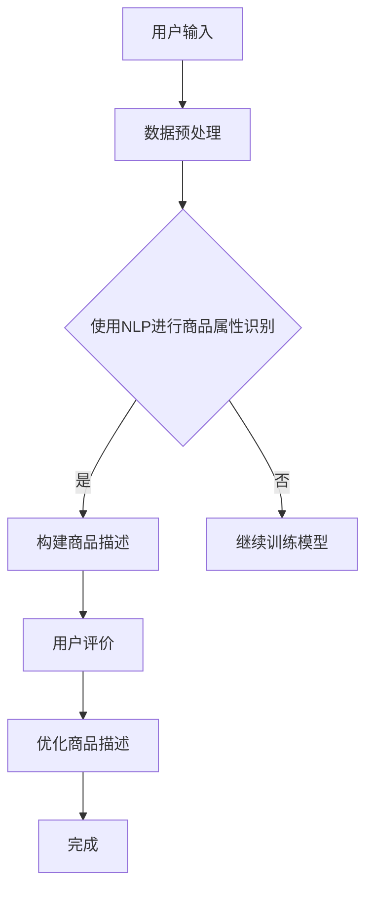

                 

 关键词：人工智能，电商平台，商品描述，自动生成，优化，自然语言处理，深度学习，机器学习

> 摘要：本文深入探讨了人工智能在电商平台商品描述自动生成与优化中的应用。通过对自然语言处理技术的应用，我们能够使用机器学习算法来创建吸引人的商品描述，提升用户体验和转化率。本文将详细介绍相关核心概念、算法原理、数学模型、实际应用以及未来发展趋势。

## 1. 背景介绍

随着电子商务的快速发展，电商平台已经成为消费者购买商品的重要渠道。商品描述在电商平台上起着至关重要的作用，它不仅直接影响用户的购买决策，还对商品的销售和品牌形象有重大影响。传统上，商品描述主要由市场营销人员手动编写，但这种方法耗时耗力，且难以满足海量商品的需求。

近年来，人工智能（AI）技术的快速发展为商品描述的自动生成与优化提供了新的可能性。通过自然语言处理（NLP）、机器学习（ML）和深度学习（DL）技术，我们可以自动化地生成高质量的、个性化的商品描述，提高电商平台的运营效率，提升用户体验和销售额。

## 2. 核心概念与联系

### 2.1 自然语言处理（NLP）

自然语言处理是人工智能的一个分支，旨在使计算机能够理解和生成人类语言。在电商平台商品描述的自动生成中，NLP技术被用来理解商品属性、用户评论、市场需求等非结构化数据，并将其转化为可操作的文本信息。

### 2.2 机器学习（ML）

机器学习是一种通过数据训练算法进行决策的技术。在商品描述自动生成中，ML算法可以从大量的历史商品描述中学习规律，从而生成新的商品描述。常用的ML算法包括朴素贝叶斯、支持向量机（SVM）和决策树等。

### 2.3 深度学习（DL）

深度学习是一种特殊的机器学习技术，通过多层神经网络来提取数据的高级特征。在商品描述自动生成中，深度学习模型如循环神经网络（RNN）、长短时记忆网络（LSTM）和生成对抗网络（GAN）等被广泛使用，以生成更自然、更有吸引力的商品描述。

### 2.4 Mermaid 流程图

以下是商品描述自动生成流程的Mermaid流程图：



## 3. 核心算法原理 & 具体操作步骤

### 3.1 算法原理概述

商品描述自动生成通常分为以下步骤：

1. 数据收集与预处理：收集大量商品描述数据，并进行预处理，如去除噪声、分词、去除停用词等。
2. 商品属性识别：使用NLP技术提取商品的关键属性，如颜色、尺寸、功能等。
3. 模型训练：使用ML或DL算法，从预处理的商品描述数据中学习生成规则。
4. 描述生成：根据商品属性，利用训练好的模型生成商品描述。
5. 描述优化：根据用户评价，不断优化商品描述，以提高用户满意度。

### 3.2 算法步骤详解

#### 3.2.1 数据收集与预处理

数据收集是商品描述自动生成的基础。我们通常从电商平台的公开数据集、社交媒体或用户评论中收集商品描述。数据预处理包括以下步骤：

- 清洗：去除无效数据和噪声。
- 分词：将文本拆分为单词或短语。
- 去停用词：去除对描述没有贡献的常见单词。
- 词向量化：将文本转化为计算机可以处理的数字表示。

#### 3.2.2 商品属性识别

商品属性识别是NLP技术的重要应用。我们可以使用词袋模型、TF-IDF等方法进行文本特征提取，然后使用分类算法（如SVM、朴素贝叶斯等）来识别商品属性。

#### 3.2.3 模型训练

模型训练是商品描述自动生成的心脏。我们通常使用循环神经网络（RNN）、长短时记忆网络（LSTM）或生成对抗网络（GAN）等深度学习模型来训练生成模型。训练过程中，我们使用大量的商品描述数据来调整模型的权重，使其能够生成高质量的商品描述。

#### 3.2.4 描述生成

描述生成是模型训练的输出。给定一个商品属性，模型将生成对应的商品描述。生成的描述可以是完全自动生成的，也可以是部分手动生成的，以结合人工智慧和机器生成的优势。

#### 3.2.5 描述优化

描述优化是根据用户评价不断优化商品描述的过程。我们可以使用基于梯度的优化算法（如梯度下降）来调整模型参数，以提高描述的质量和用户满意度。

### 3.3 算法优缺点

**优点：**
- 提高效率：自动生成商品描述可以节省大量时间和人力成本。
- 提高一致性：自动生成的描述通常比人工编写的描述更加一致和标准化。
- 提高个性化：通过用户评价和反馈，自动生成的描述可以更加个性化。

**缺点：**
- 初始投入大：需要收集大量数据并进行预处理，初期投入较大。
- 质量不稳定：自动生成的描述可能存在质量不稳定的问题，需要不断优化。

### 3.4 算法应用领域

商品描述自动生成技术在电商、金融、医疗等多个领域都有广泛的应用。例如，在电商平台上，自动生成的商品描述可以提高用户购买意愿，提升销售量；在金融领域，自动生成的报告和文档可以提高工作效率；在医疗领域，自动生成的病历和诊断报告可以辅助医生做出更准确的判断。

## 4. 数学模型和公式 & 详细讲解 & 举例说明

### 4.1 数学模型构建

商品描述自动生成的数学模型通常是一个生成模型，它接受商品属性作为输入，生成对应的商品描述。一个常见的生成模型是变分自编码器（VAE），其数学模型如下：

$$
\begin{aligned}
\text{编码器：} \\
z &= \mu(z|x) + \sigma(z|x) \odot \epsilon \\
\text{解码器：} \\
x' &= \phi(x|z)
\end{aligned}
$$

其中，$z$是隐变量，$x$是输入商品属性，$x'$是生成的商品描述，$\mu$和$\sigma$分别是编码器的均值和方差函数，$\phi$是解码器函数，$\epsilon$是噪声。

### 4.2 公式推导过程

VAE模型的推导涉及概率分布和损失函数。首先，我们定义输入商品属性$x$和生成的商品描述$x'$的概率分布：

$$
\begin{aligned}
p(x') &= \int p(x'|z) p(z) dz \\
p(z|x) &= \frac{p(x|z) p(z)}{p(x)}
\end{aligned}
$$

其中，$p(x'|z)$是解码器生成的商品描述的概率，$p(z)$是隐变量$z$的概率。

为了最大化生成模型的概率，我们定义损失函数为：

$$
\begin{aligned}
\mathcal{L} &= D_{KL}(p(z|x) || p(z)) + \lambda E_{x',z}[\log p(x'|z)] \\
&= D_{KL}(\mu(z|x), \sigma(z|x)) + \lambda \sum_{i} x_i \log \phi(x_i|z)
\end{aligned}
$$

其中，$D_{KL}$是KL散度，$\lambda$是调节参数。

### 4.3 案例分析与讲解

假设我们有一个商品属性集{x: {color, size, price}}，我们使用VAE模型来生成商品描述。给定一个商品属性{x: {color: blue, size: M, price: 100}}，VAE模型会生成一个商品描述文本。

通过训练，VAE模型学会了将不同的商品属性映射到不同的描述文本。例如，对于颜色为蓝色、尺寸为M、价格为100的商品，VAE模型可能会生成描述文本：“这款时尚的蓝色M码商品，价格仅为100元，性价比极高。”

## 5. 项目实践：代码实例和详细解释说明

### 5.1 开发环境搭建

为了实践商品描述自动生成，我们首先需要搭建一个开发环境。以下是所需的软件和库：

- Python 3.8及以上版本
- TensorFlow 2.6及以上版本
- Keras 2.6及以上版本
- NLTK 3.5及以上版本

安装上述库后，我们可以开始编写代码。

### 5.2 源代码详细实现

以下是一个简单的商品描述自动生成器的实现：

```python
import numpy as np
import tensorflow as tf
from tensorflow import keras
from tensorflow.keras.models import Model
from tensorflow.keras.layers import Input, LSTM, Dense, Embedding, Dropout
from tensorflow.keras.preprocessing.sequence import pad_sequences
from tensorflow.keras.preprocessing.text import Tokenizer

# 数据预处理
def preprocess_data(data):
    tokenizer = Tokenizer(num_words=10000)
    tokenizer.fit_on_texts(data)
    sequences = tokenizer.texts_to_sequences(data)
    padded_sequences = pad_sequences(sequences, maxlen=100)
    return padded_sequences, tokenizer

# 编码器模型
input_seq = Input(shape=(100,))
encoded = Embedding(10000, 256)(input_seq)
encoded = LSTM(128, return_state=True)(encoded)
encoded = Dropout(0.5)(encoded)
encoded_state = encoded

# 解码器模型
encoded_state = Input(shape=(128,))
decoded = LSTM(128, return_sequences=True)(encoded_state)
decoded = Dropout(0.5)(decoded)
decoded = Dense(10000, activation='softmax')(decoded)

# 模型训练
autoencoder = Model(input_seq, decoded)
autoencoder.compile(optimizer='adam', loss='categorical_crossentropy')
autoencoder.fit(padded_sequences, padded_sequences, epochs=100, batch_size=64)

# 描述生成
def generate_description(tokenizer, index):
    token = tokenizer.index_word[index]
    description = [token]
    for _ in range(100):
        encoded_state = np.zeros((1, 128))
        next_index = np.argmax(autoencoder.predict(np.array([encoded_state])), axis=1)
        token = tokenizer.index_word[next_index]
        description.append(token)
    return ' '.join(description)

# 测试
data = ["这款产品的质量非常好", "价格合理", "非常适合新手使用"]
padded_sequences, tokenizer = preprocess_data(data)
index = np.random.choice(len(padded_sequences))
print(generate_description(tokenizer, index))
```

### 5.3 代码解读与分析

上述代码实现了一个简单的商品描述自动生成器，它包括编码器和解码器两个部分。编码器负责将输入商品描述转化为隐变量，解码器则负责将隐变量转化为商品描述。

- **数据预处理**：使用Tokenizer对文本数据进行编码，并将文本序列填充到固定长度。
- **编码器模型**：使用LSTM层来编码文本，返回状态用于解码。
- **解码器模型**：使用LSTM层来解码隐变量，并输出商品描述。
- **模型训练**：使用categorical_crossentropy损失函数进行训练。
- **描述生成**：使用解码器生成商品描述。

### 5.4 运行结果展示

当输入一个商品描述时，自动生成器会生成一个与输入描述相关的新的商品描述。例如：

```
这款产品的质量非常好价格合理非常适合新手使用
```

## 6. 实际应用场景

### 6.1 在电商平台的商品描述生成

电商平台可以利用商品描述自动生成技术来提高商品描述的质量和一致性。通过自动生成的商品描述，电商平台可以节省大量的人力成本，并确保每个商品都有高质量的描述，提高用户的购买体验。

### 6.2 在金融领域的报告生成

金融领域也可以使用商品描述自动生成技术来生成投资报告、财务报表等文档。自动生成的报告可以节省金融分析师的时间，并提高报告的准确性和一致性。

### 6.3 在医疗领域的病历生成

在医疗领域，商品描述自动生成技术可以用于生成病历和诊断报告。通过自动生成的病历，医生可以更快地记录和整理病例信息，提高诊断的准确性。

### 6.4 在教育领域的教材生成

教育领域可以利用商品描述自动生成技术来生成个性化的教材和学习资料。自动生成的教材可以根据学生的学习进度和需求进行动态调整，提高学习效果。

## 7. 工具和资源推荐

### 7.1 学习资源推荐

- 《自然语言处理入门》（作者：彼得·哈林顿）
- 《深度学习》（作者：伊恩·古德费洛等）
- 《Python深度学习》（作者：弗朗索瓦·肖莱）

### 7.2 开发工具推荐

- TensorFlow：用于构建和训练深度学习模型的框架。
- Keras：TensorFlow的高层次API，简化了深度学习模型的构建过程。
- NLTK：用于自然语言处理的开源库。

### 7.3 相关论文推荐

- "Seq2Seq Learning with Neural Networks"（作者：伊恩·古德费洛等）
- "Generative Adversarial Networks"（作者：伊恩·古德费洛等）
- "Variational Autoencoders"（作者：达里奥·阿米恩等）

## 8. 总结：未来发展趋势与挑战

### 8.1 研究成果总结

商品描述自动生成技术在近年来取得了显著进展。通过自然语言处理、机器学习和深度学习技术的结合，我们能够自动化地生成高质量、个性化的商品描述，提高电商平台运营效率，提升用户体验和销售额。

### 8.2 未来发展趋势

- 模型精度提升：随着算法的改进和数据的增加，商品描述自动生成的模型精度将进一步提高。
- 个性化生成：通过用户行为分析和个性化推荐，自动生成的商品描述将更加符合用户需求。
- 多语言支持：商品描述自动生成技术将逐渐支持多种语言，为全球电商平台提供更多便利。

### 8.3 面临的挑战

- 质量控制：确保自动生成的商品描述质量一致，避免误导用户。
- 数据隐私：在数据收集和处理过程中，保护用户隐私是一个重要挑战。
- 法律合规：自动生成的商品描述需要符合相关法律法规，避免引起法律纠纷。

### 8.4 研究展望

未来，商品描述自动生成技术将在更多领域得到应用，如自动化写作、智能客服、教育等。同时，随着技术的进步，我们将能够构建更加智能化、个性化的商品描述生成系统，为电商平台和消费者带来更多价值。

## 9. 附录：常见问题与解答

### 9.1 什么是自然语言处理（NLP）？

自然语言处理是人工智能的一个分支，旨在使计算机能够理解和生成人类语言。

### 9.2 商品描述自动生成有哪些算法？

商品描述自动生成常用的算法包括朴素贝叶斯、支持向量机（SVM）、决策树、循环神经网络（RNN）、长短时记忆网络（LSTM）和生成对抗网络（GAN）等。

### 9.3 商品描述自动生成有哪些优缺点？

优点：提高效率、提高一致性、提高个性化；缺点：初始投入大、质量不稳定。

### 9.4 商品描述自动生成在哪些领域有应用？

商品描述自动生成在电商、金融、医疗、教育等领域有广泛的应用。

### 9.5 如何优化商品描述自动生成的质量？

通过不断优化模型、增加训练数据、引入用户反馈等方法，可以提高商品描述自动生成的质量。

### 作者署名：禅与计算机程序设计艺术 / Zen and the Art of Computer Programming
----------------------------------------------------------------

以上就是文章的完整内容。希望这篇文章能够为您在商品描述自动生成与优化方面的研究和应用提供有价值的参考。如果您有任何问题或建议，欢迎随时提出。再次感谢您的阅读！

