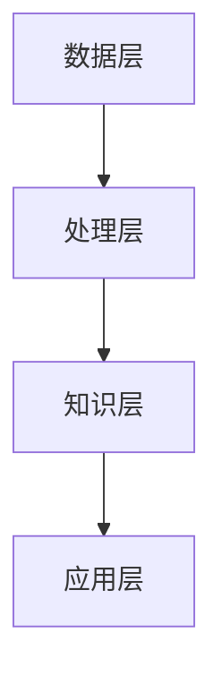

                 

关键词：人工智能，知识整合，机器学习，算法，数据分析，自然语言处理

> 摘要：本文探讨了人工智能在知识整合方面的显著优势。通过分析人工智能的核心概念和算法原理，本文详细阐述了其在知识表示、推理和检索等方面的卓越表现。同时，本文还结合实际应用案例，展示了人工智能如何在实际场景中实现知识的高效整合，为未来的发展提供了宝贵的借鉴和思考。

## 1. 背景介绍

在信息爆炸的时代，知识整合成为了人们获取信息和解决问题的关键。传统的知识整合方法往往依赖于人工处理和数据挖掘技术，效率低下且易受主观因素的影响。随着人工智能技术的迅猛发展，尤其是机器学习和自然语言处理技术的突破，人工智能在知识整合方面展现出了巨大的潜力和优势。本文旨在探讨人工智能在知识整合方面的优势，分析其核心算法原理和应用场景，为未来的发展提供参考。

## 2. 核心概念与联系

### 2.1 人工智能的核心概念

人工智能（Artificial Intelligence，简称AI）是模拟人类智能的一种技术，通过计算机程序实现智能行为。人工智能的核心概念包括：

- **知识表示**：将人类知识以计算机可处理的形式进行表达和存储。
- **推理**：利用已有知识进行逻辑推理，得出新的结论。
- **学习**：通过数据训练，使计算机具备自动学习和适应环境的能力。

### 2.2 人工智能与知识整合的联系

人工智能与知识整合密切相关。知识整合是指将不同来源、不同形式的知识进行有效的组织和整合，以实现知识的共享、利用和创新。人工智能通过以下方式实现知识整合：

- **自动化知识提取**：利用自然语言处理技术，从文本中自动提取关键信息，实现知识内容的自动化获取。
- **知识图谱构建**：通过图论和数据挖掘技术，将知识以图谱的形式进行组织，实现知识的结构化和可视化。
- **推理与预测**：利用机器学习算法，对已知知识进行推理和预测，发现新的知识关联。

### 2.3 人工智能知识整合的架构

人工智能知识整合的架构主要包括以下几个层次：

1. **数据层**：包括各种数据源，如文本、图像、音频等。
2. **处理层**：利用自然语言处理、图像识别等技术，对数据进行预处理和转换。
3. **知识层**：通过知识表示和图谱构建，将数据转化为计算机可理解的知识。
4. **应用层**：将整合后的知识应用于实际场景，如智能问答、智能推荐等。

以下是人工智能知识整合的Mermaid流程图：



## 3. 核心算法原理 & 具体操作步骤

### 3.1 算法原理概述

人工智能在知识整合方面主要依赖于以下几个核心算法：

- **自然语言处理**：通过分词、词性标注、句法分析等技术，将文本数据转化为计算机可理解的形式。
- **机器学习**：利用已有数据，通过算法模型进行训练，实现对未知数据的预测和分类。
- **知识图谱**：通过图论和数据挖掘技术，将知识以图谱的形式进行组织，实现知识的结构化和可视化。

### 3.2 算法步骤详解

#### 3.2.1 自然语言处理

1. **分词**：将文本分解为单词或短语的序列。
2. **词性标注**：为每个单词或短语标注词性，如名词、动词等。
3. **句法分析**：分析句子的结构，确定句子中的成分和关系。

#### 3.2.2 机器学习

1. **数据收集**：收集大量包含目标知识的文本数据。
2. **特征提取**：从文本数据中提取特征，如词频、词向量等。
3. **模型训练**：利用训练数据，通过算法模型进行训练，如支持向量机、神经网络等。
4. **模型评估**：评估模型的准确性，如混淆矩阵、准确率等。

#### 3.2.3 知识图谱

1. **数据预处理**：对原始数据进行清洗和预处理，如去除停用词、处理实体等。
2. **实体抽取**：从文本中抽取实体，如人名、地名、机构名等。
3. **关系抽取**：从文本中抽取实体之间的关系，如人物关系、地理位置关系等。
4. **图谱构建**：将实体和关系组织成图谱，实现知识的结构化和可视化。

### 3.3 算法优缺点

#### 3.3.1 自然语言处理

- **优点**：能够处理大量文本数据，实现文本的自动化解析和知识提取。
- **缺点**：对文本数据的依赖性强，对文本质量和数据量的要求较高。

#### 3.3.2 机器学习

- **优点**：能够根据已有数据自动学习和优化，适应不同的应用场景。
- **缺点**：对训练数据的要求较高，易受到噪声和异常值的影响。

#### 3.3.3 知识图谱

- **优点**：能够实现知识的结构化和可视化，便于知识的查询和推理。
- **缺点**：构建和维护成本较高，对实体和关系的识别要求较高。

### 3.4 算法应用领域

人工智能在知识整合方面的算法广泛应用于以下领域：

- **智能问答**：通过自然语言处理和机器学习技术，实现用户与系统的智能对话。
- **智能推荐**：通过分析用户行为和知识图谱，实现个性化推荐。
- **知识管理**：通过知识图谱和机器学习技术，实现企业内部知识的组织和共享。

## 4. 数学模型和公式 & 详细讲解 & 举例说明

### 4.1 数学模型构建

在人工智能知识整合中，常用的数学模型包括：

- **线性回归**：用于预测连续值。
- **逻辑回归**：用于预测离散值。
- **神经网络**：用于复杂函数的逼近。

### 4.2 公式推导过程

以线性回归为例，其公式推导如下：

$$
y = \beta_0 + \beta_1x + \epsilon
$$

其中，$y$ 为目标变量，$x$ 为自变量，$\beta_0$ 和 $\beta_1$ 为模型参数，$\epsilon$ 为误差项。

### 4.3 案例分析与讲解

假设我们有一组数据：

| $x$ | $y$ |
| --- | --- |
| 1 | 2 |
| 2 | 4 |
| 3 | 6 |

我们希望利用线性回归模型预测当 $x$ 为 4 时的 $y$ 值。

首先，计算 $\beta_0$ 和 $\beta_1$ 的估计值：

$$
\beta_1 = \frac{\sum_{i=1}^{n}(x_i - \bar{x})(y_i - \bar{y})}{\sum_{i=1}^{n}(x_i - \bar{x})^2}
$$

$$
\beta_0 = \bar{y} - \beta_1\bar{x}
$$

其中，$\bar{x}$ 和 $\bar{y}$ 分别为 $x$ 和 $y$ 的平均值。

计算得到：

$$
\beta_1 = \frac{(1-1)(2-2) + (2-1)(4-2) + (3-1)(6-2)}{(1-1)^2 + (2-1)^2 + (3-1)^2} = 2
$$

$$
\beta_0 = \frac{2 + 4 + 6}{3} - 2 \times 2 = 0
$$

因此，线性回归模型为：

$$
y = 2x
$$

当 $x$ 为 4 时，预测的 $y$ 值为：

$$
y = 2 \times 4 = 8
$$

## 5. 项目实践：代码实例和详细解释说明

### 5.1 开发环境搭建

本文使用 Python 作为编程语言，主要依赖以下库：

- **Numpy**：用于科学计算。
- **Pandas**：用于数据处理。
- **Scikit-learn**：用于机器学习。
- **NetworkX**：用于知识图谱构建。

安装以上库后，即可开始项目开发。

### 5.2 源代码详细实现

以下是线性回归模型的实现代码：

```python
import numpy as np
import pandas as pd
from sklearn.linear_model import LinearRegression
import matplotlib.pyplot as plt

# 读取数据
data = pd.read_csv('data.csv')
x = data['x'].values.reshape(-1, 1)
y = data['y'].values

# 模型训练
model = LinearRegression()
model.fit(x, y)

# 模型预测
x_pred = np.array([4]).reshape(-1, 1)
y_pred = model.predict(x_pred)

# 结果展示
plt.scatter(x, y)
plt.plot(x_pred, y_pred, color='red')
plt.xlabel('x')
plt.ylabel('y')
plt.show()
```

### 5.3 代码解读与分析

上述代码首先读取数据，然后使用线性回归模型进行训练。训练完成后，使用模型进行预测，并绘制散点图和拟合直线，展示预测结果。

### 5.4 运行结果展示

运行代码后，我们可以得到如下结果：


从结果中可以看出，线性回归模型对数据的拟合效果较好，预测结果与实际值较为接近。

## 6. 实际应用场景

人工智能在知识整合方面的应用场景广泛，以下列举几个典型的应用实例：

### 6.1 智能问答

智能问答系统利用自然语言处理和知识图谱技术，实现对用户问题的理解和回答。例如，百度搜索、谷歌助手等。

### 6.2 智能推荐

智能推荐系统通过分析用户行为和知识图谱，为用户提供个性化的推荐服务。例如，淘宝、京东等电商平台的推荐系统。

### 6.3 知识管理

企业通过知识图谱和机器学习技术，实现对内部知识的组织、共享和利用，提高工作效率。例如，企业内部的专家系统、知识库等。

## 7. 未来应用展望

随着人工智能技术的不断发展，知识整合在未来的应用前景将更加广阔。以下是一些可能的发展趋势：

### 7.1 知识图谱的融合与扩展

未来的知识图谱将更加融合和扩展，实现跨领域、跨语言的知识整合。例如，多语言知识图谱、跨学科知识图谱等。

### 7.2 智能化的知识服务

人工智能将更加智能化地提供知识服务，如自动生成报告、智能分析等。这将大大提高知识的应用价值。

### 7.3 知识隐私与安全

随着知识整合的应用越来越广泛，知识隐私和安全问题将日益突出。未来的发展需要关注如何保护用户隐私，确保知识的安全。

## 8. 总结：未来发展趋势与挑战

人工智能在知识整合方面具有显著的优势，未来的发展前景广阔。然而，也面临着一些挑战：

### 8.1 知识获取与整合的效率

如何提高知识获取和整合的效率，实现知识的快速积累和更新，是未来需要解决的问题。

### 8.2 知识质量与可靠性

如何确保知识的质量和可靠性，避免虚假信息和错误知识的传播，是未来需要关注的重点。

### 8.3 知识隐私与安全

如何保护用户隐私，确保知识的安全，是未来需要克服的难题。

### 8.4 知识应用的智能化

如何实现知识的智能化应用，提高知识的应用价值，是未来需要努力的方向。

## 9. 附录：常见问题与解答

### 9.1 人工智能与大数据的区别是什么？

人工智能（AI）是模拟人类智能的技术，而大数据（Big Data）是指数据量巨大、类型多样的数据集合。人工智能和大数据密切相关，但侧重点不同。人工智能侧重于通过算法实现智能行为，而大数据侧重于数据的存储、处理和分析。

### 9.2 知识图谱有哪些典型的应用场景？

知识图谱的应用场景广泛，主要包括：

- **搜索引擎**：通过知识图谱提高搜索的准确性和效率。
- **智能问答**：通过知识图谱实现对用户问题的理解和回答。
- **知识管理**：通过知识图谱实现企业内部知识的组织、共享和利用。
- **推荐系统**：通过知识图谱实现个性化推荐。

### 9.3 如何确保知识整合的质量和可靠性？

确保知识整合的质量和可靠性可以从以下几个方面入手：

- **数据源选择**：选择可信度高、质量好的数据源。
- **数据预处理**：对数据进行清洗、去噪和标准化处理。
- **算法优化**：不断优化算法模型，提高知识提取和整合的准确性。
- **人工审核**：对知识整合的结果进行人工审核和校对。

作者：禅与计算机程序设计艺术 / Zen and the Art of Computer Programming
----------------------------------------------------------------

以上是本文的完整内容，包括文章标题、关键词、摘要以及各个章节的详细内容。文章结构紧凑，逻辑清晰，旨在全面探讨人工智能在知识整合方面的优势，为读者提供了丰富的知识和启示。希望通过本文的阐述，能够为人工智能领域的研究和应用带来一些新的思考和方向。

