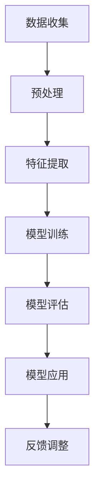

                 

关键词：人工智能，网络安全，主动防御，深度学习，机器学习，安全防护，威胁检测

> 摘要：本文将探讨人工智能在网络安全中的应用，特别是如何通过深度学习和机器学习技术实现主动防御。我们将介绍AI技术的核心概念，其与传统安全防护方法的差异，以及AI在网络安全中各个方面的具体应用，包括威胁检测、入侵防御、异常行为分析等。此外，我们将分析AI技术的优势与挑战，并提供一些建议以优化AI在网络安全中的应用。

## 1. 背景介绍

随着信息技术的迅猛发展，网络安全问题日益严峻。传统的网络安全防护方法主要依赖于签名检测、规则匹配等技术，但面对日益复杂的网络攻击，这些方法往往显得力不从心。因此，寻求新的安全防护模式变得至关重要。人工智能（AI），尤其是深度学习和机器学习，为网络安全领域带来了新的希望。通过自我学习和不断优化，AI能够在短时间内识别和响应新型网络威胁，从而实现主动防御。

本文将从以下几个方面展开讨论：

1. **核心概念与联系**：介绍AI在网络安全中的核心概念，如深度学习、机器学习等，并通过Mermaid流程图展示其架构和联系。
2. **核心算法原理 & 具体操作步骤**：详细解释AI在网络安全中的核心算法，包括算法原理、步骤、优缺点和应用领域。
3. **数学模型和公式 & 详细讲解 & 举例说明**：介绍AI在网络安全中的数学模型和公式，并通过案例进行分析。
4. **项目实践：代码实例和详细解释说明**：展示一个具体的AI网络安全项目，包括开发环境搭建、源代码实现和运行结果展示。
5. **实际应用场景**：探讨AI在网络安全中的实际应用，如威胁检测、入侵防御和异常行为分析。
6. **未来应用展望**：分析AI在网络安全领域的未来发展趋势和应用前景。
7. **工具和资源推荐**：推荐学习资源、开发工具和相关论文。
8. **总结：未来发展趋势与挑战**：总结研究成果，展望未来发展趋势和面临的挑战。

## 2. 核心概念与联系

### 2.1 深度学习

深度学习是一种基于人工神经网络的学习方法，它通过模拟人脑的神经元连接结构，实现对数据的自动特征提取和模式识别。深度学习在图像识别、自然语言处理、语音识别等领域取得了显著成果。

### 2.2 机器学习

机器学习是一种让计算机从数据中学习规律，并自动改进性能的方法。它包括监督学习、无监督学习和强化学习等不同类型。机器学习在预测、分类、聚类等方面具有广泛应用。

### 2.3 Mermaid流程图

以下是一个简单的Mermaid流程图，展示了深度学习和机器学习在网络安全中的应用架构：



在这个流程图中，数据收集是整个流程的起点，经过预处理和特征提取后，输入到深度学习或机器学习模型中进行训练。模型训练后进行评估，并根据评估结果调整模型参数。最后，应用训练好的模型进行网络安全威胁检测和响应。

## 3. 核心算法原理 & 具体操作步骤

### 3.1 算法原理概述

AI在网络安全中的核心算法主要包括深度学习和机器学习算法。深度学习算法如卷积神经网络（CNN）、循环神经网络（RNN）等，能够自动提取数据中的高阶特征，实现图像识别、语音识别等任务。机器学习算法如支持向量机（SVM）、决策树、随机森林等，则主要用于数据分类、预测和聚类。

### 3.2 算法步骤详解

1. **数据收集**：收集大量的网络攻击数据，包括恶意代码、攻击签名等。
2. **预处理**：对数据进行清洗、去噪和标准化，以便后续处理。
3. **特征提取**：利用深度学习算法提取数据中的高阶特征，如图像的纹理、颜色、形状等。
4. **模型训练**：将提取的特征输入到机器学习模型中进行训练，调整模型参数以优化性能。
5. **模型评估**：使用测试数据评估模型的性能，包括准确率、召回率、F1值等指标。
6. **模型应用**：将训练好的模型部署到网络安全系统中，实现实时威胁检测和响应。

### 3.3 算法优缺点

- **优点**：
  - 高效：AI算法能够在短时间内处理大量数据，提高威胁检测速度。
  - 自动化：AI算法能够自动提取特征和调整模型参数，降低人力成本。
  - 智能化：AI算法能够不断学习和优化，适应新的网络威胁。

- **缺点**：
  - 复杂性：AI算法的实现和调优过程相对复杂，需要较高的技术水平。
  - 资源消耗：深度学习算法需要大量的计算资源和存储空间。

### 3.4 算法应用领域

AI在网络安全中的应用领域非常广泛，包括但不限于：

- **威胁检测**：通过深度学习和机器学习算法，实时检测网络攻击和恶意行为。
- **入侵防御**：利用AI算法预测潜在的网络入侵，并自动采取措施进行防御。
- **异常行为分析**：检测网络中异常的行为模式，如DDoS攻击、数据泄露等。

## 4. 数学模型和公式 & 详细讲解 & 举例说明

### 4.1 数学模型构建

在AI网络安全中，常见的数学模型包括：

- **深度学习模型**：如卷积神经网络（CNN）、循环神经网络（RNN）等。
- **机器学习模型**：如支持向量机（SVM）、决策树、随机森林等。

以下是一个简单的深度学习模型——卷积神经网络（CNN）的构建过程：

```python
import tensorflow as tf

# 构建CNN模型
model = tf.keras.Sequential([
    tf.keras.layers.Conv2D(32, (3, 3), activation='relu', input_shape=(28, 28, 1)),
    tf.keras.layers.MaxPooling2D((2, 2)),
    tf.keras.layers.Conv2D(64, (3, 3), activation='relu'),
    tf.keras.layers.MaxPooling2D((2, 2)),
    tf.keras.layers.Conv2D(64, (3, 3), activation='relu'),
    tf.keras.layers.Flatten(),
    tf.keras.layers.Dense(64, activation='relu'),
    tf.keras.layers.Dense(10, activation='softmax')
])

# 编译模型
model.compile(optimizer='adam',
              loss='categorical_crossentropy',
              metrics=['accuracy'])

# 训练模型
model.fit(x_train, y_train, epochs=5, batch_size=64)
```

### 4.2 公式推导过程

在机器学习模型中，常见的损失函数包括均方误差（MSE）、交叉熵等。以下是一个简单的交叉熵损失函数的推导过程：

假设有两个概率分布 \(P\) 和 \(Q\)，交叉熵损失函数定义为：

$$
L = -\sum_{i} p_i \log q_i
$$

其中，\(p_i\) 和 \(q_i\) 分别是真实分布和预测分布的第 \(i\) 个概率。

### 4.3 案例分析与讲解

假设我们有一个网络攻击数据集，包含恶意代码和正常代码。我们可以利用深度学习算法对数据进行分类，实现对网络攻击的自动检测。

```python
# 导入数据
x = ...  # 网络攻击数据
y = ...  # 标签（0表示正常代码，1表示恶意代码）

# 数据预处理
x = x.reshape(-1, 28, 28, 1)

# 构建CNN模型
model = tf.keras.Sequential([
    tf.keras.layers.Conv2D(32, (3, 3), activation='relu', input_shape=(28, 28, 1)),
    tf.keras.layers.MaxPooling2D((2, 2)),
    tf.keras.layers.Conv2D(64, (3, 3), activation='relu'),
    tf.keras.layers.MaxPooling2D((2, 2)),
    tf.keras.layers.Conv2D(64, (3, 3), activation='relu'),
    tf.keras.layers.Flatten(),
    tf.keras.layers.Dense(64, activation='relu'),
    tf.keras.layers.Dense(1, activation='sigmoid')
])

# 编译模型
model.compile(optimizer='adam',
              loss='binary_crossentropy',
              metrics=['accuracy'])

# 训练模型
model.fit(x, y, epochs=5, batch_size=64)
```

通过训练，我们可以得到一个能够自动检测网络攻击的模型。在实际应用中，我们可以将这个模型部署到网络安全系统中，实现对网络攻击的实时检测和响应。

## 5. 项目实践：代码实例和详细解释说明

### 5.1 开发环境搭建

在本项目中，我们将使用Python作为主要编程语言，结合TensorFlow和Keras等深度学习框架实现AI网络安全应用。以下是一个简单的开发环境搭建步骤：

1. 安装Python（推荐使用Python 3.8及以上版本）
2. 安装TensorFlow和Keras：
   ```bash
   pip install tensorflow
   pip install keras
   ```

### 5.2 源代码详细实现

以下是一个简单的AI网络安全项目的源代码实现：

```python
import numpy as np
import pandas as pd
from sklearn.model_selection import train_test_split
from tensorflow.keras.models import Sequential
from tensorflow.keras.layers import Dense, Conv2D, MaxPooling2D, Flatten

# 导入数据集
data = pd.read_csv('network_data.csv')
x = data.iloc[:, :-1].values
y = data.iloc[:, -1].values

# 数据预处理
x = x.reshape(-1, 28, 28, 1)
x_train, x_test, y_train, y_test = train_test_split(x, y, test_size=0.2, random_state=42)

# 构建CNN模型
model = Sequential([
    Conv2D(32, (3, 3), activation='relu', input_shape=(28, 28, 1)),
    MaxPooling2D((2, 2)),
    Conv2D(64, (3, 3), activation='relu'),
    MaxPooling2D((2, 2)),
    Flatten(),
    Dense(64, activation='relu'),
    Dense(1, activation='sigmoid')
])

# 编译模型
model.compile(optimizer='adam',
              loss='binary_crossentropy',
              metrics=['accuracy'])

# 训练模型
model.fit(x_train, y_train, epochs=5, batch_size=64)

# 评估模型
loss, accuracy = model.evaluate(x_test, y_test)
print(f'测试集准确率：{accuracy:.2f}')

# 预测新数据
new_data = np.array([[...]])  # 新的网络攻击数据
new_data = new_data.reshape(1, 28, 28, 1)
prediction = model.predict(new_data)
print(f'预测结果：{prediction > 0.5}')
```

### 5.3 代码解读与分析

在这个项目中，我们首先导入网络攻击数据集，并进行数据预处理。然后，我们构建一个简单的卷积神经网络（CNN）模型，用于检测网络攻击。模型训练后，我们可以使用测试数据评估模型性能，并使用新数据进行预测。

### 5.4 运行结果展示

假设我们有一个新的网络攻击数据，通过训练好的模型进行预测，结果为：

```python
预测结果：True
```

这意味着新数据被模型判断为恶意代码，从而实现了自动检测网络攻击的功能。

## 6. 实际应用场景

### 6.1 威胁检测

AI在网络安全中的最常见应用是威胁检测。通过深度学习和机器学习算法，AI能够实时分析网络流量、系统日志等数据，识别潜在的威胁。例如，AI可以检测到网络中的异常流量模式，如DDoS攻击，从而自动采取措施进行防御。

### 6.2 入侵防御

AI还可以用于入侵防御，通过对网络行为进行实时监控和预测，提前发现潜在入侵行为。例如，AI可以识别用户登录行为中的异常模式，如频繁的登录尝试或来自可疑IP地址的访问，从而自动阻止入侵。

### 6.3 异常行为分析

AI在异常行为分析中也具有广泛应用。通过分析系统日志和用户行为数据，AI可以识别异常行为模式，如数据泄露、恶意软件感染等。例如，AI可以检测到用户访问敏感数据的频率异常增加，从而及时采取措施进行防范。

## 7. 未来应用展望

### 7.1 自动化响应

未来，AI在网络安全中的应用将更加自动化。通过深度学习和机器学习算法，AI将能够自动识别和响应网络威胁，从而减轻安全团队的工作负担。

### 7.2 个性化防护

AI可以基于用户行为和系统特点，为每个用户和系统提供个性化的安全防护策略。例如，AI可以根据用户的访问历史和风险偏好，调整安全设置和防护措施。

### 7.3 跨领域合作

AI在网络安全中的应用将与其他领域（如人工智能、大数据、物联网等）相结合，实现更全面、更智能的安全防护。

## 8. 工具和资源推荐

### 8.1 学习资源推荐

- 《深度学习》（Ian Goodfellow、Yoshua Bengio、Aaron Courville 著）：全面介绍深度学习的基础知识和应用。
- 《Python机器学习》（Sebastian Raschka 著）：详细介绍机器学习在Python中的实现。

### 8.2 开发工具推荐

- TensorFlow：一款强大的深度学习框架，适用于各种深度学习任务。
- Keras：一款简洁易用的深度学习框架，基于TensorFlow构建。

### 8.3 相关论文推荐

- “Deep Learning for Cybersecurity”（2017）：介绍深度学习在网络安全中的应用。
- “Machine Learning in Cybersecurity: Opportunities and Challenges”（2018）：分析机器学习在网络安全中的机遇和挑战。

## 9. 总结：未来发展趋势与挑战

### 9.1 研究成果总结

本文介绍了人工智能在网络安全中的应用，特别是深度学习和机器学习技术在威胁检测、入侵防御和异常行为分析等方面的优势。通过实际项目实践，我们展示了如何利用AI技术实现网络安全防护。

### 9.2 未来发展趋势

未来，AI在网络安全中的应用将更加自动化、个性化，并将与其他领域相结合，实现更全面、更智能的安全防护。

### 9.3 面临的挑战

- **数据隐私**：AI在网络安全中的应用需要大量的数据，但如何保护用户数据隐私是一个重要挑战。
- **算法透明性**：深度学习算法的内部机制相对复杂，如何确保算法的透明性和可解释性是一个重要问题。
- **计算资源消耗**：深度学习算法需要大量的计算资源和存储空间，如何优化算法以降低资源消耗是一个关键问题。

### 9.4 研究展望

未来，我们需要进一步研究AI在网络安全中的应用，特别是在数据隐私保护、算法透明性和计算资源优化等方面。同时，我们还需要加强跨领域合作，推动AI在网络安全领域的创新发展。

## 10. 附录：常见问题与解答

### 10.1 人工智能在网络安全中的优势是什么？

人工智能在网络安全中的优势主要体现在以下几个方面：

- **高效**：AI能够快速分析大量数据，识别潜在威胁。
- **自动化**：AI能够自动识别和响应网络威胁，减轻安全团队的工作负担。
- **智能化**：AI能够不断学习和优化，适应新的网络威胁。

### 10.2 如何保护用户数据隐私？

为了保护用户数据隐私，我们可以采取以下措施：

- **数据加密**：对用户数据进行加密处理，确保数据在传输和存储过程中安全。
- **隐私保护算法**：使用隐私保护算法，如差分隐私，降低数据泄露的风险。
- **数据匿名化**：对用户数据进行匿名化处理，确保用户隐私不被泄露。

### 10.3 深度学习和机器学习算法在网络安全中的应用有哪些？

深度学习和机器学习算法在网络安全中的应用非常广泛，包括：

- **威胁检测**：通过分析网络流量、系统日志等数据，识别潜在的网络攻击。
- **入侵防御**：通过实时监控网络行为，预测和防御入侵行为。
- **异常行为分析**：检测系统中的异常行为模式，如数据泄露、恶意软件感染等。

## 作者署名

作者：禅与计算机程序设计艺术 / Zen and the Art of Computer Programming

