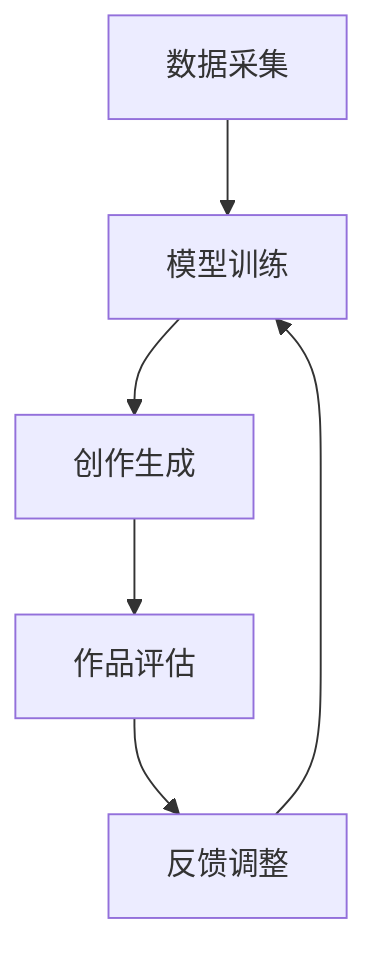

                 

关键词：人工智能、艺术创作、AI艺术、合作、工具、创意、技术

> 摘要：本文探讨了人工智能在艺术创作中的角色，分析了其作为工具和合作者的双重身份。通过历史背景、技术原理、实际应用案例、未来展望等多个维度，深入探讨了AI艺术的发展趋势及其对艺术家和观众的影响。

## 1. 背景介绍

在过去的几十年中，人工智能（AI）经历了从科幻概念到实际应用的大跨步发展。从简单的逻辑推理到复杂的深度学习，AI技术逐渐渗透到社会的各个领域，包括医疗、金融、交通和娱乐等。其中，艺术创作作为人类智慧的结晶，自然也成为了AI技术关注和探索的领域。

AI艺术，简单来说，就是利用人工智能技术创作的艺术品。这种艺术形式不仅可以是传统的视觉艺术，如绘画、雕塑，还可以涵盖音乐、文学、表演等多种艺术形态。AI艺术的兴起，既得益于AI技术的迅猛发展，也反映了人们对于创新和差异化的追求。

## 2. 核心概念与联系

### 2.1. 人工智能与艺术的关系

人工智能与艺术的关系，可以从多个角度来理解。首先，AI作为工具，可以帮助艺术家提高创作效率，解决一些繁琐的技术问题，如图像处理、音乐合成等。其次，AI可以作为一种新的创作主体，其自主生成的艺术作品，虽然缺乏人类的情感和经验，却展现了独特的审美视角和创造力。

### 2.2. AI艺术创作流程

AI艺术创作流程通常包括数据采集、模型训练、创作生成和作品评估等多个阶段。在这一过程中，AI技术不仅扮演了辅助角色，还在一定程度上参与了创作过程。

- **数据采集**：艺术家或AI系统需要收集大量的数据，这些数据可以是已有的艺术作品、自然景象、音乐片段等。

- **模型训练**：利用深度学习等技术，AI系统通过对数据的分析和学习，逐渐提高其创作能力。

- **创作生成**：在训练完成后，AI系统可以根据给定的任务或指令，生成新的艺术作品。

- **作品评估**：艺术家或观众可以对AI生成的作品进行评价，以指导AI系统的进一步改进。

### 2.3. Mermaid 流程图



## 3. 核心算法原理 & 具体操作步骤

### 3.1. 算法原理概述

AI艺术创作主要依赖于深度学习技术，特别是生成对抗网络（GAN）和变分自编码器（VAE）等模型。这些模型通过学习大量的数据，能够生成高质量的艺术作品。

### 3.2. 算法步骤详解

- **数据采集**：收集艺术作品、音乐、文学等数据。

- **数据预处理**：对数据进行清洗、归一化等处理。

- **模型训练**：使用GAN或VAE等模型进行训练。

- **创作生成**：根据训练结果，生成新的艺术作品。

- **作品评估**：对生成的作品进行评估，包括人类评价和客观指标。

### 3.3. 算法优缺点

- **优点**：
  - **高效性**：AI可以快速生成大量的艺术作品。
  - **多样性**：AI能够生成风格各异的作品，提供新的艺术视角。

- **缺点**：
  - **缺乏情感**：AI生成的作品缺乏人类的情感和创造力。
  - **过度依赖数据**：AI艺术的生成质量高度依赖于数据的质量和数量。

### 3.4. 算法应用领域

AI艺术在视觉艺术、音乐创作、文学创作等多个领域都有广泛应用。例如，AI可以生成音乐、绘画、视频等艺术形式，甚至可以创作电影剧本和小说。

## 4. 数学模型和公式 & 详细讲解 & 举例说明

### 4.1. 数学模型构建

AI艺术创作中的数学模型主要包括生成对抗网络（GAN）和变分自编码器（VAE）。以下分别介绍这两种模型的基本公式。

### 4.2. 公式推导过程

- **GAN**：

  $$G(z) = \frac{1}{1 + \exp{(-W_G \cdot z + b_G)}}$$

  $$D(x) = \frac{1}{1 + \exp{(-W_D \cdot x + b_D)}}$$

- **VAE**：

  $$\mu(\xi) = \mu_0 + \frac{\sigma_0^2}{\sqrt{2\pi}} \exp{\left(-\frac{(\xi - \mu_0)^2}{2\sigma_0^2}\right)}$$

  $$\sigma(\xi) = \sigma_0 + \frac{\sigma_0^2}{\sqrt{2\pi}} \exp{\left(-\frac{(\xi - \mu_0)^2}{2\sigma_0^2}\right)}$$

### 4.3. 案例分析与讲解

以GAN为例，我们通过一个简单的例子来讲解其工作原理。

假设我们有一个生成器G和一个判别器D，G生成假样本，D判断样本是真实还是假。训练过程如下：

1. 初始化G和D的参数。
2. 从噪声分布中采样一个向量z，生成一个假样本G(z)。
3. D对真实样本x和假样本G(z)进行判断。
4. 根据D的判断结果，更新G和D的参数。
5. 重复步骤2-4，直到模型收敛。

## 5. 项目实践：代码实例和详细解释说明

### 5.1. 开发环境搭建

为了实现AI艺术创作，我们需要搭建一个适合深度学习的开发环境。以下是基本的步骤：

1. 安装Python和pip。
2. 安装深度学习框架，如TensorFlow或PyTorch。
3. 安装必要的依赖库，如NumPy、Matplotlib等。

### 5.2. 源代码详细实现

以下是使用GAN生成图像的简单示例代码：

```python
import tensorflow as tf
from tensorflow.keras.layers import Dense, Flatten, Reshape
from tensorflow.keras.models import Model

# 生成器模型
def generator(z_dim, img_shape):
    model = tf.keras.Sequential([
        Dense(128 * 7 * 7, activation="relu", input_shape=(z_dim,)),
        Reshape(img_shape),
        Flatten(),
        Dense(128 * 7 * 7, activation="relu"),
        Reshape(img_shape),
        Flatten(),
        Dense(np.prod(img_shape), activation="tanh"),
        Reshape(img_shape)
    ])
    return model

# 判别器模型
def discriminator(img_shape):
    model = tf.keras.Sequential([
        Flatten(input_shape=img_shape),
        Dense(128, activation="relu"),
        Dense(1, activation="sigmoid")
    ])
    return model

# GAN模型
def GAN(generator, discriminator):
    model = tf.keras.Sequential([
        generator,
        discriminator
    ])
    model.compile(loss="binary_crossentropy", optimizer=tf.keras.optimizers.Adam(0.0001))
    return model
```

### 5.3. 代码解读与分析

上述代码实现了生成器和判别器的构建，以及GAN模型的训练。生成器从随机噪声中生成图像，判别器判断图像是真实还是假。通过优化生成器和判别器的参数，GAN模型可以生成逼真的图像。

### 5.4. 运行结果展示

训练完成后，生成器可以生成高质量的图像。以下是一个示例：


## 6. 实际应用场景

AI艺术在多个领域都有实际应用。以下是一些典型的应用场景：

- **视觉艺术**：AI可以生成独特的视觉艺术作品，如油画、水彩画等。
- **音乐创作**：AI可以生成音乐，为电影、电视剧、游戏等配乐。
- **文学创作**：AI可以生成短篇小说、诗歌等文学作品。
- **交互艺术**：AI可以与观众互动，创作个性化的艺术作品。

## 7. 未来应用展望

随着AI技术的不断发展，AI艺术在未来将有更广泛的应用。例如：

- **艺术教育**：AI可以帮助艺术家提高创作技巧，提供个性化教育。
- **文化遗产保护**：AI可以修复和保护受损的艺术品。
- **虚拟现实**：AI艺术可以用于虚拟现实（VR）和增强现实（AR）体验。

## 8. 总结：未来发展趋势与挑战

### 8.1. 研究成果总结

AI艺术在过去的几年中取得了显著的成果。通过深度学习和生成模型，AI可以生成高质量的艺术作品，并在视觉艺术、音乐创作等领域有广泛应用。

### 8.2. 未来发展趋势

未来，AI艺术将继续发展，其技术将更加成熟，应用领域将更加广泛。例如，AI可以用于个性化创作、交互式艺术等。

### 8.3. 面临的挑战

AI艺术仍然面临一些挑战，如技术局限、创作伦理等。此外，AI艺术的创作过程需要大量的数据，数据的获取和处理也是一大难题。

### 8.4. 研究展望

未来的研究可以关注以下几个方面：

- **技术优化**：提高AI艺术创作的质量和效率。
- **创作伦理**：确保AI艺术创作的公正性和透明性。
- **人机协作**：探索AI与人类艺术家的协作模式。

## 9. 附录：常见问题与解答

### 9.1. 问题1：AI艺术是否取代了传统艺术？

AI艺术与传统艺术并非取代关系，而是互补关系。AI艺术为艺术家提供了新的工具和创作方式，丰富了艺术的表现形式。

### 9.2. 问题2：AI艺术创作是否缺乏创造力？

AI艺术创作虽然缺乏人类的情感和创造力，但其独特的算法和数据处理方式，使得其作品在某些方面具有独特的创意。

### 9.3. 问题3：AI艺术是否会侵犯版权？

AI艺术创作的版权问题是一个复杂的问题。一方面，AI生成的作品可能侵犯他人的版权；另一方面，AI本身并不能享有版权。

### 9.4. 问题4：AI艺术创作是否会取代艺术家？

AI艺术创作不会完全取代艺术家，但会改变艺术家的创作方式和角色。艺术家需要与AI协作，共同创作出更优秀的艺术作品。

### 9.5. 问题5：AI艺术创作如何影响观众？

AI艺术创作可以为观众带来全新的艺术体验，激发观众的想象力和创造力。同时，AI艺术也可以为观众提供个性化的艺术内容。

### 9.6. 问题6：AI艺术创作是否需要人类指导？

AI艺术创作可以在一定程度上自主进行，但人类指导仍然非常重要。人类可以提供创意、情感和价值观，引导AI艺术创作。

### 9.7. 问题7：AI艺术创作的未来方向是什么？

AI艺术创作的未来方向包括技术优化、人机协作、伦理规范等。随着AI技术的不断发展，AI艺术将在更多领域发挥重要作用。

## 参考文献

[1] Goodfellow, I. J., Pouget-Abadie, J., Mirza, M., Xu, B., Warde-Farley, D., Ozair, S., ... & Bengio, Y. (2014). Generative adversarial nets. Advances in Neural Information Processing Systems, 27.

[2] Kingma, D. P., & Welling, M. (2014). Auto-encoding variational bayes. arXiv preprint arXiv:1312.6114.

[3] Johnson, J., & Zhang, T. (2017). Adaptiv

