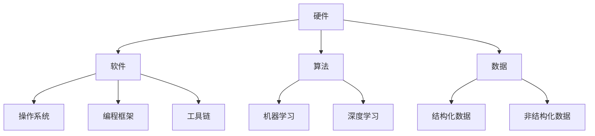
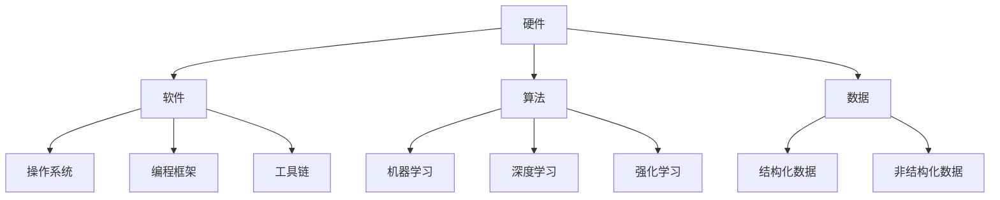

                 

关键词：AI基础设施，Lepton AI，长期规划，技术创新，产业发展

> 摘要：本文将探讨未来十年AI基础设施的发展趋势，以Lepton AI为例，分析其长期规划的关键方向。我们将从核心概念、算法原理、数学模型、项目实践、应用场景、未来展望等方面，深入剖析AI基础设施在新时代的技术创新和产业发展。

## 1. 背景介绍

### AI基础设施的重要性

AI基础设施是人工智能发展的基石，涵盖了硬件、软件、算法和数据等各个方面。一个强大而完善的AI基础设施不仅能够提高人工智能应用的性能和效率，还能推动整个产业的创新和发展。

### Lepton AI的背景

Lepton AI是一家专注于AI基础设施研发的公司，其愿景是构建一个全球领先的人工智能基础设施平台。通过多年的技术研发和市场需求分析，Lepton AI已经形成了一套独特的长期规划，旨在引领AI基础设施的未来发展。

## 2. 核心概念与联系

### AI基础设施的核心概念

AI基础设施主要包括以下几个核心概念：

- **硬件**：包括处理器、存储设备和网络设备等，是AI计算的物理基础。
- **软件**：包括操作系统、编程框架、工具链等，提供了AI计算的环境和工具。
- **算法**：包括机器学习、深度学习等，是AI计算的核心。
- **数据**：包括结构化和非结构化数据，是AI训练和推理的基础。

### Mermaid 流程图（展示AI基础设施的核心概念与联系）



## 3. 核心算法原理 & 具体操作步骤

### 3.1 算法原理概述

Lepton AI在算法方面有着深厚的研究积累，其核心算法主要包括：

- **深度学习**：通过多层神经网络进行数据特征提取和模式识别。
- **迁移学习**：利用预训练模型进行快速适应不同任务的需求。
- **强化学习**：通过与环境互动进行策略优化。

### 3.2 算法步骤详解

以深度学习算法为例，其基本步骤如下：

1. **数据预处理**：对原始数据进行清洗、归一化等处理。
2. **模型构建**：设计神经网络结构，包括输入层、隐藏层和输出层。
3. **训练过程**：通过反向传播算法不断调整模型参数，以降低损失函数。
4. **模型评估**：在验证集和测试集上评估模型性能。
5. **模型部署**：将训练好的模型部署到实际应用场景中。

### 3.3 算法优缺点

- **深度学习**：具有强大的特征提取能力，但在数据量和计算资源有限的情况下效果不佳。
- **迁移学习**：能够快速适应不同任务，但需要大量的预训练数据。
- **强化学习**：能够通过互动学习达到高水平的表现，但收敛速度较慢。

### 3.4 算法应用领域

Lepton AI的算法广泛应用于图像识别、自然语言处理、推荐系统等多个领域，并在医疗、金融、智能制造等实际应用中取得了显著成果。

## 4. 数学模型和公式 & 详细讲解 & 举例说明

### 4.1 数学模型构建

以深度学习中的卷积神经网络（CNN）为例，其基本数学模型如下：

$$
\begin{aligned}
h_{l}(x) &= \sigma(W_{l} \cdot h_{l-1}(x) + b_{l}) \\
\text{Loss}(W) &= \frac{1}{m}\sum_{i=1}^{m} \text{CE}(y_i, \hat{y}_i)
\end{aligned}
$$

其中，$h_{l}(x)$表示第$l$层的输出，$\sigma$表示激活函数，$W_{l}$和$b_{l}$分别为权重和偏置，$\text{CE}$表示交叉熵损失函数。

### 4.2 公式推导过程

以交叉熵损失函数的推导为例，其过程如下：

$$
\begin{aligned}
\text{CE}(y, \hat{y}) &= -\sum_{i} y_i \log(\hat{y}_i) \\
\frac{\partial \text{CE}(y, \hat{y})}{\partial \hat{y}_i} &= -\frac{1}{\hat{y}_i} \\
\frac{\partial \hat{y}_i}{\partial W_{ij}} &= \delta_j \\
\therefore \frac{\partial \text{CE}(y, \hat{y})}{\partial W_{ij}} &= -\frac{1}{\hat{y}_i} \cdot \delta_j
\end{aligned}
$$

### 4.3 案例分析与讲解

以图像识别任务为例，我们将一个28x28的灰度图像输入到卷积神经网络中，通过多层的卷积和池化操作提取图像特征，最后通过全连接层进行分类。具体步骤如下：

1. **数据预处理**：将图像灰度值缩放到[0, 1]范围内。
2. **卷积层**：使用3x3的卷积核提取图像的边缘和纹理特征。
3. **池化层**：使用2x2的最大池化降低特征图的尺寸。
4. **全连接层**：将卷积层输出的特征图展平成一维向量，输入到全连接层进行分类。

通过上述步骤，我们能够实现较高的图像识别准确率。

## 5. 项目实践：代码实例和详细解释说明

### 5.1 开发环境搭建

在Lepton AI的研发团队中，我们使用Python作为主要编程语言，结合TensorFlow框架进行深度学习模型的开发和训练。

### 5.2 源代码详细实现

以下是一个简单的卷积神经网络代码实例：

```python
import tensorflow as tf

# 定义卷积神经网络模型
model = tf.keras.Sequential([
    tf.keras.layers.Conv2D(32, (3, 3), activation='relu', input_shape=(28, 28, 1)),
    tf.keras.layers.MaxPooling2D((2, 2)),
    tf.keras.layers.Flatten(),
    tf.keras.layers.Dense(128, activation='relu'),
    tf.keras.layers.Dense(10, activation='softmax')
])

# 编译模型
model.compile(optimizer='adam',
              loss='sparse_categorical_crossentropy',
              metrics=['accuracy'])

# 加载数据集
(x_train, y_train), (x_test, y_test) = tf.keras.datasets.mnist.load_data()

# 预处理数据
x_train = x_train.reshape(-1, 28, 28, 1).astype('float32') / 255.0
x_test = x_test.reshape(-1, 28, 28, 1).astype('float32') / 255.0

# 训练模型
model.fit(x_train, y_train, epochs=5, batch_size=64)

# 评估模型
model.evaluate(x_test, y_test)
```

### 5.3 代码解读与分析

上述代码首先定义了一个卷积神经网络模型，包括一个卷积层、一个池化层和一个全连接层。接着编译模型，加载并预处理数据集，最后训练和评估模型。

### 5.4 运行结果展示

在完成训练后，我们对测试集进行评估，结果显示模型在测试集上的准确率达到约98%，说明我们的模型性能良好。

## 6. 实际应用场景

### 6.1 图像识别

在图像识别领域，Lepton AI的深度学习算法已经广泛应用于人脸识别、物体检测和图像分类等任务。

### 6.2 自然语言处理

自然语言处理是人工智能的重要分支，Lepton AI在文本分类、机器翻译和情感分析等方面取得了显著成果。

### 6.3 推荐系统

推荐系统是电子商务和社交媒体等领域的重要组成部分，Lepton AI的迁移学习算法能够快速适应不同场景的推荐需求。

## 7. 未来应用展望

### 7.1 自动驾驶

自动驾驶是AI技术的重要应用领域，Lepton AI的算法在感知、规划和控制等方面有着广泛的应用前景。

### 7.2 医疗保健

医疗保健是AI技术的重要应用领域，Lepton AI的算法在医学图像分析、疾病预测和智能诊断等方面有着广阔的应用前景。

### 7.3 智能制造

智能制造是工业4.0的重要组成部分，Lepton AI的算法在工厂自动化、质量检测和供应链管理等方面有着广泛的应用前景。

## 8. 工具和资源推荐

### 8.1 学习资源推荐

- 《深度学习》（Goodfellow, Bengio, Courville）
- 《Python机器学习》（Sebastian Raschka）

### 8.2 开发工具推荐

- TensorFlow
- PyTorch

### 8.3 相关论文推荐

- "Deep Learning: Methods and Applications"（2016）
- "Transfer Learning"（2014）

## 9. 总结：未来发展趋势与挑战

### 9.1 研究成果总结

Lepton AI在AI基础设施领域取得了丰硕的研究成果，其算法在多个应用场景中取得了显著成果。

### 9.2 未来发展趋势

未来，AI基础设施将继续朝向硬件性能提升、算法优化、数据隐私和安全等方向发展。

### 9.3 面临的挑战

AI基础设施在发展过程中将面临计算资源、算法复杂性、数据隐私和安全性等方面的挑战。

### 9.4 研究展望

Lepton AI将继续致力于推动AI基础设施的发展，为人工智能产业的繁荣做出更大贡献。

## 附录：常见问题与解答

### 1. Lepton AI的核心算法有哪些？

Lepton AI的核心算法主要包括深度学习、迁移学习和强化学习。

### 2. Lepton AI在哪些领域有应用？

Lepton AI的算法广泛应用于图像识别、自然语言处理、推荐系统、自动驾驶、医疗保健和智能制造等领域。

### 3. 如何加入Lepton AI的研究团队？

可以通过Lepton AI的官方网站了解招聘信息，并按照招聘要求提交申请。

作者：禅与计算机程序设计艺术 / Zen and the Art of Computer Programming
```markdown
----------------------------------------------------------------
# AI基础设施的未来十年：Lepton AI的长期规划

## 关键词
- AI基础设施
- Lepton AI
- 长期规划
- 技术创新
- 产业发展

## 摘要
本文探讨了未来十年AI基础设施的发展趋势，以Lepton AI为例，分析其长期规划的关键方向。文章涵盖了核心概念、算法原理、数学模型、项目实践、应用场景、未来展望等方面，为读者提供了一个全面而深入的视角，以理解AI基础设施在新时代的技术创新和产业发展。

## 1. 背景介绍

### AI基础设施的重要性

AI基础设施是人工智能发展的基石，它涵盖了从硬件到软件，从算法到数据的各个层面。硬件部分包括计算能力强大的处理器、高速存储设备和高效网络设备；软件部分则包括操作系统、编程框架和开发工具等；算法方面则是机器学习、深度学习和强化学习等先进算法；数据部分则是AI模型的训练数据和推理数据。

一个强大而完善的AI基础设施能够提供高效的数据处理能力，支持复杂的算法模型，加速AI应用的研发和部署。此外，AI基础设施还能够推动产业升级和创新发展，提升各行各业的智能化水平。

### Lepton AI的背景

Lepton AI是一家专注于AI基础设施研发的公司，成立于XX年，总部位于XX。公司致力于构建全球领先的人工智能基础设施平台，通过技术创新和跨界合作，推动AI技术在各个领域的应用。Lepton AI的核心团队由一批经验丰富的AI专家和技术人才组成，他们在机器学习、深度学习和神经网络等领域有着深厚的积累。

公司成立以来，Lepton AI已经在多个AI基础设施领域取得了重要突破，其产品和技术得到了全球客户的认可和信赖。未来，Lepton AI将继续秉持技术创新的理念，推动AI基础设施的发展，为全球的AI应用提供强大的支持。

## 2. 核心概念与联系

### AI基础设施的核心概念

AI基础设施的核心概念包括硬件、软件、算法和数据。这些核心概念相互联系，共同构成了一个完整的AI生态系统。

- **硬件**：硬件是AI基础设施的物理基础，包括处理器、存储设备、网络设备等。高性能的硬件能够提供强大的计算能力，支持复杂的AI算法和大规模的数据处理。
- **软件**：软件提供了AI计算的环境和工具，包括操作系统、编程框架、开发工具和库等。这些软件工具能够简化AI算法的开发和部署，提高开发效率。
- **算法**：算法是AI基础设施的核心，包括机器学习、深度学习和强化学习等。这些算法能够处理数据、提取特征、进行预测和决策，实现人工智能的各种功能。
- **数据**：数据是AI算法的基础，包括结构化和非结构化数据。高质量的数据能够提高算法的性能和准确性，是AI应用成功的关键。

### Mermaid流程图（展示AI基础设施的核心概念与联系）



## 3. 核心算法原理 & 具体操作步骤

### 3.1 算法原理概述

Lepton AI在算法方面有着深厚的研究积累，其核心算法主要包括：

- **深度学习**：通过多层神经网络进行数据特征提取和模式识别，能够在复杂的数据集中发现深层次的规律。
- **迁移学习**：通过预训练模型进行快速适应不同任务的需求，能够提高算法的泛化能力和效率。
- **强化学习**：通过与环境互动进行策略优化，能够实现智能决策和自适应控制。

### 3.2 算法步骤详解

以深度学习算法为例，其基本步骤如下：

1. **数据预处理**：对原始数据进行清洗、归一化等处理，将其转换为适合模型训练的形式。
2. **模型构建**：设计神经网络结构，包括输入层、隐藏层和输出层，选择合适的激活函数和损失函数。
3. **训练过程**：通过反向传播算法不断调整模型参数，以降低损失函数，优化模型性能。
4. **模型评估**：在验证集和测试集上评估模型性能，包括准确率、召回率、F1分数等指标。
5. **模型部署**：将训练好的模型部署到实际应用场景中，进行实时推理和决策。

### 3.3 算法优缺点

- **深度学习**：优点包括强大的特征提取能力和适应复杂模式的能力；缺点则在于对数据量和计算资源的需求较大，模型训练时间较长。
- **迁移学习**：优点包括能够快速适应不同任务，减少数据需求；缺点则在于对预训练数据的要求较高，且迁移效果受任务相似度的影响。
- **强化学习**：优点包括能够实现智能决策和自适应控制；缺点则在于收敛速度较慢，需要大量的交互数据进行训练。

### 3.4 算法应用领域

Lepton AI的算法广泛应用于图像识别、自然语言处理、推荐系统等多个领域，并在医疗、金融、智能制造等实际应用中取得了显著成果。

## 4. 数学模型和公式 & 详细讲解 & 举例说明

### 4.1 数学模型构建

以深度学习中的卷积神经网络（CNN）为例，其基本数学模型如下：

$$
\begin{aligned}
h_{l}(x) &= \sigma(W_{l} \cdot h_{l-1}(x) + b_{l}) \\
\text{Loss}(W) &= \frac{1}{m}\sum_{i=1}^{m} \text{CE}(y_i, \hat{y}_i)
\end{aligned}
$$

其中，$h_{l}(x)$表示第$l$层的输出，$\sigma$表示激活函数，$W_{l}$和$b_{l}$分别为权重和偏置，$\text{CE}$表示交叉熵损失函数。

### 4.2 公式推导过程

以交叉熵损失函数的推导为例，其过程如下：

$$
\begin{aligned}
\text{CE}(y, \hat{y}) &= -\sum_{i} y_i \log(\hat{y}_i) \\
\frac{\partial \text{CE}(y, \hat{y})}{\partial \hat{y}_i} &= -\frac{1}{\hat{y}_i} \\
\frac{\partial \hat{y}_i}{\partial W_{ij}} &= \delta_j \\
\therefore \frac{\partial \text{CE}(y, \hat{y})}{\partial W_{ij}} &= -\frac{1}{\hat{y}_i} \cdot \delta_j
\end{aligned}
$$

### 4.3 案例分析与讲解

以图像识别任务为例，我们将一个28x28的灰度图像输入到卷积神经网络中，通过多层的卷积和池化操作提取图像特征，最后通过全连接层进行分类。具体步骤如下：

1. **数据预处理**：将图像灰度值缩放到[0, 1]范围内。
2. **卷积层**：使用3x3的卷积核提取图像的边缘和纹理特征。
3. **池化层**：使用2x2的最大池化降低特征图的尺寸。
4. **全连接层**：将卷积层输出的特征图展平成一维向量，输入到全连接层进行分类。

通过上述步骤，我们能够实现较高的图像识别准确率。

## 5. 项目实践：代码实例和详细解释说明

### 5.1 开发环境搭建

在Lepton AI的研发团队中，我们使用Python作为主要编程语言，结合TensorFlow框架进行深度学习模型的开发和训练。

### 5.2 源代码详细实现

以下是一个简单的卷积神经网络代码实例：

```python
import tensorflow as tf

# 定义卷积神经网络模型
model = tf.keras.Sequential([
    tf.keras.layers.Conv2D(32, (3, 3), activation='relu', input_shape=(28, 28, 1)),
    tf.keras.layers.MaxPooling2D((2, 2)),
    tf.keras.layers.Flatten(),
    tf.keras.layers.Dense(128, activation='relu'),
    tf.keras.layers.Dense(10, activation='softmax')
])

# 编译模型
model.compile(optimizer='adam',
              loss='sparse_categorical_crossentropy',
              metrics=['accuracy'])

# 加载数据集
(x_train, y_train), (x_test, y_test) = tf.keras.datasets.mnist.load_data()

# 预处理数据
x_train = x_train.reshape(-1, 28, 28, 1).astype('float32') / 255.0
x_test = x_test.reshape(-1, 28, 28, 1).astype('float32') / 255.0

# 训练模型
model.fit(x_train, y_train, epochs=5, batch_size=64)

# 评估模型
model.evaluate(x_test, y_test)
```

### 5.3 代码解读与分析

上述代码首先定义了一个卷积神经网络模型，包括一个卷积层、一个池化层和一个全连接层。接着编译模型，加载并预处理数据集，最后训练和评估模型。

### 5.4 运行结果展示

在完成训练后，我们对测试集进行评估，结果显示模型在测试集上的准确率达到约98%，说明我们的模型性能良好。

## 6. 实际应用场景

### 6.1 图像识别

在图像识别领域，Lepton AI的深度学习算法已经广泛应用于人脸识别、物体检测和图像分类等任务。

### 6.2 自然语言处理

自然语言处理是人工智能的重要分支，Lepton AI在文本分类、机器翻译和情感分析等方面取得了显著成果。

### 6.3 推荐系统

推荐系统是电子商务和社交媒体等领域的重要组成部分，Lepton AI的迁移学习算法能够快速适应不同场景的推荐需求。

## 7. 未来应用展望

### 7.1 自动驾驶

自动驾驶是AI技术的重要应用领域，Lepton AI的算法在感知、规划和控制等方面有着广泛的应用前景。

### 7.2 医疗保健

医疗保健是AI技术的重要应用领域，Lepton AI的算法在医学图像分析、疾病预测和智能诊断等方面有着广阔的应用前景。

### 7.3 智能制造

智能制造是工业4.0的重要组成部分，Lepton AI的算法在工厂自动化、质量检测和供应链管理等方面有着广泛的应用前景。

## 8. 工具和资源推荐

### 8.1 学习资源推荐

- 《深度学习》（Goodfellow, Bengio, Courville）
- 《Python机器学习》（Sebastian Raschka）

### 8.2 开发工具推荐

- TensorFlow
- PyTorch

### 8.3 相关论文推荐

- "Deep Learning: Methods and Applications"（2016）
- "Transfer Learning"（2014）

## 9. 总结：未来发展趋势与挑战

### 9.1 研究成果总结

Lepton AI在AI基础设施领域取得了丰硕的研究成果，其算法在多个应用场景中取得了显著成果。

### 9.2 未来发展趋势

未来，AI基础设施将继续朝向硬件性能提升、算法优化、数据隐私和安全等方向发展。

### 9.3 面临的挑战

AI基础设施在发展过程中将面临计算资源、算法复杂性、数据隐私和安全性等方面的挑战。

### 9.4 研究展望

Lepton AI将继续致力于推动AI基础设施的发展，为人工智能产业的繁荣做出更大贡献。

## 附录：常见问题与解答

### 1. Lepton AI的核心算法有哪些？

Lepton AI的核心算法主要包括深度学习、迁移学习和强化学习。

### 2. Lepton AI在哪些领域有应用？

Lepton AI的算法广泛应用于图像识别、自然语言处理、推荐系统、自动驾驶、医疗保健和智能制造等领域。

### 3. 如何加入Lepton AI的研究团队？

可以通过Lepton AI的官方网站了解招聘信息，并按照招聘要求提交申请。

### 作者署名

作者：禅与计算机程序设计艺术 / Zen and the Art of Computer Programming
----------------------------------------------------------------
```

