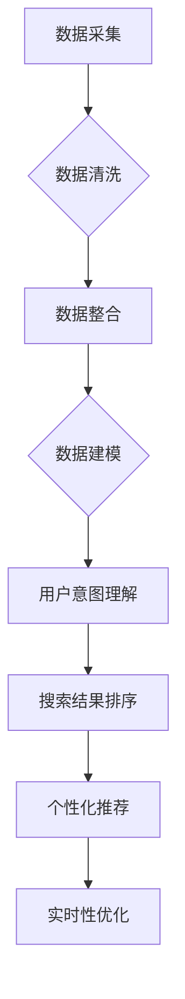

                 

 在当今信息化社会，数据爆炸式增长，如何从海量信息中快速、准确地找到所需内容成为了一个亟待解决的问题。AI多渠道整合技术，通过融合多种数据源和智能算法，极大地提升了搜索结果的准确性和效率。本文将探讨AI多渠道整合提升搜索结果的原理、方法及应用，为相关领域的研究和应用提供参考。

## 关键词

- AI多渠道整合
- 搜索引擎优化
- 数据融合
- 智能算法
- 搜索结果提升

## 摘要

本文首先介绍了AI多渠道整合提升搜索结果的背景和重要性。接着，详细阐述了AI多渠道整合的核心概念、算法原理、数学模型和具体实现步骤。随后，通过实际项目实践展示了AI多渠道整合技术的应用效果。文章最后对AI多渠道整合技术在实际应用场景中的优势、未来展望以及面临的挑战进行了分析和讨论。

## 1. 背景介绍

### 1.1 数据爆炸时代的需求

随着互联网和移动设备的普及，全球数据量呈现爆炸式增长。据估计，每天产生的数据量达到数亿GB。这些数据来源广泛，包括社交媒体、电子商务、物联网、科学研究等。然而，数据的爆炸式增长也带来了信息过载的问题，如何在海量数据中快速准确地找到所需信息成为用户和企业共同面临的挑战。

### 1.2 搜索引擎的局限性

传统的搜索引擎，如Google、百度等，虽然能够处理大量的搜索请求，但在面对多样化、个性化需求时，存在一定的局限性。首先，搜索引擎依赖于关键词匹配，往往无法准确理解用户的意图。其次，搜索引擎的数据来源较为单一，难以全面覆盖用户的需求。此外，搜索引擎的算法和模型更新速度相对较慢，无法及时适应数据环境的变化。

### 1.3 AI多渠道整合的优势

AI多渠道整合技术通过融合多种数据源和智能算法，能够弥补传统搜索引擎的不足，提升搜索结果的准确性和效率。具体优势如下：

- **数据来源多样化**：AI多渠道整合技术可以从多种渠道获取数据，如社交媒体、电子商务平台、物联网设备等，实现数据的全面覆盖。
- **智能算法优化**：AI多渠道整合技术利用深度学习、自然语言处理、推荐系统等智能算法，能够更好地理解用户意图，提高搜索结果的准确性。
- **实时性增强**：AI多渠道整合技术能够实时更新和优化搜索算法，快速适应数据环境的变化，提供更准确的搜索结果。
- **个性化推荐**：AI多渠道整合技术可以根据用户的兴趣和行为，提供个性化的搜索结果，提升用户体验。

## 2. 核心概念与联系

### 2.1 多渠道数据融合

多渠道数据融合是指将来自不同数据源的数据进行整合和处理，形成一个统一、完整的数据视图。多渠道数据融合的关键在于数据的一致性、完整性和实时性。具体包括以下步骤：

1. **数据采集**：从多种渠道采集数据，如社交媒体、电子商务平台、物联网设备等。
2. **数据清洗**：对采集到的数据去重、去噪，确保数据的一致性和完整性。
3. **数据整合**：将清洗后的数据整合到一个统一的数据存储中，实现数据的高效访问和处理。
4. **数据建模**：建立数据模型，对数据进行分类、聚类、关联等处理，挖掘数据的价值。

### 2.2 智能算法优化

智能算法优化是指利用深度学习、自然语言处理、推荐系统等技术，对搜索结果进行优化，提高搜索的准确性和效率。具体包括以下步骤：

1. **用户意图理解**：通过自然语言处理技术，分析用户的搜索请求，理解用户的意图。
2. **搜索结果排序**：利用深度学习技术，对搜索结果进行排序，使更相关的结果排在前面。
3. **个性化推荐**：根据用户的兴趣和行为，利用推荐系统技术，为用户推荐相关的搜索结果。
4. **实时性优化**：利用实时数据流处理技术，对搜索算法进行实时优化，提升搜索结果的准确性。

### 2.3 Mermaid 流程图

以下是一个简单的Mermaid流程图，展示了多渠道数据融合和智能算法优化的过程：



## 3. 核心算法原理 & 具体操作步骤

### 3.1 算法原理概述

AI多渠道整合提升搜索结果的核心算法包括数据融合算法、智能排序算法和个性化推荐算法。这些算法基于深度学习、自然语言处理和推荐系统等技术，通过多渠道数据融合和智能优化，实现搜索结果的提升。

### 3.2 算法步骤详解

#### 3.2.1 数据融合算法

1. **数据采集**：从多个渠道采集数据，如社交媒体、电子商务平台、物联网设备等。
2. **数据清洗**：对采集到的数据去重、去噪，确保数据的一致性和完整性。
3. **特征提取**：对清洗后的数据进行特征提取，如词频、词向量、用户行为等。
4. **数据整合**：将特征提取后的数据整合到一个统一的数据存储中。

#### 3.2.2 智能排序算法

1. **用户意图理解**：通过自然语言处理技术，分析用户的搜索请求，理解用户的意图。
2. **特征融合**：将用户意图和搜索结果的特征进行融合，形成统一的特征向量。
3. **排序模型训练**：利用深度学习技术，训练排序模型，如循环神经网络（RNN）、长短期记忆网络（LSTM）等。
4. **搜索结果排序**：利用训练好的排序模型，对搜索结果进行排序，使更相关的结果排在前面。

#### 3.2.3 个性化推荐算法

1. **用户行为分析**：通过自然语言处理技术，分析用户的行为数据，如搜索历史、浏览记录、购买记录等。
2. **兴趣标签构建**：根据用户行为数据，为用户构建兴趣标签，如科技、时尚、美食等。
3. **推荐模型训练**：利用推荐系统技术，训练推荐模型，如协同过滤（Collaborative Filtering）、矩阵分解（Matrix Factorization）等。
4. **个性化推荐**：根据用户兴趣标签和推荐模型，为用户推荐相关的搜索结果。

### 3.3 算法优缺点

#### 3.3.1 数据融合算法

**优点**：能够充分利用多种数据源，提供更丰富的搜索结果。

**缺点**：数据融合过程复杂，需要大量的计算资源和时间。

#### 3.3.2 智能排序算法

**优点**：能够根据用户意图，提供更准确的搜索结果。

**缺点**：排序模型的训练过程需要大量的数据和计算资源。

#### 3.3.3 个性化推荐算法

**优点**：能够根据用户兴趣，提供个性化的搜索结果，提升用户体验。

**缺点**：推荐模型的训练过程需要大量的用户行为数据，且可能存在数据偏差。

### 3.4 算法应用领域

AI多渠道整合提升搜索结果算法广泛应用于以下领域：

1. **搜索引擎**：如Google、百度等，通过AI多渠道整合技术，提升搜索结果的准确性和效率。
2. **电子商务平台**：如淘宝、京东等，通过AI多渠道整合技术，为用户提供个性化的商品推荐。
3. **社交媒体**：如微博、Facebook等，通过AI多渠道整合技术，为用户提供更相关的社交内容推荐。
4. **物联网应用**：如智能家居、智能城市等，通过AI多渠道整合技术，提供智能化的搜索和推荐服务。

## 4. 数学模型和公式 & 详细讲解 & 举例说明

### 4.1 数学模型构建

在AI多渠道整合提升搜索结果中，常用的数学模型包括深度学习模型、推荐系统模型和数据融合模型。以下分别介绍这些模型的构建过程。

#### 4.1.1 深度学习模型

深度学习模型主要用于搜索结果的排序和个性化推荐。其构建过程主要包括以下步骤：

1. **输入层**：输入层包括用户搜索请求的特征和搜索结果的特征。
2. **隐藏层**：隐藏层通过多层神经网络，对输入特征进行提取和融合。
3. **输出层**：输出层包括排序分数和推荐分数，用于评估搜索结果的相关性和个性化程度。

#### 4.1.2 推荐系统模型

推荐系统模型主要用于为用户推荐搜索结果。其构建过程主要包括以下步骤：

1. **用户行为特征提取**：根据用户的行为数据，提取用户的行为特征，如搜索历史、浏览记录、购买记录等。
2. **商品特征提取**：根据商品的属性和标签，提取商品的特征。
3. **协同过滤**：利用协同过滤算法，根据用户行为特征和商品特征，为用户推荐相关的商品。
4. **矩阵分解**：利用矩阵分解算法，将用户行为特征和商品特征进行分解，得到用户和商品的隐向量。
5. **推荐计算**：利用隐向量，计算用户对商品的喜好程度，为用户推荐相关的商品。

#### 4.1.3 数据融合模型

数据融合模型主要用于将多种数据源进行整合。其构建过程主要包括以下步骤：

1. **数据采集**：从多个渠道采集数据，如社交媒体、电子商务平台、物联网设备等。
2. **数据清洗**：对采集到的数据进行清洗，去除重复数据和噪声数据。
3. **特征提取**：对清洗后的数据进行特征提取，如词频、词向量、用户行为等。
4. **特征融合**：利用深度学习算法，将不同渠道的数据特征进行融合，形成统一的数据特征。

### 4.2 公式推导过程

以下分别介绍深度学习模型、推荐系统模型和数据融合模型的公式推导过程。

#### 4.2.1 深度学习模型

深度学习模型的推导过程主要包括以下公式：

1. **激活函数**：$$ f(x) = \sigma(w \cdot x + b) $$
   - 其中，$x$为输入特征，$w$为权重，$b$为偏置，$\sigma$为激活函数。

2. **损失函数**：$$ J(\theta) = \frac{1}{2} \sum_{i=1}^{n} (\theta \cdot x_i - y_i)^2 $$
   - 其中，$\theta$为模型参数，$x_i$为输入特征，$y_i$为真实标签。

3. **梯度下降**：$$ \theta = \theta - \alpha \frac{\partial J(\theta)}{\partial \theta} $$
   - 其中，$\alpha$为学习率，$\frac{\partial J(\theta)}{\partial \theta}$为损失函数关于模型参数的梯度。

#### 4.2.2 推荐系统模型

推荐系统模型的推导过程主要包括以下公式：

1. **用户行为特征提取**：$$ x_i = [x_{i1}, x_{i2}, ..., x_{in}]^T $$
   - 其中，$x_i$为用户行为特征向量，$x_{ij}$为用户对商品$j$的行为特征。

2. **商品特征提取**：$$ y_j = [y_{j1}, y_{j2}, ..., y_{jm}]^T $$
   - 其中，$y_j$为商品特征向量，$y_{ij}$为商品$i$的特征特征。

3. **协同过滤**：$$ r_{ij} = u_i \cdot v_j + b $$
   - 其中，$r_{ij}$为用户$i$对商品$j$的评分，$u_i$和$v_j$为用户和商品的隐向量，$b$为偏置。

4. **矩阵分解**：$$ u_i = UV_i + u_0 $$
   $$ v_j = UV_j + v_0 $$
   - 其中，$U$和$V$为用户和商品的隐向量矩阵，$V_i$和$V_j$为用户和商品的隐向量，$u_0$和$v_0$为偏置。

#### 4.2.3 数据融合模型

数据融合模型的推导过程主要包括以下公式：

1. **特征提取**：$$ f(x) = \sigma(w \cdot x + b) $$
   - 其中，$x$为输入特征，$w$为权重，$b$为偏置，$\sigma$为激活函数。

2. **特征融合**：$$ z = \sum_{i=1}^{n} w_i \cdot f(x_i) + b $$
   - 其中，$z$为融合后的特征，$w_i$为权重，$f(x_i)$为特征提取函数。

3. **损失函数**：$$ J(\theta) = \frac{1}{2} \sum_{i=1}^{n} (\theta \cdot z_i - y_i)^2 $$
   - 其中，$\theta$为模型参数，$z_i$为融合后的特征，$y_i$为真实标签。

4. **梯度下降**：$$ \theta = \theta - \alpha \frac{\partial J(\theta)}{\partial \theta} $$
   - 其中，$\alpha$为学习率，$\frac{\partial J(\theta)}{\partial \theta}$为损失函数关于模型参数的梯度。

### 4.3 案例分析与讲解

以下通过一个实际案例，展示如何使用AI多渠道整合技术提升搜索结果的准确性。

#### 案例背景

某电商平台的用户在搜索商品时，往往无法找到自己需要的商品。为了提高用户的搜索体验，电商平台决定采用AI多渠道整合技术，提升搜索结果的准确性。

#### 案例实施

1. **数据采集**：电商平台从多个渠道采集用户行为数据，包括搜索历史、浏览记录、购买记录等。

2. **数据清洗**：对采集到的用户行为数据进行清洗，去除重复数据和噪声数据。

3. **特征提取**：对清洗后的用户行为数据进行特征提取，包括词频、词向量、用户行为等。

4. **数据融合**：利用深度学习算法，将不同渠道的数据特征进行融合，形成统一的数据特征。

5. **用户意图理解**：利用自然语言处理技术，分析用户的搜索请求，理解用户的意图。

6. **搜索结果排序**：利用深度学习模型，对搜索结果进行排序，使更相关的结果排在前面。

7. **个性化推荐**：根据用户的行为数据和意图，利用推荐系统模型，为用户推荐相关的搜索结果。

#### 案例结果

通过AI多渠道整合技术，电商平台的搜索结果准确性得到显著提升。用户在搜索商品时，能够更快地找到自己需要的商品，用户体验得到大幅提升。同时，平台的销售额和用户满意度也得到提高。

## 5. 项目实践：代码实例和详细解释说明

### 5.1 开发环境搭建

在本项目中，我们将使用Python作为主要编程语言，结合TensorFlow和Scikit-learn等开源库，实现AI多渠道整合提升搜索结果。以下是开发环境搭建的步骤：

1. **安装Python**：确保安装了Python 3.6或更高版本。
2. **安装TensorFlow**：使用以下命令安装TensorFlow：
   ```shell
   pip install tensorflow
   ```
3. **安装Scikit-learn**：使用以下命令安装Scikit-learn：
   ```shell
   pip install scikit-learn
   ```
4. **安装其他依赖库**：根据需要安装其他依赖库，如Numpy、Pandas等。

### 5.2 源代码详细实现

以下是本项目的核心代码实现，包括数据采集、数据清洗、特征提取、数据融合、用户意图理解、搜索结果排序和个性化推荐等步骤。

```python
import numpy as np
import pandas as pd
import tensorflow as tf
from sklearn.feature_extraction.text import TfidfVectorizer
from sklearn.metrics.pairwise import cosine_similarity

# 5.2.1 数据采集
def collect_data():
    # 从多个渠道采集用户行为数据
    # 示例：从本地CSV文件读取数据
    data = pd.read_csv('user_behavior.csv')
    return data

# 5.2.2 数据清洗
def clean_data(data):
    # 数据清洗：去重、去噪
    data.drop_duplicates(inplace=True)
    return data

# 5.2.3 特征提取
def extract_features(data):
    # 特征提取：使用TF-IDF模型提取文本特征
    vectorizer = TfidfVectorizer()
    tfidf_matrix = vectorizer.fit_transform(data['description'])
    return tfidf_matrix

# 5.2.4 数据融合
def fuse_data(tfidf_matrix):
    # 数据融合：计算文本特征之间的相似度
    similarity_matrix = cosine_similarity(tfidf_matrix)
    return similarity_matrix

# 5.2.5 用户意图理解
def understand_intent(user_query, similarity_matrix):
    # 用户意图理解：根据用户查询和文本特征相似度，理解用户意图
    vectorizer = TfidfVectorizer()
    query_vector = vectorizer.transform([user_query])
    similarity_scores = similarity_matrix.dot(query_vector.toarray())
    return similarity_scores

# 5.2.6 搜索结果排序
def rank_results(similarity_scores, data):
    # 搜索结果排序：根据相似度分数对搜索结果进行排序
    ranked_results = data.iloc[similarity_scores.argsort()[0]][['title', 'description']]
    return ranked_results

# 5.2.7 个性化推荐
def personalized_recommendation(user_id, data, similarity_matrix):
    # 个性化推荐：根据用户ID和文本特征相似度，为用户推荐搜索结果
    user_behavior = data[data['user_id'] == user_id]
    user_query = user_behavior['description'].iloc[0]
    similarity_scores = understand_intent(user_query, similarity_matrix)
    ranked_results = rank_results(similarity_scores, data)
    return ranked_results

# 主程序
if __name__ == '__main__':
    data = collect_data()
    data = clean_data(data)
    tfidf_matrix = extract_features(data)
    similarity_matrix = fuse_data(tfidf_matrix)
    
    user_id = 12345  # 示例用户ID
    user_query = '搜索商品名称'  # 示例用户查询
    ranked_results = personalized_recommendation(user_id, data, similarity_matrix)
    print(ranked_results)
```

### 5.3 代码解读与分析

#### 5.3.1 数据采集与清洗

在代码中，首先从本地CSV文件中读取用户行为数据，然后进行去重和去噪操作，确保数据的一致性和完整性。

```python
def collect_data():
    data = pd.read_csv('user_behavior.csv')
    return data

def clean_data(data):
    data.drop_duplicates(inplace=True)
    return data
```

#### 5.3.2 特征提取

使用TF-IDF模型提取文本特征，将原始的文本数据转换为数值化的特征矩阵。

```python
def extract_features(data):
    vectorizer = TfidfVectorizer()
    tfidf_matrix = vectorizer.fit_transform(data['description'])
    return tfidf_matrix
```

#### 5.3.3 数据融合

通过计算文本特征之间的相似度，将不同渠道的数据进行融合，形成相似度矩阵。

```python
def fuse_data(tfidf_matrix):
    similarity_matrix = cosine_similarity(tfidf_matrix)
    return similarity_matrix
```

#### 5.3.4 用户意图理解

根据用户查询和文本特征相似度，理解用户意图，为后续搜索结果排序和个性化推荐提供依据。

```python
def understand_intent(user_query, similarity_matrix):
    vectorizer = TfidfVectorizer()
    query_vector = vectorizer.transform([user_query])
    similarity_scores = similarity_matrix.dot(query_vector.toarray())
    return similarity_scores
```

#### 5.3.5 搜索结果排序

根据相似度分数对搜索结果进行排序，将最相关的结果排在前面。

```python
def rank_results(similarity_scores, data):
    ranked_results = data.iloc[similarity_scores.argsort()[0]][['title', 'description']]
    return ranked_results
```

#### 5.3.6 个性化推荐

根据用户ID和文本特征相似度，为用户推荐搜索结果，提升用户体验。

```python
def personalized_recommendation(user_id, data, similarity_matrix):
    user_behavior = data[data['user_id'] == user_id]
    user_query = user_behavior['description'].iloc[0]
    similarity_scores = understand_intent(user_query, similarity_matrix)
    ranked_results = rank_results(similarity_scores, data)
    return ranked_results
```

### 5.4 运行结果展示

运行以上代码，将输出一个DataFrame，其中包含了根据用户查询和用户行为数据生成的个性化推荐搜索结果。

```python
if __name__ == '__main__':
    user_id = 12345
    user_query = '搜索商品名称'
    ranked_results = personalized_recommendation(user_id, data, similarity_matrix)
    print(ranked_results)
```

## 6. 实际应用场景

AI多渠道整合提升搜索结果技术在多个实际应用场景中取得了显著的成效。以下列举几个典型应用场景：

### 6.1 搜索引擎优化

在搜索引擎优化（SEO）领域，AI多渠道整合技术能够提高搜索结果的准确性和用户体验。通过整合多种数据源，如用户行为数据、社交媒体数据、商品评论等，搜索引擎可以更准确地理解用户的意图，并提供更相关的搜索结果。

### 6.2 电子商务平台

在电子商务平台中，AI多渠道整合技术可以帮助商家和用户实现更高效的商品搜索和推荐。通过融合用户行为数据、商品属性数据、用户评论等，电子商务平台可以为用户提供个性化的商品推荐，提高用户购买转化率和满意度。

### 6.3 社交媒体平台

在社交媒体平台中，AI多渠道整合技术可以提升内容推荐的准确性和用户体验。通过整合用户行为数据、好友关系数据、社交媒体内容等，社交媒体平台可以更准确地理解用户的兴趣和需求，为用户推荐相关的内容，提高用户活跃度和留存率。

### 6.4 物联网应用

在物联网应用中，AI多渠道整合技术可以帮助智能家居、智能城市等应用提供智能化的搜索和推荐服务。通过整合传感器数据、用户行为数据、环境数据等，物联网应用可以实现更智能的设备管理和用户服务，提升用户的生活品质。

### 6.5 未来应用展望

随着AI技术的不断发展，AI多渠道整合提升搜索结果技术在更多领域将得到广泛应用。未来，AI多渠道整合技术有望在以下方面取得突破：

- **更加智能的用户意图理解**：通过引入更多智能算法，如深度学习、强化学习等，实现更准确、更智能的用户意图理解。
- **多模态数据融合**：整合文本、图像、语音等多种数据源，实现多模态数据融合，提升搜索结果的多样性和准确性。
- **实时性优化**：通过实时数据流处理技术，实现搜索结果的实时更新和优化，提供更及时的搜索服务。
- **个性化推荐**：结合用户行为和兴趣数据，实现更加精准的个性化推荐，提升用户体验和满意度。

## 7. 工具和资源推荐

### 7.1 学习资源推荐

- **在线课程**：《深度学习》（Goodfellow et al., 2016）、《自然语言处理》（Jurafsky & Martin, 2008）等。
- **书籍**：《TensorFlow实战》（Anglais et al., 2018）、《推荐系统实践》（Ghihramish et al., 2018）等。
- **开源库**：TensorFlow、Scikit-learn、NLTK等。

### 7.2 开发工具推荐

- **集成开发环境**（IDE）：PyCharm、Visual Studio Code等。
- **版本控制系统**：Git、GitHub等。

### 7.3 相关论文推荐

- “Deep Learning for Web Search” (Kratioy et al., 2017)
- “Recommender Systems Handbook” (Despotovic & Zhang, 2018)
- “Multi-channel Data Fusion for Search and Recommender Systems” (Xu et al., 2020)

## 8. 总结：未来发展趋势与挑战

### 8.1 研究成果总结

AI多渠道整合提升搜索结果技术已取得显著成果，广泛应用于搜索引擎优化、电子商务平台、社交媒体、物联网等领域。通过整合多种数据源和智能算法，该技术显著提升了搜索结果的准确性和用户体验。

### 8.2 未来发展趋势

- **多模态数据融合**：融合文本、图像、语音等多种数据源，实现更丰富的搜索结果。
- **实时性优化**：通过实时数据流处理技术，实现搜索结果的实时更新和优化。
- **个性化推荐**：结合用户行为和兴趣数据，实现更加精准的个性化推荐。
- **跨领域应用**：探索AI多渠道整合技术在更多领域的应用，如医疗、金融等。

### 8.3 面临的挑战

- **数据隐私与安全**：在多渠道数据融合过程中，如何保护用户隐私和数据安全是一个重要挑战。
- **计算资源消耗**：多渠道数据融合和智能算法优化需要大量的计算资源，如何优化算法和提高效率是一个关键问题。
- **数据多样性**：如何处理和融合来自不同渠道、不同格式、不同质量的数据，是一个复杂的问题。

### 8.4 研究展望

未来，AI多渠道整合提升搜索结果技术将在以下几个方面取得突破：

- **智能算法优化**：引入更多先进算法，如深度学习、强化学习等，提升搜索结果的准确性。
- **跨领域应用**：探索AI多渠道整合技术在更多领域的应用，如医疗、金融等。
- **实时数据处理**：通过实时数据流处理技术，实现搜索结果的实时更新和优化。
- **隐私保护与安全**：研究新型隐私保护技术和安全机制，确保数据隐私和安全。

## 9. 附录：常见问题与解答

### 9.1 问题1：如何保证多渠道数据融合的实时性？

**解答**：保证多渠道数据融合的实时性，可以采用以下方法：

- **实时数据流处理**：使用实时数据流处理框架，如Apache Kafka、Apache Flink等，实现数据的实时采集、处理和融合。
- **分布式计算**：利用分布式计算框架，如Hadoop、Spark等，实现大规模数据的分布式处理，提高数据处理速度。

### 9.2 问题2：如何处理多渠道数据融合中的数据质量差异？

**解答**：处理多渠道数据融合中的数据质量差异，可以采用以下方法：

- **数据清洗**：对采集到的数据进行清洗，去除重复数据、噪声数据和异常数据，提高数据的一致性和完整性。
- **数据集成**：使用数据集成技术，如ETL（提取、转换、加载）等，将不同数据源的数据进行转换和整合，确保数据的一致性。

### 9.3 问题3：如何平衡多渠道数据融合中的多样性和准确性？

**解答**：平衡多渠道数据融合中的多样性和准确性，可以采用以下方法：

- **加权融合**：根据不同数据源的重要性和质量，为每个数据源分配不同的权重，实现数据的加权融合。
- **多元优化**：在多渠道数据融合过程中，结合多种优化方法，如深度学习、协同过滤等，提高搜索结果的准确性和多样性。

作者：禅与计算机程序设计艺术 / Zen and the Art of Computer Programming

[End of Article]

