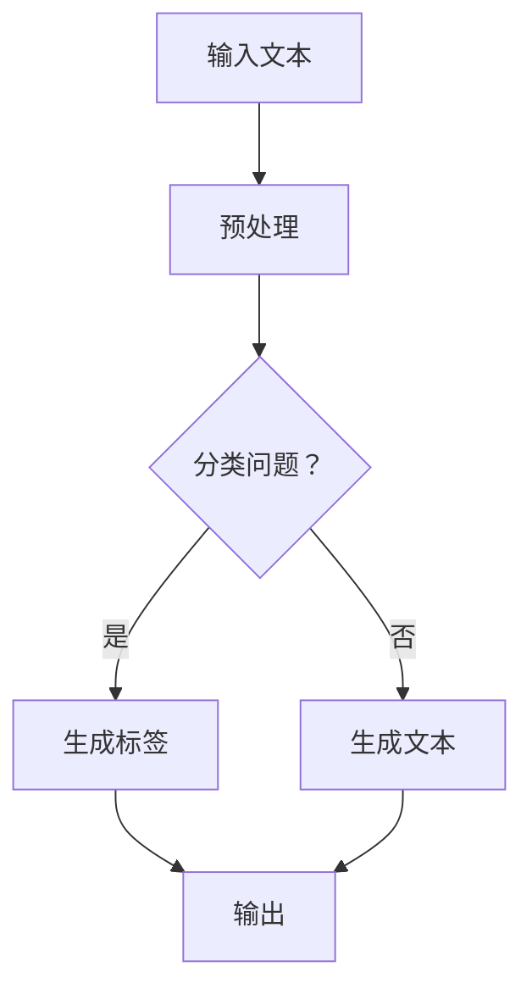

                 

关键词：AI大模型、Prompt提示词、最佳实践、儿童友好解释、技术普及

> 摘要：本文旨在探讨AI大模型Prompt提示词的最佳实践，特别是如何用简单易懂的语言向儿童解释复杂的AI概念。通过分析现有问题和挑战，本文提出了一系列策略，旨在实现技术内容的儿童友好化，并展望了未来的发展趋势。

## 1. 背景介绍

人工智能（AI）已经成为当今科技发展的热点。大模型，如GPT-3、BERT等，因其强大的自然语言处理能力而备受关注。然而，这些技术背后的复杂原理和操作方法对于普通大众，尤其是儿童来说，往往是难以理解的。因此，如何通过有效的Prompt提示词来简化AI概念的讲解，成为了当前研究和实践中的一个重要课题。

近年来，随着AI在教育领域的应用逐渐普及，儿童接触和理解AI的需求也日益增加。但现有的AI教育和普及材料往往过于技术化，难以满足儿童的认知水平和兴趣。因此，探索适合儿童理解的AI大模型Prompt提示词最佳实践，对于推动AI技术的普及教育具有重要意义。

## 2. 核心概念与联系

### 2.1 AI大模型

AI大模型，如GPT-3，是一种基于深度学习的技术，能够通过大量文本数据的学习，理解并生成人类语言。其核心概念包括神经网络、批量学习、参数调整等。

### 2.2 Prompt提示词

Prompt提示词是用户与大模型交互的一种方式，通过特定的词句引导大模型生成相应的输出。有效的Prompt设计能够提高模型的生成质量和效率。

### 2.3 Mermaid流程图

以下是一个简单的Mermaid流程图，展示了AI大模型处理流程的关键步骤：



## 3. 核心算法原理 & 具体操作步骤

### 3.1 算法原理概述

AI大模型的核心是神经网络，通过多层结构对输入数据进行处理和转换，从而实现复杂任务。神经网络的基本原理包括：

- **输入层**：接收外部输入。
- **隐藏层**：对输入数据进行处理和转换。
- **输出层**：生成预测结果。

### 3.2 算法步骤详解

1. **数据收集**：从互联网或其他来源收集大量文本数据。
2. **数据预处理**：清洗数据，去除噪声和无关信息。
3. **模型训练**：使用预处理后的数据训练神经网络模型。
4. **模型评估**：使用验证集评估模型性能。
5. **模型优化**：根据评估结果调整模型参数。
6. **应用部署**：将训练好的模型部署到实际应用场景。

### 3.3 算法优缺点

- **优点**：能够处理大规模文本数据，生成高质量的输出。
- **缺点**：训练过程复杂，对计算资源要求较高。

### 3.4 算法应用领域

AI大模型在自然语言处理、机器翻译、文本生成等领域有广泛应用。例如，它可以用于撰写文章、生成摘要、回答问题等。

## 4. 数学模型和公式 & 详细讲解 & 举例说明

### 4.1 数学模型构建

AI大模型的数学模型主要基于深度学习，包括：

- **激活函数**：用于神经网络中的非线性变换，如ReLU、Sigmoid等。
- **损失函数**：用于评估模型预测与真实值之间的差距，如交叉熵损失、均方误差等。
- **优化器**：用于调整模型参数，如随机梯度下降（SGD）、Adam等。

### 4.2 公式推导过程

以下是一个简单的神经网络模型的公式推导：

$$
\hat{y} = \sigma(W_2 \cdot \sigma(W_1 \cdot x + b_1) + b_2)
$$

其中，$\sigma$为激活函数，$W$和$b$分别为权重和偏置。

### 4.3 案例分析与讲解

假设我们有一个分类问题，输入为文本，输出为类别标签。以下是一个简单的例子：

输入文本：“今天的天气很好。”

输出标签：正面

通过训练，模型能够学会将类似的文本分类为正面或负面。

## 5. 项目实践：代码实例和详细解释说明

### 5.1 开发环境搭建

在开始编写代码之前，我们需要搭建一个适合AI大模型训练的开发环境。以下是一个简单的步骤：

1. 安装Python环境（版本3.6及以上）。
2. 安装TensorFlow或PyTorch等深度学习框架。
3. 准备数据集并进行预处理。

### 5.2 源代码详细实现

以下是一个简单的AI大模型训练的代码示例（使用PyTorch框架）：

```python
import torch
import torch.nn as nn
import torch.optim as optim

# 模型定义
class MyModel(nn.Module):
    def __init__(self):
        super(MyModel, self).__init__()
        self.layer1 = nn.Linear(1000, 512)
        self.layer2 = nn.Linear(512, 256)
        self.layer3 = nn.Linear(256, 1)
        self.relu = nn.ReLU()

    def forward(self, x):
        x = self.relu(self.layer1(x))
        x = self.relu(self.layer2(x))
        x = self.layer3(x)
        return x

# 模型实例化
model = MyModel()

# 损失函数和优化器
criterion = nn.BCEWithLogitsLoss()
optimizer = optim.Adam(model.parameters(), lr=0.001)

# 训练循环
for epoch in range(10):
    for inputs, targets in data_loader:
        optimizer.zero_grad()
        outputs = model(inputs)
        loss = criterion(outputs, targets)
        loss.backward()
        optimizer.step()
    print(f"Epoch [{epoch+1}/10], Loss: {loss.item()}")

# 评估模型
with torch.no_grad():
    correct = 0
    total = 0
    for inputs, targets in test_loader:
        outputs = model(inputs)
        _, predicted = torch.max(outputs.data, 1)
        total += targets.size(0)
        correct += (predicted == targets).sum().item()
    print(f"Test Accuracy: {100 * correct / total}%")
```

### 5.3 代码解读与分析

- **模型定义**：定义了一个简单的两层神经网络模型，包括线性层和ReLU激活函数。
- **训练循环**：通过优化器对模型进行训练，使用BCEWithLogitsLoss损失函数。
- **评估模型**：在测试集上评估模型的准确率。

### 5.4 运行结果展示

运行上述代码后，我们得到模型的训练损失和测试准确率。根据这些指标，我们可以判断模型的效果。

## 6. 实际应用场景

AI大模型Prompt提示词的最佳实践在多个领域有广泛的应用，如教育、医疗、金融等。

- **教育**：通过简单的Prompt提示词，教师可以生成适合儿童理解的教学内容。
- **医疗**：医生可以使用AI大模型生成个性化的诊断建议。
- **金融**：投资者可以通过Prompt提示词获得市场分析和投资建议。

## 7. 工具和资源推荐

### 7.1 学习资源推荐

- 《深度学习》（Goodfellow et al.）
- 《神经网络与深度学习》（邱锡鹏）
- 《Python深度学习》（François Chollet）

### 7.2 开发工具推荐

- TensorFlow
- PyTorch
- Jupyter Notebook

### 7.3 相关论文推荐

- “GPT-3: Language Models are Few-Shot Learners”（Brown et al.）
- “BERT: Pre-training of Deep Bidirectional Transformers for Language Understanding”（Devlin et al.）

## 8. 总结：未来发展趋势与挑战

### 8.1 研究成果总结

近年来，AI大模型和Prompt提示词取得了显著的研究进展，为复杂问题的解决提供了新的思路。

### 8.2 未来发展趋势

随着计算能力的提升和数据量的增加，AI大模型将继续发展，并在更多领域得到应用。

### 8.3 面临的挑战

- **可解释性**：如何提高AI模型的透明度和可解释性，使其更易于理解和接受。
- **数据隐私**：如何在保护用户隐私的前提下进行大规模数据训练。

### 8.4 研究展望

未来，AI大模型和Prompt提示词将在技术普及和教育领域发挥更大作用，推动人工智能的进一步发展。

## 9. 附录：常见问题与解答

### 9.1 什么是最

