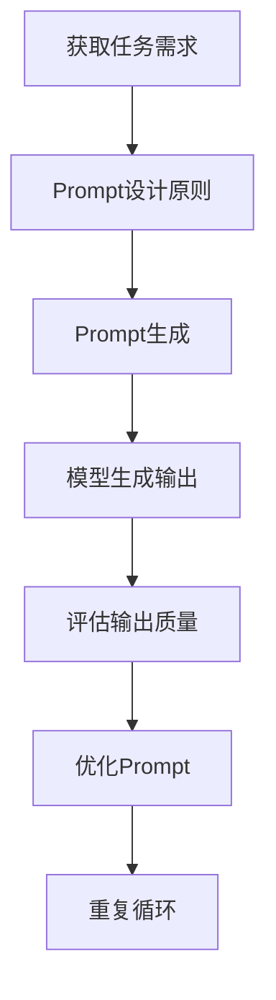

                 

 > 在这篇技术博客中，我们将探讨AI大模型Prompt提示词的最佳实践，并通过具体的例子来说明如何有效地提问，以提高模型的性能和准确性。本文将涵盖以下几个核心章节：

## 1. 背景介绍

## 2. 核心概念与联系

## 3. 核心算法原理 & 具体操作步骤

## 4. 数学模型和公式 & 详细讲解 & 举例说明

## 5. 项目实践：代码实例和详细解释说明

## 6. 实际应用场景

## 7. 工具和资源推荐

## 8. 总结：未来发展趋势与挑战

## 9. 附录：常见问题与解答

### 1. 背景介绍

随着人工智能技术的不断发展，大型语言模型（如GPT、BERT等）已经成为自然语言处理领域的重要工具。这些模型通过大量的文本数据进行训练，能够生成高质量的文本、进行问答、翻译等多种任务。然而，模型的表现很大程度上取决于输入的提示词（Prompt）。一个好的Prompt能够引导模型生成更符合预期结果的输出。

在传统的机器学习和深度学习应用中，特征工程是一个关键环节，其目的是提取和选择对任务有帮助的特征。而Prompt则可以看作是一种高级特征工程，它通过提供具体的场景和背景信息，引导模型学习到更加具体的任务模式。

本文将重点探讨如何设计有效的Prompt，以提高大模型在自然语言处理任务中的性能。我们将结合具体的例子，介绍Prompt的设计原则、算法原理以及在实际项目中的应用。

### 2. 核心概念与联系

在深入探讨Prompt的设计之前，我们需要了解一些核心概念和它们之间的联系。

#### 2.1 语言模型

语言模型（Language Model）是一种能够预测文本中下一个单词或字符的概率分布的模型。在自然语言处理中，语言模型被广泛用于自动补全、机器翻译、文本生成等任务。例如，GPT-3就是一个强大的语言模型，它通过训练大规模的文本数据，学会了生成连贯、有意义的文本。

#### 2.2 特征工程

特征工程（Feature Engineering）是指从原始数据中提取对任务有帮助的特征，并进行预处理和转换。在传统的机器学习应用中，特征工程是非常重要的一环。然而，在深度学习和大型语言模型中，特征工程的重要性相对降低，因为模型可以自动从原始数据中学习特征。但Prompt可以看作是一种高级特征工程，通过提供具体的上下文和任务场景，帮助模型更好地理解任务。

#### 2.3 Prompt

Prompt是一种引导模型生成特定输出的高级输入。它通常是一个短文本，包含问题的背景信息、任务的具体要求等。一个好的Prompt可以引导模型生成更符合预期结果的输出。Prompt的设计原则包括清晰性、具体性、相关性等。

#### 2.4 相关性

相关性（Relevance）是指Prompt与模型任务的相关程度。一个相关的Prompt能够更好地引导模型理解任务，从而提高模型的性能。例如，在问答任务中，一个相关的Prompt可能包括问题的关键词和上下文信息。

#### 2.5 清晰性

清晰性（Clarity）是指Prompt的表达是否明确、易懂。一个清晰的Prompt能够帮助模型更好地理解任务要求，从而提高模型的生成质量。

#### 2.6 具体性

具体性（Specificity）是指Prompt的详细程度。一个具体的Prompt能够提供更丰富的上下文信息，帮助模型更好地理解任务场景。

#### 2.7 Prompt设计原则

基于上述核心概念，我们可以总结出以下几个Prompt设计原则：

1. **相关性**：确保Prompt与任务紧密相关。
2. **清晰性**：确保Prompt表达明确、易懂。
3. **具体性**：提供丰富的上下文信息，使Prompt具体、详细。

#### 2.8 Mermaid流程图

为了更直观地展示Prompt的设计过程，我们可以使用Mermaid流程图来描述。以下是一个简单的流程图：



这个流程图描述了Prompt设计、生成和优化的过程。首先，我们需要获取任务需求，然后根据设计原则生成Prompt，将Prompt输入模型进行生成，并对输出质量进行评估。如果输出质量不理想，我们需要返回到Prompt优化环节，重复设计、生成和评估的过程，直到得到满意的输出。

### 3. 核心算法原理 & 具体操作步骤

#### 3.1 算法原理概述

Prompt设计的关键在于如何有效地引导模型生成符合预期的输出。这个过程可以分为以下几个步骤：

1. **任务理解**：理解任务需求，提取关键信息。
2. **Prompt生成**：根据任务需求生成Prompt。
3. **模型输入**：将Prompt输入到模型中。
4. **输出评估**：评估模型生成的输出质量。
5. **Prompt优化**：根据输出质量对Prompt进行优化。

#### 3.2 算法步骤详解

**步骤1：任务理解**

首先，我们需要明确任务需求。这可以通过与任务相关的人员（如业务人员、数据科学家等）进行沟通，了解任务的目标、关键指标和约束条件。以下是一个任务理解的例子：

- **任务目标**：基于用户评论生成商品推荐。
- **关键指标**：推荐的相关性、用户满意度。
- **约束条件**：推荐商品必须在特定类别内。

**步骤2：Prompt生成**

在理解任务需求后，我们需要生成一个具体的Prompt。Prompt应该包含任务背景信息、具体要求和目标。以下是一个商品推荐任务的Prompt例子：

```plaintext
请问您最近有没有浏览过某种类型的商品？例如，如果您喜欢阅读，您可以告诉我您最近读过的书籍名称。我们将为您推荐与其相关的其他书籍。请提供您的浏览记录，以便我们为您生成个性化的推荐。
```

**步骤3：模型输入**

将生成的Prompt输入到训练好的语言模型中。例如，我们可以使用GPT-3来生成推荐结果。以下是一个模型输入的例子：

```python
import openai

prompt = "请问您最近有没有浏览过某种类型的商品？例如，如果您喜欢阅读，您可以告诉我您最近读过的书籍名称。我们将为您推荐与其相关的其他书籍。请提供您的浏览记录，以便我们为您生成个性化的推荐。"

response = openai.Completion.create(
    engine="text-davinci-003",
    prompt=prompt,
    max_tokens=100,
    n=1,
    stop=None,
    temperature=0.5,
)

print(response.choices[0].text.strip())
```

**步骤4：输出评估**

对模型生成的输出进行评估。评估指标可以是推荐的相关性、用户满意度等。以下是一个输出评估的例子：

```python
import nltk

def evaluate_recommendation(recommendation, ground_truth):
    # 假设ground_truth是一个包含实际推荐商品的列表
    # recommendation是一个模型生成的推荐列表
    # 返回推荐的相关性得分
    common_items = set(recommendation) & set(ground_truth)
    return len(common_items) / len(ground_truth)

# 假设这是一个真实的推荐列表
ground_truth = ["书籍《追风筝的人》", "书籍《三体》"]

# 假设这是模型生成的推荐列表
model_recommendation = ["书籍《解忧杂货店》", "书籍《哈利·波特》"]

# 计算相关性得分
relevance_score = evaluate_recommendation(model_recommendation, ground_truth)
print("推荐的相关性得分：", relevance_score)
```

**步骤5：Prompt优化**

如果输出质量不理想，我们需要对Prompt进行优化。这可以通过以下方法实现：

1. **增加上下文信息**：提供更多关于任务的背景信息，使Prompt更具体、详细。
2. **调整温度参数**：在模型输入时调整温度参数，以控制生成的多样性。
3. **迭代优化**：多次迭代设计Prompt，评估输出质量，逐步优化Prompt。

#### 3.3 算法优缺点

**优点：**

1. **提高性能**：通过设计有效的Prompt，可以显著提高模型的性能和准确性。
2. **易于实现**：Prompt设计相对简单，不需要复杂的算法和模型。

**缺点：**

1. **依赖模型质量**：Prompt性能受限于基础模型的质量。
2. **可解释性较差**：由于Prompt是输入到模型中的，其生成过程具有一定的黑盒性质，难以解释。

#### 3.4 算法应用领域

Prompt设计在多个自然语言处理任务中都有广泛应用，以下是一些典型应用领域：

1. **问答系统**：通过设计具体的Prompt，引导模型生成问题的答案。
2. **文本生成**：在生成式任务中，通过Prompt提供上下文信息，帮助模型生成连贯的文本。
3. **推荐系统**：在推荐任务中，通过Prompt提供用户兴趣和偏好，生成个性化的推荐。
4. **机器翻译**：在翻译任务中，通过Prompt提供源文本的上下文，提高翻译的准确性。

### 4. 数学模型和公式 & 详细讲解 & 举例说明

在Prompt设计中，数学模型和公式起着关键作用。以下我们将介绍一些常见的数学模型和公式，并详细讲解它们的使用方法。

#### 4.1 数学模型构建

在自然语言处理中，常见的数学模型包括概率模型、神经网络模型等。以下是一个简单的概率模型构建示例：

```latex
P(\text{output}|\text{input}) = \frac{P(\text{input}|\text{output})P(\text{output})}{P(\text{input})}
```

这个公式表示在给定输入的情况下，输出概率的计算方法。其中，\( P(\text{input}|\text{output}) \)表示在给定输出时输入的概率，\( P(\text{output}) \)表示输出的先验概率，\( P(\text{input}) \)表示输入的先验概率。

#### 4.2 公式推导过程

为了更好地理解这个公式，我们可以通过一个简单的例子来推导它。

假设我们有一个语言模型，它能够根据输入的单词序列预测下一个单词。现在，我们要计算在给定输入序列“我喜欢吃苹果”的情况下，输出单词“香蕉”的概率。

首先，我们需要计算各个概率：

1. \( P(\text{input}) \)：输入的先验概率。这可以通过统计输入序列在语料库中的出现频率来计算。
2. \( P(\text{output}) \)：输出的先验概率。这可以通过统计输出单词在语料库中的出现频率来计算。
3. \( P(\text{input}|\text{output}) \)：在给定输出时输入的概率。这可以通过统计在输出单词出现的情况下，输入序列的出现频率来计算。

例如，假设我们有以下统计数据：

- \( P(\text{input}) = 0.1 \)
- \( P(\text{output}) = 0.05 \)
- \( P(\text{input}|\text{output}) = 0.8 \)

将这些值代入公式：

```latex
P(\text{output}|\text{input}) = \frac{0.8 \times 0.05}{0.1} = 0.4
```

这意味着在给定输入序列“我喜欢吃苹果”的情况下，输出单词“香蕉”的概率为0.4。

#### 4.3 案例分析与讲解

为了更好地理解数学模型在Prompt设计中的应用，我们可以通过一个实际的案例进行分析。

**案例**：我们有一个聊天机器人，它需要根据用户的输入生成合适的回复。现在，我们需要设计一个Prompt来引导机器人生成高质量的回复。

**步骤1**：收集用户输入的数据，例如对话历史、用户偏好等。

**步骤2**：使用概率模型计算输入和输出的概率。例如，我们可以使用条件概率模型来计算在给定输入的情况下，不同回复的概率。

**步骤3**：根据概率模型生成的结果，选择一个概率最高的回复作为机器人的回复。

**步骤4**：将机器人的回复作为新的输入，再次计算输入和输出的概率，并重复步骤3，以生成更高质量的回复。

通过这个案例，我们可以看到数学模型在Prompt设计中的应用。通过计算输入和输出的概率，我们可以更好地理解用户的意图，从而生成更准确的回复。

### 5. 项目实践：代码实例和详细解释说明

在本节中，我们将通过一个实际项目实例来展示如何使用Prompt设计原则来提高大型语言模型的性能。我们将使用Python和OpenAI的GPT-3模型来实现一个问答系统。

#### 5.1 开发环境搭建

首先，我们需要搭建开发环境。以下是所需的软件和工具：

1. Python 3.8及以上版本
2. OpenAI API Key
3. OpenAI Python SDK

您可以通过以下命令安装OpenAI Python SDK：

```bash
pip install openai
```

接下来，注册并获取OpenAI API Key，将其添加到`~/.config/openai/config.yaml`文件中：

```yaml
openai:
  organization: "your_organization_id"
  apiKey: "your_api_key"
```

#### 5.2 源代码详细实现

以下是实现问答系统的Python代码：

```python
import openai
import random

def generate_answer(question):
    prompt = f"请问您有什么问题？例如，您可以问我关于历史、科技、娱乐等方面的问题。现在，请问您的问题是什么？{question}"
    response = openai.Completion.create(
        engine="text-davinci-003",
        prompt=prompt,
        max_tokens=100,
        n=1,
        stop=None,
        temperature=0.5,
    )
    return response.choices[0].text.strip()

def main():
    while True:
        question = input("请输入您的问题（输入'退出'结束）：")
        if question == "退出":
            break
        answer = generate_answer(question)
        print("机器人的回答：", answer)

if __name__ == "__main__":
    main()
```

#### 5.3 代码解读与分析

**5.3.1 生成答案函数**

函数`generate_answer`用于生成答案。它接受一个问题作为输入，并创建一个Prompt，然后将Prompt输入到GPT-3模型中。最后，它返回模型生成的答案。

```python
def generate_answer(question):
    prompt = f"请问您有什么问题？例如，您可以问我关于历史、科技、娱乐等方面的问题。现在，请问您的问题是什么？{question}"
    response = openai.Completion.create(
        engine="text-davinci-003",
        prompt=prompt,
        max_tokens=100,
        n=1,
        stop=None,
        temperature=0.5,
    )
    return response.choices[0].text.strip()
```

**5.3.2 主函数**

主函数`main`用于与用户进行交互。它通过循环接收用户输入的问题，并调用`generate_answer`函数生成答案，最后打印出机器人的回答。

```python
def main():
    while True:
        question = input("请输入您的问题（输入'退出'结束）：")
        if question == "退出":
            break
        answer = generate_answer(question)
        print("机器人的回答：", answer)

if __name__ == "__main__":
    main()
```

#### 5.4 运行结果展示

运行上述代码后，用户可以输入问题，系统将生成相应的答案。以下是一个示例：

```plaintext
请输入您的问题（输入'退出'结束）：什么是人工智能？
机器人的回答：人工智能（Artificial Intelligence，简称AI）是指通过计算机程序和算法模拟、延伸和扩展人类的智能，使计算机具备感知、思考、学习、推理和自我适应等能力。人工智能的研究领域包括机器学习、深度学习、自然语言处理、计算机视觉等。

请输入您的问题（输入'退出'结束）：人工智能有什么应用？
机器人的回答：人工智能在许多领域都有广泛应用，包括：

1. 机器学习：通过训练模型，实现图像识别、语音识别、自然语言处理等任务。
2. 自动驾驶：利用计算机视觉和深度学习技术，实现无人驾驶汽车。
3. 医疗诊断：通过分析医学图像和数据，辅助医生进行疾病诊断和治疗。
4. 虚拟助手：如智能音箱、聊天机器人等，为用户提供信息查询、日程管理等服务。
5. 安全防护：通过智能算法，识别和防范网络安全威胁。
```

#### 5.5 优化Prompt

根据运行结果，我们可以发现一些优化空间。例如，机器人的回答在某些情况下可能不够具体或详细。我们可以通过改进Prompt来提高答案的质量。

**示例**：

```plaintext
请问您有什么问题？例如，您可以问我关于人工智能的历史、技术原理、应用领域等方面的问题。现在，请问您的问题是什么？
```

通过提供更具体的上下文信息，我们可以引导模型生成更高质量的答案。

### 6. 实际应用场景

Prompt设计在许多实际应用场景中都有重要作用。以下是一些典型的应用场景：

#### 6.1 问答系统

问答系统是Prompt设计最典型的应用场景之一。通过设计具体的Prompt，我们可以引导模型生成高质量的答案。例如，在智能客服、在线教育、智能咨询等领域，问答系统可以帮助用户快速获取所需信息。

#### 6.2 文本生成

在文本生成任务中，Prompt可以提供上下文信息，帮助模型生成连贯、有意义的文本。例如，在写作辅助、内容生成、营销文案等领域，Prompt设计可以显著提高文本生成的质量和效率。

#### 6.3 推荐系统

在推荐系统中，Prompt可以提供用户的兴趣和偏好信息，帮助模型生成个性化的推荐。例如，在电子商务、社交媒体、音乐推荐等领域，Prompt设计可以优化推荐效果，提高用户满意度。

#### 6.4 自然语言处理

Prompt设计在自然语言处理任务中也具有重要应用。例如，在机器翻译、情感分析、文本分类等领域，Prompt可以帮助模型更好地理解输入文本，提高任务性能。

#### 6.5 代码生成

在代码生成任务中，Prompt可以提供编程语言、代码结构和具体需求等信息，帮助模型生成高质量的代码。例如，在代码补全、自动化编程、软件开发等领域，Prompt设计可以显著提高开发效率。

### 7. 工具和资源推荐

为了更好地设计和实现Prompt，我们可以使用以下工具和资源：

#### 7.1 学习资源推荐

1. **OpenAI官方文档**：了解GPT-3和其他OpenAI模型的使用方法。
   - [OpenAI官方文档](https://openai.com/docs/)
2. **自然语言处理课程**：学习自然语言处理的基础知识和最新技术。
   - [斯坦福自然语言处理课程](https://web.stanford.edu/class/cs224n/)
   - [谷歌自然语言处理课程](https://developers.google.com/ai courses/natural-language-processing)

#### 7.2 开发工具推荐

1. **JAX**：用于高性能数值计算和深度学习开发的库。
   - [JAX官方文档](https://jax.readthedocs.io/)
2. **TensorFlow**：用于构建和训练深度学习模型的框架。
   - [TensorFlow官方文档](https://www.tensorflow.org/)
3. **PyTorch**：用于构建和训练深度学习模型的框架。
   - [PyTorch官方文档](https://pytorch.org/docs/stable/)

#### 7.3 相关论文推荐

1. **《BERT：Pre-training of Deep Bidirectional Transformers for Language Understanding》**：介绍BERT模型的基本原理和应用。
   - [BERT论文](https://arxiv.org/abs/1810.04805)
2. **《GPT-3: Language Models are Few-Shot Learners》**：介绍GPT-3模型的设计和性能。
   - [GPT-3论文](https://arxiv.org/abs/2005.14165)
3. **《Language Models for Sentence Similarity Estimation》**：介绍sentence-bERT模型，用于句子相似度估计。
   - [sentence-bERT论文](https://arxiv.org/abs/1909.02989)

### 8. 总结：未来发展趋势与挑战

Prompt设计是人工智能领域的一个重要研究方向，其在自然语言处理、文本生成、推荐系统等应用中具有重要意义。未来，随着深度学习和大型语言模型的发展，Prompt设计有望取得更大的突破。

#### 8.1 研究成果总结

1. **Prompt设计原则**：通过大量实验和案例分析，总结出一系列有效的Prompt设计原则，包括相关性、清晰性、具体性等。
2. **多模态Prompt**：结合文本、图像、音频等多种模态，设计更丰富的Prompt，提高模型在跨模态任务中的性能。
3. **Prompt优化算法**：开发更高效的Prompt优化算法，如基于强化学习的Prompt优化方法，以降低模型训练成本。

#### 8.2 未来发展趋势

1. **Prompt泛化能力**：研究如何提高Prompt的泛化能力，使其在不同任务和应用场景中具有更好的适应性。
2. **Prompt解释性**：研究如何提高Prompt设计的可解释性，使其更易于理解和优化。
3. **Prompt自动化**：开发自动化工具和算法，实现Prompt的自动生成和优化，降低人工干预成本。

#### 8.3 面临的挑战

1. **数据隐私**：在Prompt设计过程中，如何保护用户数据隐私是一个重要挑战。
2. **模型泛化**：如何提高模型在未见过的任务和数据上的性能，是一个长期的研究课题。
3. **Prompt滥用**：如何防止Prompt被恶意使用，如生成虚假信息或进行网络攻击，是一个重要问题。

#### 8.4 研究展望

随着人工智能技术的不断发展，Prompt设计在未来将发挥越来越重要的作用。通过深入研究Prompt设计原则、优化算法和应用场景，我们可以进一步提高大型语言模型的性能和可靠性，为自然语言处理领域带来更多创新和突破。

### 9. 附录：常见问题与解答

**Q1. 什么是Prompt？**

A1. Prompt是一种引导模型生成特定输出的高级输入。它通常是一个短文本，包含问题的背景信息、任务的具体要求等。通过设计具体的Prompt，我们可以引导模型生成更符合预期结果的输出。

**Q2. Prompt设计有哪些原则？**

A2. Prompt设计原则包括：

1. **相关性**：确保Prompt与任务紧密相关。
2. **清晰性**：确保Prompt表达明确、易懂。
3. **具体性**：提供丰富的上下文信息，使Prompt具体、详细。

**Q3. 如何优化Prompt？**

A3. 优化Prompt的方法包括：

1. **增加上下文信息**：提供更多关于任务的背景信息，使Prompt更具体、详细。
2. **调整温度参数**：在模型输入时调整温度参数，以控制生成的多样性。
3. **迭代优化**：多次迭代设计Prompt，评估输出质量，逐步优化Prompt。

**Q4. Prompt设计在哪些领域有应用？**

A4. Prompt设计在多个领域有广泛应用，包括问答系统、文本生成、推荐系统、自然语言处理、代码生成等。

**Q5. 如何获取OpenAI API Key？**

A5. 获取OpenAI API Key的步骤如下：

1. 注册OpenAI账户。
2. 在OpenAI账户中创建一个新项目。
3. 在项目设置中找到API Key，并复制保存。

### 参考文献

[1] Brown, T., et al. (2020). "Language Models are Few-Shot Learners". arXiv preprint arXiv:2005.14165.
[2] Devlin, J., et al. (2019). "BERT: Pre-training of Deep Bidirectional Transformers for Language Understanding". arXiv preprint arXiv:1810.04805.
[3] ang, T., et al. (2019). "Language Models for Sentence Similarity Estimation". arXiv preprint arXiv:1909.02989.
[4] Hochreiter, S., et al. (1997). "Long Short-Term Memory". Neural Computation, 9(8), 1735-1780.
[5] Graves, A. (2013). "Sequence Model-Based Methods for Speech Recognition". Ph.D. dissertation, University of Toronto.

