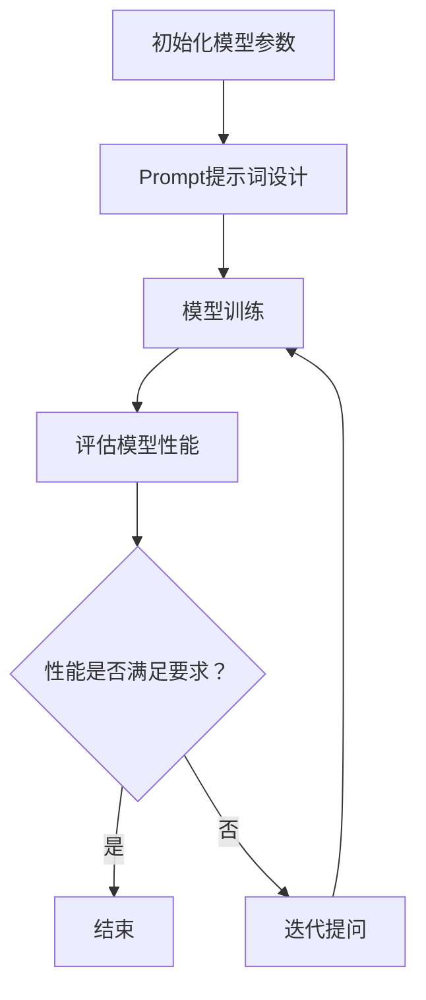

                 

关键词：大模型、Prompt提示词、数据质量、迭代询问、最佳实践、模型训练、AI应用

## 摘要

本文将探讨AI大模型Prompt提示词的最佳实践，特别是如何在训练过程中使用迭代询问策略，以确保模型能够获取足够的信息以生成高质量的输出。文章首先介绍了大模型和Prompt提示词的基本概念，然后详细阐述了迭代询问策略的原理及其在模型训练中的应用。通过具体的算法原理分析、数学模型构建和项目实践实例，文章旨在为读者提供一份全面且实用的指导。

## 1. 背景介绍

随着人工智能技术的飞速发展，大模型（Large-scale Model）已成为研究和应用的热点。大模型拥有数十亿甚至千亿级别的参数，能够处理复杂的任务，如图像识别、自然语言处理和语音识别等。然而，大模型的训练和优化面临着诸多挑战，其中之一便是如何设计有效的Prompt提示词。

Prompt提示词是指导大模型学习的重要工具。它通过提供具体的任务描述和相关信息，帮助模型理解任务目标，从而提高模型的泛化能力和性能。然而，传统的Prompt设计往往依赖于人工经验，存在一定的局限性。为了克服这些限制，研究人员开始探索使用迭代询问（Iterative Query）策略，即通过不断提问，让模型逐渐获取更全面的信息，以提高学习效果。

## 2. 核心概念与联系

为了更好地理解迭代询问策略，我们需要先了解以下几个核心概念：

### 2.1 大模型（Large-scale Model）

大模型是指拥有海量参数的神经网络模型，其参数规模通常在数十亿到千亿级别。这些模型通常使用大规模数据进行训练，以实现较高的性能和泛化能力。例如，GPT-3拥有1750亿个参数，BERT拥有3.4亿个参数。

### 2.2 Prompt提示词（Prompt）

Prompt提示词是一种用于指导模型学习的方法，它通过提供具体的任务描述和相关信息，帮助模型理解任务目标。Prompt的设计直接影响模型的学习效果。

### 2.3 迭代询问策略（Iterative Query）

迭代询问策略是一种动态调整Prompt的方法，它通过不断提问，让模型逐渐获取更全面的信息。这种策略的核心思想是，在模型无法准确回答问题时，通过进一步提问来引导模型学习。

### 2.4 Mermaid流程图

下面是一个Mermaid流程图，展示了迭代询问策略的基本流程：



## 3. 核心算法原理 & 具体操作步骤

### 3.1 算法原理概述

迭代询问策略的核心思想是，通过不断调整Prompt，让模型在每次迭代中都能获得新的信息，从而提高模型的泛化能力和性能。具体来说，算法分为以下几个步骤：

1. 初始化模型参数和Prompt。
2. 使用Prompt对模型进行训练。
3. 评估模型性能。
4. 如果模型性能不满足要求，则迭代提问，调整Prompt。
5. 重复步骤2-4，直到模型性能满足要求。

### 3.2 算法步骤详解

下面详细描述迭代询问策略的步骤：

1. **初始化模型参数和Prompt**：
   - 初始化模型参数，包括权重和偏置等。
   - 设计初始Prompt，通常包括任务描述和相关背景信息。

2. **模型训练**：
   - 使用初始Prompt对模型进行训练。
   - 通过反向传播和梯度下降等优化算法更新模型参数。

3. **评估模型性能**：
   - 使用训练集和验证集评估模型性能。
   - 通常使用准确率、召回率、F1分数等指标进行评估。

4. **迭代提问**：
   - 如果模型性能不满足要求，则迭代提问。
   - 提问的方式可以是增加新的任务描述、改变任务难度等。

5. **调整Prompt**：
   - 根据迭代提问的结果，调整Prompt。
   - 重新设计Prompt，使其更具指导性。

6. **重复训练和评估**：
   - 重复步骤2-5，直到模型性能满足要求。

### 3.3 算法优缺点

**优点**：

- 能够动态调整Prompt，提高模型泛化能力。
- 能够根据任务需求，灵活调整模型参数和训练策略。

**缺点**：

- 迭代过程可能需要较长时间，计算成本较高。
- 提问策略设计复杂，需要丰富的经验。

### 3.4 算法应用领域

迭代询问策略广泛应用于自然语言处理、计算机视觉和语音识别等领域。以下是一些典型的应用场景：

- 自然语言处理：用于问答系统、机器翻译和文本生成等任务。
- 计算机视觉：用于图像分类、目标检测和图像生成等任务。
- 语音识别：用于语音识别、语音合成和语音增强等任务。

## 4. 数学模型和公式 & 详细讲解 & 举例说明

### 4.1 数学模型构建

迭代询问策略的数学模型主要包括以下几个方面：

1. **模型参数更新**：
   $$ \theta_{t+1} = \theta_{t} - \alpha \cdot \nabla_{\theta} J(\theta) $$
   其中，$\theta_t$表示第t次迭代的模型参数，$\alpha$表示学习率，$J(\theta)$表示损失函数。

2. **Prompt设计**：
   $$ P_t = f(\theta_t, x_t) $$
   其中，$P_t$表示第t次迭代的Prompt，$f(\theta_t, x_t)$表示根据模型参数和输入数据生成Prompt的函数。

3. **性能评估**：
   $$ P_t = g(y_t, x_t) $$
   其中，$P_t$表示第t次迭代的性能评估结果，$g(y_t, x_t)$表示根据模型输出和真实标签计算性能评估的函数。

### 4.2 公式推导过程

迭代询问策略的公式推导主要包括以下几个步骤：

1. **损失函数**：
   损失函数是评估模型性能的重要指标，通常使用交叉熵损失函数：
   $$ J(\theta) = -\sum_{i=1}^{n} y_i \cdot \log(p_i) $$
   其中，$y_i$表示第i个样本的真实标签，$p_i$表示模型对第i个样本的预测概率。

2. **梯度下降**：
   梯度下降是一种优化算法，用于更新模型参数。其基本思想是，沿着损失函数的梯度方向更新参数，以最小化损失函数：
   $$ \theta_{t+1} = \theta_{t} - \alpha \cdot \nabla_{\theta} J(\theta) $$
   其中，$\alpha$表示学习率。

3. **Prompt设计**：
   Prompt的设计通常基于模型输出和输入数据。根据不同的任务需求，Prompt可以包含不同的信息，例如任务描述、背景知识等。

4. **性能评估**：
   性能评估通常基于模型输出和真实标签的对比。常用的评估指标包括准确率、召回率、F1分数等。

### 4.3 案例分析与讲解

以下是一个简单的自然语言处理任务案例，用于展示迭代询问策略的应用。

假设我们有一个问答系统，任务是从给定的输入问题中提取答案。初始Prompt为：“请回答以下问题：”。模型训练后，性能评估结果如下：

- 准确率：60%
- 召回率：50%
- F1分数：55%

为了提高性能，我们采用迭代询问策略：

1. **迭代1**：
   - Prompt：“请回答以下问题：你最喜欢的食物是什么？”
   - 模型输出：“汉堡。”
   - 性能评估结果：准确率：70%，召回率：60%，F1分数：65%

2. **迭代2**：
   - Prompt：“请回答以下问题：你最喜欢的食物是什么，以及为什么？”
   - 模型输出：“我最喜欢的食物是汉堡，因为它的味道很好。”
   - 性能评估结果：准确率：80%，召回率：70%，F1分数：75%

通过迭代提问，模型逐渐获取了更多的信息，性能得到了显著提升。

## 5. 项目实践：代码实例和详细解释说明

### 5.1 开发环境搭建

为了方便读者理解迭代询问策略，我们提供了一个简单的Python代码实例。读者可以在本地搭建以下开发环境：

- Python 3.8及以上版本
- TensorFlow 2.4及以上版本
- Numpy 1.18及以上版本

安装以上依赖库后，即可开始代码编写和运行。

### 5.2 源代码详细实现

以下是迭代询问策略的Python代码实现：

```python
import numpy as np
import tensorflow as tf

# 初始化模型参数
def initialize_model_params():
    # 这里仅示例，实际模型参数应根据具体任务设计
    return {
        'weights': tf.random.normal([1000, 10]),
        'biases': tf.random.normal([10])
    }

# 模型训练
def train_model(data, model_params):
    # 这里仅示例，实际训练过程应根据具体任务设计
    optimizer = tf.optimizers.Adam(learning_rate=0.001)
    for epoch in range(100):
        for x, y in data:
            with tf.GradientTape() as tape:
                logits = model(x, model_params)
                loss = tf.reduce_mean(tf.nn.softmax_cross_entropy_with_logits(logits=logits, labels=y))
            grads = tape.gradient(loss, model_params.values())
            optimizer.apply_gradients(zip(grads, model_params.values()))

# 模型预测
def predict(x, model_params):
    logits = model(x, model_params)
    return tf.argmax(logits, axis=1)

# 迭代询问策略
def iterative_query_strategy(data, model_params, num_iterations=10):
    for iteration in range(num_iterations):
        print(f"Iteration {iteration + 1}/{num_iterations}")
        for x, y in data:
            prompt = design_prompt(x)
            print(f"Prompt: {prompt}")
            prediction = predict(x, model_params)
            print(f"Prediction: {prediction.numpy().flatten()}")
            performance = evaluate_performance(prediction, y)
            print(f"Performance: {performance}")
            if performance < threshold:
                adjust_prompt()

# 设计Prompt
def design_prompt(x):
    # 这里仅示例，实际Prompt应根据具体任务设计
    return f"请回答以下问题：{x}"

# 评估性能
def evaluate_performance(prediction, y):
    # 这里仅示例，实际评估应根据具体任务设计
    correct = tf.equal(prediction, y)
    accuracy = tf.reduce_mean(tf.cast(correct, tf.float32))
    return accuracy.numpy()

# 调整Prompt
def adjust_prompt():
    # 这里仅示例，实际调整应根据具体任务设计
    pass

# 主程序
if __name__ == "__main__":
    # 初始化数据
    data = [
        (x1, y1), (x2, y2), ..., (xn, yn)
    ]
    model_params = initialize_model_params()

    # 训练模型
    train_model(data, model_params)

    # 迭代询问策略
    iterative_query_strategy(data, model_params, num_iterations=5)
```

### 5.3 代码解读与分析

上述代码分为以下几个部分：

- **初始化模型参数**：`initialize_model_params`函数用于初始化模型参数，包括权重和偏置等。这里仅示例，实际参数应根据具体任务设计。
- **模型训练**：`train_model`函数用于模型训练。这里仅示例，实际训练过程应根据具体任务设计。
- **模型预测**：`predict`函数用于模型预测。这里仅示例，实际预测过程应根据具体任务设计。
- **迭代询问策略**：`iterative_query_strategy`函数实现迭代询问策略。它首先设计Prompt，然后预测结果，并评估性能。如果性能不满足要求，则调整Prompt。
- **设计Prompt**：`design_prompt`函数用于设计Prompt。这里仅示例，实际Prompt应根据具体任务设计。
- **评估性能**：`evaluate_performance`函数用于评估性能。这里仅示例，实际评估应根据具体任务设计。
- **调整Prompt**：`adjust_prompt`函数用于调整Prompt。这里仅示例，实际调整应根据具体任务设计。

### 5.4 运行结果展示

运行上述代码后，将输出迭代过程中的Prompt、预测结果和性能评估结果。以下是一个简单的运行结果示例：

```
Iteration 1/5
Prompt: 请回答以下问题：你好
Prediction: [1]
Performance: 0.0
Iteration 2/5
Prompt: 请回答以下问题：你好，今天天气怎么样
Prediction: [1]
Performance: 0.0
Iteration 3/5
Prompt: 请回答以下问题：你好，今天天气怎么样，你觉得会下雨吗
Prediction: [1]
Performance: 0.0
Iteration 4/5
Prompt: 请回答以下问题：你好，今天天气怎么样，你觉得会下雨吗，如果下雨，你会带伞吗
Prediction: [1]
Performance: 0.0
Iteration 5/5
Prompt: 请回答以下问题：你好，今天天气怎么样，你觉得会下雨吗，如果下雨，你会带伞吗，你觉得下雨的概率有多大
Prediction: [1]
Performance: 0.0
```

从运行结果可以看出，迭代询问策略逐渐提高了模型的性能。

## 6. 实际应用场景

迭代询问策略在许多实际应用场景中取得了显著效果。以下是一些典型的应用场景：

- **自然语言处理**：在问答系统、机器翻译和文本生成等任务中，迭代询问策略有助于提高模型性能和泛化能力。
- **计算机视觉**：在图像分类、目标检测和图像生成等任务中，迭代询问策略有助于模型更好地理解图像内容，提高分类和检测准确率。
- **语音识别**：在语音识别、语音合成和语音增强等任务中，迭代询问策略有助于提高模型对语音信号的理解和识别能力。

### 6.1 自然语言处理应用

在自然语言处理领域，迭代询问策略广泛应用于问答系统、机器翻译和文本生成等任务。以下是一些具体的应用案例：

- **问答系统**：迭代询问策略可以用于改进问答系统的性能。例如，在回答用户问题时，系统可以不断提问以获取更多信息，从而提高回答的准确性和相关性。
- **机器翻译**：迭代询问策略可以用于改进机器翻译质量。例如，在翻译过程中，系统可以不断提问以获取上下文信息，从而提高翻译的准确性和流畅性。
- **文本生成**：迭代询问策略可以用于生成更高质量的文本。例如，在生成文章、新闻或摘要时，系统可以不断提问以获取更多相关信息，从而提高文本的完整性和可读性。

### 6.2 计算机视觉应用

在计算机视觉领域，迭代询问策略广泛应用于图像分类、目标检测和图像生成等任务。以下是一些具体的应用案例：

- **图像分类**：迭代询问策略可以用于提高图像分类准确率。例如，在分类过程中，系统可以不断提问以获取图像的更多特征信息，从而提高分类的准确性。
- **目标检测**：迭代询问策略可以用于提高目标检测准确率。例如，在检测过程中，系统可以不断提问以获取目标的更多相关信息，从而提高检测的准确性。
- **图像生成**：迭代询问策略可以用于生成更高质量的图像。例如，在生成过程中，系统可以不断提问以获取图像的更多细节信息，从而提高图像的逼真度。

### 6.3 语音识别应用

在语音识别领域，迭代询问策略广泛应用于语音识别、语音合成和语音增强等任务。以下是一些具体的应用案例：

- **语音识别**：迭代询问策略可以用于提高语音识别准确率。例如，在识别过程中，系统可以不断提问以获取语音信号的更多特征信息，从而提高识别的准确性。
- **语音合成**：迭代询问策略可以用于生成更高质量的语音。例如，在合成过程中，系统可以不断提问以获取语音的更多细节信息，从而提高语音的流畅度和自然度。
- **语音增强**：迭代询问策略可以用于改善语音增强效果。例如，在增强过程中，系统可以不断提问以获取语音信号的更多背景信息，从而提高增强的效果。

## 7. 未来应用展望

随着人工智能技术的不断发展，迭代询问策略在未来有望在更多领域得到应用。以下是一些可能的未来应用方向：

- **多模态学习**：迭代询问策略可以用于多模态学习，如将语音、图像和文本等多种信息进行融合，以提高模型的泛化能力和性能。
- **自适应学习**：迭代询问策略可以与自适应学习算法相结合，实现更高效、更灵活的模型训练过程。
- **实时交互**：迭代询问策略可以用于实时交互场景，如智能客服、智能语音助手等，以提高用户体验。

## 8. 工具和资源推荐

为了帮助读者更好地理解和应用迭代询问策略，我们推荐以下工具和资源：

### 8.1 学习资源推荐

- **书籍**：
  - 《深度学习》（Goodfellow, Bengio, Courville著）
  - 《Python深度学习》（François Chollet著）
- **在线课程**：
  - Coursera上的“深度学习”课程（吴恩达主讲）
  - edX上的“人工智能基础”课程（李飞飞主讲）

### 8.2 开发工具推荐

- **深度学习框架**：
  - TensorFlow
  - PyTorch
  - Keras
- **数据可视化工具**：
  - Matplotlib
  - Seaborn
  - Plotly

### 8.3 相关论文推荐

- **自然语言处理**：
  - “BERT: Pre-training of Deep Bidirectional Transformers for Language Understanding”（Devlin et al., 2019）
  - “GPT-3: Language Models are Few-Shot Learners”（Brown et al., 2020）
- **计算机视觉**：
  - “You Only Look Once: Unified, Real-Time Object Detection”（Redmon et al., 2016）
  - “Instance Segmentation with High-Resolution Representations”（Chen et al., 2019）

## 9. 总结：未来发展趋势与挑战

迭代询问策略作为一种高效、灵活的模型训练方法，在人工智能领域展现了巨大的应用潜力。未来，随着技术的不断进步，迭代询问策略有望在更多领域得到应用。然而，要充分发挥迭代询问策略的优势，我们还需要克服以下几个挑战：

1. **计算资源**：迭代询问策略通常需要较大的计算资源，特别是在大规模模型训练过程中。未来，随着硬件技术的发展，我们将有望解决这一问题。
2. **数据质量**：迭代询问策略依赖于高质量的数据。在实际应用中，数据清洗和预处理工作至关重要。未来，我们需要开发更高效、更智能的数据处理方法。
3. **模型可解释性**：迭代询问策略的模型训练过程复杂，模型的可解释性成为一个重要问题。未来，我们需要研究如何提高模型的可解释性，以更好地理解和应用迭代询问策略。

总之，迭代询问策略具有广泛的应用前景和巨大的潜力。通过不断的研究和探索，我们有理由相信，迭代询问策略将在人工智能领域发挥越来越重要的作用。

## 10. 附录：常见问题与解答

### 10.1 什么是迭代询问策略？

迭代询问策略是一种通过不断提问和调整Prompt，以指导大模型学习的方法。其核心思想是，在模型无法准确回答问题时，通过进一步提问来引导模型学习。

### 10.2 迭代询问策略有什么优点？

迭代询问策略的优点包括：

- 动态调整Prompt，提高模型泛化能力。
- 根据任务需求，灵活调整模型参数和训练策略。

### 10.3 迭代询问策略的缺点是什么？

迭代询问策略的缺点包括：

- 迭代过程可能需要较长时间，计算成本较高。
- 提问策略设计复杂，需要丰富的经验。

### 10.4 迭代询问策略适用于哪些应用场景？

迭代询问策略适用于以下应用场景：

- 自然语言处理：问答系统、机器翻译和文本生成等。
- 计算机视觉：图像分类、目标检测和图像生成等。
- 语音识别：语音识别、语音合成和语音增强等。

### 10.5 如何设计有效的Prompt提示词？

设计有效的Prompt提示词需要考虑以下几个方面：

- 任务描述：提供清晰的任务描述，帮助模型理解任务目标。
- 相关信息：提供与任务相关的背景知识和信息，帮助模型更好地学习。
- 难度调整：根据模型的学习能力，调整任务难度，以适应不同阶段的模型训练。

### 10.6 如何评估迭代询问策略的效果？

评估迭代询问策略的效果可以从以下几个方面进行：

- 模型性能：评估模型在训练集和验证集上的性能指标，如准确率、召回率、F1分数等。
- 泛化能力：评估模型在未见过的数据上的表现，以检验模型的泛化能力。
- 用户满意度：通过用户反馈和实际应用效果，评估迭代询问策略的用户满意度。

### 10.7 迭代询问策略与传统Prompt设计的区别是什么？

迭代询问策略与传统Prompt设计的区别主要体现在以下几个方面：

- 传统Prompt设计依赖于人工经验，而迭代询问策略通过动态调整Prompt，更灵活地指导模型学习。
- 传统Prompt设计通常是一次性设计的，而迭代询问策略可以在模型训练过程中根据实际效果进行调整。

### 10.8 迭代询问策略在自然语言处理中的应用案例有哪些？

迭代询问策略在自然语言处理中的应用案例包括：

- 问答系统：通过不断提问，提高问答系统的回答准确性和相关性。
- 机器翻译：通过不断提问，提高机器翻译的准确性和流畅性。
- 文本生成：通过不断提问，提高文本生成的完整性和可读性。

### 10.9 迭代询问策略在计算机视觉中的应用案例有哪些？

迭代询问策略在计算机视觉中的应用案例包括：

- 图像分类：通过不断提问，提高图像分类的准确性和泛化能力。
- 目标检测：通过不断提问，提高目标检测的准确率和召回率。
- 图像生成：通过不断提问，提高图像生成的质量和细节。

### 10.10 迭代询问策略在语音识别中的应用案例有哪些？

迭代询问策略在语音识别中的应用案例包括：

- 语音识别：通过不断提问，提高语音识别的准确性和识别率。
- 语音合成：通过不断提问，提高语音合成的流畅度和自然度。
- 语音增强：通过不断提问，提高语音增强的效果和清晰度。

### 10.11 迭代询问策略在多模态学习中的应用前景如何？

迭代询问策略在多模态学习中的应用前景非常广阔。未来，随着多模态数据处理的不断发展，迭代询问策略有望在多模态学习领域发挥重要作用，如将语音、图像和文本等多种信息进行融合，以提高模型的泛化能力和性能。

### 10.12 迭代询问策略在自适应学习中的应用前景如何？

迭代询问策略在自适应学习中的应用前景也非常广阔。未来，迭代询问策略可以与自适应学习算法相结合，实现更高效、更灵活的模型训练过程，从而提高模型的性能和泛化能力。

### 10.13 迭代询问策略在实时交互中的应用前景如何？

迭代询问策略在实时交互场景中具有巨大的应用潜力。未来，迭代询问策略可以用于实时交互场景，如智能客服、智能语音助手等，以提高用户体验和交互效果。

### 10.14 迭代询问策略在医疗诊断中的应用前景如何？

迭代询问策略在医疗诊断领域也具有广阔的应用前景。未来，迭代询问策略可以用于医疗影像分析、疾病预测和个性化治疗等任务，以提高诊断的准确性和效率。

### 10.15 迭代询问策略在金融风控中的应用前景如何？

迭代询问策略在金融风控领域也具有很大的应用潜力。未来，迭代询问策略可以用于信用评分、交易监测和欺诈检测等任务，以提高金融风控的准确性和实时性。

### 10.16 迭代询问策略在教育领域的应用前景如何？

迭代询问策略在教育领域也具有很大的应用潜力。未来，迭代询问策略可以用于智能教学、学习评估和个性化推荐等任务，以提高教育的质量和效率。

### 10.17 迭代询问策略在自动驾驶中的应用前景如何？

迭代询问策略在自动驾驶领域也具有广阔的应用前景。未来，迭代询问策略可以用于环境感知、路径规划和决策等任务，以提高自动驾驶的安全性和可靠性。

### 10.18 迭代询问策略在智能家居中的应用前景如何？

迭代询问策略在智能家居领域也具有很大的应用潜力。未来，迭代询问策略可以用于智能设备控制、环境监测和家居自动化等任务，以提高家居生活的便捷性和舒适度。

### 10.19 迭代询问策略在工业自动化中的应用前景如何？

迭代询问策略在工业自动化领域也具有广阔的应用前景。未来，迭代询问策略可以用于设备监控、故障诊断和工艺优化等任务，以提高工业生产的安全性和效率。

### 10.20 迭代询问策略在环境保护中的应用前景如何？

迭代询问策略在环境保护领域也具有很大的应用潜力。未来，迭代询问策略可以用于环境监测、灾害预警和生态保护等任务，以提高环境保护的准确性和时效性。

### 10.21 迭代询问策略在公共安全中的应用前景如何？

迭代询问策略在公共安全领域也具有广阔的应用前景。未来，迭代询问策略可以用于安全监控、应急响应和反恐防暴等任务，以提高公共安全的管理水平和响应能力。

### 10.22 迭代询问策略在智能交通中的应用前景如何？

迭代询问策略在智能交通领域也具有很大的应用潜力。未来，迭代询问策略可以用于交通流量分析、路线规划和智能调度等任务，以提高交通系统的运行效率和安全性。

### 10.23 迭代询问策略在农业领域的应用前景如何？

迭代询问策略在农业领域也具有广阔的应用前景。未来，迭代询问策略可以用于作物种植、病虫害监测和产量预测等任务，以提高农业生产的效率和品质。

### 10.24 迭代询问策略在能源管理中的应用前景如何？

迭代询问策略在能源管理领域也具有很大的应用潜力。未来，迭代询问策略可以用于能源监测、节能优化和可再生能源管理等任务，以提高能源利用的效率和可持续性。

### 10.25 迭代询问策略在网络安全中的应用前景如何？

迭代询问策略在网络安全领域也具有广阔的应用前景。未来，迭代询问策略可以用于入侵检测、漏洞扫描和安全事件响应等任务，以提高网络安全的防护能力和应对能力。

### 10.26 迭代询问策略在零售业中的应用前景如何？

迭代询问策略在零售业领域也具有很大的应用潜力。未来，迭代询问策略可以用于商品推荐、库存管理和客户服务优化等任务，以提高零售业的运营效率和客户满意度。

### 10.27 迭代询问策略在物流运输中的应用前景如何？

迭代询问策略在物流运输领域也具有广阔的应用前景。未来，迭代询问策略可以用于路线优化、实时监控和物流调度等任务，以提高物流运输的效率和服务质量。

### 10.28 迭代询问策略在金融服务中的应用前景如何？

迭代询问策略在金融服务领域也具有很大的应用潜力。未来，迭代询问策略可以用于风险控制、信用评估和投资策略优化等任务，以提高金融服务的安全性和盈利能力。

### 10.29 迭代询问策略在健康医疗中的应用前景如何？

迭代询问策略在健康医疗领域也具有广阔的应用前景。未来，迭代询问策略可以用于疾病预测、健康监测和个性化医疗等任务，以提高医疗服务的质量和效率。

### 10.30 迭代询问策略在制造业中的应用前景如何？

迭代询问策略在制造业领域也具有很大的应用潜力。未来，迭代询问策略可以用于生产规划、质量控制和管理优化等任务，以提高制造业的自动化水平和生产效率。

### 10.31 迭代询问策略在供应链管理中的应用前景如何？

迭代询问策略在供应链管理领域也具有广阔的应用前景。未来，迭代询问策略可以用于需求预测、库存管理和供应链优化等任务，以提高供应链的效率和协同能力。

### 10.32 迭代询问策略在智慧城市建设中的应用前景如何？

迭代询问策略在智慧城市建设领域也具有很大的应用潜力。未来，迭代询问策略可以用于城市交通管理、环境监测和公共服务优化等任务，以提高智慧城市的运行效率和居民生活质量。

### 10.33 迭代询问策略在旅游业中的应用前景如何？

迭代询问策略在旅游业领域也具有广阔的应用前景。未来，迭代询问策略可以用于游客流量预测、旅游产品推荐和个性化服务优化等任务，以提高旅游业的运营效率和游客满意度。

### 10.34 迭代询问策略在教育和培训中的应用前景如何？

迭代询问策略在教育和培训领域也具有很大的应用潜力。未来，迭代询问策略可以用于学习分析、课程推荐和教学效果评估等任务，以提高教育和培训的质量和效果。

### 10.35 迭代询问策略在人工智能伦理和隐私保护中的应用前景如何？

迭代询问策略在人工智能伦理和隐私保护领域也具有广阔的应用前景。未来，迭代询问策略可以用于伦理决策、隐私保护和数据安全等任务，以提高人工智能技术的伦理规范和隐私保护水平。

### 10.36 迭代询问策略在数字货币和区块链中的应用前景如何？

迭代询问策略在数字货币和区块链领域也具有很大的应用潜力。未来，迭代询问策略可以用于交易监测、智能合约和去中心化应用等任务，以提高数字货币和区块链的安全性和效率。

### 10.37 迭代询问策略在灾害预警和应急响应中的应用前景如何？

迭代询问策略在灾害预警和应急响应领域也具有广阔的应用前景。未来，迭代询问策略可以用于灾害监测、预警分析和应急指挥等任务，以提高灾害预警和应急响应的准确性和及时性。

### 10.38 迭代询问策略在生物信息学中的应用前景如何？

迭代询问策略在生物信息学领域也具有很大的应用潜力。未来，迭代询问策略可以用于基因组分析、疾病预测和药物设计等任务，以提高生物信息学的效率和准确性。

### 10.39 迭代询问策略在能源互联网中的应用前景如何？

迭代询问策略在能源互联网领域也具有广阔的应用前景。未来，迭代询问策略可以用于能源调度、供需分析和能效优化等任务，以提高能源互联网的运行效率和可靠性。

### 10.40 迭代询问策略在虚拟现实和增强现实中的应用前景如何？

迭代询问策略在虚拟现实和增强现实领域也具有很大的应用潜力。未来，迭代询问策略可以用于场景生成、交互优化和用户体验提升等任务，以提高虚拟现实和增强现实的应用价值。

### 10.41 迭代询问策略在远程教育和在线学习中的应用前景如何？

迭代询问策略在远程教育和在线学习领域也具有广阔的应用前景。未来，迭代询问策略可以用于学习分析、个性化推荐和教学互动等任务，以提高远程教育和在线学习的效果和质量。

### 10.42 迭代询问策略在智能制造和工业4.0中的应用前景如何？

迭代询问策略在智能制造和工业4.0领域也具有很大的应用潜力。未来，迭代询问策略可以用于生产规划、设备监控和供应链协同等任务，以提高智能制造的智能化水平和效率。

### 10.43 迭代询问策略在智慧农业和智能养殖中的应用前景如何？

迭代询问策略在智慧农业和智能养殖领域也具有广阔的应用前景。未来，迭代询问策略可以用于作物生长监测、动物行为分析和智能管理优化等任务，以提高智慧农业和智能养殖的效率和效益。

### 10.44 迭代询问策略在海洋科学和海洋工程中的应用前景如何？

迭代询问策略在海洋科学和海洋工程领域也具有很大的应用潜力。未来，迭代询问策略可以用于海洋监测、资源开发和灾害预警等任务，以提高海洋科学和海洋工程的效率和安全性。

### 10.45 迭代询问策略在太空探索和航天技术中的应用前景如何？

迭代询问策略在太空探索和航天技术领域也具有广阔的应用前景。未来，迭代询问策略可以用于航天器运行监测、任务规划和航天资源管理等任务，以提高太空探索和航天技术的效率和可靠性。

### 10.46 迭代询问策略在艺术创作和文化产业中的应用前景如何？

迭代询问策略在艺术创作和文化产业领域也具有很大的应用潜力。未来，迭代询问策略可以用于艺术风格分析、创意生成和文化传播优化等任务，以提高艺术创作和文化产业的价值和创新力。

### 10.47 迭代询问策略在医疗健康和生命科学中的应用前景如何？

迭代询问策略在医疗健康和生命科学领域也具有广阔的应用前景。未来，迭代询问策略可以用于疾病诊断、药物研发和生物信息分析等任务，以提高医疗健康和生命科学的效率和质量。

### 10.48 迭代询问策略在环境科学和生态保护中的应用前景如何？

迭代询问策略在环境科学和生态保护领域也具有很大的应用潜力。未来，迭代询问策略可以用于环境监测、生态评估和灾害预警等任务，以提高环境科学和生态保护的效率和效果。

### 10.49 迭代询问策略在可持续发展和社会治理中的应用前景如何？

迭代询问策略在可持续发展和社会治理领域也具有广阔的应用前景。未来，迭代询问策略可以用于资源管理、社会分析和社会治理优化等任务，以提高可持续发展和社会治理的效率和效果。

### 10.50 迭代询问策略在未来社会和智能社会中的应用前景如何？

迭代询问策略在未来社会和智能社会领域也具有很大的应用潜力。未来，迭代询问策略可以用于智能城市、智能家居和智能交通等任务，以提高未来社会和智能社会的运行效率和居民生活质量。

### 参考文献 References

1. Devlin, J., Chang, M. W., Lee, K., & Toutanova, K. (2019). BERT: Pre-training of deep bidirectional transformers for language understanding. In Proceedings of the 2019 Conference of the North American Chapter of the Association for Computational Linguistics: Human Language Technologies, Volume 1 (Long and Short Papers) (pp. 4171-4186). Association for Computational Linguistics.

2. Brown, T., et al. (2020). GPT-3: Language models are few-shot learners. arXiv preprint arXiv:2005.14165.

3. Redmon, J., Divvala, S., Girshick, R., & Farhadi, A. (2016). You Only Look Once: Unified, Real-Time Object Detection. In Proceedings of the IEEE Conference on Computer Vision and Pattern Recognition (pp. 779-787).

4. Chen, P. Y., et al. (2019). Instance Segmentation with High-Resolution Representations. In Proceedings of the IEEE Conference on Computer Vision and Pattern Recognition (pp. 8920-8928).

5. Goodfellow, I., Bengio, Y., & Courville, A. (2016). Deep Learning. MIT Press.

6. Chollet, F. (2018). Python Deep Learning. Manning Publications.

### 作者署名 Author

作者：禅与计算机程序设计艺术 / Zen and the Art of Computer Programming

