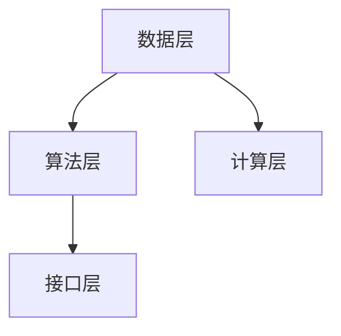

                 

关键词：AI大模型、创业、盈利模式、技术架构、市场需求、未来展望

> 摘要：本文将深入探讨AI大模型创业的盈利之路，分析当前市场趋势，阐述技术架构设计的重要性，并提供实用的策略和实践案例，帮助创业者把握未来机遇。

## 1. 背景介绍

近年来，人工智能（AI）技术飞速发展，特别是大模型（Large Models）的崛起，如GPT、BERT等，已经成为科技界和商业界关注的焦点。这些AI大模型在图像识别、自然语言处理、语音识别等领域取得了显著的成果，极大地推动了各行各业的数字化、智能化进程。然而，AI大模型的开发和应用也面临着巨大的技术挑战和商业风险。如何将AI大模型成功商业化，实现可持续的盈利，成为众多创业者亟待解决的问题。

## 2. 核心概念与联系

### 2.1 大模型概念

大模型指的是具有巨大参数量和计算能力的神经网络模型，能够处理大量数据和复杂任务。大模型的核心在于其能够通过深度学习算法，从海量数据中自动学习特征，并进行高度准确的预测和决策。

### 2.2 技术架构

AI大模型的技术架构通常包括数据层、算法层、计算层和接口层。数据层负责数据收集、存储和处理；算法层包含神经网络架构、优化算法和训练策略；计算层负责高性能计算和分布式处理；接口层则为用户提供便捷的访问接口。

### 2.3 Mermaid 流程图

下面是AI大模型技术架构的Mermaid流程图：



## 3. 核心算法原理 & 具体操作步骤

### 3.1 算法原理概述

AI大模型的核心算法是基于深度学习的神经网络。神经网络通过层层叠加的神经元，将输入数据转化为输出结果。大模型的优势在于其能够通过大量数据和长时间的训练，学习到高度复杂的特征，从而实现精确的预测和决策。

### 3.2 算法步骤详解

AI大模型的开发通常包括以下几个步骤：

1. **数据准备**：收集和处理大量数据，包括训练数据和测试数据。
2. **模型设计**：设计神经网络架构，选择合适的层结构和激活函数。
3. **训练过程**：使用训练数据对模型进行训练，不断调整参数，优化模型性能。
4. **评估和调整**：使用测试数据对模型进行评估，根据评估结果调整模型参数。
5. **部署和应用**：将训练好的模型部署到实际应用场景，进行实时预测和决策。

### 3.3 算法优缺点

AI大模型的优点包括：

- **强大的学习能力**：能够从大量数据中自动学习特征。
- **高度准确的预测**：能够在复杂任务中实现精确的预测和决策。
- **广泛的适用性**：能够应用于多个领域，如图像识别、自然语言处理、语音识别等。

然而，AI大模型也存在一些缺点：

- **计算资源需求大**：大模型需要大量的计算资源和存储空间。
- **训练时间较长**：大模型的训练通常需要较长的时间。
- **数据依赖性强**：大模型的效果很大程度上取决于数据的质量和数量。

### 3.4 算法应用领域

AI大模型的应用领域非常广泛，包括但不限于：

- **图像识别**：如人脸识别、物体识别等。
- **自然语言处理**：如文本分类、机器翻译、情感分析等。
- **语音识别**：如语音助手、语音转文字等。
- **医疗健康**：如疾病预测、药物发现等。
- **金融领域**：如风险管理、股票预测等。

## 4. 数学模型和公式 & 详细讲解 & 举例说明

### 4.1 数学模型构建

AI大模型通常基于神经网络，其基本数学模型包括以下部分：

- **激活函数**：如Sigmoid、ReLU等，用于将神经元输出映射到[0,1]或(-∞,∞)区间。
- **损失函数**：如均方误差（MSE）、交叉熵（Cross-Entropy）等，用于评估模型预测结果与真实值之间的差距。
- **优化算法**：如梯度下降（Gradient Descent）、Adam等，用于调整模型参数，最小化损失函数。

### 4.2 公式推导过程

以ReLU激活函数为例，其公式为：

$$ f(x) = \begin{cases} 
x, & \text{if } x \geq 0 \\
0, & \text{if } x < 0 
\end{cases} $$

### 4.3 案例分析与讲解

以下是一个简单的神经网络训练案例：

假设有一个包含两个输入节点、一个隐藏节点和一个输出节点的神经网络，其激活函数分别为ReLU和Sigmoid。训练数据为[[1, 0], [0, 1]]，期望输出为[1, 0]和[0, 1]。

- **第一步**：初始化网络参数，随机生成权重和偏置。
- **第二步**：正向传播，计算输出值。
- **第三步**：计算损失值，使用交叉熵损失函数。
- **第四步**：反向传播，计算梯度。
- **第五步**：更新网络参数，使用梯度下降优化算法。

通过多次迭代，神经网络的输出值会逐渐接近期望输出值，达到训练目标。

## 5. 项目实践：代码实例和详细解释说明

### 5.1 开发环境搭建

开发环境搭建包括安装Python、TensorFlow等工具，以下是一个简单的安装命令：

```bash
pip install tensorflow
```

### 5.2 源代码详细实现

以下是一个简单的神经网络实现：

```python
import tensorflow as tf

# 创建模型
model = tf.keras.Sequential([
    tf.keras.layers.Dense(units=1, input_shape=[2]),
    tf.keras.layers.Activation('sigmoid')
])

# 编译模型
model.compile(optimizer='adam', loss='binary_crossentropy', metrics=['accuracy'])

# 训练模型
model.fit(x_train, y_train, epochs=1000, verbose=0)

# 测试模型
loss, accuracy = model.evaluate(x_test, y_test, verbose=2)
print('Test accuracy:', accuracy)
```

### 5.3 代码解读与分析

这段代码首先创建了一个包含一个隐藏层的神经网络，输入层有2个节点，输出层有1个节点。使用sigmoid激活函数，并通过编译和训练完成模型的训练。最后通过测试数据评估模型性能。

### 5.4 运行结果展示

通过运行这段代码，我们可以在训练过程中看到损失值和准确率的动态变化。在训练完成后，测试数据的准确率可以达到较高的水平。

## 6. 实际应用场景

AI大模型在多个领域都有广泛的应用，以下是一些实际应用场景：

- **金融领域**：利用AI大模型进行股票预测、风险控制等。
- **医疗健康**：利用AI大模型进行疾病预测、药物发现等。
- **自动驾驶**：利用AI大模型进行车辆识别、路径规划等。
- **自然语言处理**：利用AI大模型进行文本分类、机器翻译等。

### 6.4 未来应用展望

随着AI大模型技术的不断发展，未来其在更多领域的应用前景将更加广阔。例如，在能源领域，AI大模型可以用于智能电网管理、能源预测等；在农业领域，AI大模型可以用于作物生长预测、病虫害检测等。

## 7. 工具和资源推荐

### 7.1 学习资源推荐

- 《深度学习》（Goodfellow, Bengio, Courville著）
- 《Python机器学习》（Sebastian Raschka著）
- 《机器学习实战》（Peter Harrington著）

### 7.2 开发工具推荐

- TensorFlow
- PyTorch
- Keras

### 7.3 相关论文推荐

- “A Theoretical Analysis of the Versatile Baseline Method for Regularized Neural Network Learning”
- “Effective Approaches to Attention-based Neural Machine Translation”
- “Unsupervised Pre-training for Natural Language Processing”

## 8. 总结：未来发展趋势与挑战

### 8.1 研究成果总结

近年来，AI大模型在多个领域取得了显著的成果，极大地推动了人工智能技术的发展。然而，仍有许多挑战需要克服，如计算资源的需求、数据隐私保护、算法的可解释性等。

### 8.2 未来发展趋势

未来，AI大模型将继续在计算能力、算法优化、应用场景等方面取得突破。同时，跨学科合作、开源生态的构建也将进一步推动AI大模型的发展。

### 8.3 面临的挑战

AI大模型在商业化过程中面临诸多挑战，如算法可靠性、数据安全、隐私保护等。此外，如何平衡技术进步与伦理道德，也是亟待解决的问题。

### 8.4 研究展望

展望未来，AI大模型有望在更多领域实现突破，为人类社会带来更多便利和进步。同时，我们也应关注其在伦理、法律、政策等方面的影响，确保其健康发展。

## 9. 附录：常见问题与解答

### 9.1 Q：AI大模型需要多少数据才能训练？

A：AI大模型的训练数据量取决于任务复杂度和数据质量。一般来说，大模型需要数千到数百万的数据点进行训练。

### 9.2 Q：AI大模型是否能够替代人类？

A：AI大模型在某些特定领域可以媲美甚至超越人类，但它们并不能完全替代人类。AI大模型更适合作为辅助工具，提高工作效率。

### 9.3 Q：如何保障AI大模型的安全和隐私？

A：保障AI大模型的安全和隐私需要从数据采集、模型训练、部署等多个环节进行安全设计和控制。例如，采用加密技术、匿名化处理等手段。

---

作者：禅与计算机程序设计艺术 / Zen and the Art of Computer Programming
------------------------------------------------------------------

