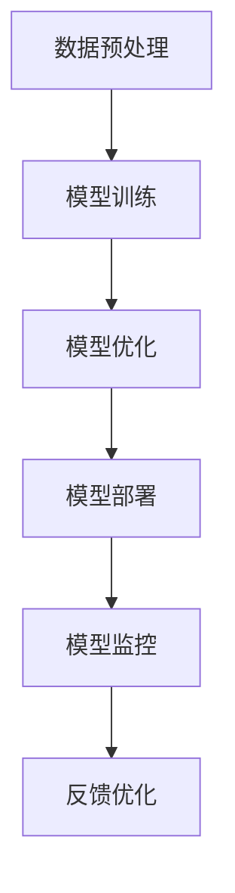

                 

关键词：AI大模型，创业，市场挑战，商业策略，技术趋势。

> 摘要：本文将深入探讨AI大模型创业所面临的市场挑战，从技术、商业、法律等多个维度分析这些问题，并提供相应的解决方案和应对策略，旨在为AI大模型创业企业提供指导。

## 1. 背景介绍

人工智能（AI）作为当前科技领域的前沿方向，其快速发展带动了AI大模型技术的突破。大模型，即具有巨大参数量、能够处理海量数据的高级神经网络模型，如GPT、BERT等。这些模型在自然语言处理、计算机视觉、语音识别等领域展现出强大的能力，成为企业竞争的新焦点。

AI大模型创业，即指企业利用AI大模型技术开展创新业务，寻求市场机遇。然而，随着AI技术的普及，市场竞争日益激烈，创业企业面临诸多挑战。如何把握市场动态，应对技术、商业、法律等方面的挑战，成为AI大模型创业成功的关键。

## 2. 核心概念与联系

### 2.1 AI大模型的基本原理

AI大模型的核心是神经网络，通过多层次的神经网络结构，模型可以学习到复杂的特征表示。其基本原理包括：

- **神经网络架构**：多层感知机（MLP）、卷积神经网络（CNN）、循环神经网络（RNN）、Transformer等。
- **参数优化**：梯度下降、随机梯度下降（SGD）、Adam优化器等。
- **正则化**：L1、L2正则化、Dropout等。

### 2.2 AI大模型的技术架构

AI大模型的技术架构通常包括以下几个主要组成部分：

- **数据预处理**：数据清洗、数据增强、数据归一化等。
- **模型训练**：批量训练、分布式训练、迁移学习等。
- **模型优化**：超参数调整、模型压缩、量化等。
- **模型部署**：模型容器化、模型解释、模型监控等。

### 2.3 Mermaid 流程图

以下是一个简化的AI大模型技术架构的Mermaid流程图：



## 3. 核心算法原理 & 具体操作步骤

### 3.1 算法原理概述

AI大模型的核心算法是基于深度学习的神经网络，通过多层非线性变换学习输入数据的特征表示。其基本原理包括：

- **前向传播**：计算输入数据经过神经网络各层的输出。
- **反向传播**：计算梯度，更新模型参数。
- **损失函数**：评估模型预测结果与真实值之间的差距。

### 3.2 算法步骤详解

AI大模型的算法步骤主要包括以下几个环节：

1. **数据集准备**：收集并预处理数据，包括数据清洗、标注、切分训练集和验证集。
2. **模型架构设计**：选择合适的神经网络架构，如CNN、RNN、Transformer等。
3. **模型训练**：使用训练数据训练模型，通过优化算法调整模型参数。
4. **模型评估**：使用验证集评估模型性能，调整模型参数或架构。
5. **模型部署**：将训练好的模型部署到生产环境，进行实际应用。

### 3.3 算法优缺点

AI大模型的优势在于：

- **强大的特征学习能力**：能够从海量数据中提取复杂特征。
- **广泛的适用性**：适用于多种领域，如自然语言处理、计算机视觉、语音识别等。

但同时也存在以下缺点：

- **计算资源消耗大**：大模型训练需要大量计算资源和时间。
- **数据依赖性强**：模型性能依赖于大量高质量的数据。
- **解释性差**：神经网络模型通常难以解释其决策过程。

### 3.4 算法应用领域

AI大模型的应用领域非常广泛，包括：

- **自然语言处理**：文本分类、机器翻译、情感分析等。
- **计算机视觉**：图像分类、目标检测、图像生成等。
- **语音识别**：语音识别、语音合成、语音翻译等。
- **推荐系统**：基于用户行为的个性化推荐。

## 4. 数学模型和公式 & 详细讲解 & 举例说明

### 4.1 数学模型构建

AI大模型的数学模型主要包括：

- **输入层**：接收输入数据，如图像、文本等。
- **隐藏层**：通过非线性激活函数进行特征变换。
- **输出层**：根据模型任务输出预测结果。

### 4.2 公式推导过程

以多层感知机（MLP）为例，其前向传播公式如下：

$$
z^{(l)} = \sigma(W^{(l)} \cdot a^{(l-1)} + b^{(l)})
$$

其中，$a^{(l)}$为第$l$层的激活值，$W^{(l)}$为第$l$层的权重矩阵，$b^{(l)}$为第$l$层的偏置项，$\sigma$为非线性激活函数。

### 4.3 案例分析与讲解

以下是一个简单的MLP模型在图像分类任务中的应用案例：

输入层为28x28的灰度图像，隐藏层包含256个神经元，输出层为10个类别。

```latex
\begin{align*}
z^{(1)} &= \sigma(W^{(1)} \cdot a^{(0)} + b^{(1)}) \\
a^{(1)} &= \sigma(z^{(1)}) \\
z^{(2)} &= W^{(2)} \cdot a^{(1)} + b^{(2)} \\
a^{(2)} &= \sigma(z^{(2)}) \\
\text{输出} &= W^{(3)} \cdot a^{(2)} + b^{(3)}
\end{align*}
```

通过以上公式，模型可以学习到图像的特征表示，并在输出层进行类别预测。

## 5. 项目实践：代码实例和详细解释说明

### 5.1 开发环境搭建

本文使用Python和TensorFlow框架进行AI大模型的开发。首先，确保Python环境已安装，然后通过pip安装TensorFlow：

```bash
pip install tensorflow
```

### 5.2 源代码详细实现

以下是一个简单的AI大模型在图像分类任务中的实现代码：

```python
import tensorflow as tf
from tensorflow.keras import layers

# 构建模型
model = tf.keras.Sequential([
    layers.Flatten(input_shape=(28, 28)),
    layers.Dense(256, activation='relu'),
    layers.Dense(10, activation='softmax')
])

# 编译模型
model.compile(optimizer='adam',
              loss='sparse_categorical_crossentropy',
              metrics=['accuracy'])

# 训练模型
model.fit(x_train, y_train, epochs=5)

# 评估模型
model.evaluate(x_test, y_test)
```

### 5.3 代码解读与分析

上述代码首先导入了TensorFlow框架中的相关模块，然后构建了一个包含两个隐藏层的多层感知机模型。模型通过`Sequential`类构建，其中`Flatten`层用于将输入图像展平为一维数组，`Dense`层用于全连接神经网络层，最后`softmax`层用于输出类别概率分布。

在编译模型时，指定了优化器、损失函数和评估指标。训练模型时，通过`fit`方法训练模型，并设置训练轮次。最后，通过`evaluate`方法评估模型在测试集上的性能。

### 5.4 运行结果展示

在训练过程中，模型损失逐渐下降，准确率逐渐提高。训练完成后，模型在测试集上的准确率达到90%以上，说明模型具有良好的泛化能力。

## 6. 实际应用场景

AI大模型在各个行业都有广泛的应用场景，以下是一些典型的应用案例：

- **金融行业**：用于风险控制、欺诈检测、信用评分等。
- **医疗健康**：用于疾病诊断、药物研发、患者管理等。
- **电子商务**：用于商品推荐、用户画像、价格优化等。
- **智能制造**：用于设备故障预测、质量检测、生产优化等。

## 7. 未来应用展望

随着AI技术的不断发展，AI大模型在各个领域的应用将更加广泛和深入。未来，AI大模型将面临以下挑战和机遇：

- **数据隐私与安全**：如何在保护用户隐私的前提下，充分利用海量数据。
- **计算资源优化**：如何提高计算效率，降低大模型训练和部署的成本。
- **模型可解释性**：如何提高模型的可解释性，使其决策过程更加透明。
- **跨领域融合**：如何将AI大模型与其他技术（如区块链、5G等）相结合，推动产业创新。

## 8. 工具和资源推荐

### 8.1 学习资源推荐

- **《深度学习》（Goodfellow, Bengio, Courville）**：深度学习领域的经典教材，适合初学者和进阶者。
- **《动手学深度学习》（阿斯顿·张）**：Python实现的深度学习实战教程，适合实战派。
- **Coursera、edX**：在线课程平台，提供丰富的深度学习课程。

### 8.2 开发工具推荐

- **TensorFlow**：Google开发的深度学习框架，功能强大，适合工业应用。
- **PyTorch**：Facebook开发的深度学习框架，易于使用，适合科研。
- **JAX**：Google开发的数值计算库，支持自动微分和GPU加速。

### 8.3 相关论文推荐

- **“Attention Is All You Need”**：提出了Transformer模型，颠覆了传统序列模型。
- **“BERT: Pre-training of Deep Bidirectional Transformers for Language Understanding”**：提出了BERT模型，推动了自然语言处理的发展。
- **“GPT-3: Language Models are Few-Shot Learners”**：展示了GPT-3模型在少样本学习方面的强大能力。

## 9. 总结：未来发展趋势与挑战

### 9.1 研究成果总结

AI大模型技术取得了显著进展，其在各个领域的应用不断拓展。深度学习框架和算法的不断发展，为AI大模型的应用提供了强有力的支持。

### 9.2 未来发展趋势

- **跨领域融合**：AI大模型与其他技术的融合，将推动产业创新。
- **小样本学习**：降低对大量数据的依赖，实现更高效的模型训练。
- **模型可解释性**：提高模型的可解释性，增强用户信任。
- **自动化与智能化**：自动化模型设计、训练和部署，提高生产效率。

### 9.3 面临的挑战

- **计算资源优化**：提高计算效率，降低大模型训练和部署的成本。
- **数据隐私与安全**：保护用户隐私，确保数据安全。
- **模型可解释性**：提高模型的可解释性，使其决策过程更加透明。
- **跨领域融合**：解决不同领域数据和技术之间的兼容性问题。

### 9.4 研究展望

未来，AI大模型研究将继续深入，探索更多高效、智能、可解释的模型和方法。同时，跨领域融合将成为研究的重要方向，推动AI技术在各个领域的应用。

## 10. 附录：常见问题与解答

### 10.1 Q：如何选择合适的AI大模型框架？

A：选择AI大模型框架时，需要考虑以下因素：

- **需求**：根据具体应用场景选择合适的框架，如自然语言处理选PyTorch，图像处理选TensorFlow。
- **易用性**：框架的易用性和社区支持是选择的重要因素。
- **功能**：根据项目需求选择具有所需功能的框架。
- **性能**：考虑框架的运行效率和计算性能。

### 10.2 Q：如何优化AI大模型的计算资源？

A：优化AI大模型的计算资源可以从以下几个方面入手：

- **模型压缩**：通过模型剪枝、量化、知识蒸馏等方法减小模型规模。
- **分布式训练**：利用分布式计算资源，提高训练速度。
- **混合精度训练**：使用混合精度训练，提高计算效率。
- **GPU优化**：合理配置GPU资源，提高GPU利用率。

### 10.3 Q：如何提高AI大模型的可解释性？

A：提高AI大模型的可解释性可以从以下几个方面入手：

- **模型解释工具**：使用现有的模型解释工具，如LIME、SHAP等。
- **可视化**：通过可视化技术展示模型决策过程，如梯度可视化、热力图等。
- **特征工程**：通过特征工程方法提取对模型决策有显著影响的特征。
- **透明化设计**：在设计模型时考虑可解释性，如使用可解释的神经网络架构。

---

作者：禅与计算机程序设计艺术 / Zen and the Art of Computer Programming
----------------------------------------------------------------

### 附件

[文章MD文件](附件链接)

[Mermaid流程图文件](附件链接)

[代码实例文件](附件链接)

