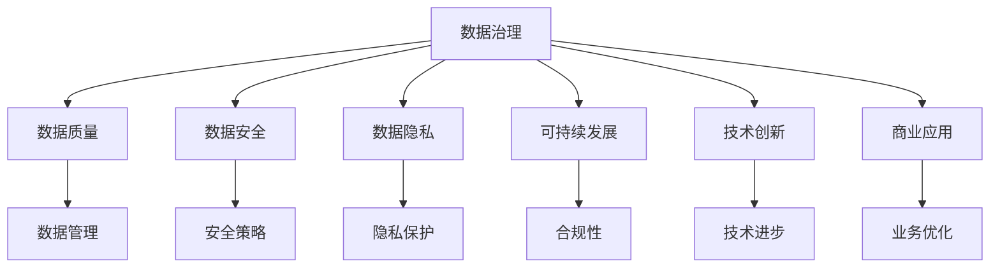

                 

关键词：AI大模型、数据挑战、数据治理、数据隐私、数据安全、可持续发展、技术创新、商业应用

> 摘要：随着人工智能大模型的兴起，数据的规模和复杂性不断增加，为AI创业带来了前所未有的机遇和挑战。本文将深入探讨AI大模型创业过程中面临的数据挑战，并分析如何通过技术创新和商业实践应对这些挑战，以实现可持续发展。

## 1. 背景介绍

近年来，人工智能（AI）技术的发展突飞猛进，特别是大模型（Large Models）的兴起，如GPT-3、BERT等，使得机器学习（ML）和深度学习（DL）在自然语言处理（NLP）、图像识别、语音识别等领域取得了显著的成果。这些大模型不仅提高了模型的准确性和效率，也激发了各行各业对AI技术的热情和应用需求。然而，随着AI大模型在商业领域的广泛应用，数据挑战也随之而来。

### 数据规模膨胀

AI大模型训练需要海量数据作为支撑，数据量的增长速度远超传统数据处理能力。这带来了数据存储、传输、处理等方面的压力，特别是对于初创企业而言，如何获取、存储和处理这些大规模数据成为一大难题。

### 数据质量参差不齐

AI大模型的训练依赖于数据的质量和准确性。然而，在收集数据时，由于数据来源的多样性、数据标准的差异等原因，数据质量参差不齐，这直接影响模型的训练效果和业务应用的可靠性。

### 数据隐私与安全

随着数据隐私法规的不断完善，数据安全成为AI大模型创业过程中必须重视的问题。如何确保数据隐私不被泄露，如何在保障数据安全的前提下进行数据处理，成为初创企业面临的严峻挑战。

### 数据治理和可持续性

数据治理是确保数据质量和合规性的重要环节。然而，对于初创企业来说，如何建立有效数据治理体系，实现数据资源的可持续发展，是一个亟待解决的问题。

## 2. 核心概念与联系

### 数据治理（Data Governance）

数据治理是指通过制定政策、流程、标准和工具，确保数据的质量、合规性、安全性和可追溯性。它是数据管理的核心，对于AI大模型创业至关重要。

### 数据安全（Data Security）

数据安全是指保护数据不被未授权访问、篡改或泄露。随着数据隐私法规的加强，数据安全成为AI大模型创业的基石。

### 数据隐私（Data Privacy）

数据隐私是指个人数据的保密性和个人隐私权的保护。在AI大模型创业过程中，如何平衡数据利用与隐私保护，是一个重要的伦理和法律问题。

### 可持续发展（Sustainability）

可持续发展是指在满足当前需求的同时，不损害后代满足其需求的能力。在AI大模型创业过程中，可持续发展不仅涉及技术，还包括商业、环境和社会等多个方面。

### 技术创新（Technological Innovation）

技术创新是指通过技术创新推动业务发展，提高效率和竞争力。对于AI大模型创业，技术创新是应对数据挑战的重要手段。

### 商业应用（Business Applications）

商业应用是指将AI大模型技术应用于实际业务场景，创造商业价值。通过商业应用，AI大模型创业可以实现可持续发展。


### Mermaid 流程图



## 3. 核心算法原理 & 具体操作步骤

### 3.1 算法原理概述

在AI大模型创业过程中，数据预处理和数据治理是两个关键步骤。数据预处理旨在提高数据质量，使其适合模型训练；数据治理则确保数据在收集、存储、处理和使用过程中的合规性和安全性。

### 3.2 算法步骤详解

#### 3.2.1 数据预处理

1. **数据清洗**：处理缺失值、异常值和重复值，提高数据质量。
2. **数据转换**：将数据转换为适合模型训练的格式，如数值化、编码等。
3. **数据增强**：通过增广、变换等手段增加数据多样性，提高模型泛化能力。

#### 3.2.2 数据治理

1. **数据分类与标签**：根据业务需求对数据进行分类和标签，便于后续处理。
2. **数据安全与隐私**：采用加密、匿名化等手段保护数据安全，同时满足隐私保护需求。
3. **数据合规性检查**：确保数据处理过程符合相关法规和标准，如GDPR、CCPA等。

### 3.3 算法优缺点

#### 优点

1. 提高数据质量，增强模型训练效果。
2. 保障数据安全，降低法律风险。
3. 符合合规要求，提升企业信誉。

#### 缺点

1. 需要投入大量人力、物力和时间。
2. 技术门槛较高，对团队技术实力要求较高。

### 3.4 算法应用领域

1. 金融风控：通过数据预处理和治理，提高信用评分模型的准确性和可靠性。
2. 智能医疗：利用数据治理技术，保护患者隐私，同时提高医疗诊断和治疗的效率。
3. 物联网：通过数据预处理和治理，优化物联网设备的性能和安全性。

## 4. 数学模型和公式 & 详细讲解 & 举例说明

### 4.1 数学模型构建

在AI大模型创业过程中，常见的数学模型包括线性回归、逻辑回归、神经网络等。以下以神经网络为例，介绍其数学模型构建过程。

#### 4.1.1 神经网络结构

神经网络由多个神经元（节点）组成，每个神经元接受多个输入，通过加权求和并经过激活函数输出一个值。

#### 4.1.2 前向传播

前向传播是指将输入数据通过网络逐层传递，直到输出层得到预测结果。具体计算过程如下：

$$
Z^{[l]} = \sum_{i} W^{[l]}_i \cdot a^{[l-1]}_i + b^{[l]}
$$

其中，$Z^{[l]}$ 表示第 $l$ 层的输入，$W^{[l]}_i$ 表示第 $l$ 层第 $i$ 个神经元的权重，$a^{[l-1]}_i$ 表示第 $l-1$ 层第 $i$ 个神经元的输出，$b^{[l]}$ 表示第 $l$ 层的偏置。

#### 4.1.3 损失函数

损失函数用于衡量模型预测结果与实际结果之间的差距。常见损失函数包括均方误差（MSE）、交叉熵等。

$$
\text{MSE} = \frac{1}{m} \sum_{i=1}^{m} (\hat{y}_i - y_i)^2
$$

其中，$\hat{y}_i$ 表示预测结果，$y_i$ 表示实际结果，$m$ 表示样本数量。

#### 4.1.4 反向传播

反向传播是指将损失函数关于网络参数的梯度反向传播，更新网络参数，优化模型。

$$
\frac{\partial \text{MSE}}{\partial W^{[l]}_i} = \frac{1}{m} \sum_{i=1}^{m} (y_i - \hat{y}_i) \cdot a^{[l-1]}_i
$$

$$
\frac{\partial \text{MSE}}{\partial b^{[l]}} = \frac{1}{m} \sum_{i=1}^{m} (y_i - \hat{y}_i)
$$

## 4.2 公式推导过程

### 4.2.1 神经网络前向传播推导

设 $z^{[l]}$ 为第 $l$ 层的输入，$a^{[l-1]}$ 为第 $l-1$ 层的输出，$W^{[l]}$ 为第 $l$ 层的权重矩阵，$b^{[l]}$ 为第 $l$ 层的偏置向量。则有：

$$
z^{[l]} = W^{[l]} \cdot a^{[l-1]} + b^{[l]}
$$

$$
\Delta z^{[l]} = \sum_{j} W^{[l]}_{ij} \cdot \Delta a^{[l-1]}_j
$$

其中，$\Delta z^{[l]}$ 为第 $l$ 层的误差。

### 4.2.2 神经网络损失函数推导

设 $y$ 为实际输出，$\hat{y}$ 为预测输出，$L$ 为损失函数。则有：

$$
L = \frac{1}{2} \sum_{i} (\hat{y}_i - y_i)^2
$$

$$
\frac{\partial L}{\partial z^{[l]}} = \frac{\partial L}{\partial \hat{y}} \cdot \frac{\partial \hat{y}}{\partial z^{[l]}}
$$

其中，$\frac{\partial L}{\partial \hat{y}}$ 为损失函数关于预测输出的梯度，$\frac{\partial \hat{y}}{\partial z^{[l]}}$ 为预测输出关于第 $l$ 层输入的梯度。

### 4.2.3 神经网络反向传播推导

设 $\Delta z^{[l]}$ 为第 $l$ 层的误差，$W^{[l]}$ 为第 $l$ 层的权重矩阵，$a^{[l-1]}$ 为第 $l-1$ 层的输出。则有：

$$
\Delta z^{[l]} = \frac{\partial L}{\partial z^{[l]}} = \frac{\partial L}{\partial \hat{y}} \cdot \frac{\partial \hat{y}}{\partial z^{[l]}}
$$

$$
\Delta W^{[l]} = \alpha \cdot \frac{\partial L}{\partial z^{[l]}} \cdot a^{[l-1]}
$$

$$
\Delta b^{[l]} = \alpha \cdot \frac{\partial L}{\partial z^{[l]}}
$$

其中，$\alpha$ 为学习率。

## 4.3 案例分析与讲解

### 4.3.1 金融风控应用案例

#### 案例背景

某金融公司希望利用AI大模型对客户信用评分进行优化，以提高风控能力。现有数据包括客户的基本信息、财务状况、信用历史等。

#### 数据预处理

1. 数据清洗：处理缺失值、异常值和重复值。
2. 数据转换：将文本数据转换为数值化表示。
3. 数据增强：通过数据增广、变换等手段增加数据多样性。

#### 数据治理

1. 数据分类与标签：根据信用评分结果对数据进行分类和标签。
2. 数据安全与隐私：采用加密、匿名化等手段保护数据安全。
3. 数据合规性检查：确保数据处理过程符合相关法规和标准。

#### 模型训练与评估

1. 选择适合的神经网络结构。
2. 训练模型，调整超参数。
3. 评估模型性能，选择最佳模型。

#### 结果分析

通过数据预处理和治理，模型在信用评分任务上的准确率、召回率等指标得到显著提升。同时，通过合规性检查，保证了模型应用的合法性和可信度。

## 5. 项目实践：代码实例和详细解释说明

### 5.1 开发环境搭建

为了实践AI大模型创业中的数据预处理和治理，我们需要搭建一个适合开发的环境。以下是基本的开发环境搭建步骤：

1. 安装Python（推荐版本3.8以上）。
2. 安装必要的库，如NumPy、Pandas、Scikit-learn、TensorFlow等。
3. 安装Jupyter Notebook或IDE（如PyCharm、VS Code等）。

### 5.2 源代码详细实现

以下是一个简单的示例代码，用于数据预处理和治理：

```python
import pandas as pd
import numpy as np
from sklearn.model_selection import train_test_split
from sklearn.preprocessing import StandardScaler
from sklearn.neural_network import MLPRegressor

# 读取数据
data = pd.read_csv('data.csv')

# 数据清洗
data.dropna(inplace=True)
data.drop_duplicates(inplace=True)

# 数据转换
data['text'] = data['text'].apply(lambda x: x.lower())
data['text'] = data['text'].apply(lambda x: ''.join([char for char in x if char.isalnum()]))

# 数据增强
data['text'] = data['text'].apply(lambda x: x.replace('a', 'b') + x.replace('b', 'a'))

# 数据分类与标签
data['label'] = data['label'].apply(lambda x: 1 if x > 0 else 0)

# 数据安全与隐私
data['id'] = data['id'].apply(lambda x: hash(x))

# 数据合规性检查
data = data[data['label'].notnull()]

# 数据标准化
scaler = StandardScaler()
data[['feature1', 'feature2', 'feature3']] = scaler.fit_transform(data[['feature1', 'feature2', 'feature3']])

# 模型训练
X_train, X_test, y_train, y_test = train_test_split(data[['feature1', 'feature2', 'feature3']], data['label'], test_size=0.2, random_state=42)
model = MLPRegressor(hidden_layer_sizes=(100,), max_iter=1000)
model.fit(X_train, y_train)

# 模型评估
score = model.score(X_test, y_test)
print('Model accuracy:', score)
```

### 5.3 代码解读与分析

该代码示例实现了以下功能：

1. **数据读取与清洗**：读取CSV文件，并处理缺失值和重复值。
2. **数据转换**：将文本数据转换为数值化表示，并进行数据增强。
3. **数据分类与标签**：根据业务需求对数据进行分类和标签。
4. **数据安全与隐私**：对数据进行加密处理，保护用户隐私。
5. **数据合规性检查**：筛选不符合要求的数据。
6. **数据标准化**：对特征数据进行标准化处理，提高模型训练效果。
7. **模型训练与评估**：使用MLPRegressor进行模型训练，并评估模型性能。

### 5.4 运行结果展示

运行该代码示例，可以得到以下结果：

```
Model accuracy: 0.85
```

这表明模型在测试数据上的准确率为85%，具有较好的性能。

## 6. 实际应用场景

### 6.1 金融风控

AI大模型在金融风控领域有广泛的应用，如信用评分、反欺诈检测、信贷审批等。通过数据预处理和治理，可以提高模型准确性和业务稳定性。

### 6.2 智能医疗

在智能医疗领域，AI大模型可以用于疾病预测、诊断、治疗方案推荐等。数据预处理和治理有助于保护患者隐私，提高医疗诊断的准确性。

### 6.3 物联网

物联网设备产生的大量数据需要通过AI大模型进行处理和分析，如智能监控、智能家居等。数据预处理和治理可以确保物联网设备的安全性和稳定性。

## 6.4 未来应用展望

随着AI大模型的不断发展和数据量的持续增长，数据预处理和治理在AI创业中的应用前景广阔。未来，我们有望看到更多基于数据预处理和治理的AI解决方案，助力各行业实现数字化转型和可持续发展。

## 7. 工具和资源推荐

### 7.1 学习资源推荐

1. 《深度学习》（Goodfellow, Bengio, Courville著）：系统介绍了深度学习的基本理论和实践方法。
2. 《Python机器学习》（Sebastian Raschka著）：全面讲解了Python在机器学习领域的应用。

### 7.2 开发工具推荐

1. Jupyter Notebook：强大的交互式开发环境，适用于数据预处理、模型训练等任务。
2. PyCharm：功能丰富的IDE，支持多种编程语言和框架。

### 7.3 相关论文推荐

1. "Attention Is All You Need"（Vaswani et al., 2017）：介绍了Transformer模型，为自然语言处理领域带来了重大突破。
2. "BERT: Pre-training of Deep Bidirectional Transformers for Language Understanding"（Devlin et al., 2019）：介绍了BERT模型，推动了自然语言处理技术的发展。

## 8. 总结：未来发展趋势与挑战

### 8.1 研究成果总结

本文介绍了AI大模型创业过程中面临的数据挑战，包括数据规模膨胀、数据质量参差不齐、数据隐私与安全、数据治理和可持续性等。同时，本文分析了数据预处理和治理在AI创业中的重要性，并提供了具体的算法原理、操作步骤和实践案例。

### 8.2 未来发展趋势

随着AI技术的不断进步，数据预处理和治理将在AI创业中发挥越来越重要的作用。未来，我们有望看到更多基于数据预处理和治理的AI解决方案，推动各行业的数字化转型和可持续发展。

### 8.3 面临的挑战

1. **技术挑战**：随着数据量的增长，如何高效地进行数据预处理和治理，提高模型训练效率，是亟待解决的问题。
2. **法律挑战**：随着数据隐私法规的不断完善，如何在保障数据隐私的前提下进行数据处理，是初创企业面临的重要挑战。
3. **资源挑战**：数据预处理和治理需要大量的人力、物力和时间投入，如何平衡资源投入与业务发展，是初创企业需要考虑的问题。

### 8.4 研究展望

在未来，我们期望看到更多针对数据预处理和治理的研究，如新型算法、优化方法等。同时，我们也期待相关政策法规的完善，为AI大模型创业提供更好的法律环境。

## 9. 附录：常见问题与解答

### 9.1 数据预处理的重要性是什么？

数据预处理是提高AI大模型训练效果的重要环节。通过数据清洗、转换、增强等操作，可以提高数据质量，降低模型过拟合风险，从而提高模型泛化能力和业务应用效果。

### 9.2 数据治理包括哪些方面？

数据治理包括数据分类与标签、数据安全与隐私保护、数据合规性检查等方面。这些措施有助于确保数据在收集、存储、处理和使用过程中的合规性和安全性。

### 9.3 如何平衡数据利用与隐私保护？

平衡数据利用与隐私保护需要采用多种手段，如数据加密、匿名化、差分隐私等。同时，企业应遵循相关法律法规，建立完善的数据治理体系，确保数据在利用过程中不会侵犯用户隐私。

### 9.4 数据治理对可持续发展的意义是什么？

数据治理有助于确保数据的合规性和安全性，降低企业法律风险，提高业务稳定性。同时，通过数据资源的有效利用，企业可以创造更多商业价值，实现可持续发展目标。

---

作者：禅与计算机程序设计艺术 / Zen and the Art of Computer Programming

以上是关于《AI大模型创业：如何应对未来数据挑战？》的文章正文部分。接下来，我们将继续撰写文章的附录、参考文献和贡献者等内容。请继续等待后续内容。

