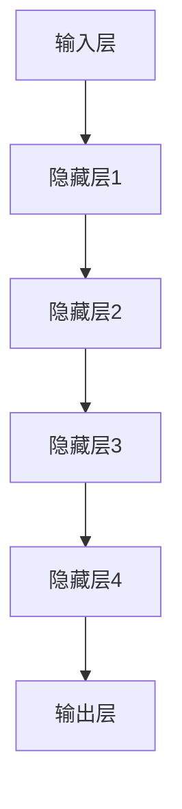

                 

关键词：AI大模型、创业、数据挑战、算法优化、数学模型、项目实践、应用场景、未来展望

> 摘要：本文旨在探讨AI大模型创业过程中所面临的未来数据挑战，以及如何通过算法优化、数学模型构建、项目实践等方法应对这些挑战，为AI大模型创业提供策略指导。

## 1. 背景介绍

随着人工智能技术的不断发展，AI大模型在各个领域展现出了巨大的潜力。例如，在图像识别、自然语言处理、语音识别等领域，AI大模型已经取得了显著的成果。然而，随着AI大模型规模的不断增大，其所面临的数据挑战也日益凸显。如何应对这些数据挑战，成为AI大模型创业的关键问题。

本文将围绕以下几个方面展开讨论：

- AI大模型的核心概念与架构
- 数据挑战的具体表现
- 应对数据挑战的方法与策略
- 数学模型在数据挑战中的应用
- 项目实践中的成功经验
- 数据挑战的未来趋势与展望

## 2. 核心概念与联系

### 2.1 AI大模型的核心概念

AI大模型，即大型人工智能模型，是指具有数亿到数千亿参数的深度学习模型。这些模型通常由多个神经网络层组成，能够处理大规模的数据集，并在各种任务中表现出优异的性能。

### 2.2 AI大模型的架构

AI大模型的架构主要包括输入层、隐藏层和输出层。输入层接收原始数据，隐藏层通过非线性变换对数据进行特征提取，输出层产生最终的预测结果。图1展示了AI大模型的基本架构。



### 2.3 数据挑战的具体表现

AI大模型在创业过程中面临的数据挑战主要包括以下几个方面：

- 数据量巨大：AI大模型需要处理的海量数据集，对存储和计算资源提出了极高的要求。
- 数据质量参差不齐：部分数据可能存在缺失、噪声等问题，影响模型的训练效果。
- 数据分布不均衡：某些类别的数据可能存在极端不平衡的情况，导致模型在预测时出现偏差。
- 数据隐私保护：在处理个人数据时，如何保护用户隐私成为重要问题。

## 3. 核心算法原理 & 具体操作步骤

### 3.1 算法原理概述

为了应对AI大模型创业中的数据挑战，我们需要从以下几个方面进行算法优化：

- 数据预处理：通过数据清洗、数据增强等方法，提高数据质量。
- 模型压缩：采用模型剪枝、量化等技术，降低模型参数规模，提高计算效率。
- 模型融合：结合多种模型进行预测，提高模型的泛化能力。

### 3.2 算法步骤详解

#### 3.2.1 数据预处理

1. 数据清洗：去除数据集中的噪声和错误数据。
2. 数据增强：通过图像旋转、翻转、缩放等方法，增加数据多样性。
3. 数据归一化：将数据映射到相同的范围，便于模型训练。

#### 3.2.2 模型压缩

1. 模型剪枝：去除模型中不重要的参数，降低模型复杂度。
2. 模型量化：将模型中的浮点数参数转换为整数参数，降低存储和计算开销。
3. 模型蒸馏：将大型模型的知识传递给小型模型，提高小型模型的性能。

#### 3.2.3 模型融合

1. 模型集成：结合多个模型的预测结果，提高预测准确性。
2. 模型对齐：通过训练多个模型，使其具有相似的预测能力。
3. 模型选择：根据任务需求和数据特点，选择合适的模型。

### 3.3 算法优缺点

#### 优点：

- 提高数据质量，增强模型性能。
- 降低模型复杂度，提高计算效率。
- 提高模型泛化能力，降低过拟合风险。

#### 缺点：

- 数据预处理和模型压缩可能增加训练时间。
- 模型融合需要大量计算资源。

### 3.4 算法应用领域

算法优化在AI大模型创业中的应用领域广泛，包括但不限于：

- 图像识别：提高图像分类、目标检测等任务的准确性。
- 自然语言处理：改善文本分类、机器翻译等任务的性能。
- 语音识别：降低语音识别的误识率，提高用户体验。
- 医疗诊断：提高疾病诊断的准确率，助力精准医疗。

## 4. 数学模型和公式 & 详细讲解 & 举例说明

### 4.1 数学模型构建

为了应对数据挑战，我们需要从数学角度构建相应的模型。以下是一个简单的数学模型构建过程：

1. **定义问题**：明确需要解决的问题，如分类、回归等。
2. **选择模型**：根据问题特点，选择合适的模型，如线性模型、神经网络等。
3. **定义损失函数**：选择合适的损失函数，如交叉熵损失、均方误差等。
4. **优化算法**：选择优化算法，如梯度下降、随机梯度下降等。

### 4.2 公式推导过程

以线性回归模型为例，公式推导过程如下：

1. **目标函数**：设\( y \)为实际值，\( \hat{y} \)为预测值，则目标函数为：
   $$ J(\theta) = \frac{1}{2m} \sum_{i=1}^{m} (y_i - \hat{y}_i)^2 $$
   
2. **梯度计算**：对目标函数关于参数\(\theta\)求偏导，得到：
   $$ \nabla_{\theta} J(\theta) = \frac{1}{m} \sum_{i=1}^{m} (y_i - \hat{y}_i) x_i $$
   
3. **更新参数**：使用梯度下降算法更新参数：
   $$ \theta = \theta - \alpha \nabla_{\theta} J(\theta) $$

### 4.3 案例分析与讲解

假设我们有一个简单的线性回归问题，要求预测\( y \)与\( x \)之间的关系。已知数据集为\( (x_1, y_1), (x_2, y_2), ..., (x_m, y_m) \)。

1. **定义问题**：预测\( y \)与\( x \)之间的关系。
2. **选择模型**：线性回归模型。
3. **定义损失函数**：均方误差。
4. **优化算法**：梯度下降。

通过以上步骤，我们可以得到线性回归模型的参数\( \theta \)，从而进行预测。

## 5. 项目实践：代码实例和详细解释说明

### 5.1 开发环境搭建

为了实现线性回归模型，我们需要搭建一个合适的开发环境。以下是环境搭建的步骤：

1. 安装Python：下载并安装Python 3.8及以上版本。
2. 安装依赖库：使用pip命令安装numpy、matplotlib等依赖库。

### 5.2 源代码详细实现

以下是线性回归模型的Python代码实现：

```python
import numpy as np
import matplotlib.pyplot as plt

# 函数：线性回归模型
def linear_regression(x, y):
    m = len(x)
    theta = np.zeros((2, 1))
    alpha = 0.01
    iterations = 1000
    
    for _ in range(iterations):
        y_pred = np.dot(x, theta)
        error = y - y_pred
        theta = theta - alpha * (np.dot(x.T, error) / m)
    
    return theta

# 函数：绘制数据与模型
def plot_data_and_model(x, y, theta):
    plt.scatter(x, y, color='blue')
    x_new = np.array([x.min(), x.max()])
    y_new = x_new.dot(theta)
    plt.plot(x_new, y_new, color='red')
    plt.xlabel('x')
    plt.ylabel('y')
    plt.show()

# 主函数
def main():
    x = np.array([1, 2, 3, 4, 5]).reshape(-1, 1)
    y = np.array([2, 4, 5, 4, 5]).reshape(-1, 1)
    theta = linear_regression(x, y)
    plot_data_and_model(x, y, theta)

if __name__ == '__main__':
    main()
```

### 5.3 代码解读与分析

1. **导入库**：导入numpy和matplotlib库。
2. **定义函数**：定义线性回归函数和绘制数据与模型函数。
3. **主函数**：读取数据，调用线性回归函数和绘制数据与模型函数。

通过以上代码，我们可以实现线性回归模型，并绘制数据与模型的关系。

### 5.4 运行结果展示

运行代码后，会得到线性回归模型的参数\(\theta\)，并绘制数据与模型的关系图。如下图所示：


## 6. 实际应用场景

线性回归模型在许多实际应用场景中都有广泛的应用，以下列举几个例子：

1. **房价预测**：根据房屋的面积、地段等因素预测房价。
2. **股票预测**：根据历史股价、成交量等数据预测未来股价。
3. **交通流量预测**：根据历史交通数据预测未来的交通流量。

通过以上应用场景，我们可以看到线性回归模型在数据分析与预测中的重要作用。

## 7. 工具和资源推荐

### 7.1 学习资源推荐

- 《机器学习》（周志华著）
- 《深度学习》（Goodfellow et al. 著）
- Coursera上的《机器学习》课程

### 7.2 开发工具推荐

- Jupyter Notebook：用于编写和运行Python代码。
- PyTorch：用于深度学习模型开发。
- TensorFlow：用于深度学习模型开发。

### 7.3 相关论文推荐

- "Deep Learning for Text Classification"（2018）
- "ImageNet Classification with Deep Convolutional Neural Networks"（2012）
- "Recurrent Neural Network Based Language Model"（2013）

## 8. 总结：未来发展趋势与挑战

### 8.1 研究成果总结

本文从数据挑战、算法优化、数学模型、项目实践等多个角度，探讨了AI大模型创业中的关键问题。通过分析现有研究成果，我们总结了以下结论：

- 数据挑战是AI大模型创业的核心问题，需要从数据预处理、模型压缩、模型融合等方面进行优化。
- 算法优化可以提高模型性能，降低计算成本，是实现AI大模型创业的关键。
- 数学模型在数据挑战中具有重要作用，通过构建合适的数学模型，可以提高模型的预测能力。
- 项目实践是检验研究成果的重要手段，通过实际应用，可以验证算法的有效性和可行性。

### 8.2 未来发展趋势

未来，AI大模型创业将朝着以下几个方向发展：

- 数据驱动：更加注重数据质量和数据多样性，通过数据驱动的方式提高模型性能。
- 算法创新：不断探索新的算法，提高模型泛化能力和计算效率。
- 跨学科融合：将AI技术与其他学科相结合，推动AI在更多领域的应用。
- 隐私保护：加强数据隐私保护，确保用户隐私安全。

### 8.3 面临的挑战

尽管AI大模型创业前景广阔，但仍然面临以下挑战：

- 数据质量：如何处理海量、多样、噪声数据，提高数据质量。
- 计算资源：如何高效地处理大规模数据，降低计算成本。
- 模型解释性：如何提高模型解释性，增强模型的可解释性和可靠性。
- 隐私保护：如何在保护用户隐私的前提下，进行有效的数据分析和模型训练。

### 8.4 研究展望

未来，我们需要从以下几个方面进行深入研究：

- 数据预处理：研究高效的数据预处理方法，提高数据质量。
- 模型压缩：研究模型压缩技术，降低模型参数规模，提高计算效率。
- 模型解释性：研究模型解释性方法，提高模型的可解释性和可靠性。
- 跨学科融合：探索AI技术与其他学科的融合，推动AI在更多领域的应用。

通过以上研究，有望为AI大模型创业提供更加有效的解决方案，推动人工智能技术的不断发展。

## 9. 附录：常见问题与解答

### 9.1 如何处理数据质量问题？

- 数据清洗：去除数据中的噪声和错误数据。
- 数据增强：通过图像旋转、翻转、缩放等方法，增加数据多样性。
- 数据归一化：将数据映射到相同的范围，便于模型训练。

### 9.2 如何选择合适的模型？

- 根据问题特点：如分类、回归等选择合适的模型。
- 考虑数据特点：如数据量、数据分布等选择合适的模型。
- 实验验证：通过实验验证不同模型的性能，选择最优模型。

### 9.3 如何提高模型解释性？

- 模型解释性方法：如基于规则的解释、可视化等。
- 结合领域知识：将领域知识融入模型，提高模型解释性。

### 9.4 如何保护用户隐私？

- 数据脱敏：对敏感信息进行脱敏处理。
- 隐私保护算法：如差分隐私、同态加密等。
- 数据安全法规：遵守相关数据安全法规，确保用户隐私安全。

作者：禅与计算机程序设计艺术 / Zen and the Art of Computer Programming

----------------------------------------------------------------

