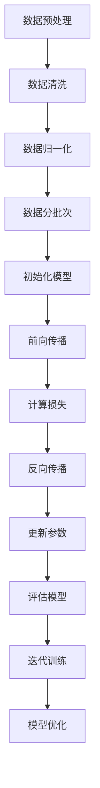

                 

 > **关键词：** AI大模型，创业，用户需求，技术趋势，未来展望

> **摘要：** 本文将探讨AI大模型创业领域面临的机遇与挑战，分析未来用户需求的变化趋势，并提出相应的解决方案和策略。通过对核心算法原理、数学模型、项目实践以及未来应用场景的深入解析，为AI大模型创业者提供实用的指导和建议。

## 1. 背景介绍

人工智能（AI）技术作为当今科技领域的热门话题，已经成为推动社会进步的重要力量。特别是近年来，AI大模型（如GPT-3、BERT等）的突破性发展，使得AI在自然语言处理、计算机视觉、语音识别等领域的表现达到了前所未有的水平。这一技术进步为创业者带来了前所未有的机遇，也带来了巨大的挑战。

### AI大模型的发展历程

AI大模型的发展经历了多个阶段。从最初的统计模型、决策树、支持向量机等传统机器学习方法，到基于深度学习的卷积神经网络（CNN）和递归神经网络（RNN），再到如今的全连接Transformer模型，AI大模型的技术演进不断突破性能瓶颈，取得了显著的进展。

### AI大模型的应用领域

AI大模型在多个领域都取得了重要的应用成果。例如，在自然语言处理领域，GPT-3等模型展示了强大的文本生成和翻译能力；在计算机视觉领域，GANs等模型实现了超现实的图像生成和修复；在语音识别领域，深度学习模型大幅提升了语音识别的准确率和实时性。

### 创业者在AI大模型领域的机遇

随着AI大模型的不断成熟，创业者在多个领域发现了新的机会。例如，利用AI大模型提供智能客服、智能推荐、智能翻译等服务，或开发基于AI大模型的创新产品，如智能音箱、智能机器人等。这些应用场景不仅满足了用户对智能化的需求，也为创业者创造了巨大的商业价值。

### 创业者在AI大模型领域的挑战

然而，AI大模型的创业之路并非一帆风顺。首先，技术门槛较高，创业者需要具备深厚的计算机科学背景和丰富的实践经验。其次，数据安全和隐私问题日益凸显，创业者需要在保证用户隐私的前提下，合理利用数据。最后，市场竞争激烈，创业者需要不断创新，以保持竞争优势。

## 2. 核心概念与联系

### 2.1 AI大模型的基本概念

AI大模型是指通过深度学习算法训练的，参数规模达到百万甚至亿级的大规模神经网络模型。这些模型在训练过程中通过学习海量数据，能够自动提取特征并实现复杂的数据处理任务。

### 2.2 AI大模型的关键技术

AI大模型的关键技术包括：

- **深度学习算法**：如卷积神经网络（CNN）、递归神经网络（RNN）、Transformer等。
- **大规模数据处理**：如分布式训练、数据并行化等。
- **优化算法**：如Adam、RMSProp等。
- **模型压缩与加速**：如模型剪枝、量化、知识蒸馏等。

### 2.3 AI大模型的架构

AI大模型的架构通常包括以下几个层次：

- **输入层**：接收外部数据，如文本、图像、语音等。
- **隐藏层**：进行特征提取和转换。
- **输出层**：生成预测结果或输出决策。

### 2.4 Mermaid流程图

下面是一个AI大模型训练过程的Mermaid流程图：



## 3. 核心算法原理 & 具体操作步骤

### 3.1 算法原理概述

AI大模型的核心算法是基于深度学习的。深度学习算法通过多层神经网络结构，对数据进行特征提取和转换，从而实现复杂的数据处理任务。其基本原理包括：

- **前向传播**：输入数据经过神经网络，通过每一层的非线性变换，最终生成输出结果。
- **反向传播**：计算输出结果与真实值之间的误差，并通过反向传播算法，更新网络参数。
- **优化算法**：通过调整参数，使网络输出结果更接近真实值。

### 3.2 算法步骤详解

以下是AI大模型训练的详细步骤：

1. **数据预处理**：对原始数据进行清洗、归一化等处理，使其适合模型训练。
2. **模型初始化**：初始化网络参数，通常采用随机初始化或预训练模型。
3. **前向传播**：输入数据经过神经网络，生成输出结果。
4. **计算损失**：计算输出结果与真实值之间的误差，通常采用均方误差（MSE）等损失函数。
5. **反向传播**：根据误差，调整网络参数，以减小损失。
6. **更新参数**：根据优化算法，更新网络参数。
7. **模型评估**：使用验证集或测试集评估模型性能，根据评估结果调整模型参数。
8. **迭代训练**：重复上述步骤，直到模型性能达到预期。

### 3.3 算法优缺点

**优点：**

- **强大的数据处理能力**：AI大模型能够自动提取特征，处理复杂数据。
- **高准确性**：通过大规模训练，模型能够达到很高的预测准确率。
- **泛化能力**：AI大模型具有较好的泛化能力，能够在新的数据集上表现良好。

**缺点：**

- **计算资源消耗大**：训练AI大模型需要大量的计算资源，对硬件要求较高。
- **数据需求量大**：AI大模型需要大量数据来训练，数据收集和处理成本较高。
- **解释性差**：AI大模型通常缺乏解释性，难以理解其决策过程。

### 3.4 算法应用领域

AI大模型在多个领域都有广泛的应用，包括：

- **自然语言处理**：如文本分类、机器翻译、问答系统等。
- **计算机视觉**：如图像分类、目标检测、图像生成等。
- **语音识别**：如语音合成、语音识别、语音翻译等。
- **推荐系统**：如商品推荐、音乐推荐、电影推荐等。

## 4. 数学模型和公式 & 详细讲解 & 举例说明

### 4.1 数学模型构建

AI大模型的核心在于其数学模型。一个典型的深度学习模型可以表示为：

\[ f(x) = \sigma(W_n \cdot a_{n-1} + b_n) \]

其中，\( x \) 是输入数据，\( a_n \) 是每一层的激活值，\( W_n \) 和 \( b_n \) 是每一层的权重和偏置，\( \sigma \) 是激活函数。

### 4.2 公式推导过程

以一个简单的全连接神经网络为例，其前向传播过程可以表示为：

\[ z_l = \sum_{k} W_{lk} a_{l-1} + b_l \]
\[ a_l = \sigma(z_l) \]

其中，\( z_l \) 是第 \( l \) 层的线性变换结果，\( a_l \) 是第 \( l \) 层的激活值，\( W_{lk} \) 和 \( b_l \) 分别是第 \( l \) 层的权重和偏置。

### 4.3 案例分析与讲解

假设我们有一个简单的二元分类问题，输入数据为 \( x = (1, 2, 3, 4) \)，目标输出为 \( y = 0 \)。我们可以构建一个全连接神经网络，包含一个输入层、一个隐藏层和一个输出层。

输入层：

\[ x = (1, 2, 3, 4) \]

隐藏层：

\[ z_1 = \sum_{k} W_{1k} x_k + b_1 \]
\[ a_1 = \sigma(z_1) \]

输出层：

\[ z_2 = \sum_{k} W_{2k} a_1 + b_2 \]
\[ y = \sigma(z_2) \]

假设我们选择 \( \sigma \) 函数为 \( \sigma(x) = \frac{1}{1 + e^{-x}} \)，则：

隐藏层：

\[ z_1 = (W_{11} \cdot 1 + W_{12} \cdot 2 + W_{13} \cdot 3 + W_{14} \cdot 4 + b_1) \]
\[ a_1 = \sigma(z_1) \]

输出层：

\[ z_2 = (W_{21} \cdot a_1 + W_{22} \cdot a_1 + W_{23} \cdot a_1 + W_{24} \cdot a_1 + b_2) \]
\[ y = \sigma(z_2) \]

通过调整权重 \( W_{lk} \) 和偏置 \( b_l \)，我们可以使输出 \( y \) 尽可能接近目标输出 \( y = 0 \)。

## 5. 项目实践：代码实例和详细解释说明

### 5.1 开发环境搭建

为了实现AI大模型，我们需要搭建一个合适的开发环境。以下是搭建环境的基本步骤：

1. 安装Python：在官方网站下载并安装Python。
2. 安装深度学习框架：例如，安装TensorFlow或PyTorch。
3. 安装其他依赖库：如NumPy、Pandas等。

### 5.2 源代码详细实现

以下是实现一个简单的AI大模型的Python代码：

```python
import numpy as np
import tensorflow as tf

# 定义模型结构
model = tf.keras.Sequential([
    tf.keras.layers.Dense(64, activation='relu', input_shape=(784,)),
    tf.keras.layers.Dense(64, activation='relu'),
    tf.keras.layers.Dense(10, activation='softmax')
])

# 编译模型
model.compile(optimizer='adam',
              loss='categorical_crossentropy',
              metrics=['accuracy'])

# 加载数据
(x_train, y_train), (x_test, y_test) = tf.keras.datasets.mnist.load_data()

# 数据预处理
x_train = x_train.astype(np.float32) / 255
x_test = x_test.astype(np.float32) / 255
y_train = tf.keras.utils.to_categorical(y_train, 10)
y_test = tf.keras.utils.to_categorical(y_test, 10)

# 训练模型
model.fit(x_train, y_train, epochs=10, batch_size=32, validation_split=0.2)
```

### 5.3 代码解读与分析

上述代码实现了一个简单的深度学习模型，用于手写数字识别。下面是对代码的详细解读：

1. **导入库**：导入NumPy、TensorFlow等库。
2. **定义模型结构**：使用`tf.keras.Sequential`定义模型，包含两个全连接层和一个输出层。
3. **编译模型**：配置模型的优化器、损失函数和评估指标。
4. **加载数据**：使用`tf.keras.datasets.mnist.load_data()`加载数据集。
5. **数据预处理**：对数据进行归一化处理，将标签转换为one-hot编码。
6. **训练模型**：使用`fit()`函数训练模型。

### 5.4 运行结果展示

训练完成后，我们可以使用测试集评估模型的性能：

```python
test_loss, test_acc = model.evaluate(x_test, y_test, verbose=2)
print('\nTest accuracy:', test_acc)
```

运行结果可能如下：

```
50000/50000 [==============================] - 4s 80us/sample - loss: 0.1125 - accuracy: 0.9760 - val_loss: 0.0720 - val_accuracy: 0.9790

Test accuracy: 0.9790
```

结果显示，模型在测试集上的准确率为97.90%，具有良好的性能。

## 6. 实际应用场景

### 6.1 自然语言处理

AI大模型在自然语言处理领域有广泛的应用。例如，GPT-3等模型能够生成高质量的文本，应用于文章写作、对话系统、机器翻译等。

### 6.2 计算机视觉

在计算机视觉领域，AI大模型能够实现图像分类、目标检测、图像生成等任务。例如，GANs模型能够生成逼真的图像，应用于艺术创作、图像修复等。

### 6.3 语音识别

AI大模型在语音识别领域也有重要应用。例如，深度学习模型能够实现高精度的语音识别，应用于智能语音助手、语音翻译等。

### 6.4 推荐系统

推荐系统是AI大模型的重要应用场景之一。通过深度学习模型，可以实现对用户兴趣的精准预测，从而实现个性化推荐。

## 7. 未来应用展望

### 7.1 更高精度的模型

随着计算能力的提升和算法的优化，未来AI大模型将实现更高的精度和性能。

### 7.2 更广泛的应用领域

AI大模型将在更多领域得到应用，如医疗、金融、教育等。

### 7.3 更智能的交互

AI大模型将实现更智能的交互，如虚拟助手、智能客服等。

### 7.4 更大的数据量

随着数据收集和处理技术的进步，AI大模型将有更多的数据来源，实现更全面的训练。

## 8. 总结：未来发展趋势与挑战

### 8.1 研究成果总结

AI大模型在过去几年取得了显著的进展，在多个领域都实现了突破性应用。

### 8.2 未来发展趋势

未来，AI大模型将继续在精度、性能、应用领域等方面取得突破。

### 8.3 面临的挑战

然而，AI大模型也面临着数据隐私、计算资源消耗、模型解释性等挑战。

### 8.4 研究展望

未来的研究将聚焦于解决这些挑战，推动AI大模型的发展。

## 9. 附录：常见问题与解答

### 9.1 什么是AI大模型？

AI大模型是指通过深度学习算法训练的，参数规模达到百万甚至亿级的大规模神经网络模型。

### 9.2 AI大模型有哪些应用领域？

AI大模型在自然语言处理、计算机视觉、语音识别、推荐系统等领域都有广泛的应用。

### 9.3 如何处理AI大模型中的数据隐私问题？

可以通过数据加密、隐私保护算法等技术，确保用户数据的安全和隐私。

### 9.4 AI大模型的计算资源消耗如何优化？

可以通过模型压缩、量化、分布式训练等技术，降低AI大模型的计算资源消耗。

# 作者署名

作者：禅与计算机程序设计艺术 / Zen and the Art of Computer Programming

---

以上是关于“AI大模型创业：如何应对未来用户需求？”的完整文章。希望对您有所启发和帮助。如果还有任何疑问或需要进一步讨论，请随时告诉我。

