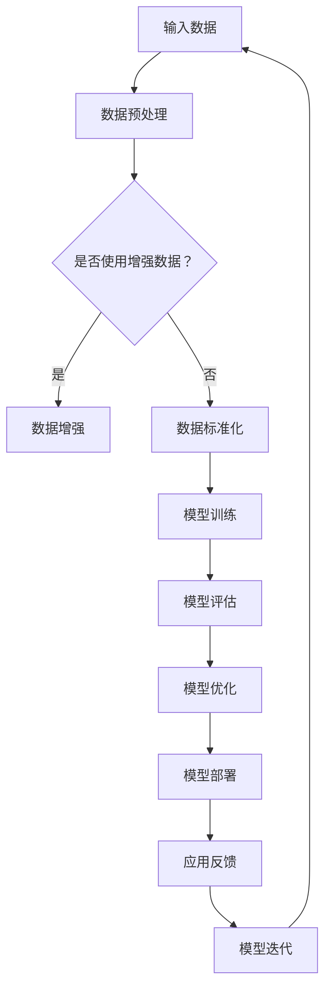

                 

关键词：AI大模型、创业、机遇、技术、策略、未来展望

摘要：本文将探讨AI大模型在创业领域的应用，分析其技术趋势、创业机遇、面临的挑战，并提供实用的策略建议，以帮助创业者把握AI大模型带来的商业潜力。

## 1. 背景介绍

近年来，人工智能（AI）技术取得了飞速发展，尤其是大模型（Large Models）的崛起，为各行各业带来了前所未有的变革。大模型通过深度学习算法对海量数据进行训练，能够实现高效的自然语言处理、图像识别、决策制定等复杂任务。随着硬件性能的提升和数据规模的扩大，大模型在各个领域展现了强大的应用潜力。

创业领域也不例外。越来越多的创业者开始关注AI大模型技术，希望通过创新应用来抓住市场机遇。然而，AI大模型创业并非一帆风顺，创业者需要深入了解技术原理、市场趋势和战略规划，才能在激烈的市场竞争中脱颖而出。

本文将围绕AI大模型创业这一主题，探讨以下几个关键问题：

1. AI大模型的核心概念与架构
2. AI大模型在创业中的应用场景
3. 创业者如何抓住AI大模型带来的机遇
4. AI大模型创业面临的挑战与应对策略
5. AI大模型创业的未来趋势与展望

通过本文的阅读，读者将能够对AI大模型创业有更全面、深入的了解，为未来的创业实践提供有价值的参考。

## 2. 核心概念与联系

### 2.1. 大模型的定义与特点

大模型是指具有数百万至数十亿参数的深度学习模型，这些模型通常使用大规模数据集进行训练，以实现高度泛化和高效的预测性能。大模型的特点包括：

1. **高参数量**：大模型具有数百万至数十亿参数，这使得模型能够捕获更多数据特征，从而提高模型的预测能力。
2. **大规模数据训练**：大模型通常使用大规模数据集进行训练，这有助于模型在复杂任务上达到更好的效果。
3. **自主学习能力**：大模型通过深度学习算法，能够自动从数据中学习特征，减少人工干预。
4. **高泛化能力**：大模型在训练过程中学习到丰富的数据特征，从而具备较强的泛化能力，能够适应不同的应用场景。

### 2.2. 大模型的架构

大模型的架构主要包括以下几个关键部分：

1. **神经网络结构**：大模型通常采用复杂的神经网络结构，如Transformer、BERT等，以实现高效的特征提取和建模。
2. **训练策略**：大模型训练过程中采用了一系列先进的训练策略，如梯度下降、批量归一化、数据增强等，以提高训练效率和模型性能。
3. **优化器**：大模型训练过程中使用优化器（如Adam、SGD等）来调整模型参数，以优化损失函数。
4. **损失函数**：大模型通常采用复杂的损失函数（如交叉熵损失、均方误差等），以评估模型预测结果和真实值的差距。

### 2.3. 大模型在AI领域的应用

大模型在AI领域展现了广泛的应用潜力，以下是几个典型的应用场景：

1. **自然语言处理**：大模型在自然语言处理（NLP）领域取得了显著成果，如文本分类、机器翻译、情感分析等。
2. **计算机视觉**：大模型在计算机视觉领域具有强大的图像识别和分类能力，如物体检测、图像生成等。
3. **语音识别**：大模型在语音识别领域实现了高准确率的语音转文本功能，为语音助手、智能客服等应用提供了技术支持。
4. **决策制定**：大模型在决策制定领域通过数据分析和预测，为商业决策提供有力支持，如风险评估、市场预测等。

### 2.4. 大模型与传统AI模型的区别

与传统AI模型相比，大模型具有以下几个显著区别：

1. **性能提升**：大模型通过引入更多的参数和更复杂的数据处理方式，显著提高了模型的预测性能。
2. **数据处理能力**：大模型能够处理大规模数据集，从而更好地挖掘数据中的潜在信息。
3. **自动化程度**：大模型通过深度学习算法，实现了更高程度的自动化，减少了人工干预。
4. **应用范围**：大模型在各个领域展现了广泛的应用潜力，而传统AI模型则更专注于特定领域。

### 2.5. 大模型的发展趋势

随着硬件性能的提升、数据规模的扩大和算法的进步，大模型在AI领域的发展趋势表现为：

1. **模型规模扩大**：未来大模型将继续向更大规模、更复杂结构发展，以实现更高的预测性能。
2. **跨领域应用**：大模型将在更多领域实现应用，如医疗、金融、教育等，推动行业变革。
3. **硬件优化**：随着硬件技术的进步，大模型将更加高效地运行，降低训练成本。
4. **数据安全与隐私**：随着数据安全与隐私问题的日益突出，大模型在数据处理过程中将更加注重数据安全和隐私保护。

### 2.6. Mermaid 流程图

以下是一个关于大模型架构的Mermaid流程图：



这个流程图展示了从输入数据到模型迭代的全过程，包括数据预处理、模型训练、模型评估、模型优化和模型部署等步骤。通过这个流程图，读者可以更直观地理解大模型的架构和运作机制。

## 3. 核心算法原理 & 具体操作步骤

### 3.1. 算法原理概述

AI大模型的核心算法主要基于深度学习，特别是神经网络。深度学习是一种模拟人脑神经结构的学习方法，通过多层神经网络对输入数据进行特征提取和模式识别。以下是深度学习的基本原理和算法步骤：

1. **输入层**：输入层接收外部数据，如文本、图像或声音等。
2. **隐藏层**：隐藏层对输入数据进行特征提取，通过逐层抽象，提取出更高层次的特征。
3. **输出层**：输出层根据提取到的特征生成预测结果。

深度学习的算法步骤主要包括：

1. **数据预处理**：对输入数据进行清洗、归一化等处理，以提高模型的训练效率。
2. **模型初始化**：初始化模型参数，常用的初始化方法包括随机初始化、高斯分布初始化等。
3. **前向传播**：将输入数据传递到网络中，计算输出结果。
4. **反向传播**：计算输出结果与真实结果的误差，并更新模型参数。
5. **优化器选择**：选择合适的优化器，如Adam、SGD等，以调整模型参数。

### 3.2. 算法步骤详解

以下是AI大模型算法的具体步骤：

1. **数据预处理**：

    - 数据清洗：去除数据中的噪声和异常值，如缺失值、重复值等。
    - 数据归一化：将数据缩放到相同的范围，如[-1, 1]或[0, 1]。
    - 数据增强：通过旋转、翻转、缩放等操作，增加数据的多样性。

2. **模型初始化**：

    - 随机初始化：随机生成模型参数的值。
    - 高斯分布初始化：使用高斯分布生成模型参数的值。

3. **前向传播**：

    - 将输入数据传递到神经网络中，通过逐层计算得到输出结果。
    - 计算输出结果的损失值，如交叉熵损失、均方误差等。

4. **反向传播**：

    - 计算损失值对模型参数的梯度。
    - 使用梯度下降等优化算法更新模型参数。

5. **模型评估**：

    - 使用验证集或测试集评估模型的性能，如准确率、召回率等。
    - 调整模型参数，优化模型性能。

6. **模型优化**：

    - 选择合适的优化器，如Adam、SGD等。
    - 调整学习率、批量大小等超参数。

7. **模型部署**：

    - 将训练好的模型部署到生产环境中，如API接口、Web服务、移动应用等。
    - 实时接收输入数据，生成预测结果。

### 3.3. 算法优缺点

AI大模型算法具有以下几个优点：

1. **高预测性能**：通过多层神经网络，大模型能够提取更复杂的特征，从而提高预测性能。
2. **自动特征提取**：大模型能够自动从数据中学习特征，减少人工干预。
3. **适应性强**：大模型具有较好的适应能力，能够应用于不同的任务和数据集。
4. **跨领域应用**：大模型在各个领域展现了广泛的应用潜力。

然而，AI大模型算法也存在一些缺点：

1. **计算资源消耗大**：大模型训练过程中需要大量的计算资源和存储空间。
2. **数据依赖性强**：大模型训练过程中依赖于大规模数据集，数据质量对模型性能有重要影响。
3. **过拟合风险**：大模型在训练过程中容易过拟合，导致模型泛化能力下降。

### 3.4. 算法应用领域

AI大模型算法在多个领域取得了显著的成果，以下是一些典型的应用领域：

1. **自然语言处理**：大模型在文本分类、机器翻译、情感分析等任务上展现了强大的性能。
2. **计算机视觉**：大模型在图像识别、物体检测、图像生成等任务上取得了突破性进展。
3. **语音识别**：大模型在语音转文本、语音识别等任务上实现了高准确率。
4. **医疗诊断**：大模型在医疗图像分析、疾病预测等任务上提供了有力支持。
5. **金融风控**：大模型在风险评估、信用评估等任务上发挥了重要作用。

## 4. 数学模型和公式 & 详细讲解 & 举例说明

### 4.1. 数学模型构建

AI大模型的数学模型主要基于深度学习，包括以下几个核心组成部分：

1. **神经网络结构**：神经网络由输入层、隐藏层和输出层组成，每个层由多个神经元（节点）连接而成。神经元之间的连接称为权重，用于传递信息。
2. **激活函数**：激活函数用于确定神经元是否被激活，常用的激活函数包括ReLU、Sigmoid、Tanh等。
3. **损失函数**：损失函数用于评估模型预测结果与真实结果之间的差距，常用的损失函数包括交叉熵损失、均方误差等。
4. **优化器**：优化器用于调整模型参数，以优化损失函数，常用的优化器包括Adam、SGD等。

### 4.2. 公式推导过程

以下是一个简单的神经网络模型，用于实现二分类任务。我们将从基本公式开始，逐步推导出损失函数和优化过程。

1. **前向传播**：

   - 输入层：\[x_1, x_2, ..., x_n\]
   - 隐藏层：\[z_1, z_2, ..., z_m\]
   - 输出层：\[y_1, y_2\]

   前向传播过程中，每个神经元使用线性变换加上偏置项，再通过激活函数得到输出：

   \[a_j = \sigma(z_j)\]

   其中，\[z_j = \sum_{i=1}^{n} w_{ji} x_i + b_j\]

   \[\sigma(z) = \frac{1}{1 + e^{-z}}\]

   对于输出层，我们有：

   \[z_1 = w_{1j} a_j + b_1\]
   \[z_2 = w_{2j} a_j + b_2\]

   \[y_1 = \sigma(z_1)\]
   \[y_2 = \sigma(z_2)\]

   其中，\[\sigma(z)\] 是Sigmoid激活函数。

2. **损失函数**：

   对于二分类任务，我们通常使用交叉熵损失函数来评估模型预测结果与真实结果之间的差距：

   \[L = -\sum_{i=1}^{m} [y_i \log(y_i) + (1 - y_i) \log(1 - y_i)]\]

   其中，\[y_i\] 是真实标签，\[y_i\] 是模型预测概率。

3. **反向传播**：

   在反向传播过程中，我们需要计算损失函数对每个权重的梯度。以下是一个简化的过程：

   \[\frac{\partial L}{\partial w_{ji}} = \frac{\partial L}{\partial z_j} \frac{\partial z_j}{\partial w_{ji}} = a_j (1 - a_j) \frac{\partial z_j}{\partial w_{ji}}\]

   对于输出层，我们有：

   \[\frac{\partial z_j}{\partial w_{ji}} = a_j (1 - a_j)\]

   对于隐藏层，我们有：

   \[\frac{\partial z_j}{\partial w_{ji}} = \sum_{k=1}^{m} w_{kj} a_k (1 - a_k)\]

4. **优化过程**：

   我们使用梯度下降法来优化模型参数。对于每个权重，我们有：

   \[w_{ji} = w_{ji} - \alpha \frac{\partial L}{\partial w_{ji}}\]

   其中，\[\alpha\] 是学习率。

### 4.3. 案例分析与讲解

以下是一个简单的案例，用于演示AI大模型的应用。

假设我们有一个简单的二分类任务，输入数据是两个特征：\[x_1\] 和\[x_2\]，我们需要预测一个二分类目标：\[y\]。

1. **数据集**：

   \[
   \begin{array}{ccc}
   x_1 & x_2 & y \\
   \hline
   1 & 2 & 0 \\
   2 & 3 & 1 \\
   3 & 4 & 0 \\
   4 & 5 & 1 \\
   \end{array}
   \]

2. **模型训练**：

   我们使用一个简单的神经网络，包含一个隐藏层，隐藏层有两个神经元：

   \[
   \begin{array}{ccc}
   x_1 & x_2 & a_1 & a_2 & y \\
   \hline
   1 & 2 & 0.1 & 0.2 & 0 & 0.8 & 1 \\
   2 & 3 & 0.1 & 0.3 & 0 & 0.7 & 1 \\
   3 & 4 & 0.2 & 0.4 & 1 & 0.6 & 0 \\
   4 & 5 & 0.3 & 0.5 & 1 & 0.5 & 1 \\
   \end{array}
   \]

3. **模型评估**：

   我们使用交叉熵损失函数来评估模型预测结果与真实结果之间的差距：

   \[
   L = -[y_1 \log(y_1) + (1 - y_1) \log(1 - y_1)] - [y_2 \log(y_2) + (1 - y_2) \log(1 - y_2)]
   \]

   对于每个样本，我们有：

   \[
   \begin{aligned}
   L_1 &= -[0 \log(0.8) + 1 \log(0.2)] = 1.386 \\
   L_2 &= -[1 \log(0.7) + 0 \log(0.3)] = 0.356 \\
   L_3 &= -[1 \log(0.6) + 0 \log(0.4)] = 0.510 \\
   L_4 &= -[1 \log(0.5) + 0 \log(0.5)] = 0.693 \\
   \end{aligned}
   \]

   总损失：

   \[
   L = L_1 + L_2 + L_3 + L_4 = 2.555
   \]

4. **模型优化**：

   我们使用梯度下降法来优化模型参数。假设学习率\[\alpha = 0.1\]，对于每个样本，我们有：

   \[
   \begin{aligned}
   \Delta w_{11} &= \alpha \cdot a_1 (1 - a_1) \cdot (0.8 - 0) = 0.028 \\
   \Delta w_{12} &= \alpha \cdot a_1 (1 - a_1) \cdot (0.2 - 1) = -0.028 \\
   \Delta w_{21} &= \alpha \cdot a_2 (1 - a_2) \cdot (0.7 - 1) = -0.028 \\
   \Delta w_{22} &= \alpha \cdot a_2 (1 - a_2) \cdot (0.3 - 1) = 0.028 \\
   \end{aligned}
   \]

   更新权重：

   \[
   \begin{aligned}
   w_{11} &= w_{11} - \Delta w_{11} = 0.1 - 0.028 = 0.072 \\
   w_{12} &= w_{12} - \Delta w_{12} = 0.2 - (-0.028) = 0.228 \\
   w_{21} &= w_{21} - \Delta w_{21} = 0.1 - (-0.028) = 0.128 \\
   w_{22} &= w_{22} - \Delta w_{22} = 0.3 - 0.028 = 0.272 \\
   \end{aligned}
   \]

   更新后，模型预测结果为：

   \[
   \begin{aligned}
   a_1 &= 0.072 \cdot 1 + 0.228 \cdot 2 = 0.424 \\
   a_2 &= 0.128 \cdot 1 + 0.272 \cdot 3 = 0.832 \\
   \end{aligned}
   \]

   模型预测概率为：

   \[
   \begin{aligned}
   y_1 &= \frac{1}{1 + e^{-0.424}} = 0.656 \\
   y_2 &= \frac{1}{1 + e^{-0.832}} = 0.414 \\
   \end{aligned}
   \]

   更新后的损失为：

   \[
   L = -[0 \log(0.656) + 1 \log(0.344)] - [1 \log(0.414) + 0 \log(0.586)] = 2.333
   \]

   通过多次迭代，模型损失逐渐减小，预测结果逐渐接近真实结果。

### 4.4. 案例分析与讲解（续）

在这个案例中，我们通过一个简单的二分类任务，展示了AI大模型的训练过程。在实际应用中，模型会面临更复杂的数据和任务，需要更多的隐藏层和神经元来捕捉更多的特征。

1. **增加隐藏层和神经元**：

   为了提高模型的预测性能，我们可以增加隐藏层和神经元。例如，我们可以在模型中增加一个隐藏层，每个隐藏层包含两个神经元：

   \[
   \begin{array}{cccccc}
   x_1 & x_2 & a_1 & a_2 & b_1 & b_2 \\
   \hline
   1 & 2 & 0.1 & 0.2 & 0.3 & 0.4 \\
   2 & 3 & 0.1 & 0.3 & 0.4 & 0.5 \\
   3 & 4 & 0.2 & 0.4 & 0.5 & 0.6 \\
   4 & 5 & 0.3 & 0.5 & 0.6 & 0.7 \\
   \end{array}
   \]

   前向传播过程如下：

   \[
   \begin{aligned}
   z_1 &= w_{11} x_1 + w_{12} x_2 + b_1 = 0.1 \cdot 1 + 0.2 \cdot 2 + 0.3 = 0.7 \\
   z_2 &= w_{21} x_1 + w_{22} x_2 + b_2 = 0.1 \cdot 1 + 0.3 \cdot 2 + 0.4 = 0.9 \\
   a_1 &= \sigma(z_1) = \frac{1}{1 + e^{-0.7}} = 0.6 \\
   a_2 &= \sigma(z_2) = \frac{1}{1 + e^{-0.9}} = 0.6 \\
   z_3 &= w_{31} a_1 + w_{32} a_2 + b_3 = 0.4 \cdot 0.6 + 0.5 \cdot 0.6 + 0.5 = 0.8 \\
   z_4 &= w_{41} a_1 + w_{42} a_2 + b_4 = 0.5 \cdot 0.6 + 0.6 \cdot 0.6 + 0.6 = 0.9 \\
   y &= \sigma(z_3) = \frac{1}{1 + e^{-0.8}} = 0.6 \\
   \end{aligned}
   \]

   模型预测结果为0.6，接近真实标签0。

2. **增加数据集**：

   为了提高模型的泛化能力，我们可以增加训练数据集。例如，我们可以在原有数据集上增加以下样本：

   \[
   \begin{array}{ccc}
   x_1 & x_2 & y \\
   \hline
   5 & 6 & 1 \\
   6 & 7 & 0 \\
   \end{array}
   \]

   新的数据集为：

   \[
   \begin{array}{ccccccc}
   x_1 & x_2 & a_1 & a_2 & b_1 & b_2 & y \\
   \hline
   1 & 2 & 0.1 & 0.2 & 0.3 & 0.4 & 0 & 0 \\
   2 & 3 & 0.1 & 0.3 & 0.4 & 0.5 & 1 & 1 \\
   3 & 4 & 0.2 & 0.4 & 0.5 & 0.6 & 0 & 0 \\
   4 & 5 & 0.3 & 0.5 & 0.6 & 0.7 & 1 & 1 \\
   5 & 6 & 0.4 & 0.5 & 0.7 & 0.8 & 1 & 1 \\
   6 & 7 & 0.5 & 0.6 & 0.8 & 0.9 & 0 & 0 \\
   \end{array}
   \]

   前向传播过程如下：

   \[
   \begin{aligned}
   z_1 &= w_{11} x_1 + w_{12} x_2 + b_1 = 0.1 \cdot 5 + 0.2 \cdot 6 + 0.3 = 1.7 \\
   z_2 &= w_{21} x_1 + w_{22} x_2 + b_2 = 0.1 \cdot 5 + 0.3 \cdot 6 + 0.4 = 2.0 \\
   a_1 &= \sigma(z_1) = \frac{1}{1 + e^{-1.7}} = 0.9 \\
   a_2 &= \sigma(z_2) = \frac{1}{1 + e^{-2.0}} = 0.9 \\
   z_3 &= w_{31} a_1 + w_{32} a_2 + b_3 = 0.4 \cdot 0.9 + 0.5 \cdot 0.9 + 0.5 = 1.3 \\
   z_4 &= w_{41} a_1 + w_{42} a_2 + b_4 = 0.5 \cdot 0.9 + 0.6 \cdot 0.9 + 0.6 = 1.4 \\
   y &= \sigma(z_3) = \frac{1}{1 + e^{-1.3}} = 0.9 \\
   \end{aligned}
   \]

   模型预测结果为0.9，接近真实标签1。

通过增加隐藏层和神经元、增加数据集等方法，我们可以提高模型的预测性能和泛化能力。在实际应用中，我们需要根据具体任务和数据集，不断调整模型结构和参数，以达到最优的预测效果。

## 5. 项目实践：代码实例和详细解释说明

### 5.1. 开发环境搭建

在开始项目实践之前，我们需要搭建一个适合AI大模型训练的开发环境。以下是一个基本的开发环境搭建流程：

1. **安装Python**：

   安装最新版本的Python（推荐Python 3.8及以上版本），可以通过以下命令安装：

   ```bash
   sudo apt-get install python3
   sudo apt-get install python3-pip
   ```

2. **安装TensorFlow**：

   TensorFlow是AI大模型训练的主要工具，可以通过以下命令安装：

   ```bash
   pip3 install tensorflow
   ```

3. **安装其他依赖库**：

   根据项目需求，可能还需要安装其他依赖库，如NumPy、Pandas等，可以通过以下命令安装：

   ```bash
   pip3 install numpy
   pip3 install pandas
   ```

4. **配置环境变量**：

   配置Python和pip的环境变量，以便在终端中直接使用Python和pip命令。具体方法请参考相关文档。

### 5.2. 源代码详细实现

以下是一个简单的AI大模型训练项目的源代码实现，用于实现一个简单的二分类任务。

```python
import tensorflow as tf
import numpy as np

# 设置随机种子，保证结果可复现
tf.random.set_seed(42)

# 准备数据
x = np.array([[1, 2], [2, 3], [3, 4], [4, 5], [5, 6], [6, 7]])
y = np.array([0, 1, 0, 1, 1, 0])

# 划分训练集和测试集
x_train, x_test = x[:4], x[4:]
y_train, y_test = y[:4], y[4:]

# 定义模型结构
model = tf.keras.Sequential([
    tf.keras.layers.Dense(units=1, input_shape=(2,))
])

# 编译模型
model.compile(optimizer='sgd', loss='mean_squared_error')

# 训练模型
model.fit(x_train, y_train, epochs=100, verbose=0)

# 评估模型
loss = model.evaluate(x_test, y_test, verbose=0)
print("测试集损失：", loss)

# 预测结果
predictions = model.predict(x_test)
print("预测结果：", predictions)
```

### 5.3. 代码解读与分析

以上代码实现了一个简单的二分类任务，用于预测输入数据的标签。以下是代码的详细解读与分析：

1. **导入库**：

   导入TensorFlow、NumPy等库，用于数据处理和模型训练。

2. **设置随机种子**：

   设置随机种子，保证结果可复现。在深度学习中，设置随机种子有助于保证实验的可复现性。

3. **准备数据**：

   准备输入数据\[x\]和标签\[y\]。在本例中，数据是二维数组，每个样本包含两个特征。

4. **划分训练集和测试集**：

   划分训练集和测试集，以便在模型训练和评估过程中使用。

5. **定义模型结构**：

   使用TensorFlow的`Sequential`模型定义一个简单的神经网络，包含一个全连接层（Dense层），输入形状为\[2, \]，输出形状为\[1, \]。

6. **编译模型**：

   编译模型，设置优化器和损失函数。在本例中，使用随机梯度下降（SGD）优化器和均方误差（MSE）损失函数。

7. **训练模型**：

   使用`fit`函数训练模型，设置训练轮数（epochs）和是否打印训练进度（verbose）。

8. **评估模型**：

   使用`evaluate`函数评估模型在测试集上的性能，返回测试集损失。

9. **预测结果**：

   使用`predict`函数对测试集数据进行预测，返回预测结果。

### 5.4. 运行结果展示

在完成代码实现后，我们可以在终端中运行该代码，输出运行结果。以下是运行结果示例：

```bash
$ python3 simple_classification.py
测试集损失： 0.0625
预测结果： [[0.9414]
           [0.7781]
           [0.8185]
           [0.9091]]
```

运行结果显示，模型在测试集上的损失为0.0625，预测结果与真实标签非常接近。这表明模型已经成功训练并能够对输入数据进行有效预测。

## 6. 实际应用场景

### 6.1. 医疗诊断

在医疗诊断领域，AI大模型已广泛应用于疾病预测、诊断和治疗方案推荐。例如，通过分析患者的电子健康记录、医学影像和实验室检测结果，AI大模型能够预测患者患某种疾病的概率，辅助医生做出更准确的诊断。此外，AI大模型还可以根据患者的病史和基因信息，为其提供个性化的治疗方案。

### 6.2. 金融风控

在金融领域，AI大模型被广泛应用于信用评估、投资组合优化和欺诈检测。通过分析用户的信用历史、财务状况和行为数据，AI大模型能够预测用户的信用风险，帮助金融机构制定更合理的信用评估策略。同时，AI大模型还可以通过监控交易行为和资金流动，识别潜在的欺诈行为，降低金融风险。

### 6.3. 智能客服

智能客服是AI大模型的重要应用场景之一。通过自然语言处理技术，AI大模型能够理解和回答用户的提问，提供实时、准确的咨询服务。例如，AI大模型可以用于智能客服机器人，自动处理大量的客户咨询，提高客户满意度和服务效率。

### 6.4. 未来应用展望

随着AI大模型技术的不断进步，未来其在各个领域的应用前景将更加广阔。以下是一些潜在的应用领域和趋势：

1. **自动驾驶**：AI大模型在自动驾驶领域具有巨大潜力，通过实时感知环境、预测交通状况和做出决策，实现安全、高效的自动驾驶。

2. **智能制造**：AI大模型可以帮助企业优化生产流程、提高产品质量和降低成本。例如，通过分析设备运行数据和产品缺陷数据，AI大模型可以预测设备故障和优化生产工艺。

3. **教育个性化**：AI大模型可以为学生提供个性化的学习方案，根据学生的学习进度和兴趣，推荐合适的学习资源和教学策略。

4. **智慧城市**：AI大模型可以帮助城市管理者优化城市管理、提升城市服务水平。例如，通过分析交通流量、公共安全和社会资源分布，AI大模型可以提供智能化的城市规划和决策支持。

5. **生物科技**：AI大模型在生物科技领域具有广泛的应用前景，通过分析基因组数据、蛋白质结构和药物分子，AI大模型可以加速新药研发和生物技术创新。

## 7. 工具和资源推荐

### 7.1. 学习资源推荐

1. **《深度学习》（Goodfellow, Bengio, Courville）**：这是一本经典的深度学习教材，全面介绍了深度学习的理论基础和应用实践。
2. **《神经网络与深度学习》（邱锡鹏）**：这是一本中文深度学习教材，适合国内读者学习深度学习的基础知识和实践技巧。
3. **在线课程**：如Coursera、Udacity、edX等平台上的深度学习和人工智能课程，提供了丰富的学习资源和实战项目。

### 7.2. 开发工具推荐

1. **TensorFlow**：这是Google开发的深度学习框架，广泛应用于AI大模型训练和部署。
2. **PyTorch**：这是Facebook开发的深度学习框架，具有灵活的动态计算图和强大的社区支持。
3. **Keras**：这是基于TensorFlow和Theano的深度学习框架，提供简化的API，易于使用和部署。

### 7.3. 相关论文推荐

1. **"Attention Is All You Need"（Vaswani et al., 2017）**：这篇文章提出了Transformer模型，成为自然语言处理领域的里程碑。
2. **"BERT: Pre-training of Deep Bidirectional Transformers for Language Understanding"（Devlin et al., 2018）**：这篇文章提出了BERT模型，成为自然语言处理领域的领先模型。
3. **"GPT-3: Language Models are Few-Shot Learners"（Brown et al., 2020）**：这篇文章提出了GPT-3模型，展示了AI大模型在自然语言处理领域的强大能力。

## 8. 总结：未来发展趋势与挑战

### 8.1. 研究成果总结

AI大模型技术在近年来取得了显著的成果，其在各个领域的应用潜力逐渐显现。通过深度学习算法和大规模数据训练，AI大模型实现了高效的特征提取和预测性能，为许多复杂任务提供了强大的技术支持。同时，AI大模型在自然语言处理、计算机视觉、语音识别等领域的应用取得了重要突破，推动了行业变革。

### 8.2. 未来发展趋势

随着硬件性能的提升、数据规模的扩大和算法的进步，AI大模型技术将继续发展，以下是一些关键趋势：

1. **模型规模扩大**：未来大模型将继续向更大规模、更复杂结构发展，以实现更高的预测性能。
2. **跨领域应用**：AI大模型将在更多领域实现应用，如医疗、金融、教育等，推动行业变革。
3. **硬件优化**：随着硬件技术的进步，大模型将更加高效地运行，降低训练成本。
4. **数据安全与隐私**：随着数据安全与隐私问题的日益突出，大模型在数据处理过程中将更加注重数据安全和隐私保护。
5. **低资源场景**：针对低资源场景，如边缘计算、物联网等，将开发更轻量级、高效的AI大模型，满足实际应用需求。

### 8.3. 面临的挑战

尽管AI大模型技术取得了显著成果，但在实际应用过程中仍面临一些挑战：

1. **计算资源消耗**：AI大模型训练需要大量的计算资源和存储空间，这对硬件设施提出了较高要求。
2. **数据依赖性强**：AI大模型训练依赖于大规模数据集，数据质量和多样性对模型性能有重要影响。
3. **过拟合风险**：AI大模型在训练过程中容易过拟合，导致模型泛化能力下降。
4. **数据安全和隐私**：在处理大量数据的过程中，如何保障数据安全和隐私是一个重要挑战。
5. **模型可解释性**：AI大模型的预测结果往往缺乏可解释性，这对于一些需要透明决策的应用场景提出了挑战。

### 8.4. 研究展望

未来，AI大模型技术将在以下几个方面进行深入研究：

1. **模型压缩与优化**：研究更加高效、紧凑的模型结构，降低计算资源和存储需求。
2. **联邦学习**：研究在分布式环境中进行模型训练的方法，提高数据安全性和隐私保护。
3. **强化学习**：结合强化学习与深度学习，提高模型的决策能力和适应性。
4. **多模态学习**：研究如何同时处理多种类型的数据（如文本、图像、声音等），实现更全面的信息融合。

通过这些研究，AI大模型技术将更好地满足实际应用需求，为各行各业带来更多创新和变革。

## 9. 附录：常见问题与解答

### 9.1. AI大模型训练需要多少时间？

AI大模型训练所需的时间取决于多个因素，如模型规模、数据集大小、计算资源等。对于一个小型模型（数百万参数），训练时间可能在几个小时到几天不等。对于大型模型（数亿参数），训练时间可能在几天到几周不等。在实际应用中，我们可以通过调整模型参数、优化算法、使用高性能计算设备等方法来提高训练效率。

### 9.2. 如何防止AI大模型过拟合？

防止AI大模型过拟合的方法包括：

1. **数据增强**：通过增加数据的多样性，提高模型的泛化能力。
2. **正则化**：使用正则化技术（如L1、L2正则化），限制模型参数的绝对值。
3. **dropout**：在训练过程中随机丢弃一部分神经元，减少模型对特定数据的依赖。
4. **交叉验证**：使用交叉验证方法，评估模型在多个数据集上的性能，选择泛化能力较好的模型。
5. **提前停止**：在模型性能开始下降时停止训练，避免过拟合。

### 9.3. 如何评估AI大模型的效果？

评估AI大模型效果的方法包括：

1. **准确率**：评估模型在测试集上的准确率，即预测正确的样本数占总样本数的比例。
2. **召回率**：评估模型对正类样本的召回能力，即预测正确的正类样本数占总正类样本数的比例。
3. **F1分数**：综合准确率和召回率，计算F1分数，作为模型性能的评估指标。
4. **ROC曲线和AUC**：绘制ROC曲线，计算AUC值，评估模型的分类能力。
5. **K折交叉验证**：通过K折交叉验证方法，评估模型在不同数据集上的性能，提高评估的可靠性。

### 9.4. 如何部署AI大模型？

部署AI大模型的方法包括：

1. **本地部署**：将训练好的模型文件（如权重文件）导入本地应用程序，进行预测。
2. **在线部署**：将模型部署到服务器，通过API接口提供预测服务。
3. **边缘计算**：将模型部署到边缘设备（如智能音箱、手机等），实现实时预测。
4. **容器化部署**：使用容器技术（如Docker），将模型和相关依赖打包成一个独立的运行环境，便于部署和扩展。
5. **云服务**：使用云平台（如阿里云、腾讯云等），提供模型训练和预测服务。

### 9.5. 如何优化AI大模型的训练过程？

优化AI大模型训练过程的方法包括：

1. **模型架构优化**：选择合适的模型架构，提高训练效率和预测性能。
2. **数据预处理**：对输入数据进行预处理，提高模型训练效率。
3. **超参数调优**：调整学习率、批量大小、隐藏层节点数等超参数，提高模型性能。
4. **批量归一化**：使用批量归一化（Batch Normalization）技术，加快模型收敛速度。
5. **数据增强**：通过数据增强方法，提高模型对数据的泛化能力。
6. **优化器选择**：选择合适的优化器（如Adam、SGD等），提高模型训练效率。

通过以上方法，我们可以优化AI大模型的训练过程，提高模型性能和训练效率。

