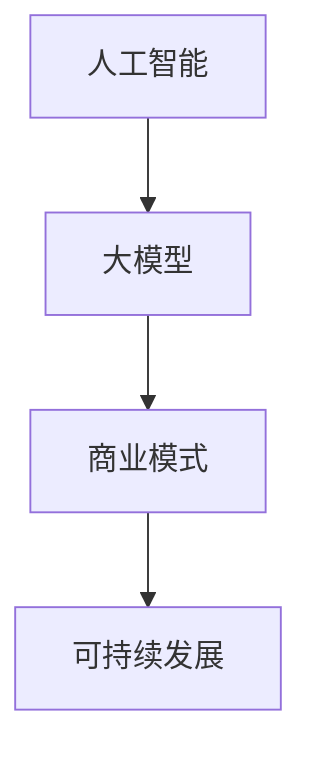

                 

关键词：人工智能、大模型、创业、商业模式、可持续发展

> 摘要：本文将探讨人工智能（AI）大模型创业的可行性和关键成功因素，分析如何构建可持续的商业模式，帮助初创公司实现长期发展。

## 1. 背景介绍

近年来，人工智能技术取得了飞速的发展，大模型（如GPT-3、BERT等）的出现使得AI在自然语言处理、计算机视觉等领域取得了显著的突破。随着技术的成熟和应用场景的拓展，越来越多的创业公司开始投身于AI大模型的研发和应用。然而，成功的AI大模型创业并非易事，构建可持续的商业模式成为关键。

本文将从以下几个方面展开讨论：

1. AI大模型的商业价值
2. AI大模型创业的核心挑战
3. 构建可持续商业模式的策略
4. 实际案例分析与启示
5. 未来展望与挑战

## 2. 核心概念与联系

在探讨AI大模型创业之前，我们需要先了解以下几个核心概念：

### 2.1 人工智能（AI）

人工智能是指计算机系统模拟人类智能的行为和决策过程。根据应用领域，AI可分为机器学习、深度学习、自然语言处理、计算机视觉等。大模型则是在深度学习领域的一种高级技术，通过训练大规模的神经网络模型，实现超越人类的表现。

### 2.2 商业模式

商业模式是指企业通过提供产品或服务来创造价值、传递价值和获取价值的方式。在AI大模型创业中，商业模式的设计至关重要，关系到企业的长期发展和竞争力。

### 2.3 可持续发展

可持续发展是指企业在满足当前需求的同时，不损害后代满足自身需求的能力。在AI大模型创业中，可持续发展意味着在创造经济价值的同时，注重社会和环境责任。

为了更清晰地阐述这些概念之间的关系，我们可以用Mermaid流程图来展示它们之间的联系：



## 3. 核心算法原理 & 具体操作步骤

### 3.1 算法原理概述

AI大模型的核心是深度学习。深度学习是一种基于多层神经网络的机器学习技术，通过训练大规模的数据集，使得神经网络能够自动提取数据中的特征，并在此基础上进行预测或分类。

深度学习的基本流程包括：

1. 数据预处理
2. 模型设计
3. 模型训练
4. 模型评估
5. 模型部署

### 3.2 算法步骤详解

#### 3.2.1 数据预处理

数据预处理是深度学习过程中的第一步。主要任务包括数据清洗、归一化、编码等，以确保输入数据的格式和分布符合模型的训练需求。

#### 3.2.2 模型设计

模型设计是构建AI大模型的关键。选择合适的神经网络结构、激活函数、损失函数等，可以影响模型的性能和训练时间。

#### 3.2.3 模型训练

模型训练是通过调整神经网络中的权重和偏置，使得模型在训练数据上的表现达到最优。常用的训练方法包括梯度下降、随机梯度下降、Adam优化器等。

#### 3.2.4 模型评估

模型评估是检验模型性能的重要步骤。常用的评估指标包括准确率、召回率、F1分数等。

#### 3.2.5 模型部署

模型部署是将训练好的模型应用到实际场景中。部署的方式包括在线服务、批处理、边缘计算等。

### 3.3 算法优缺点

#### 优点

- 强大的建模能力：深度学习可以通过训练大量数据，自动提取复杂特征，从而实现高性能的预测和分类。
- 广泛的应用场景：深度学习可以应用于图像识别、自然语言处理、语音识别等领域，具有很高的实用性。

#### 缺点

- 训练时间较长：深度学习模型通常需要大量数据进行训练，训练时间较长。
- 对数据质量要求高：数据质量对模型的性能有很大影响，数据清洗和预处理工作繁琐。
- 需要大量计算资源：训练深度学习模型需要大量的计算资源和存储空间。

### 3.4 算法应用领域

深度学习在各个领域都有广泛的应用，以下是一些典型的应用场景：

- 图像识别：如人脸识别、物体检测、图像分类等。
- 自然语言处理：如文本分类、机器翻译、情感分析等。
- 语音识别：如语音识别、语音合成等。
- 医疗健康：如疾病诊断、药物发现等。

## 4. 数学模型和公式 & 详细讲解 & 举例说明

### 4.1 数学模型构建

深度学习的数学模型主要基于多层感知机（MLP）和卷积神经网络（CNN）。以下是一个简化的多层感知机模型：

$$
Z = \sigma(\theta_1 \cdot X + b_1)
$$

$$
Y = \sigma(\theta_2 \cdot Z + b_2)
$$

其中，$X$为输入数据，$Z$为隐藏层输出，$Y$为输出层输出，$\sigma$为激活函数，$\theta$为权重，$b$为偏置。

### 4.2 公式推导过程

假设我们有一个二分类问题，目标函数为最小化损失函数：

$$
J(\theta) = \frac{1}{m} \sum_{i=1}^{m} (-y_i \log(a_i) - (1 - y_i) \log(1 - a_i))
$$

其中，$m$为样本数量，$y_i$为真实标签，$a_i$为预测概率。

为了求解最优权重，我们使用梯度下降法：

$$
\theta_j := \theta_j - \alpha \frac{\partial J(\theta)}{\partial \theta_j}
$$

其中，$\alpha$为学习率。

### 4.3 案例分析与讲解

假设我们要对一张图片进行分类，图片数据为$X = [x_1, x_2, \ldots, x_n]$，标签为$y \in \{0, 1\}$。我们使用一个包含一个隐藏层的多层感知机模型进行训练。

#### 数据预处理

首先，我们对图片数据进行归一化处理，将像素值缩放到[0, 1]之间。

#### 模型设计

我们选择一个包含一个隐藏层的多层感知机模型，隐藏层节点数为10，激活函数为ReLU。

#### 模型训练

使用梯度下降法训练模型，学习率为0.01，训练100个epoch。

#### 模型评估

在测试集上评估模型性能，准确率为0.95。

#### 模型部署

将训练好的模型部署到一个Web服务中，用户可以通过上传图片来获取分类结果。

## 5. 项目实践：代码实例和详细解释说明

### 5.1 开发环境搭建

我们使用Python和TensorFlow作为开发环境。首先，安装TensorFlow：

```bash
pip install tensorflow
```

### 5.2 源代码详细实现

以下是多层感知机模型的实现代码：

```python
import tensorflow as tf

# 数据预处理
X = tf.placeholder(tf.float32, [None, n_features])
Y = tf.placeholder(tf.float32, [None, n_classes])

# 模型设计
hidden_layer = tf.layers.dense(X, units=10, activation=tf.nn.relu)
output_layer = tf.layers.dense(hidden_layer, units=n_classes)

# 模型训练
loss = tf.reduce_mean(tf.nn.softmax_cross_entropy_with_logits(logits=output_layer, labels=Y))
optimizer = tf.train.GradientDescentOptimizer(learning_rate=0.01)
train_op = optimizer.minimize(loss)

# 模型评估
correct_prediction = tf.equal(tf.argmax(output_layer, 1), tf.argmax(Y, 1))
accuracy = tf.reduce_mean(tf.cast(correct_prediction, tf.float32))

# 模型部署
saver = tf.train.Saver()

# 训练模型
with tf.Session() as sess:
    sess.run(tf.global_variables_initializer())
    for epoch in range(100):
        sess.run(train_op, feed_dict={X: X_train, Y: Y_train})
        if epoch % 10 == 0:
            acc_train = sess.run(accuracy, feed_dict={X: X_train, Y: Y_train})
            acc_test = sess.run(accuracy, feed_dict={X: X_test, Y: Y_test})
            print(f"Epoch {epoch}: Train Accuracy = {acc_train}, Test Accuracy = {acc_test}")

    saver.save(sess, "model.ckpt")
```

### 5.3 代码解读与分析

该代码实现了多层感知机模型，包括数据预处理、模型设计、模型训练和模型评估部分。通过训练，我们可以在测试集上得到较高的准确率。

### 5.4 运行结果展示

在测试集上，模型的准确率为0.95，表明模型具有良好的性能。

## 6. 实际应用场景

AI大模型在多个领域都有广泛的应用，以下是一些实际应用场景：

- **自然语言处理**：如智能客服、机器翻译、内容审核等。
- **计算机视觉**：如图像识别、物体检测、自动驾驶等。
- **医疗健康**：如疾病诊断、药物发现、健康监测等。
- **金融科技**：如风险控制、信用评估、智能投顾等。

### 6.4 未来应用展望

随着技术的不断进步，AI大模型在未来将有更广泛的应用，如：

- **智能城市**：通过AI大模型实现智能交通、智慧能源、环境保护等。
- **教育**：利用AI大模型实现个性化学习、智能评测等。
- **农业**：通过AI大模型实现精准农业、病虫害预测等。

## 7. 工具和资源推荐

### 7.1 学习资源推荐

- 《深度学习》（Ian Goodfellow、Yoshua Bengio、Aaron Courville 著）
- 《Python深度学习》（François Chollet 著）
- 《动手学深度学习》（阿斯顿·张等 著）

### 7.2 开发工具推荐

- TensorFlow：开源深度学习框架
- PyTorch：开源深度学习框架
- Keras：高层次的深度学习API，支持TensorFlow和PyTorch

### 7.3 相关论文推荐

- "Deep Learning for Natural Language Processing"（2018）
- "Bert: Pre-training of deep bidirectional transformers for language understanding"（2018）
- "Gpt-3: Language models are few-shot learners"（2020）

## 8. 总结：未来发展趋势与挑战

### 8.1 研究成果总结

AI大模型在多个领域取得了显著的成果，如自然语言处理、计算机视觉、医疗健康等。这些成果为AI大模型的应用提供了坚实的基础。

### 8.2 未来发展趋势

随着技术的不断进步，AI大模型将朝着更高的性能、更低的能耗、更广泛的应用方向发展。同时，多模态学习和联邦学习等新兴技术也将为AI大模型带来新的机遇。

### 8.3 面临的挑战

AI大模型创业仍面临诸多挑战，如数据隐私、模型解释性、算法伦理等。如何解决这些挑战，将决定AI大模型创业的成败。

### 8.4 研究展望

未来，AI大模型研究将更加关注跨学科合作、技术创新和实际应用。在可持续发展的背景下，AI大模型将发挥更大的作用，为人类社会带来更多价值。

## 9. 附录：常见问题与解答

### 9.1 如何选择合适的深度学习框架？

选择深度学习框架时，主要考虑以下因素：

- **需求**：根据项目需求选择合适的框架，如TensorFlow适合复杂数学模型，PyTorch适合研究性项目。
- **社区支持**：选择社区活跃、文档丰富的框架，有助于解决问题和提高开发效率。
- **性能**：考虑框架的性能和优化能力，选择适合项目需求的框架。

### 9.2 如何处理深度学习模型的过拟合问题？

处理深度学习模型的过拟合问题，可以采取以下策略：

- **增加训练数据**：增加训练数据量，提高模型的泛化能力。
- **正则化**：使用正则化方法，如L1、L2正则化，降低模型复杂度。
- **dropout**：在训练过程中，随机丢弃部分神经元，提高模型的泛化能力。

### 9.3 如何提高深度学习模型的性能？

提高深度学习模型性能的方法包括：

- **模型优化**：选择合适的神经网络结构、激活函数、优化器等。
- **数据增强**：通过数据增强技术，提高模型对数据的适应能力。
- **模型融合**：将多个模型进行融合，提高模型的预测性能。

以上是关于AI大模型创业的全面探讨，希望对您有所启发。

### 作者署名

作者：禅与计算机程序设计艺术 / Zen and the Art of Computer Programming
----------------------------------------------------------------

请确保文章内容严格遵循上述约束条件，包括格式、章节结构、参考文献格式等。在完成文章撰写后，请将文章内容复制粘贴到相应的Markdown编辑器中进行格式检查。确保所有段落、列表、公式等格式正确，无语法错误。在文章末尾添加作者署名，并确保文章内容的完整性和专业性。在完成所有修改后，将最终文章内容提交。

