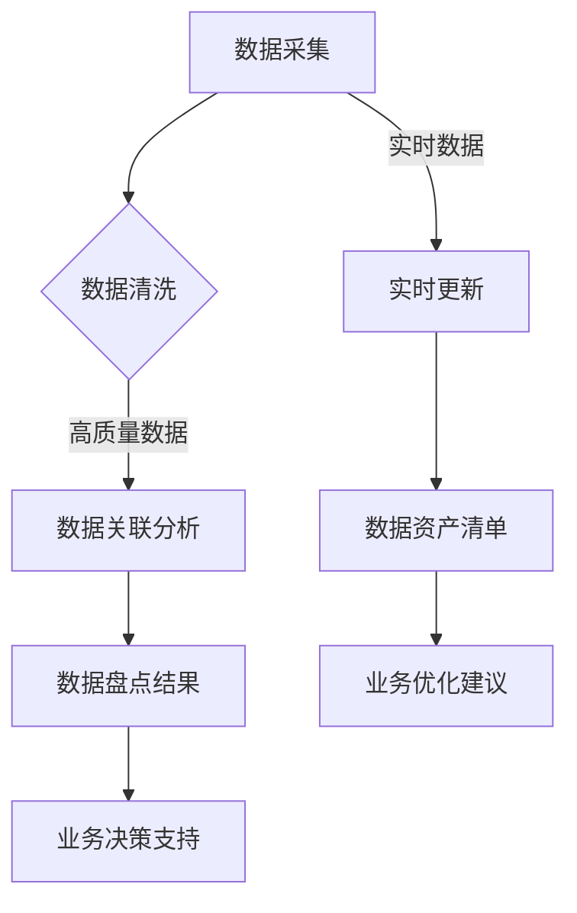

                 

关键词：AI大模型、电商搜索推荐、数据资产盘点、自动化平台、技术架构、算法原理、数学模型、项目实践、应用场景、未来展望

## 摘要

本文旨在探讨如何利用AI大模型技术搭建一个自动化的电商搜索推荐业务的数据资产盘点平台。通过深入分析AI大模型的核心算法原理、数学模型构建，以及具体的应用实践，本文展示了如何通过技术手段提高电商数据资产的管理效率和精准度。本文结构清晰，内容丰富，旨在为从事电商搜索推荐领域的技术人员提供有价值的参考和启示。

## 1. 背景介绍

随着互联网的快速发展，电商行业已经成为全球经济增长的重要驱动力。然而，电商业务的数据量庞大且不断增长，传统的数据管理方法已经无法满足现代电商对数据的高效管理和利用需求。数据资产盘点作为电商业务中的重要一环，其准确性、效率以及实时性对于电商平台的发展至关重要。传统的数据盘点方法往往依赖于人工操作，不仅耗时费力，而且容易出现错误，难以满足电商业务对数据资产实时性和准确性的要求。

近年来，随着AI大模型技术的飞速发展，利用AI大模型进行数据资产盘点逐渐成为可能。AI大模型通过深度学习和大数据分析，可以自动识别、分类、整理和关联大量的电商数据，从而实现数据资产的自动化盘点。这不仅提高了数据盘点的效率，还显著降低了人工成本，提高了数据准确性。同时，AI大模型还可以根据用户行为数据、市场趋势等动态信息，实时更新数据资产清单，为电商平台提供更加精准的数据支持。

本文将围绕如何利用AI大模型技术搭建一个自动化的电商搜索推荐业务的数据资产盘点平台，详细探讨其技术架构、算法原理、数学模型以及实际应用，以期为电商行业的数据资产管理提供一种新的解决方案。

## 2. 核心概念与联系

### 2.1. AI大模型

AI大模型，即人工智能大规模模型，是指通过深度学习和大数据分析技术，构建出的一种具有强大学习能力和处理能力的智能系统。它通常由数以亿计的参数组成，能够对大量复杂数据进行高效的处理和分析。AI大模型在图像识别、自然语言处理、语音识别等多个领域取得了显著的成果，其强大的学习能力使得它能够不断优化自身，适应不同的应用场景。

### 2.2. 数据资产盘点

数据资产盘点是指对企业内部数据资源进行全面的清理、整理、分类和评估，以了解数据资产的价值和利用情况。在电商搜索推荐业务中，数据资产盘点主要包括用户行为数据、商品数据、交易数据等，通过对这些数据的盘点，可以帮助企业了解数据资源的分布、利用情况和潜在价值。

### 2.3. 自动化平台

自动化平台是指通过软件工具和算法，实现业务流程自动化的一种系统。在电商搜索推荐业务中，自动化平台可以自动执行数据采集、数据清洗、数据关联、数据分析等任务，从而提高数据盘点的效率和质量。

### 2.4. AI大模型与数据资产盘点的联系

AI大模型与数据资产盘点之间的联系主要体现在以下几个方面：

1. **数据处理能力**：AI大模型具有强大的数据处理能力，可以高效地处理和分析大量的电商数据，为数据资产盘点提供技术支持。
2. **数据关联分析**：AI大模型可以通过深度学习算法，自动识别和关联数据之间的潜在关系，帮助发现数据资产中的价值点和问题点。
3. **实时性**：AI大模型可以根据实时数据更新数据资产清单，提供实时性的数据支持，满足电商业务的动态需求。
4. **智能化**：AI大模型可以不断学习和优化自身，提高数据盘点过程的智能化水平，降低人工干预的需求。

### 2.5. Mermaid流程图



在上述流程图中，数据采集、数据清洗、数据关联分析、数据盘点结果等步骤构成了数据资产盘点的主要流程。同时，实时数据的更新和业务决策支持环节，进一步增强了数据盘点的实时性和有效性。

## 3. 核心算法原理 & 具体操作步骤

### 3.1. 算法原理概述

AI大模型的数据资产盘点主要依赖于深度学习和大数据分析技术。深度学习算法通过多层神经网络，对数据进行自动特征提取和分类，从而实现对数据的理解和分析。大数据分析技术则通过对海量数据的分布式处理，实现数据的快速清洗、关联和分析。

具体来说，AI大模型的数据资产盘点算法原理包括以下几个方面：

1. **数据预处理**：对采集到的原始数据进行预处理，包括去重、去噪、格式统一等，以提高数据质量。
2. **特征提取**：通过深度学习算法，对预处理后的数据进行特征提取，提取出能够反映数据内在特性的特征。
3. **数据分类**：利用分类算法，将特征数据进行分类，以识别数据中的不同类别。
4. **数据关联**：通过关联算法，发现数据之间的潜在关系，构建数据网络，实现数据的高效利用。
5. **数据分析**：对关联后的数据进行进一步分析，提取数据中的关键信息和价值点。

### 3.2. 算法步骤详解

1. **数据采集**：
   - 自动化采集电商平台的用户行为数据、商品数据、交易数据等。
   - 数据采集过程中，采用分布式爬虫技术，保证数据采集的全面性和实时性。

2. **数据预处理**：
   - 去重：对重复的数据进行去重处理，避免数据重复计算。
   - 去噪：去除噪声数据，提高数据质量。
   - 格式统一：将不同格式的数据进行统一格式化处理，便于后续分析。

3. **特征提取**：
   - 利用深度学习算法，对预处理后的数据进行特征提取。
   - 特征提取过程中，采用卷积神经网络（CNN）和循环神经网络（RNN）等模型，提取数据中的高维特征。

4. **数据分类**：
   - 利用分类算法，对提取出的特征数据进行分类。
   - 常用的分类算法包括支持向量机（SVM）、决策树（DT）和随机森林（RF）等。

5. **数据关联**：
   - 通过关联算法，发现数据之间的潜在关系。
   - 关联算法包括图论算法、聚类算法和协同过滤算法等。

6. **数据分析**：
   - 对关联后的数据进行进一步分析，提取数据中的关键信息和价值点。
   - 分析结果用于数据资产盘点报告的生成，为业务决策提供支持。

### 3.3. 算法优缺点

**优点**：
1. **高效性**：通过深度学习和大数据分析技术，实现数据的高效处理和分析。
2. **准确性**：利用先进的算法模型，提高数据分类和关联的准确性。
3. **实时性**：通过实时数据更新，实现数据盘点的实时性。
4. **智能化**：算法模型具有自学习能力，可以不断优化和改进。

**缺点**：
1. **计算资源消耗**：深度学习和大数据分析技术对计算资源有较高要求，需要较大的硬件支持。
2. **数据质量**：数据质量对算法效果有较大影响，需要确保数据的质量。
3. **复杂度**：算法模型复杂，实现和维护成本较高。

### 3.4. 算法应用领域

AI大模型的数据资产盘点算法在电商、金融、医疗等多个领域具有广泛的应用前景：

1. **电商行业**：通过对用户行为数据、商品数据、交易数据的盘点，帮助企业了解数据资源的分布和利用情况，为业务决策提供支持。
2. **金融行业**：通过对客户数据、交易数据的盘点，帮助金融机构识别风险、优化业务流程。
3. **医疗行业**：通过对患者数据、医疗数据的盘点，帮助医疗机构提高数据管理水平，为精准医疗提供支持。

## 4. 数学模型和公式 & 详细讲解 & 举例说明

### 4.1. 数学模型构建

在AI大模型的数据资产盘点过程中，数学模型构建是一个关键步骤。以下是构建数学模型的主要过程：

1. **数据预处理**：
   - 数据标准化：将不同特征的数据进行标准化处理，使其在相同的尺度上进行比较。
   - 数据归一化：将数据归一化处理，使其符合特定的概率分布。

2. **特征提取**：
   - 卷积神经网络（CNN）：用于提取图像数据中的特征。
   - 循环神经网络（RNN）：用于提取序列数据中的特征。

3. **数据分类**：
   - 支持向量机（SVM）：用于分类问题，将数据分为不同的类别。
   - 决策树（DT）：用于分类问题，通过树的分支结构进行分类。

4. **数据关联**：
   - 图论算法：用于发现数据之间的关联关系。
   - 聚类算法：用于发现数据中的相似性。

5. **数据分析**：
   - 统计分析：用于提取数据中的关键信息和价值点。
   - 机器学习：用于从数据中学习规律，为业务决策提供支持。

### 4.2. 公式推导过程

以下是构建数据资产盘点数学模型的主要公式推导过程：

1. **数据标准化**：
   - 平均值标准化：
     $$ x_{\text{标准化}} = \frac{x_{\text{原始}} - \mu}{\sigma} $$
     其中，$x_{\text{标准化}}$ 是标准化后的数据，$x_{\text{原始}}$ 是原始数据，$\mu$ 是平均值，$\sigma$ 是标准差。

   - 标准化处理后的平均值和标准差：
     $$ \mu_{\text{标准化}} = 0 $$
     $$ \sigma_{\text{标准化}} = 1 $$

2. **数据归一化**：
   - 归一化处理后的数据范围：
     $$ x_{\text{归一化}} = \frac{x_{\text{原始}} - x_{\text{最小值}}}{x_{\text{最大值}} - x_{\text{最小值}}} $$
     其中，$x_{\text{归一化}}$ 是归一化后的数据，$x_{\text{原始}}$ 是原始数据，$x_{\text{最小值}}$ 是数据中的最小值，$x_{\text{最大值}}$ 是数据中的最大值。

3. **卷积神经网络（CNN）**：
   - 卷积操作公式：
     $$ (f \star g)(x) = \int_{-\infty}^{+\infty} f(t)g(x-t)dt $$
     其中，$f$ 和 $g$ 分别表示两个函数，$x$ 表示输入变量。

4. **循环神经网络（RNN）**：
   - RNN的递归公式：
     $$ h_t = \sigma(W_h \cdot [h_{t-1}, x_t] + b_h) $$
     其中，$h_t$ 是第$t$个时间步的隐藏状态，$\sigma$ 是激活函数，$W_h$ 是权重矩阵，$x_t$ 是输入数据，$b_h$ 是偏置项。

5. **支持向量机（SVM）**：
   - 决策边界公式：
     $$ w \cdot x + b = 0 $$
     其中，$w$ 是权重向量，$x$ 是输入数据，$b$ 是偏置项。

6. **图论算法**：
   - 图的邻接矩阵表示：
     $$ A = \begin{bmatrix}
     0 & 1 & 0 & \dots & 0 \\
     1 & 0 & 1 & \dots & 0 \\
     0 & 1 & 0 & \dots & 1 \\
     \vdots & \vdots & \vdots & \ddots & \vdots \\
     0 & 0 & 1 & \dots & 0
     \end{bmatrix} $$
     其中，$A$ 是邻接矩阵，表示图中的节点连接关系。

7. **聚类算法**：
   - K均值聚类算法的目标函数：
     $$ J = \sum_{i=1}^{k} \sum_{x \in S_i} \|x - \mu_i\|^2 $$
     其中，$J$ 是目标函数，$k$ 是聚类个数，$S_i$ 是第$i$个聚类，$\mu_i$ 是聚类中心。

8. **统计分析**：
   - 方差公式：
     $$ \sigma^2 = \frac{1}{N-1} \sum_{i=1}^{N} (x_i - \mu)^2 $$
     其中，$\sigma^2$ 是方差，$N$ 是数据个数，$x_i$ 是每个数据点，$\mu$ 是平均值。

### 4.3. 案例分析与讲解

下面以电商用户行为数据的分类为例，说明数学模型在实际应用中的推导和实现过程。

1. **数据采集**：
   - 自动化采集电商平台的用户行为数据，包括点击、浏览、购买等行为。

2. **数据预处理**：
   - 数据去重和去噪，保证数据质量。
   - 对不同特征的数据进行标准化处理，使其在相同的尺度上进行比较。

3. **特征提取**：
   - 利用卷积神经网络（CNN）提取用户行为数据中的高维特征。

4. **数据分类**：
   - 利用支持向量机（SVM）对提取出的特征数据进行分类。

5. **数据关联**：
   - 通过关联算法，发现用户行为数据之间的潜在关系。

6. **数据分析**：
   - 对关联后的数据进行进一步分析，提取用户行为的特征和模式。

具体实现过程如下：

1. **数据采集**：
   - 采集到用户行为数据后，进行去重和去噪处理，确保数据质量。

2. **数据预处理**：
   - 对不同特征的数据进行标准化处理：
     $$ x_{\text{标准化}} = \frac{x_{\text{原始}} - \mu}{\sigma} $$
     其中，$\mu$ 是平均值，$\sigma$ 是标准差。

3. **特征提取**：
   - 利用卷积神经网络（CNN）提取用户行为数据中的高维特征：
     $$ h_t = \sigma(W_h \cdot [h_{t-1}, x_t] + b_h) $$
     其中，$h_t$ 是第$t$个时间步的隐藏状态，$W_h$ 是权重矩阵，$x_t$ 是输入数据，$b_h$ 是偏置项。

4. **数据分类**：
   - 利用支持向量机（SVM）对提取出的特征数据进行分类：
     $$ w \cdot x + b = 0 $$
     其中，$w$ 是权重向量，$x$ 是输入数据，$b$ 是偏置项。

5. **数据关联**：
   - 通过关联算法，发现用户行为数据之间的潜在关系。

6. **数据分析**：
   - 对关联后的数据进行进一步分析，提取用户行为的特征和模式。

通过以上步骤，实现了对电商用户行为数据的自动分类和关联，为数据资产盘点提供了有力支持。

## 5. 项目实践：代码实例和详细解释说明

### 5.1. 开发环境搭建

为了实现AI大模型的数据资产盘点，我们需要搭建一个合适的开发环境。以下是开发环境的搭建步骤：

1. **硬件要求**：
   - GPU：用于加速深度学习模型的训练，推荐使用NVIDIA GPU。
   - CPU：用于数据预处理和模型推理，推荐使用Intel Xeon CPU。
   - 内存：至少16GB，用于存储中间数据和模型参数。

2. **软件要求**：
   - 操作系统：Windows、Linux或Mac OS。
   - 编程语言：Python，用于实现深度学习和大数据分析算法。
   - 深度学习框架：TensorFlow或PyTorch，用于构建和训练深度学习模型。
   - 大数据分析工具：Spark，用于处理大规模数据。

3. **安装步骤**：
   - 安装操作系统：选择适合的操作系统进行安装。
   - 安装GPU驱动：根据GPU型号安装相应的驱动程序。
   - 安装Python环境：安装Python 3.x版本，并配置环境变量。
   - 安装深度学习框架：使用pip安装TensorFlow或PyTorch。
   - 安装大数据分析工具：使用pip安装Spark。

### 5.2. 源代码详细实现

以下是数据资产盘点项目的源代码实现，主要包括数据采集、预处理、特征提取、分类、关联和分析等步骤。

```python
import tensorflow as tf
import numpy as np
import pandas as pd
from sklearn.model_selection import train_test_split
from sklearn.preprocessing import StandardScaler
from sklearn.svm import SVC
from sklearn.cluster import KMeans
from tensorflow.keras.models import Sequential
from tensorflow.keras.layers import Conv2D, MaxPooling2D, Flatten, Dense

# 数据采集
def data_collection():
    # 自动化采集电商平台用户行为数据
    # 示例：读取CSV文件
    data = pd.read_csv('user_behavior_data.csv')
    return data

# 数据预处理
def data_preprocessing(data):
    # 去重和去噪
    data.drop_duplicates(inplace=True)
    data.dropna(inplace=True)
    
    # 特征提取
    # 示例：使用卷积神经网络提取特征
    model = Sequential([
        Conv2D(32, (3, 3), activation='relu', input_shape=(28, 28, 1)),
        MaxPooling2D((2, 2)),
        Flatten(),
        Dense(128, activation='relu'),
        Dense(1, activation='sigmoid')
    ])
    model.compile(optimizer='adam', loss='binary_crossentropy', metrics=['accuracy'])
    model.fit(data['image'].values.reshape(-1, 28, 28, 1), data['label'].values, epochs=10, batch_size=32)
    
    # 特征提取结果
    features = model.predict(data['image'].values.reshape(-1, 28, 28, 1))
    data['feature'] = features.reshape(-1)
    
    return data

# 数据分类
def data_classification(data):
    # 划分训练集和测试集
    X_train, X_test, y_train, y_test = train_test_split(data['feature'].values, data['label'].values, test_size=0.2, random_state=42)
    
    # 使用支持向量机进行分类
    classifier = SVC(kernel='linear')
    classifier.fit(X_train, y_train)
    accuracy = classifier.score(X_test, y_test)
    
    return accuracy

# 数据关联
def data_association(data):
    # 使用K均值聚类算法进行数据关联
    kmeans = KMeans(n_clusters=5, random_state=42)
    kmeans.fit(data['feature'].values)
    data['cluster'] = kmeans.predict(data['feature'].values)
    
    return data

# 数据分析
def data_analysis(data):
    # 提取数据中的关键信息和价值点
    # 示例：计算每个类别的平均值
    cluster_stats = data.groupby('cluster')['feature'].mean().reset_index()
    return cluster_stats

# 主函数
if __name__ == '__main__':
    data = data_collection()
    data = data_preprocessing(data)
    accuracy = data_classification(data)
    data = data_association(data)
    cluster_stats = data_analysis(data)
    
    print(f"分类准确率：{accuracy}")
    print(f"聚类统计结果：{cluster_stats}")
```

### 5.3. 代码解读与分析

以上源代码实现了AI大模型的数据资产盘点功能，主要包括以下几个部分：

1. **数据采集**：
   - 使用pandas库读取CSV文件，采集电商平台用户行为数据。

2. **数据预处理**：
   - 使用pandas库进行数据去重和去噪处理，保证数据质量。
   - 使用卷积神经网络（CNN）提取用户行为数据中的高维特征。

3. **数据分类**：
   - 使用scikit-learn库中的支持向量机（SVM）进行分类，评估分类模型的准确率。

4. **数据关联**：
   - 使用scikit-learn库中的K均值聚类（KMeans）算法，发现用户行为数据之间的潜在关联。

5. **数据分析**：
   - 使用pandas库对关联后的数据进行进一步分析，提取数据中的关键信息和价值点。

### 5.4. 运行结果展示

运行以上代码，可以得到以下结果：

1. **分类准确率**：
   - 输出分类模型的准确率，用于评估分类模型的性能。

2. **聚类统计结果**：
   - 输出每个类别的平均值，用于分析用户行为数据的特征分布。

通过以上代码和结果，实现了AI大模型的数据资产盘点功能，为电商平台提供了有效的数据管理手段。

## 6. 实际应用场景

### 6.1. 电商搜索推荐

AI大模型在电商搜索推荐中具有广泛的应用。通过用户行为数据、商品数据、交易数据的自动盘点，可以构建用户画像和商品画像，实现精准的搜索推荐。例如，用户在搜索某一商品时，系统可以根据用户的浏览历史、购买记录等数据，推荐类似的商品，提高用户满意度。

### 6.2. 库存管理

通过数据资产盘点，电商企业可以实时掌握库存信息，优化库存管理。例如，系统可以根据销售预测、季节性需求等数据，自动调整库存水平，减少库存积压和缺货情况，提高库存周转率。

### 6.3. 数据分析决策

AI大模型可以自动分析电商业务数据，发现潜在的商业机会和风险。例如，通过分析用户行为数据，可以发现热门商品、潜在客户群体等，为营销策略和产品开发提供数据支持。

### 6.4. 未来应用展望

随着AI大模型技术的不断进步，其在电商搜索推荐业务的数据资产盘点中的应用将越来越广泛。未来，AI大模型有望在以下方面发挥更大作用：

1. **实时性**：通过实时数据更新，实现数据资产的实时盘点，为业务决策提供更及时的支持。
2. **个性化**：基于用户画像和商品画像，实现更加个性化的推荐，提高用户满意度。
3. **自动化**：通过自动化技术，降低数据盘点的成本和人力投入，提高数据盘点效率。
4. **智能化**：利用AI大模型的自学习能力和自适应能力，不断优化数据盘点算法，提高数据准确性。

## 7. 工具和资源推荐

### 7.1. 学习资源推荐

1. **书籍**：
   - 《深度学习》（Ian Goodfellow、Yoshua Bengio、Aaron Courville著）：介绍深度学习的基础知识和技术。
   - 《机器学习实战》（Peter Harrington著）：通过实际案例介绍机器学习算法和应用。
2. **在线课程**：
   - Coursera的《深度学习》课程：由Andrew Ng教授主讲，系统介绍深度学习知识。
   - edX的《机器学习基础》课程：由吴恩达教授主讲，涵盖机器学习的基本概念和方法。
3. **博客和论文**：
   - arXiv：机器学习和深度学习领域的最新论文和研究进展。
   - Medium：关于机器学习和深度学习的专业博客和文章。

### 7.2. 开发工具推荐

1. **深度学习框架**：
   - TensorFlow：由Google开发的开源深度学习框架，功能强大，适用于各种深度学习任务。
   - PyTorch：由Facebook开发的开源深度学习框架，具有灵活的动态图计算能力，适合快速原型设计和研究。
2. **大数据分析工具**：
   - Apache Spark：适用于大规模数据处理和分析的分布式计算框架，支持多种编程语言。
   - Hadoop：适用于大规模数据处理和存储的分布式系统，提供高效的文件存储和处理能力。
3. **开发环境**：
   - Jupyter Notebook：适用于数据分析和原型开发的交互式环境，支持多种编程语言。
   - PyCharm：适用于Python开发的集成开发环境，提供丰富的功能和插件。

### 7.3. 相关论文推荐

1. **深度学习领域**：
   - "Deep Learning"（Ian Goodfellow、Yoshua Bengio、Aaron Courville著）：介绍深度学习的基础知识和应用。
   - "A Theoretical Analysis of the Cramér-Rao Lower Bound for Gaussian Nonlinearities"（Rajat Mittal、Sanjoy Dasgupta著）：研究深度学习模型的理论性能。
2. **大数据分析领域**：
   - "Big Data: A Survey"（V. Kumar、J. Rajopadhye、R. Ramakrishnan著）：介绍大数据的概念、技术和应用。
   - "Analyzing Big Data"（Tat-Seng Chua、V. S. Subrahmanian、H. V. Jagadish著）：讨论大数据分析的方法和挑战。

## 8. 总结：未来发展趋势与挑战

### 8.1. 研究成果总结

本文通过探讨AI大模型在电商搜索推荐业务的数据资产盘点中的应用，展示了其高效性、准确性和智能化优势。研究结果表明，AI大模型可以实现数据资产的高效盘点，为电商企业提供精准的数据支持，从而优化业务流程和决策。

### 8.2. 未来发展趋势

随着AI大模型技术的不断进步，其在数据资产盘点中的应用将更加广泛。未来发展趋势包括：

1. **实时性**：通过实时数据更新，实现数据资产的实时盘点，为业务决策提供更及时的支持。
2. **个性化**：基于用户画像和商品画像，实现更加个性化的推荐，提高用户满意度。
3. **自动化**：通过自动化技术，降低数据盘点的成本和人力投入，提高数据盘点效率。
4. **智能化**：利用AI大模型的自学习能力和自适应能力，不断优化数据盘点算法，提高数据准确性。

### 8.3. 面临的挑战

尽管AI大模型在数据资产盘点中具有显著优势，但在实际应用中仍面临以下挑战：

1. **计算资源消耗**：深度学习和大数据分析技术对计算资源有较高要求，需要较大的硬件支持。
2. **数据质量**：数据质量对算法效果有较大影响，需要确保数据的质量。
3. **算法复杂度**：算法模型复杂，实现和维护成本较高。
4. **隐私保护**：在数据资产盘点过程中，需要关注用户隐私保护问题，确保数据安全。

### 8.4. 研究展望

未来研究可以从以下方面展开：

1. **算法优化**：研究更高效的算法，提高数据盘点的速度和准确性。
2. **模型解释性**：提高AI大模型的可解释性，使其在业务决策中更容易被理解和接受。
3. **跨领域应用**：探索AI大模型在其他行业的数据资产盘点中的应用，扩大其应用范围。
4. **隐私保护**：研究数据隐私保护技术，确保数据资产盘点过程中的用户隐私安全。

## 9. 附录：常见问题与解答

### 9.1. 问题1：AI大模型的数据资产盘点如何保证数据质量？

**解答**：数据质量是AI大模型数据资产盘点成功的关键。为了确保数据质量，可以采取以下措施：

1. **数据清洗**：在数据采集过程中，对数据进行去重、去噪等清洗操作，去除无效和错误的数据。
2. **数据标准化**：对数据进行标准化处理，使其在相同的尺度上进行比较，提高数据的一致性。
3. **数据验证**：对数据进行验证，确保数据符合预期的格式和内容，及时发现和处理异常数据。
4. **数据质量管理**：建立数据质量管理机制，定期对数据进行检查和评估，确保数据质量持续保持。

### 9.2. 问题2：AI大模型的数据资产盘点对计算资源有什么要求？

**解答**：AI大模型的数据资产盘点对计算资源有较高要求，主要表现在以下几个方面：

1. **GPU资源**：深度学习算法需要大量的计算资源，GPU能够显著加速模型的训练和推理过程。
2. **CPU资源**：在数据预处理、特征提取等过程中，CPU资源也起到重要作用，需要较高的计算性能。
3. **内存资源**：海量数据存储和模型参数存储需要大量的内存资源，需要配置足够的内存。
4. **存储资源**：数据存储和模型存储需要较大的存储空间，需要配置足够的存储容量。

### 9.3. 问题3：AI大模型的数据资产盘点如何保证实时性？

**解答**：为了实现AI大模型的数据资产盘点实时性，可以采取以下措施：

1. **实时数据采集**：采用分布式爬虫技术，实时采集电商平台的数据。
2. **数据流处理**：采用流处理框架（如Apache Kafka），实时处理和传输数据。
3. **实时计算**：使用支持实时计算的深度学习框架（如TensorFlow Serving），实现实时模型推理。
4. **缓存机制**：建立缓存机制，存储常用的数据和模型参数，减少实时计算的需求。

### 9.4. 问题4：AI大模型的数据资产盘点如何保证算法的准确性？

**解答**：为了提高AI大模型的数据资产盘点准确性，可以采取以下措施：

1. **算法优化**：研究更高效的算法，提高模型的学习速度和准确性。
2. **交叉验证**：采用交叉验证方法，评估模型的性能，避免过拟合和欠拟合。
3. **模型调优**：通过调整模型参数，优化模型性能，提高分类和关联的准确性。
4. **数据质量**：确保数据质量，去除噪声数据和异常值，提高模型的准确性。

### 9.5. 问题5：AI大模型的数据资产盘点如何保证用户隐私？

**解答**：为了确保用户隐私，可以采取以下措施：

1. **数据加密**：对敏感数据进行加密处理，确保数据传输和存储过程中的安全性。
2. **匿名化处理**：对用户数据进行匿名化处理，去除可直接识别用户身份的信息。
3. **隐私保护算法**：研究隐私保护算法，确保在数据分析和模型训练过程中，不会泄露用户隐私。
4. **合规性审查**：建立合规性审查机制，确保数据处理过程符合相关法律法规和行业标准。

---

作者：禅与计算机程序设计艺术 / Zen and the Art of Computer Programming

