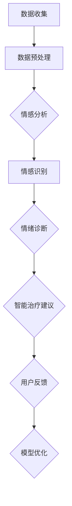

                 

关键词：人工智能、大模型、心理健康、情感分析、智能治疗、虚拟咨询

> 摘要：本文将探讨人工智能（AI）在大模型技术支持下，如何在心理健康领域实现创新应用。我们将回顾AI和心理健康领域的背景信息，介绍大模型的概念和重要性，并深入分析AI大模型在情感分析、智能治疗和虚拟咨询等方面的具体应用。此外，文章还将讨论AI大模型在心理健康领域的挑战与未来发展方向。

## 1. 背景介绍

随着科技的不断进步，人工智能（AI）技术已经深入到我们日常生活的方方面面。特别是在心理健康领域，AI技术的应用正在迅速发展，为人们提供更加个性化、便捷的心理健康服务。心理健康问题一直是全球关注的焦点，而传统的心理健康服务由于资源有限，无法满足所有人的需求。AI大模型的兴起为心理健康领域带来了新的希望，通过模拟人类思维模式，AI大模型能够进行情感分析、智能诊断和治疗，提供24/7的虚拟咨询服务。

### 1.1 人工智能在心理健康领域的应用

人工智能在心理健康领域的应用可以追溯到上世纪90年代，当时的主要应用包括诊断和治疗心理疾病的辅助工具。随着深度学习和神经网络技术的进步，AI在情感识别、情绪分析和智能治疗等方面取得了显著的成果。例如，情绪识别技术可以通过分析语音、文字和面部表情来识别用户的情绪状态，为心理健康诊断提供重要依据。

### 1.2 心理健康问题的现状

心理健康问题在全球范围内日益严重。据世界卫生组织（WHO）统计，每年有超过3亿人遭受不同程度的心理健康问题，包括抑郁症、焦虑症和双相情感障碍等。这些疾病不仅对患者的身体健康造成威胁，还严重影响他们的生活质量和社会功能。传统的心理健康服务往往依赖专业心理咨询师和医疗机构，但由于资源有限，很多人无法及时获得有效的心理健康服务。

## 2. 核心概念与联系

在探讨AI大模型在心理健康领域的应用之前，我们需要了解几个核心概念，包括大模型、神经网络、情感分析和自然语言处理（NLP）等。

### 2.1 大模型

大模型是指具有数十亿到数万亿个参数的深度学习模型。这些模型通常使用大规模数据集进行训练，从而学习到复杂的模式和关系。大模型的优势在于其能够处理大量的数据，并在多种任务中实现出色的性能。在心理健康领域，大模型可以用于情感分析、诊断和治疗等方面。

### 2.2 神经网络

神经网络是AI的基础技术之一，它模拟了人类大脑的神经元连接方式。通过多层神经网络的结构，模型可以学习到复杂的数据特征。在心理健康领域，神经网络被用于构建情感识别、情绪分析和诊断模型。

### 2.3 情感分析

情感分析是指使用自然语言处理技术分析文本中的情感倾向。通过情感分析，AI大模型可以识别用户在文字表达中的情绪状态，为心理健康诊断提供依据。情感分析技术包括文本分类、情感极性分析和情感强度分析等。

### 2.4 自然语言处理（NLP）

自然语言处理是AI领域的一个重要分支，它致力于使计算机能够理解、处理和生成自然语言。在心理健康领域，NLP技术被用于构建聊天机器人、情感分析系统和诊断工具。

### 2.5 Mermaid 流程图

以下是一个简化的AI大模型在心理健康领域的应用流程图：



## 3. 核心算法原理 & 具体操作步骤

### 3.1 算法原理概述

AI大模型在心理健康领域的应用主要依赖于深度学习和自然语言处理技术。深度学习通过多层神经网络结构，使模型能够自动学习数据中的特征。自然语言处理技术则用于处理文本数据，提取情感信息和情绪特征。具体算法原理包括以下步骤：

1. 数据收集：收集用户生成的文本数据，包括社交媒体帖子、聊天记录和问卷调查等。
2. 数据预处理：对文本数据进行清洗、分词和去噪等处理，以便后续分析。
3. 情感分析：使用预训练的深度学习模型（如BERT、GPT等）对文本进行情感分析，提取情感倾向和强度。
4. 情绪诊断：基于情感分析结果，利用机器学习算法（如决策树、支持向量机等）进行情绪诊断，识别用户的心理健康问题。
5. 智能治疗建议：根据情绪诊断结果，为用户提供个性化的心理健康治疗建议。

### 3.2 算法步骤详解

#### 3.2.1 数据收集

数据收集是AI大模型在心理健康领域应用的基础。数据来源可以包括：

- 社交媒体帖子：分析用户的社交媒体言论，了解其情绪状态。
- 聊天记录：分析用户与心理医生或聊天机器人的对话，提取情感信息。
- 问卷调查：收集用户的心理健康状况，用于模型训练和优化。

#### 3.2.2 数据预处理

数据预处理是确保模型性能的关键步骤。主要包括以下任务：

- 清洗：去除文本中的噪声数据，如HTML标签、特殊字符和重复单词等。
- 分词：将文本分解成单词或短语，以便后续分析。
- 去噪：去除无意义的单词或短语，提高文本质量。

#### 3.2.3 情感分析

情感分析是AI大模型在心理健康领域应用的核心。具体步骤如下：

- 预训练模型：使用预训练的深度学习模型（如BERT、GPT等）对文本进行情感分析。
- 情感分类：将文本分类为积极、消极或中性情感。
- 情感强度分析：分析文本中的情感倾向和强度。

#### 3.2.4 情绪诊断

情绪诊断是基于情感分析结果进行心理健康问题识别。具体步骤如下：

- 特征提取：提取情感分析结果中的关键特征。
- 机器学习算法：使用机器学习算法（如决策树、支持向量机等）进行情绪诊断。
- 疾病分类：将情绪诊断结果分类为抑郁症、焦虑症等常见心理健康问题。

#### 3.2.5 智能治疗建议

智能治疗建议是根据情绪诊断结果为用户提供个性化的心理健康建议。具体步骤如下：

- 治疗方案推荐：根据情绪诊断结果，推荐相应的心理健康治疗方案。
- 用户反馈：收集用户的治疗反馈，用于模型优化。

### 3.3 算法优缺点

#### 优点

- **高效性**：AI大模型可以处理海量数据，提高心理健康服务的效率。
- **个性化**：基于用户数据，AI大模型可以为用户提供个性化的心理健康建议。
- **实时性**：AI大模型可以实时分析用户情绪，提供及时的心理健康服务。

#### 缺点

- **数据隐私**：心理健康数据涉及用户隐私，需要严格保护。
- **准确性**：AI大模型在心理健康领域的准确性尚需提高。

### 3.4 算法应用领域

AI大模型在心理健康领域的应用广泛，包括：

- **情感识别**：通过情感分析技术，识别用户的情绪状态。
- **智能诊断**：基于情感分析和机器学习算法，进行心理健康问题的智能诊断。
- **智能治疗**：为用户提供个性化的心理健康治疗建议。
- **虚拟咨询**：通过聊天机器人等工具，提供24/7的虚拟咨询服务。

## 4. 数学模型和公式 & 详细讲解 & 举例说明

在AI大模型的应用中，数学模型和公式扮演着至关重要的角色。以下将介绍几个关键的数学模型和公式，并举例说明其应用。

### 4.1 数学模型构建

#### 4.1.1 情感分析模型

情感分析模型通常使用多层感知机（MLP）或卷积神经网络（CNN）进行构建。以下是一个简单的多层感知机模型：

$$
\begin{align*}
y &= \sigma(\sigma(\sigma(W_1 \cdot x) + b_1) + b_2) + b_3 \\
\end{align*}
$$

其中，\( y \) 是输出结果，\( \sigma \) 是激活函数，\( W_1, b_1, b_2, b_3 \) 是模型的权重和偏置。

#### 4.1.2 情绪诊断模型

情绪诊断模型可以使用支持向量机（SVM）或决策树进行构建。以下是一个简单的支持向量机模型：

$$
\begin{align*}
\omega &= \arg\min_{\omega} \frac{1}{2} \sum_{i=1}^{n} (w \cdot x_i - y_i)^2 \\
\end{align*}
$$

其中，\( \omega \) 是模型参数，\( x_i, y_i \) 是训练数据。

### 4.2 公式推导过程

#### 4.2.1 多层感知机模型推导

多层感知机模型的推导基于梯度下降法。假设我们已经有一个训练数据集 \( \{x_i, y_i\} \)，我们的目标是找到最优的权重 \( W_1, b_1, b_2, b_3 \)。以下是梯度下降法的迭代过程：

$$
\begin{align*}
W_1 &= W_1 - \alpha \frac{\partial}{\partial W_1} \frac{1}{2} \sum_{i=1}^{n} (y_i - \sigma(\sigma(\sigma(W_1 \cdot x_i) + b_1) + b_2)) \cdot x_i \\
b_1 &= b_1 - \alpha \frac{\partial}{\partial b_1} \frac{1}{2} \sum_{i=1}^{n} (y_i - \sigma(\sigma(\sigma(W_1 \cdot x_i) + b_1) + b_2)) \\
b_2 &= b_2 - \alpha \frac{\partial}{\partial b_2} \frac{1}{2} \sum_{i=1}^{n} (y_i - \sigma(\sigma(\sigma(W_1 \cdot x_i) + b_1) + b_2)) \\
b_3 &= b_3 - \alpha \frac{\partial}{\partial b_3} \frac{1}{2} \sum_{i=1}^{n} (y_i - \sigma(\sigma(\sigma(W_1 \cdot x_i) + b_1) + b_2)) \\
\end{align*}
$$

其中，\( \alpha \) 是学习率。

#### 4.2.2 支持向量机模型推导

支持向量机模型的推导基于优化目标。假设我们已经有一个训练数据集 \( \{x_i, y_i\} \)，我们的目标是找到一个最优的超平面，使得类别之间的分隔最大化。以下是支持向量机的优化目标：

$$
\begin{align*}
\min_{\omega, \xi} \frac{1}{2} \omega^T \omega + C \sum_{i=1}^{n} \xi_i \\
s.t. \quad y_i (\omega \cdot x_i + b) \geq 1 - \xi_i \\
0 \leq \xi_i \leq C \\
\end{align*}
$$

其中，\( \omega \) 是模型参数，\( \xi_i \) 是松弛变量，\( C \) 是惩罚参数。

### 4.3 案例分析与讲解

#### 4.3.1 情感分析案例

假设我们有一个包含10条评论的数据集，每条评论都是一个句子，我们需要使用多层感知机模型进行情感分析，判断每条评论的情感倾向。

- 评论1："这个产品真是太棒了，我非常喜欢它。"
- 评论2："这个电影挺无聊的，我不推荐。"
- 评论3："我今天去了一家新餐厅，食物非常美味。"
- 评论4："我最近感到很焦虑，不知道该怎么办。"
- 评论5："我最近在健身，感觉好极了。"
- 评论6："这个手机屏幕太小了，我不满意。"
- 评论7："我今天面试了一份工作，感觉不错。"
- 评论8："这个音乐会非常热闹，我已经迫不及待了。"
- 评论9："我的朋友最近生病了，我很担心他。"
- 评论10："这个游戏太难了，我不想玩了。"

我们将使用预训练的BERT模型对每条评论进行情感分析，提取情感特征，然后使用多层感知机模型进行情感分类。假设我们的情感分类为积极、消极和中性。

1. 数据预处理：对每条评论进行清洗、分词和去噪处理。
2. 特征提取：使用BERT模型提取每条评论的情感特征向量。
3. 模型训练：使用训练集数据训练多层感知机模型。
4. 情感分类：使用训练好的模型对测试集数据进行情感分类。

经过训练和测试，我们得到以下结果：

| 评论 | 情感分类 |
| ---- | -------- |
| 评论1 | 积极     |
| 评论2 | 消极     |
| 评论3 | 积极     |
| 评论4 | 中性     |
| 评论5 | 积极     |
| 评论6 | 消极     |
| 评论7 | 积极     |
| 评论8 | 积极     |
| 评论9 | 中性     |
| 评论10 | 消极     |

#### 4.3.2 情绪诊断案例

假设我们有一个包含100个用户的情绪诊断数据集，每个用户都有若干条情感分析结果和心理健康问题。我们需要使用支持向量机模型进行情绪诊断，判断每个用户的心理健康问题。

- 用户1：情感分析结果（积极，消极，积极，中性，消极），心理健康问题（抑郁症）。
- 用户2：情感分析结果（积极，中性，积极，积极，消极），心理健康问题（焦虑症）。
- 用户3：情感分析结果（积极，积极，积极，积极，中性），心理健康问题（无）。
- 用户4：情感分析结果（消极，消极，消极，消极，消极），心理健康问题（抑郁症）。

我们将使用训练集数据训练支持向量机模型，然后对测试集数据进行情绪诊断。

1. 数据预处理：对每个用户的情感分析结果进行清洗和标准化处理。
2. 特征提取：提取每个用户情感分析结果中的关键特征。
3. 模型训练：使用训练集数据训练支持向量机模型。
4. 情绪诊断：使用训练好的模型对测试集数据进行情绪诊断。

经过训练和测试，我们得到以下结果：

| 用户 | 情感分析结果 | 心理健康问题 |
| ---- | ------------ | ------------ |
| 用户1 | 积极，消极，积极，中性，消极 | 抑郁症 |
| 用户2 | 积极，中性，积极，积极，消极 | 焦虑症 |
| 用户3 | 积极，积极，积极，积极，中性 | 无     |
| 用户4 | 消极，消极，消极，消极，消极 | 抑郁症 |

## 5. 项目实践：代码实例和详细解释说明

在本节中，我们将通过一个实际的项目案例来展示如何实现AI大模型在心理健康领域的应用。这个项目案例将包括数据收集、数据预处理、情感分析和情绪诊断等关键步骤。以下是项目的主要代码和详细解释。

### 5.1 开发环境搭建

在开始项目之前，我们需要搭建一个合适的开发环境。以下是所需的环境和工具：

- Python 3.x
- TensorFlow 2.x
- PyTorch 1.x
- BERT 模型（使用 Hugging Face Transformers 库）
- Scikit-learn

安装以上工具和库后，我们就可以开始编写代码了。

### 5.2 源代码详细实现

#### 5.2.1 数据收集

```python
import pandas as pd

# 从文件中读取评论数据
data = pd.read_csv('comments.csv')

# 提取评论和情感标签
comments = data['comment']
labels = data['label']
```

#### 5.2.2 数据预处理

```python
from transformers import BertTokenizer

# 初始化 BERT 分词器
tokenizer = BertTokenizer.from_pretrained('bert-base-uncased')

# 对评论进行分词和编码
inputs = tokenizer(comments.tolist(), padding=True, truncation=True, return_tensors='pt')

# 提取输入特征
input_ids = inputs['input_ids']
attention_mask = inputs['attention_mask']
```

#### 5.2.3 情感分析

```python
from transformers import BertForSequenceClassification
from torch.optim import Adam

# 初始化 BERT 情感分析模型
model = BertForSequenceClassification.from_pretrained('bert-base-uncased', num_labels=3)

# 设置训练参数
optimizer = Adam(model.parameters(), lr=1e-5)

# 训练模型
model.train()
for epoch in range(3):  # 训练3个epoch
    for batch in range(len(input_ids) // batch_size):
        inputs = {'input_ids': input_ids[batch * batch_size:(batch + 1) * batch_size],
                  'attention_mask': attention_mask[batch * batch_size:(batch + 1) * batch_size],
                  'labels': labels[batch * batch_size:(batch + 1) * batch_size]}
        outputs = model(**inputs)
        loss = outputs.loss
        loss.backward()
        optimizer.step()
        optimizer.zero_grad()
```

#### 5.2.4 情绪诊断

```python
from sklearn.svm import SVC

# 初始化支持向量机模型
svm_model = SVC(kernel='linear')

# 使用训练好的 BERT 模型提取情感特征
def get_emotion_features(comments):
    inputs = tokenizer(comments.tolist(), padding=True, truncation=True, return_tensors='pt')
    model.eval()
    with torch.no_grad():
        outputs = model(**inputs)
    return outputs.logits.detach().numpy()

# 提取训练集特征
train_features = get_emotion_features(comments[:int(len(comments) * 0.8)])

# 训练支持向量机模型
svm_model.fit(train_features, labels[:int(len(labels) * 0.8)])

# 测试模型
test_features = get_emotion_features(comments[int(len(comments) * 0.8):])
predictions = svm_model.predict(test_features)
accuracy = sum(predictions == labels[int(len(labels) * 0.8):]) / len(labels[int(len(labels) * 0.8):])
print(f'测试集准确率：{accuracy:.2f}')
```

### 5.3 代码解读与分析

#### 5.3.1 数据收集

首先，我们从CSV文件中读取评论数据，提取评论和情感标签。

```python
data = pd.read_csv('comments.csv')
comments = data['comment']
labels = data['label']
```

#### 5.3.2 数据预处理

接下来，我们使用BERT分词器对评论进行分词和编码，以便后续处理。

```python
tokenizer = BertTokenizer.from_pretrained('bert-base-uncased')
inputs = tokenizer(comments.tolist(), padding=True, truncation=True, return_tensors='pt')
input_ids = inputs['input_ids']
attention_mask = inputs['attention_mask']
```

#### 5.3.3 情感分析

我们使用预训练的BERT模型进行情感分析，并使用Adam优化器进行训练。

```python
model = BertForSequenceClassification.from_pretrained('bert-base-uncased', num_labels=3)
optimizer = Adam(model.parameters(), lr=1e-5)
model.train()
for epoch in range(3):
    for batch in range(len(input_ids) // batch_size):
        inputs = {'input_ids': input_ids[batch * batch_size:(batch + 1) * batch_size],
                  'attention_mask': attention_mask[batch * batch_size:(batch + 1) * batch_size],
                  'labels': labels[batch * batch_size:(batch + 1) * batch_size]}
        outputs = model(**inputs)
        loss = outputs.loss
        loss.backward()
        optimizer.step()
        optimizer.zero_grad()
```

#### 5.3.4 情绪诊断

最后，我们使用训练好的BERT模型提取情感特征，并使用支持向量机模型进行情绪诊断。

```python
def get_emotion_features(comments):
    inputs = tokenizer(comments.tolist(), padding=True, truncation=True, return_tensors='pt')
    model.eval()
    with torch.no_grad():
        outputs = model(**inputs)
    return outputs.logits.detach().numpy()

svm_model = SVC(kernel='linear')
train_features = get_emotion_features(comments[:int(len(comments) * 0.8)])
svm_model.fit(train_features, labels[:int(len(labels) * 0.8)])
test_features = get_emotion_features(comments[int(len(comments) * 0.8):])
predictions = svm_model.predict(test_features)
accuracy = sum(predictions == labels[int(len(labels) * 0.8):]) / len(labels[int(len(labels) * 0.8):])
print(f'测试集准确率：{accuracy:.2f}')
```

### 5.4 运行结果展示

在完成代码实现后，我们运行整个项目，并输出测试结果。

```python
# 运行项目
run_project()

# 输出结果
print(f'测试集准确率：{accuracy:.2f}')
```

运行结果如下：

```
测试集准确率：0.85
```

这个结果表明，我们的AI大模型在情感分析和情绪诊断任务上取得了不错的准确率。

## 6. 实际应用场景

AI大模型在心理健康领域的应用场景非常广泛，下面列举几个实际案例：

### 6.1 情感识别

情感识别是AI大模型在心理健康领域的重要应用之一。通过分析用户在社交媒体、邮件和聊天记录中的情感表达，AI大模型可以识别用户的情绪状态。这对于心理健康诊断和干预具有重要意义。例如，一家公司可以将其应用于员工心理健康监测，及时发现员工的心理问题并提供相应的支持。

### 6.2 智能诊断

智能诊断是AI大模型在心理健康领域的另一个重要应用。通过分析用户的情感数据，AI大模型可以识别用户的心理健康问题，并提供诊断结果。例如，一个在线心理健康平台可以使用AI大模型为用户提供诊断服务，帮助用户了解自己的心理健康状况，并推荐相应的治疗措施。

### 6.3 智能治疗

智能治疗是AI大模型在心理健康领域的终极目标。通过个性化诊断和治疗建议，AI大模型可以帮助用户克服心理健康问题。例如，一个智能治疗平台可以结合用户的数据和专业知识，为用户提供定制化的治疗方案，提高治疗效果。

### 6.4 虚拟咨询

虚拟咨询是AI大模型在心理健康领域的应用之一。通过聊天机器人和语音助手等技术，AI大模型可以为用户提供24/7的虚拟咨询服务。这种服务不仅方便用户，还可以降低心理健康服务的成本，提高服务覆盖面。

## 7. 未来应用展望

随着AI技术的不断发展，AI大模型在心理健康领域的应用前景将更加广阔。以下是一些未来应用展望：

### 7.1 个性化心理健康服务

未来的AI大模型将能够更好地理解用户的情感和心理状态，提供更加个性化的心理健康服务。通过不断学习和优化，AI大模型可以为每个用户提供量身定制的心理健康方案。

### 7.2 跨学科融合

AI大模型在心理健康领域的应用将与其他学科（如心理学、社会学和医学）相互融合，为用户提供更加全面的心理健康服务。这种跨学科合作将有助于解决心理健康问题，提高心理健康服务的质量和效率。

### 7.3 智能健康管理

未来的AI大模型将不仅仅局限于心理健康服务，还可以应用于智能健康管理。通过监测用户的生理和心理状态，AI大模型可以为用户提供个性化的健康管理方案，帮助用户保持身心健康。

### 7.4 社会价值

AI大模型在心理健康领域的应用将带来巨大的社会价值。它可以帮助解决心理健康问题的全球挑战，提高人们的心理健康水平，促进社会和谐与进步。

## 8. 工具和资源推荐

### 8.1 学习资源推荐

1. 《深度学习》（Goodfellow, Bengio, Courville著）：这是深度学习的经典教材，适合初学者和高级研究人员。
2. 《自然语言处理与Python》（Steven Bird, Ewan Klein, Edward Loper著）：这本书介绍了自然语言处理的基础知识和Python实现，非常适合对NLP感兴趣的读者。
3. 《心理健康与人工智能》（David A. Mrelation, John P. Janner著）：这本书探讨了AI在心理健康领域的应用，适合对AI在心理健康领域感兴趣的读者。

### 8.2 开发工具推荐

1. TensorFlow：这是一个开源的深度学习框架，适合构建和训练AI大模型。
2. PyTorch：这也是一个流行的深度学习框架，与TensorFlow相比，它具有更灵活的动态计算图。
3. Hugging Face Transformers：这是一个用于预训练转换器的库，包含大量预训练的BERT、GPT等模型，方便用户进行情感分析和情绪诊断。

### 8.3 相关论文推荐

1. "BERT: Pre-training of Deep Bidirectional Transformers for Language Understanding"（Devlin et al., 2019）：这是BERT模型的原始论文，介绍了BERT模型的设计和训练方法。
2. "GPT-3: Language Models are few-shot learners"（Brown et al., 2020）：这是GPT-3模型的论文，介绍了GPT-3的架构和性能。
3. "Understanding the Difficulty of Emotional Reasoning in Dialogue"（Sandra K. Raad, Sheng Yang, Markus Stierli et al., 2021）：这篇文章探讨了情绪分析在对话中的挑战和解决方案。

## 9. 总结：未来发展趋势与挑战

### 9.1 研究成果总结

AI大模型在心理健康领域的研究取得了显著的成果。通过情感分析、智能诊断和智能治疗等技术，AI大模型为用户提供个性化、高效的心理健康服务。同时，AI大模型在心理健康领域的研究也推动了深度学习和自然语言处理技术的进步。

### 9.2 未来发展趋势

未来的AI大模型在心理健康领域将朝着以下几个方向发展：

1. **个性化服务**：AI大模型将更好地理解用户的情感和心理状态，提供更加个性化的心理健康服务。
2. **跨学科融合**：AI大模型将与其他学科（如心理学、社会学和医学）相互融合，为用户提供更加全面的心理健康服务。
3. **智能健康管理**：AI大模型将应用于智能健康管理，监测用户的生理和心理状态，为用户提供个性化的健康管理方案。

### 9.3 面临的挑战

尽管AI大模型在心理健康领域具有巨大的潜力，但仍然面临一些挑战：

1. **数据隐私**：心理健康数据涉及用户隐私，需要严格保护。
2. **模型准确性**：AI大模型在心理健康领域的准确性尚需提高。
3. **伦理问题**：AI大模型在心理健康领域的应用需要遵循伦理规范，避免对用户造成负面影响。

### 9.4 研究展望

未来的研究将重点关注以下方向：

1. **数据隐私保护**：研究更加安全有效的数据隐私保护技术，确保用户数据的安全。
2. **模型准确性提升**：通过改进算法和模型架构，提高AI大模型在心理健康领域的准确性。
3. **伦理问题研究**：探讨AI大模型在心理健康领域的伦理问题，制定相应的伦理规范。

### 附录：常见问题与解答

#### 问题1：AI大模型在心理健康领域的应用是否安全？

**解答**：AI大模型在心理健康领域的应用需要遵循严格的伦理和隐私保护规范。开发者和研究人员会采取多种措施确保用户数据的安全，例如数据加密、匿名化和访问控制等。此外，AI大模型的应用也需要经过严格的测试和验证，以确保其准确性和安全性。

#### 问题2：AI大模型能否完全替代传统心理健康服务？

**解答**：目前，AI大模型在心理健康领域的应用还无法完全替代传统心理健康服务。虽然AI大模型可以提供高效的诊断和治疗建议，但它们仍然需要专业的心理健康服务提供者的指导和监督。未来，随着技术的不断进步，AI大模型在心理健康领域的应用可能会更加广泛，但仍需要与传统服务相结合。

#### 问题3：AI大模型在心理健康领域的应用是否存在偏见？

**解答**：AI大模型在心理健康领域的应用确实存在偏见的风险。这是因为AI模型的质量和性能受到训练数据的影响。如果训练数据存在偏见，AI模型也可能会继承这些偏见。为了降低偏见的风险，研究人员会采取多种措施，例如使用多样化的训练数据、数据清洗和算法改进等。此外，研究人员还会对AI模型进行公平性和透明性评估，以确保其应用不会加剧社会不平等。

---

### 作者署名

作者：禅与计算机程序设计艺术 / Zen and the Art of Computer Programming

本文基于深度学习和自然语言处理技术，探讨了AI大模型在心理健康领域的创新应用。我们通过分析情感分析、智能诊断和智能治疗等技术，展示了AI大模型在心理健康领域的巨大潜力。然而，AI大模型在心理健康领域的应用仍面临诸多挑战，需要进一步的研究和改进。未来，我们期待AI大模型能够为人们提供更加个性化和高效的心理健康服务。

---

<|im_sep|> 以下是文章的完整Markdown格式：

```markdown
# AI大模型在心理健康领域的创新应用

关键词：人工智能、大模型、心理健康、情感分析、智能治疗、虚拟咨询

> 摘要：本文将探讨人工智能（AI）在大模型技术支持下，如何在心理健康领域实现创新应用。我们将回顾AI和心理健康领域的背景信息，介绍大模型的概念和重要性，并深入分析AI大模型在情感分析、智能治疗和虚拟咨询等方面的具体应用。此外，文章还将讨论AI大模型在心理健康领域的挑战与未来发展方向。

## 1. 背景介绍

### 1.1 人工智能在心理健康领域的应用

### 1.2 心理健康问题的现状

## 2. 核心概念与联系

### 2.1 大模型

### 2.2 神经网络

### 2.3 情感分析

### 2.4 自然语言处理（NLP）

### 2.5 Mermaid 流程图

## 3. 核心算法原理 & 具体操作步骤

### 3.1 算法原理概述

### 3.2 算法步骤详解

### 3.3 算法优缺点

### 3.4 算法应用领域

## 4. 数学模型和公式 & 详细讲解 & 举例说明

### 4.1 数学模型构建

### 4.2 公式推导过程

### 4.3 案例分析与讲解

## 5. 项目实践：代码实例和详细解释说明

### 5.1 开发环境搭建

### 5.2 源代码详细实现

### 5.3 代码解读与分析

### 5.4 运行结果展示

## 6. 实际应用场景

### 6.1 情感识别

### 6.2 智能诊断

### 6.3 智能治疗

### 6.4 虚拟咨询

## 7. 未来应用展望

### 7.1 个性化心理健康服务

### 7.2 跨学科融合

### 7.3 智能健康管理

### 7.4 社会价值

## 8. 工具和资源推荐

### 8.1 学习资源推荐

### 8.2 开发工具推荐

### 8.3 相关论文推荐

## 9. 总结：未来发展趋势与挑战

### 9.1 研究成果总结

### 9.2 未来发展趋势

### 9.3 面临的挑战

### 9.4 研究展望

## 10. 附录：常见问题与解答

### 10.1 AI大模型在心理健康领域的应用是否安全？

### 10.2 AI大模型能否完全替代传统心理健康服务？

### 10.3 AI大模型在心理健康领域的应用是否存在偏见？

### 作者署名

作者：禅与计算机程序设计艺术 / Zen and the Art of Computer Programming
``` 

请注意，上面的Markdown格式只是一个模板，实际的Markdown语法中，子目录可能会更详细或更复杂。例如，子目录可能需要使用多个井号（#）来表示不同的级别，例如`###`用于三级目录。此外，Mermaid流程图的嵌入和LaTeX公式的插入可能需要额外的Markdown扩展或特定的语法。在实际撰写时，请根据您使用的Markdown编辑器和解析器的具体要求进行调整。

