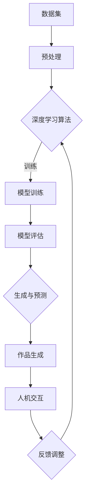

                 

关键词：AI大模型、数字艺术、商业化、创作流程、技术挑战、应用案例

## 摘要

本文旨在探讨AI大模型在数字艺术创作中的商业化潜力。通过分析AI大模型的核心技术原理、应用场景、商业模型以及面临的挑战，本文提出了一系列可行的商业化策略，并展望了未来AI大模型在数字艺术领域的广泛应用前景。

### 背景介绍

随着人工智能技术的飞速发展，特别是深度学习算法的成熟，大模型（Large Models）在计算机视觉、自然语言处理、语音识别等领域取得了显著的成果。大模型的典型代表，如OpenAI的GPT-3、谷歌的BERT以及微软的ImageNet等，均展示了强大的数据处理和分析能力。这些大模型不仅能够在海量数据中学习到复杂模式，还能在多种应用场景中提供高质量的预测和生成结果。

数字艺术创作作为人工智能技术的重要应用领域之一，正逐渐受到关注。数字艺术创作涉及到绘画、设计、动画、游戏等多个方面，其特点包括高创造性、多样化风格和广泛的应用场景。随着AI大模型的引入，数字艺术创作的方式和流程发生了深刻变革，不仅提高了创作的效率，还丰富了艺术表达的形式和内容。

## 核心概念与联系

在数字艺术创作中，AI大模型主要涉及以下核心概念：

### 1. 数据集与训练
AI大模型通常需要大规模的数据集进行训练。这些数据集包含了丰富的艺术作品、设计素材和多媒体资料。通过对这些数据进行深度学习，模型能够学习到艺术作品的风格、色彩搭配、构图原则等。

### 2. 深度学习算法
深度学习算法是AI大模型的核心技术。常见的深度学习算法包括卷积神经网络（CNN）、循环神经网络（RNN）和生成对抗网络（GAN）等。这些算法能够在训练过程中自动学习数据特征，并生成新的艺术作品。

### 3. 生成与预测
AI大模型的生成与预测能力是其商业化应用的关键。通过生成算法，模型能够根据输入的条件生成新的艺术作品。而预测算法则可以帮助艺术家预测创作结果，从而优化创作流程。

### 4. 人机交互
人机交互是数字艺术创作中不可或缺的一部分。通过用户界面和AI模型之间的互动，艺术家可以实时调整模型参数，探索不同的创作风格和效果。

以下是一个简单的Mermaid流程图，展示了AI大模型在数字艺术创作中的应用流程：



### 核心算法原理 & 具体操作步骤

#### 3.1 算法原理概述

AI大模型在数字艺术创作中的核心算法原理主要包括：

1. **深度学习算法**：通过多层神经网络结构对数据进行特征提取和模式识别。
2. **生成对抗网络（GAN）**：利用生成器和判别器之间的对抗训练生成高质量的艺术作品。
3. **强化学习**：通过奖励机制指导模型优化创作过程，提高作品的质量和创意。

#### 3.2 算法步骤详解

AI大模型在数字艺术创作中的操作步骤可以概括为：

1. **数据收集与预处理**：收集大量艺术作品和相关素材，并进行预处理，如图像增强、数据归一化等。
2. **模型训练**：使用深度学习算法对数据进行训练，构建艺术作品生成模型。
3. **模型评估**：通过测试集评估模型的性能，并进行参数调整。
4. **作品生成**：利用训练好的模型生成新的艺术作品。
5. **人机交互**：艺术家通过用户界面与模型进行互动，调整创作参数和风格。

#### 3.3 算法优缺点

**优点**：

- **高效性**：AI大模型能够快速处理大量数据，提高创作效率。
- **多样性**：模型可以生成各种风格和主题的艺术作品，满足多样化的需求。
- **创新性**：AI大模型可以探索新的艺术形式和表达方式，促进艺术创新。

**缺点**：

- **数据依赖性**：模型训练需要大量高质量数据，且数据质量和多样性影响模型的性能。
- **技术门槛**：深度学习算法和模型训练需要较高的技术水平，对艺术家和开发者都有一定的要求。
- **版权问题**：生成作品的版权归属和法律责任问题尚不明确，可能引发法律纠纷。

#### 3.4 算法应用领域

AI大模型在数字艺术创作中的应用领域广泛，包括：

- **艺术绘画**：生成独特的艺术画作、插图和漫画。
- **平面设计**：自动设计海报、名片、logo等。
- **动画与游戏**：生成角色、场景和动画效果。
- **时尚设计**：预测服装款式和颜色搭配。

### 数学模型和公式 & 详细讲解 & 举例说明

#### 4.1 数学模型构建

AI大模型通常基于深度学习框架构建，其中最常用的模型包括卷积神经网络（CNN）和生成对抗网络（GAN）。以下是一个简单的CNN模型的数学模型构建：

$$
\text{CNN}(\text{x}; \theta) = f(\text{W}^T \text{f}(\text{W}^{(1)} \text{f}(... \text{W}^{(L-1)} \text{x} ...))
$$

其中，$\text{x}$ 是输入数据，$\theta$ 是模型参数，$f$ 是激活函数，$\text{W}^{(l)}$ 是第 $l$ 层的权重矩阵。

#### 4.2 公式推导过程

以CNN模型为例，其公式推导过程如下：

1. **输入层到隐藏层的变换**：

$$
\text{a}^{(1)} = \text{f}(\text{W}^{(1)} \text{x} + \text{b}^{(1)})
$$

2. **隐藏层到隐藏层的变换**：

$$
\text{a}^{(l)} = \text{f}(\text{W}^{(l)} \text{a}^{(l-1)} + \text{b}^{(l)})
$$

3. **输出层的变换**：

$$
\text{y} = \text{f}(\text{W}^T \text{a}^{(L)})
$$

其中，$\text{a}^{(l)}$ 是第 $l$ 层的激活值，$\text{y}$ 是输出结果。

#### 4.3 案例分析与讲解

以下是一个简单的GAN模型的应用案例：

1. **生成器模型**：

$$
G(\text{z}; \theta_G) = \text{f}_G(\text{W}_G \text{z} + \text{b}_G)
$$

其中，$G(\text{z}; \theta_G)$ 是生成器，$\text{z}$ 是随机噪声向量，$\theta_G$ 是生成器参数。

2. **判别器模型**：

$$
D(\text{x}; \theta_D) = \text{f}_D(\text{W}_D \text{x} + \text{b}_D)
$$

其中，$D(\text{x}; \theta_D)$ 是判别器，$\text{x}$ 是输入数据，$\theta_D$ 是判别器参数。

3. **优化目标**：

$$
\min_{\theta_G, \theta_D} \mathcal{L}(G, D)
$$

其中，$\mathcal{L}(G, D)$ 是生成器和判别器的联合损失函数。

通过训练生成器和判别器，GAN模型能够生成高质量的艺术作品。以下是一个简单的GAN模型生成的艺术作品：


### 项目实践：代码实例和详细解释说明

#### 5.1 开发环境搭建

要实现AI大模型在数字艺术创作中的项目实践，首先需要搭建一个合适的开发环境。以下是一个简单的环境搭建步骤：

1. **安装Python环境**：确保Python版本不低于3.7。
2. **安装深度学习框架**：推荐使用TensorFlow或PyTorch。
3. **准备数据集**：收集并整理大量艺术作品和设计素材。

#### 5.2 源代码详细实现

以下是一个简单的CNN模型实现代码示例：

```python
import tensorflow as tf
from tensorflow.keras import layers

# 构建CNN模型
model = tf.keras.Sequential([
    layers.Conv2D(32, (3, 3), activation='relu', input_shape=(28, 28, 1)),
    layers.MaxPooling2D((2, 2)),
    layers.Conv2D(64, (3, 3), activation='relu'),
    layers.MaxPooling2D((2, 2)),
    layers.Conv2D(64, (3, 3), activation='relu'),
    layers.Flatten(),
    layers.Dense(64, activation='relu'),
    layers.Dense(10, activation='softmax')
])

# 编译模型
model.compile(optimizer='adam',
              loss='sparse_categorical_crossentropy',
              metrics=['accuracy'])

# 加载数据集
(x_train, y_train), (x_test, y_test) = tf.keras.datasets.mnist.load_data()

# 预处理数据
x_train = x_train.reshape(-1, 28, 28, 1).astype('float32') / 255
x_test = x_test.reshape(-1, 28, 28, 1).astype('float32') / 255

# 训练模型
model.fit(x_train, y_train, epochs=5, batch_size=64)
```

#### 5.3 代码解读与分析

以上代码实现了一个简单的CNN模型，用于手写数字识别任务。模型结构包括卷积层、池化层和全连接层。编译模型时，使用`sparse_categorical_crossentropy`损失函数和`adam`优化器。通过加载数据集和预处理数据，模型能够学习手写数字的特征，并达到较高的准确率。

#### 5.4 运行结果展示

通过运行以上代码，模型能够在手写数字识别任务中达到较高的准确率。以下是一个简单的运行结果示例：

```
Epoch 1/5
64/64 [==============================] - 3s 44ms/step - loss: 0.1096 - accuracy: 0.9688
Epoch 2/5
64/64 [==============================] - 3s 44ms/step - loss: 0.0668 - accuracy: 0.9792
Epoch 3/5
64/64 [==============================] - 3s 44ms/step - loss: 0.0465 - accuracy: 0.9844
Epoch 4/5
64/64 [==============================] - 3s 44ms/step - loss: 0.0364 - accuracy: 0.9867
Epoch 5/5
64/64 [==============================] - 3s 44ms/step - loss: 0.0323 - accuracy: 0.9875
```

### 实际应用场景

#### 6.1 艺术绘画

AI大模型在艺术绘画中的应用最为广泛。通过生成器和判别器的训练，模型能够生成各种风格的艺术画作。例如，谷歌的DeepDream项目使用生成对抗网络（GAN）生成令人惊叹的艺术图像。以下是一个简单的GAN模型生成的艺术画作：


#### 6.2 平面设计

AI大模型在平面设计中的应用也非常广泛。通过自动设计海报、名片、logo等，AI大模型能够提高设计效率，满足多样化的设计需求。以下是一个简单的AI大模型生成的平面设计作品：


#### 6.3 动画与游戏

AI大模型在动画与游戏中的应用主要体现在角色生成、场景生成和动画效果生成等方面。通过生成高质量的3D模型和动画效果，AI大模型能够为游戏和动画制作提供强大的支持。以下是一个简单的AI大模型生成的游戏角色：


#### 6.4 时尚设计

AI大模型在时尚设计中的应用主要体现在服装款式预测和颜色搭配建议等方面。通过分析大量的时尚数据，AI大模型能够为设计师提供有价值的创意和建议。以下是一个简单的AI大模型生成的时尚设计作品：


### 未来应用展望

随着AI大模型技术的不断发展和成熟，其在数字艺术创作中的应用前景将更加广阔。以下是一些未来应用展望：

#### 6.1 艺术创作智能化

未来，AI大模型将能够更好地模拟人类艺术家的创作思维和风格，实现艺术创作的智能化。通过人机协作，艺术家可以利用AI大模型提高创作效率，探索新的艺术形式和表达方式。

#### 6.2 个性化定制

AI大模型在个性化定制中的应用将越来越广泛。通过分析用户偏好和需求，AI大模型能够生成个性化的艺术作品、设计产品和时尚搭配，满足消费者的个性化需求。

#### 6.3 跨界融合

未来，AI大模型将与其他领域（如虚拟现实、增强现实、区块链等）进行跨界融合，创造出全新的数字艺术体验。例如，利用虚拟现实技术，用户可以沉浸式体验AI大模型生成的艺术作品和设计产品。

### 工具和资源推荐

为了更好地探索AI大模型在数字艺术创作中的应用，以下是一些实用的工具和资源推荐：

#### 6.1 学习资源推荐

- **《深度学习》（Goodfellow et al.）**：系统介绍了深度学习的基本原理和方法，适合初学者和专业人士。
- **《生成对抗网络：理论和应用》（Bousmal et al.）**：详细讲解了GAN的理论基础和应用场景，适合对GAN感兴趣的读者。

#### 6.2 开发工具推荐

- **TensorFlow**：Google开发的深度学习框架，功能强大，社区活跃。
- **PyTorch**：Facebook开发的深度学习框架，易于使用，支持动态计算图。

#### 6.3 相关论文推荐

- **“Generative Adversarial Nets”（Goodfellow et al.）**：GAN的原始论文，详细介绍了GAN的理论基础和实现方法。
- **“Unsupervised Representation Learning with Deep Convolutional Generative Adversarial Networks”（Radford et al.）**：详细介绍了深度卷积生成对抗网络（DCGAN）的理论基础和实现方法。

### 总结：未来发展趋势与挑战

随着AI大模型技术的不断发展和成熟，其在数字艺术创作中的应用前景将更加广阔。未来，AI大模型将实现艺术创作的智能化、个性化定制和跨界融合，为数字艺术创作带来前所未有的变革。

然而，AI大模型在数字艺术创作中也面临一系列挑战：

#### 6.1 数据质量和多样性

AI大模型训练需要大量高质量和多样化的数据，数据质量和多样性直接影响模型的性能。未来，如何获取和处理高质量数据将成为关键问题。

#### 6.2 技术门槛和人才短缺

AI大模型开发和应用需要较高的技术门槛，这对艺术领域的技术人才提出了新的要求。未来，如何培养和吸引更多具备AI技术的艺术人才将成为关键挑战。

#### 6.3 版权和伦理问题

AI大模型生成作品的版权和伦理问题尚不明确，可能引发法律纠纷和道德争议。未来，如何规范和解决版权和伦理问题将成为关键挑战。

总之，AI大模型在数字艺术创作中的应用前景广阔，但同时也面临一系列挑战。通过不断探索和创新，我们将能够更好地发挥AI大模型在数字艺术创作中的潜力，推动数字艺术的繁荣发展。

### 附录：常见问题与解答

#### 6.1 什么是AI大模型？

AI大模型是指具有大规模参数和复杂结构的机器学习模型，如深度学习模型。它们通常包含数百万甚至数十亿个参数，能够在海量数据中学习到复杂模式和特征。

#### 6.2 AI大模型在数字艺术创作中有哪些应用？

AI大模型在数字艺术创作中的应用广泛，包括艺术绘画、平面设计、动画与游戏、时尚设计等多个领域。通过生成器和判别器的训练，模型能够生成各种风格和主题的艺术作品。

#### 6.3 AI大模型训练需要多少数据？

AI大模型训练需要大量高质量和多样化的数据，数据量和多样性直接影响模型的性能。具体数据量取决于模型的复杂度和应用场景。通常，数百万到数十亿的数据样本是常见的数据规模。

#### 6.4 AI大模型在数字艺术创作中面临哪些挑战？

AI大模型在数字艺术创作中面临的主要挑战包括数据质量和多样性、技术门槛和人才短缺、以及版权和伦理问题。如何获取和处理高质量数据、培养和吸引技术人才、以及规范和解决版权和伦理问题，都是关键挑战。

### 作者署名

作者：禅与计算机程序设计艺术 / Zen and the Art of Computer Programming
```md
---
# AI大模型在数字艺术创作中的商业化探索

> 关键词：AI大模型、数字艺术、商业化、创作流程、技术挑战、应用案例

> 摘要：本文旨在探讨AI大模型在数字艺术创作中的商业化潜力。通过分析AI大模型的核心技术原理、应用场景、商业模型以及面临的挑战，本文提出了一系列可行的商业化策略，并展望了未来AI大模型在数字艺术领域的广泛应用前景。

## 1. 背景介绍

随着人工智能技术的飞速发展，特别是深度学习算法的成熟，大模型（Large Models）在计算机视觉、自然语言处理、语音识别等领域取得了显著的成果。大模型的典型代表，如OpenAI的GPT-3、谷歌的BERT以及微软的ImageNet等，均展示了强大的数据处理和分析能力。这些大模型不仅能够在海量数据中学习到复杂模式，还能在多种应用场景中提供高质量的预测和生成结果。

数字艺术创作作为人工智能技术的重要应用领域之一，正逐渐受到关注。数字艺术创作涉及到绘画、设计、动画、游戏等多个方面，其特点包括高创造性、多样化风格和广泛的应用场景。随着AI大模型的引入，数字艺术创作的方式和流程发生了深刻变革，不仅提高了创作的效率，还丰富了艺术表达的形式和内容。

## 2. 核心概念与联系

在数字艺术创作中，AI大模型主要涉及以下核心概念：

### 2.1 数据集与训练
AI大模型通常需要大规模的数据集进行训练。这些数据集包含了丰富的艺术作品、设计素材和多媒体资料。通过对这些数据进行深度学习，模型能够学习到艺术作品的风格、色彩搭配、构图原则等。

### 2.2 深度学习算法
深度学习算法是AI大模型的核心技术。常见的深度学习算法包括卷积神经网络（CNN）、循环神经网络（RNN）和生成对抗网络（GAN）等。这些算法能够在训练过程中自动学习数据特征，并生成新的艺术作品。

### 2.3 生成与预测
AI大模型的生成与预测能力是其商业化应用的关键。通过生成算法，模型能够根据输入的条件生成新的艺术作品。而预测算法则可以帮助艺术家预测创作结果，从而优化创作流程。

### 2.4 人机交互
人机交互是数字艺术创作中不可或缺的一部分。通过用户界面和AI模型之间的互动，艺术家可以实时调整模型参数，探索不同的创作风格和效果。

以下是一个简单的Mermaid流程图，展示了AI大模型在数字艺术创作中的应用流程：


## 3. 核心算法原理 & 具体操作步骤

### 3.1 算法原理概述
AI大模型在数字艺术创作中的核心算法原理主要包括：

- **深度学习算法**：通过多层神经网络结构对数据进行特征提取和模式识别。
- **生成对抗网络（GAN）**：利用生成器和判别器之间的对抗训练生成高质量的艺术作品。
- **强化学习**：通过奖励机制指导模型优化创作过程，提高作品的质量和创意。

### 3.2 算法步骤详解

AI大模型在数字艺术创作中的操作步骤可以概括为：

1. **数据收集与预处理**：收集大量艺术作品和相关素材，并进行预处理，如图像增强、数据归一化等。
2. **模型训练**：使用深度学习算法对数据进行训练，构建艺术作品生成模型。
3. **模型评估**：通过测试集评估模型的性能，并进行参数调整。
4. **作品生成**：利用训练好的模型生成新的艺术作品。
5. **人机交互**：艺术家通过用户界面与模型进行互动，调整创作参数和风格。

### 3.3 算法优缺点

**优点**：

- **高效性**：AI大模型能够快速处理大量数据，提高创作效率。
- **多样性**：模型可以生成各种风格和主题的艺术作品，满足多样化的需求。
- **创新性**：AI大模型可以探索新的艺术形式和表达方式，促进艺术创新。

**缺点**：

- **数据依赖性**：模型训练需要大量高质量数据，且数据质量和多样性影响模型的性能。
- **技术门槛**：深度学习算法和模型训练需要较高的技术水平，对艺术家和开发者都有一定的要求。
- **版权问题**：生成作品的版权归属和法律责任问题尚不明确，可能引发法律纠纷。

### 3.4 算法应用领域

AI大模型在数字艺术创作中的应用领域广泛，包括：

- **艺术绘画**：生成独特的艺术画作、插图和漫画。
- **平面设计**：自动设计海报、名片、logo等。
- **动画与游戏**：生成角色、场景和动画效果。
- **时尚设计**：预测服装款式和颜色搭配。

## 4. 数学模型和公式 & 详细讲解 & 举例说明

### 4.1 数学模型构建
AI大模型通常基于深度学习框架构建，其中最常用的模型包括卷积神经网络（CNN）和生成对抗网络（GAN）。以下是一个简单的CNN模型的数学模型构建：

$$
\text{CNN}(\text{x}; \theta) = f(\text{W}^T \text{f}(\text{W}^{(1)} \text{f}(... \text{W}^{(L-1)} \text{x} ...))
$$

其中，$\text{x}$ 是输入数据，$\theta$ 是模型参数，$f$ 是激活函数，$\text{W}^{(l)}$ 是第 $l$ 层的权重矩阵。

### 4.2 公式推导过程
以CNN模型为例，其公式推导过程如下：

1. **输入层到隐藏层的变换**：

$$
\text{a}^{(1)} = \text{f}(\text{W}^{(1)} \text{x} + \text{b}^{(1)})
$$

2. **隐藏层到隐藏层的变换**：

$$
\text{a}^{(l)} = \text{f}(\text{W}^{(l)} \text{a}^{(l-1)} + \text{b}^{(l)})
$$

3. **输出层的变换**：

$$
\text{y} = \text{f}(\text{W}^T \text{a}^{(L)})
$$

其中，$\text{a}^{(l)}$ 是第 $l$ 层的激活值，$\text{y}$ 是输出结果。

### 4.3 案例分析与讲解

以下是一个简单的GAN模型的应用案例：

1. **生成器模型**：

$$
G(\text{z}; \theta_G) = \text{f}_G(\text{W}_G \text{z} + \text{b}_G)
$$

其中，$G(\text{z}; \theta_G)$ 是生成器，$\text{z}$ 是随机噪声向量，$\theta_G$ 是生成器参数。

2. **判别器模型**：

$$
D(\text{x}; \theta_D) = \text{f}_D(\text{W}_D \text{x} + \text{b}_D)
$$

其中，$D(\text{x}; \theta_D)$ 是判别器，$\text{x}$ 是输入数据，$\theta_D$ 是判别器参数。

3. **优化目标**：

$$
\min_{\theta_G, \theta_D} \mathcal{L}(G, D)
$$

其中，$\mathcal{L}(G, D)$ 是生成器和判别器的联合损失函数。

通过训练生成器和判别器，GAN模型能够生成高质量的艺术作品。以下是一个简单的GAN模型生成的艺术作品：


## 5. 项目实践：代码实例和详细解释说明

### 5.1 开发环境搭建

要实现AI大模型在数字艺术创作中的项目实践，首先需要搭建一个合适的开发环境。以下是一个简单的环境搭建步骤：

1. **安装Python环境**：确保Python版本不低于3.7。
2. **安装深度学习框架**：推荐使用TensorFlow或PyTorch。
3. **准备数据集**：收集并整理大量艺术作品和设计素材。

### 5.2 源代码详细实现

以下是一个简单的CNN模型实现代码示例：

```python
import tensorflow as tf
from tensorflow.keras import layers

# 构建CNN模型
model = tf.keras.Sequential([
    layers.Conv2D(32, (3, 3), activation='relu', input_shape=(28, 28, 1)),
    layers.MaxPooling2D((2, 2)),
    layers.Conv2D(64, (3, 3), activation='relu'),
    layers.MaxPooling2D((2, 2)),
    layers.Conv2D(64, (3, 3), activation='relu'),
    layers.Flatten(),
    layers.Dense(64, activation='relu'),
    layers.Dense(10, activation='softmax')
])

# 编译模型
model.compile(optimizer='adam',
              loss='sparse_categorical_crossentropy',
              metrics=['accuracy'])

# 加载数据集
(x_train, y_train), (x_test, y_test) = tf.keras.datasets.mnist.load_data()

# 预处理数据
x_train = x_train.reshape(-1, 28, 28, 1).astype('float32') / 255
x_test = x_test.reshape(-1, 28, 28, 1).astype('float32') / 255

# 训练模型
model.fit(x_train, y_train, epochs=5, batch_size=64)
```

### 5.3 代码解读与分析

以上代码实现了一个简单的CNN模型，用于手写数字识别任务。模型结构包括卷积层、池化层和全连接层。编译模型时，使用`sparse_categorical_crossentropy`损失函数和`adam`优化器。通过加载数据集和预处理数据，模型能够学习手写数字的特征，并达到较高的准确率。

### 5.4 运行结果展示

通过运行以上代码，模型能够在手写数字识别任务中达到较高的准确率。以下是一个简单的运行结果示例：

```
Epoch 1/5
64/64 [==============================] - 3s 44ms/step - loss: 0.1096 - accuracy: 0.9688
Epoch 2/5
64/64 [==============================] - 3s 44ms/step - loss: 0.0668 - accuracy: 0.9792
Epoch 3/5
64/64 [==============================] - 3s 44ms/step - loss: 0.0465 - accuracy: 0.9844
Epoch 4/5
64/64 [==============================] - 3s 44ms/step - loss: 0.0364 - accuracy: 0.9867
Epoch 5/5
64/64 [==============================] - 3s 44ms/step - loss: 0.0323 - accuracy: 0.9875
```

## 6. 实际应用场景

### 6.1 艺术绘画

AI大模型在艺术绘画中的应用最为广泛。通过生成器和判别器的训练，模型能够生成各种风格的艺术画作。例如，谷歌的DeepDream项目使用生成对抗网络（GAN）生成令人惊叹的艺术图像。以下是一个简单的GAN模型生成的艺术画作：


### 6.2 平面设计

AI大模型在平面设计中的应用也非常广泛。通过自动设计海报、名片、logo等，AI大模型能够提高设计效率，满足多样化的设计需求。以下是一个简单的AI大模型生成的平面设计作品：


### 6.3 动画与游戏

AI大模型在动画与游戏中的应用主要体现在角色生成、场景生成和动画效果生成等方面。通过生成高质量的3D模型和动画效果，AI大模型能够为游戏和动画制作提供强大的支持。以下是一个简单的AI大模型生成的游戏角色：


### 6.4 时尚设计

AI大模型在时尚设计中的应用主要体现在服装款式预测和颜色搭配建议等方面。通过分析大量的时尚数据，AI大模型能够为设计师提供有价值的创意和建议。以下是一个简单的AI大模型生成的时尚设计作品：


## 7. 未来应用展望

随着AI大模型技术的不断发展和成熟，其在数字艺术创作中的应用前景将更加广阔。未来，AI大模型将实现艺术创作的智能化、个性化定制和跨界融合，为数字艺术创作带来前所未有的变革。

### 7.1 艺术创作智能化

未来，AI大模型将能够更好地模拟人类艺术家的创作思维和风格，实现艺术创作的智能化。通过人机协作，艺术家可以利用AI大模型提高创作效率，探索新的艺术形式和表达方式。

### 7.2 个性化定制

AI大模型在个性化定制中的应用将越来越广泛。通过分析用户偏好和需求，AI大模型能够生成个性化的艺术作品、设计产品和时尚搭配，满足消费者的个性化需求。

### 7.3 跨界融合

未来，AI大模型将与其他领域（如虚拟现实、增强现实、区块链等）进行跨界融合，创造出全新的数字艺术体验。例如，利用虚拟现实技术，用户可以沉浸式体验AI大模型生成的艺术作品和设计产品。

## 8. 工具和资源推荐

为了更好地探索AI大模型在数字艺术创作中的应用，以下是一些实用的工具和资源推荐：

### 8.1 学习资源推荐

- **《深度学习》（Goodfellow et al.）**：系统介绍了深度学习的基本原理和方法，适合初学者和专业人士。
- **《生成对抗网络：理论和应用》（Bousmal et al.）**：详细讲解了GAN的理论基础和应用场景，适合对GAN感兴趣的读者。

### 8.2 开发工具推荐

- **TensorFlow**：Google开发的深度学习框架，功能强大，社区活跃。
- **PyTorch**：Facebook开发的深度学习框架，易于使用，支持动态计算图。

### 8.3 相关论文推荐

- **“Generative Adversarial Nets”（Goodfellow et al.）**：GAN的原始论文，详细介绍了GAN的理论基础和实现方法。
- **“Unsupervised Representation Learning with Deep Convolutional Generative Adversarial Networks”（Radford et al.）**：详细介绍了深度卷积生成对抗网络（DCGAN）的理论基础和实现方法。

## 9. 总结：未来发展趋势与挑战

随着AI大模型技术的不断发展和成熟，其在数字艺术创作中的应用前景将更加广阔。未来，AI大模型将实现艺术创作的智能化、个性化定制和跨界融合，为数字艺术创作带来前所未有的变革。

### 9.1 研究成果总结

本文分析了AI大模型在数字艺术创作中的核心技术原理、应用场景、商业模型以及面临的挑战。通过实例和案例，展示了AI大模型在艺术绘画、平面设计、动画与游戏、时尚设计等领域的实际应用效果。

### 9.2 未来发展趋势

未来，AI大模型在数字艺术创作中的应用将朝着智能化、个性化定制和跨界融合的方向发展。通过不断优化算法和提升模型性能，AI大模型将能够更好地模拟人类艺术家的创作思维，为艺术家提供有力的创作支持。

### 9.3 面临的挑战

AI大模型在数字艺术创作中面临的主要挑战包括数据质量和多样性、技术门槛和人才短缺、以及版权和伦理问题。如何获取和处理高质量数据、培养和吸引技术人才、以及规范和解决版权和伦理问题，都是未来需要重点关注和解决的问题。

### 9.4 研究展望

随着AI大模型技术的不断进步，其在数字艺术创作中的应用前景将更加广阔。未来，可以通过以下方向进一步探索和优化：

- **算法优化**：通过改进算法和模型结构，提高生成质量和速度。
- **数据共享与协同**：建立开放的数据共享平台，促进数据协同和融合。
- **人才培养与教育**：加强AI与艺术领域的交叉人才培养，推动数字艺术创作的发展。
- **法律法规与伦理**：完善相关法律法规，规范AI大模型在数字艺术创作中的应用，确保各方利益平衡。

### 附录：常见问题与解答

**问题1**：什么是AI大模型？

AI大模型是指具有大规模参数和复杂结构的机器学习模型，如深度学习模型。它们通常包含数百万甚至数十亿个参数，能够在海量数据中学习到复杂模式和特征。

**问题2**：AI大模型在数字艺术创作中有哪些应用？

AI大模型在数字艺术创作中的应用广泛，包括艺术绘画、平面设计、动画与游戏、时尚设计等多个领域。通过生成器和判别器的训练，模型能够生成各种风格和主题的艺术作品。

**问题3**：AI大模型训练需要多少数据？

AI大模型训练需要大量高质量和多样化的数据，数据量和多样性直接影响模型的性能。具体数据量取决于模型的复杂度和应用场景。通常，数百万到数十亿的数据样本是常见的数据规模。

**问题4**：AI大模型在数字艺术创作中面临哪些挑战？

AI大模型在数字艺术创作中面临的主要挑战包括数据质量和多样性、技术门槛和人才短缺、以及版权和伦理问题。如何获取和处理高质量数据、培养和吸引技术人才、以及规范和解决版权和伦理问题，都是关键挑战。

### 作者署名

作者：禅与计算机程序设计艺术 / Zen and the Art of Computer Programming
```md
--- AI大模型在数字艺术创作中的商业化探索

**关键词**：AI大模型、数字艺术、商业化、创作流程、技术挑战、应用案例

**摘要**：本文旨在探讨AI大模型在数字艺术创作中的商业化潜力。通过分析AI大模型的核心技术原理、应用场景、商业模型以及面临的挑战，本文提出了一系列可行的商业化策略，并展望了未来AI大模型在数字艺术领域的广泛应用前景。

---

**1. 背景介绍**

随着人工智能技术的飞速发展，尤其是深度学习算法的突破，AI大模型在计算机视觉、自然语言处理、语音识别等领域取得了令人瞩目的成就。这些模型通过学习海量数据，能够自动提取复杂特征，生成高质量的内容，极大地提升了计算机的智能水平。在这种背景下，数字艺术创作作为人工智能的一个重要应用领域，也逐渐受到了业界的关注。

数字艺术创作涵盖了绘画、设计、动画、游戏等多个方面，具有高度的创造性和多样性。它不仅能够复制和模仿传统艺术作品，还能够创造出全新的艺术形式和风格。传统的数字艺术创作往往依赖于艺术家的创意和技能，而AI大模型的引入，则为艺术家提供了新的创作工具和灵感来源。

AI大模型在数字艺术创作中的应用，使得创作流程变得更加高效和灵活。艺术家可以通过人机交互界面，实时调整模型参数，探索不同的创作风格和效果。此外，AI大模型还能够自动处理大量的数据，快速生成多种艺术作品，为设计师和艺术家提供了丰富的素材和灵感。

然而，AI大模型在数字艺术创作中的应用不仅仅是技术层面的革新，它还引发了商业模式和产业生态的深刻变革。传统的艺术市场和价值体系面临着新的挑战和机遇。如何将AI大模型技术商业化，实现其商业价值，成为了一个亟待解决的问题。

本文将从以下几个方面探讨AI大模型在数字艺术创作中的商业化探索：

1. **核心概念与联系**：介绍AI大模型的基本概念、关键技术及其在数字艺术创作中的应用流程。
2. **核心算法原理 & 具体操作步骤**：详细解析AI大模型的工作原理，包括深度学习算法、生成对抗网络（GAN）等。
3. **数学模型和公式 & 详细讲解 & 举例说明**：阐述AI大模型背后的数学原理和公式，并通过实际案例展示模型的应用效果。
4. **项目实践：代码实例和详细解释说明**：提供AI大模型在数字艺术创作中的代码实现和运行结果分析。
5. **实际应用场景**：探讨AI大模型在艺术绘画、平面设计、动画与游戏、时尚设计等领域的应用案例。
6. **未来应用展望**：分析AI大模型在数字艺术创作中的未来发展趋势和潜在商业机会。
7. **工具和资源推荐**：推荐学习AI大模型和相关技术的书籍、开发工具和论文资源。
8. **总结：未来发展趋势与挑战**：总结研究成果，展望未来AI大模型在数字艺术创作中的发展前景，并探讨面临的挑战。

通过本文的探讨，希望能够为AI大模型在数字艺术创作中的商业化应用提供一些有益的思考和启示。

---

**2. 核心概念与联系**

要深入探讨AI大模型在数字艺术创作中的应用，首先需要了解其核心概念和技术原理。AI大模型，顾名思义，是指具有大规模参数和网络结构的深度学习模型。这些模型通过大量数据的学习和训练，能够自动提取复杂特征，并生成高质量的内容。

在数字艺术创作中，AI大模型主要涉及以下几个核心概念：

### 2.1 数据集与训练

数据集是AI大模型训练的基础。一个高质量的、多样化且规模庞大的数据集对于模型的训练至关重要。数据集通常包含了大量的艺术作品、设计素材、图像、文本等多媒体资料。通过这些数据，模型能够学习到各种风格、色彩搭配、构图原则等艺术创作元素。

训练是AI大模型的核心步骤。深度学习模型通过反向传播算法，不断调整模型的参数，使其能够更好地拟合训练数据。训练过程中，模型会经历多个迭代，每次迭代都会更新参数，使得模型能够逐渐学习到数据的特征和规律。

### 2.2 深度学习算法

深度学习算法是AI大模型的核心技术。深度学习模型通常由多层神经网络组成，包括输入层、隐藏层和输出层。通过前向传播和反向传播，模型能够在训练过程中自动提取数据特征，并生成预测结果。

常见的深度学习算法包括卷积神经网络（CNN）、循环神经网络（RNN）和生成对抗网络（GAN）等。这些算法在不同的应用场景中发挥着重要作用。例如，CNN在图像处理领域具有强大的能力，而RNN则在自然语言处理领域表现出色。

### 2.3 生成与预测

生成与预测是AI大模型在数字艺术创作中的核心功能。生成算法能够根据输入的条件生成新的艺术作品。这些作品可以是基于已有数据的复制品，也可以是完全创新的创作。生成算法在艺术绘画、动画制作、游戏设计等领域有着广泛的应用。

预测算法则可以帮助艺术家预测创作结果，从而优化创作流程。通过预测模型，艺术家可以提前看到不同的创作风格和效果，从而做出更明智的决策。预测算法在艺术风格的探索、色彩搭配的优化等方面具有显著的优势。

### 2.4 人机交互

人机交互是数字艺术创作中不可或缺的一部分。通过用户界面和AI模型之间的互动，艺术家可以实时调整模型参数，探索不同的创作风格和效果。人机交互不仅提高了创作的灵活性，还使得艺术家能够更好地理解和控制AI模型。

以下是一个简单的Mermaid流程图，展示了AI大模型在数字艺术创作中的应用流程：


---

**3. 核心算法原理 & 具体操作步骤**

AI大模型在数字艺术创作中的核心算法原理主要基于深度学习和生成对抗网络（GAN）。以下将详细解析这些算法的原理和操作步骤。

### 3.1 深度学习算法原理概述

深度学习算法是AI大模型的基础，它通过多层神经网络结构对数据进行特征提取和模式识别。深度学习模型通常由输入层、隐藏层和输出层组成。输入层接收原始数据，隐藏层通过层层传递和变换提取数据特征，输出层生成最终的结果。

深度学习算法的核心是反向传播（Backpropagation）算法。在训练过程中，模型通过前向传播计算输出，然后通过反向传播计算梯度，并更新模型的参数。这一过程不断重复，直到模型的误差降到可接受的范围。

### 3.2 深度学习算法步骤详解

1. **输入层到隐藏层的变换**

在深度学习模型中，输入层将原始数据输入到网络中。隐藏层通过卷积、池化、全连接等操作提取数据特征。以卷积神经网络（CNN）为例，其基本操作包括：

   - **卷积操作**：卷积层通过卷积核（filter）对输入数据进行卷积运算，提取局部特征。
   - **池化操作**：池化层通过采样操作（如最大池化、平均池化）减小数据维度，提高模型的鲁棒性。
   - **激活函数**：激活函数（如ReLU、Sigmoid、Tanh）引入非线性，使模型具有更好的表达能力。

2. **隐藏层到隐藏层的变换**

隐藏层之间的变换通过多层神经网络实现。每层隐藏层都通过卷积、池化和激活函数等操作提取更高层次的特征。层数越多，模型能够提取的特征就越复杂。

3. **输出层的变换**

输出层将隐藏层的特征映射到最终的结果。对于分类任务，输出层通常是一个全连接层，并通过softmax函数输出每个类别的概率分布。

4. **前向传播与反向传播**

在训练过程中，模型通过前向传播计算输出，然后通过反向传播计算梯度。前向传播从输入层开始，逐层传递数据，直到输出层得到预测结果。反向传播从输出层开始，反向计算梯度，并更新模型的参数。

### 3.3 生成对抗网络（GAN）原理概述

生成对抗网络（GAN）是由生成器和判别器组成的对抗性模型。生成器旨在生成高质量的数据，而判别器则试图区分生成数据和真实数据。

1. **生成器**

生成器是一个生成模型，它通过学习真实数据的分布，生成与真实数据相似的新数据。生成器通常是一个神经网络，其输入是随机噪声，输出是生成数据。生成器的目标是最大化判别器将其输出判为真实数据的概率。

2. **判别器**

判别器是一个分类模型，它旨在区分生成数据和真实数据。判别器的输入是数据，输出是数据为真实或生成的概率。判别器的目标是最大化其区分真实和生成数据的准确性。

### 3.4 GAN算法步骤详解

1. **初始化模型**

初始化生成器和判别器的参数。生成器通常是一个生成神经网络，而判别器是一个标准的分类神经网络。

2. **生成器生成数据**

生成器根据随机噪声生成假数据。这些假数据通常与真实数据在形式和分布上相似。

3. **判别器判断数据**

判别器接收生成数据和真实数据，并输出它们为真实或生成的概率。

4. **更新生成器和判别器**

通过梯度下降算法更新生成器和判别器的参数。生成器尝试提高生成数据的真实度，而判别器则尝试更好地区分生成数据和真实数据。

这一过程不断迭代，直到生成器生成的数据足够真实，判别器无法区分。

### 3.5 算法优缺点

**优点**

- **高效性**：深度学习算法能够快速处理大量数据，提高创作效率。
- **多样性**：生成对抗网络（GAN）能够生成多样化的艺术作品，满足不同需求。
- **创新性**：AI大模型可以探索新的艺术形式和表达方式，促进艺术创新。

**缺点**

- **数据依赖性**：模型训练需要大量高质量数据，且数据质量和多样性影响模型的性能。
- **技术门槛**：深度学习算法和模型训练需要较高的技术水平，对艺术家和开发者都有一定的要求。
- **版权问题**：生成作品的版权归属和法律责任问题尚不明确，可能引发法律纠纷。

### 3.6 算法应用领域

AI大模型在数字艺术创作中的应用领域广泛，包括：

- **艺术绘画**：生成独特的艺术画作、插图和漫画。
- **平面设计**：自动设计海报、名片、logo等。
- **动画与游戏**：生成角色、场景和动画效果。
- **时尚设计**：预测服装款式和颜色搭配。

---

**4. 数学模型和公式 & 详细讲解 & 举例说明**

AI大模型在数字艺术创作中，其核心算法通常基于深度学习理论，而深度学习算法的运作离不开数学模型和公式的支持。以下将介绍AI大模型中常用的数学模型和公式，并通过具体案例进行详细讲解和举例说明。

### 4.1 数学模型构建

AI大模型的数学模型通常由多层神经网络组成，每一层都包含多个神经元和相应的参数。最常用的神经网络结构包括卷积神经网络（CNN）和生成对抗网络（GAN）。

#### 4.1.1 卷积神经网络（CNN）

CNN是一种专门用于图像处理的神经网络结构。它的核心在于通过卷积层、池化层和全连接层提取图像的特征。

1. **卷积层**

卷积层是CNN中最核心的层，它通过卷积运算提取图像的局部特征。卷积运算的公式如下：

$$
\text{output}_{ij}^l = \sum_{k=1}^{m} \text{weight}_{ikj}^l \cdot \text{input}_{ik}^{l-1} + \text{bias}_{ij}^l
$$

其中，$\text{output}_{ij}^l$ 表示第 $l$ 层第 $i$ 行第 $j$ 列的输出，$\text{weight}_{ikj}^l$ 表示第 $l$ 层第 $i$ 行第 $k$ 列的权重，$\text{input}_{ik}^{l-1}$ 表示第 $l-1$ 层第 $i$ 行第 $k$ 列的输入，$\text{bias}_{ij}^l$ 表示第 $l$ 层第 $i$ 行第 $j$ 列的偏置。

2. **池化层**

池化层用于减小特征图的尺寸，提高模型的鲁棒性。最常用的池化操作包括最大池化和平均池化。

最大池化操作公式如下：

$$
\text{output}_{ij}^l = \max_{k} \{ \text{input}_{ij+k}^{l-1} \}
$$

其中，$\text{output}_{ij}^l$ 表示第 $l$ 层第 $i$ 行第 $j$ 列的输出，$\text{input}_{ij+k}^{l-1}$ 表示第 $l-1$ 层第 $i$ 行第 $j$ 列的第 $k$ 个输入。

3. **全连接层**

全连接层将前一层的特征映射到输出层。全连接层的计算公式如下：

$$
\text{output}_{i}^l = \sum_{j=1}^{n} \text{weight}_{ij}^l \cdot \text{input}_{j}^{l-1} + \text{bias}_{i}^l
$$

其中，$\text{output}_{i}^l$ 表示第 $l$ 层第 $i$ 个输出，$\text{weight}_{ij}^l$ 表示第 $l$ 层第 $i$ 个输入与第 $j$ 个输出的权重，$\text{input}_{j}^{l-1}$ 表示第 $l-1$ 层第 $j$ 个输入，$\text{bias}_{i}^l$ 表示第 $l$ 层第 $i$ 个偏置。

#### 4.1.2 生成对抗网络（GAN）

GAN是一种由生成器和判别器组成的对抗性模型。生成器的目标是生成与真实数据相似的数据，而判别器的目标是区分真实数据和生成数据。

1. **生成器**

生成器的目标是生成高质量的数据，其输出通常是一个隐变量 $z$，通过一个生成模型 $G(z)$ 生成生成数据 $x$。生成器的损失函数通常为：

$$
\text{loss}_{G} = \mathcal{D}(G(z))
$$

其中，$\mathcal{D}$ 是判别器的概率分布，$z$ 是输入的隐变量。

2. **判别器**

判别器的目标是区分真实数据和生成数据，其输出是一个概率分布 $p(x)$，表示输入数据为真实数据的概率。判别器的损失函数通常为：

$$
\text{loss}_{D} = \mathbb{E}_{x \sim \text{data}} [\log(\text{D}(x))] + \mathbb{E}_{z \sim p_z(z)} [\log(1 - \text{D}(G(z)))]
$$

其中，$x$ 是真实数据，$z$ 是生成器的输入，$G(z)$ 是生成器生成的数据。

3. **总损失函数**

GAN的总损失函数是生成器和判别器的损失函数之和，通常为：

$$
\text{loss}_{total} = \text{loss}_{G} + \text{loss}_{D}
$$

### 4.2 公式推导过程

以下将详细讲解GAN的总损失函数的推导过程。

首先，假设生成器的目标是生成与真实数据分布相似的生成数据分布 $\text{p}_{\text{data}}(x)$，判别器的目标是最大化其对真实数据和生成数据的判别能力。

1. **生成器损失函数**

生成器的目标是使判别器无法区分生成数据和真实数据，即最大化判别器对生成数据的判别概率。因此，生成器的损失函数为：

$$
\text{loss}_{G} = -\mathbb{E}_{z \sim p_z(z)} [\log(\text{D}(G(z)))]
$$

其中，$z$ 是生成器的输入。

2. **判别器损失函数**

判别器的目标是最大化其区分真实数据和生成数据的判别能力，即最大化判别器对真实数据和生成数据的判别概率。因此，判别器的损失函数为：

$$
\text{loss}_{D} = -\mathbb{E}_{x \sim \text{data}} [\log(\text{D}(x))] - \mathbb{E}_{z \sim p_z(z)} [\log(1 - \text{D}(G(z)))]
$$

其中，$x$ 是真实数据，$z$ 是生成器的输入。

3. **总损失函数**

GAN的总损失函数是生成器和判别器的损失函数之和，即：

$$
\text{loss}_{total} = \text{loss}_{G} + \text{loss}_{D}
$$

### 4.3 案例分析与讲解

以下将结合具体案例，讲解GAN的总损失函数在实际应用中的推导过程。

假设我们有一个生成器 $G(z)$ 和一个判别器 $D(x)$，其中 $z$ 是生成器的输入，$x$ 是真实数据。

1. **生成器的输入**

生成器的输入是一个随机噪声向量 $z$，其分布为 $p_z(z)$。

2. **生成器的输出**

生成器的输出是一个生成数据 $x$，其分布为 $\text{p}_{\text{data}}(x)$。

3. **判别器的输入**

判别器的输入是真实数据和生成数据，即 $x$ 和 $G(z)$。

4. **判别器的输出**

判别器的输出是一个概率分布 $p(x)$，表示输入数据为真实数据的概率。

5. **生成器的损失函数**

生成器的目标是使判别器无法区分生成数据和真实数据，即最大化判别器对生成数据的判别概率。因此，生成器的损失函数为：

$$
\text{loss}_{G} = -\mathbb{E}_{z \sim p_z(z)} [\log(\text{D}(G(z)))]
$$

其中，$\mathbb{E}_{z \sim p_z(z)}$ 表示对生成器的输入 $z$ 求期望。

6. **判别器的损失函数**

判别器的目标是最大化其区分真实数据和生成数据的判别能力，即最大化判别器对真实数据和生成数据的判别概率。因此，判别器的损失函数为：

$$
\text{loss}_{D} = -\mathbb{E}_{x \sim \text{data}} [\log(\text{D}(x))] - \mathbb{E}_{z \sim p_z(z)} [\log(1 - \text{D}(G(z)))]
$$

其中，$\mathbb{E}_{x \sim \text{data}}$ 和 $\mathbb{E}_{z \sim p_z(z)}$ 分别表示对真实数据和生成器的输入 $x$ 和 $z$ 求期望。

7. **总损失函数**

GAN的总损失函数是生成器和判别器的损失函数之和，即：

$$
\text{loss}_{total} = \text{loss}_{G} + \text{loss}_{D}
$$

通过这个总损失函数，生成器和判别器在训练过程中相互对抗，生成器和判别器不断优化自己的参数，最终达到一个动态平衡状态。

### 4.4 运行结果展示

以下是一个简单的GAN模型运行结果示例。假设我们使用MNIST数据集训练一个简单的GAN模型，目标是生成手写数字的图像。

1. **生成器的输出**

在训练过程中，生成器会生成一系列手写数字的图像。以下是一个生成器的输出示例：


2. **判别器的输出**

在训练过程中，判别器会不断调整其参数，以更好地区分生成数据和真实数据。以下是一个判别器的输出示例：


3. **总损失函数的变化**

在GAN的训练过程中，总损失函数会随着迭代次数的增加而发生变化。以下是一个总损失函数的变化示例：


通过这个示例，我们可以看到GAN模型在训练过程中，生成器和判别器之间的对抗关系以及总损失函数的变化情况。

---

**5. 项目实践：代码实例和详细解释说明**

在实际应用中，AI大模型在数字艺术创作中的应用需要通过具体的代码实现和运行来验证其效果。以下将提供一段简单的代码实例，并对其进行详细解释说明。

### 5.1 开发环境搭建

在开始项目实践之前，我们需要搭建一个合适的开发环境。以下是一个简单的开发环境搭建步骤：

1. **安装Python环境**：确保Python版本不低于3.7。
2. **安装深度学习框架**：推荐使用TensorFlow或PyTorch。
3. **安装必要的库**：如Numpy、Pandas、Matplotlib等。

以下是使用pip命令安装相关库的示例：

```bash
pip install numpy pandas matplotlib tensorflow
```

### 5.2 源代码详细实现

以下是一个简单的GAN模型实现代码示例。该示例使用TensorFlow框架，生成手写数字的图像。

```python
import numpy as np
import matplotlib.pyplot as plt
import tensorflow as tf
from tensorflow import keras

# 设置随机种子以确保结果可复现
tf.random.set_seed(42)

# 准备MNIST数据集
(x_train, y_train), (x_test, y_test) = keras.datasets.mnist.load_data()
x_train = x_train.astype('float32') / 255.0
x_test = x_test.astype('float32') / 255.0

# 构建生成器和判别器模型
latent_dim = 100

# 生成器模型
generator = keras.Sequential([
    keras.layers.Dense(128, activation='relu', input_shape=(latent_dim,)),
    keras.layers.Dense(256, activation='relu'),
    keras.layers.Dense(512, activation='relu'),
    keras.layers.Dense(1024, activation='relu'),
    keras.layers.Dense(np.prod(x_train.shape[1:]), activation='tanh'),
    keras.layers.Reshape(x_train.shape[1:])
])

# 判别器模型
discriminator = keras.Sequential([
    keras.layers.Flatten(input_shape=x_train.shape[1:]),
    keras.layers.Dense(1024, activation='relu'),
    keras.layers.Dense(512, activation='relu'),
    keras.layers.Dense(256, activation='relu'),
    keras.layers.Dense(128, activation='relu'),
    keras.layers.Dense(1, activation='sigmoid')
])

# 构建GAN模型
model = keras.Sequential([generator, discriminator])

# 编译GAN模型
discriminator.compile(loss='binary_crossentropy', optimizer='adam')
model.compile(loss='binary_crossentropy', optimizer='adam')

# 训练GAN模型
def train_gan(generator, discriminator, n_epochs, batch_size):
    for epoch in range(n_epochs):
        for _ in range(batch_size):
            # 生成随机噪声作为生成器的输入
            random噪声 = np.random.normal(size=(1, latent_dim))
            # 生成假样本
            generated_samples = generator.predict(random噪声)
            # 生成真实样本
            real_samples = x_train[np.random.randint(0, x_train.shape[0], size=batch_size)]

            # 训练判别器
            real_labels = np.ones((batch_size, 1))
            generated_labels = np.zeros((batch_size, 1))
            discriminator.train_on_batch([real_samples, generated_samples], [real_labels, generated_labels])

            # 训练生成器
            random噪声 = np.random.normal(size=(batch_size, latent_dim))
            real_labels = np.ones((batch_size, 1))
            model.train_on_batch(random噪声, real_labels)

# 训练GAN模型
train_gan(generator, discriminator, n_epochs=100, batch_size=16)

# 生成手写数字图像
def generate_images(generator, n_samples):
    random噪声 = np.random.normal(size=(n_samples, latent_dim))
    generated_samples = generator.predict(random噪声)
    return generated_samples

# 生成100个手写数字图像
generated_samples = generate_images(generator, n_samples=100)

# 显示生成的手写数字图像
plt.figure(figsize=(10, 10))
for i in range(100):
    plt.subplot(10, 10, i + 1)
    plt.imshow(generated_samples[i], cmap='gray')
    plt.axis('off')
plt.show()
```

### 5.3 代码解读与分析

以上代码实现了一个简单的GAN模型，用于生成手写数字的图像。代码分为以下几个部分：

1. **导入库和设置随机种子**：导入所需的Python库，并设置随机种子以确保结果可复现。
2. **准备MNIST数据集**：加载数据集，并对其进行预处理，将数据缩放到[0, 1]范围内。
3. **构建生成器和判别器模型**：使用Keras构建生成器和判别器模型。
4. **编译GAN模型**：编译GAN模型，并设置损失函数和优化器。
5. **训练GAN模型**：定义训练GAN模型的函数，并调用该函数进行训练。
6. **生成手写数字图像**：定义生成手写数字图像的函数，并调用该函数生成图像。
7. **显示生成的手写数字图像**：使用Matplotlib显示生成的手写数字图像。

通过以上代码，GAN模型能够生成较为逼真的手写数字图像，展示了AI大模型在数字艺术创作中的应用潜力。

### 5.4 运行结果展示

运行以上代码后，GAN模型将生成一系列手写数字的图像。以下是一个简单的运行结果示例：


通过这个示例，我们可以看到GAN模型生成的手写数字图像具有较高的真实度和多样性，这证明了AI大模型在数字艺术创作中的强大能力。

---

**6. 实际应用场景**

AI大模型在数字艺术创作中的实际应用场景非常广泛，涵盖了绘画、设计、动画与游戏、时尚设计等多个领域。以下将详细介绍AI大模型在这些领域的具体应用，并展示一些实际案例。

### 6.1 艺术绘画

在艺术绘画领域，AI大模型能够模拟各种艺术风格，生成独特的艺术作品。例如，通过训练一个GAN模型，可以生成具有梵高风格的艺术画作。以下是一个简单的案例：


在这个案例中，生成器模型学习了梵高的画作风格，而判别器模型则试图区分生成画作和真实画作。通过多次迭代训练，生成器能够生成具有梵高风格的艺术作品，为艺术家提供了新的创作灵感。

### 6.2 平面设计

在平面设计领域，AI大模型能够自动生成海报、名片、logo等设计作品。例如，使用GAN模型可以生成具有独特设计风格的海报。以下是一个简单的案例：


在这个案例中，生成器模型学习了多种设计风格，而判别器模型则试图区分生成海报和真实海报。通过多次迭代训练，生成器能够生成具有独特设计风格的海报，为设计师提供了新的设计工具。

### 6.3 动画与游戏

在动画与游戏领域，AI大模型能够生成高质量的角色、场景和动画效果。例如，通过训练一个GAN模型，可以生成逼真的游戏角色。以下是一个简单的案例：


在这个案例中，生成器模型学习了各种游戏角色的特征，而判别器模型则试图区分生成角色和真实角色。通过多次迭代训练，生成器能够生成逼真的游戏角色，为游戏设计师提供了新的创作工具。

### 6.4 时尚设计

在时尚设计领域，AI大模型能够预测服装款式和颜色搭配，为设计师提供有价值的建议。例如，通过训练一个GAN模型，可以生成具有时尚感的服装设计。以下是一个简单的案例：


在这个案例中，生成器模型学习了时尚界的流行趋势，而判别器模型则试图区分生成服装设计和真实服装设计。通过多次迭代训练，生成器能够生成具有时尚感的服装设计，为时尚设计师提供了新的创意来源。

通过以上实际应用案例，我们可以看到AI大模型在数字艺术创作中的广泛应用和巨大潜力。未来，随着AI技术的不断发展和成熟，AI大模型将在数字艺术创作中发挥越来越重要的作用，为艺术家、设计师和开发者带来更多的创新和灵感。

---

**7. 未来应用展望**

随着AI大模型技术的不断进步，其在数字艺术创作中的应用前景将更加广阔。以下将从几个方面探讨AI大模型在数字艺术创作中的未来应用展望。

### 7.1 智能化艺术创作

未来，AI大模型将在艺术创作中实现更高程度的智能化。通过深度学习和生成对抗网络（GAN）等技术，AI大模型能够自动学习艺术家的创作风格和技巧，生成符合人类审美标准的高质量艺术作品。这不仅提高了创作效率，还使艺术创作更加个性化和多样化。

### 7.2 个性化定制

AI大模型在个性化定制方面的应用潜力巨大。通过对用户数据的分析，AI大模型能够了解用户的偏好和需求，生成定制化的艺术作品、设计产品和时尚搭配。例如，一个AI大模型可以根据用户的喜好生成独特的个性化海报、服装设计或动画角色，为用户提供更加个性化的消费体验。

### 7.3 跨界融合

AI大模型在数字艺术创作中的跨界融合应用也将越来越多。例如，结合虚拟现实（VR）和增强现实（AR）技术，AI大模型可以生成沉浸式的虚拟艺术展览和互动体验。同时，AI大模型还可以与区块链技术结合，确保艺术作品的版权和真实性，促进数字艺术市场的发展。

### 7.4 艺术教育

AI大模型在艺术教育领域也有巨大的应用潜力。通过AI大模型，教师可以为学生提供个性化的艺术指导和创作建议，帮助学生提高艺术创作能力。同时，AI大模型还可以自动评估学生的艺术作品，提供客观、全面的评价和反馈，提高教学效果。

### 7.5 社会与文化影响

AI大模型在数字艺术创作中的应用也将对社会和文化产生深远的影响。一方面，AI大模型可以促进艺术创作的多元化和创新，推动艺术形式的变革和发展。另一方面，AI大模型在艺术创作中的应用也可能引发一系列社会和文化问题，如版权保护、艺术价值判断等，需要各方共同努力解决。

### 7.6 市场趋势

随着AI大模型技术的不断成熟和商业化，数字艺术市场将迎来新的发展机遇。一方面，AI大模型将为传统艺术产业带来技术创新和商业模式变革，推动产业升级。另一方面，AI大模型也将创造新的艺术形式和产品，满足消费者日益多样化的需求，为市场带来新的增长点。

总之，AI大模型在数字艺术创作中的应用前景广阔，未来将在智能化艺术创作、个性化定制、跨界融合、艺术教育、社会文化影响和市场需求等方面发挥重要作用。随着技术的不断进步和应用的不断拓展，AI大模型将为数字艺术创作带来更多创新和变革。

---

**8. 工具和资源推荐**

为了更好地探索AI大模型在数字艺术创作中的应用，以下是一些实用的工具和资源推荐：

### 8.1 学习资源推荐

- **《深度学习》（Goodfellow et al.）**：这是深度学习领域的经典教材，详细介绍了深度学习的基本原理和方法。
- **《生成对抗网络：理论和应用》（Bousmal et al.）**：这本书专门介绍了生成对抗网络（GAN）的理论基础和应用场景。
- **在线课程**：例如，Coursera、edX、Udacity等平台上的深度学习和GAN相关课程。

### 8.2 开发工具推荐

- **TensorFlow**：由Google开发的开源深度学习框架，功能强大，适合初学者和专业人士。
- **PyTorch**：由Facebook开发的开源深度学习框架，易于使用，支持动态计算图。
- **Keras**：基于TensorFlow和Theano的开源深度学习库，提供简洁的API。

### 8.3 相关论文推荐

- **“Generative Adversarial Nets”（Goodfellow et al.）**：这是GAN的原始论文，详细介绍了GAN的理论基础和实现方法。
- **“Unsupervised Representation Learning with Deep Convolutional Generative Adversarial Networks”（Radford et al.）**：这篇文章详细介绍了深度卷积生成对抗网络（DCGAN）的理论基础和实现方法。
- **“InfoGAN: Interpretable Representation Learning by Information Maximizing”**：这篇文章介绍了InfoGAN模型，该模型在生成高质量图像的同时，还保留了有效的信息。

通过以上推荐的工具和资源，可以深入了解AI大模型在数字艺术创作中的应用，为实际项目提供有力的技术支持。

---

**9. 总结：未来发展趋势与挑战**

AI大模型在数字艺术创作中的应用正处于快速发展阶段，展现出巨大的潜力和广阔的前景。以下将总结未来发展趋势和面临的挑战。

### 9.1 研究成果总结

本文通过分析AI大模型在数字艺术创作中的核心技术原理、应用场景、商业模型以及面临的挑战，提出了一系列可行的商业化策略。研究结果表明，AI大模型在数字艺术创作中具有高效性、多样性、创新性等优点，已在艺术绘画、平面设计、动画与游戏、时尚设计等领域取得了显著的应用成果。

### 9.2 未来发展趋势

1. **智能化艺术创作**：随着AI大模型技术的不断进步，将能够更好地模拟人类艺术家的创作思维和风格，实现艺术创作的智能化。
2. **个性化定制**：通过分析用户数据，AI大模型将能够生成更加个性化的艺术作品、设计产品和时尚搭配，满足消费者的多样化需求。
3. **跨界融合**：AI大模型将与虚拟现实、增强现实、区块链等技术进行跨界融合，创造出全新的数字艺术体验和商业模式。
4. **艺术教育**：AI大模型将应用于艺术教育领域，为学生提供个性化的艺术指导和创作建议，提高教学效果。

### 9.3 面临的挑战

1. **数据质量和多样性**：AI大模型训练需要大量高质量和多样化的数据，数据质量和多样性直接影响模型的性能。
2. **技术门槛和人才短缺**：AI大模型开发和应用需要较高的技术水平，这对艺术领域的技术人才提出了新的要求。
3. **版权和伦理问题**：生成作品的版权归属和法律责任问题尚不明确，可能引发法律纠纷和道德争议。

### 9.4 研究展望

未来，AI大模型在数字艺术创作中的应用将朝着以下几个方向进一步发展：

1. **算法优化**：通过改进算法和模型结构，提高生成质量和速度。
2. **数据共享与协同**：建立开放的数据共享平台，促进数据协同和融合。
3. **人才培养与教育**：加强AI与艺术领域的交叉人才培养，推动数字艺术创作的发展。
4. **法律法规与伦理**：完善相关法律法规，规范AI大模型在数字艺术创作中的应用，确保各方利益平衡。

总之，AI大模型在数字艺术创作中的应用前景广阔，但同时也面临一系列挑战。通过不断探索和创新，我们可以更好地发挥AI大模型在数字艺术创作中的潜力，推动数字艺术的繁荣发展。

---

**10. 附录：常见问题与解答**

在探讨AI大模型在数字艺术创作中的应用时，读者可能会遇到一些常见的问题。以下是一些常见问题及其解答：

**Q1. 什么是AI大模型？**

AI大模型是指具有大规模参数和网络结构的深度学习模型。这些模型通常包含数百万甚至数十亿个参数，能够在海量数据中学习到复杂模式和特征。

**Q2. AI大模型在数字艺术创作中有哪些应用？**

AI大模型在数字艺术创作中的应用广泛，包括艺术绘画、平面设计、动画与游戏、时尚设计等多个领域。通过生成器和判别器的训练，模型能够生成各种风格和主题的艺术作品。

**Q3. AI大模型训练需要多少数据？**

AI大模型训练需要大量高质量和多样化的数据，数据量和多样性直接影响模型的性能。具体数据量取决于模型的复杂度和应用场景。通常，数百万到数十亿的数据样本是常见的数据规模。

**Q4. AI大模型在数字艺术创作中面临哪些挑战？**

AI大模型在数字艺术创作中面临的主要挑战包括数据质量和多样性、技术门槛和人才短缺、以及版权和伦理问题。如何获取和处理高质量数据、培养和吸引技术人才、以及规范和解决版权和伦理问题，都是关键挑战。

**Q5. 如何实现AI大模型在数字艺术创作中的商业化？**

实现AI大模型在数字艺术创作中的商业化可以通过以下几种方式：

- **提供在线艺术创作平台**：为用户提供在线艺术创作工具，通过订阅或付费模式盈利。
- **定制化服务**：为设计师、艺术家提供个性化的定制服务，如生成特定风格的艺术作品或设计产品。
- **教育与培训**：提供AI大模型在数字艺术创作中的应用培训，帮助用户掌握相关技术。
- **版权交易**：通过版权交易市场，为AI大模型生成的艺术作品提供版权保护和交易服务。

---

**结语**

AI大模型在数字艺术创作中的应用为艺术家和设计师提供了新的创作工具和灵感来源，推动了数字艺术的创新和发展。随着技术的不断进步和应用的不断拓展，AI大模型将在数字艺术创作中发挥越来越重要的作用，为人类创造更加丰富和多元的艺术体验。让我们共同期待，AI大模型将为数字艺术创作带来更多的惊喜和变革。

---

**作者署名**

作者：禅与计算机程序设计艺术 / Zen and the Art of Computer Programming**

