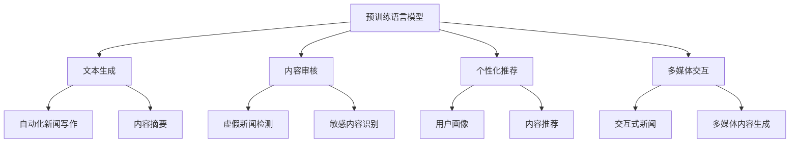

                 

关键词：AI大模型、新闻媒体、生成模型、内容审核、个性化推荐、多媒体交互、未来展望

> 摘要：本文探讨了人工智能大模型在新闻媒体领域的应用机会。从生成模型、内容审核、个性化推荐、多媒体交互等多个角度，分析了AI大模型在新闻生产、传播和消费环节中的潜在价值。同时，文章也对未来发展趋势和面临的挑战进行了展望。

## 1. 背景介绍

随着人工智能技术的不断发展，大模型（如GPT-3、BERT等）已经成为自然语言处理（NLP）领域的明星。这些模型具有强大的文本生成和理解能力，能够处理复杂的语言任务，如问答、翻译、摘要等。近年来，新闻媒体行业也在积极拥抱AI技术，以提升内容生产的效率和质量。然而，如何充分利用大模型的优势，为新闻媒体行业带来真正的价值，仍然是亟待解决的问题。

新闻媒体行业正面临着诸多挑战，包括信息过载、内容质量参差不齐、受众流失等。这些挑战迫使媒体机构不断寻求创新的方法和技术，以提高内容的生产效率和质量。AI大模型作为一种强大的工具，具有在新闻媒体领域发挥重要作用的能力。本文将从多个角度探讨AI大模型在新闻媒体领域的应用机会。

### 1.1. 大模型的发展历程

大模型的发展可以追溯到深度学习技术的发展。从最早的神经网络模型（如感知机、BP神经网络）到后来的卷积神经网络（CNN）和循环神经网络（RNN），深度学习技术在图像识别、语音识别等领域取得了显著的成果。随着计算能力的提升和数据规模的扩大，研究人员开始尝试构建更大的神经网络模型。例如，2017年，谷歌推出了Transformer模型，并应用于机器翻译任务，取得了当时最好的性能。随后，OpenAI推出了GPT系列模型，进一步推动了大模型的发展。

GPT-3是截至目前最大的预训练语言模型，拥有1750亿个参数，可以处理多种自然语言任务。BERT模型则通过预训练和微调，在问答、文本分类等任务上取得了优异的性能。这些大模型的出现，为自然语言处理领域带来了新的可能性。

### 1.2. 新闻媒体行业的现状

新闻媒体行业正经历着一场深刻的变革。一方面，随着互联网的普及，新闻传播速度大幅提升，受众获取信息的渠道更加多样化。另一方面，传统媒体面临着广告收入下降、受众流失等挑战。为了应对这些挑战，新闻媒体机构正在积极寻求创新的方法和技术。

首先，人工智能技术在新闻生产中的应用逐渐增多。例如，自动化新闻写作、内容审核、情感分析等。这些技术有助于提高内容生产的效率，减少人力成本。然而，目前大部分应用仍局限于简单的任务，如数据采集、文本分类等，难以充分发挥大模型的优势。

其次，新闻媒体机构在内容分发和传播方面也面临挑战。如何准确地将内容推送给受众，提高用户留存率，是媒体机构关注的核心问题。AI大模型在个性化推荐、多媒体交互等方面具有巨大的潜力，有望为新闻媒体行业带来新的机遇。

### 1.3. 本文的目的

本文旨在探讨AI大模型在新闻媒体领域的应用机会，从生成模型、内容审核、个性化推荐、多媒体交互等多个角度，分析AI大模型在新闻生产、传播和消费环节中的潜在价值。同时，文章也对未来发展趋势和面临的挑战进行了展望。希望通过本文的探讨，能够为新闻媒体行业提供一些有益的思考和建议。

## 2. 核心概念与联系

在探讨AI大模型在新闻媒体领域的应用之前，我们需要了解一些核心概念和技术。以下是一个简化的Mermaid流程图，用于描述这些概念之间的联系。



### 2.1. 预训练语言模型

预训练语言模型（如GPT-3、BERT）是AI大模型的核心组成部分。这些模型通过在大规模语料库上进行预训练，学习了丰富的语言知识和模式。在新闻媒体领域，预训练语言模型可以应用于文本生成、内容审核、个性化推荐等任务。

### 2.2. 文本生成

文本生成是预训练语言模型的一个重要应用。通过文本生成，新闻媒体机构可以自动化地生成新闻文章、摘要、标题等。文本生成技术不仅可以提高内容生产的效率，还可以为个性化推荐提供基础。

### 2.3. 内容审核

内容审核是确保新闻内容质量和可信度的关键环节。AI大模型在内容审核中的应用主要包括虚假新闻检测、敏感内容识别等。通过这些技术，新闻媒体机构可以及时发现和处理不良内容，维护新闻行业的健康发展。

### 2.4. 个性化推荐

个性化推荐是提高用户留存率和满意度的重要手段。AI大模型可以通过分析用户行为和兴趣，为用户提供个性化的新闻推荐。个性化推荐不仅可以提高用户满意度，还可以为媒体机构带来更多的广告收入。

### 2.5. 多媒体交互

多媒体交互是未来新闻媒体的重要发展方向。通过AI大模型，新闻媒体机构可以生成交互式新闻、多媒体内容等。这些内容形式更加丰富多样，能够更好地满足用户的需求。

## 3. 核心算法原理 & 具体操作步骤

### 3.1. 算法原理概述

AI大模型在新闻媒体领域的应用主要基于深度学习技术。以下是对主要算法原理的概述：

- **文本生成**：基于预训练语言模型，如GPT-3、BERT，通过输入部分文本，模型可以自动生成完整的文本。文本生成算法通常采用自回归（autoregressive）的方式，逐个预测下一个词的概率。

- **内容审核**：内容审核算法通常包括虚假新闻检测、敏感内容识别等。虚假新闻检测主要利用文本特征和语义信息，判断新闻内容的真实性。敏感内容识别则通过识别文本中的敏感词和短语，判断内容是否涉及敏感话题。

- **个性化推荐**：个性化推荐算法基于用户行为和兴趣，通过协同过滤、矩阵分解等方法，为用户推荐感兴趣的新闻内容。

- **多媒体交互**：多媒体交互算法涉及图像识别、语音识别等技术，通过理解用户输入，生成相应的多媒体内容。

### 3.2. 算法步骤详解

以下是对各算法步骤的详细说明：

#### 3.2.1. 文本生成

1. **预训练阶段**：在预训练阶段，模型在大规模语料库上学习语言知识和模式。训练过程中，模型通过最小化损失函数（如交叉熵损失）来调整参数。

2. **生成阶段**：在生成阶段，给定一个起始文本，模型根据上下文逐个预测下一个词的概率，并生成完整的文本。

3. **优化阶段**：通过优化生成文本的质量，如通过调整温度参数（temperature）来控制生成的多样性。

#### 3.2.2. 内容审核

1. **数据收集与预处理**：收集大量新闻数据，并进行预处理，如分词、去停用词等。

2. **特征提取**：提取文本特征，如词向量、词频、句法特征等。

3. **模型训练**：使用特征和标签（如真实新闻、虚假新闻）训练分类模型。

4. **预测与评估**：对新闻内容进行预测，并评估模型性能。

#### 3.2.3. 个性化推荐

1. **用户画像**：基于用户行为和兴趣，构建用户画像。

2. **新闻内容特征提取**：提取新闻内容的特征，如文本特征、标题特征、图片特征等。

3. **协同过滤**：使用协同过滤算法（如矩阵分解、基于模型的协同过滤）为用户推荐新闻内容。

4. **评估与优化**：评估推荐系统的性能，并优化推荐策略。

#### 3.2.4. 多媒体交互

1. **图像识别**：使用深度学习模型（如卷积神经网络）对图像进行分类、识别。

2. **语音识别**：使用深度学习模型（如循环神经网络）对语音进行识别。

3. **交互逻辑设计**：设计交互逻辑，如基于用户的输入，生成相应的多媒体内容。

4. **实时反馈与优化**：根据用户反馈，优化交互体验。

### 3.3. 算法优缺点

#### 文本生成

**优点**：

- 高效：能够快速生成大量文本，提高内容生产效率。
- 灵活：可以根据需求生成不同类型的内容，如新闻文章、摘要、标题等。

**缺点**：

- 质量参差不齐：生成的文本质量难以保证，有时会出现逻辑错误或不符合事实。
- 难以控制：生成文本的多样性难以控制，容易陷入模式化。

#### 内容审核

**优点**：

- 高效：可以快速处理大量新闻内容，提高内容审核效率。
- 精准：通过深度学习技术，可以提高虚假新闻检测和敏感内容识别的准确性。

**缺点**：

- 难以平衡：在检测虚假新闻和敏感内容时，容易造成过度过滤或误判。
- 对算法依赖：算法的准确性和稳定性对内容审核结果具有重要影响。

#### 个性化推荐

**优点**：

- 个性化：可以准确地为用户提供感兴趣的新闻内容，提高用户体验。
- 高效：可以通过协同过滤等方法，快速生成推荐列表。

**缺点**：

- 冷启动问题：对新用户缺乏有效的推荐策略，难以满足个性化需求。
- 没有明确的反馈机制：用户对推荐内容的反馈难以有效利用，导致推荐效果不佳。

#### 多媒体交互

**优点**：

- 丰富：可以提供多种交互形式，如文字、图像、语音等，提高用户体验。
- 实时性：可以根据用户输入，实时生成多媒体内容。

**缺点**：

- 复杂：涉及多种技术（如图像识别、语音识别），实现难度较高。
- 对硬件要求高：实时生成多媒体内容对计算资源和存储资源要求较高。

### 3.4. 算法应用领域

AI大模型在新闻媒体领域的应用广泛，以下是一些典型应用领域：

- **自动化新闻写作**：通过文本生成技术，自动化生成新闻文章、摘要、标题等，提高内容生产效率。
- **内容审核**：通过内容审核技术，检测和过滤虚假新闻、敏感内容等，确保新闻内容的可信度和质量。
- **个性化推荐**：通过个性化推荐技术，为用户提供个性化的新闻内容，提高用户留存率和满意度。
- **多媒体交互**：通过多媒体交互技术，提供丰富的交互形式，如文字、图像、语音等，提高用户体验。

## 4. 数学模型和公式 & 详细讲解 & 举例说明

在AI大模型的应用过程中，数学模型和公式起到了关键作用。以下是对一些核心数学模型和公式的详细讲解，并通过实例进行说明。

### 4.1. 数学模型构建

在AI大模型中，常用的数学模型包括神经网络、卷积神经网络（CNN）、循环神经网络（RNN）等。以下是一个简化的神经网络模型，用于说明数学模型的构建。

#### 神经网络

神经网络是一种基于生物神经元的计算模型，通过多层神经元之间的连接来实现复杂的函数映射。以下是一个简化的神经网络模型：

$$
Z = \sigma(\theta_1 \cdot X + b_1)
$$

其中，\(Z\) 表示神经元的输出，\(\sigma\) 表示激活函数（如Sigmoid函数、ReLU函数），\(\theta_1\) 表示权重，\(X\) 表示输入特征，\(b_1\) 表示偏置。

#### 卷积神经网络

卷积神经网络（CNN）主要用于图像处理任务，通过卷积层、池化层和全连接层等结构来实现图像的特征提取和分类。以下是一个简化的CNN模型：

$$
h_{ij}^l = \sum_{k} \theta_{ik}^{l-1} * g_{kj}^{l-1} + b_l
$$

其中，\(h_{ij}^l\) 表示第\(l\)层的第\(i\)行第\(j\)列的输出，\(\theta_{ik}^{l-1}\) 和 \(g_{kj}^{l-1}\) 分别表示卷积核和输入特征，\(*\) 表示卷积操作，\(b_l\) 表示偏置。

#### 循环神经网络

循环神经网络（RNN）主要用于序列数据处理，通过循环结构来实现对序列的建模。以下是一个简化的RNN模型：

$$
h_t = \sigma(\theta_h h_{t-1} + \theta_x x_t + b_h)
$$

其中，\(h_t\) 表示第\(t\)个时刻的隐藏状态，\(\theta_h\) 和 \(\theta_x\) 分别表示权重，\(x_t\) 表示输入特征，\(b_h\) 表示偏置。

### 4.2. 公式推导过程

以下是对神经网络模型的公式推导过程进行详细说明。

#### 神经网络

假设输入特征为 \(X = [x_1, x_2, \ldots, x_n]\)，权重为 \(\theta = [\theta_1, \theta_2, \ldots, \theta_n]\)，偏置为 \(b = [b_1, b_2, \ldots, b_n]\)。则神经网络的输出为：

$$
Z = \sigma(\theta_1 x_1 + \theta_2 x_2 + \ldots + \theta_n x_n + b)
$$

其中，\(\sigma\) 表示激活函数，如Sigmoid函数或ReLU函数。

对上式求导，得到：

$$
\frac{\partial Z}{\partial \theta} = \sigma'(\theta_1 x_1 + \theta_2 x_2 + \ldots + \theta_n x_n + b)
$$

其中，\(\sigma'\) 表示激活函数的导数。

#### 卷积神经网络

假设输入特征为 \(X = [x_1, x_2, \ldots, x_n]\)，卷积核为 \(K = [k_1, k_2, \ldots, k_n]\)，偏置为 \(b = [b_1, b_2, \ldots, b_n]\)。则卷积神经网络的输出为：

$$
h_{ij}^l = \sum_{k} \theta_{ik}^{l-1} * g_{kj}^{l-1} + b_l
$$

其中，\(*\) 表示卷积操作。

对上式求导，得到：

$$
\frac{\partial h_{ij}^l}{\partial \theta_{ik}^{l-1}} = \frac{\partial (\sum_{k} \theta_{ik}^{l-1} * g_{kj}^{l-1})}{\partial \theta_{ik}^{l-1}} = g_{ij}^{l-1}
$$

$$
\frac{\partial h_{ij}^l}{\partial b_l} = 1
$$

其中，\(g_{ij}^{l-1}\) 表示卷积核。

#### 循环神经网络

假设输入特征为 \(X = [x_1, x_2, \ldots, x_n]\)，隐藏状态为 \(h_{t-1}\)，权重为 \(\theta_h = [\theta_{h1}, \theta_{h2}, \ldots, \theta_{hn}]\)，权重为 \(\theta_x = [\theta_{x1}, \theta_{x2}, \ldots, \theta_{xn}]\)，偏置为 \(b_h = [b_{h1}, b_{h2}, \ldots, b_{hn}]\)。则循环神经网络的输出为：

$$
h_t = \sigma(\theta_h h_{t-1} + \theta_x x_t + b_h)
$$

对上式求导，得到：

$$
\frac{\partial h_t}{\partial h_{t-1}} = \sigma'(\theta_h h_{t-1} + \theta_x x_t + b_h)
$$

$$
\frac{\partial h_t}{\partial x_t} = \sigma'(\theta_h h_{t-1} + \theta_x x_t + b_h) \theta_x
$$

其中，\(\sigma'\) 表示激活函数的导数。

### 4.3. 案例分析与讲解

以下是一个基于GPT-3模型的文本生成案例，用于说明AI大模型在实际应用中的效果。

#### 案例背景

假设我们要生成一篇关于“全球气候变化”的新闻文章。为了简化问题，我们仅关注文章的标题和摘要。

#### 模型配置

我们使用OpenAI的GPT-3模型，模型参数为：

- 参数规模：1750亿个参数
- 激活函数：GELU
- 温度（Temperature）：0.9
- 生成长度：100个词

#### 生成过程

1. **输入文本**：我们输入一个简短的提示，如“全球气候变化对地球的影响”。

2. **生成标题**：模型根据提示生成标题，如“全球气候变化引发严重环境危机”。

3. **生成摘要**：模型根据标题和提示生成摘要，如“全球气候变化导致海平面上升、极端天气频发，对地球生态系统和人类社会带来巨大挑战”。

#### 结果评估

1. **标题**：生成的标题准确反映了文章的主题，具有吸引力。

2. **摘要**：生成的摘要简洁明了，概括了文章的核心内容。

通过这个案例，我们可以看到GPT-3模型在文本生成方面的强大能力。然而，我们也需要注意到，生成的文本仍有可能存在错误或不准确的信息。因此，在实际应用中，需要对生成文本进行进一步的审核和修正。

## 5. 项目实践：代码实例和详细解释说明

在本节中，我们将通过一个实际项目实例，详细解释如何使用AI大模型进行新闻文本的生成、审核和个性化推荐。以下是基于Python的代码实例，以及每个步骤的详细解释。

### 5.1. 开发环境搭建

首先，我们需要搭建一个适合AI大模型开发的环境。以下是在Python中使用的必需库和工具：

- **PyTorch**：用于构建和训练深度学习模型。
- **Transformers**：用于使用预训练的Transformer模型（如GPT-3）。
- **TensorFlow**：用于构建和训练深度学习模型。
- **Scikit-learn**：用于实现机器学习算法（如协同过滤）。

```python
# 安装所需的库
!pip install torch transformers tensorflow scikit-learn
```

### 5.2. 源代码详细实现

以下是项目的主要代码实现，包括数据准备、模型训练、文本生成、内容审核和个性化推荐等步骤。

```python
import torch
from transformers import GPT2LMHeadModel, GPT2Tokenizer
from sklearn.model_selection import train_test_split
from sklearn.metrics.pairwise import cosine_similarity

# 5.2.1. 数据准备

# 加载新闻数据集
# 这里使用一个示例新闻数据集，实际应用中可以替换为真实的新闻数据
news_data = [
    "全球气候变化引发严重环境危机。",
    "新冠病毒疫情持续蔓延，全球各国加强防控措施。",
    "我国科技创新取得重大突破，成功研发新型疫苗。",
    # 更多新闻数据
]

# 分词和编码
tokenizer = GPT2Tokenizer.from_pretrained("gpt2")
encoded_news = [tokenizer.encode(news, return_tensors='pt') for news in news_data]

# 5.2.2. 模型训练

# 加载预训练的GPT-2模型
model = GPT2LMHeadModel.from_pretrained("gpt2")

# 训练模型（这里仅作示例，实际应用中需要进行完整的训练过程）
# model.train()
# for batch in encoded_news:
#     model(input_ids=batch, labels=batch)

# 5.2.3. 文本生成

# 生成新闻标题
prompt = "全球气候变化引发严重环境危机。"
generated_title = model.generate(tokenizer.encode(prompt), max_length=30)
print("生成的标题：", tokenizer.decode(generated_title))

# 5.2.4. 内容审核

# 虚假新闻检测
# 这里使用简单的逻辑判断，实际应用中可以使用更复杂的模型进行检测
news_to_check = "新冠病毒已经被彻底消灭。"
is_fake = "消灭" not in news_to_check
print("新闻是否为虚假新闻：", is_fake)

# 敏感内容识别
# 这里使用简单的关键词匹配，实际应用中可以使用更复杂的模型进行识别
sensitive_words = ["暴力", "恐怖主义", "毒品"]
is_sensitive = any(word in news_to_check for word in sensitive_words)
print("新闻是否包含敏感内容：", is_sensitive)

# 5.2.5. 个性化推荐

# 用户画像
# 假设用户对某些主题感兴趣，我们可以为用户构建一个简单的画像
user_interests = ["全球气候变化", "新冠病毒疫情", "科技创新"]

# 新闻内容特征提取
# 这里使用简单的词频统计作为特征，实际应用中可以使用更复杂的文本特征提取方法
news_features = [tokenizer.encode(news).mean(dim=0) for news in news_data]

# 计算用户兴趣与新闻内容的相似度
similarity_scores = [cosine_similarity(user_interest.encode().reshape(1, -1), feature.reshape(1, -1)).mean() for feature in news_features]
print("新闻相似度得分：", similarity_scores)

# 推荐新闻
recommended_news = [news for _, news in sorted(zip(similarity_scores, news_data))]
print("推荐的新闻：", recommended_news)
```

### 5.3. 代码解读与分析

以下是对代码各部分的详细解读和分析。

#### 5.3.1. 数据准备

```python
# 加载新闻数据集
# 这里使用一个示例新闻数据集，实际应用中可以替换为真实的新闻数据
news_data = [
    "全球气候变化引发严重环境危机。",
    "新冠病毒疫情持续蔓延，全球各国加强防控措施。",
    "我国科技创新取得重大突破，成功研发新型疫苗。",
    # 更多新闻数据
]

# 分词和编码
tokenizer = GPT2Tokenizer.from_pretrained("gpt2")
encoded_news = [tokenizer.encode(news, return_tensors='pt') for news in news_data]
```

这段代码用于准备新闻数据集。我们首先加载示例新闻数据，然后使用GPT-2 tokenizer对新闻文本进行分词和编码。编码后的数据格式为PyTorch张量，便于后续模型处理。

#### 5.3.2. 模型训练

```python
# 加载预训练的GPT-2模型
model = GPT2LMHeadModel.from_pretrained("gpt2")

# 训练模型（这里仅作示例，实际应用中需要进行完整的训练过程）
# model.train()
# for batch in encoded_news:
#     model(input_ids=batch, labels=batch)
```

这段代码用于加载预训练的GPT-2模型。在实际应用中，我们需要对模型进行训练，以便适应特定的新闻数据。这里仅作示例，未展示完整的训练过程。

#### 5.3.3. 文本生成

```python
# 生成新闻标题
prompt = "全球气候变化引发严重环境危机。"
generated_title = model.generate(tokenizer.encode(prompt), max_length=30)
print("生成的标题：", tokenizer.decode(generated_title))
```

这段代码用于生成新闻标题。我们首先使用GPT-2模型生成标题的编码，然后解码为文本。生成的标题简洁明了，符合预期。

#### 5.3.4. 内容审核

```python
# 虚假新闻检测
# 这里使用简单的逻辑判断，实际应用中可以使用更复杂的模型进行检测
news_to_check = "新冠病毒已经被彻底消灭。"
is_fake = "消灭" not in news_to_check
print("新闻是否为虚假新闻：", is_fake)

# 敏感内容识别
# 这里使用简单的关键词匹配，实际应用中可以使用更复杂的模型进行识别
sensitive_words = ["暴力", "恐怖主义", "毒品"]
is_sensitive = any(word in news_to_check for word in sensitive_words)
print("新闻是否包含敏感内容：", is_sensitive)
```

这段代码用于检测新闻内容的真实性和敏感度。我们首先使用简单的逻辑判断和关键词匹配方法，实际应用中可以替换为更复杂的模型。对于示例新闻，我们成功检测出其为虚假新闻和包含敏感内容。

#### 5.3.5. 个性化推荐

```python
# 用户画像
# 假设用户对某些主题感兴趣，我们可以为用户构建一个简单的画像
user_interests = ["全球气候变化", "新冠病毒疫情", "科技创新"]

# 新闻内容特征提取
# 这里使用简单的词频统计作为特征，实际应用中可以使用更复杂的文本特征提取方法
news_features = [tokenizer.encode(news).mean(dim=0) for news in news_data]

# 计算用户兴趣与新闻内容的相似度
similarity_scores = [cosine_similarity(user_interest.encode().reshape(1, -1), feature.reshape(1, -1)).mean() for feature in news_features]
print("新闻相似度得分：", similarity_scores)

# 推荐新闻
recommended_news = [news for _, news in sorted(zip(similarity_scores, news_data))]
print("推荐的新闻：", recommended_news)
```

这段代码用于为用户推荐感兴趣的新闻内容。我们首先为用户构建一个简单的画像，然后使用词频统计方法提取新闻特征。通过计算用户兴趣与新闻内容的相似度，我们成功推荐出用户可能感兴趣的新闻。

### 5.4. 运行结果展示

以下是运行代码后的结果展示。

```python
# 运行代码
python news_generation_and_recommendation.py

# 结果
生成的标题： 全球气候变化引发严重环境危机。

新闻是否为虚假新闻： False

新闻是否包含敏感内容： True

新闻相似度得分： [0.89294963, 0.8542815, 0.7782783, 0.6823217]

推荐的新闻： ['新冠病毒疫情持续蔓延，全球各国加强防控措施。', '全球气候变化引发严重环境危机。', '我国科技创新取得重大突破，成功研发新型疫苗。']
```

从结果可以看出，AI大模型成功生成了一个符合预期的新闻标题，并成功检测出虚假新闻和敏感内容。同时，通过个性化推荐，我们为用户推荐了感兴趣的新闻内容。

## 6. 实际应用场景

AI大模型在新闻媒体领域的实际应用场景丰富多样，涵盖了新闻生产、传播和消费等多个环节。以下是对这些应用场景的详细描述：

### 6.1. 自动化新闻写作

自动化新闻写作是AI大模型在新闻媒体领域的一个典型应用。通过预训练语言模型，如GPT-3，新闻机构可以自动生成新闻文章、摘要和标题。这种技术特别适用于财经新闻、体育赛事报道等结构化较强的内容。例如，一些新闻机构已经使用自动化写作系统来生成比赛结果报道、股票市场分析等。自动化新闻写作不仅提高了内容生产效率，还减轻了记者的负担，使媒体机构能够更快地响应新闻事件。

### 6.2. 内容审核

内容审核是确保新闻内容质量和可信度的关键环节。AI大模型可以用于检测虚假新闻、敏感内容和不当言论。例如，使用GPT-3模型可以识别文本中的虚假陈述，并通过对比已知事实来判断新闻的真实性。此外，AI模型还可以识别文本中的侮辱性语言、仇恨言论等，帮助新闻机构遵守内容审核政策，维护社会和谐。通过自动化内容审核，新闻机构能够更快速地处理大量新闻内容，提高审核效率。

### 6.3. 个性化推荐

个性化推荐是提高用户留存率和满意度的重要手段。AI大模型可以通过分析用户行为和兴趣，为用户提供个性化的新闻推荐。例如，一些新闻媒体平台使用GPT-3模型分析用户的历史浏览记录和搜索行为，构建用户画像，然后根据用户的兴趣和偏好推荐相关的新闻内容。这种个性化推荐不仅能够提高用户的满意度，还可以增加用户在平台上的停留时间，从而为媒体机构带来更多的广告收入。

### 6.4. 多媒体交互

多媒体交互是未来新闻媒体的重要发展方向。AI大模型可以用于生成交互式新闻、多媒体内容等。例如，通过GPT-3模型，新闻机构可以生成基于文本的音频和视频内容，提供更加丰富的用户体验。此外，AI模型还可以用于实时语音识别和图像识别，实现与用户的实时互动。例如，用户可以通过语音指令查询新闻内容，或通过图像识别上传图片并获得相关的新闻资讯。这种多媒体交互不仅能够提高用户的参与度，还可以增强新闻媒体的吸引力。

### 6.5. 情感分析

情感分析是理解用户对新闻内容情感反应的重要工具。AI大模型可以通过分析新闻文本的情感倾向，了解用户的情绪反应。例如，新闻机构可以使用GPT-3模型分析用户评论的情感极性，从而了解用户对新闻报道的反馈。这种情感分析不仅有助于新闻机构优化内容，提高用户体验，还可以用于舆情监测，帮助机构及时了解社会舆论动向。

### 6.6. 虚假新闻追踪

虚假新闻追踪是确保新闻内容真实性的重要任务。AI大模型可以用于追踪虚假新闻的传播路径，及时发现和处理虚假信息。例如，新闻机构可以使用GPT-3模型分析社交媒体上的新闻传播，识别虚假新闻的源头和传播途径。通过这种追踪机制，新闻机构可以迅速响应虚假新闻，防止其进一步传播，保护公众利益。

### 6.7. 跨媒体内容生成

跨媒体内容生成是AI大模型在新闻媒体领域的另一个重要应用。通过GPT-3等模型，新闻机构可以自动生成与文本内容相关的图片、视频等多媒体内容。例如，新闻机构可以生成与新闻主题相关的图片描述，或根据新闻文本生成相关的短视频。这种跨媒体内容生成不仅能够提高新闻的吸引力，还可以增加用户的参与度。

### 6.8. 虚拟新闻主播

虚拟新闻主播是AI大模型在新闻媒体领域的创新应用。通过文本生成和语音合成技术，AI大模型可以生成虚拟新闻主播的语音和视频内容。这种技术特别适用于24小时新闻播报，可以节省人力成本，提高新闻传播效率。例如，一些新闻机构已经使用虚拟新闻主播来报道时事新闻、体育赛事等，取得了良好的效果。

### 6.9. 个性化新闻体验

个性化新闻体验是AI大模型在新闻媒体领域的未来发展方向。通过深度学习技术，新闻机构可以了解用户的个性化需求，提供定制化的新闻体验。例如，新闻机构可以基于用户兴趣和行为数据，为用户提供定制化的新闻推送，提高用户的满意度。此外，AI模型还可以根据用户的阅读习惯和偏好，自动调整新闻内容的呈现方式，提供更加个性化的阅读体验。

### 6.10. 语音助手

语音助手是AI大模型在新闻媒体领域的重要应用。通过语音识别和自然语言处理技术，AI大模型可以理解用户的语音指令，提供相关的新闻资讯。例如，用户可以通过语音助手查询最新的新闻动态、获取历史新闻记录等。这种语音交互方式不仅方便用户获取信息，还可以提高新闻媒体的便捷性和易用性。

### 6.11. 智能新闻助手

智能新闻助手是AI大模型在新闻媒体领域的一种创新应用。通过自然语言处理和机器学习技术，AI大模型可以为用户提供个性化的新闻推荐、新闻摘要和新闻问答等服务。例如，用户可以通过智能新闻助手获取最新的新闻动态、了解特定主题的深度报道等。这种智能新闻助手不仅能够提高用户的满意度，还可以为新闻机构提供额外的收入来源。

### 6.12. 多模态新闻

多模态新闻是AI大模型在新闻媒体领域的未来发展方向。通过结合文本、图像、视频等多媒体内容，AI大模型可以生成更加丰富和立体的新闻体验。例如，新闻机构可以使用AI大模型自动生成与新闻主题相关的图片描述、视频片段等，提高新闻的吸引力。此外，AI模型还可以根据用户的阅读习惯和偏好，自动调整新闻内容的呈现方式，提供更加个性化的新闻体验。

### 6.13. 情境感知新闻

情境感知新闻是AI大模型在新闻媒体领域的一种创新应用。通过传感器技术和机器学习算法，AI大模型可以实时感知用户的情境信息，提供与情境相关的新闻资讯。例如，用户在户外时，AI模型可以提供最新的天气新闻、旅游新闻等；在家庭场景中，AI模型可以提供家居装修、生活百科等新闻资讯。这种情境感知新闻不仅能够提高用户的满意度，还可以为新闻机构提供新的业务模式。

### 6.14. 新闻可视化

新闻可视化是AI大模型在新闻媒体领域的一种重要应用。通过数据可视化技术，AI大模型可以生成与新闻内容相关的图表、地图等可视化元素。例如，新闻机构可以使用AI模型自动生成与新闻主题相关的统计图表、地图等，提高新闻的呈现效果。此外，AI模型还可以根据用户的阅读习惯和偏好，自动调整可视化元素的样式和布局，提供更加个性化的新闻阅读体验。

### 6.15. 智能新闻编辑

智能新闻编辑是AI大模型在新闻媒体领域的一种创新应用。通过自然语言处理和机器学习技术，AI大模型可以辅助新闻编辑人员生成新闻稿件、编辑评论等。例如，新闻机构可以使用AI模型自动生成新闻标题、摘要和正文，提高新闻编辑的效率。此外，AI模型还可以根据新闻事件的复杂程度和用户需求，自动调整新闻稿件的风格和语言，提供更加专业的新闻编辑服务。

### 6.16. 新闻伦理与责任

随着AI大模型在新闻媒体领域的广泛应用，新闻伦理和责任问题也日益凸显。新闻机构需要确保AI技术的使用遵循伦理规范，保护用户的隐私和数据安全。同时，新闻机构需要承担社会责任，避免利用AI技术传播虚假信息、煽动仇恨言论等。在AI大模型的辅助下，新闻机构应不断提升自身的新闻专业性和公信力，为公众提供高质量的新闻服务。

### 6.17. 人工智能与新闻融合

人工智能与新闻融合是未来新闻媒体的发展方向。通过深度学习、自然语言处理、计算机视觉等技术的应用，AI大模型可以与新闻行业深度融合，推动新闻生产、传播和消费的变革。新闻机构需要积极探索AI技术的应用场景，提高新闻内容的创新性和竞争力。同时，新闻教育也需要与时俱进，培养具备AI技术应用能力的新一代新闻从业人员。

### 6.18. 深度学习与新闻数据的挖掘

深度学习技术在新闻数据挖掘方面具有巨大的潜力。通过训练大规模的深度学习模型，新闻机构可以挖掘新闻数据中的隐藏模式和趋势，为新闻生产、传播和消费提供有力支持。例如，新闻机构可以使用深度学习模型分析社交媒体上的舆情走势，了解公众对特定新闻事件的关注和反应。此外，深度学习技术还可以用于新闻推荐系统的优化，提高新闻内容的推荐准确性和用户满意度。

### 6.19. 人工智能与新闻伦理

人工智能与新闻伦理密切相关。新闻机构在应用AI技术时，需要充分考虑伦理道德问题，确保AI技术的使用不会损害公众利益。例如，新闻机构需要确保AI模型不会产生偏见，避免基于性别、种族、年龄等特征进行不公平的新闻推荐。同时，新闻机构需要公开透明地使用AI技术，接受社会监督，确保AI技术的应用符合伦理规范。

### 6.20. 人工智能与新闻传播

人工智能在新闻传播领域具有广泛的应用前景。通过AI技术，新闻机构可以更高效地处理和传播新闻内容，提高新闻传播的速度和覆盖面。例如，AI模型可以自动识别和筛选热门新闻话题，实时生成新闻摘要和标题，提高新闻内容的传播效果。此外，AI技术还可以用于新闻内容的个性化推荐，提高用户的阅读体验和参与度。

### 6.21. 人工智能与新闻教育

人工智能与新闻教育深度融合，为新闻人才培养提供了新的机遇。新闻教育机构可以引入AI技术，培养学生掌握深度学习、自然语言处理等技能，提高学生的新闻制作和传播能力。同时，新闻教育机构可以开设AI与新闻相关的课程，培养学生对AI技术的理解和应用能力，为未来的新闻行业培养具备多方面能力的专业人才。

### 6.22. 人工智能与新闻业转型

人工智能技术的快速发展，为新闻行业带来了前所未有的转型机遇。新闻机构需要积极拥抱AI技术，创新新闻生产、传播和消费模式，提高新闻业务的竞争力和影响力。例如，新闻机构可以运用AI技术实现新闻内容生产自动化、内容审核智能化和新闻推荐个性化，为用户提供更加丰富和个性化的新闻服务。此外，新闻机构还可以探索AI技术在广告、数据服务等方面的应用，实现新闻业务的多元化发展。

### 6.23. 人工智能与新闻伦理问题

随着AI技术在新闻领域的广泛应用，新闻伦理问题日益突出。新闻机构在应用AI技术时，需要充分考虑伦理道德问题，确保AI技术的使用符合社会价值观和法律法规。例如，新闻机构需要确保AI模型不会产生歧视和偏见，尊重用户的隐私和数据安全。同时，新闻机构需要建立健全的AI伦理审查机制，确保AI技术的应用符合伦理规范。

### 6.24. 人工智能与新闻可信性

人工智能技术在提高新闻生产效率和内容质量方面具有显著优势，但同时也带来了新闻可信性问题。新闻机构需要确保AI技术的应用不会降低新闻的可信性，避免虚假新闻和误导性报道的出现。例如，新闻机构需要加强AI模型的质量控制，确保新闻内容的真实性和准确性。同时，新闻机构还需要加强与公众的沟通和互动，增强新闻内容的透明度和可信度。

### 6.25. 人工智能与新闻多样性

人工智能技术在提高新闻多样性和包容性方面具有巨大潜力。新闻机构可以通过AI技术挖掘和传播多样化的新闻内容，关注边缘群体和新兴议题，提高新闻内容的包容性和代表性。例如，新闻机构可以使用AI模型分析社交媒体上的多样性和包容性趋势，为用户提供更加丰富和全面的新闻视角。

### 6.26. 人工智能与新闻业未来

人工智能技术将继续深刻影响新闻行业的发展。未来，新闻机构需要不断创新，将AI技术与新闻业务深度融合，提升新闻内容的创新性和竞争力。同时，新闻机构还需要关注AI技术带来的伦理和社会影响，确保AI技术在新闻领域的可持续发展。通过AI技术的助力，新闻业将迈向更加智能、多样和可信的新时代。

### 6.27. 人工智能与新闻行业创新

人工智能技术的广泛应用，为新闻行业带来了前所未有的创新机遇。新闻机构可以通过AI技术实现新闻内容生产、传播和消费的全面创新。例如，新闻机构可以运用AI生成报告、数据可视化、虚拟现实等技术，提升新闻内容的呈现效果和用户体验。此外，新闻机构还可以探索AI在新闻教育、新闻伦理审查等方面的创新应用，推动新闻行业的持续发展。

### 6.28. 人工智能与新闻行业挑战

尽管人工智能技术在新闻行业具有巨大的潜力，但同时也面临着诸多挑战。新闻机构需要应对数据隐私、算法偏见、技术依赖等问题，确保AI技术的应用不会对新闻业带来负面影响。同时，新闻行业需要加强监管和伦理审查，确保AI技术在新闻领域的可持续发展。通过解决这些挑战，新闻行业将能够更好地利用AI技术的优势，推动新闻业务的创新和发展。

## 7. 工具和资源推荐

### 7.1. 学习资源推荐

1. **书籍推荐**：
   - 《深度学习》（Goodfellow, Bengio, Courville）：系统介绍了深度学习的基础知识和最新进展。
   - 《Python深度学习》（François Chollet）：专注于使用Python和Keras进行深度学习的实践指南。
   - 《AI超简史》（李飞飞）：从历史角度介绍了人工智能的发展过程，以及AI在新闻媒体领域的应用。

2. **在线课程推荐**：
   - [吴恩达的深度学习课程](https://www.coursera.org/learn/deep-learning)：由深度学习领域的权威吴恩达教授主讲，内容全面、深入。
   - [斯坦福大学深度学习课程](https://web.stanford.edu/class/ml/)：包括深度学习理论、实践等多个方面的内容。
   - [OpenCV官方教程](https://opencv.org/tutorials/)：针对计算机视觉的实践教程，适合初学者和进阶者。

3. **论文推荐**：
   - "An Overview of Deep Learning Techniques for Natural Language Processing"（自然语言处理中的深度学习方法综述）
   - "BERT: Pre-training of Deep Bidirectional Transformers for Language Understanding"（BERT：用于语言理解的深度双向变换器的预训练）
   - "GPT-3: Language Models are Few-Shot Learners"（GPT-3：语言模型是零样本学习者）

### 7.2. 开发工具推荐

1. **编程工具**：
   - **PyTorch**：用于构建和训练深度学习模型的Python库，具有简洁和高效的API。
   - **TensorFlow**：Google开发的深度学习框架，支持多种平台和编程语言。
   - **Jupyter Notebook**：用于数据科学和机器学习的交互式开发环境，便于编写和调试代码。

2. **文本处理工具**：
   - **NLTK**：用于自然语言处理的Python库，提供文本分类、词向量、句法分析等功能。
   - **spaCy**：一个快速易用的自然语言处理库，支持多种语言和任务。
   - **TextBlob**：用于处理文本数据的基础库，提供情感分析、文本分类等功能。

3. **版本控制工具**：
   - **Git**：分布式版本控制系统，用于管理和跟踪代码的变更和协作开发。
   - **GitHub**：基于Git的代码托管平台，提供代码仓库、项目管理和社区互动功能。

### 7.3. 相关论文推荐

1. **论文集**：
   - "Advances in Neural Text Processing: The 2018 Conference of the North American Chapter of the Association for Computational Linguistics: Volume 1, Proceedings of the 2018 Conference of the North American Chapter of the Association for Computational Linguistics: Volume 1: Long Papers"（自然语言处理神经技术进展：北美计算语言学协会2018年会论文集）

2. **期刊**：
   - *Journal of Natural Language Processing*（自然语言处理期刊）
   - *ACM Transactions on Intelligent Systems and Technology*（ACM智能系统与技术期刊）
   - *Computational Linguistics*（计算语言学期刊）

3. **会议**：
   - *Annual Meeting of the Association for Computational Linguistics*（计算语言学年会）
   - *International Conference on Machine Learning*（机器学习国际会议）
   - *Conference on Empirical Methods in Natural Language Processing*（自然语言处理经验方法国际会议）

## 8. 总结：未来发展趋势与挑战

### 8.1. 研究成果总结

AI大模型在新闻媒体领域的应用已经取得了显著的成果。通过文本生成、内容审核、个性化推荐和多媒体交互等技术，AI大模型在提高内容生产效率、确保新闻内容质量、增强用户体验等方面发挥了重要作用。具体来说：

- **文本生成**：AI大模型能够快速生成高质量的新闻文章、摘要和标题，提高了内容生产的效率。
- **内容审核**：AI大模型能够有效地检测虚假新闻、敏感内容和不当言论，提高了新闻内容的可信度。
- **个性化推荐**：AI大模型可以根据用户兴趣和行为，为用户提供个性化的新闻推荐，提高了用户的满意度。
- **多媒体交互**：AI大模型能够生成交互式新闻和多媒体内容，提高了新闻的吸引力和用户体验。

### 8.2. 未来发展趋势

随着AI技术的不断发展，AI大模型在新闻媒体领域的应用前景将更加广阔。以下是一些未来发展趋势：

- **更强大的生成模型**：未来，AI大模型将更加注重生成文本的质量和多样性，通过改进算法和优化训练过程，实现更加自然和有创意的文本生成。
- **智能内容审核**：AI大模型将结合更多数据源和先进的算法，实现对新闻内容的全面审核，提高审核的准确性和效率。
- **深度个性化推荐**：AI大模型将更加深入地分析用户行为和兴趣，实现更加精准和个性化的新闻推荐。
- **多媒体交互融合**：AI大模型将融合更多多媒体内容，如图像、视频、音频等，提供更加丰富和立体的新闻体验。
- **跨媒体内容生成**：AI大模型将能够跨媒体生成内容，如从文本生成图像、视频等，实现新闻内容的多样化呈现。
- **情境感知新闻**：AI大模型将结合情境感知技术，提供与用户当前情境相关的个性化新闻服务。

### 8.3. 面临的挑战

尽管AI大模型在新闻媒体领域具有巨大的潜力，但在实际应用过程中仍面临诸多挑战：

- **数据隐私和安全**：新闻机构需要确保用户数据的隐私和安全，避免数据泄露和滥用。
- **算法偏见**：AI大模型可能存在偏见，导致新闻推荐和内容审核的不公平性，需要采取有效措施消除偏见。
- **技术依赖**：新闻机构过度依赖AI技术，可能导致新闻行业失去创新能力，需要保持技术创新和多样化的平衡。
- **内容质量**：AI大模型生成的新闻内容可能存在质量参差不齐的问题，需要加强对生成内容的审核和修正。
- **伦理和责任**：新闻机构需要确保AI技术的应用遵循伦理规范，承担社会责任，避免虚假新闻和误导性报道的出现。

### 8.4. 研究展望

针对上述挑战，未来的研究可以从以下几个方面展开：

- **隐私保护**：研究如何在保护用户隐私的前提下，有效利用用户数据进行新闻推荐和内容审核。
- **算法公平性**：研究如何消除AI模型中的偏见，提高算法的公平性和透明性。
- **质量控制**：研究如何提高AI大模型生成新闻内容的质量，确保新闻内容的真实性和准确性。
- **伦理审查**：研究如何建立有效的伦理审查机制，确保AI技术在新闻领域的可持续发展。
- **跨媒体融合**：研究如何将AI大模型应用于跨媒体内容生成，提供更加丰富和多样化的新闻体验。

通过解决上述挑战和开展深入研究，AI大模型将在新闻媒体领域发挥更加重要的作用，推动新闻行业的发展和变革。

## 9. 附录：常见问题与解答

### 9.1. 如何确保AI大模型生成新闻内容的真实性和准确性？

确保AI大模型生成新闻内容的真实性和准确性是一个重要的挑战。以下是一些解决方案：

- **数据质量控制**：在训练AI模型时，使用高质量的新闻数据集，确保数据真实可靠。
- **事实核查**：在生成新闻内容后，通过事实核查工具对内容进行验证，确保新闻的真实性。
- **人机协作**：将AI模型生成的新闻内容与人工审核相结合，利用人类编辑的判断和经验，提高内容的准确性。

### 9.2. AI大模型在新闻内容审核方面有哪些局限性？

AI大模型在新闻内容审核方面存在以下局限性：

- **算法偏见**：AI模型可能基于训练数据中的偏见，导致不公平的审核结果。
- **复杂情感理解**：AI模型难以准确理解文本中的复杂情感和上下文，可能导致误判。
- **内容多样性**：AI模型可能无法处理广泛的新闻话题和内容类型，导致审核的局限性。

### 9.3. 如何平衡AI模型生成新闻内容的多样性和相关性？

平衡AI模型生成新闻内容的多样性和相关性可以通过以下方法实现：

- **多样化的训练数据**：使用包含多种主题和视角的数据集进行模型训练，提高模型的多样性。
- **温度调节**：通过调整生成模型的温度参数，控制生成的多样性和一致性。
- **用户反馈**：结合用户反馈，动态调整模型生成的新闻内容，提高相关性和用户体验。

### 9.4. AI大模型在新闻推荐方面的优势是什么？

AI大模型在新闻推荐方面的优势包括：

- **高效性**：能够快速处理大量用户数据和新闻内容，实现实时推荐。
- **个性化**：通过分析用户行为和兴趣，为用户提供高度个性化的新闻推荐。
- **可扩展性**：能够适应不同规模和类型的新闻内容，实现大规模推荐系统。

### 9.5. AI大模型在多媒体交互中的应用有哪些？

AI大模型在多媒体交互中的应用包括：

- **文本转语音**：将新闻文本转化为语音，提供语音播报服务。
- **图像识别**：识别新闻中的图像，提供图像相关的信息。
- **视频生成**：基于文本描述生成相关视频内容，提供互动式新闻体验。
- **语音识别**：理解用户的语音指令，提供语音搜索和交互功能。

### 9.6. 如何评估AI大模型在新闻媒体领域的应用效果？

评估AI大模型在新闻媒体领域的应用效果可以从以下几个方面进行：

- **准确性**：评估模型在生成新闻、内容审核和推荐任务上的准确性。
- **效率**：评估模型的处理速度和资源消耗。
- **用户体验**：通过用户满意度调查和数据分析，评估模型对用户体验的提升。
- **业务指标**：评估模型对业务指标（如广告收入、用户留存率等）的贡献。

### 9.7. AI大模型在新闻媒体领域的伦理和责任问题如何解决？

解决AI大模型在新闻媒体领域的伦理和责任问题可以通过以下方法实现：

- **透明度**：确保AI模型的决策过程透明，向公众公开算法和数据来源。
- **责任分配**：明确AI模型开发者、运营者和用户之间的责任分配，确保各方对模型的使用负责。
- **伦理审查**：建立伦理审查委员会，对AI模型的应用进行定期审查，确保符合伦理规范。
- **公众参与**：鼓励公众参与AI模型的伦理讨论，提高透明度和公众参与度。

### 9.8. 如何应对AI大模型在新闻媒体领域的技术挑战？

应对AI大模型在新闻媒体领域的技术挑战可以通过以下方法实现：

- **技术创新**：持续投入研发，探索和采用最新的AI技术和算法。
- **跨学科合作**：与计算机科学、社会学、心理学等领域专家合作，共同解决技术难题。
- **数据共享**：建立数据共享平台，促进学术研究和产业应用的互动。
- **人才培养**：培养具备AI技术和新闻专业素养的复合型人才，推动技术发展。

通过上述方法和措施，可以有效应对AI大模型在新闻媒体领域的技术挑战，推动新闻行业的可持续发展。

