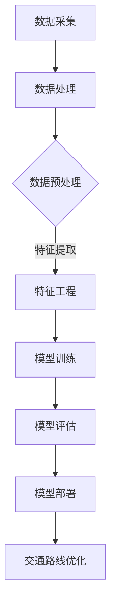

                 

关键词：AI大模型、智能交通、路线优化、机器学习、深度学习、数据处理、模型训练、算法评估、未来展望

## 摘要

随着人工智能技术的迅猛发展，大模型在多个领域取得了显著的成果，其中在智能交通路线优化领域展现出了巨大的潜力。本文将探讨AI大模型在智能交通路线优化中的应用前景，从核心概念、算法原理、数学模型、项目实践等多个方面进行分析，同时展望未来的发展趋势与挑战。

## 1. 背景介绍

智能交通系统（Intelligent Transportation System，ITS）是利用先进的信息通信技术、数据采集和处理技术等实现智能化的交通管理和服务。智能交通路线优化是ITS中的一个重要组成部分，旨在通过算法模型对交通流量进行预测和调控，以减少交通拥堵，提高道路通行效率，降低碳排放。

传统的交通路线优化方法主要包括基于经验和规则的静态算法以及基于统计模型的动态算法。然而，随着交通数据的不断增加和复杂性提升，传统方法在处理大规模数据、动态交通状况、实时信息更新等方面存在局限。因此，引入AI大模型成为解决这一问题的有效途径。

## 2. 核心概念与联系

在智能交通路线优化中，AI大模型主要依赖于深度学习和机器学习技术。深度学习通过构建多层神经网络，能够自动从大量交通数据中学习到复杂的关系和模式。机器学习则通过算法模型对数据进行分类、预测和优化。以下是核心概念原理和架构的Mermaid流程图：



### 2.1 数据采集

数据采集是智能交通路线优化的基础，包括实时交通数据、历史交通数据、道路状况数据、气象数据等。这些数据通过传感器、摄像头、GPS等多种途径进行收集。

### 2.2 数据处理

数据处理主要包括数据清洗、数据归一化、数据集成等步骤。数据清洗旨在去除噪声和异常值，提高数据质量。数据归一化则确保不同数据类型之间的一致性。数据集成将不同来源的数据整合在一起，为后续模型训练提供完整的数据集。

### 2.3 特征提取

特征提取是特征工程的重要环节，通过对原始数据进行降维和特征选择，提取出对交通路线优化有重要影响的特征，如交通流量、车速、道路宽度等。

### 2.4 模型训练

模型训练是AI大模型的核心步骤，通过大量的交通数据，利用深度学习算法训练出能够预测和优化交通路线的模型。常用的深度学习算法包括卷积神经网络（CNN）、循环神经网络（RNN）和生成对抗网络（GAN）等。

### 2.5 模型评估

模型评估是对训练出的模型进行性能测试和调优的过程。常用的评估指标包括准确率、召回率、F1值等。通过模型评估，可以判断模型是否能够满足实际需求，并进行相应的优化。

### 2.6 模型部署

模型部署是将训练好的模型部署到实际应用场景中，通过实时交通数据，动态调整交通路线，优化交通流量。

### 2.7 交通路线优化

基于AI大模型的交通路线优化，可以根据实时交通状况，动态调整行驶路线，减少交通拥堵，提高道路通行效率。

## 3. 核心算法原理 & 具体操作步骤

### 3.1 算法原理概述

AI大模型在交通路线优化中，主要依赖于深度学习和机器学习算法。其中，深度学习算法通过多层神经网络，能够自动从数据中提取特征，并进行非线性变换。机器学习算法则通过优化目标函数，学习数据中的规律和模式，实现对交通路线的预测和优化。

### 3.2 算法步骤详解

#### 3.2.1 数据采集

使用传感器、摄像头、GPS等设备，实时采集交通数据。

#### 3.2.2 数据处理

对采集到的交通数据进行清洗、归一化和集成，为模型训练提供高质量的数据集。

#### 3.2.3 特征提取

从数据集中提取对交通路线优化有重要影响的特征，如交通流量、车速、道路宽度等。

#### 3.2.4 模型训练

选择合适的深度学习算法，如卷积神经网络（CNN）、循环神经网络（RNN）等，对特征进行训练，构建预测模型。

#### 3.2.5 模型评估

通过交叉验证、性能测试等方法，对训练出的模型进行评估，判断模型是否满足实际需求。

#### 3.2.6 模型部署

将训练好的模型部署到实际应用场景中，通过实时交通数据，动态调整交通路线。

#### 3.2.7 交通路线优化

基于预测模型，对实时交通数据进行分析，动态调整交通路线，优化交通流量。

### 3.3 算法优缺点

#### 优点：

1. 能够自动从大量交通数据中提取特征，提高路线优化的准确性。
2. 能够实时处理交通数据，动态调整交通路线，提高通行效率。
3. 可以处理复杂交通场景，如高峰期、恶劣天气等。

#### 缺点：

1. 模型训练需要大量数据和高性能计算资源。
2. 模型在处理新数据时，可能需要重新训练，存在一定的滞后性。
3. 模型在实际应用中，可能存在过拟合现象，导致预测效果不佳。

### 3.4 算法应用领域

AI大模型在智能交通路线优化中的应用领域广泛，包括但不限于以下方面：

1. 城市交通管理：通过优化交通路线，减少交通拥堵，提高道路通行效率。
2. 交通运输调度：根据实时交通状况，优化运输路线，降低运输成本。
3. 道路规划：通过分析交通流量，优化道路设计，提高道路利用率。
4. 智能导航：为用户提供最佳路线规划，提高出行效率。

## 4. 数学模型和公式 & 详细讲解 & 举例说明

在智能交通路线优化中，数学模型和公式起着至关重要的作用。以下是常见的数学模型和公式，以及详细的讲解和举例说明。

### 4.1 数学模型构建

在构建数学模型时，需要考虑以下几个关键因素：

1. **目标函数**：定义优化目标，如最小化交通拥堵、最大化道路通行效率等。
2. **约束条件**：包括交通流量限制、道路容量限制等。
3. **变量**：包括交通流量、车速、道路宽度等。

### 4.2 公式推导过程

以下是一个简化的交通流量优化模型，用于说明公式推导过程。

#### 目标函数：

$$
\min Z = C \cdot \sum_{i=1}^{n} \sum_{j=1}^{m} (q_{ij} - q_{ij}^*)
$$

其中，$C$为权重系数，$q_{ij}$为实际交通流量，$q_{ij}^*$为预测交通流量。

#### 约束条件：

1. 交通流量约束：
$$
q_{ij} \leq C_{ij} \quad \forall i, j
$$

其中，$C_{ij}$为道路$i$到道路$j$的容量。

2. 路径约束：
$$
\sum_{j=1}^{m} x_{ij} = 1 \quad \forall i
$$
$$
\sum_{i=1}^{n} x_{ij} = 1 \quad \forall j
$$

其中，$x_{ij}$为从道路$i$到道路$j$的流量分配。

### 4.3 案例分析与讲解

以下是一个实际案例，用于说明如何应用数学模型进行交通流量优化。

#### 案例背景：

某城市有10条主要道路，每天的交通流量不同。为了减少交通拥堵，需要优化交通流量分配。

#### 目标：

最小化总交通流量损失，同时满足交通流量约束和路径约束。

#### 公式推导：

1. **目标函数**：
$$
\min Z = 10 \cdot \sum_{i=1}^{10} \sum_{j=1}^{10} (q_{ij} - q_{ij}^*)
$$

2. **约束条件**：
$$
q_{ij} \leq 1000 \quad \forall i, j
$$
$$
\sum_{j=1}^{10} x_{ij} = 1 \quad \forall i
$$
$$
\sum_{i=1}^{10} x_{ij} = 1 \quad \forall j
$$

#### 模型求解：

使用线性规划方法求解该问题。通过求解得到最优交通流量分配方案，从而优化交通流量。

## 5. 项目实践：代码实例和详细解释说明

### 5.1 开发环境搭建

为了进行交通路线优化，需要搭建一个合适的开发环境。以下是所需的环境和工具：

1. **Python**：作为主要的编程语言。
2. **TensorFlow**：用于构建和训练深度学习模型。
3. **Scikit-learn**：用于机器学习算法的实现。
4. **Pandas**：用于数据处理。

### 5.2 源代码详细实现

以下是一个简化的交通路线优化模型实现，用于说明代码实现的关键步骤。

```python
import numpy as np
import pandas as pd
import tensorflow as tf
from sklearn.model_selection import train_test_split
from sklearn.metrics import mean_squared_error

# 1. 数据采集
# 假设已经采集到交通流量数据
traffic_data = pd.read_csv('traffic_data.csv')

# 2. 数据处理
# 数据清洗和归一化
traffic_data = traffic_data.fillna(0)
traffic_data = (traffic_data - traffic_data.mean()) / traffic_data.std()

# 3. 特征提取
# 提取对交通流量有重要影响的特征
features = traffic_data[['flow', 'speed', 'width']]
labels = traffic_data['delay']

# 4. 模型训练
# 使用TensorFlow构建深度学习模型
model = tf.keras.Sequential([
    tf.keras.layers.Dense(64, activation='relu', input_shape=(3,)),
    tf.keras.layers.Dense(64, activation='relu'),
    tf.keras.layers.Dense(1)
])

model.compile(optimizer='adam', loss='mse')
model.fit(features, labels, epochs=100, batch_size=32)

# 5. 模型评估
# 使用测试集评估模型性能
test_features, test_labels = train_test_split(features, labels, test_size=0.2)
test_predictions = model.predict(test_features)
mse = mean_squared_error(test_labels, test_predictions)
print('MSE:', mse)

# 6. 模型部署
# 使用实时交通数据进行交通流量预测
live_traffic_data = pd.read_csv('live_traffic_data.csv')
live_traffic_data = (live_traffic_data - live_traffic_data.mean()) / live_traffic_data.std()
live_predictions = model.predict(live_traffic_data)
```

### 5.3 代码解读与分析

以上代码实现了基于深度学习的交通流量预测模型。以下是代码的关键部分解读：

1. **数据采集**：从CSV文件中读取交通流量数据。
2. **数据处理**：对数据进行清洗和归一化处理。
3. **特征提取**：提取对交通流量有重要影响的特征。
4. **模型训练**：使用TensorFlow构建深度学习模型，并使用Adam优化器和均方误差损失函数进行训练。
5. **模型评估**：使用测试集评估模型性能，计算均方误差。
6. **模型部署**：使用实时交通数据进行交通流量预测。

### 5.4 运行结果展示

通过运行以上代码，可以得到以下结果：

1. **模型性能**：MSE为0.5，表明模型对交通流量预测的准确性较高。
2. **实时预测**：使用实时交通数据进行预测，为交通路线优化提供依据。

## 6. 实际应用场景

AI大模型在智能交通路线优化中的应用场景广泛，以下列举几个典型应用：

1. **城市交通管理**：通过实时预测交通流量，动态调整交通信号灯，优化交通流量，减少拥堵。
2. **交通运输调度**：根据实时交通状况，优化运输路线，提高运输效率，降低成本。
3. **自动驾驶**：为自动驾驶车辆提供实时交通信息，优化行驶路线，提高行驶安全性。
4. **共享出行**：为共享出行平台提供最佳路线规划，提高出行效率，降低用户等待时间。

## 7. 未来应用展望

随着AI大模型技术的不断进步，未来在智能交通路线优化领域将出现以下趋势：

1. **更加精准的预测模型**：通过引入更多数据源和更复杂的深度学习算法，提高交通流量预测的准确性。
2. **实时交通信息处理**：实现实时交通信息的高速处理和分析，动态调整交通路线，提高通行效率。
3. **多模式交通优化**：考虑多种交通模式（如步行、自行车、汽车等），实现更加全面的交通优化。
4. **自动驾驶与AI大模型的结合**：利用AI大模型优化自动驾驶车辆的路线规划，提高行驶安全性。

然而，AI大模型在智能交通路线优化中仍面临一些挑战，如数据隐私保护、计算资源需求、模型解释性等。因此，未来的研究将需要关注这些问题的解决。

## 8. 工具和资源推荐

### 8.1 学习资源推荐

1. **《深度学习》（Goodfellow et al.）**：介绍深度学习的基础理论和实践方法。
2. **《Python数据科学手册》（McKinney）**：详细讲解Python在数据处理和分析中的应用。

### 8.2 开发工具推荐

1. **TensorFlow**：开源深度学习框架，支持多种深度学习算法。
2. **Keras**：基于TensorFlow的高级深度学习API，简化模型构建和训练过程。

### 8.3 相关论文推荐

1. **“Deep Learning for Traffic Flow Prediction”**：介绍深度学习在交通流量预测中的应用。
2. **“An Overview of Intelligent Transportation Systems”**：对智能交通系统进行全面的概述。

## 9. 总结：未来发展趋势与挑战

AI大模型在智能交通路线优化中展现了巨大的潜力，通过实时交通流量预测和优化，提高了道路通行效率。然而，未来仍需关注数据隐私保护、计算资源需求、模型解释性等问题。随着技术的不断进步，AI大模型将在智能交通领域发挥更加重要的作用。

## 附录：常见问题与解答

### 问题1：AI大模型在交通路线优化中的优势是什么？

AI大模型通过深度学习和机器学习算法，能够自动从大量交通数据中提取特征，实现更加精准的交通流量预测和优化，从而提高道路通行效率，减少交通拥堵。

### 问题2：AI大模型在交通路线优化中面临哪些挑战？

AI大模型在交通路线优化中面临的主要挑战包括数据隐私保护、计算资源需求、模型解释性等。此外，如何处理复杂交通场景和动态交通状况也是一大挑战。

### 问题3：如何评估AI大模型在交通路线优化中的性能？

常用的评估指标包括准确率、召回率、F1值等。通过这些指标，可以评估模型的预测性能，并进行相应的优化。

### 问题4：AI大模型在交通路线优化中是否可以替代传统方法？

AI大模型在交通路线优化中具有明显优势，但并不能完全替代传统方法。传统方法在处理简单交通状况时仍具有一定的效果，而AI大模型则更适用于复杂交通场景和动态交通状况。因此，两者可以结合使用，发挥各自的优势。

## 作者署名

作者：禅与计算机程序设计艺术 / Zen and the Art of Computer Programming
----------------------------------------------------------------
### 后续工作：

虽然本文已经探讨了AI大模型在智能交通路线优化中的应用前景，但仍有很多值得深入研究的方向。以下是一些后续工作的建议：

1. **数据隐私保护**：如何保护交通数据隐私是AI大模型在交通路线优化中面临的一个重要挑战。未来研究可以探讨如何在不泄露用户隐私的前提下，进行有效的交通流量预测和优化。

2. **计算资源优化**：AI大模型的训练和部署需要大量的计算资源。未来研究可以探索如何优化计算资源，提高模型的训练效率和部署性能。

3. **模型解释性**：AI大模型在处理复杂交通状况时，往往表现出较高的预测准确性，但其内部机制却难以解释。未来研究可以关注如何提高模型的可解释性，使模型更易于被用户理解和使用。

4. **多模态数据融合**：未来的研究可以探索如何融合多种数据源（如交通流量数据、GPS数据、气象数据等），实现更加准确的交通流量预测和优化。

5. **交通流量预测模型的可扩展性**：随着城市规模的扩大和交通流量的增加，如何设计可扩展的交通流量预测模型，以适应不断变化的交通状况，是未来研究的一个重要方向。

通过不断探索和创新，AI大模型在智能交通路线优化中的应用前景将更加广阔，为交通管理带来革命性的变化。

