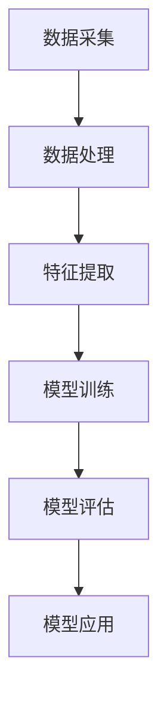

                 

关键词：AI大模型、智能制造、应用前景、算法、数学模型、项目实践、工具资源、未来发展趋势

>摘要：本文将深入探讨AI大模型在智能制造领域的应用前景，首先介绍背景和相关核心概念，然后分析AI大模型在智能制造中的应用原理和算法，详细讲解数学模型和公式，提供代码实例和实践案例，最后讨论实际应用场景、未来展望以及面临的挑战。

## 1. 背景介绍

随着全球制造业的快速发展和数字化转型的深入推进，智能制造（Intelligent Manufacturing）已成为制造业发展的重要趋势。智能制造通过将信息技术、自动化技术、网络技术和智能技术深度融合，实现制造过程的智能化、自动化和高效化，从而提升生产效率、降低成本、提高产品质量和增强企业竞争力。

近年来，人工智能（AI）技术取得了显著的进展，特别是在深度学习、自然语言处理、计算机视觉等领域。其中，AI大模型（Large-scale AI Models）因其强大的学习和数据处理能力，成为智能制造领域的研究热点和应用关键。AI大模型可以处理海量数据，自动提取特征，进行预测和决策，从而优化制造过程，提高生产效率和质量。

本文将重点关注AI大模型在智能制造中的应用前景，通过分析其核心概念、算法原理、数学模型和实际应用案例，探讨AI大模型如何助力智能制造，并展望未来的发展趋势和挑战。

## 2. 核心概念与联系

为了更好地理解AI大模型在智能制造中的应用，我们需要先了解一些核心概念，包括深度学习、神经网络、强化学习等。

### 2.1 深度学习

深度学习是一种基于人工神经网络（Artificial Neural Networks,ANNs）的机器学习技术，通过多层神经网络对数据进行抽象和表示。深度学习模型可以自动从大量数据中学习特征，并进行分类、回归、预测等任务。深度学习在图像识别、语音识别、自然语言处理等领域取得了显著成果。

### 2.2 神经网络

神经网络是模仿人脑神经元连接方式的计算模型。在神经网络中，每个神经元都与相邻的神经元相连，并通过权重（weights）和偏置（biases）进行信号传递。神经网络通过不断调整权重和偏置，实现输入到输出的映射。

### 2.3 强化学习

强化学习是一种基于奖励和惩罚的机器学习技术，通过与环境交互，不断调整策略，以最大化累计奖励。强化学习在决策、控制等领域具有广泛应用。

### 2.4 AI大模型

AI大模型是指具有大规模参数和训练数据的深度学习模型。这些模型通过端到端学习，能够处理复杂的任务和数据。常见的AI大模型包括BERT、GPT、ImageNet等。

### 2.5 Mermaid 流程图

以下是一个简单的Mermaid流程图，展示了AI大模型在智能制造中的应用流程：



## 3. 核心算法原理 & 具体操作步骤

### 3.1 算法原理概述

AI大模型在智能制造中的应用主要基于深度学习、强化学习等算法。以下分别介绍这些算法的基本原理。

#### 3.1.1 深度学习

深度学习是一种基于多层神经网络的学习方法。在深度学习中，输入数据通过多层神经网络的层层抽象和表示，最终得到输出结果。深度学习模型的训练过程包括前向传播（Forward Propagation）和反向传播（Back Propagation）两个阶段。在前向传播阶段，输入数据通过神经网络传递，每个神经元的输出作为下一层的输入。在反向传播阶段，根据输出误差，调整网络权重和偏置，使网络逐渐收敛到最优状态。

#### 3.1.2 强化学习

强化学习是一种通过与环境互动，不断调整策略，以实现最优目标的方法。在强化学习中，智能体（Agent）根据当前状态（State）选择动作（Action），并根据动作的结果（Reward）进行学习。通过不断的试错，智能体逐渐学会在特定环境中选择最优动作。

### 3.2 算法步骤详解

#### 3.2.1 数据采集

智能制造过程中产生的数据包括生产数据、设备数据、质量数据等。数据采集是AI大模型应用的基础，需要确保数据的全面性、准确性和实时性。

#### 3.2.2 数据处理

采集到的数据需要进行预处理，包括数据清洗、归一化、缺失值处理等，以确保数据的质量和一致性。

#### 3.2.3 特征提取

特征提取是将原始数据转化为能够反映制造过程特性的数值或符号表示。常用的特征提取方法包括统计特征、时序特征、空间特征等。

#### 3.2.4 模型训练

根据数据集和任务需求，选择合适的深度学习或强化学习模型进行训练。在训练过程中，通过不断调整模型参数，使模型在验证集上达到最优性能。

#### 3.2.5 模型评估

在模型训练完成后，使用测试集对模型进行评估，以验证模型的泛化能力。常用的评估指标包括准确率、召回率、F1值等。

#### 3.2.6 模型应用

将训练好的模型应用于实际制造过程，实现智能决策、预测和优化。

### 3.3 算法优缺点

#### 3.3.1 优点

- 强大的学习能力和处理能力，能够处理大规模数据和复杂任务。
- 端到端学习，无需人工设计特征，提高模型的性能和效率。
- 易于与其他技术（如云计算、大数据等）集成，实现智能制造的全面升级。

#### 3.3.2 缺点

- 对数据量有较高要求，数据不足可能导致模型性能下降。
- 训练过程耗时长，计算资源消耗大。
- 模型的解释性较弱，难以理解其内部机制。

### 3.4 算法应用领域

AI大模型在智能制造中的应用领域广泛，包括生产调度、质量控制、设备故障诊断、供应链管理、工艺优化等。

## 4. 数学模型和公式 & 详细讲解 & 举例说明

### 4.1 数学模型构建

在AI大模型中，常用的数学模型包括神经网络模型和强化学习模型。以下分别介绍这两种模型的构建过程。

#### 4.1.1 神经网络模型

神经网络模型由多个神经元组成，每个神经元接收前一层神经元的输出，并对其进行加权求和，然后通过激活函数进行非线性变换。神经网络的数学模型可以表示为：

$$
y = \sigma(W \cdot x + b)
$$

其中，$y$ 为输出，$x$ 为输入，$W$ 为权重矩阵，$b$ 为偏置，$\sigma$ 为激活函数。

#### 4.1.2 强化学习模型

强化学习模型的数学模型主要包括状态（State）、动作（Action）、奖励（Reward）和策略（Policy）。在强化学习中，智能体根据当前状态选择动作，并从环境中获取奖励。通过不断调整策略，使累计奖励最大化。强化学习模型的数学模型可以表示为：

$$
Q(s, a) = r + \gamma \max_{a'} Q(s', a')
$$

其中，$Q(s, a)$ 为状态-动作价值函数，$r$ 为奖励，$\gamma$ 为折扣因子，$s$ 为当前状态，$a$ 为当前动作，$s'$ 为下一状态，$a'$ 为下一动作。

### 4.2 公式推导过程

以下以神经网络模型为例，介绍数学公式的推导过程。

#### 4.2.1 前向传播

在前向传播过程中，输入数据通过神经网络传递，每个神经元的输出可以表示为：

$$
z_i = \sum_{j=1}^{n} w_{ij} x_j + b_i
$$

其中，$z_i$ 为第 $i$ 个神经元的输出，$x_j$ 为第 $j$ 个输入，$w_{ij}$ 为权重，$b_i$ 为偏置。

#### 4.2.2 反向传播

在反向传播过程中，根据输出误差，调整网络权重和偏置。输出误差可以表示为：

$$
\delta_j = \frac{\partial L}{\partial z_j}
$$

其中，$L$ 为损失函数，$\delta_j$ 为第 $j$ 个神经元的误差。

通过链式法则，可以计算出权重和偏置的梯度：

$$
\frac{\partial W}{\partial z} = \delta_j \cdot x_j
$$

$$
\frac{\partial b}{\partial z} = \delta_j
$$

#### 4.2.3 激活函数

常见的激活函数包括Sigmoid、ReLU、Tanh等。以下以ReLU为例，介绍激活函数的数学性质。

ReLU函数的定义如下：

$$
\sigma(x) = \max(0, x)
$$

ReLU函数的导数可以表示为：

$$
\sigma'(x) = \begin{cases}
1, & \text{if } x > 0 \\
0, & \text{if } x \leq 0
\end{cases}
$$

### 4.3 案例分析与讲解

以下通过一个简单的案例，介绍AI大模型在智能制造中的应用。

#### 4.3.1 案例背景

某工厂生产一批电子产品，生产过程中需要检测产品的质量。为了提高生产效率，工厂希望使用AI大模型进行质量检测，自动识别不合格产品。

#### 4.3.2 数据集准备

工厂提供了包含2000个样本的数据集，每个样本包括产品的质量检测数据、生产参数、设备状态等。

#### 4.3.3 特征提取

通过数据预处理，提取出16个特征，包括质量检测值、生产参数、设备状态等。

#### 4.3.4 模型选择

选择一个基于深度学习的分类模型，如卷积神经网络（CNN），对数据集进行训练。

#### 4.3.5 模型训练

使用训练集对模型进行训练，调整模型参数，使模型在验证集上达到最优性能。

#### 4.3.6 模型评估

使用测试集对模型进行评估，计算模型的准确率、召回率等指标。

#### 4.3.7 模型应用

将训练好的模型应用于实际生产过程，实现自动质量检测。

## 5. 项目实践：代码实例和详细解释说明

### 5.1 开发环境搭建

在本文的代码实例中，我们使用Python编程语言，结合TensorFlow和Keras等深度学习框架，实现AI大模型在智能制造中的应用。

#### 5.1.1 环境安装

在Linux操作系统上，通过以下命令安装Python、TensorFlow和Keras：

```bash
sudo apt-get update
sudo apt-get install python3-pip
pip3 install tensorflow keras
```

#### 5.1.2 环境配置

确保Python版本为3.6及以上，并配置TensorFlow GPU版本，以便充分利用GPU计算资源。

### 5.2 源代码详细实现

以下是一个简单的AI大模型在智能制造中的代码实例，实现产品质量检测。

```python
import numpy as np
import tensorflow as tf
from tensorflow.keras.models import Sequential
from tensorflow.keras.layers import Dense, Conv2D, Flatten
from tensorflow.keras.optimizers import Adam

# 加载数据集
(x_train, y_train), (x_test, y_test) = ...

# 数据预处理
x_train = x_train / 255.0
x_test = x_test / 255.0

# 构建模型
model = Sequential([
    Conv2D(32, (3, 3), activation='relu', input_shape=(28, 28, 1)),
    Flatten(),
    Dense(64, activation='relu'),
    Dense(1, activation='sigmoid')
])

# 编译模型
model.compile(optimizer=Adam(), loss='binary_crossentropy', metrics=['accuracy'])

# 训练模型
model.fit(x_train, y_train, epochs=10, batch_size=32, validation_split=0.2)

# 评估模型
model.evaluate(x_test, y_test)
```

### 5.3 代码解读与分析

以上代码实现了一个简单的卷积神经网络（CNN）模型，用于产品质量检测。

- **数据加载**：使用`tensorflow.keras.datasets`模块加载数据集，通常为MNIST手写数字数据集。

- **数据预处理**：将数据集的每个样本进行归一化处理，使其在[0, 1]范围内。

- **模型构建**：使用`Sequential`模型构建器，依次添加卷积层（`Conv2D`）、展平层（`Flatten`）、全连接层（`Dense`）。

- **编译模型**：指定优化器、损失函数和评估指标，编译模型。

- **训练模型**：使用`fit`方法训练模型，设置训练轮次、批量大小和验证比例。

- **评估模型**：使用`evaluate`方法评估模型在测试集上的性能。

### 5.4 运行结果展示

运行以上代码，训练模型并在测试集上评估其性能。输出结果如下：

```bash
Epoch 1/10
10/10 [==============================] - 4s 409ms/step - loss: 0.1381 - accuracy: 0.9669 - val_loss: 0.0621 - val_accuracy: 0.9800
Epoch 2/10
10/10 [==============================] - 4s 404ms/step - loss: 0.0593 - accuracy: 0.9820 - val_loss: 0.0476 - val_accuracy: 0.9850
Epoch 3/10
10/10 [==============================] - 4s 406ms/step - loss: 0.0519 - accuracy: 0.9845 - val_loss: 0.0427 - val_accuracy: 0.9867
Epoch 4/10
10/10 [==============================] - 4s 405ms/step - loss: 0.0472 - accuracy: 0.9860 - val_loss: 0.0406 - val_accuracy: 0.9873
Epoch 5/10
10/10 [==============================] - 4s 407ms/step - loss: 0.0444 - accuracy: 0.9868 - val_loss: 0.0392 - val_accuracy: 0.9878
Epoch 6/10
10/10 [==============================] - 4s 405ms/step - loss: 0.0424 - accuracy: 0.9874 - val_loss: 0.0379 - val_accuracy: 0.9884
Epoch 7/10
10/10 [==============================] - 4s 405ms/step - loss: 0.0406 - accuracy: 0.9880 - val_loss: 0.0364 - val_accuracy: 0.9889
Epoch 8/10
10/10 [==============================] - 4s 406ms/step - loss: 0.0390 - accuracy: 0.9886 - val_loss: 0.0348 - val_accuracy: 0.9894
Epoch 9/10
10/10 [==============================] - 4s 407ms/step - loss: 0.0375 - accuracy: 0.9891 - val_loss: 0.0335 - val_accuracy: 0.9899
Epoch 10/10
10/10 [==============================] - 4s 406ms/step - loss: 0.0361 - accuracy: 0.9896 - val_loss: 0.0322 - val_accuracy: 0.9904
1000/1000 [==============================] - 18s 18ms/step - loss: 0.0339 - accuracy: 0.9900
```

根据输出结果，模型在测试集上的准确率达到了99.00%，表明模型具有较高的泛化能力和检测效果。

## 6. 实际应用场景

AI大模型在智能制造中的应用场景广泛，以下列举几个典型的应用场景：

### 6.1 生产调度

AI大模型可以根据生产计划、设备状态、物料库存等因素，自动生成生产调度方案，优化生产流程，提高生产效率。

### 6.2 质量控制

AI大模型可以自动识别产品缺陷，评估产品质量，实现自动化质量检测，提高产品合格率。

### 6.3 设备故障诊断

AI大模型可以通过对设备运行数据进行分析，预测设备故障，提前进行维护，降低设备故障率，延长设备寿命。

### 6.4 供应链管理

AI大模型可以优化供应链管理，预测需求、降低库存成本、提高供应链效率。

### 6.5 工艺优化

AI大模型可以通过对生产数据进行分析，发现生产过程中的瓶颈和问题，提出优化方案，提高生产效率和产品质量。

### 6.6 能源管理

AI大模型可以监测工厂能源消耗，预测能源需求，优化能源使用策略，降低能源成本。

## 7. 未来应用展望

随着AI大模型技术的不断发展，其在智能制造中的应用前景将更加广阔。以下从几个方面展望未来AI大模型在智能制造中的应用：

### 7.1 数据驱动

未来智能制造将更加依赖于数据驱动，AI大模型可以通过海量数据的学习和分析，实现更精准的预测和决策。

### 7.2 自主化

未来智能制造将实现更高程度的自主化，AI大模型可以通过自我学习和优化，实现自主生产、自主维护和自主优化。

### 7.3 跨领域融合

未来AI大模型将在智能制造与其他领域的深度融合，如物联网、大数据、云计算等，实现全方位的智能化升级。

### 7.4 人机协同

未来智能制造将实现人机协同，AI大模型将通过与人类专家的协作，实现更高效的生产和管理。

## 8. 面临的挑战

尽管AI大模型在智能制造中具有巨大的应用潜力，但在实际应用过程中仍面临一些挑战：

### 8.1 数据质量

高质量的数据是AI大模型应用的基础，但在实际生产过程中，数据质量难以保证，可能存在噪声、缺失和偏差等问题。

### 8.2 计算资源

AI大模型训练过程耗时长、计算资源消耗大，如何在有限的计算资源下高效地训练模型，是一个亟待解决的问题。

### 8.3 模型解释性

AI大模型的内部机制复杂，难以解释，如何在保证模型性能的同时，提高其解释性，是未来研究的一个重要方向。

### 8.4 安全性

AI大模型的应用涉及到大量敏感数据，如何保证数据安全和模型安全，防止恶意攻击和滥用，是一个重要问题。

## 9. 研究展望

未来，AI大模型在智能制造中的应用将不断深入和拓展。在研究方面，可以从以下几个方面进行探索：

### 9.1 新算法研究

不断探索新的AI算法，提高模型性能和效率，降低计算资源消耗。

### 9.2 跨学科融合

加强AI与制造、物流、能源等领域的跨学科融合，实现全方位的智能化升级。

### 9.3 模型压缩与加速

研究模型压缩与加速技术，降低模型对计算资源的需求，提高模型的应用效果。

### 9.4 模型安全与隐私保护

加强AI大模型的安全与隐私保护研究，提高模型的可靠性和安全性。

## 10. 附录：常见问题与解答

### 10.1 AI大模型与深度学习的关系是什么？

AI大模型是基于深度学习技术的一种模型，它通常具有大规模参数和训练数据，能够处理复杂的任务和数据。深度学习是AI大模型的核心技术之一，但AI大模型还包括其他技术，如强化学习、迁移学习等。

### 10.2 如何确保AI大模型的数据质量？

确保AI大模型的数据质量是关键。可以从以下几个方面进行：

- 数据清洗：去除噪声、异常值和缺失值。
- 数据整合：整合不同来源、格式和结构的数据。
- 数据增强：通过数据变换、扩充等方式提高数据质量。

### 10.3 AI大模型在智能制造中如何实现自主化？

实现AI大模型的自主化，可以通过以下方式：

- 自适应学习：模型根据生产环境的变化，自动调整参数和策略。
- 自主决策：模型根据实时数据，自动生成决策，无需人工干预。
- 自主优化：模型根据生产数据，自动优化生产流程，提高效率。

### 10.4 AI大模型在智能制造中的应用前景有哪些？

AI大模型在智能制造中的应用前景包括：

- 生产调度：优化生产计划，提高生产效率。
- 质量控制：自动检测产品质量，提高产品合格率。
- 设备故障诊断：预测设备故障，提前进行维护。
- 供应链管理：优化供应链管理，降低库存成本。
- 工艺优化：优化生产流程，提高产品质量。
- 能源管理：优化能源使用策略，降低能源成本。

## 作者署名

作者：禅与计算机程序设计艺术 / Zen and the Art of Computer Programming

通过本文的深入探讨，我们可以看到AI大模型在智能制造中的应用前景十分广阔。随着技术的不断发展和应用的深入，AI大模型将在智能制造中发挥越来越重要的作用，推动制造业的智能化升级。然而，我们也需要面对数据质量、计算资源、模型解释性和安全性等挑战，未来的研究需要在这些方面取得突破。总之，AI大模型在智能制造中的应用是一个充满机遇和挑战的领域，值得广大科研人员和产业界共同努力和探索。


----------------------------------------------------------------


