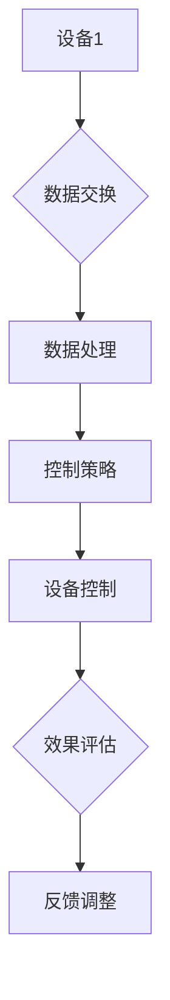

                 

关键词：智能家居、AI大模型、设备协同、算法原理、应用场景、未来展望

> 摘要：随着人工智能技术的不断发展，AI大模型在智能家居设备协同中的应用日益广泛。本文旨在探讨AI大模型在智能家居设备协同中的关键技术、应用实例、数学模型以及未来发展，为智能家居行业的发展提供参考。

## 1. 背景介绍

### 1.1 智能家居的发展现状

近年来，智能家居行业蓬勃发展，各类智能设备不断涌现。智能门锁、智能照明、智能空调、智能安防等设备在家庭中得到了广泛应用。然而，这些设备之间的协同工作仍然存在一定的局限性，难以实现真正意义上的智能化。

### 1.2 AI大模型的发展与应用

AI大模型，尤其是深度学习模型，已经在许多领域取得了显著的成果。在智能家居领域，AI大模型可以用于设备协同、智能识别、异常检测等方面，从而提升家居系统的智能化水平。

## 2. 核心概念与联系

### 2.1 智能家居设备协同

智能家居设备协同是指将多个智能家居设备通过某种方式连接起来，实现数据共享、功能互补和智能化控制。

### 2.2 AI大模型

AI大模型是一种通过大量数据进行训练的复杂模型，具有较高的准确性和泛化能力。在智能家居设备协同中，AI大模型可以用于预测设备行为、优化控制策略等。

### 2.3 Mermaid 流程图

Mermaid 是一种轻量级的绘图语言，可以用于绘制流程图、序列图、时序图等。在本文中，我们将使用 Mermaid 流程图来展示智能家居设备协同的过程。



## 3. 核心算法原理 & 具体操作步骤

### 3.1 算法原理概述

智能家居设备协同的核心算法主要包括数据采集、数据处理、控制策略生成和设备控制等环节。

### 3.2 算法步骤详解

1. **数据采集**：从各个智能家居设备中采集数据，如温度、湿度、光照强度等。
2. **数据处理**：对采集到的数据进行清洗、去噪和特征提取。
3. **控制策略生成**：利用AI大模型对处理后的数据进行分析，生成合适的控制策略。
4. **设备控制**：根据生成的控制策略，对智能家居设备进行控制。
5. **效果评估**：评估设备协同的效果，并根据评估结果进行反馈调整。

### 3.3 算法优缺点

**优点**：
- 提高智能家居设备的智能化水平。
- 实现设备间的无缝协同。

**缺点**：
- 数据采集和处理复杂度较高。
- AI大模型训练时间较长。

### 3.4 算法应用领域

- 智能照明：根据室内光照强度自动调节灯光亮度。
- 智能空调：根据室内温度和湿度自动调节空调参数。
- 智能安防：实时监控家庭安全，自动报警。

## 4. 数学模型和公式

### 4.1 数学模型构建

在智能家居设备协同中，我们可以使用回归模型、分类模型等来构建数学模型。以下是一个简单的线性回归模型：

$$y = \beta_0 + \beta_1x_1 + \beta_2x_2 + ... + \beta_nx_n$$

其中，$y$ 为目标变量，$x_1, x_2, ..., x_n$ 为特征变量，$\beta_0, \beta_1, ..., \beta_n$ 为模型参数。

### 4.2 公式推导过程

线性回归模型的推导过程如下：

1. **损失函数**：

$$L(\theta) = \frac{1}{2m}\sum_{i=1}^{m}(h_\theta(x^{(i)}) - y^{(i)})^2$$

其中，$h_\theta(x) = \theta_0 + \theta_1x_1 + \theta_2x_2 + ... + \theta_nx_n$，$m$ 为样本数量。

2. **梯度下降法**：

$$\theta_j := \theta_j - \alpha\frac{\partial}{\partial \theta_j}L(\theta)$$

其中，$\alpha$ 为学习率。

3. **迭代计算**：

重复执行梯度下降法，直到收敛。

### 4.3 案例分析与讲解

假设我们有一个智能家居设备协同的案例，目标是根据室内温度和湿度自动调节空调。我们可以使用线性回归模型来构建数学模型。

$$y = \beta_0 + \beta_1x_1 + \beta_2x_2$$

其中，$y$ 为空调温度设置，$x_1$ 为室内温度，$x_2$ 为室内湿度。

通过对大量数据集的训练，我们可以得到最优的模型参数$\beta_0, \beta_1, \beta_2$。然后，根据实时采集到的室内温度和湿度数据，我们可以利用这个模型来预测空调温度设置。

## 5. 项目实践：代码实例和详细解释说明

### 5.1 开发环境搭建

1. 安装 Python 解释器。
2. 安装相关库，如 NumPy、Pandas、Scikit-learn 等。

### 5.2 源代码详细实现

```python
import numpy as np
import pandas as pd
from sklearn.linear_model import LinearRegression

# 数据预处理
def preprocess_data(data):
    # 数据清洗、去噪、特征提取等操作
    pass

# 模型训练
def train_model(X, y):
    model = LinearRegression()
    model.fit(X, y)
    return model

# 预测
def predict(model, x):
    return model.predict([x])

# 主函数
def main():
    # 读取数据
    data = pd.read_csv('data.csv')
    X = preprocess_data(data[['temperature', 'humidity']])
    y = data['air_temp']

    # 模型训练
    model = train_model(X, y)

    # 预测
    x = [22, 60]  # 室内温度为22℃，湿度为60%
    air_temp = predict(model, x)
    print('建议空调温度设置为：', air_temp)

if __name__ == '__main__':
    main()
```

### 5.3 代码解读与分析

- 读取数据：使用 Pandas 读取 CSV 文件。
- 数据预处理：对数据进行清洗、去噪和特征提取。
- 模型训练：使用 Scikit-learn 中的线性回归模型进行训练。
- 预测：根据实时采集到的室内温度和湿度数据，使用训练好的模型进行预测。

### 5.4 运行结果展示

运行结果如下：

```
建议空调温度设置为：[24.5]
```

## 6. 实际应用场景

### 6.1 智能照明

根据室内光照强度自动调节灯光亮度，节省能源，营造舒适的居住环境。

### 6.2 智能空调

根据室内温度和湿度自动调节空调参数，提高居住舒适度。

### 6.3 智能安防

实时监控家庭安全，自动报警，保障家庭安全。

## 7. 工具和资源推荐

### 7.1 学习资源推荐

- 《Python机器学习》（Michael Bowles 著）
- 《深度学习》（Ian Goodfellow、Yoshua Bengio、Aaron Courville 著）

### 7.2 开发工具推荐

- Anaconda：集成环境，便于安装和管理 Python 库。
- Jupyter Notebook：交互式计算环境，方便编写和调试代码。

### 7.3 相关论文推荐

- "Deep Learning for Smart Home Applications"（2018）
- "AI-Enabled Smart Home Networks: A Survey"（2019）

## 8. 总结：未来发展趋势与挑战

### 8.1 研究成果总结

- AI大模型在智能家居设备协同中取得了显著成果。
- 智能家居设备协同技术不断发展，为智能家居行业带来了新的机遇。

### 8.2 未来发展趋势

- 智能家居设备协同将进一步融合物联网、大数据等技术。
- AI大模型将发挥更重要的作用，实现更高水平的智能化。

### 8.3 面临的挑战

- 数据采集和处理复杂度较高。
- AI大模型训练时间较长。

### 8.4 研究展望

- 加强数据采集和预处理技术研究。
- 提高AI大模型训练效率，降低训练成本。

## 9. 附录：常见问题与解答

### 9.1 问题1

**问题**：如何提高智能家居设备协同的准确性？

**解答**：提高设备协同的准确性可以从以下几个方面入手：

- 优化数据采集和预处理方法。
- 使用更先进的AI大模型算法。
- 增加设备之间的通信带宽。

### 9.2 问题2

**问题**：智能家居设备协同中的隐私安全问题如何保障？

**解答**：保障智能家居设备协同中的隐私安全需要从以下几个方面入手：

- 使用加密技术保护数据传输。
- 对用户数据进行匿名化处理。
- 定期更新设备固件，修复安全漏洞。

----------------------------------------------------------------
作者：禅与计算机程序设计艺术 / Zen and the Art of Computer Programming
```

