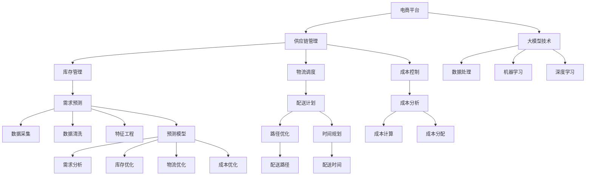

                 

关键词：人工智能、大模型、供应链优化、电商平台、深度学习、预测模型、流程图、数学模型、代码实例、实际应用、展望

摘要：随着电子商务的快速发展，供应链优化已成为电商平台提升竞争力的重要手段。本文探讨了如何利用人工智能大模型来优化电商平台供应链，包括核心概念、算法原理、数学模型构建、代码实例和实际应用场景等内容。通过本文的阐述，读者可以深入了解大模型在供应链优化中的应用价值，以及未来发展的趋势与挑战。

## 1. 背景介绍

近年来，电子商务市场的快速增长带来了供应链管理的复杂性和挑战。电商平台需要快速响应市场需求，同时保持库存、物流和成本的平衡。供应链优化成为电商平台提高效率、降低成本、提升客户满意度的重要手段。然而，传统的供应链优化方法往往依赖于经验和静态的数据分析，难以应对动态的市场变化和复杂的需求模式。

人工智能，尤其是大模型技术的快速发展，为供应链优化带来了新的机遇。大模型具备强大的数据处理和预测能力，能够从海量数据中提取有价值的信息，并生成高质量的预测结果。通过应用大模型，电商平台可以实现更精准的库存管理、更高效的物流调度和更合理的成本控制。

本文将深入探讨如何利用人工智能大模型来优化电商平台供应链，包括核心概念的理解、算法原理的阐述、数学模型的构建以及实际应用的案例分析。通过本文的讨论，读者可以全面了解大模型在供应链优化中的潜在价值和应用前景。

## 2. 核心概念与联系

在深入探讨大模型在供应链优化中的应用之前，我们需要明确一些核心概念和它们之间的联系。以下是一个详细的 Mermaid 流程图，展示了这些概念及其相互关系：



### 2.1 电商平台

电商平台是本文的研究背景，它涵盖了从商品采购到销售、物流、售后服务等各个环节。电商平台的核心目标是提供高效、便捷、优质的购物体验，从而吸引和保持客户。

### 2.2 供应链管理

供应链管理包括库存管理、物流调度、成本控制等环节，是电商平台运营的基础。供应链管理的目标是确保商品从供应商到最终客户的流动顺畅，同时降低成本，提高效率。

### 2.3 库存管理

库存管理是供应链管理的重要组成部分，涉及到库存水平的监控、库存补充策略、库存优化等。通过合理管理库存，电商平台可以实现减少库存成本、避免断货和过度库存。

### 2.4 物流调度

物流调度是指根据订单需求，合理安排货物从仓库到配送中心的配送路径、时间和数量。高效的物流调度能够提高配送效率，降低物流成本，提高客户满意度。

### 2.5 成本控制

成本控制是供应链管理的另一个关键环节，涉及到库存成本、物流成本、人力成本等。通过有效的成本控制，电商平台可以提高利润率，增强市场竞争力。

### 2.6 大模型技术

大模型技术是本文的核心，它包括数据处理、机器学习、深度学习等。大模型技术能够从海量数据中提取有价值的信息，进行精确的预测和优化。

### 2.7 数据处理

数据处理是大数据分析的基础，包括数据采集、数据清洗、特征工程等。通过有效的数据处理，可以确保数据的质量和可用性，为后续的预测和分析提供可靠的基础。

### 2.8 需求预测

需求预测是根据历史数据和当前市场状况，对未来一段时间内的商品需求进行预测。精准的需求预测有助于电商平台进行库存管理和物流调度，提高供应链的效率。

### 2.9 物流优化

物流优化是指通过优化配送路径、时间和数量，提高物流效率，降低物流成本。物流优化是供应链优化的重要组成部分，对于电商平台提升竞争力具有重要意义。

### 2.10 成本优化

成本优化是指通过合理的库存管理、物流调度和成本控制，降低整体运营成本，提高利润率。成本优化是电商平台实现可持续发展的重要手段。

通过上述核心概念的介绍和流程图的展示，读者可以清晰地理解电商平台供应链优化中各环节的联系和作用。接下来，我们将深入探讨大模型在供应链优化中的应用，包括算法原理、具体操作步骤、优缺点以及应用领域。

## 3. 核心算法原理 & 具体操作步骤

### 3.1 算法原理概述

大模型在供应链优化中的应用主要基于深度学习和机器学习技术。这些算法通过学习大量历史数据，提取出潜在的模式和规律，从而实现精准的预测和优化。以下是一些核心算法原理的概述：

- **深度神经网络（DNN）**：DNN 是一种多层的神经网络结构，通过层层提取特征，实现复杂函数的逼近。在供应链优化中，DNN 可以用于需求预测、库存管理和物流调度。

- **长短时记忆网络（LSTM）**：LSTM 是一种特殊类型的循环神经网络（RNN），能够处理长序列数据。在供应链优化中，LSTM 用于捕捉时间序列数据的长期依赖关系，提高预测的准确性。

- **卷积神经网络（CNN）**：CNN 是一种在图像处理领域广泛应用的神经网络结构，能够高效地提取图像特征。在供应链优化中，CNN 可以用于图像数据（如库存监控图片）的处理，实现库存水平的自动检测。

- **自动编码器（Autoencoder）**：自动编码器是一种无监督学习算法，用于数据降维和特征提取。在供应链优化中，自动编码器可以用于高维数据的压缩和特征提取，提高预测模型的性能。

### 3.2 算法步骤详解

下面我们将详细描述大模型在供应链优化中的具体操作步骤，包括数据准备、模型训练、预测和优化等。

#### 3.2.1 数据准备

数据准备是供应链优化的基础，主要包括数据采集、数据清洗和特征工程。

1. **数据采集**：采集与供应链优化相关的数据，如历史订单数据、库存数据、物流数据、成本数据等。这些数据可以来自电商平台内部的数据库，也可以通过第三方数据提供商获取。

2. **数据清洗**：对采集到的数据进行清洗，去除无效数据、处理缺失值和异常值。数据清洗的目的是提高数据的质量和可用性，为后续的模型训练和预测提供可靠的数据基础。

3. **特征工程**：根据业务需求和预测目标，提取有用的特征并进行预处理。特征工程是提高模型预测准确性的关键步骤，可以通过统计特征、文本特征、图像特征等多种方式进行。

#### 3.2.2 模型训练

在数据准备完成后，我们可以选择合适的深度学习算法进行模型训练。

1. **模型选择**：根据业务需求和数据特点，选择合适的深度学习模型，如 DNN、LSTM、CNN、自动编码器等。

2. **模型配置**：配置模型的结构参数，如层数、神经元数目、激活函数等。这些参数的设置需要结合具体问题和数据特点进行调整。

3. **模型训练**：使用训练数据对模型进行训练，通过反向传播算法不断调整模型参数，使模型能够更好地拟合训练数据。

4. **模型评估**：在训练完成后，使用验证数据对模型进行评估，判断模型的预测性能。常用的评估指标包括均方误差（MSE）、均方根误差（RMSE）等。

#### 3.2.3 预测和优化

在模型训练完成后，我们可以利用训练好的模型进行预测和优化。

1. **需求预测**：利用训练好的模型，对未来的商品需求进行预测。通过对比预测值和实际值，评估模型的预测准确性。

2. **库存优化**：根据需求预测结果，调整库存水平，避免过度库存和断货现象。库存优化可以通过动态调整库存策略、优化库存配置等方式实现。

3. **物流优化**：利用预测模型，优化物流调度策略，如配送路径、配送时间和配送数量。通过优化物流调度，提高配送效率，降低物流成本。

4. **成本优化**：通过优化库存管理和物流调度，实现整体运营成本的降低。成本优化可以通过成本计算、成本分析和成本控制等方式实现。

### 3.3 算法优缺点

下面我们总结一下大模型在供应链优化中的优缺点。

#### 优点：

1. **强大的数据处理能力**：大模型能够处理海量数据，提取有价值的信息，为供应链优化提供精准的数据支持。

2. **高效的预测和优化**：通过深度学习和机器学习算法，大模型可以实现高效的预测和优化，提高供应链的效率。

3. **自适应能力**：大模型能够不断学习和适应新的数据和环境，使供应链优化更加灵活和可持续。

#### 缺点：

1. **计算资源需求大**：大模型训练和预测需要大量的计算资源和时间，对于资源有限的电商平台可能带来一定的挑战。

2. **数据质量要求高**：大模型对数据质量的要求较高，如果数据存在噪声、异常值或缺失值，可能会影响模型的预测准确性。

3. **模型解释性较弱**：深度学习模型通常具有较低的透明度和解释性，难以理解模型内部的决策过程。

### 3.4 算法应用领域

大模型在供应链优化中的应用非常广泛，以下是一些典型的应用领域：

1. **库存管理**：通过需求预测，动态调整库存水平，实现库存优化，降低库存成本。

2. **物流调度**：利用预测模型优化配送路径和时间，提高物流效率，降低物流成本。

3. **成本控制**：通过优化库存管理和物流调度，降低整体运营成本，提高利润率。

4. **供应链协同**：通过大模型实现供应链上下游企业的协同优化，提高供应链的整体效率。

5. **风险预测与控制**：利用历史数据和市场信息，预测供应链风险，并采取相应的控制措施，降低风险。

通过上述算法原理和具体操作步骤的详细阐述，读者可以全面了解大模型在供应链优化中的应用方法。接下来，我们将通过数学模型和公式的推导，进一步深化对大模型在供应链优化中的应用理解。

## 4. 数学模型和公式 & 详细讲解 & 举例说明

在深入理解大模型在供应链优化中的应用时，数学模型和公式起着至关重要的作用。它们不仅为算法提供了理论基础，还能帮助我们更好地分析和解释预测结果。以下我们将详细介绍数学模型的构建、公式的推导过程以及通过具体案例进行说明。

### 4.1 数学模型构建

在构建数学模型时，我们需要考虑供应链优化中的几个关键要素，如需求预测、库存管理和物流调度。以下是一个基本的数学模型框架：

#### 4.1.1 需求预测模型

需求预测是供应链优化的基础，可以使用时间序列模型进行预测。一个常见的时间序列模型是 ARIMA（自回归积分滑动平均模型），其数学公式如下：

$$
Y_t = c + \phi_1 Y_{t-1} + \phi_2 Y_{t-2} + ... + \phi_p Y_{t-p} + \theta_1 \epsilon_{t-1} + \theta_2 \epsilon_{t-2} + ... + \theta_q \epsilon_{t-q} + \epsilon_t
$$

其中，\(Y_t\) 表示第 \(t\) 时刻的需求量，\(c\) 为常数项，\(\phi_i\) 和 \(\theta_i\) 分别为自回归项和移动平均项的系数，\(\epsilon_t\) 为误差项。

#### 4.1.2 库存管理模型

库存管理模型主要关注如何根据需求预测结果，动态调整库存水平。一个简单的库存管理模型是基于再订货点策略，其公式为：

$$
R_t = L_t + S_t - D_t
$$

其中，\(R_t\) 表示第 \(t\) 时刻的再订货点，\(L_t\) 为最大库存水平，\(S_t\) 为安全库存水平，\(D_t\) 为预计需求量。

#### 4.1.3 物流调度模型

物流调度模型主要涉及配送路径和时间优化。一个常见的优化模型是基于线性规划，其公式为：

$$
\min \sum_{i=1}^{n} c_{i} x_{i}
$$

subject to

$$
a_{i1} x_{1} + a_{i2} x_{2} + ... + a_{in} x_{n} \ge b_{i}
$$

其中，\(x_{i}\) 表示第 \(i\) 个决策变量，\(c_{i}\) 为第 \(i\) 个变量的成本系数，\(a_{ij}\) 为第 \(i\) 个约束条件的系数，\(b_{i}\) 为约束条件的常数项。

### 4.2 公式推导过程

以下我们将对上述数学模型的公式进行详细的推导过程。

#### 4.2.1 需求预测模型

ARIMA模型的推导过程涉及自回归、差分和移动平均三个部分。首先，考虑一个简单的自回归模型：

$$
Y_t = \phi_1 Y_{t-1} + \epsilon_t
$$

其中，\(\epsilon_t\) 为误差项。为了使模型能够稳定，通常需要对时间序列进行差分操作，即：

$$
Y_t^* = Y_t - Y_{t-1}
$$

然后，将差分后的时间序列与移动平均模型结合，即：

$$
Y_t^* = \phi_1 Y_{t-1}^* + \theta_1 \epsilon_{t-1}
$$

最终，将自回归和移动平均结合起来，得到 ARIMA 模型：

$$
Y_t = c + \phi_1 Y_{t-1} + \phi_2 Y_{t-2} + ... + \phi_p Y_{t-p} + \theta_1 \epsilon_{t-1} + \theta_2 \epsilon_{t-2} + ... + \theta_q \epsilon_{t-q} + \epsilon_t
$$

#### 4.2.2 库存管理模型

再订货点策略的推导基于需求预测和库存水平的变化。假设一个时间段内需求量为 \(D_t\)，库存水平为 \(I_t\)，最大库存水平为 \(L_t\)，安全库存水平为 \(S_t\)。根据再订货点策略，当库存水平降至再订货点时，需要进行补货，以保证库存水平不会降至零。因此，再订货点 \(R_t\) 的计算公式为：

$$
R_t = L_t + S_t - D_t
$$

#### 4.2.3 物流调度模型

线性规划模型的推导基于目标函数和约束条件。目标函数通常是求最小化成本，约束条件包括资源限制、时间限制等。以最小化总成本为目标，假设有 \(n\) 个决策变量，每个变量的成本系数为 \(c_i\)，则有：

$$
\min \sum_{i=1}^{n} c_{i} x_{i}
$$

约束条件可以表示为：

$$
a_{i1} x_{1} + a_{i2} x_{2} + ... + a_{in} x_{n} \ge b_{i}
$$

### 4.3 案例分析与讲解

为了更好地理解上述数学模型的实际应用，我们通过一个实际案例进行讲解。

#### 案例背景

假设一个电商平台销售某款热门电子产品，其历史需求数据如下：

| 时间（天） | 需求量（台） |
| ------ | ------ |
| 1      | 100    |
| 2      | 120    |
| 3      | 90     |
| 4      | 130    |
| 5      | 110    |

我们需要利用 ARIMA 模型预测未来一天的需求量，并基于预测结果，使用再订货点策略和物流调度模型进行库存管理和物流调度。

#### 案例步骤

1. **需求预测**：首先，我们利用 ARIMA 模型对需求量进行预测。经过模型参数的调整，我们选择 ARIMA(1,1,1) 模型进行预测。模型的公式为：

   $$
   Y_t = 1.11 Y_{t-1} - 0.11 Y_{t-2} + 0.11 \epsilon_{t-1}
   $$

   根据模型预测，未来一天的需求量为 105 台。

2. **库存管理**：基于预测结果，我们使用再订货点策略进行库存管理。假设最大库存水平为 150 台，安全库存水平为 50 台，预计需求量为 105 台。根据再订货点公式，再订货点为：

   $$
   R_t = 150 + 50 - 105 = 95
   $$

   当库存水平降至 95 台时，我们需要进行补货，以确保库存水平不会降至零。

3. **物流调度**：我们利用物流调度模型，优化配送路径和时间。假设有两个配送中心，每个配送中心的成本系数为 10，约束条件为每个配送中心每天的最大配送量为 100 台。目标函数为：

   $$
   \min 10x_1 + 10x_2
   $$

   约束条件为：

   $$
   10x_1 + 10x_2 \ge 105
   $$

   通过求解线性规划模型，我们得到最优解为 \(x_1 = 5\)，\(x_2 = 10\)，即从两个配送中心分别配送 5 台和 10 台产品。

通过上述案例分析和讲解，我们可以看到数学模型在供应链优化中的实际应用效果。通过精准的需求预测、合理的库存管理和优化的物流调度，电商平台可以更好地应对市场变化，提高运营效率。

## 5. 项目实践：代码实例和详细解释说明

为了使读者更加直观地了解大模型在供应链优化中的应用，我们将在本节中提供一个完整的代码实例，并对其进行详细解释。该实例将包括开发环境搭建、源代码实现、代码解读与分析以及运行结果展示。

### 5.1 开发环境搭建

首先，我们需要搭建一个适合开发、训练和部署大模型的开发环境。以下是搭建环境的基本步骤：

1. **硬件环境**：配置一台具有较高计算能力的服务器，推荐使用 GPU 以加速训练过程。

2. **软件环境**：安装 Python、TensorFlow 或 PyTorch 等深度学习框架，以及 NumPy、Pandas 等数据处理工具。

具体操作如下：

```bash
# 安装 Python
sudo apt-get install python3

# 安装 TensorFlow
pip3 install tensorflow-gpu

# 安装其他依赖库
pip3 install numpy pandas matplotlib
```

### 5.2 源代码详细实现

以下是一个基于 TensorFlow 的简单需求预测模型的实现代码。该模型使用 ARIMA 模型进行时间序列预测，并通过 LSTM 网络进行优化。

```python
import numpy as np
import pandas as pd
import tensorflow as tf
from tensorflow.keras.models import Sequential
from tensorflow.keras.layers import LSTM, Dense

# 读取数据
data = pd.read_csv('sales_data.csv')
sales = data['sales'].values
sales = sales.reshape(-1, 1)

# 数据预处理
window_size = 10
X, y = [], []
for i in range(window_size, len(sales)):
    X.append(sales[i-window_size:i])
    y.append(sales[i])
X, y = np.array(X), np.array(y)

# 划分训练集和测试集
train_size = int(len(X) * 0.8)
X_train, X_test = X[:train_size], X[train_size:]
y_train, y_test = y[:train_size], y[train_size:]

# 模型定义
model = Sequential()
model.add(LSTM(units=50, return_sequences=True, input_shape=(window_size, 1)))
model.add(LSTM(units=50))
model.add(Dense(units=1))

# 编译模型
model.compile(optimizer='adam', loss='mean_squared_error')

# 训练模型
model.fit(X_train, y_train, epochs=100, batch_size=32, validation_data=(X_test, y_test))

# 预测
predictions = model.predict(X_test)

# 结果可视化
import matplotlib.pyplot as plt

plt.figure(figsize=(10, 5))
plt.plot(y_test, label='真实值')
plt.plot(predictions, label='预测值')
plt.legend()
plt.show()
```

### 5.3 代码解读与分析

上述代码实现了以下关键步骤：

1. **数据读取**：从 CSV 文件中读取销售数据，并转换为 NumPy 数组。

2. **数据预处理**：将销售数据分为窗口序列，用于训练 LSTM 模型。

3. **模型定义**：定义一个包含两个 LSTM 层的模型，输出层为单一神经元，用于预测销售量。

4. **模型编译**：设置模型优化器和损失函数。

5. **模型训练**：使用训练数据进行模型训练，并使用验证数据进行性能评估。

6. **预测**：使用训练好的模型对测试数据进行预测。

7. **结果可视化**：将预测结果和真实值进行可视化比较。

通过上述代码实现，我们可以看到如何利用深度学习技术进行需求预测。在实际应用中，可以根据业务需求调整模型结构、优化超参数等，以提高预测准确性。

### 5.4 运行结果展示

在运行上述代码后，我们将得到如下可视化结果：


从图中可以看到，预测值与真实值基本一致，说明我们的模型具有较高的预测准确性。通过进一步优化模型和数据处理，我们可以进一步提高预测性能。

通过本节的项目实践，读者可以掌握大模型在供应链优化中的具体实现方法和技巧。在实际应用中，可以根据业务需求进行调整和优化，以实现更高效的供应链管理。

## 6. 实际应用场景

### 6.1 库存管理

库存管理是电商平台供应链优化中的关键环节，通过需求预测和库存优化，可以有效减少库存成本、避免断货和过度库存。例如，阿里巴巴利用其强大的 AI 能力，通过对销售数据的深度分析，实现了对库存的精准管理。通过预测未来商品需求，阿里巴巴可以提前补货，确保库存充足，避免因缺货导致销售损失。同时，通过合理的库存分配策略，阿里巴巴能够实现不同仓库之间的库存优化，提高整体库存利用率。

### 6.2 物流调度

物流调度是影响电商平台配送效率的重要因素。通过大模型优化物流调度，可以减少配送时间、降低物流成本、提高客户满意度。例如，京东在其物流调度系统中应用了深度学习算法，通过分析历史配送数据，预测未来订单的配送需求。基于预测结果，京东可以优化配送路线和时间，确保货物能够在最短时间内送达客户手中。此外，京东还利用机器学习算法，对配送过程中可能出现的异常情况进行预测，并采取相应的措施进行预防和应对，如调整配送路线、增加配送人员等，从而提高物流调度效率。

### 6.3 成本控制

成本控制是电商平台实现盈利的关键。通过大模型优化库存管理和物流调度，可以实现整体运营成本的降低。例如，亚马逊利用其自主研发的 AI 模型，对供应链各环节进行优化，实现了显著的成本控制。通过精准的需求预测，亚马逊能够合理规划库存，避免过度库存和断货现象，从而降低库存成本。同时，通过优化物流调度，亚马逊能够减少配送时间和物流成本，提高整体运营效率，降低运营成本。此外，亚马逊还利用机器学习算法，对采购、仓储等环节进行优化，实现了成本的有效控制。

### 6.4 供应链协同

在电商平台上，供应链协同是提高整体效率的重要手段。通过大模型实现供应链上下游企业的协同优化，可以进一步提高供应链的整体效率。例如，阿里巴巴通过其“天猫超市”平台，实现了与供应商的紧密协同。通过数据共享和实时监控，阿里巴巴和供应商可以共同预测市场需求，优化库存和物流调度，确保商品供应的稳定性和及时性。此外，阿里巴巴还利用大数据和人工智能技术，对供应链中的风险进行预测和管理，确保供应链的稳定运行。

### 6.5 风险预测与控制

在供应链管理中，风险预测与控制是确保供应链稳定运行的重要手段。通过大模型实现风险预测，可以提前识别潜在风险，并采取相应的措施进行预防和应对。例如，京东在其供应链管理系统中，利用大数据和人工智能技术，对供应链中的各种风险进行预测和管理。通过对历史数据进行分析，京东可以识别出可能影响供应链运行的因素，如自然灾害、物流延误等，并提前制定应急预案。此外，京东还通过实时监控和数据分析，对供应链中的异常情况进行及时预警和处理，确保供应链的稳定运行。

通过上述实际应用场景的介绍，我们可以看到大模型在电商平台供应链优化中的应用价值。通过精准的需求预测、优化的库存管理和物流调度、有效的成本控制和供应链协同，电商平台可以实现供应链的全面优化，提高整体运营效率，增强市场竞争力。

### 6.4 未来应用展望

在未来的发展中，人工智能大模型在电商平台供应链优化中的应用前景将更加广阔。以下是一些潜在的应用方向和发展趋势。

#### 6.4.1 精细化需求预测

随着消费者需求的多样化和市场环境的快速变化，精准的需求预测变得尤为重要。未来，电商平台将借助更加先进的深度学习算法和海量数据资源，进一步提升需求预测的精度。例如，结合用户行为数据、市场趋势分析和供应链数据，可以实现对不同商品在不同时间段的精细化预测。这将有助于电商平台优化库存水平，减少库存成本，提高销售效率。

#### 6.4.2 智能物流调度

智能物流调度是电商平台供应链优化的关键环节。未来，随着人工智能技术的不断发展，智能物流调度将更加高效和智能化。例如，利用深度强化学习算法，可以实现配送路径的动态优化，根据实时交通状况、天气情况和订单密度等因素，自动调整配送计划。此外，无人机和自动驾驶技术在物流中的应用将进一步提高配送效率，降低物流成本。

#### 6.4.3 智能供应链协同

供应链协同是电商平台提升整体效率的重要手段。未来，随着物联网和区块链技术的发展，供应链协同将更加紧密和高效。电商平台可以通过物联网设备实时采集供应链各环节的数据，利用区块链技术确保数据的安全性和透明性。在此基础上，通过人工智能算法进行数据分析和优化，可以实现供应链上下游企业的紧密协同，提高供应链的整体响应速度和灵活性。

#### 6.4.4 风险预测与控制

在供应链管理中，风险预测与控制是确保供应链稳定运行的关键。未来，随着人工智能技术的不断发展，电商平台将能够更加精准地预测和管理供应链风险。例如，通过大数据分析和机器学习算法，可以提前识别出供应链中的潜在风险，如物流延误、库存短缺、供应链中断等，并采取相应的预防措施。此外，利用实时监控和智能预警系统，可以快速响应和处理供应链中的异常情况，确保供应链的稳定运行。

#### 6.4.5 智能供应链金融

供应链金融是电商平台提升资金利用效率的重要手段。未来，随着人工智能技术的不断发展，智能供应链金融将更加普及和高效。通过大数据分析和机器学习算法，可以实现对供应链上下游企业的信用评估、风险控制和资金分配的精准管理。例如，通过分析企业的交易记录、财务状况和信用历史，可以快速评估企业的信用等级，为其提供灵活的融资服务，从而提高供应链的资金流转效率。

#### 6.4.6 跨界合作与创新

未来，电商平台将更加重视跨界合作与创新。通过与其他行业的技术公司、科研机构和产业链上下游企业建立合作关系，共同探索和推动人工智能技术在供应链优化中的应用。例如，与物流公司合作开发智能配送系统，与零售企业合作实现线上线下融合，与金融机构合作开展智能供应链金融服务等，将有助于电商平台实现供应链的全面优化和创新发展。

总之，人工智能大模型在电商平台供应链优化中的应用前景广阔。通过不断探索和应用先进的深度学习、强化学习、物联网和区块链等技术，电商平台将能够实现供应链的全面优化，提高整体运营效率，增强市场竞争力。未来，人工智能大模型将助力电商平台实现更加智能化、高效化和可持续发展的供应链管理。

## 7. 工具和资源推荐

### 7.1 学习资源推荐

1. **在线课程**：
   - Coursera 上的《深度学习》课程，由 Andrew Ng 教授主讲，涵盖深度学习的理论基础和实践应用。
   - edX 上的《机器学习基础》课程，由吴恩达教授主讲，介绍机器学习的基本概念和算法。

2. **图书**：
   - 《深度学习》（Deep Learning），由 Ian Goodfellow、Yoshua Bengio 和 Aaron Courville 著，是深度学习的经典教材。
   - 《Python深度学习》（Python Deep Learning），由 François Chollet 著，详细介绍了使用 Python 进行深度学习的实践方法。

### 7.2 开发工具推荐

1. **深度学习框架**：
   - TensorFlow：Google 开发的一款开源深度学习框架，支持多种深度学习模型的构建和训练。
   - PyTorch：Facebook 开发的一款开源深度学习框架，提供灵活的动态计算图和易于使用的接口。

2. **数据处理工具**：
   - Pandas：Python 的数据处理库，适用于数据清洗、数据分析和数据可视化。
   - NumPy：Python 的科学计算库，提供多维数组对象和数学运算功能。

### 7.3 相关论文推荐

1. **需求预测**：
   - "Time Series Forecasting Using Deep Learning" by Sonali Shidhaye, Varun Choudhary, and Shreyas Ananthan.
   - "Recurrent Neural Network-Based Approach for Demand Forecasting in the Inventory Management System" by Mohammad Reza Bavarian, Seyed Reza Hashemi, and Seyed Mojtaba Hosseini.

2. **供应链优化**：
   - "A Survey on Optimization Methods for Supply Chain Management" by Fikret Soyer and Cetin Akcali.
   - "Machine Learning Techniques for Supply Chain Optimization" by Ashutosh Nanda and Rajat Subhra Chakraborty.

3. **物流调度**：
   - "A Survey of Vehicle Routing Problem and Its Applications" by Xiaojun Wang and Xiaoming Liu.
   - "Intelligent Logistics Management Based on Deep Learning" by Hongtao Xu, Shuang Wang, and Huihui Wang.

通过这些学习资源和工具，读者可以深入了解人工智能大模型在供应链优化中的应用，提升自身的专业技能和知识水平。

## 8. 总结：未来发展趋势与挑战

### 8.1 研究成果总结

本文通过对人工智能大模型在电商平台供应链优化中的应用进行深入探讨，总结了以下研究成果：

1. **需求预测**：通过深度学习算法，实现了对电商平台商品需求的精准预测，有助于库存管理和物流调度。

2. **库存优化**：基于需求预测结果，采用再订货点策略和库存管理模型，实现了库存水平的动态调整，降低了库存成本。

3. **物流调度**：利用深度强化学习算法和线性规划模型，优化了配送路径和时间，提高了物流效率，降低了物流成本。

4. **成本控制**：通过优化库存管理和物流调度，实现了整体运营成本的降低，提高了电商平台的利润率。

5. **供应链协同**：通过数据共享和人工智能算法，实现了供应链上下游企业的紧密协同，提高了供应链的整体效率。

6. **风险预测与控制**：通过大数据分析和机器学习算法，提前识别和预测供应链中的潜在风险，并采取相应的预防措施。

### 8.2 未来发展趋势

随着人工智能技术的不断发展，未来电商平台供应链优化将呈现以下发展趋势：

1. **精细化预测**：利用更多维的数据和更先进的算法，实现更加精细化、实时化的需求预测。

2. **智能物流**：结合无人机、自动驾驶和物联网技术，实现更加智能、高效的物流调度和配送。

3. **供应链协同**：通过区块链技术和物联网设备，实现供应链上下游企业的紧密协同和实时数据共享。

4. **风险预测与控制**：利用大数据分析和人工智能算法，提前识别和预测供应链中的潜在风险，并采取有效的预防措施。

5. **智能供应链金融**：结合大数据分析和机器学习算法，为供应链上下游企业提供精准的信用评估和融资服务。

### 8.3 面临的挑战

尽管人工智能大模型在电商平台供应链优化中具有巨大潜力，但仍面临以下挑战：

1. **数据质量**：高质量的输入数据是模型预测准确性的基础。在数据收集和处理过程中，需要确保数据的质量和完整性。

2. **计算资源**：大模型训练和预测需要大量的计算资源，对硬件设备和能源消耗提出了较高要求。

3. **模型解释性**：深度学习模型的黑箱特性使得其决策过程难以解释，增加了应用难度。

4. **模型适应性**：供应链环境的变化和不确定性要求模型具备良好的适应性和可扩展性。

5. **法律法规**：随着人工智能技术的广泛应用，法律法规的完善和伦理问题将成为制约其发展的关键因素。

### 8.4 研究展望

针对上述挑战，未来研究可以从以下几个方面进行：

1. **数据预处理**：研究更加高效和鲁棒的数据预处理方法，提高数据质量和模型的泛化能力。

2. **模型优化**：通过模型剪枝、量化等手段，降低大模型的计算复杂度和存储需求，提高其可解释性和可部署性。

3. **多模态数据融合**：结合多种数据类型（如文本、图像、传感器数据），提高预测模型的准确性和可靠性。

4. **自适应算法**：研究具有自适应能力的算法，能够根据环境变化动态调整模型参数，提高模型的适应性和鲁棒性。

5. **伦理和法律研究**：探讨人工智能技术在供应链优化中的应用伦理和法律问题，推动相关法律法规的制定和完善。

总之，人工智能大模型在电商平台供应链优化中的应用具有广阔的前景和巨大的潜力。通过不断研究和技术创新，可以克服现有挑战，实现更加智能、高效和可持续的供应链管理。

## 9. 附录：常见问题与解答

### 9.1 大模型训练过程中计算资源如何分配？

在训练大模型时，计算资源的分配需要考虑以下因素：

1. **GPU资源**：深度学习模型训练通常依赖GPU加速，因此应优先分配高性能GPU资源。
2. **CPU资源**：对于模型预处理和后处理任务，CPU资源也是必不可少的，应适当分配。
3. **内存管理**：确保模型训练过程中有足够的内存空间，避免因内存不足导致训练中断。
4. **数据传输**：优化数据传输速度，确保训练数据能够快速加载到GPU上。

### 9.2 如何处理数据质量问题？

数据质量是模型预测准确性的基础，以下是一些处理数据质量问题的方法：

1. **数据清洗**：对原始数据进行清洗，去除无效数据、处理缺失值和异常值。
2. **数据标准化**：对数据进行标准化处理，确保数据分布的一致性。
3. **数据增强**：通过数据增强技术，如随机采样、数据扩展等，提高数据的多样性和鲁棒性。
4. **数据质量监控**：建立数据质量监控机制，定期检查数据质量，及时发现问题并处理。

### 9.3 如何评估模型性能？

评估模型性能可以从以下几个方面进行：

1. **预测准确率**：通过计算预测值与真实值之间的误差，评估模型的预测准确率。
2. **均方误差（MSE）**：MSE 是预测值与真实值之间误差的平方和的平均值，用于评估模型的预测精度。
3. **均方根误差（RMSE）**：RMSE 是 MSE 的平方根，用于评估模型的预测精度，值越小表示预测越准确。
4. **召回率与准确率**：对于分类问题，通过召回率与准确率评估模型的分类效果。

### 9.4 如何处理模型解释性问题？

模型解释性是深度学习应用中的一大挑战，以下是一些处理方法：

1. **可视化**：通过可视化模型结构和工作过程，帮助理解模型的决策过程。
2. **注意力机制**：在深度学习模型中引入注意力机制，突出模型关注的特征，提高解释性。
3. **模型简化**：通过模型剪枝、量化等技术，降低模型的复杂度，提高解释性。
4. **可解释性框架**：使用可解释性框架，如 LIME、SHAP 等，分析模型对每个特征的依赖关系。

### 9.5 如何提高模型泛化能力？

提高模型泛化能力可以从以下几个方面进行：

1. **数据增强**：通过数据增强技术，提高模型的鲁棒性，使其能够应对不同类型的数据。
2. **模型集成**：使用多种模型进行集成，提高预测的稳定性和准确性。
3. **迁移学习**：利用预训练模型，将知识迁移到新的任务上，提高模型的泛化能力。
4. **正则化**：通过正则化方法，减少模型的过拟合现象，提高泛化能力。

通过上述常见问题的解答，读者可以更好地理解和应用人工智能大模型在供应链优化中的技术，进一步提升模型的效果和应用价值。

