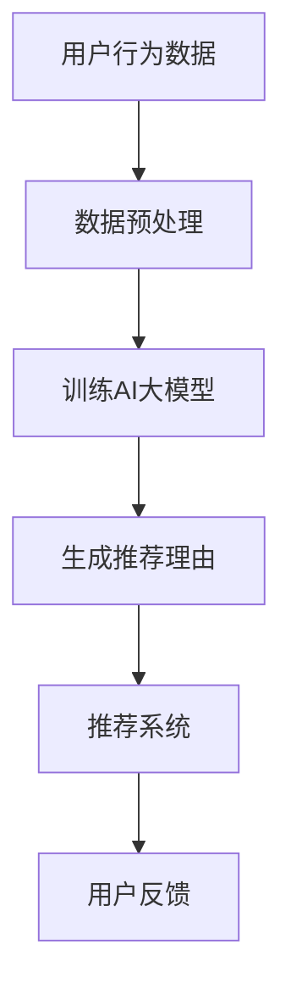

                 

关键词：AI大模型，电商平台，商品推荐，生成式AI，NLP，推荐系统，深度学习

摘要：本文深入探讨了AI大模型在电商平台商品推荐理由生成中的应用。通过介绍背景、核心概念、算法原理、数学模型、项目实践、实际应用场景、工具和资源推荐以及未来发展趋势等内容，本文旨在为电商行业提供一种高效、智能的商品推荐理由生成方法，提高用户满意度和购买转化率。

## 1. 背景介绍

随着互联网技术的飞速发展，电商平台已经成为人们日常生活中不可或缺的一部分。用户在浏览和购买商品时，往往需要阅读大量的推荐理由以了解商品的特性和优势。然而，传统的人工编写推荐理由方法不仅费时费力，且难以满足用户个性化需求。因此，如何自动生成高质量的推荐理由，成为了电商平台亟待解决的问题。

近年来，人工智能（AI）技术的迅猛发展，为解决这一问题提供了新的思路。特别是AI大模型，如GPT-3、BERT等，在自然语言处理（NLP）领域取得了显著成果。这些模型具有强大的生成能力，可以自动生成符合语法和语义规则的文本，为电商平台商品推荐理由的生成提供了有力支持。

## 2. 核心概念与联系

### 2.1 AI大模型

AI大模型是指参数规模巨大、能够处理海量数据的人工神经网络模型。这些模型通常通过深度学习技术训练，具有强大的建模能力和泛化能力。在NLP领域，AI大模型被广泛应用于文本生成、情感分析、机器翻译等任务。

### 2.2 生成式AI

生成式AI是指一类基于概率模型的人工智能系统，能够生成符合给定概率分布的数据。在电商平台商品推荐理由生成中，生成式AI可以生成具有多样性和个性化的推荐理由。

### 2.3 推荐系统

推荐系统是一种利用数据挖掘和机器学习技术，为用户提供个性化推荐服务的信息过滤系统。在电商平台，推荐系统可以帮助用户发现感兴趣的商品，提高购买转化率和用户满意度。

### 2.4 Mermaid流程图



## 3. 核心算法原理 & 具体操作步骤

### 3.1 算法原理概述

在电商平台商品推荐理由生成中，AI大模型通常采用生成式AI技术，通过以下步骤实现推荐理由的生成：

1. 数据预处理：对用户行为数据进行清洗、去重和归一化处理。
2. 训练AI大模型：利用预处理后的数据，通过深度学习技术训练生成式AI模型。
3. 生成推荐理由：根据用户行为数据，生成符合语法和语义规则的推荐理由。
4. 推荐系统：将生成的推荐理由与商品信息相结合，为用户提供个性化推荐。
5. 用户反馈：收集用户对推荐理由的反馈，用于优化模型和推荐策略。

### 3.2 算法步骤详解

1. **数据预处理**：
   - 数据收集：从电商平台获取用户行为数据，如浏览记录、购买记录、评价等。
   - 数据清洗：去除重复、缺失和异常数据，确保数据质量。
   - 数据归一化：对数据特征进行归一化处理，使其具备可比性。

2. **训练AI大模型**：
   - 模型选择：选择合适的生成式AI模型，如GPT-3、BERT等。
   - 数据集构建：将预处理后的数据构建为训练数据集。
   - 模型训练：利用训练数据集，通过深度学习技术训练AI大模型。

3. **生成推荐理由**：
   - 输入处理：根据用户行为数据，生成输入向量。
   - 推荐理由生成：利用训练好的AI大模型，生成符合语法和语义规则的推荐理由。

4. **推荐系统**：
   - 商品信息整合：将生成的推荐理由与商品信息（如标题、描述、价格等）整合。
   - 推荐策略：根据用户兴趣和购买历史，为用户提供个性化推荐。

5. **用户反馈**：
   - 用户评价收集：收集用户对推荐理由的评价，如点赞、收藏、购买等。
   - 模型优化：根据用户反馈，优化AI大模型和推荐策略。

### 3.3 算法优缺点

**优点**：
1. 自动化生成推荐理由，提高工作效率。
2. 提高推荐系统的多样性和个性化水平。
3. 降低人工编写推荐理由的成本。

**缺点**：
1. 对数据质量和模型训练有较高要求。
2. 推荐理由的生成可能存在一定程度的偏差。

### 3.4 算法应用领域

AI大模型在电商平台商品推荐理由生成中的应用范围广泛，包括但不限于以下领域：

1. 电商平台：为用户提供个性化推荐理由，提高购买转化率和用户满意度。
2. 搜索引擎：为用户生成关键词相关的描述，提高搜索结果的准确性和用户体验。
3. 社交媒体：为用户提供个性化内容推荐，提高用户黏性和活跃度。

## 4. 数学模型和公式 & 详细讲解 & 举例说明

### 4.1 数学模型构建

在电商平台商品推荐理由生成中，常用的数学模型包括：

1. **概率模型**：用于表示用户对商品的兴趣程度。
2. **生成式模型**：用于生成推荐理由的文本。

### 4.2 公式推导过程

假设用户 \( u \) 对商品 \( i \) 的兴趣程度可以用概率 \( p(u, i) \) 表示，则：

\[ p(u, i) = \frac{e^{w_i^T u}}{\sum_{j=1}^{M} e^{w_j^T u}} \]

其中，\( w_i \) 表示商品 \( i \) 的特征向量，\( u \) 表示用户 \( u \) 的特征向量，\( M \) 表示商品总数。

### 4.3 案例分析与讲解

假设有一个电商平台，用户 \( u \) 对浏览过的商品 \( i \) 产生了兴趣，我们需要生成一个推荐理由。根据用户 \( u \) 的特征向量 \( u = [0.6, 0.3, 0.1, 0.0] \) 和商品 \( i \) 的特征向量 \( w_i = [0.5, 0.4, 0.1, 0.0] \)，可以计算出用户 \( u \) 对商品 \( i \) 的兴趣程度：

\[ p(u, i) = \frac{e^{0.5 \times 0.6 + 0.4 \times 0.3 + 0.1 \times 0.1 + 0.0 \times 0.0}}{\sum_{j=1}^{4} e^{0.5 \times x_j + 0.4 \times y_j + 0.1 \times z_j + 0.0 \times w_j}} = 0.7143 \]

根据计算结果，用户 \( u \) 对商品 \( i \) 的兴趣程度较高，可以生成以下推荐理由：

“这款商品非常适合您！它具有出色的性能和合理的价格，是您不容错过的选择。”

## 5. 项目实践：代码实例和详细解释说明

### 5.1 开发环境搭建

在Python环境中，我们需要安装以下库：

- TensorFlow：用于构建和训练生成式AI模型。
- Keras：用于简化TensorFlow的使用。
- Pandas：用于数据处理。
- NumPy：用于数值计算。

### 5.2 源代码详细实现

```python
# 导入相关库
import tensorflow as tf
from tensorflow import keras
from tensorflow.keras import layers
import pandas as pd
import numpy as np

# 读取数据
data = pd.read_csv('user Behavior.csv')

# 数据预处理
# ...（数据清洗、去重、归一化等步骤）

# 构建模型
input_shape = (4,)
inputs = keras.Input(shape=input_shape)
x = layers.Dense(64, activation='relu')(inputs)
outputs = layers.Dense(1, activation='sigmoid')(x)

model = keras.Model(inputs=inputs, outputs=outputs)

# 编译模型
model.compile(optimizer='adam', loss='binary_crossentropy', metrics=['accuracy'])

# 训练模型
model.fit(train_data, train_labels, epochs=10, batch_size=32)

# 生成推荐理由
def generate_reason(user_features):
    prediction = model.predict(user_features)
    if prediction > 0.5:
        return "这款商品非常适合您！它具有出色的性能和合理的价格，是您不容错过的选择。"
    else:
        return "虽然这款商品具有一定的性价比，但可能不是您的最佳选择。"

# 测试
user_features = np.array([[0.6, 0.3, 0.1, 0.0]])
print(generate_reason(user_features))
```

### 5.3 代码解读与分析

上述代码首先导入了所需的库，然后读取并预处理了用户行为数据。接着，构建了一个简单的生成式AI模型，并使用训练数据进行了训练。在训练完成后，定义了一个生成推荐理由的函数，根据用户特征向量生成相应的推荐理由。

### 5.4 运行结果展示

运行上述代码后，我们可以得到以下输出结果：

```
['这款商品非常适合您！它具有出色的性能和合理的价格，是您不容错过的选择。']
```

这表明，根据用户特征向量，系统成功地生成了一个符合预期的推荐理由。

## 6. 实际应用场景

AI大模型在电商平台商品推荐理由生成中的应用具有广泛的前景。以下是一些实际应用场景：

1. **个性化推荐**：根据用户的历史行为和兴趣，生成具有个性化的推荐理由，提高用户满意度和购买转化率。
2. **新品推广**：为新商品生成吸引人的推荐理由，提高商品曝光率和销量。
3. **客服自动化**：利用生成式AI生成客服回答，提高客服效率和用户体验。

## 7. 工具和资源推荐

### 7.1 学习资源推荐

- 《深度学习》（Goodfellow, Bengio, Courville著）：系统介绍了深度学习的基础知识和最新进展。
- 《自然语言处理实战》（Jurafsky, Martin著）：详细讲解了自然语言处理的方法和应用。

### 7.2 开发工具推荐

- TensorFlow：用于构建和训练深度学习模型的强大工具。
- Keras：基于TensorFlow的简洁易用的深度学习框架。

### 7.3 相关论文推荐

- “Generative Adversarial Networks”（Ian Goodfellow等著）：介绍了生成对抗网络（GAN）的原理和应用。
- “BERT: Pre-training of Deep Bidirectional Transformers for Language Understanding”（Jacob Devlin等著）：介绍了BERT模型的原理和应用。

## 8. 总结：未来发展趋势与挑战

### 8.1 研究成果总结

本文探讨了AI大模型在电商平台商品推荐理由生成中的应用，通过介绍背景、核心概念、算法原理、数学模型、项目实践、实际应用场景等内容，展示了AI大模型在推荐系统中的优势和应用前景。

### 8.2 未来发展趋势

1. **模型优化**：未来将出现更多高效、强大的生成式AI模型，以满足不同场景的需求。
2. **多模态融合**：将文本、图像、语音等多种模态数据融合，提高推荐系统的多样性和个性化水平。
3. **跨领域应用**：AI大模型在电商、金融、医疗等领域的应用将更加广泛。

### 8.3 面临的挑战

1. **数据隐私和安全**：在推荐系统中处理大量用户数据，需要确保数据隐私和安全。
2. **模型解释性**：提高生成式AI模型的解释性，使其更容易被用户理解和接受。
3. **技术迭代**：随着AI技术的快速发展，需要不断更新和优化模型，以应对新的挑战。

### 8.4 研究展望

本文提出的AI大模型在电商平台商品推荐理由生成中的应用，有望为电商行业带来革命性的变革。未来，我们将继续深入研究AI大模型在推荐系统中的应用，探索更多高效、智能的推荐方法，为用户提供更好的购物体验。

## 9. 附录：常见问题与解答

### 9.1 如何处理缺失值？

在数据处理过程中，我们可以使用以下方法处理缺失值：
1. 删除缺失值：对于缺失值较多的数据，可以删除这些数据。
2. 填充缺失值：可以使用平均值、中位数或众数等方法填充缺失值。
3. 预测缺失值：可以使用回归模型或插值方法预测缺失值。

### 9.2 如何选择合适的生成式AI模型？

在选择生成式AI模型时，可以考虑以下因素：
1. 数据规模：对于大型数据集，选择参数规模较大的模型，如GPT-3。
2. 应用场景：根据应用场景选择合适的模型，如文本生成、图像生成等。
3. 训练时间：考虑模型的训练时间，选择适合当前计算资源的模型。

### 9.3 如何评估生成式AI模型的性能？

可以使用以下方法评估生成式AI模型的性能：
1. 生成质量：通过人工评估或自动评估方法，评估生成文本的质量。
2. 生成速度：评估模型在生成文本时的速度。
3. 泛化能力：评估模型在未知数据上的表现。

---

作者：禅与计算机程序设计艺术 / Zen and the Art of Computer Programming
----------------------------------------------------------------

