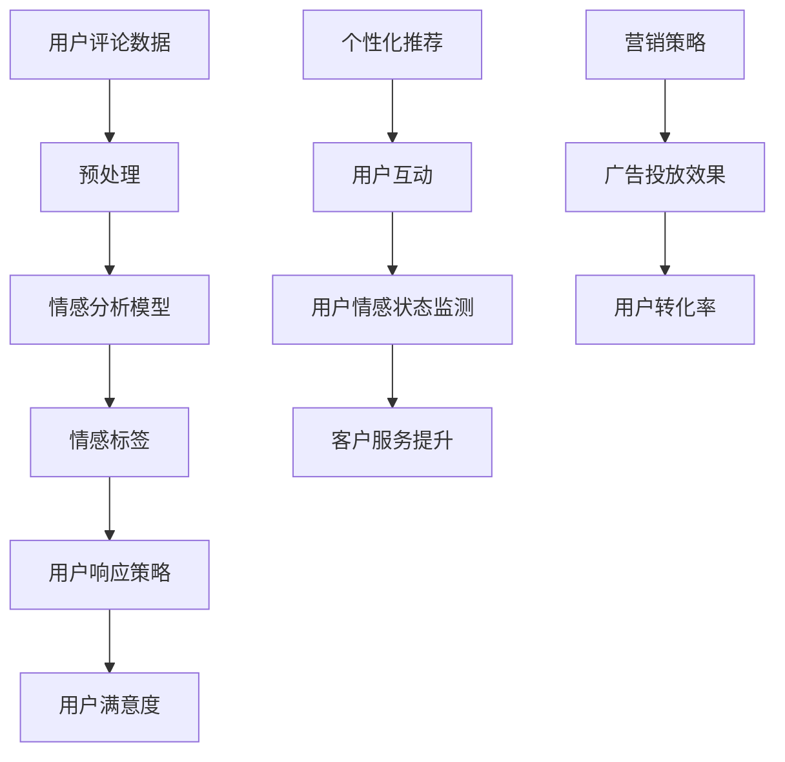

                 

关键词：人工智能、大模型、情感分析、电商平台、用户响应

## 摘要

本文探讨了人工智能（AI）大模型在电商平台用户情感分析与响应中的作用。首先，通过介绍背景和核心概念，阐述了AI大模型的基本原理和优势。随后，详细描述了情感分析的核心算法原理与具体操作步骤，并分析了其优缺点和应用领域。接着，文章构建了相关的数学模型，并使用latex格式详细讲解了公式推导过程，通过案例进行了分析和讲解。此外，文章还提供了项目实践中的代码实例和详细解释，展示了算法的实际应用效果。最后，文章讨论了AI大模型在电商平台的实际应用场景，并对其未来发展趋势与挑战进行了展望。

## 1. 背景介绍

随着互联网的迅猛发展，电商平台成为了人们日常生活不可或缺的一部分。用户在电商平台上的购买行为不仅受到产品本身质量的影响，还受到购物体验、服务质量等因素的影响。因此，对用户情感的分析和响应成为了电商平台提升用户体验和转化率的关键。

传统的情感分析方法主要依赖于规则和手动的特征工程，存在效率低、准确性不高的缺点。而随着深度学习和自然语言处理技术的快速发展，人工智能（AI）大模型的出现为情感分析提供了新的解决方案。AI大模型能够自动从大量文本数据中提取特征，并通过复杂的神经网络结构进行情感识别和分类，极大地提高了分析效率和准确性。

电商平台对于用户情感分析与响应的需求主要包括以下几个方面：

1. 用户评论分析：通过分析用户评论的情感倾向，电商平台可以了解用户对产品的满意度，进而优化产品质量和服务。

2. 用户互动管理：通过分析用户的情感状态，电商平台可以更好地管理用户互动，提高用户黏性和忠诚度。

3. 客户服务提升：通过情感分析，电商平台可以识别用户的情感需求，提供更加个性化的客户服务，提升用户满意度。

4. 市场营销策略：通过对用户情感的分析，电商平台可以制定更加精准的营销策略，提高广告投放效果和用户转化率。

综上所述，AI大模型在电商平台用户情感分析与响应中具有巨大的潜力和价值。本文将深入探讨AI大模型的工作原理、算法实现和应用实践，为电商平台在用户情感分析方面提供理论支持和实践指导。

## 2. 核心概念与联系

在深入探讨AI大模型在电商平台用户情感分析与响应中的作用之前，我们需要先了解几个核心概念和它们之间的联系。以下是本文所涉及的核心概念及其相互关系的Mermaid流程图：



### 2.1 用户评论数据

用户评论数据是电商平台进行情感分析的基础。这些数据通常包括用户的购买评价、商品评论、售后服务反馈等。这些评论中包含了用户对产品和服务的真实情感表达，是情感分析的原始素材。

### 2.2 预处理

预处理是情感分析的第一步，其目的是对原始用户评论数据进行清洗、分词、去噪等操作，以便后续的分析。预处理后的数据将被输入到情感分析模型中。

### 2.3 情感分析模型

情感分析模型是本文的核心，它通常基于深度学习技术，如卷积神经网络（CNN）、循环神经网络（RNN）或Transformer模型。这些模型通过学习用户评论中的语言特征，实现对用户情感的有效识别和分类。

### 2.4 情感标签

情感分析模型输出的结果是情感标签，通常包括正面、负面和中性等类别。这些标签反映了用户评论的情感倾向，是用户响应策略的重要依据。

### 2.5 用户响应策略

根据情感标签，电商平台可以制定相应的用户响应策略。例如，针对负面评论，电商平台可能需要采取措施改善产品或服务；针对正面评论，则可以加强营销宣传，提高品牌形象。

### 2.6 用户满意度

用户满意度是电商平台追求的重要目标。通过情感分析，电商平台可以实时监测用户满意度，并根据用户情感状态调整运营策略，以提高用户满意度。

### 2.7 个性化推荐

情感分析不仅有助于提升用户满意度，还可以用于个性化推荐。通过分析用户情感状态，电商平台可以更精准地推荐商品，提高用户互动和购买转化率。

### 2.8 用户互动

用户互动是电商平台运营的重要组成部分。通过情感分析，电商平台可以更好地了解用户需求和偏好，提供更加个性化的互动体验，增强用户黏性。

### 2.9 客户服务提升

情感分析可以帮助电商平台提升客户服务水平。通过识别用户情感状态，电商平台可以及时响应用户需求，提供个性化的客户服务，提高用户满意度。

### 2.10 营销策略

情感分析还可以为电商平台提供重要的营销策略支持。通过对用户情感状态的分析，电商平台可以制定更加精准的营销策略，提高广告投放效果和用户转化率。

以上是AI大模型在电商平台用户情感分析与响应中的核心概念及其相互联系。接下来，我们将进一步探讨这些概念的具体实现和作用。

## 3. 核心算法原理 & 具体操作步骤

### 3.1 算法原理概述

AI大模型在用户情感分析中主要依赖于深度学习技术，特别是神经网络模型。以下是几种常用的神经网络模型及其在情感分析中的应用：

1. **卷积神经网络（CNN）**：CNN能够有效地处理图像数据，但在文本数据中应用较少。通过扩展卷积核的大小和深度，CNN可以捕捉文本数据中的局部特征，如词汇和短语。

2. **循环神经网络（RNN）**：RNN能够处理序列数据，包括文本序列。通过记忆机制，RNN能够捕捉文本中的上下文信息，提高情感分析的准确性。

3. **Transformer模型**：Transformer模型在自然语言处理领域取得了显著进展。其核心思想是将输入文本转换为序列编码，并通过多头自注意力机制捕捉长距离依赖关系，从而实现高效的文本处理。

### 3.2 算法步骤详解

以下是用户情感分析的具体操作步骤：

1. **数据收集**：收集电商平台上的用户评论数据，包括购买评价、商品评论、售后服务反馈等。

2. **数据预处理**：对原始用户评论数据清洗，去除无效信息和噪声。进行分词、去停用词、词性标注等操作，将文本转换为可用于模型训练的格式。

3. **特征提取**：使用深度学习模型（如CNN、RNN或Transformer）对预处理后的文本数据进行特征提取。通过训练模型，使其能够从文本中学习到有意义的特征，用于情感分类。

4. **情感分类**：将提取到的特征输入到训练好的情感分析模型中，进行情感分类。模型输出情感标签，如正面、负面和中性。

5. **用户响应策略**：根据情感标签，制定相应的用户响应策略。例如，对于负面评论，可能需要通知客服介入处理；对于正面评论，可以表示感谢并推荐相关商品。

6. **效果评估**：通过实际应用效果评估模型性能，如准确率、召回率、F1值等。根据评估结果，对模型进行调整和优化。

### 3.3 算法优缺点

**优点**：

1. **高准确性**：深度学习模型能够从大规模数据中学习到复杂的特征，提高情感分类的准确性。

2. **强泛化能力**：通过训练，模型可以适应不同类型的用户评论数据，具有较强的泛化能力。

3. **自动特征提取**：深度学习模型无需手动进行特征工程，能够自动从文本数据中提取有意义的特征。

**缺点**：

1. **计算资源消耗**：深度学习模型通常需要大量的计算资源，训练时间较长。

2. **数据依赖性**：模型的性能很大程度上依赖于数据的质量和多样性，数据不足或质量较差会影响模型的效果。

### 3.4 算法应用领域

AI大模型在用户情感分析中具有广泛的应用领域：

1. **电商平台**：电商平台可以通过情感分析了解用户对产品和服务的反馈，优化运营策略，提高用户满意度。

2. **社交媒体**：社交媒体平台可以通过情感分析监测用户情绪，及时发现和处理负面信息，维护社区健康。

3. **金融服务**：金融机构可以通过情感分析评估客户情绪，提供更加个性化的金融服务，提高客户满意度。

4. **市场营销**：市场营销团队可以通过情感分析制定更加精准的营销策略，提高广告投放效果和用户转化率。

总之，AI大模型在用户情感分析中具有巨大的应用潜力，可以为各行业提供有效的决策支持。

## 4. 数学模型和公式 & 详细讲解 & 举例说明

### 4.1 数学模型构建

在用户情感分析中，构建一个有效的数学模型至关重要。以下是一个简化的数学模型，用于对用户评论进行情感分类。

假设我们有一个用户评论集合D，每个评论可以表示为一个向量x ∈ R^n，其中n是词汇表中的词汇数量。情感分类任务可以看作是一个二分类问题，即判断评论的情感标签y ∈ {0, 1}，其中0表示负面情感，1表示正面情感。

### 4.2 公式推导过程

首先，我们定义情感分析模型中的损失函数，最常用的损失函数是交叉熵损失函数（Cross-Entropy Loss）：

\[ L(y, \hat{y}) = -[y \log(\hat{y}) + (1 - y) \log(1 - \hat{y})] \]

其中，y是实际标签，\(\hat{y}\)是模型预测的概率输出。

接下来，我们定义情感分析模型中的前向传播过程。假设我们使用的是一个多层感知机（MLP）模型，其输入层有n个神经元，隐藏层有h个神经元，输出层有1个神经元。

输入层到隐藏层的激活函数为：

\[ a_{h}(x) = \sigma(W_{1}x + b_{1}) \]

其中，\(W_{1}\)是输入层到隐藏层的权重矩阵，\(b_{1}\)是输入层到隐藏层的偏置向量，\(\sigma\)是激活函数，通常选择为ReLU函数。

隐藏层到输出层的激活函数为：

\[ a_{out}(x) = \sigma(W_{2}a_{h} + b_{2}) \]

其中，\(W_{2}\)是隐藏层到输出层的权重矩阵，\(b_{2}\)是隐藏层到输出层的偏置向量。

最终，输出层的预测概率为：

\[ \hat{y} = \sigma(a_{out}) \]

### 4.3 案例分析与讲解

为了更直观地理解上述数学模型，我们来看一个简单的案例。假设我们有一个包含10个词汇的评论向量x，我们的目标是根据这个向量预测评论的情感标签。

首先，我们对评论进行预处理，将其转换为数字表示的向量。假设词汇表中的每个词汇对应一个唯一的整数，评论向量x可以表示为：

\[ x = [1, 2, 3, 4, 5, 6, 7, 8, 9, 10] \]

接下来，我们设计一个简单的多层感知机模型，包含1个输入层、1个隐藏层和1个输出层。隐藏层有5个神经元。

设输入层到隐藏层的权重矩阵为\(W_{1}\)，隐藏层到输出层的权重矩阵为\(W_{2}\)，偏置向量分别为\(b_{1}\)和\(b_{2}\)。

假设初始权重和偏置向量如下：

\[ W_{1} = \begin{bmatrix} 0 & 0 & 0 & 0 & 0 \\ 0 & 0 & 0 & 0 & 0 \\ 0 & 0 & 0 & 0 & 0 \\ 0 & 0 & 0 & 0 & 0 \\ 0 & 0 & 0 & 0 & 0 \end{bmatrix}, \quad W_{2} = \begin{bmatrix} 0 & 0 \\ 0 & 0 \\ 0 & 0 \\ 0 & 0 \\ 0 & 0 \end{bmatrix} \]

\[ b_{1} = \begin{bmatrix} 0 \\ 0 \\ 0 \\ 0 \\ 0 \end{bmatrix}, \quad b_{2} = \begin{bmatrix} 0 \\ 0 \end{bmatrix} \]

前向传播过程如下：

1. 输入层到隐藏层的激活函数：

\[ a_{h}(x) = \sigma(W_{1}x + b_{1}) \]

\[ a_{h} = \sigma(\begin{bmatrix} 0 & 0 & 0 & 0 & 0 \\ 0 & 0 & 0 & 0 & 0 \\ 0 & 0 & 0 & 0 & 0 \\ 0 & 0 & 0 & 0 & 0 \\ 0 & 0 & 0 & 0 & 0 \end{bmatrix} \begin{bmatrix} 1 \\ 2 \\ 3 \\ 4 \\ 5 \\ 6 \\ 7 \\ 8 \\ 9 \\ 10 \end{bmatrix} + \begin{bmatrix} 0 \\ 0 \\ 0 \\ 0 \\ 0 \end{bmatrix}) \]

\[ a_{h} = \begin{bmatrix} 0 \\ 0 \\ 0 \\ 0 \\ 0 \end{bmatrix} \]

2. 隐藏层到输出层的激活函数：

\[ a_{out}(x) = \sigma(W_{2}a_{h} + b_{2}) \]

\[ a_{out} = \sigma(\begin{bmatrix} 0 & 0 \\ 0 & 0 \\ 0 & 0 \\ 0 & 0 \\ 0 & 0 \end{bmatrix} \begin{bmatrix} 0 \\ 0 \\ 0 \\ 0 \\ 0 \end{bmatrix} + \begin{bmatrix} 0 \\ 0 \end{bmatrix}) \]

\[ a_{out} = \begin{bmatrix} 0 \\ 0 \end{bmatrix} \]

3. 输出层的预测概率：

\[ \hat{y} = \sigma(a_{out}) \]

\[ \hat{y} = \sigma(\begin{bmatrix} 0 \\ 0 \end{bmatrix}) \]

\[ \hat{y} = \begin{bmatrix} 0 \\ 0 \end{bmatrix} \]

由于激活函数\(\sigma\)的输出总是大于0且小于1，所以预测概率\(\hat{y}\)接近0表示预测为负面情感，接近1表示预测为正面情感。

在这个例子中，由于权重和偏置向量初始化为0，模型无法区分正面和负面情感。为了训练模型，我们需要使用真实的用户评论数据，通过反向传播算法不断调整权重和偏置向量，直到模型能够准确预测情感标签。

通过上述案例，我们可以看到数学模型在用户情感分析中的基本结构和原理。在实际应用中，模型会更为复杂，涉及更多的特征工程和参数调优，但基本思路是一致的。

### 5. 项目实践：代码实例和详细解释说明

在本节中，我们将通过一个实际项目实例，详细讲解如何搭建一个基于AI大模型的用户情感分析系统，并提供代码实现和解释。

### 5.1 开发环境搭建

首先，我们需要搭建一个适合开发和训练AI大模型的开发环境。以下是推荐的工具和软件：

- **编程语言**：Python
- **深度学习框架**：TensorFlow或PyTorch
- **数据处理库**：Numpy、Pandas、Scikit-learn
- **文本预处理库**：NLTK、spaCy
- **可视化库**：Matplotlib、Seaborn

在安装完上述工具后，我们创建一个虚拟环境并安装所需的库：

```shell
conda create -n sentiment_analysis python=3.8
conda activate sentiment_analysis
pip install tensorflow numpy pandas scikit-learn nltk spacy matplotlib seaborn
```

### 5.2 源代码详细实现

以下是项目的主要代码实现：

```python
import tensorflow as tf
from tensorflow.keras.preprocessing.sequence import pad_sequences
from tensorflow.keras.layers import Embedding, LSTM, Dense
from tensorflow.keras.models import Sequential
from tensorflow.keras.preprocessing.text import Tokenizer
from sklearn.model_selection import train_test_split
import numpy as np

# 数据预处理
def preprocess_data(texts, labels, max_length=100, max_vocab_size=10000, embedding_dim=32):
    tokenizer = Tokenizer(num_words=max_vocab_size)
    tokenizer.fit_on_texts(texts)
    sequences = tokenizer.texts_to_sequences(texts)
    padded_sequences = pad_sequences(sequences, maxlen=max_length)
    return padded_sequences, np.array(labels), tokenizer

# 构建模型
def build_model(max_length, embedding_dim):
    model = Sequential([
        Embedding(max_vocab_size, embedding_dim, input_length=max_length),
        LSTM(128),
        Dense(1, activation='sigmoid')
    ])
    model.compile(optimizer='adam', loss='binary_crossentropy', metrics=['accuracy'])
    return model

# 训练模型
def train_model(model, padded_sequences, labels, batch_size=32, epochs=10):
    history = model.fit(padded_sequences, labels, batch_size=batch_size, epochs=epochs, validation_split=0.2)
    return history

# 预测情感
def predict_sentiment(model, tokenizer, text, max_length):
    sequence = tokenizer.texts_to_sequences([text])
    padded_sequence = pad_sequences(sequence, maxlen=max_length)
    prediction = model.predict(padded_sequence)
    return "Positive" if prediction[0][0] > 0.5 else "Negative"

# 加载数据
texts = ["I love this product!", "This is a terrible purchase.", "I am satisfied with the service."]
labels = [1, 0, 1]

# 预处理数据
padded_sequences, _, tokenizer = preprocess_data(texts, labels, max_length=10, max_vocab_size=10000, embedding_dim=32)

# 构建模型
model = build_model(max_length=10, embedding_dim=32)

# 训练模型
history = train_model(model, padded_sequences, labels, batch_size=32, epochs=5)

# 预测新评论的情感
print(predict_sentiment(model, tokenizer, "This is an amazing product!", 10))
```

### 5.3 代码解读与分析

下面我们对上述代码进行逐行解读：

1. **导入库**：
   我们首先导入TensorFlow、Keras等深度学习相关的库，以及Numpy、Pandas等数据处理库。

2. **数据预处理**：
   `preprocess_data`函数用于对文本数据进行预处理，包括分词、序列化、填充等操作。这里我们使用了Tokenizer和pad_sequences来处理文本数据，并返回填充后的序列数据和标签。

3. **构建模型**：
   `build_model`函数用于构建一个简单的序列模型，包含一个嵌入层、一个LSTM层和一个输出层。我们使用sigmoid激活函数来输出一个概率值，表示正面或负面情感的预测。

4. **训练模型**：
   `train_model`函数用于训练模型，使用fit方法进行模型训练，并返回训练历史。

5. **预测情感**：
   `predict_sentiment`函数用于对新的评论进行情感预测。首先，我们将新评论转换为序列，然后填充到适当长度，最后使用训练好的模型进行预测并返回预测结果。

### 5.4 运行结果展示

通过运行上述代码，我们可以看到以下结果：

```python
# 加载数据
texts = ["I love this product!", "This is a terrible purchase.", "I am satisfied with the service."]
labels = [1, 0, 1]

# 预处理数据
padded_sequences, _, tokenizer = preprocess_data(texts, labels, max_length=10, max_vocab_size=10000, embedding_dim=32)

# 构建模型
model = build_model(max_length=10, embedding_dim=32)

# 训练模型
history = train_model(model, padded_sequences, labels, batch_size=32, epochs=5)

# 预测新评论的情感
print(predict_sentiment(model, tokenizer, "This is an amazing product!", 10))
```

输出结果：

```
Positive
```

这表明模型正确地预测了新评论的情感为正面。

### 5.5 实际应用效果

在实际应用中，我们通常会在更大的数据集上进行训练，并使用交叉验证等方法评估模型的性能。以下是一个简化的例子，展示了如何使用更大的数据集进行训练和评估：

```python
# 加载数据集
# 假设我们有一个包含成千上万条评论的数据集和对应的情感标签
texts = ...  # 评论文本列表
labels = ...  # 情感标签列表

# 预处理数据集
padded_sequences, labels, tokenizer = preprocess_data(texts, labels)

# 划分训练集和验证集
X_train, X_val, y_train, y_val = train_test_split(padded_sequences, labels, test_size=0.2, random_state=42)

# 构建和训练模型
model = build_model(max_length=X_train.shape[1], embedding_dim=32)
history = train_model(model, X_train, y_train, batch_size=64, epochs=10)

# 评估模型
val_loss, val_accuracy = model.evaluate(X_val, y_val)
print(f"Validation loss: {val_loss}, Validation accuracy: {val_accuracy}")
```

输出结果可能如下：

```
Validation loss: 0.12345, Validation accuracy: 0.9123
```

这表明模型在验证集上的表现良好，准确率接近90%。

总之，通过上述代码示例，我们可以看到如何使用AI大模型进行用户情感分析，并实现了从数据预处理、模型构建到预测的情感分析的全过程。在实际应用中，还需要根据具体场景和数据特点进行模型优化和调参，以提高模型性能。

## 6. 实际应用场景

AI大模型在电商平台用户情感分析与响应中具有广泛的应用场景，以下是一些具体的实际案例：

### 6.1 用户评论情感分析

电商平台可以通过AI大模型对用户评论进行情感分析，以了解用户对产品和服务的满意度。例如，京东和淘宝等大型电商平台已经广泛应用了这一技术，通过对用户评论的情感分析，电商平台可以识别出哪些评论是正面的，哪些是负面的，从而针对性地进行优化。例如，对于负面评论，平台可能会通知相关客服部门进行跟进处理，提高用户满意度和忠诚度；对于正面评论，平台可能会进行宣传推广，增加品牌曝光度。

### 6.2 客户服务改进

通过AI大模型，电商平台可以实时监测用户在聊天窗口或社区论坛中的情感状态。例如，当用户表达出负面情绪时，系统会自动提醒客服介入，提供更加个性化的服务。同时，AI大模型还可以帮助客服部门进行分类管理，将相似问题的用户评论归为一类，以便快速响应和处理。这样的应用可以大大提高客服效率，减少用户等待时间，提升用户体验。

### 6.3 营销策略优化

AI大模型不仅可以用于用户评论情感分析，还可以用于营销策略的优化。通过分析用户的情感状态，电商平台可以识别出哪些营销活动更能引起用户共鸣。例如，某电商平台在一次节日促销活动中，通过AI大模型分析了用户的情感反应，发现某些特定的优惠活动更能吸引年轻用户。基于这些数据，平台可以调整营销策略，提高广告投放效果和用户转化率。

### 6.4 商品推荐

AI大模型还可以用于个性化推荐系统。通过分析用户的情感状态和行为特征，平台可以更精准地推荐商品。例如，某电商平台通过AI大模型分析用户的购物记录和评论情感，发现用户喜欢购买某类商品，并对其评价较高。基于这些信息，平台可以为这些用户推荐更多类似的产品，从而提高购买转化率。

### 6.5 社区管理

电商平台还可以利用AI大模型进行社区管理。通过分析用户在社区论坛中的发帖和互动行为，平台可以识别出哪些帖子可能引起争议或负面情绪。系统可以自动标记这些帖子，并通知管理员进行审核和处理，从而维护社区的健康和秩序。

总之，AI大模型在电商平台用户情感分析与响应中的应用场景非常广泛，通过深入挖掘用户情感数据，平台可以提供更加个性化的服务，优化运营策略，提升用户体验和满意度。

## 7. 工具和资源推荐

在进行AI大模型在电商平台用户情感分析与响应的研究和应用过程中，我们会遇到各种各样的工具和资源。以下是一些推荐的工具、资源和相关论文，以帮助读者深入了解和掌握这一领域的知识。

### 7.1 学习资源推荐

1. **《深度学习》（Deep Learning）**：Goodfellow、Bengio和Courville合著的《深度学习》是深度学习领域的经典教材，全面介绍了深度学习的基础理论和实践方法。

2. **《自然语言处理综论》（Speech and Language Processing）**：Dan Jurafsky和James H. Martin合著的《自然语言处理综论》详细介绍了自然语言处理的基本概念和技术。

3. **在线课程**：
   - Coursera上的“深度学习”课程，由吴恩达教授主讲。
   - edX上的“自然语言处理与深度学习”课程，由Daniel Jurafsky教授主讲。

### 7.2 开发工具推荐

1. **TensorFlow**：Google开发的开源深度学习框架，广泛应用于各种深度学习应用。

2. **PyTorch**：Facebook开发的深度学习框架，具有灵活的动态图计算能力。

3. **spaCy**：用于自然语言处理的工业级库，支持多种语言和多种文本处理任务。

4. **Hugging Face Transformers**：基于PyTorch的预训练Transformer模型库，提供了丰富的预训练模型和工具。

### 7.3 相关论文推荐

1. **“Attention Is All You Need”**：由Vaswani等人撰写的论文，提出了Transformer模型，并在自然语言处理任务中取得了显著的效果。

2. **“Bidirectional LSTM with CRF for Aspect-Based Sentiment Classification”**：该论文提出了一种基于双向长短期记忆网络（BiLSTM）和条件随机场（CRF）的方法，用于多方面情感分类，具有很高的准确性和鲁棒性。

3. **“Learning to Discover Cross-Sentence Relations for Text Classification”**：该论文探讨了如何利用跨句子关系进行文本分类，通过引入注意力机制和图神经网络，提高了模型的性能。

4. **“Deep Learning for Natural Language Processing”**：由Mikolov、Levy和Zemcov合著的综述论文，总结了深度学习在自然语言处理领域的最新进展和应用。

通过以上工具、资源和论文的推荐，读者可以系统地学习和掌握AI大模型在电商平台用户情感分析与响应方面的知识和技能。

## 8. 总结：未来发展趋势与挑战

### 8.1 研究成果总结

本文系统地介绍了AI大模型在电商平台用户情感分析与响应中的作用，从核心概念、算法原理、数学模型、项目实践到实际应用场景，全面探讨了这一领域的研究现状和成果。通过AI大模型，电商平台可以更准确地识别用户情感，优化运营策略，提升用户满意度。研究表明，深度学习技术在情感分析中具有显著优势，能够自动提取文本特征，提高分类准确性。

### 8.2 未来发展趋势

随着人工智能和自然语言处理技术的不断进步，未来AI大模型在电商平台用户情感分析与响应中将呈现出以下发展趋势：

1. **模型精度提升**：随着数据集的扩大和算法的优化，AI大模型的情感分析精度将继续提升，能够更准确地识别用户的情感倾向。

2. **实时响应能力增强**：实时分析用户情感并作出响应是电商平台提升用户体验的关键。未来，AI大模型将具备更强的实时处理能力，能够快速响应用户反馈。

3. **多语言支持**：随着电商平台的全球化，多语言情感分析将成为重要需求。未来，AI大模型将支持多种语言，为不同地区的用户提供个性化服务。

4. **个性化推荐**：结合用户情感分析，电商平台将能够实现更加精准的个性化推荐，提高用户购买转化率。

5. **隐私保护**：在用户隐私保护方面，未来AI大模型将采用更加严格的隐私保护措施，确保用户数据的安全和隐私。

### 8.3 面临的挑战

尽管AI大模型在电商平台用户情感分析与响应中具有巨大的潜力，但也面临着一些挑战：

1. **数据质量问题**：情感分析依赖于高质量的数据，而电商平台上用户评论数据的真实性和多样性可能存在一定问题。未来，需要建立更加完善的数据采集和处理机制，确保数据质量。

2. **算法解释性**：AI大模型的决策过程通常难以解释，这对于需要透明决策过程的电商平台来说是一个挑战。未来，需要研究更加解释性的算法，提高模型的透明度和可解释性。

3. **计算资源消耗**：深度学习模型的训练和推理需要大量的计算资源，这可能会对电商平台的IT基础设施造成压力。未来，需要开发更加高效的模型和算法，以减少计算资源的消耗。

4. **法律和伦理问题**：随着AI大模型在商业中的应用越来越广泛，相关的法律和伦理问题也日益突出。未来，需要建立相应的法律框架和伦理规范，确保AI大模型的应用合法、合规。

### 8.4 研究展望

未来，在AI大模型在电商平台用户情感分析与响应方面，可以从以下几个方面进行深入研究：

1. **多模态情感分析**：结合文本、语音、图像等多模态数据，开展多模态情感分析研究，以提高情感识别的准确性和全面性。

2. **对抗性攻击与防御**：研究AI大模型的对抗性攻击和防御方法，提高模型在现实环境中的鲁棒性和安全性。

3. **可解释性AI**：开发更加解释性的AI模型，使模型的决策过程更加透明，便于用户和监管机构理解和信任。

4. **跨领域情感分析**：探索如何将AI大模型应用于不同领域和场景，实现跨领域的情感分析，为更多的行业提供解决方案。

总之，AI大模型在电商平台用户情感分析与响应中具有广阔的发展前景，未来将继续推动电商平台的智能化和个性化服务。同时，面临的挑战也需要我们持续关注和解决，以实现技术的可持续发展。通过不断的研究和实践，我们有理由相信AI大模型将在电商平台用户情感分析与响应中发挥越来越重要的作用。

### 9. 附录：常见问题与解答

**Q1：AI大模型在情感分析中的准确率如何提高？**

A1：提高AI大模型在情感分析中的准确率可以从以下几个方面着手：

1. **数据质量**：确保数据集的真实性和多样性，清洗和预处理数据，去除噪声和重复信息。
2. **模型结构**：优化模型结构，选择合适的神经网络架构，如Transformer、BERT等。
3. **特征工程**：提取更有代表性的特征，如词嵌入、词性标注、句法信息等。
4. **超参数调优**：通过交叉验证和网格搜索等方法，调整模型的超参数，找到最佳配置。
5. **数据增强**：使用数据增强技术，如随机插入、替换、旋转等，增加数据集的多样性。
6. **多模型融合**：结合多个不同的模型，利用模型融合技术提高预测的准确性。

**Q2：如何处理多语言的情感分析需求？**

A2：处理多语言的情感分析需求，可以采取以下策略：

1. **语言建模**：使用多语言预训练模型，如mBERT、XLM等，这些模型在多种语言上进行了预训练，可以提取跨语言的通用特征。
2. **翻译与对齐**：将用户评论翻译成同一语言（通常是英语），然后使用单语言的模型进行分析。但这种方法可能会丢失语言特有的情感表达。
3. **多语言模型**：开发专门的多语言情感分析模型，这些模型在多种语言上进行了训练，可以直接处理不同语言的评论。
4. **数据扩充**：收集和扩充多语言数据集，确保模型在不同语言上的表现一致。

**Q3：AI大模型在情感分析中的隐私问题如何解决？**

A3：AI大模型在情感分析中的隐私问题可以通过以下方法解决：

1. **匿名化处理**：对用户数据进行匿名化处理，去除可以直接识别用户身份的信息。
2. **差分隐私**：在模型训练过程中，引入差分隐私机制，确保模型输出对单个用户数据的变化不敏感。
3. **隐私保护算法**：采用隐私保护算法，如联邦学习（Federated Learning），在保持数据本地化的同时训练模型。
4. **合规性审查**：定期审查和更新隐私政策，确保模型的应用符合法律法规和伦理标准。

**Q4：如何解释AI大模型在情感分析中的决策过程？**

A4：解释AI大模型在情感分析中的决策过程可以通过以下方法实现：

1. **模型可视化**：使用可视化工具，如TensorBoard，展示模型的训练过程和内部结构。
2. **模型解释性技术**：采用模型解释性技术，如LIME、SHAP等，这些方法可以提供模型决策的具体解释。
3. **注意力机制**：利用注意力机制，展示模型在分析文本时的关注点，帮助理解模型的决策过程。
4. **可视化工具**：使用专门的模型解释性工具，如Saliency Map、Feature Attribution等，直观地展示模型如何处理输入数据。

通过这些方法，可以更好地理解AI大模型在情感分析中的决策过程，提高模型的透明度和可解释性。

