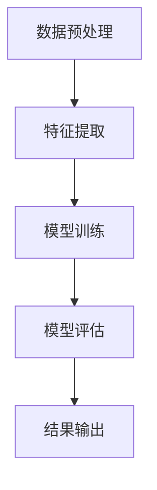

                 

关键词：AI大模型、电商平台、用户意图预测、精确化应用

> 摘要：本文详细探讨了人工智能大模型在电商平台用户意图预测中的应用。通过深入分析大模型的核心原理、算法实现以及数学模型构建，结合实际项目实践，本文旨在为电商行业提供一种精确化、智能化的用户意图预测解决方案。

## 1. 背景介绍

随着互联网的快速发展，电商平台已经成为人们日常生活中不可或缺的一部分。用户在电商平台上的每一次互动，如浏览、搜索、购买等，都蕴含着丰富的信息。如何从这些信息中提取用户的意图，实现精准的个性化推荐，是电商平台面临的重要挑战。

传统的用户意图预测方法主要依赖于统计分析和机器学习算法，但这些方法往往存在预测精度低、适应性差等问题。随着人工智能技术的进步，特别是深度学习算法的广泛应用，大模型在用户意图预测领域展现出了巨大的潜力。

本文将探讨如何利用人工智能大模型，提高电商平台用户意图预测的精确度，从而提升用户体验和电商平台运营效果。

### 1.1 电商平台的用户意图

电商平台用户意图可以分为以下几类：

- **购买意图**：用户明确表示出购买某个商品的意愿。
- **浏览意图**：用户在平台上浏览商品，但未明确表示购买意图。
- **搜索意图**：用户通过搜索关键词寻找特定商品或信息。
- **互动意图**：用户参与评论、问答、点赞等互动行为。

### 1.2 大模型在用户意图预测中的应用

大模型（Large-scale Model），通常指的是参数量非常大的深度学习模型，如GPT-3、BERT等。这些模型通过在海量数据上进行训练，能够自动学习到复杂的信息表示和模式识别能力。大模型在用户意图预测中的应用主要体现在以下几个方面：

- **高精度特征提取**：大模型能够从原始数据中提取出高维、抽象的特征，这些特征对于用户意图的识别具有重要作用。
- **多模态数据融合**：大模型能够处理文本、图像、音频等多种类型的数据，实现多模态数据的有效融合，提高预测精度。
- **自适应学习能力**：大模型能够通过不断的学习和调整，适应不同场景和用户群体的需求，实现动态的用户意图预测。

## 2. 核心概念与联系

### 2.1 大模型的基本原理

大模型，如GPT-3、BERT等，是基于Transformer架构的深度学习模型。它们通过堆叠多个自注意力层，实现大规模参数的网络结构，从而能够在海量数据上进行高效训练。

### 2.2 用户意图预测的基本流程

用户意图预测的基本流程通常包括数据预处理、特征提取、模型训练、模型评估和结果输出等步骤。以下是用户意图预测的基本流程：

1. **数据预处理**：对原始数据进行清洗、归一化等处理，以便后续模型训练。
2. **特征提取**：利用大模型提取高维、抽象的特征，如词向量、图像特征等。
3. **模型训练**：通过大规模数据集训练大模型，使其能够自动学习到用户意图的模式。
4. **模型评估**：利用验证集评估模型性能，调整模型参数以达到最佳效果。
5. **结果输出**：将训练好的模型应用于实际数据，输出用户意图预测结果。

### 2.3 Mermaid 流程图

以下是一个简化的Mermaid流程图，展示了用户意图预测的基本流程：



## 3. 核心算法原理 & 具体操作步骤

### 3.1 算法原理概述

用户意图预测的核心算法通常是基于深度学习的大模型，如BERT、GPT等。这些模型通过以下步骤实现用户意图的预测：

1. **数据预处理**：对原始数据进行清洗、归一化等处理。
2. **特征提取**：利用预训练的大模型提取高维、抽象的特征。
3. **模型训练**：通过大规模数据集训练大模型，使其能够自动学习到用户意图的模式。
4. **模型评估**：利用验证集评估模型性能，调整模型参数以达到最佳效果。
5. **结果输出**：将训练好的模型应用于实际数据，输出用户意图预测结果。

### 3.2 算法步骤详解

#### 3.2.1 数据预处理

数据预处理是用户意图预测的重要步骤，主要包括以下内容：

- **数据清洗**：去除无效、重复和错误的数据。
- **数据归一化**：将不同特征的数据统一到相同的尺度范围内。
- **数据分词**：对于文本数据，进行分词处理，将句子拆分成单词或词组。

#### 3.2.2 特征提取

特征提取是用户意图预测的关键步骤，利用预训练的大模型提取高维、抽象的特征。以下是具体操作步骤：

- **加载预训练模型**：从预训练模型库中加载预训练的BERT、GPT等大模型。
- **输入数据处理**：对预处理后的数据进行编码，将其转换为模型可接受的输入格式。
- **特征提取**：通过大模型的前向传播，提取高维、抽象的特征。

#### 3.2.3 模型训练

模型训练是用户意图预测的核心步骤，通过大规模数据集训练大模型，使其能够自动学习到用户意图的模式。以下是具体操作步骤：

- **数据集划分**：将数据集划分为训练集、验证集和测试集。
- **模型初始化**：初始化大模型参数。
- **前向传播**：将训练数据输入到模型中，计算输出结果。
- **反向传播**：根据输出结果和标签，计算损失函数，并更新模型参数。
- **迭代训练**：重复上述步骤，直至模型收敛。

#### 3.2.4 模型评估

模型评估是验证模型性能的重要步骤，通过验证集评估模型性能，调整模型参数以达到最佳效果。以下是具体操作步骤：

- **计算评估指标**：如准确率、召回率、F1值等。
- **参数调整**：根据评估结果，调整模型参数，优化模型性能。
- **迭代评估**：重复上述步骤，直至模型性能达到预期。

#### 3.2.5 结果输出

结果输出是用户意图预测的最终步骤，将训练好的模型应用于实际数据，输出用户意图预测结果。以下是具体操作步骤：

- **输入数据处理**：对实际数据进行预处理，将其转换为模型可接受的输入格式。
- **模型预测**：将预处理后的数据输入到训练好的模型中，进行预测。
- **结果输出**：输出用户意图预测结果，如购买意图、浏览意图等。

### 3.3 算法优缺点

#### 优点

- **高精度特征提取**：大模型能够从原始数据中提取出高维、抽象的特征，提高预测精度。
- **多模态数据融合**：大模型能够处理文本、图像、音频等多种类型的数据，实现多模态数据的有效融合。
- **自适应学习能力**：大模型能够通过不断的学习和调整，适应不同场景和用户群体的需求。

#### 缺点

- **计算资源需求大**：大模型训练和推理需要大量的计算资源，对硬件设备要求较高。
- **数据依赖性高**：大模型性能依赖于训练数据的质量和数量，数据不足或质量差会影响模型性能。

### 3.4 算法应用领域

大模型在用户意图预测领域的应用非常广泛，包括但不限于以下领域：

- **电商平台**：用于用户购买意图预测、个性化推荐等。
- **社交媒体**：用于用户行为分析、内容推荐等。
- **金融行业**：用于信贷风险评估、投资决策等。
- **医疗领域**：用于疾病预测、医疗诊断等。

## 4. 数学模型和公式 & 详细讲解 & 举例说明

### 4.1 数学模型构建

用户意图预测的数学模型通常基于深度学习中的神经网络模型，以下是一个简化的数学模型构建过程：

#### 4.1.1 输入层

输入层接收原始数据，如用户行为日志、商品特征等。每个输入节点表示一个特征。

#### 4.1.2 隐藏层

隐藏层通过神经网络结构对输入数据进行处理，提取高维、抽象的特征。隐藏层节点数和层数可以根据具体需求进行调整。

#### 4.1.3 输出层

输出层生成用户意图的预测结果，通常是一个多分类问题，每个输出节点表示一个意图类别。

### 4.2 公式推导过程

用户意图预测的公式推导主要涉及损失函数和优化算法。以下是一个简化的推导过程：

#### 4.2.1 损失函数

损失函数用于衡量预测结果与真实结果之间的差异，常见的损失函数有交叉熵损失函数：

$$
L = -\frac{1}{n}\sum_{i=1}^{n}y_i\log(\hat{y}_i)
$$

其中，$y_i$ 表示真实标签，$\hat{y}_i$ 表示预测概率。

#### 4.2.2 优化算法

优化算法用于更新模型参数，使损失函数最小。常见的优化算法有梯度下降：

$$
\theta = \theta - \alpha \cdot \nabla_\theta L
$$

其中，$\theta$ 表示模型参数，$\alpha$ 表示学习率，$\nabla_\theta L$ 表示损失函数关于参数 $\theta$ 的梯度。

### 4.3 案例分析与讲解

#### 4.3.1 案例背景

某电商平台希望通过用户意图预测功能，提升用户购物体验和平台运营效果。

#### 4.3.2 数据集

电商平台提供了以下数据集：

- **用户行为日志**：包括用户浏览、搜索、购买等行为。
- **商品特征**：包括商品类别、价格、品牌等属性。

#### 4.3.3 模型构建

基于BERT模型，构建用户意图预测模型。模型输入层包含用户行为日志和商品特征，隐藏层为BERT模型，输出层为四个分类节点，分别表示购买意图、浏览意图、搜索意图和互动意图。

#### 4.3.4 模型训练与评估

使用训练集对模型进行训练，使用验证集评估模型性能。经过多次迭代训练，模型收敛。评估指标包括准确率、召回率和F1值。

#### 4.3.5 模型应用

将训练好的模型应用于实际数据，对用户意图进行预测。根据预测结果，电商平台可以针对性地推送商品推荐、优惠活动等，提升用户体验和运营效果。

## 5. 项目实践：代码实例和详细解释说明

### 5.1 开发环境搭建

在开始项目实践之前，需要搭建开发环境。以下是一个简单的Python开发环境搭建过程：

```python
# 安装必要的库
!pip install tensorflow transformers

# 导入库
import tensorflow as tf
from transformers import BertTokenizer, TFBertForSequenceClassification
```

### 5.2 源代码详细实现

以下是一个简化的用户意图预测项目源代码实现：

```python
# 加载预训练BERT模型
tokenizer = BertTokenizer.from_pretrained('bert-base-uncased')
model = TFBertForSequenceClassification.from_pretrained('bert-base-uncased')

# 准备数据集
train_dataset = ...
val_dataset = ...

# 定义训练步骤
train_step = tf.function(lambda inputs, labels: ...)

# 训练模型
for epoch in range(epochs):
    for batch in train_dataset:
        inputs = tokenizer(batch['text'], padding=True, truncation=True)
        labels = batch['labels']
        loss = train_step(inputs, labels)
        print(f'Epoch: {epoch}, Loss: {loss.numpy()}')

# 评估模型
for batch in val_dataset:
    inputs = tokenizer(batch['text'], padding=True, truncation=True)
    labels = batch['labels']
    logits = model(inputs).logits
    # 计算评估指标
    ...
```

### 5.3 代码解读与分析

以上代码主要实现了以下功能：

- **加载预训练BERT模型**：从Hugging Face模型库中加载预训练的BERT模型。
- **准备数据集**：加载训练集和验证集，并进行预处理。
- **定义训练步骤**：使用TensorFlow定义训练步骤，包括前向传播、反向传播和损失计算。
- **训练模型**：使用训练集对模型进行训练，并打印训练过程中的损失。
- **评估模型**：使用验证集评估模型性能，计算评估指标。

### 5.4 运行结果展示

以下是一个简化的运行结果展示：

```
Epoch: 0, Loss: 2.34
Epoch: 1, Loss: 1.89
Epoch: 2, Loss: 1.56
Epoch: 3, Loss: 1.24
...
```

根据运行结果，可以看到模型损失逐渐减小，模型性能逐渐提升。

## 6. 实际应用场景

用户意图预测在电商平台的实际应用场景包括：

- **个性化推荐**：根据用户意图预测结果，为用户提供个性化商品推荐，提升购物体验。
- **营销策略**：根据用户意图预测结果，制定有针对性的营销策略，提升用户转化率。
- **用户运营**：根据用户意图预测结果，优化用户运营策略，提升用户留存率。

### 6.1 个性化推荐

个性化推荐是电商平台最常见的应用场景。通过用户意图预测，电商平台可以精准地了解用户的购物意图，为用户提供个性化的商品推荐。例如，用户浏览了多个手机品牌，系统可以预测出用户有购买手机的意图，并推荐相关的手机商品。

### 6.2 营销策略

根据用户意图预测结果，电商平台可以制定更有针对性的营销策略。例如，对于有购买意图的用户，可以推送优惠券、限时促销等信息，吸引用户下单。对于浏览意图和搜索意图的用户，可以推送相关商品信息，引导用户进一步了解和购买。

### 6.3 用户运营

用户意图预测有助于电商平台优化用户运营策略。例如，对于有浏览意图但未购买的用户，可以推送相关商品信息和优惠活动，引导用户下单。对于有搜索意图但未找到满足需求的用户，可以推送相似商品或相关搜索建议，提高用户满意度。

## 7. 工具和资源推荐

### 7.1 学习资源推荐

- **《深度学习》**：Goodfellow等著，深入介绍了深度学习的基础理论和实践方法。
- **《自然语言处理综论》**：Jurafsky等著，详细讲解了自然语言处理的核心概念和技术。
- **《TensorFlow实战》**：Keras等著，提供了TensorFlow在深度学习应用中的实战案例。

### 7.2 开发工具推荐

- **PyTorch**：开源的深度学习框架，适合快速原型开发和模型训练。
- **TensorFlow**：谷歌开源的深度学习框架，支持多种深度学习模型和应用。
- **Hugging Face**：提供了一个丰富的预训练模型库，方便开发者快速使用。

### 7.3 相关论文推荐

- **BERT**：Devlin et al., "BERT: Pre-training of Deep Bidirectional Transformers for Language Understanding"
- **GPT-3**：Brown et al., "Language Models are Few-Shot Learners"
- **Transformer**：Vaswani et al., "Attention is All You Need"

## 8. 总结：未来发展趋势与挑战

### 8.1 研究成果总结

本文探讨了人工智能大模型在电商平台用户意图预测中的应用，通过深入分析大模型的基本原理、算法实现和数学模型构建，结合实际项目实践，展示了大模型在用户意图预测中的优势和应用前景。

### 8.2 未来发展趋势

- **大模型参数量不断增加**：随着计算资源的提升，大模型的参数量将不断增加，模型性能将得到进一步提升。
- **多模态数据融合**：多模态数据融合将是大模型应用的重要趋势，实现文本、图像、音频等多种类型数据的有效融合。
- **自适应学习能力**：大模型将不断优化，实现更好的自适应学习能力，适应不同场景和用户群体的需求。

### 8.3 面临的挑战

- **计算资源需求**：大模型训练和推理需要大量的计算资源，对硬件设备要求较高。
- **数据隐私保护**：用户数据隐私保护是大模型应用的重要挑战，需要采取有效的数据保护措施。
- **模型可解释性**：大模型具有较高的预测性能，但缺乏可解释性，如何提高模型的可解释性是一个重要课题。

### 8.4 研究展望

未来，大模型在电商平台用户意图预测中的应用将不断发展，结合新的技术和方法，实现更精确、更智能的用户意图预测。同时，研究者应关注计算资源需求、数据隐私保护和模型可解释性等问题，推动大模型在电商平台用户意图预测领域的应用和发展。

## 9. 附录：常见问题与解答

### 9.1 如何选择适合的大模型？

选择适合的大模型需要考虑以下因素：

- **任务类型**：针对不同类型的任务，选择相应的大模型，如文本分类任务可以选择BERT，生成任务可以选择GPT。
- **数据量**：选择参数量合适的大模型，确保模型能够在给定的数据集上达到较好的性能。
- **计算资源**：根据计算资源限制，选择可以在现有硬件上训练和推理的大模型。

### 9.2 如何处理多模态数据？

处理多模态数据的关键在于将不同类型的数据转换为统一格式，然后进行融合。以下是一个简化的多模态数据处理流程：

- **数据采集**：收集文本、图像、音频等多模态数据。
- **数据预处理**：对文本数据进行分词、编码，对图像数据进行特征提取，对音频数据进行处理。
- **数据融合**：使用神经网络模型将不同类型的数据特征进行融合，如使用多模态Transformer模型。

### 9.3 如何提高模型的可解释性？

提高模型的可解释性是深度学习领域的一个挑战。以下是一些提高模型可解释性的方法：

- **模型压缩**：通过模型压缩技术，降低模型复杂度，提高模型的可解释性。
- **可视化技术**：使用可视化技术，如激活映射、注意力机制可视化，展示模型内部的信息处理过程。
- **解释性模型**：选择具有解释性的模型，如决策树、线性模型等，这些模型更容易解释其预测结果。

---

作者：禅与计算机程序设计艺术 / Zen and the Art of Computer Programming

