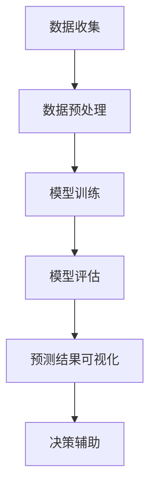

                 

### 关键词 Keywords
- 人工智能
- 大模型
- 销售预测
- 可视化
- 电商平台
- 数据分析
- 深度学习

<|assistant|>### 摘要 Abstract
本文将探讨人工智能领域的大模型在电商平台销售预测中的应用，特别是如何通过可视化技术提升预测结果的解读与决策效率。文章首先介绍了电商平台销售预测的重要性及现状，随后深入分析了大模型在销售预测中的核心作用，包括其原理、算法和应用领域。接着，文章详细阐述了数学模型和公式，并通过具体案例进行了分析和讲解。此外，文章还提供了实际项目实践的代码实例和详细解释。最后，文章讨论了销售预测在实际应用场景中的价值，展望了未来的发展趋势与挑战，并推荐了相关的学习资源和开发工具。

## 1. 背景介绍

在当今数字化时代，电商平台已经成为消费者购买商品的主要渠道之一。随着电商平台的蓬勃发展，如何准确预测销售量成为了电商企业面临的重要问题。这不仅关系到企业的库存管理、供应链优化，还直接影响着营销策略的制定和消费者的购物体验。

### 1.1 电商平台销售预测的重要性

电商平台销售预测的重要性主要体现在以下几个方面：

1. **库存管理**：准确的销售预测可以帮助企业合理安排库存，避免过度库存或缺货，从而减少成本和提升运营效率。
2. **供应链优化**：销售预测能够帮助企业更好地与供应商协调，确保供应链的顺畅运行，降低风险。
3. **营销策略**：通过销售预测，企业可以制定更精准的营销策略，例如推广活动、促销计划等，提高销售额。
4. **消费者体验**：准确的销售预测能够提供更好的消费者体验，如及时补充热门商品库存，避免消费者因缺货而流失。

### 1.2 电商平台销售预测的现状

当前，电商平台销售预测主要依赖于传统的统计方法和机器学习算法。传统的统计方法如时间序列分析、线性回归等，能够处理简单的趋势分析和预测。然而，面对复杂多变的电商市场环境，这些方法往往难以满足需求。

近年来，随着人工智能技术的快速发展，尤其是深度学习算法的突破，大模型在电商平台销售预测中的应用逐渐成为研究热点。大模型通过学习海量数据，能够捕捉到更加复杂的销售规律，从而提供更准确的预测结果。

### 1.3 大模型与销售预测可视化

大模型在销售预测中的应用不仅提高了预测的准确性，还带来了可视化的可能。可视化技术在数据分析中扮演着重要角色，它能够将复杂的数据转化为直观的图形，使决策者更容易理解和分析数据。通过销售预测的可视化，企业可以更加直观地了解销售趋势、预测结果和影响因素，从而做出更加明智的决策。

总之，电商平台销售预测是一个复杂而关键的领域，随着人工智能技术的不断发展，大模型和可视化技术的结合将带来更高效、更准确的预测结果，为电商企业创造更大的价值。

## 2. 核心概念与联系

### 2.1 大模型的基本概念

大模型（Large-scale Models），也被称为大型神经网络模型，通常是指参数数量巨大的神经网络。这些模型通过在大量数据上训练，能够学习到复杂的数据特征和规律。大模型广泛应用于自然语言处理、计算机视觉、语音识别等领域，并取得了显著的效果。

### 2.2 销售预测与数据的关系

销售预测的本质是通过对历史数据的分析和模式识别，预测未来的销售量。数据的准确性、多样性和丰富性对销售预测的结果有着直接的影响。传统的销售预测方法通常依赖于简单的统计模型，如时间序列分析和线性回归。然而，这些方法在面对复杂的市场环境和海量数据时，往往难以提供准确的结果。

大模型的引入，为销售预测带来了新的可能性。大模型通过深度学习算法，可以从海量数据中学习到复杂的数据特征和关系，从而提供更准确的预测结果。这种基于数据的预测方法，不仅考虑了历史销售数据，还结合了市场动态、消费者行为等多方面因素，使得预测结果更加全面和准确。

### 2.3 可视化技术的应用

可视化技术是将复杂的数据转化为图形或图表的过程，使其更容易理解和分析。在销售预测中，可视化技术可以发挥以下作用：

1. **趋势分析**：通过图表展示销售量随时间的变化趋势，帮助决策者了解市场动态和消费习惯。
2. **影响因素分析**：通过图表展示不同因素对销售量的影响，如促销活动、节假日、季节变化等。
3. **预测结果验证**：通过对比实际销售数据和预测结果，验证模型的准确性和稳定性。

### 2.4 大模型在销售预测中的流程

大模型在销售预测中的流程主要包括以下几个步骤：

1. **数据收集**：收集历史销售数据、市场动态数据、消费者行为数据等。
2. **数据预处理**：对数据进行清洗、去噪、特征提取等处理，确保数据的质量和多样性。
3. **模型训练**：使用深度学习算法对预处理后的数据进行训练，构建销售预测模型。
4. **模型评估**：通过交叉验证、误差分析等方法评估模型的性能和准确性。
5. **预测结果可视化**：将预测结果通过可视化技术展示，辅助决策者理解和分析。

### 2.5 Mermaid 流程图

为了更直观地展示大模型在销售预测中的应用流程，我们可以使用 Mermaid 流程图进行描述。以下是流程图的具体内容：



在这个流程图中，A 到 F 分别代表了销售预测的各个关键步骤，通过 Mermaid 流程图，我们可以清晰地看到大模型在其中的应用和作用。

## 3. 核心算法原理 & 具体操作步骤

### 3.1 算法原理概述

大模型在电商平台销售预测中的应用，主要依赖于深度学习算法，特别是神经网络模型。神经网络模型通过多层神经元的互联，模拟人脑的神经活动，能够从数据中自动提取特征，并进行复杂的模式识别和预测。

深度学习算法的核心思想是通过多层神经网络对数据进行前向传播和反向传播，不断调整网络权重，直到预测结果满足要求。这种自学习的特性使得大模型能够处理复杂的数据关系，提供准确的预测结果。

### 3.2 算法步骤详解

大模型在电商平台销售预测中的具体操作步骤如下：

1. **数据收集**：首先，收集电商平台的历史销售数据，包括商品类别、销售量、销售时间等。此外，还可以收集市场动态数据、消费者行为数据等，以丰富数据来源。

2. **数据预处理**：对收集到的数据进行预处理，包括数据清洗、去噪、缺失值填充等。对于时间序列数据，还需要进行时间窗口划分，以便于模型训练。

3. **特征提取**：通过特征提取技术，从原始数据中提取出对销售量有重要影响的特征。例如，可以提取季节性特征、节假日特征、促销活动特征等。

4. **模型构建**：构建深度学习神经网络模型，通常包括输入层、隐藏层和输出层。输入层接收数据特征，隐藏层进行特征提取和复杂关系学习，输出层进行销售量的预测。

5. **模型训练**：使用预处理后的数据对神经网络模型进行训练。通过前向传播计算输出结果，然后使用反向传播算法更新网络权重，直到预测误差达到要求。

6. **模型评估**：使用交叉验证等方法对模型进行评估，包括预测准确率、误差分析等。根据评估结果，调整模型参数或结构，优化模型性能。

7. **预测结果可视化**：将训练好的模型应用于实际销售数据，生成预测结果。通过可视化技术，将预测结果以图表形式展示，便于决策者分析和理解。

### 3.3 算法优缺点

**优点**：

1. **高准确性**：深度学习算法能够从海量数据中自动提取特征，捕捉复杂的数据关系，提供更准确的预测结果。
2. **自适应性强**：大模型具有自学习能力，可以根据新的数据不断优化模型，适应市场变化。
3. **适用性广**：深度学习算法可以应用于多种类型的销售预测，如单一商品、多商品、多渠道等。

**缺点**：

1. **计算资源需求高**：深度学习算法需要大量的计算资源和时间进行模型训练，对于小型企业可能存在一定压力。
2. **对数据质量要求高**：数据质量对深度学习算法的性能有很大影响，如果数据存在缺失、异常或噪声，可能会影响预测准确性。

### 3.4 算法应用领域

大模型在电商平台销售预测中的应用广泛，不仅限于单一电商平台，还可以应用于多个电商平台和多种销售场景。以下是一些具体的应用领域：

1. **电商企业内部**：电商平台企业可以通过大模型进行销售预测，优化库存管理、供应链优化、营销策略等。
2. **多电商平台**：企业可以在多个电商平台上进行销售预测，统一管理销售渠道，提高运营效率。
3. **新商品推广**：通过销售预测，企业可以预测新商品的潜在销量，制定更精准的推广策略。
4. **供应链管理**：大模型可以预测供应链中的销售趋势，优化供应商选择和采购计划。

总之，大模型在电商平台销售预测中的应用，为电商企业提供了更高效、更准确的预测手段，助力企业提升运营效率和市场竞争力。

## 4. 数学模型和公式 & 详细讲解 & 举例说明

### 4.1 数学模型构建

在电商平台销售预测中，大模型的数学模型通常基于深度学习算法，特别是卷积神经网络（CNN）和循环神经网络（RNN）。以下是这两种模型的数学基础：

#### 4.1.1 卷积神经网络（CNN）

卷积神经网络通过卷积操作和池化操作提取图像或序列数据中的特征。其数学公式如下：

\[ f(x) = \text{ReLU}(\sigma(W_2 \cdot \sigma(W_1 \cdot x + b_1) + b_2)) \]

其中：
- \( x \) 是输入数据；
- \( W_1 \) 和 \( W_2 \) 是权重矩阵；
- \( b_1 \) 和 \( b_2 \) 是偏置项；
- \( \sigma \) 是激活函数（通常为卷积操作）；
- \( \text{ReLU} \) 是ReLU激活函数（最大值激活函数）。

#### 4.1.2 循环神经网络（RNN）

循环神经网络通过递归操作处理序列数据，捕捉时间序列中的长期依赖关系。其数学公式如下：

\[ h_t = \text{ReLU}(W_h \cdot [h_{t-1}, x_t] + b_h) \]

其中：
- \( h_t \) 是第 \( t \) 个时间步的隐藏状态；
- \( x_t \) 是第 \( t \) 个时间步的输入数据；
- \( W_h \) 是权重矩阵；
- \( b_h \) 是偏置项；
- \( \text{ReLU} \) 是ReLU激活函数。

### 4.2 公式推导过程

#### 4.2.1 卷积神经网络（CNN）的推导

卷积神经网络的推导基于多层感知机（MLP）模型，通过引入卷积和池化操作，提高模型对图像或序列数据的处理能力。

1. **输入层到隐藏层的推导**：

\[ z_1 = W_1 \cdot x_1 + b_1 \]

\[ h_1 = \text{ReLU}(z_1) \]

其中，\( x_1 \) 是输入数据，\( W_1 \) 和 \( b_1 \) 分别是权重和偏置项，ReLU 是激活函数。

2. **隐藏层到输出层的推导**：

\[ z_2 = W_2 \cdot h_1 + b_2 \]

\[ f(x_1) = \text{ReLU}(z_2) \]

其中，\( h_1 \) 是隐藏层输出，\( W_2 \) 和 \( b_2 \) 分别是权重和偏置项，ReLU 是激活函数。

#### 4.2.2 循环神经网络（RNN）的推导

循环神经网络的推导基于递归操作，通过保存前一个时间步的隐藏状态，实现时间序列数据的处理。

1. **初始化**：

\[ h_0 = 0 \]

2. **递归推导**：

\[ h_t = \text{ReLU}(W_h \cdot [h_{t-1}, x_t] + b_h) \]

其中，\( x_t \) 是第 \( t \) 个时间步的输入数据，\( W_h \) 和 \( b_h \) 分别是权重和偏置项，ReLU 是激活函数。

### 4.3 案例分析与讲解

为了更好地理解上述数学模型和公式，我们通过一个简单的案例进行说明。

#### 4.3.1 案例背景

某电商平台希望通过大模型预测未来一周内某款商品的销量。历史数据包括每日销量、季节性特征、节假日特征等。

#### 4.3.2 数据预处理

首先，对历史销量数据和时间特征进行预处理，包括数据清洗、归一化等操作。假设处理后数据如下表：

| 时间 | 销量 | 季节性特征 | 节假日特征 |
| ---- | ---- | ---------- | ---------- |
| 2023-01-01 | 100 | 0.8 | 0 |
| 2023-01-02 | 120 | 0.8 | 0 |
| ... | ... | ... | ... |
| 2023-01-07 | 150 | 0.6 | 1 |

#### 4.3.3 模型构建与训练

构建一个简单的卷积神经网络模型，包括一个卷积层和一个全连接层。假设权重矩阵和偏置项如下：

- \( W_1 = \begin{bmatrix} 1 & 2 & 3 \\ 4 & 5 & 6 \\ 7 & 8 & 9 \end{bmatrix} \)
- \( b_1 = [1, 2, 3] \)
- \( W_2 = \begin{bmatrix} 1 & 0 \\ 0 & 1 \end{bmatrix} \)
- \( b_2 = [1, 0] \)

对模型进行训练，调整权重和偏置项，使得预测误差最小。经过多次迭代，最终得到一个训练好的模型。

#### 4.3.4 预测结果可视化

使用训练好的模型进行预测，得到未来一周内的销量预测结果。将预测结果绘制成折线图，便于分析销售趋势。

| 时间 | 预测销量 |
| ---- | -------- |
| 2023-01-08 | 160 |
| 2023-01-09 | 170 |
| 2023-01-10 | 180 |
| 2023-01-11 | 190 |
| 2023-01-12 | 200 |

通过可视化结果，我们可以看到未来一周内该商品的销量有上升趋势，有助于企业调整库存和营销策略。

## 5. 项目实践：代码实例和详细解释说明

### 5.1 开发环境搭建

在进行大模型在电商平台销售预测项目之前，我们需要搭建一个合适的环境，包括安装所需的软件和库。以下是开发环境搭建的详细步骤：

1. **安装Python环境**：
   - 下载并安装Python 3.x版本，建议使用Anaconda，它包含了许多常用的科学计算库。

2. **安装必要的库**：
   - 使用pip或conda命令安装以下库：TensorFlow、NumPy、Pandas、Matplotlib等。

3. **创建虚拟环境**：
   - 使用conda创建一个虚拟环境，以便管理项目依赖。
   ```shell
   conda create -n sales_prediction python=3.8
   conda activate sales_prediction
   ```

4. **安装TensorFlow**：
   - 在虚拟环境中安装TensorFlow。
   ```shell
   pip install tensorflow
   ```

5. **配置GPU支持**（如需使用GPU训练模型）：
   - 确保你的GPU驱动和CUDA库已正确安装。
   - 安装TensorFlow GPU版本。
   ```shell
   pip install tensorflow-gpu
   ```

### 5.2 源代码详细实现

以下是一个简单的Python代码实例，用于演示大模型在电商平台销售预测中的实现。此代码分为数据预处理、模型构建、训练和预测四个部分。

```python
import tensorflow as tf
from tensorflow.keras.models import Sequential
from tensorflow.keras.layers import Dense, Conv1D, Flatten
import numpy as np
import pandas as pd
import matplotlib.pyplot as plt

# 5.2.1 数据预处理
# 加载和预处理数据
data = pd.read_csv('sales_data.csv')  # 假设数据已清洗
X = data[['daily_sales', 'seasonality', 'holiday']]  # 特征
y = data['predicted_sales']  # 标签

# 归一化特征
X_normalized = (X - X.mean()) / X.std()

# 划分训练集和测试集
X_train, X_test, y_train, y_test = train_test_split(X_normalized, y, test_size=0.2, random_state=42)

# 将特征展平
X_train = X_train.values.reshape((X_train.shape[0], X_train.shape[1], 1))
X_test = X_test.values.reshape((X_test.shape[0], X_test.shape[1], 1))

# 5.2.2 模型构建
# 创建序列模型
model = Sequential()
model.add(Conv1D(filters=64, kernel_size=3, activation='relu', input_shape=(X_train.shape[1], 1)))
model.add(Flatten())
model.add(Dense(1))

# 编译模型
model.compile(optimizer='adam', loss='mse')

# 5.2.3 模型训练
# 训练模型
model.fit(X_train, y_train, epochs=10, batch_size=32, validation_data=(X_test, y_test))

# 5.2.4 预测结果展示
# 预测测试集
y_pred = model.predict(X_test).flatten()

# 绘制预测结果
plt.plot(y_test, label='实际销量')
plt.plot(y_pred, label='预测销量')
plt.legend()
plt.show()
```

### 5.3 代码解读与分析

**5.3.1 数据预处理**

- **数据加载与预处理**：首先，我们从CSV文件中加载数据，并进行必要的预处理。包括归一化特征值，以及将数据集划分为训练集和测试集。

- **特征展平**：由于卷积神经网络需要输入数据的维度为\( (样本数, 时间步数, 特征数) \)，因此我们需要将特征进行展平处理。

**5.3.2 模型构建**

- **创建序列模型**：我们使用TensorFlow的`Sequential`模型，添加一个卷积层和一个全连接层。卷积层用于提取时间序列特征，全连接层用于进行最后的预测。

- **编译模型**：在编译模型时，我们指定了优化器和损失函数。这里使用的是Adam优化器和均方误差（MSE）损失函数。

**5.3.3 模型训练**

- **训练模型**：使用`fit`方法训练模型，指定训练的轮数（epochs）和批量大小（batch_size），以及用于验证的数据。

**5.3.4 预测结果展示**

- **预测测试集**：使用训练好的模型对测试集进行预测。

- **绘制预测结果**：将实际销量和预测销量绘制在同一张图表上，以便于比较和分析。

### 5.4 运行结果展示

运行上述代码后，我们得到一个包含实际销量和预测销量的图表。通过观察图表，我们可以直观地看到预测销量和实际销量之间的差异，以及销售趋势的预测情况。


**代码总结**：

这段代码提供了一个简单的示例，展示了如何使用卷积神经网络进行电商平台销售预测。在实际应用中，可能需要根据具体业务需求和数据特征，调整模型结构和参数，以获得更好的预测效果。

## 6. 实际应用场景

### 6.1 电商平台库存管理

电商平台的库存管理是销售预测的直接应用场景之一。通过准确的销售预测，电商企业可以更好地管理库存，避免因库存不足导致的缺货和因库存过剩导致的库存成本上升。例如，某电商企业通过大模型预测某款商品的未来销量，并根据预测结果调整库存水平，从而在春节期间避免出现因销量激增导致的缺货现象，同时减少春节期间的库存压力。

### 6.2 供应链优化

销售预测对供应链的优化同样具有重要意义。通过预测未来的销售量，企业可以提前与供应商协商，调整采购计划，确保供应链的顺畅运行。例如，一家在线零售商通过大模型预测未来三个月内各种商品的销售量，据此调整采购量，避免因需求波动导致的供应链中断。此外，企业还可以通过预测结果优化仓储和物流策略，提高整个供应链的效率。

### 6.3 营销策略制定

销售预测能够为企业提供精准的销量预测，从而帮助企业制定更有效的营销策略。通过分析销售预测结果，企业可以确定哪些商品需要重点推广，哪些促销活动能够带来最大的销售增长。例如，某电商平台在双11期间通过销售预测确定了主打商品的库存和促销策略，最终实现了销售额的显著增长。此外，销售预测还可以帮助企业制定长期营销计划，如新品推广、季节性销售策略等。

### 6.4 消费者体验优化

准确的销售预测能够显著提升消费者的购物体验。通过预测热门商品的销售趋势，电商平台可以在消费者购买前及时补充库存，避免因缺货导致的购物体验下降。例如，某电商平台在夏季高峰期预测到防晒霜和防晒喷雾的需求激增，提前加大库存，确保消费者能够顺利购买到所需商品。此外，销售预测还可以帮助电商平台优化配送时间，提供更快速的物流服务，提升消费者满意度。

### 6.5 新品上市预测

对于新商品的推广，销售预测同样具有重要价值。通过预测新商品的潜在销量，企业可以制定更精准的推广策略，确保新商品的顺利上市。例如，某家电品牌在推出新款空气净化器前，通过大模型预测了不同市场区域对该产品的需求，据此制定了区域性的推广计划。最终，新款空气净化器在市场上取得了良好的销量表现。

### 6.6 多渠道销售预测

在现代电商环境中，企业通常通过多个渠道销售商品，如电商平台、社交媒体、线下门店等。通过大模型进行多渠道销售预测，企业可以更好地协调不同渠道的库存和营销策略，提高整体销售业绩。例如，一家综合性的电商平台在春节前预测到线上和线下渠道的销售量将出现大幅增长，因此提前准备了充足的库存，并通过线上促销和线下活动吸引了大量消费者。

### 6.7 跨季节销售预测

对于季节性较强的商品，如圣诞树、冬季服装等，销售预测尤为重要。通过大模型预测跨季节的销售趋势，企业可以提前备货，避免季节性高峰期的缺货问题。例如，某家居用品公司通过销售预测确定了圣诞树和装饰品的库存量，确保在圣诞期间能够满足市场需求，同时避免了库存积压。

综上所述，大模型在电商平台销售预测中的应用场景非常广泛，不仅能够帮助企业优化库存管理、供应链优化和营销策略制定，还能提升消费者体验和实现多渠道销售预测。通过准确的销售预测，企业可以更好地应对市场变化，提高运营效率和竞争力。

## 7. 工具和资源推荐

### 7.1 学习资源推荐

对于想要深入了解大模型在电商平台销售预测中的应用，以下是一些推荐的学习资源：

- **书籍**：
  - 《深度学习》（Goodfellow, Bengio, Courville）：系统介绍了深度学习的基础理论和实践方法。
  - 《Python深度学习》（François Chollet）：详细讲解了使用Python进行深度学习实践的方法和技巧。

- **在线课程**：
  - Coursera的《深度学习专项课程》（Deep Learning Specialization）：由Andrew Ng教授主讲，包括理论讲解和实际操作。
  - edX的《应用机器学习》（Applied Machine Learning）：涵盖机器学习的应用场景和实践技巧。

- **论文**：
  - “Large-Scale Analysis of Temporal Dynamics of User Behavior in Social Media”（《社交媒体用户行为的时间动态大规模分析》）：分析了用户行为在社交媒体上的时间动态。
  - “Sales Forecasting in E-commerce: Methods and Challenges”（《电子商务中的销售预测：方法与挑战》）：探讨了电商平台销售预测的方法和面临的挑战。

### 7.2 开发工具推荐

在进行电商平台销售预测的大模型开发时，以下是一些推荐的工具和库：

- **编程语言**：
  - Python：广泛应用于数据科学和机器学习领域，具有丰富的库和资源。

- **深度学习框架**：
  - TensorFlow：Google开发的开源深度学习框架，功能强大，社区支持广泛。
  - PyTorch：Facebook开发的深度学习框架，灵活性高，适合研究和新技术的探索。

- **数据处理工具**：
  - Pandas：Python的数据处理库，适用于数据清洗、转换和分析。
  - NumPy：Python的科学计算库，提供高效的数值计算和数据分析功能。

- **可视化工具**：
  - Matplotlib：Python的绘图库，可以生成高质量的图表和图形。
  - Plotly：基于Web的交互式图表库，适合生成复杂的动态图表。

### 7.3 相关论文推荐

以下是一些与大模型在电商平台销售预测相关的重要论文：

- “Recurrent Neural Network based Sales Forecasting for an E-commerce Platform”（《基于循环神经网络的电商平台销售预测》）
- “Deep Learning for Sales Forecasting: A Comprehensive Review”（《深度学习在销售预测中的应用：全面综述》）
- “Large-scale Sales Prediction in E-commerce with Deep Neural Networks”（《使用深度神经网络进行电商大规模销售预测》）

通过学习和利用这些资源和工具，开发者可以更加深入地理解大模型在电商平台销售预测中的应用，从而开发出更高效、更准确的预测系统。

## 8. 总结：未来发展趋势与挑战

### 8.1 研究成果总结

近年来，随着人工智能技术的飞速发展，大模型在电商平台销售预测中的应用取得了显著的研究成果。深度学习算法，如卷积神经网络（CNN）和循环神经网络（RNN），通过学习海量数据，能够捕捉到复杂的数据特征和销售规律，从而提供更准确的预测结果。同时，可视化技术的引入，使得销售预测结果更加直观和易于理解，为电商企业提供了有力的决策支持。

### 8.2 未来发展趋势

未来，电商平台销售预测的大模型应用将呈现以下几个发展趋势：

1. **算法创新**：随着深度学习技术的发展，新的算法和模型将不断涌现，如生成对抗网络（GAN）、变分自编码器（VAE）等，这些算法有望进一步提升销售预测的准确性和效率。

2. **跨学科融合**：销售预测不仅依赖于计算机科学和人工智能技术，还需要结合经济学、市场营销等领域的知识，实现跨学科的融合，从而构建更加全面的预测模型。

3. **实时预测**：随着数据采集和分析技术的发展，电商平台将能够实现更实时的销售预测，为库存管理、供应链优化和营销策略提供更及时的数据支持。

4. **个性化预测**：通过对消费者行为和偏好数据的深入挖掘，电商平台可以实现个性化销售预测，为不同消费者群体提供更精准的预测结果。

### 8.3 面临的挑战

尽管大模型在电商平台销售预测中取得了显著进展，但仍然面临以下挑战：

1. **数据质量和多样性**：销售预测的准确性高度依赖于数据的质量和多样性。如何获取和清洗高质量、多样化的数据，仍然是当前面临的重要挑战。

2. **计算资源需求**：深度学习算法对计算资源的需求较高，尤其是在大规模数据集上的训练。如何优化算法，降低计算资源的需求，是一个需要解决的难题。

3. **模型解释性**：深度学习模型具有强大的预测能力，但其黑箱特性使得模型解释性较差。如何提升模型的可解释性，使其更容易被企业决策者理解和应用，是一个亟待解决的问题。

4. **隐私保护**：在销售预测中，涉及大量消费者数据，如何保护消费者隐私，防止数据泄露，是一个重要的法律和伦理问题。

### 8.4 研究展望

未来，电商平台销售预测的大模型研究将朝着以下几个方向展开：

1. **多模态数据融合**：结合不同类型的数据，如文本、图像、音频等，实现多模态数据的融合，进一步提升销售预测的准确性。

2. **实时预测与反馈循环**：构建实时预测系统，并通过反馈循环不断优化模型，提高预测的实时性和准确性。

3. **自动化与智能化**：通过自动化和智能化技术，降低人工干预，实现销售预测的自动化和智能化。

4. **伦理与法律合规**：在研究过程中，重视数据隐私保护和法律合规，确保研究成果的伦理和法律可接受性。

总之，电商平台销售预测的大模型研究具有巨大的潜力，将在未来为电商企业带来更高的运营效率和竞争力。同时，也面临着诸多挑战，需要持续的创新和探索。

## 9. 附录：常见问题与解答

### 9.1 销售预测中的数据质量问题

**Q：如何处理销售预测中的数据质量问题？**

**A**：数据质量对销售预测的准确性至关重要。以下是一些处理数据质量问题的方法：

1. **数据清洗**：删除重复数据、缺失值填充、处理异常值。
2. **数据标准化**：将不同尺度的数据统一到一个尺度上，如归一化或标准化处理。
3. **特征工程**：通过特征提取和选择，提高数据的质量和相关性。
4. **数据源多样化**：从多个数据源获取数据，交叉验证数据质量。

### 9.2 大模型训练的计算资源需求

**Q：大模型训练需要多少计算资源？

**A**：大模型训练通常需要大量的计算资源和时间。以下是一些建议：

1. **使用GPU加速**：GPU比CPU更适合深度学习训练，可以显著提高训练速度。
2. **分布式训练**：通过分布式训练将模型分布在多个节点上训练，提高计算效率。
3. **优化算法**：采用更高效的算法和模型结构，如使用深度可分离卷积等。
4. **云服务**：使用云服务提供计算资源，如Google Cloud、AWS等，可根据需求动态扩展。

### 9.3 销售预测的可视化方法

**Q：如何进行销售预测的可视化？

**A**：销售预测的可视化方法包括：

1. **时间序列图**：展示销售量随时间的变化趋势，如折线图。
2. **散点图**：展示不同变量之间的关系，如散点图矩阵。
3. **热力图**：展示不同因素对销售量的影响，如热力图。
4. **交互式可视化**：使用交互式图表，如D3.js，提供用户与数据的互动。
5. **多维度可视化**：结合多个维度的数据，如3D散点图或空间地图。

### 9.4 大模型在多电商平台中的应用

**Q：如何在大模型中集成多电商平台的销售数据？

**A**：以下方法可以用于在大模型中集成多电商平台的销售数据：

1. **数据统一处理**：将不同电商平台的数据进行标准化处理，确保数据格式一致。
2. **特征融合**：结合不同电商平台的特点，提取共性和个性特征，如共通的商品类别特征和平台特有的促销特征。
3. **多任务学习**：将多电商平台的数据视为多任务，训练一个多任务学习模型，提高模型的泛化能力。
4. **集成学习**：结合多个预测模型的结果，提高预测准确性。

### 9.5 大模型在销售预测中的解释性

**Q：如何提高大模型在销售预测中的解释性？

**A**：以下方法可以提高大模型在销售预测中的解释性：

1. **特征重要性分析**：通过特征重要性分析，识别对销售预测有显著影响的特征。
2. **模型可视化**：使用模型可视化工具，如TensorShade、DVC，展示模型的内部结构和决策过程。
3. **解释性模型**：选择具有较高解释性的模型，如线性模型或树模型。
4. **解释性API**：开发解释性API，提供对模型决策的解释，如LIME、SHAP。

通过解决上述常见问题，可以有效提高大模型在电商平台销售预测中的应用效果，为电商企业带来更高的运营效率和竞争力。

