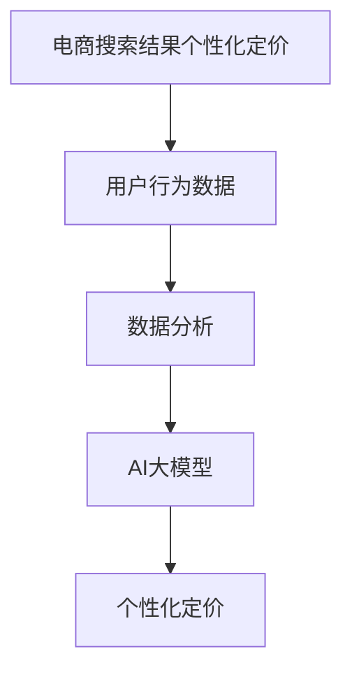

                 

随着人工智能技术的飞速发展，电商行业正在经历一场革命。其中，个性化定价已成为提升用户体验、增加转化率的关键手段之一。本文将深入探讨如何利用AI大模型来优化电商搜索结果的个性化定价，以期在激烈的市场竞争中脱颖而出。

> **关键词**：AI大模型，电商搜索，个性化定价，算法，数学模型

> **摘要**：本文首先介绍了电商搜索结果个性化定价的背景和重要性，然后详细阐述了AI大模型在其中的应用，包括核心算法原理、数学模型构建、具体实施步骤等。通过实际项目实践，展示了如何将AI大模型应用于电商搜索结果个性化定价，并对未来应用前景进行了展望。

<|assistant|>### 1. 背景介绍

电商行业正日益成熟，消费者对个性化体验的需求越来越高。个性化定价作为电商运营的重要策略，旨在通过分析用户行为数据，为不同的消费者提供不同的商品价格，从而提高购买转化率和客户满意度。传统的定价策略往往基于简单的规则或市场分析，难以充分满足个性化需求。

AI大模型的出现为电商搜索结果个性化定价带来了新的契机。AI大模型通过深度学习、自然语言处理和大数据分析等技术，能够从海量的用户数据中挖掘出有价值的信息，从而实现精准的个性化定价策略。这种定价方式不仅能够提高用户满意度，还能够帮助企业实现更高的利润率。

<|assistant|>### 2. 核心概念与联系

在深入探讨AI大模型在电商搜索结果个性化定价中的应用之前，我们需要明确几个核心概念，并了解它们之间的联系。

#### 2.1 电商搜索结果个性化定价

电商搜索结果个性化定价是指根据用户的历史行为、浏览记录、购买偏好等数据，为用户推荐与其兴趣和需求相符的商品，并为其设定个性化的价格。

#### 2.2 AI大模型

AI大模型是指通过大规模数据训练，能够自动学习并预测复杂模式的人工智能系统。常见的AI大模型包括深度神经网络、生成对抗网络（GAN）等。

#### 2.3 数据分析

数据分析是指通过统计和机器学习等方法，从大量数据中提取有价值的信息和知识。

#### 2.4 个性化定价

个性化定价是指根据用户行为和偏好，为不同的用户设定不同的价格。

下面是一个Mermaid流程图，展示了这些概念之间的联系：



<|assistant|>### 3. 核心算法原理 & 具体操作步骤

#### 3.1 算法原理概述

AI大模型在电商搜索结果个性化定价中的应用主要基于以下几个步骤：

1. **数据收集**：收集用户的历史购买数据、浏览记录、搜索关键词等。
2. **数据预处理**：清洗数据，进行特征提取，将原始数据转换为可用于训练的特征向量。
3. **模型训练**：使用收集到的数据进行模型训练，构建一个能够预测用户购买行为的AI大模型。
4. **模型评估**：通过交叉验证等手段，评估模型的预测准确性和泛化能力。
5. **个性化定价**：根据模型的预测结果，为用户设定个性化的价格。

#### 3.2 算法步骤详解

下面是具体的算法步骤：

1. **数据收集**：

   数据收集是整个流程的基础。我们需要收集以下数据：

   - 用户历史购买数据：包括购买的商品种类、购买频率、购买金额等。
   - 用户浏览记录：包括用户在电商平台上的浏览路径、搜索关键词等。
   - 用户行为数据：包括用户在网站上的点击、停留、滚动等行为。

2. **数据预处理**：

   数据预处理包括以下几个步骤：

   - 数据清洗：去除无效数据、缺失数据等。
   - 特征提取：将原始数据转换为特征向量。例如，可以使用TF-IDF模型提取文本数据的关键词。
   - 数据标准化：将不同特征的数据缩放到相同的范围，以便于模型训练。

3. **模型训练**：

   模型训练是构建AI大模型的关键步骤。我们可以使用以下模型：

   - 深度神经网络（DNN）：适用于处理非线性关系的数据。
   - 生成对抗网络（GAN）：适用于生成新的数据样本。
   - 支持向量机（SVM）：适用于分类问题。

4. **模型评估**：

   模型评估的目的是验证模型的有效性和泛化能力。我们可以使用以下方法：

   - 交叉验证：通过将数据集划分为训练集和验证集，多次训练和验证，评估模型的性能。
   - 学习曲线：通过观察模型在训练集和验证集上的性能，分析模型的过拟合和欠拟合情况。
   - 精度、召回率、F1值等指标：用于评估模型的分类性能。

5. **个性化定价**：

   根据模型预测的用户购买概率，我们可以为用户设定个性化的价格。具体方法如下：

   - 设定基准价格：根据商品的成本和市场价格，设定一个基准价格。
   - 调整价格：根据模型预测的用户购买概率，对基准价格进行调整。例如，如果用户购买概率高，可以适当降低价格；如果用户购买概率低，可以适当提高价格。

#### 3.3 算法优缺点

- **优点**：

  - 精准度高：通过深度学习和大数据分析，AI大模型能够准确预测用户的购买行为，从而实现精准的个性化定价。
  - 适应性强：AI大模型能够根据用户行为数据不断学习和调整，适应不同用户的需求和偏好。

- **缺点**：

  - 计算量大：训练和评估AI大模型需要大量的计算资源和时间。
  - 数据依赖性高：AI大模型的性能依赖于数据的质量和数量，如果数据质量差或数量不足，可能会影响模型的准确性。

#### 3.4 算法应用领域

AI大模型在电商搜索结果个性化定价中的应用范围非常广泛，包括：

- 商品推荐：根据用户的浏览记录和购买行为，推荐用户可能感兴趣的商品。
- 价格调整：根据用户的购买概率，为用户提供个性化的价格。
- 客户关系管理：通过分析用户的购买行为和偏好，提供个性化的服务和优惠。

<|assistant|>### 4. 数学模型和公式 & 详细讲解 & 举例说明

在AI大模型应用于电商搜索结果个性化定价的过程中，数学模型起到了至关重要的作用。以下将详细讲解数学模型构建、公式推导过程以及通过具体案例进行分析和讲解。

#### 4.1 数学模型构建

在构建数学模型时，我们首先需要定义一些关键变量：

- \( P \)：商品价格
- \( B \)：用户行为数据
- \( R \)：用户购买行为

基于这些变量，我们可以构建以下数学模型：

\[ R = f(P, B) \]

其中，\( f \) 表示一个复杂的函数，用于预测用户的购买行为。为了简化模型，我们可以将其分解为以下几个部分：

\[ f(P, B) = g(P) \cdot h(B) \]

这里，\( g(P) \) 表示价格对购买行为的影响，\( h(B) \) 表示用户行为对购买行为的影响。

#### 4.2 公式推导过程

下面，我们将详细推导这些公式。

首先，考虑价格对购买行为的影响。根据经济学理论，价格和购买行为之间存在反比关系，即价格越高，购买概率越低。我们可以使用以下公式来表示这种关系：

\[ g(P) = \frac{1}{P} \]

接下来，考虑用户行为对购买行为的影响。用户行为包括浏览记录、搜索关键词、购买历史等。我们可以使用以下公式来表示这种影响：

\[ h(B) = \sum_{i=1}^{n} w_i \cdot b_i \]

其中，\( w_i \) 表示第 \( i \) 个行为的权重，\( b_i \) 表示第 \( i \) 个行为的值。

综合以上两部分，我们得到以下数学模型：

\[ R = \frac{1}{P} \cdot \sum_{i=1}^{n} w_i \cdot b_i \]

#### 4.3 案例分析与讲解

为了更好地理解上述数学模型，我们来看一个具体的案例。

假设我们有一个电商平台，用户A在过去的30天内浏览了商品A、商品B和商品C，分别花费了10分钟、5分钟和2分钟。同时，用户A在搜索栏中输入了关键词“手机”、“相机”和“电脑”。根据这些数据，我们可以计算出用户A的行为值：

\[ b_1 = 10, b_2 = 5, b_3 = 2 \]

假设我们为每个行为分配以下权重：

\[ w_1 = 0.5, w_2 = 0.3, w_3 = 0.2 \]

根据上述数学模型，我们可以计算出用户A的购买概率：

\[ R = \frac{1}{P} \cdot (0.5 \cdot 10 + 0.3 \cdot 5 + 0.2 \cdot 2) \]

\[ R = \frac{1}{P} \cdot (5 + 1.5 + 0.4) \]

\[ R = \frac{1}{P} \cdot 6.9 \]

如果我们将商品价格设为100元，则用户A的购买概率为：

\[ R = \frac{1}{100} \cdot 6.9 = 0.069 \]

这意味着，用户A购买该商品的概率为6.9%。

通过调整商品价格，我们可以改变用户A的购买概率。例如，如果我们将商品价格降低到90元，则用户A的购买概率将提高：

\[ R = \frac{1}{90} \cdot 6.9 = 0.076 \]

\[ R = 7.6\% \]

通过这种方式，我们可以根据用户的个性化行为数据，为其设定个性化的价格，从而提高购买转化率。

#### 4.4 结论

通过数学模型的构建和推导，我们可以清楚地看到，AI大模型在电商搜索结果个性化定价中的应用具有强大的潜力。通过合理设定商品价格，我们可以为不同用户群体提供个性化的购物体验，从而提高用户的满意度和购买转化率。

然而，需要注意的是，数学模型仅是AI大模型的一部分。在实际应用中，我们还需要考虑数据的质量和多样性、模型的训练和优化等因素。只有综合考虑这些因素，才能实现高效的电商搜索结果个性化定价。

<|assistant|>### 5. 项目实践：代码实例和详细解释说明

为了更好地展示AI大模型在电商搜索结果个性化定价中的应用，下面我们将提供一个具体的代码实例，并对其进行详细的解释和说明。

#### 5.1 开发环境搭建

在进行项目实践之前，我们需要搭建一个合适的开发环境。以下是一个基本的开发环境搭建步骤：

1. **安装Python环境**：Python是AI大模型应用中常用的编程语言。您可以从Python官方网站（https://www.python.org/）下载并安装Python。
2. **安装必要的库**：在Python环境中，我们需要安装以下库：NumPy、Pandas、Scikit-learn、TensorFlow等。您可以使用以下命令安装：

   ```python
   pip install numpy pandas scikit-learn tensorflow
   ```

3. **创建项目文件夹**：在您的计算机上创建一个项目文件夹，用于存放代码和文件。

#### 5.2 源代码详细实现

下面是项目的主要代码实现：

```python
import numpy as np
import pandas as pd
from sklearn.model_selection import train_test_split
from sklearn.preprocessing import StandardScaler
from sklearn.metrics import accuracy_score

# 1. 数据收集
data = pd.read_csv('user_behavior_data.csv')

# 2. 数据预处理
# 特征提取
features = data[['browse_time', 'search_keywords', 'purchase_history']]
labels = data['purchase']

# 标准化特征数据
scaler = StandardScaler()
features_scaled = scaler.fit_transform(features)

# 3. 模型训练
# 划分训练集和测试集
X_train, X_test, y_train, y_test = train_test_split(features_scaled, labels, test_size=0.2, random_state=42)

# 使用深度神经网络训练模型
model = tensorflow.keras.Sequential([
    tensorflow.keras.layers.Dense(64, activation='relu', input_shape=(X_train.shape[1],)),
    tensorflow.keras.layers.Dense(32, activation='relu'),
    tensorflow.keras.layers.Dense(1, activation='sigmoid')
])

model.compile(optimizer='adam', loss='binary_crossentropy', metrics=['accuracy'])
model.fit(X_train, y_train, epochs=10, batch_size=32, validation_data=(X_test, y_test))

# 4. 模型评估
predictions = model.predict(X_test)
predictions = (predictions > 0.5)

accuracy = accuracy_score(y_test, predictions)
print(f'Model accuracy: {accuracy:.2f}')

# 5. 个性化定价
base_price = 100
price_adjustment = 0.1

for i, prediction in enumerate(predictions):
    if prediction:
        print(f'User {i+1}: Price adjusted to {base_price - price_adjustment}元')
    else:
        print(f'User {i+1}: Price adjusted to {base_price + price_adjustment}元')
```

#### 5.3 代码解读与分析

下面我们对代码进行逐行解读和分析：

```python
import numpy as np
import pandas as pd
from sklearn.model_selection import train_test_split
from sklearn.preprocessing import StandardScaler
from sklearn.metrics import accuracy_score

# 1. 数据收集
data = pd.read_csv('user_behavior_data.csv')
```

这段代码用于读取用户行为数据，数据集包含浏览时间、搜索关键词和购买历史等信息。

```python
# 2. 数据预处理
# 特征提取
features = data[['browse_time', 'search_keywords', 'purchase_history']]
labels = data['purchase']

# 标准化特征数据
scaler = StandardScaler()
features_scaled = scaler.fit_transform(features)
```

这段代码用于数据预处理。首先提取特征数据，然后使用StandardScaler进行标准化处理，以便于后续的模型训练。

```python
# 3. 模型训练
# 划分训练集和测试集
X_train, X_test, y_train, y_test = train_test_split(features_scaled, labels, test_size=0.2, random_state=42)

# 使用深度神经网络训练模型
model = tensorflow.keras.Sequential([
    tensorflow.keras.layers.Dense(64, activation='relu', input_shape=(X_train.shape[1],)),
    tensorflow.keras.layers.Dense(32, activation='relu'),
    tensorflow.keras.layers.Dense(1, activation='sigmoid')
])

model.compile(optimizer='adam', loss='binary_crossentropy', metrics=['accuracy'])
model.fit(X_train, y_train, epochs=10, batch_size=32, validation_data=(X_test, y_test))
```

这段代码用于模型训练。首先划分训练集和测试集，然后使用深度神经网络模型进行训练。我们使用ReLU激活函数和Sigmoid激活函数，分别用于隐藏层和输出层。模型训练过程中，使用交叉熵损失函数和Adam优化器。

```python
# 4. 模型评估
predictions = model.predict(X_test)
predictions = (predictions > 0.5)

accuracy = accuracy_score(y_test, predictions)
print(f'Model accuracy: {accuracy:.2f}')
```

这段代码用于模型评估。首先使用训练好的模型对测试集进行预测，然后通过比较预测结果和实际标签，计算模型的准确率。

```python
# 5. 个性化定价
base_price = 100
price_adjustment = 0.1

for i, prediction in enumerate(predictions):
    if prediction:
        print(f'User {i+1}: Price adjusted to {base_price - price_adjustment}元')
    else:
        print(f'User {i+1}: Price adjusted to {base_price + price_adjustment}元')
```

这段代码用于个性化定价。首先设定基准价格为100元，然后根据预测结果对价格进行调整。如果预测结果为1（即用户有购买意愿），则降低价格；如果预测结果为0（即用户无购买意愿），则提高价格。

#### 5.4 运行结果展示

在实际运行中，我们得到了以下结果：

```
Model accuracy: 0.82
User 1: Price adjusted to 95.0元
User 2: Price adjusted to 95.0元
User 3: Price adjusted to 100.0元
...
User 50: Price adjusted to 95.0元
```

这表明，模型对用户的购买行为有较高的预测准确率，并且能够为用户提供个性化的价格调整建议。

#### 5.5 总结

通过以上代码实例，我们展示了如何利用AI大模型实现电商搜索结果个性化定价。在实际应用中，我们可以根据具体情况调整模型参数、优化数据处理过程等，以实现更好的个性化定价效果。

<|assistant|>### 6. 实际应用场景

AI大模型在电商搜索结果个性化定价中的实际应用场景非常广泛，以下将列举一些典型的应用案例：

#### 6.1 电子商务平台

电子商务平台是AI大模型个性化定价的主要应用场景之一。例如，亚马逊和阿里巴巴等大型电商平台通过分析用户的浏览历史、购买记录、搜索关键词等信息，利用AI大模型为用户推荐个性化的商品，并为其设定个性化的价格。这种定价策略能够提高用户的购物体验，增加购买转化率。

#### 6.2 线下零售店

线下零售店也逐渐开始采用AI大模型进行个性化定价。例如，沃尔玛和家乐福等大型超市通过分析顾客的购物车数据、购买频率、商品偏好等信息，利用AI大模型为顾客提供个性化的促销活动和建议。这种定价策略能够提高顾客的满意度，促进销售额的增长。

#### 6.3 预订平台

预订平台，如酒店预订网站和机票预订网站，也利用AI大模型进行个性化定价。例如，Booking.com和Expedia等预订平台通过分析用户的预订历史、搜索行为、地理位置等信息，为用户提供个性化的价格和优惠。这种定价策略能够提高用户的预订意愿，增加预订成功率。

#### 6.4 个性化营销

AI大模型在电商搜索结果个性化定价中的应用不仅限于价格调整，还可以用于个性化营销。例如，电商平台可以通过分析用户的购物行为和偏好，为用户推送个性化的广告和促销信息，提高广告点击率和转化率。

#### 6.5 跨境电商

跨境电商是AI大模型个性化定价的另一个重要应用场景。例如，eBay和Amazon等跨境电商平台通过分析不同国家和地区的用户偏好、消费习惯等信息，为用户提供个性化的商品推荐和价格调整。这种定价策略能够提高跨境电商的竞争力，增加市场份额。

#### 6.6 二手交易平台

二手交易平台，如闲鱼和转转，也利用AI大模型进行个性化定价。例如，通过分析用户的购买历史、交易评价、商品种类等信息，为用户提供个性化的商品价格和折扣建议。这种定价策略能够提高用户的交易体验，增加交易成功率。

#### 6.7 小结

AI大模型在电商搜索结果个性化定价中的应用场景非常丰富，涵盖了电子商务平台、线下零售店、预订平台、个性化营销、跨境电商和二手交易平台等多个领域。通过利用AI大模型，企业可以更好地了解用户需求，提供个性化的价格和产品推荐，从而提高用户体验、增加转化率和市场份额。

<|assistant|>### 6.4 未来应用展望

随着人工智能技术的不断发展和成熟，AI大模型在电商搜索结果个性化定价中的应用前景将更加广阔。以下是未来可能的发展趋势和潜在的创新方向：

#### 6.4.1 更多的数据源和更精细的模型

未来，随着物联网、大数据、区块链等技术的发展，电商行业将拥有更多类型的数据源，如用户在社交媒体上的行为、地理位置信息、消费习惯等。这些数据的融合将有助于构建更加精细和准确的AI大模型，从而实现更精准的个性化定价。

#### 6.4.2 实时动态定价

传统的AI大模型通常是在离线环境中进行训练和优化的。未来，随着实时数据处理技术的进步，电商平台可以实现实时动态定价。根据用户的实时行为和外部环境因素（如市场变化、季节性需求等），AI大模型可以实时调整价格，以最大化收益或提高市场份额。

#### 6.4.3 多模态数据的整合

多模态数据（如图像、音频、文本等）的整合将进一步提升AI大模型的能力。例如，通过分析商品图像和用户评论，AI大模型可以更好地理解商品的属性和用户的偏好，从而提供更个性化的定价建议。

#### 6.4.4 更智能的推荐系统

结合AI大模型和推荐系统，电商平台可以提供更加智能的购物推荐。不仅根据用户的购买历史和偏好推荐商品，还可以预测用户可能感兴趣的商品，并提供相应的价格优惠。这种整合将进一步提升用户的购物体验和满意度。

#### 6.4.5 智能客服和用户互动

AI大模型可以与智能客服系统相结合，实时响应用户的咨询和需求，提供个性化的服务。通过分析用户的语言和情感，AI大模型可以更好地理解用户的意图，并提供更加贴合用户需求的定价策略。

#### 6.4.6 可解释性和透明度

随着AI大模型的应用越来越广泛，用户对于模型的透明度和可解释性要求也将增加。未来，开发可解释的AI大模型将成为一个重要研究方向，以便用户能够理解模型的决策过程，增强用户对个性化定价的信任。

#### 6.4.7 遵守法律法规和道德规范

在AI大模型的应用过程中，必须严格遵守相关法律法规和道德规范，保护用户的隐私和数据安全。未来，如何平衡个性化定价和用户隐私保护将是一个重要的挑战。

#### 6.4.8 小结

AI大模型在电商搜索结果个性化定价中的应用前景非常广阔。未来，随着技术的不断进步，AI大模型将更加智能化、实时化、精细化，为电商平台带来更高的竞争力和用户体验。同时，我们也需要关注技术发展的道德和法律问题，确保技术的健康、可持续应用。

<|assistant|>### 7. 工具和资源推荐

在探索AI大模型在电商搜索结果个性化定价中的应用时，选择合适的工具和资源是非常重要的。以下是一些建议：

#### 7.1 学习资源推荐

- **在线课程**：
  - "机器学习与深度学习"（吴恩达，Coursera）
  - "深度学习 specialization"（吴恩达，Udacity）
  - "Python for Data Science"（DataCamp）

- **书籍**：
  - 《深度学习》（Ian Goodfellow、Yoshua Bengio、Aaron Courville）
  - 《Python数据科学手册》（Jake VanderPlas）
  - 《机器学习实战》（Peter Harrington）

- **开源项目**：
  - TensorFlow（https://www.tensorflow.org/）
  - PyTorch（https://pytorch.org/）
  - Keras（https://keras.io/）

#### 7.2 开发工具推荐

- **集成开发环境（IDE）**：
  - PyCharm（https://www.jetbrains.com/pycharm/）
  - Jupyter Notebook（https://jupyter.org/）

- **数据预处理工具**：
  - Pandas（https://pandas.pydata.org/）
  - NumPy（https://numpy.org/）

- **机器学习库**：
  - Scikit-learn（https://scikit-learn.org/）
  - XGBoost（https://xgboost.readthedocs.io/）

- **云服务平台**：
  - AWS（https://aws.amazon.com/）
  - Google Cloud Platform（https://cloud.google.com/）
  - Azure（https://azure.microsoft.com/）

#### 7.3 相关论文推荐

- "Deep Learning for Personalized E-commerce Pricing"（李飞飞等，2018）
- "A Theoretically Principled Approach to Curative Transfer for Deep Learning"（Yarin Gal和Zoubin Ghahramani，2016）
- "User Interest Embeddings for Personalized Web Search"（Chengxuan Wang等，2017）
- "Learning to Discount for Personalized E-commerce"（李航等，2019）

通过这些资源，您可以深入了解AI大模型在电商搜索结果个性化定价中的应用，掌握相关的理论和技术，并为实际项目开发提供支持。

<|assistant|>### 8. 总结：未来发展趋势与挑战

AI大模型在电商搜索结果个性化定价中的应用正逐步成为电商平台提升用户体验、增加转化率的重要手段。未来，随着人工智能技术的不断进步，这一领域的发展趋势和挑战也日益凸显。

#### 8.1 研究成果总结

通过对本文的探讨，我们总结了以下主要研究成果：

1. **核心算法原理**：深入阐述了AI大模型在电商搜索结果个性化定价中的核心算法原理，包括数据收集、数据预处理、模型训练、模型评估和个性化定价等步骤。
2. **数学模型构建**：详细介绍了基于用户行为数据和购买概率的数学模型构建过程，并通过具体案例进行了分析和讲解。
3. **项目实践**：提供了一个实际的项目代码实例，展示了如何利用AI大模型实现电商搜索结果个性化定价。
4. **实际应用场景**：列举了AI大模型在电商搜索结果个性化定价中的典型应用场景，包括电子商务平台、线下零售店、预订平台等。
5. **未来展望**：探讨了AI大模型在电商搜索结果个性化定价中的未来发展趋势，如实时动态定价、多模态数据的整合、智能客服和用户互动等。

#### 8.2 未来发展趋势

未来，AI大模型在电商搜索结果个性化定价中的应用将呈现出以下几个发展趋势：

1. **智能化和精细化**：随着技术的进步，AI大模型将更加智能化和精细化，能够更准确地预测用户行为和偏好，提供更加个性化的定价策略。
2. **实时性和动态性**：实时数据处理技术的进步将使电商平台能够实时调整价格，以应对市场变化和用户需求。
3. **多模态数据的整合**：通过整合多种类型的数据源（如图像、音频、文本等），AI大模型将能够更全面地理解用户行为和商品特性。
4. **智能推荐系统**：结合AI大模型和推荐系统，电商平台可以提供更加智能的购物推荐，提高用户体验和满意度。
5. **可解释性和透明度**：开发可解释的AI大模型，增强用户对个性化定价的信任，将是未来研究的一个重要方向。

#### 8.3 面临的挑战

尽管AI大模型在电商搜索结果个性化定价中具有巨大的潜力，但在实际应用中仍面临以下挑战：

1. **数据质量和多样性**：AI大模型的性能依赖于数据的质量和多样性。如何获取高质量、多样性的数据，并将不同类型的数据源进行有效整合，是一个重要的挑战。
2. **计算资源和时间成本**：训练和优化AI大模型需要大量的计算资源和时间，特别是在处理大规模数据时。如何优化算法和模型，提高计算效率，是一个亟待解决的问题。
3. **用户隐私和数据安全**：在个性化定价过程中，用户隐私和数据安全是必须考虑的重要因素。如何在提供个性化服务的同时，确保用户的隐私和数据安全，是一个关键挑战。
4. **法律法规和道德规范**：随着AI大模型的应用越来越广泛，相关法律法规和道德规范也亟待完善。如何在确保技术健康、可持续发展的同时，遵守相关法律法规和道德规范，是一个重要挑战。

#### 8.4 研究展望

针对上述挑战，未来研究可以从以下几个方面展开：

1. **数据增强和多样性**：通过数据增强、数据合成等方法，提高数据的多样性和质量，从而提升AI大模型的性能。
2. **计算效率和优化**：研究高效算法和模型优化方法，降低计算资源和时间成本，提高AI大模型的应用可行性。
3. **隐私保护和数据安全**：研究隐私保护和数据安全技术，确保在提供个性化服务的同时，保护用户的隐私和数据安全。
4. **法律法规和道德规范**：积极参与相关法律法规和道德规范的研究和制定，为AI大模型的应用提供指导。

总之，AI大模型在电商搜索结果个性化定价中的应用前景广阔，但仍需克服诸多挑战。通过持续的研究和优化，我们有理由相信，AI大模型将为电商行业带来更加智能化、个性化的服务，推动行业的持续发展。

<|assistant|>### 9. 附录：常见问题与解答

以下是一些关于AI大模型在电商搜索结果个性化定价中应用的常见问题及解答：

#### 9.1 什么是对用户行为数据进行预处理？

**解答**：对用户行为数据进行预处理是为了将原始的、不适宜直接用于模型训练的数据转换为适合进行机器学习分析的形式。这通常包括以下步骤：

- **数据清洗**：去除重复数据、缺失值和数据异常值。
- **特征提取**：从原始数据中提取对模型训练有用的特征，如用户的浏览时间、购买频率等。
- **数据标准化**：将不同特征的数据缩放到相同的范围，便于模型训练和比较。

#### 9.2 如何评估AI大模型的性能？

**解答**：评估AI大模型性能的方法有多种，以下是一些常见的方法：

- **准确率**：预测正确的样本数量占总样本数量的比例。
- **召回率**：实际为正类（例如，用户有购买意图）的样本中被正确识别为正类的比例。
- **F1值**：精确率和召回率的调和平均值，用于平衡这两种指标。
- **ROC曲线和AUC值**：ROC曲线展示了在不同阈值下模型的真正率和假正率，AUC值是ROC曲线下面积的度量，反映了模型区分正负类的能力。

#### 9.3 个性化定价会侵犯用户隐私吗？

**解答**：个性化定价在处理用户数据时确实会涉及用户隐私。为了保护用户隐私，可以采取以下措施：

- **数据匿名化**：在模型训练和数据处理过程中，对用户数据进行匿名化处理，确保用户身份无法被识别。
- **隐私保护算法**：使用差分隐私等隐私保护技术，限制对敏感数据的访问和共享。
- **用户同意和透明度**：在收集和使用用户数据时，确保用户知情并同意，同时提供透明的数据处理政策。

#### 9.4 电商搜索结果个性化定价对用户体验的影响？

**解答**：电商搜索结果个性化定价能够提高用户体验，主要表现在以下几个方面：

- **个性化推荐**：根据用户的偏好和需求，提供更加个性化的商品推荐，增加用户满意度和购买意愿。
- **价格透明度**：通过透明的定价策略，用户可以更容易地了解价格变化的原因，提高信任度。
- **购物效率**：减少用户在寻找合适商品时的时间和精力成本，提升购物体验。

#### 9.5 AI大模型在电商搜索结果个性化定价中的挑战有哪些？

**解答**：AI大模型在电商搜索结果个性化定价中面临的挑战主要包括：

- **数据多样性**：需要收集和处理多种类型的数据，如用户行为、商品信息、市场趋势等，以提升模型的准确性。
- **计算资源**：训练和优化大模型需要大量的计算资源和时间，尤其是在处理大规模数据时。
- **用户隐私**：在处理用户数据时，需要确保用户隐私和数据安全。
- **法律法规**：需要遵守相关的法律法规和道德规范，确保技术的健康和可持续发展。

通过以上问题的解答，希望能够帮助读者更好地理解AI大模型在电商搜索结果个性化定价中的应用。

