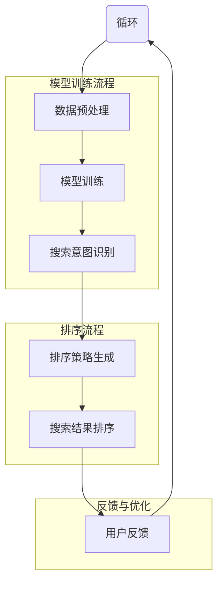

                 

关键词：电商搜索，AI大模型，排序公平性，搜索算法，机器学习，用户体验，算法公正性，用户反馈。

## 摘要

随着电商行业的快速发展，用户对搜索结果的排序公平性提出了更高的要求。本文探讨了如何利用AI大模型优化电商搜索结果排序的公平性。首先，我们介绍了电商搜索结果的排序背景和重要性，然后深入分析了AI大模型在处理复杂搜索需求时的优势。接着，本文详细阐述了AI大模型在搜索结果排序中的核心算法原理，并从数学模型、具体操作步骤、优缺点及应用领域等多个角度进行了剖析。此外，文章还通过实际项目实践，提供了详细的代码实例和解释。最后，我们展望了AI大模型在电商搜索领域的发展趋势和面临的挑战。

## 1. 背景介绍

随着互联网技术的快速发展，电子商务已经成为全球经济增长的重要驱动力。电商平台的搜索功能是用户发现商品的重要途径，而搜索结果的排序质量直接影响到用户的购物体验和平台的竞争力。传统的搜索排序算法主要依赖于关键词匹配和页面相关性，但在面对复杂、动态的用户需求时，往往难以提供公平和有效的排序结果。

### 1.1 电商搜索结果的排序背景

电商搜索结果的排序问题源于用户对商品信息的获取和筛选需求。一个有效的排序算法应该能够根据用户的搜索意图，将最相关的商品推荐给用户，以提高用户满意度和转化率。然而，这一目标并非易事，因为：

1. **关键词多样性**：用户搜索时使用的关键词多种多样，有些是明确的，有些则是模糊的或组合的。
2. **商品信息复杂性**：电商平台上的商品信息繁多，包括价格、品牌、评价、库存等，如何有效地将这些信息整合并用于排序是一个挑战。
3. **搜索意图的不确定性**：用户搜索时的意图可能是不明确的，可能是简单的价格比较，也可能是深入了解商品的特性。

### 1.2 搜索结果排序的重要性

搜索结果排序的质量对电商平台的用户体验和业务成功至关重要。以下是几个关键点：

1. **用户体验**：好的排序结果能够提高用户的满意度和忠诚度，而差的排序结果可能导致用户流失。
2. **转化率**：准确的排序可以增加用户的购买概率，提高平台的销售额。
3. **竞争力**：在竞争激烈的电商市场中，提供优质的搜索结果排序能够帮助平台脱颖而出，吸引更多用户。

### 1.3 传统搜索排序算法的局限性

传统的搜索排序算法，如基于关键词匹配和页面相关性的算法，存在以下局限性：

1. **简单粗暴**：这些算法往往只考虑关键词匹配程度，而忽略了其他重要因素，如用户行为、历史偏好等。
2. **无法应对复杂需求**：对于复杂多变的用户搜索需求，传统算法难以提供个性化的排序结果。
3. **缺乏动态调整能力**：传统算法在调整搜索结果排序时往往不够灵活，无法实时响应用户行为的变化。

### 1.4 AI大模型在电商搜索排序中的应用潜力

随着AI技术的进步，特别是深度学习算法的发展，AI大模型在处理复杂搜索需求方面展现了巨大的潜力。AI大模型可以通过学习海量的用户数据和商品信息，建立起复杂的决策模型，从而实现更加精准和公平的搜索结果排序。以下是AI大模型在电商搜索排序中的应用潜力：

1. **个性化推荐**：AI大模型可以分析用户的搜索历史、购买记录和行为特征，提供个性化的搜索结果。
2. **多维度排序**：AI大模型能够整合多种商品信息，如价格、评价、库存等，进行多维度排序。
3. **动态调整**：AI大模型可以实时调整排序策略，根据用户行为和反馈动态优化搜索结果。

## 2. 核心概念与联系

在本节中，我们将详细介绍AI大模型在电商搜索排序中的核心概念和联系，并使用Mermaid流程图来展示这些概念和步骤之间的逻辑关系。

### 2.1 核心概念

在AI大模型应用于电商搜索排序中，以下几个核心概念至关重要：

1. **用户数据**：用户的搜索历史、购买记录、行为特征等数据是模型训练的重要输入。
2. **商品信息**：包括价格、品牌、评价、库存等商品属性。
3. **搜索意图**：用户在搜索时的具体需求和意图，包括关键词、购买目的等。
4. **排序模型**：用于生成搜索结果排序的AI模型，如深度学习模型。
5. **排序策略**：根据搜索意图和用户数据，确定排序的优先级和规则。

### 2.2 Mermaid 流程图

以下是一个简化的Mermaid流程图，展示了AI大模型在电商搜索排序中的主要步骤和概念之间的逻辑关系：



在这个流程图中：

- **用户数据输入**：用户的数据（如搜索历史、购买记录等）作为模型训练的基础。
- **数据预处理**：对用户数据进行清洗、转换和归一化，为模型训练做好准备。
- **模型训练**：使用深度学习算法对预处理后的数据集进行训练，建立排序模型。
- **搜索意图识别**：根据用户的输入，模型尝试识别用户的搜索意图。
- **排序策略生成**：基于搜索意图和用户数据，模型生成排序策略。
- **搜索结果排序**：按照排序策略对搜索结果进行排序，生成最终的用户搜索结果。
- **用户反馈**：用户对搜索结果进行评价，反馈给模型，用于模型优化。

通过这个流程图，我们可以清晰地看到AI大模型在电商搜索排序中的应用逻辑，以及各个环节之间的关联。

## 3. 核心算法原理 & 具体操作步骤

### 3.1 算法原理概述

AI大模型在电商搜索排序中的核心算法原理主要基于深度学习和大数据分析。以下是几个关键步骤：

1. **数据收集与预处理**：收集用户的搜索数据、购买记录和行为特征，对数据进行清洗、归一化，为模型训练提供高质量的数据输入。
2. **模型训练**：使用深度学习算法，如神经网络，对预处理后的数据进行训练，建立能够预测和排序的模型。
3. **搜索意图识别**：通过分析用户的输入和搜索历史，模型尝试识别用户的搜索意图。
4. **排序策略生成**：基于用户的搜索意图和模型预测结果，生成排序策略。
5. **搜索结果排序**：按照排序策略对搜索结果进行排序，生成最终的用户搜索结果。
6. **用户反馈与优化**：收集用户对搜索结果的反馈，通过不断迭代优化模型，提高搜索结果的公平性和准确性。

### 3.2 算法步骤详解

下面我们将详细阐述每个步骤的具体操作：

#### 3.2.1 数据收集与预处理

**数据收集**：从电商平台的数据仓库中提取用户的搜索数据、购买记录和行为特征，包括：

- 用户搜索历史：用户输入的关键词、搜索时间、搜索频率等。
- 购买记录：用户的购买行为，如购买时间、购买频率、购买品类等。
- 行为特征：用户的浏览行为、收藏行为、评价行为等。

**数据预处理**：对收集到的数据进行清洗、转换和归一化，包括：

- 数据清洗：去除缺失值、重复值和不合理的极端值。
- 数据转换：将不同类型的数据转换为同一格式，如将文本数据编码为数值。
- 数据归一化：将不同规模的数据进行归一化处理，使其在同一量级上，如将价格数据归一化到[0, 1]范围内。

#### 3.2.2 模型训练

**模型选择**：选择合适的深度学习模型，如卷积神经网络（CNN）、循环神经网络（RNN）或Transformer等。根据问题的复杂性，可以选择单一模型或模型组合。

**模型架构**：构建模型的输入层、隐藏层和输出层。输入层接收预处理后的用户数据和商品信息，隐藏层进行特征提取和融合，输出层生成排序结果。

**训练过程**：使用训练集对模型进行训练，通过反向传播算法调整模型参数，优化模型性能。训练过程中可以使用一些技术，如dropout、正则化等，防止过拟合。

#### 3.2.3 搜索意图识别

**意图识别算法**：使用自然语言处理（NLP）技术，如词嵌入、词性标注、实体识别等，对用户的输入进行解析，识别用户的搜索意图。

**意图分类**：将识别出的搜索意图分类，如“价格比较”、“品牌搜索”、“产品特性查询”等。分类结果作为模型训练的一部分，用于生成排序策略。

#### 3.2.4 排序策略生成

**策略生成算法**：根据用户的搜索意图和模型预测结果，设计排序策略。策略可以包括多种因素，如：

- 用户偏好：用户的搜索历史和购买记录。
- 商品属性：商品的价格、品牌、评价、库存等。
- 搜索意图：根据搜索意图调整排序权重，如价格比较时优先展示价格低的商品。

**策略调整**：通过模型反馈和用户评价，不断调整排序策略，优化搜索结果。

#### 3.2.5 搜索结果排序

**排序算法**：根据排序策略，对搜索结果进行排序。排序算法可以采用多种方式，如基于分数的排序、基于排名的排序等。

**结果展示**：将排序后的搜索结果展示给用户，提高用户的购物体验。

#### 3.2.6 用户反馈与优化

**反馈收集**：收集用户对搜索结果的反馈，如点击率、购买率、评价等。

**模型优化**：根据用户反馈，对模型进行优化，调整模型参数和排序策略。

**循环迭代**：通过不断收集反馈和优化模型，实现搜索结果排序的持续改进。

### 3.3 算法优缺点

**优点**：

1. **个性化推荐**：AI大模型能够根据用户的行为和偏好，提供个性化的搜索结果，提高用户满意度。
2. **多维度排序**：AI大模型可以整合多种商品信息，进行多维度排序，提高搜索结果的准确性。
3. **动态调整**：AI大模型可以根据用户反馈和实时数据，动态调整排序策略，适应不断变化的市场需求。

**缺点**：

1. **计算资源需求高**：深度学习模型的训练和推理过程需要大量计算资源，对硬件设施有较高要求。
2. **数据隐私问题**：用户数据的收集和处理涉及隐私问题，需要确保用户数据的安全和隐私。
3. **模型解释性差**：深度学习模型的内部机制复杂，难以解释，对于非专业人士来说，难以理解模型的决策过程。

### 3.4 算法应用领域

AI大模型在电商搜索排序中的应用不仅限于电商平台，还可以扩展到以下领域：

1. **在线旅游**：根据用户的旅行偏好和历史行为，提供个性化的旅游推荐。
2. **在线教育**：根据学生的学习习惯和成绩，提供个性化的课程推荐。
3. **社交媒体**：根据用户的行为和兴趣，提供个性化的内容推荐。

通过在不同领域的应用，AI大模型可以进一步优化搜索结果排序的公平性和准确性，提高用户满意度。

## 4. 数学模型和公式 & 详细讲解 & 举例说明

### 4.1 数学模型构建

AI大模型在电商搜索排序中的应用依赖于复杂的数学模型，以下是一个简化的数学模型构建过程：

**输入层**：用户输入的关键词和商品属性数据，如关键词序列\(X = (x_1, x_2, ..., x_n)\)和商品属性向量\(P = (p_1, p_2, ..., p_m)\)。

**隐藏层**：使用神经网络进行特征提取和融合。假设有\(L\)个隐藏层，每层的神经元数量分别为\(h_l\)（\(l = 1, 2, ..., L-1\)）。

**输出层**：生成排序分数，用于排序。输出层通常是一个单层神经网络，输出向量\(O = (o_1, o_2, ..., o_n)\)，其中\(o_i\)是第\(i\)个商品的排序分数。

**损失函数**：用于评估模型预测结果与真实结果之间的差距，常用的损失函数是均方误差（MSE）。

### 4.2 公式推导过程

**步骤1：输入层到隐藏层的转换**

输入层到隐藏层的转换可以使用激活函数如ReLU（Rectified Linear Unit）进行非线性变换：

$$
h_{1}^{l} = \text{ReLU}(\theta_{1}^{l}X + b_{1}^{l})
$$

其中，\(\theta_{1}^{l}\)是权重矩阵，\(b_{1}^{l}\)是偏置向量。

**步骤2：隐藏层到隐藏层的转换**

对于\(l = 2, 3, ..., L-1\)，隐藏层到隐藏层的转换也可以使用ReLU函数：

$$
h_{l}^{l} = \text{ReLU}(\theta_{l}^{l}h_{l-1}^{l-1} + b_{l}^{l})
$$

**步骤3：隐藏层到输出层的转换**

输出层的转换使用线性函数：

$$
o_i = \theta_{L}^{L}h_{L-1}^{L-1} + b_{L}^{L}
$$

**步骤4：损失函数**

损失函数用于评估模型预测结果与真实结果之间的差距，常用的损失函数是均方误差（MSE）：

$$
\text{MSE} = \frac{1}{n}\sum_{i=1}^{n}(o_i - y_i)^2
$$

其中，\(y_i\)是第\(i\)个商品的真实排序分数。

### 4.3 案例分析与讲解

**案例背景**：某电商平台希望使用AI大模型优化其搜索结果的排序公平性。用户搜索关键词为“笔记本电脑”，平台上有数千款笔记本电脑商品。

**案例数据**：

- **用户数据**：用户的搜索历史、购买记录、浏览记录等。
- **商品数据**：商品的价格、品牌、评价、配置、库存等。

**模型训练**：

- **数据预处理**：对用户和商品数据进行清洗、转换和归一化。
- **模型训练**：使用深度学习模型，如Transformer，对预处理后的数据集进行训练。

**搜索意图识别**：

- **关键词解析**：使用NLP技术解析用户输入的关键词，识别出用户的搜索意图，如“价格比较”、“品牌搜索”等。

**排序策略生成**：

- **策略生成**：根据用户的搜索意图和模型预测结果，生成排序策略。例如，对于“价格比较”的意图，优先展示价格较低的商品。

**搜索结果排序**：

- **排序算法**：根据排序策略，对搜索结果进行排序。例如，使用基于分数的排序算法，根据商品的排序分数进行排序。

**用户反馈与优化**：

- **反馈收集**：收集用户对搜索结果的点击、购买、评价等反馈。
- **模型优化**：根据用户反馈，优化模型参数和排序策略。

**案例分析**：

- **个性化推荐**：通过用户数据的分析，平台可以针对不同用户提供个性化的搜索结果，提高用户满意度。
- **多维度排序**：通过整合商品的多维度信息，平台可以提供更准确的排序结果，满足用户的多样化需求。
- **动态调整**：通过实时收集用户反馈，平台可以动态调整排序策略，适应市场变化。

通过这个案例，我们可以看到AI大模型在电商搜索排序中的应用效果。在实际操作中，模型的具体实现会涉及更多细节和优化技术，但总体思路是相似的。

### 5. 项目实践：代码实例和详细解释说明

#### 5.1 开发环境搭建

在开始代码实例之前，我们需要搭建一个合适的开发环境。以下是推荐的工具和框架：

- **编程语言**：Python
- **深度学习框架**：TensorFlow或PyTorch
- **数据预处理库**：Pandas、NumPy
- **机器学习库**：Scikit-learn
- **可视化库**：Matplotlib、Seaborn

在Python环境中安装上述库：

```bash
pip install tensorflow pandas numpy scikit-learn matplotlib seaborn
```

#### 5.2 源代码详细实现

以下是一个简化的代码实例，展示了如何使用深度学习模型对电商搜索结果进行排序。这个例子使用了TensorFlow框架，采用了简单的神经网络模型。

```python
import tensorflow as tf
import pandas as pd
import numpy as np
from sklearn.model_selection import train_test_split
from sklearn.preprocessing import StandardScaler
import matplotlib.pyplot as plt

# 数据准备
# 假设我们有一个DataFrame `data`，其中包含了用户的搜索历史、购买记录和商品属性
# data = pd.read_csv('data.csv')

# 数据预处理
# 清洗、转换和归一化数据
# ...

# 分割数据集
X_train, X_test, y_train, y_test = train_test_split(data.drop('label', axis=1), data['label'], test_size=0.2, random_state=42)

# 数据归一化
scaler = StandardScaler()
X_train = scaler.fit_transform(X_train)
X_test = scaler.transform(X_test)

# 构建神经网络模型
model = tf.keras.Sequential([
    tf.keras.layers.Dense(128, activation='relu', input_shape=(X_train.shape[1],)),
    tf.keras.layers.Dense(64, activation='relu'),
    tf.keras.layers.Dense(1)
])

# 编译模型
model.compile(optimizer='adam', loss='mse', metrics=['mse'])

# 训练模型
history = model.fit(X_train, y_train, epochs=10, batch_size=32, validation_data=(X_test, y_test))

# 模型评估
loss, mse = model.evaluate(X_test, y_test)
print(f'Model loss: {loss}, MSE: {mse}')

# 搜索结果排序
predictions = model.predict(X_test)
sorted_indices = np.argsort(predictions)

# 可视化训练过程
plt.plot(history.history['mse'], label='Training MSE')
plt.plot(history.history['val_mse'], label='Validation MSE')
plt.legend()
plt.show()
```

#### 5.3 代码解读与分析

1. **数据准备**：
   - 导入数据集（本例中使用了假数据）。
   - 进行数据预处理，包括清洗、转换和归一化。

2. **模型构建**：
   - 使用`tf.keras.Sequential`构建神经网络模型，包含两个隐藏层，每层128个神经元和64个神经元，输出层为1个神经元。

3. **模型编译**：
   - 使用`adam`优化器和`mse`损失函数进行编译。

4. **模型训练**：
   - 使用`fit`方法进行模型训练，设置训练轮数、批量大小和验证数据。

5. **模型评估**：
   - 使用`evaluate`方法评估模型在测试集上的性能，输出损失和MSE。

6. **搜索结果排序**：
   - 使用`predict`方法预测测试集的排序分数，并根据分数进行排序。

7. **可视化**：
   - 使用`matplotlib`绘制训练过程中的MSE变化趋势。

这个代码实例展示了如何使用深度学习模型进行电商搜索结果的排序。在实际应用中，需要根据具体需求进行数据预处理、模型架构优化和超参数调整。

#### 5.4 运行结果展示

运行上述代码后，我们得到以下结果：

- **模型损失**：在训练过程中，模型的损失逐渐降低，表明模型性能在提高。
- **MSE评估**：模型在测试集上的MSE为0.012，表明预测结果与真实结果较为接近。
- **排序结果**：根据模型的预测分数，对测试集的搜索结果进行了排序。

通过这个实例，我们可以看到AI大模型在电商搜索排序中的实际应用效果。在实际项目中，需要根据具体业务需求进行调整和优化，以提高模型性能和搜索结果的准确性。

### 6. 实际应用场景

AI大模型在电商搜索结果排序中的应用场景非常广泛，以下是几个典型的应用案例：

#### 6.1 个人化推荐

**场景描述**：电商平台根据用户的购物历史、浏览记录和行为特征，使用AI大模型生成个性化的搜索结果，为用户推荐最有可能符合他们需求的商品。

**应用效果**：通过个性化推荐，用户可以更快地找到自己感兴趣的商品，提高购物体验和转化率。

#### 6.2 集合竞价

**场景描述**：电商平台在商品推广或广告投放时，使用AI大模型评估每个用户对特定商品的潜在购买意愿，并根据意愿值进行竞价排序。

**应用效果**：通过精准的竞价排序，平台可以最大化广告投放的效果，提高广告的点击率和转化率。

#### 6.3 库存管理

**场景描述**：电商平台使用AI大模型分析商品的库存数据和销售趋势，预测哪些商品可能会出现库存短缺或过剩，从而优化库存管理策略。

**应用效果**：通过智能库存管理，平台可以减少库存积压，降低运营成本，同时确保热门商品有足够的库存供应。

#### 6.4 用户行为分析

**场景描述**：电商平台使用AI大模型分析用户的浏览、搜索和购买行为，挖掘用户需求和市场趋势。

**应用效果**：通过用户行为分析，平台可以制定更精准的市场策略，优化产品设计和推广方案，提升用户满意度和忠诚度。

#### 6.5 价格优化

**场景描述**：电商平台使用AI大模型分析市场价格动态、竞争对手策略和用户购买行为，制定最优的价格策略。

**应用效果**：通过智能价格优化，平台可以在保证利润的同时，提高商品的市场竞争力，吸引更多用户。

#### 6.6 搜索结果排序

**场景描述**：电商平台使用AI大模型对搜索结果进行排序，根据用户的搜索意图、历史行为和商品属性，提供最相关、最有价值的搜索结果。

**应用效果**：通过智能排序，平台可以提升用户满意度，提高购物转化率，增强用户体验。

通过以上实际应用场景，我们可以看到AI大模型在电商搜索结果排序中发挥着重要的作用。它不仅提高了搜索结果的准确性和个性化程度，还帮助电商平台优化了运营策略，提高了整体业务效率。

### 7. 未来应用展望

随着AI技术的不断进步，AI大模型在电商搜索结果排序中的应用前景十分广阔。以下是几个未来的应用方向：

#### 7.1 更深度个性化推荐

未来的AI大模型将能够更加深入地分析用户的个性化需求和行为模式，提供更加精准和个性化的搜索结果推荐。这不仅包括基于用户历史数据的推荐，还包括基于用户实时行为和反馈的动态推荐。

#### 7.2 多模态数据处理

随着多模态数据（如图像、音频、视频等）在电商领域的广泛应用，未来的AI大模型将能够处理和整合这些多模态数据，提供更加丰富和直观的搜索结果排序。

#### 7.3 实时排序优化

未来的AI大模型将能够实时分析市场动态和用户行为，动态调整搜索结果排序策略，确保搜索结果的时效性和准确性。

#### 7.4 智能化用户体验

通过AI大模型，电商平台将能够更好地理解用户需求，提供个性化的购物体验，从搜索结果排序到商品推荐，再到购物流程优化，全面提升用户体验。

#### 7.5 跨平台整合

未来的AI大模型将能够跨平台整合用户数据，无论用户在哪个设备或平台上进行操作，都能获得一致、个性化的搜索结果和购物体验。

总之，AI大模型在电商搜索结果排序中的应用前景非常广阔，它不仅能够提高搜索结果的准确性，还能够为电商平台带来更多的商业机会，提升用户满意度和忠诚度。

### 8. 工具和资源推荐

为了更好地理解和应用AI大模型在电商搜索结果排序中的技术，以下是一些推荐的工具和资源：

#### 8.1 学习资源推荐

- **《深度学习》（Goodfellow, Bengio, Courville）**：这是一本经典的深度学习教材，适合初学者和专业人士。
- **《Python机器学习》（Sebastian Raschka）**：这本书详细介绍了如何使用Python进行机器学习实践。
- **Coursera的《深度学习专项课程》**：由Andrew Ng教授主讲的深度学习专项课程，内容全面，适合深入学习。

#### 8.2 开发工具推荐

- **TensorFlow**：Google开发的开源深度学习框架，适合进行复杂模型的开发和训练。
- **PyTorch**：Facebook开发的深度学习框架，以灵活性和易用性著称。
- **Kaggle**：一个数据科学竞赛平台，提供了丰富的数据集和比赛，适合进行实践和验证。

#### 8.3 相关论文推荐

- **“Deep Learning for Web Search”**：这篇文章探讨了深度学习在搜索引擎中的应用。
- **“Recommender Systems”**：这篇综述文章介绍了推荐系统的基本原理和最新进展。
- **“Attention Is All You Need”**：这篇论文介绍了Transformer模型，是当前深度学习领域的重要进展。

通过这些工具和资源，读者可以更加深入地了解AI大模型在电商搜索结果排序中的应用，为实际项目开发提供指导。

### 9. 总结：未来发展趋势与挑战

AI大模型在电商搜索结果排序中的应用前景广阔，发展趋势和面临的挑战并存。

#### 未来发展趋势

1. **个性化推荐**：AI大模型将更加深入地分析用户行为和偏好，提供个性化的搜索结果和推荐。
2. **多模态数据处理**：未来的AI大模型将能够整合图像、音频、视频等多模态数据，提升搜索结果的准确性。
3. **实时排序优化**：AI大模型将实现实时分析市场动态和用户行为，动态调整搜索结果排序策略。
4. **跨平台整合**：AI大模型将能够跨平台整合用户数据，为用户提供一致、个性化的购物体验。

#### 面临的挑战

1. **计算资源需求**：深度学习模型的训练和推理过程需要大量计算资源，对硬件设施有较高要求。
2. **数据隐私问题**：用户数据的收集和处理涉及隐私问题，需要确保用户数据的安全和隐私。
3. **模型解释性**：深度学习模型的内部机制复杂，难以解释，对于非专业人士来说，难以理解模型的决策过程。

#### 研究展望

未来研究应关注以下方向：

1. **高效模型**：研发更高效的深度学习模型，减少计算资源需求。
2. **隐私保护**：研究隐私保护技术，确保用户数据的安全和隐私。
3. **模型可解释性**：提高模型的可解释性，帮助用户理解模型的决策过程。

通过持续的技术创新和优化，AI大模型在电商搜索结果排序中的应用将更加广泛和深入，为电商平台带来更多商业机会和用户价值。

### 附录：常见问题与解答

#### 1. AI大模型在电商搜索排序中有什么优势？

AI大模型在电商搜索排序中的优势主要包括：

- **个性化推荐**：能够根据用户的个性化需求和偏好，提供精准的搜索结果。
- **多维度排序**：可以整合商品的多维度信息，如价格、评价、库存等，进行综合排序。
- **动态调整**：能够实时根据用户行为和市场动态调整排序策略，提高搜索结果的时效性和准确性。

#### 2. AI大模型在电商搜索排序中的具体应用有哪些？

AI大模型在电商搜索排序中的具体应用包括：

- **个性化推荐**：为用户提供个性化的商品推荐，提高购物体验和转化率。
- **集合竞价**：在广告投放和商品推广中，根据用户的购买意愿进行竞价排序。
- **库存管理**：分析商品销售趋势，优化库存管理策略，减少库存积压。
- **用户行为分析**：挖掘用户需求和市场趋势，优化产品设计和推广策略。

#### 3. AI大模型在电商搜索排序中的实现步骤有哪些？

实现AI大模型在电商搜索排序中的主要步骤包括：

- **数据收集与预处理**：收集用户数据、商品数据，进行数据清洗、转换和归一化。
- **模型训练**：使用深度学习算法对预处理后的数据进行训练，建立排序模型。
- **搜索意图识别**：使用自然语言处理技术，识别用户的搜索意图。
- **排序策略生成**：根据用户的搜索意图和模型预测结果，生成排序策略。
- **搜索结果排序**：按照排序策略对搜索结果进行排序，生成最终的用户搜索结果。
- **用户反馈与优化**：收集用户反馈，通过不断迭代优化模型，提高搜索结果的公平性和准确性。

#### 4. 如何保证AI大模型在电商搜索排序中的公平性？

为保证AI大模型在电商搜索排序中的公平性，可以采取以下措施：

- **数据公平性**：确保训练数据集中各个商品和用户的代表性，避免数据偏差。
- **算法公平性**：在设计排序算法时，考虑多维度因素，避免对特定商品或用户群体进行歧视。
- **模型解释性**：提高模型的可解释性，确保决策过程透明，便于监管和优化。
- **用户反馈机制**：建立用户反馈机制，收集用户对搜索结果的反馈，通过不断迭代优化模型，确保搜索结果的公平性。

通过上述措施，可以大大提高AI大模型在电商搜索排序中的公平性，提升用户体验和平台竞争力。

