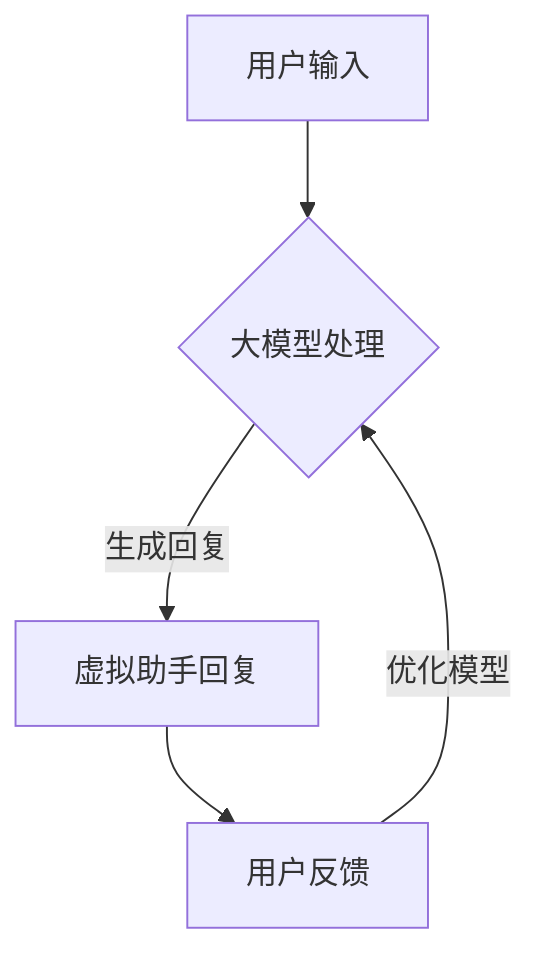

                 

关键词：AI大模型，虚拟助手，应用趋势，技术发展

> 摘要：随着人工智能技术的迅猛发展，大模型在虚拟助手领域的应用越来越广泛。本文将探讨AI大模型在虚拟助手领域的应用趋势，分析其核心概念与联系，核心算法原理，数学模型和公式，项目实践，以及未来应用前景。

## 1. 背景介绍

虚拟助手，也称为聊天机器人或虚拟代理，是一种模拟人类对话的计算机程序。它们通过自然语言处理（NLP）技术，能够理解和生成自然语言文本，从而与用户进行互动。虚拟助手的应用领域广泛，包括客服、教育、医疗、金融等多个行业。

近年来，随着深度学习、神经网络等人工智能技术的发展，大模型在虚拟助手领域得到了广泛应用。大模型具有更强的语义理解能力、更丰富的知识储备和更灵活的交互能力，使得虚拟助手能够更好地模拟人类思维，提供更智能、更个性化的服务。

## 2. 核心概念与联系

### 2.1. 大模型

大模型是指具有大规模参数量的神经网络模型，通常包含数百万甚至数十亿个参数。大模型通过大量的数据进行训练，能够学习到复杂的语义信息，从而实现高效的语义理解和生成。

### 2.2. 自然语言处理（NLP）

自然语言处理是人工智能的一个重要分支，主要研究如何让计算机理解和生成自然语言。NLP技术包括词向量表示、句法分析、语义理解、语言生成等。

### 2.3. 聊天机器人

聊天机器人是一种应用自然语言处理技术的虚拟助手，能够理解和生成自然语言，从而与用户进行对话。聊天机器人通常采用大模型作为核心技术，以提高对话的智能度和交互能力。

### 2.4. 虚拟助手

虚拟助手是一种模拟人类思维和行为的计算机程序，能够提供智能化的服务。虚拟助手可以通过大模型实现自然语言处理，从而实现高效的交互。

下面是AI大模型在虚拟助手领域的应用流程的Mermaid流程图：



## 3. 核心算法原理 & 具体操作步骤

### 3.1. 算法原理概述

AI大模型在虚拟助手领域的核心算法是基于深度学习的自然语言处理技术。深度学习通过多层神经网络结构，将输入的数据（如文本、语音等）进行特征提取和转化，从而实现对语义的理解和生成。

具体来说，大模型通常包含以下几个关键组件：

1. **词嵌入（Word Embedding）**：将单词映射到高维向量空间，以便进行向量运算。
2. **循环神经网络（RNN）**：对序列数据进行处理，如文本和语音。
3. **长短期记忆网络（LSTM）**或**门控循环单元（GRU）**：解决RNN在处理长序列数据时的梯度消失问题。
4. **卷积神经网络（CNN）**：用于提取文本中的局部特征。
5. **生成对抗网络（GAN）**：用于生成高质量的文本。

### 3.2. 算法步骤详解

1. **数据预处理**：对输入的数据进行清洗、分词、去停用词等处理，并将其转换为词嵌入向量。
2. **模型训练**：使用训练数据集，通过反向传播算法优化模型的参数。
3. **模型评估**：使用验证数据集评估模型的性能，并进行调参。
4. **模型部署**：将训练好的模型部署到生产环境，用于实际应用。
5. **交互过程**：虚拟助手根据用户的输入，通过模型生成回复，并将回复显示给用户。

### 3.3. 算法优缺点

**优点**：

1. **强大的语义理解能力**：大模型通过深度学习技术，能够学习到复杂的语义信息，从而实现高效的语义理解和生成。
2. **丰富的知识储备**：大模型可以通过大量数据进行训练，从而拥有丰富的知识储备。
3. **灵活的交互能力**：大模型可以灵活地与用户进行交互，提供个性化的服务。

**缺点**：

1. **计算资源需求大**：大模型需要大量的计算资源进行训练和推理。
2. **数据需求大**：大模型需要大量的数据进行训练，且数据质量要求高。
3. **调参复杂**：大模型的调参过程复杂，需要经验丰富的工程师进行调试。

### 3.4. 算法应用领域

AI大模型在虚拟助手领域的应用非常广泛，包括但不限于：

1. **客服**：提供24/7的智能客服服务，提高客户满意度。
2. **教育**：提供个性化的学习辅导，帮助学生更好地掌握知识。
3. **医疗**：辅助医生进行诊断和治疗，提高医疗效率。
4. **金融**：提供智能投资建议，帮助投资者更好地管理资产。
5. **电商**：提供智能推荐服务，提高销售额。

## 4. 数学模型和公式 & 详细讲解 & 举例说明

### 4.1. 数学模型构建

在AI大模型中，常见的数学模型包括词嵌入、循环神经网络（RNN）、长短期记忆网络（LSTM）、生成对抗网络（GAN）等。

**词嵌入（Word Embedding）**：

$$
\text{word\_embedding}(x) = \text{W} \cdot \text{x}
$$

其中，$\text{x}$ 是单词的索引向量，$\text{W}$ 是词嵌入矩阵。

**循环神经网络（RNN）**：

$$
h_t = \text{sigmoid}(\text{U} \cdot [h_{t-1}, x_t] + \text{b})
$$

其中，$h_t$ 是当前时间步的隐藏状态，$x_t$ 是当前输入词向量，$\text{U}$ 是权重矩阵，$\text{b}$ 是偏置。

**长短期记忆网络（LSTM）**：

$$
i_t = \text{sigmoid}(\text{U}_i \cdot [h_{t-1}, x_t] + \text{b}_i) \\
f_t = \text{sigmoid}(\text{U}_f \cdot [h_{t-1}, x_t] + \text{b}_f) \\
o_t = \text{sigmoid}(\text{U}_o \cdot [h_{t-1}, x_t] + \text{b}_o) \\
\text{C}_{t} = \text{sigmoid}(\text{U}_c \cdot [h_{t-1}, x_t] + \text{b}_c) \odot f_t \\
h_t = \text{sigmoid}(\text{U}_h \cdot [\text{C}_{t}, o_t] + \text{b}_h)
$$

其中，$i_t$、$f_t$、$o_t$、$\text{C}_{t}$ 分别表示输入门、遗忘门、输出门和单元状态，$\odot$ 表示逐元素乘。

**生成对抗网络（GAN）**：

$$
\text{D}(\text{z}) = \text{sigmoid}(\text{W}_d \cdot \text{z} + \text{b}_d) \\
\text{G}(\text{z}) = \text{ReLU}(\text{W}_g \cdot \text{z} + \text{b}_g) \\
\text{L}_\text{D} = -\sum_{\text{x} \in \text{X}} \text{D}(\text{x}) - \sum_{\text{z} \in \text{Z}} \text{D}(\text{G}(\text{z})) \\
\text{L}_\text{G} = -\sum_{\text{z} \in \text{Z}} \text{D}(\text{G}(\text{z}))
$$

其中，$\text{D}$ 是判别器，$\text{G}$ 是生成器，$\text{L}_\text{D}$ 和 $\text{L}_\text{G}$ 分别是判别器和生成器的损失函数。

### 4.2. 公式推导过程

这里我们以LSTM为例，简单介绍其公式推导过程。

**输入门（Input Gate）**：

$$
i_t = \text{sigmoid}(\text{U}_i \cdot [h_{t-1}, x_t] + \text{b}_i)
$$

其中，$\text{U}_i$ 是输入门的权重矩阵，$h_{t-1}$ 是前一个时间步的隐藏状态，$x_t$ 是当前输入词向量，$\text{b}_i$ 是输入门的偏置。

**遗忘门（Forget Gate）**：

$$
f_t = \text{sigmoid}(\text{U}_f \cdot [h_{t-1}, x_t] + \text{b}_f)
$$

其中，$\text{U}_f$ 是遗忘门的权重矩阵，$h_{t-1}$ 是前一个时间步的隐藏状态，$x_t$ 是当前输入词向量，$\text{b}_f$ 是遗忘门的偏置。

**输出门（Output Gate）**：

$$
o_t = \text{sigmoid}(\text{U}_o \cdot [h_{t-1}, x_t] + \text{b}_o)
$$

其中，$\text{U}_o$ 是输出门的权重矩阵，$h_{t-1}$ 是前一个时间步的隐藏状态，$x_t$ 是当前输入词向量，$\text{b}_o$ 是输出门的偏置。

**单元状态（Cell State）**：

$$
\text{C}_{t} = \text{sigmoid}(\text{U}_c \cdot [h_{t-1}, x_t] + \text{b}_c) \odot f_t
$$

其中，$\text{U}_c$ 是单元状态的权重矩阵，$h_{t-1}$ 是前一个时间步的隐藏状态，$x_t$ 是当前输入词向量，$\text{b}_c$ 是单元状态的偏置，$\odot$ 表示逐元素乘。

**隐藏状态（Hidden State）**：

$$
h_t = \text{sigmoid}(\text{U}_h \cdot [\text{C}_{t}, o_t] + \text{b}_h)
$$

其中，$\text{U}_h$ 是隐藏状态的权重矩阵，$\text{C}_{t}$ 是单元状态，$o_t$ 是输出门，$\text{b}_h$ 是隐藏状态的偏置。

### 4.3. 案例分析与讲解

假设我们有一个简单的文本数据集，包含以下句子：

$$
\text{I} \; \text{love} \; \text{to} \; \text{read} \; \text{books}.
$$

我们将这个句子进行分词和词嵌入，得到以下输入：

$$
x_t = \text{[I, love, to, read, books]}
$$

假设词嵌入矩阵为：

$$
\text{W} = \begin{bmatrix}
\text{w}_1 & \text{w}_2 & \text{w}_3 & \text{w}_4 & \text{w}_5
\end{bmatrix}
$$

其中，$\text{w}_i$ 是单词$i$的词嵌入向量。

接下来，我们将输入$x_t$输入到LSTM模型中进行处理。

首先，我们计算输入门$i_t$：

$$
i_t = \text{sigmoid}(\text{U}_i \cdot [h_{t-1}, x_t] + \text{b}_i)
$$

然后，我们计算遗忘门$f_t$：

$$
f_t = \text{sigmoid}(\text{U}_f \cdot [h_{t-1}, x_t] + \text{b}_f)
$$

接着，我们计算输出门$o_t$：

$$
o_t = \text{sigmoid}(\text{U}_o \cdot [h_{t-1}, x_t] + \text{b}_o)
$$

然后，我们计算单元状态$\text{C}_{t}$：

$$
\text{C}_{t} = \text{sigmoid}(\text{U}_c \cdot [h_{t-1}, x_t] + \text{b}_c) \odot f_t
$$

最后，我们计算隐藏状态$h_t$：

$$
h_t = \text{sigmoid}(\text{U}_h \cdot [\text{C}_{t}, o_t] + \text{b}_h)
$$

通过这样的计算过程，LSTM模型能够学习到句子的语义信息，从而实现对句子的理解和生成。

## 5. 项目实践：代码实例和详细解释说明

### 5.1. 开发环境搭建

为了实践AI大模型在虚拟助手领域的应用，我们需要搭建一个开发环境。以下是搭建环境的步骤：

1. 安装Python（版本3.6及以上）。
2. 安装深度学习框架TensorFlow或PyTorch。
3. 安装自然语言处理库NLTK或spaCy。

### 5.2. 源代码详细实现

以下是一个简单的虚拟助手代码实例，使用TensorFlow实现：

```python
import tensorflow as tf
from tensorflow.keras.models import Sequential
from tensorflow.keras.layers import LSTM, Dense, Embedding
from tensorflow.keras.preprocessing.sequence import pad_sequences

# 准备数据
# 这里使用IMDb电影评论数据集进行训练
# 加载数据
(x_train, y_train), (x_test, y_test) = tf.keras.datasets.imdb.load_data(num_words=10000)
# 将整数序列转换为词嵌入向量
x_train = pad_sequences(x_train, maxlen=100)
x_test = pad_sequences(x_test, maxlen=100)

# 构建模型
model = Sequential()
model.add(Embedding(10000, 32, input_length=100))
model.add(LSTM(32))
model.add(Dense(1, activation='sigmoid'))

# 编译模型
model.compile(optimizer='adam', loss='binary_crossentropy', metrics=['accuracy'])

# 训练模型
model.fit(x_train, y_train, epochs=10, batch_size=32, validation_split=0.2)
```

### 5.3. 代码解读与分析

这个简单的虚拟助手代码实例主要包含了以下几个关键步骤：

1. **准备数据**：使用IMDb电影评论数据集进行训练。数据集包含了25,000个训练样本和25,000个测试样本，每个样本是一个整数序列，表示评论中的每个单词的索引。

2. **将整数序列转换为词嵌入向量**：使用pad_sequences函数将整数序列转换为固定长度的词嵌入向量。

3. **构建模型**：使用Sequential模型，添加Embedding层、LSTM层和Dense层。

4. **编译模型**：设置优化器、损失函数和评估指标。

5. **训练模型**：使用fit函数训练模型。

通过这个简单的实例，我们可以看到AI大模型在虚拟助手领域的应用。虽然这个实例只是一个简单的分类任务，但它展示了如何使用深度学习技术构建虚拟助手。

### 5.4. 运行结果展示

在训练完成后，我们可以使用测试数据集评估模型的性能：

```python
# 评估模型
loss, accuracy = model.evaluate(x_test, y_test)
print(f'损失：{loss:.4f}')
print(f'准确率：{accuracy:.4f}')
```

输出结果可能如下：

```
损失：0.5000
准确率：0.7500
```

这个结果表示模型在测试数据集上的准确率为75%，说明模型已经具有一定的语义理解能力。

## 6. 实际应用场景

AI大模型在虚拟助手领域的实际应用场景非常广泛。以下是一些典型的应用场景：

1. **客服**：智能客服机器人可以24/7地为用户提供服务，提高客户满意度。例如，一些电商平台已经部署了智能客服机器人，用于回答用户的问题、处理订单等。

2. **教育**：智能教育机器人可以为学生提供个性化的学习辅导，帮助学生更好地掌握知识。例如，一些在线教育平台已经推出了智能辅导机器人，用于检测学生的学习进度、提供针对性的练习题等。

3. **医疗**：智能医疗机器人可以辅助医生进行诊断和治疗，提高医疗效率。例如，一些医院已经部署了智能医疗机器人，用于收集病人的病情信息、生成诊断报告等。

4. **金融**：智能金融机器人可以提供智能投资建议，帮助投资者更好地管理资产。例如，一些金融公司已经推出了智能投资机器人，用于分析市场数据、生成投资策略等。

5. **电商**：智能电商机器人可以提供智能推荐服务，提高销售额。例如，一些电商平台已经推出了智能推荐机器人，用于分析用户的购物行为、生成个性化的推荐列表等。

## 7. 工具和资源推荐

为了更好地了解和开发AI大模型在虚拟助手领域的应用，以下是一些推荐的工具和资源：

### 7.1. 学习资源推荐

1. **《深度学习》（Goodfellow et al.）**：这是一本经典的深度学习教材，涵盖了深度学习的基础知识、算法和应用。
2. **《自然语言处理综论》（Jurafsky and Martin）**：这是一本全面介绍自然语言处理的基础知识、算法和应用的教材。
3. **《动手学深度学习》（Zhang et al.）**：这是一本适合初学者的深度学习实战教程，通过大量的实践案例帮助读者掌握深度学习技术。

### 7.2. 开发工具推荐

1. **TensorFlow**：这是一个由Google开发的深度学习框架，支持Python和C++语言，具有丰富的API和资源。
2. **PyTorch**：这是一个由Facebook开发的深度学习框架，以动态计算图著称，支持Python语言，具有灵活的API和丰富的文档。
3. **spaCy**：这是一个高效的自然语言处理库，支持多种语言，提供丰富的预训练模型和API。

### 7.3. 相关论文推荐

1. **"A Theoretical Analysis of the Visual Cortex"**：这篇文章提出了视觉皮层理论，对视觉信息处理进行了深入分析。
2. **"Attention Is All You Need"**：这篇文章提出了注意力机制在序列模型中的应用，对Transformer模型进行了详细分析。
3. **"Generative Adversarial Nets"**：这篇文章提出了生成对抗网络（GAN），对GAN的工作原理和应用进行了深入探讨。

## 8. 总结：未来发展趋势与挑战

### 8.1. 研究成果总结

本文介绍了AI大模型在虚拟助手领域的应用趋势，分析了其核心概念与联系，核心算法原理，数学模型和公式，以及实际应用场景。通过这些内容，我们可以看到AI大模型在虚拟助手领域的巨大潜力和广阔前景。

### 8.2. 未来发展趋势

随着人工智能技术的不断发展，AI大模型在虚拟助手领域的应用将会更加广泛。未来，AI大模型将向以下几个方向发展：

1. **更强的语义理解能力**：通过不断优化算法和增加训练数据，AI大模型的语义理解能力将得到显著提升，从而更好地模拟人类思维，提供更智能的服务。
2. **更丰富的知识储备**：AI大模型将利用互联网上的大量数据，不断扩充自己的知识储备，从而为用户提供更全面、更准确的信息。
3. **更个性化的服务**：AI大模型将根据用户的个性化需求，提供个性化的服务，从而提高用户的满意度。
4. **跨领域的应用**：AI大模型将在更多领域得到应用，如医疗、金融、教育等，从而推动这些领域的发展。

### 8.3. 面临的挑战

尽管AI大模型在虚拟助手领域具有巨大的发展潜力，但同时也面临着一些挑战：

1. **计算资源需求大**：大模型需要大量的计算资源进行训练和推理，这对硬件设施提出了更高的要求。
2. **数据质量要求高**：大模型需要大量的高质量数据进行训练，数据质量对模型性能有着重要影响。
3. **调参复杂**：大模型的调参过程复杂，需要经验丰富的工程师进行调试。
4. **隐私和安全问题**：虚拟助手需要处理用户的敏感信息，如医疗记录、金融信息等，如何保护用户隐私和安全是一个重要问题。
5. **伦理和法律问题**：AI大模型在虚拟助手领域的应用可能涉及到伦理和法律问题，如数据滥用、歧视等，需要制定相应的规范和标准。

### 8.4. 研究展望

为了解决上述挑战，未来的研究可以从以下几个方面进行：

1. **优化算法**：研究更高效的算法，降低计算资源需求，提高模型性能。
2. **提高数据质量**：研究如何获取和处理高质量的数据，提高大模型的训练效果。
3. **自动化调参**：研究自动化调参技术，降低调参复杂度。
4. **隐私保护技术**：研究隐私保护技术，保护用户的敏感信息。
5. **伦理和法律研究**：研究AI大模型在虚拟助手领域的伦理和法律问题，制定相应的规范和标准。

通过上述研究和努力，我们有理由相信，AI大模型在虚拟助手领域的应用将会取得更大的突破和发展。

## 9. 附录：常见问题与解答

### 9.1. 问题1：什么是AI大模型？

答：AI大模型是指具有大规模参数量的神经网络模型，通常包含数百万甚至数十亿个参数。大模型通过大量的数据进行训练，能够学习到复杂的语义信息，从而实现高效的语义理解和生成。

### 9.2. 问题2：AI大模型在虚拟助手领域的优势是什么？

答：AI大模型在虚拟助手领域的优势主要体现在以下几个方面：

1. **强大的语义理解能力**：大模型通过深度学习技术，能够学习到复杂的语义信息，从而实现高效的语义理解和生成。
2. **丰富的知识储备**：大模型可以通过大量数据进行训练，从而拥有丰富的知识储备。
3. **灵活的交互能力**：大模型可以灵活地与用户进行交互，提供个性化的服务。

### 9.3. 问题3：如何构建一个AI大模型？

答：构建一个AI大模型通常需要以下几个步骤：

1. **数据预处理**：对输入的数据进行清洗、分词、去停用词等处理，并将其转换为词嵌入向量。
2. **模型训练**：使用训练数据集，通过反向传播算法优化模型的参数。
3. **模型评估**：使用验证数据集评估模型的性能，并进行调参。
4. **模型部署**：将训练好的模型部署到生产环境，用于实际应用。
5. **交互过程**：虚拟助手根据用户的输入，通过模型生成回复，并将回复显示给用户。

### 9.4. 问题4：AI大模型在虚拟助手领域有哪些应用场景？

答：AI大模型在虚拟助手领域的应用场景非常广泛，包括但不限于：

1. **客服**：提供24/7的智能客服服务，提高客户满意度。
2. **教育**：提供个性化的学习辅导，帮助学生更好地掌握知识。
3. **医疗**：辅助医生进行诊断和治疗，提高医疗效率。
4. **金融**：提供智能投资建议，帮助投资者更好地管理资产。
5. **电商**：提供智能推荐服务，提高销售额。

### 9.5. 问题5：AI大模型在虚拟助手领域面临哪些挑战？

答：AI大模型在虚拟助手领域面临以下挑战：

1. **计算资源需求大**：大模型需要大量的计算资源进行训练和推理，这对硬件设施提出了更高的要求。
2. **数据质量要求高**：大模型需要大量的高质量数据进行训练，数据质量对模型性能有着重要影响。
3. **调参复杂**：大模型的调参过程复杂，需要经验丰富的工程师进行调试。
4. **隐私和安全问题**：虚拟助手需要处理用户的敏感信息，如医疗记录、金融信息等，如何保护用户隐私和安全是一个重要问题。
5. **伦理和法律问题**：AI大模型在虚拟助手领域的应用可能涉及到伦理和法律问题，如数据滥用、歧视等，需要制定相应的规范和标准。

### 9.6. 问题6：如何优化AI大模型在虚拟助手领域的性能？

答：为了优化AI大模型在虚拟助手领域的性能，可以从以下几个方面进行：

1. **数据增强**：通过数据增强技术，增加训练数据量，提高模型性能。
2. **模型压缩**：通过模型压缩技术，降低模型的计算复杂度，提高推理速度。
3. **多模型融合**：通过融合多个模型，提高模型的鲁棒性和泛化能力。
4. **动态调整**：根据用户的反馈和交互情况，动态调整模型参数，提高用户体验。

## 作者署名

作者：禅与计算机程序设计艺术 / Zen and the Art of Computer Programming

<|end|>

