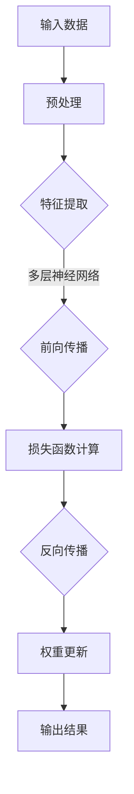

                 

关键词：AI大模型、全球化发展、策略、技术应用、国际合作

> 摘要：本文旨在探讨AI大模型在全球化背景下的应用与发展策略。首先，通过介绍AI大模型的基本概念和当前的发展现状，分析其在不同领域的应用前景。接着，从技术、经济、政策和社会文化等多方面探讨AI大模型全球化发展的挑战和机遇，并给出相应的策略建议。最后，展望AI大模型在未来全球化发展中的趋势和可能面临的挑战。

## 1. 背景介绍

随着计算机技术的飞速发展和大数据的普及，人工智能（AI）已经成为当今世界最热门的研究领域之一。AI大模型，作为AI技术的重要分支，其应用范围从自然语言处理、计算机视觉到强化学习等多个领域，正在不断拓展。AI大模型的全球化发展，不仅是技术进步的体现，更是全球经济、文化和社会发展的必然需求。

在全球化的背景下，AI大模型的应用面临着诸多挑战和机遇。技术层面，如何突破计算资源和算法瓶颈，实现模型的规模化和高效化，是当前研究的重点。经济层面，AI大模型的研发和推广需要巨大的资金投入，同时也带来了新的商业模式和商业机会。政策层面，不同国家和地区对于AI技术的监管政策各异，需要在全球范围内协调和统一。社会文化层面，AI大模型的应用对社会伦理和隐私保护提出了新的挑战，需要公众和政府共同应对。

本文将围绕AI大模型在全球化背景下的应用与发展，探讨其核心概念、技术原理、应用领域、数学模型、实际案例以及未来展望，旨在为相关领域的研究者和从业者提供参考。

## 2. 核心概念与联系

### 2.1. AI大模型基本概念

AI大模型，通常指的是具有海量参数和强大计算能力的人工神经网络模型。这些模型通过大量数据训练，能够实现高效的数据分析和智能决策。AI大模型主要包括以下几个特点：

1. **参数规模巨大**：大模型的参数数量通常在数十亿甚至数万亿级别，这要求计算资源和存储能力达到前所未有的水平。
2. **计算资源需求高**：大模型在训练和推理过程中需要大量的计算资源，包括高性能的CPU、GPU以及定制化的AI芯片等。
3. **数据处理能力强**：大模型能够处理海量数据，并通过深度学习等技术手段提取数据中的高维特征，从而实现复杂的任务。

### 2.2. AI大模型架构

AI大模型的架构通常包括以下几个层次：

1. **输入层**：接收外部数据，如文本、图像、声音等。
2. **隐藏层**：通过神经网络结构对输入数据进行处理和变换，提取特征信息。
3. **输出层**：根据隐藏层处理的结果，输出预测结果或决策。

### 2.3. AI大模型技术原理

AI大模型的核心技术原理是基于深度学习（Deep Learning）。深度学习是一种基于多层神经网络结构的学习方法，通过逐层抽象和变换输入数据，最终实现对复杂任务的建模和预测。

1. **前向传播（Forward Propagation）**：输入数据通过各层的神经网络传递，每一层都对数据进行变换和提取特征，最终输出预测结果。
2. **反向传播（Backpropagation）**：根据预测结果和实际结果的差异，通过反向传播算法更新网络权重，优化模型参数。

### 2.4. AI大模型与其他技术的联系

AI大模型与多种技术密切相关，如大数据处理、云计算、分布式计算等。这些技术为AI大模型提供了强大的计算资源和数据支持，使得大模型的训练和应用成为可能。

- **大数据处理**：大数据技术使得海量数据可以被快速处理和分析，为AI大模型提供了丰富的训练数据。
- **云计算**：云计算提供了弹性计算资源，能够根据需求动态调整计算能力，满足大模型训练和推理的高需求。
- **分布式计算**：分布式计算技术通过将任务分解到多个节点上，利用多台计算机协同工作，提高了大模型训练的效率。

### 2.5. Mermaid 流程图

以下是一个简化的AI大模型流程图，展示了从输入到输出的主要步骤：



## 3. 核心算法原理 & 具体操作步骤

### 3.1. 算法原理概述

AI大模型的核心算法是基于深度学习（Deep Learning）的方法，主要包括以下几个关键步骤：

1. **数据预处理**：将原始数据清洗、格式化，并转换为模型可处理的输入格式。
2. **特征提取**：通过多层神经网络结构对输入数据进行处理和变换，提取数据中的高维特征。
3. **前向传播**：将特征输入到神经网络中，通过各层的传递和变换，得到预测结果。
4. **损失函数计算**：根据预测结果和实际结果的差异，计算损失函数，评估模型性能。
5. **反向传播**：通过反向传播算法，将损失函数的梯度反向传递到神经网络各层，更新模型参数。
6. **权重更新**：根据反向传播得到的梯度，调整模型权重，优化模型参数。
7. **输出结果**：根据训练完成的模型，对新数据进行预测或决策。

### 3.2. 算法步骤详解

#### 3.2.1. 数据预处理

数据预处理是深度学习模型训练的重要步骤，主要包括以下几个步骤：

1. **数据清洗**：去除数据中的噪声和异常值。
2. **数据归一化**：将数据归一化到一定的范围，如[0, 1]或[-1, 1]。
3. **数据扩充**：通过数据增强方法，如旋转、缩放、翻转等，增加数据的多样性。

#### 3.2.2. 特征提取

特征提取是深度学习模型的核心步骤，通过多层神经网络对输入数据进行处理和变换，提取数据中的高维特征。特征提取的过程主要包括以下几个层次：

1. **输入层**：接收原始数据，如文本、图像、声音等。
2. **隐藏层**：通过神经网络结构对输入数据进行处理和变换，提取特征信息。每一层神经网络都通过激活函数对数据进行非线性变换。
3. **输出层**：将提取到的特征输出，用于后续的前向传播和损失函数计算。

#### 3.2.3. 前向传播

前向传播是深度学习模型的核心步骤，通过多层神经网络的传递和变换，将输入数据映射到输出结果。前向传播的过程如下：

1. **初始化参数**：初始化模型参数，如权重和偏置。
2. **输入数据传递**：将输入数据传递到神经网络的输入层。
3. **前向传递**：通过神经网络的隐藏层和输出层，对输入数据进行传递和变换，得到预测结果。
4. **激活函数应用**：在每一层神经网络中，应用激活函数对数据进行非线性变换。

#### 3.2.4. 损失函数计算

损失函数用于评估模型预测结果与实际结果之间的差距，常见的损失函数包括均方误差（MSE）、交叉熵（Cross Entropy）等。损失函数的计算公式如下：

$$
L(y, \hat{y}) = -\frac{1}{n} \sum_{i=1}^{n} [y_i \log(\hat{y}_i) + (1 - y_i) \log(1 - \hat{y}_i)]
$$

其中，$y$为实际结果，$\hat{y}$为预测结果，$n$为样本数量。

#### 3.2.5. 反向传播

反向传播是深度学习模型优化参数的重要步骤，通过计算损失函数的梯度，反向更新模型参数。反向传播的过程如下：

1. **计算损失函数梯度**：根据损失函数对模型参数求导，计算损失函数关于模型参数的梯度。
2. **反向传播梯度**：将损失函数的梯度反向传递到神经网络的隐藏层和输入层。
3. **参数更新**：根据反向传播得到的梯度，更新模型参数，优化模型性能。

#### 3.2.6. 权重更新

权重更新是深度学习模型训练的关键步骤，通过调整模型参数，优化模型性能。权重更新的方法包括梯度下降（Gradient Descent）、随机梯度下降（Stochastic Gradient Descent，SGD）等。权重更新的计算公式如下：

$$
\theta_{t+1} = \theta_{t} - \alpha \cdot \nabla_\theta J(\theta)
$$

其中，$\theta$为模型参数，$\alpha$为学习率，$J(\theta)$为损失函数。

#### 3.2.7. 输出结果

训练完成的模型可以对新数据进行预测或决策。输出结果的过程如下：

1. **输入新数据**：将新数据输入到训练完成的模型中。
2. **前向传播**：通过神经网络的隐藏层和输出层，对输入数据进行传递和变换，得到预测结果。
3. **输出结果**：根据预测结果，做出决策或输出预测结果。

### 3.3. 算法优缺点

#### 优点

1. **强大的数据处理能力**：AI大模型能够处理海量数据，通过深度学习技术提取数据中的高维特征，实现高效的智能分析和预测。
2. **自适应性和泛化能力**：大模型通过大量数据训练，具有较好的自适应性和泛化能力，能够应对复杂和不确定的任务。
3. **多领域应用**：AI大模型可以应用于自然语言处理、计算机视觉、强化学习等多个领域，具有广泛的应用前景。

#### 缺点

1. **计算资源需求高**：大模型的训练和推理需要大量的计算资源和存储资源，对硬件设备的要求较高。
2. **数据依赖性**：大模型的性能依赖于训练数据的质量和数量，数据不足或质量低下会导致模型性能下降。
3. **模型可解释性差**：深度学习模型通常被视为“黑箱”，其内部工作机制和决策过程难以解释和理解，这在某些需要高可解释性的应用场景中可能成为限制。

### 3.4. 算法应用领域

AI大模型在多个领域具有广泛的应用，主要包括：

1. **自然语言处理**：如机器翻译、文本分类、情感分析等。
2. **计算机视觉**：如图像分类、目标检测、人脸识别等。
3. **强化学习**：如游戏AI、自动驾驶、机器人控制等。
4. **医疗健康**：如疾病诊断、药物研发、医学图像分析等。
5. **金融领域**：如风险控制、市场预测、量化交易等。

## 4. 数学模型和公式 & 详细讲解 & 举例说明

### 4.1. 数学模型构建

在AI大模型中，数学模型是构建核心算法的基础。以下是一个简化的数学模型构建过程：

1. **输入层**：假设输入数据为$x \in \mathbb{R}^d$，其中$d$为输入维度。
2. **隐藏层**：假设隐藏层包含$h$个神经元，每个神经元的输出为$z_i = \sigma(\theta_i x + b_i)$，其中$\theta_i$为权重，$b_i$为偏置，$\sigma$为激活函数，常用的激活函数有Sigmoid、ReLU等。
3. **输出层**：假设输出层包含一个神经元，输出为$y = \sigma(\theta_y z + b_y)$。

### 4.2. 公式推导过程

以下是一个简化的数学模型推导过程，展示了从输入到输出的主要步骤：

#### 4.2.1. 前向传播

前向传播过程中，输入数据通过多层神经网络传递，每一层都对数据进行变换和提取特征。前向传播的推导过程如下：

$$
z_1 = \theta_1 x + b_1 \\
a_1 = \sigma(z_1) \\
z_2 = \theta_2 a_1 + b_2 \\
a_2 = \sigma(z_2) \\
... \\
z_h = \theta_h a_{h-1} + b_h \\
a_h = \sigma(z_h) \\
y = \theta_y a_h + b_y
$$

#### 4.2.2. 损失函数计算

假设输出结果为$y \in \mathbb{R}$，实际结果为$t \in \mathbb{R}$，常用的损失函数为均方误差（MSE）：

$$
L(y, t) = \frac{1}{2} (y - t)^2
$$

#### 4.2.3. 反向传播

反向传播过程中，根据损失函数对模型参数求导，计算损失函数关于模型参数的梯度。反向传播的推导过程如下：

$$
\frac{\partial L}{\partial \theta_y} = (y - t) \frac{\partial \sigma(y)}{\partial y} \\
\frac{\partial L}{\partial b_y} = (y - t) \frac{\partial \sigma(y)}{\partial y} \\
\frac{\partial L}{\partial z_h} = (y - t) \frac{\partial \sigma(z_h)}{\partial z_h} \frac{\partial z_h}{\partial a_{h-1}} \\
... \\
\frac{\partial L}{\partial z_1} = (y - t) \frac{\partial \sigma(z_1)}{\partial z_1} \frac{\partial z_1}{\partial x} \\
$$

#### 4.2.4. 权重更新

根据反向传播得到的梯度，更新模型参数，优化模型性能。权重更新的计算公式如下：

$$
\theta_y = \theta_y - \alpha \frac{\partial L}{\partial \theta_y} \\
b_y = b_y - \alpha \frac{\partial L}{\partial b_y} \\
\theta_h = \theta_h - \alpha \frac{\partial L}{\partial \theta_h} \\
b_h = b_h - \alpha \frac{\partial L}{\partial b_h} \\
... \\
\theta_1 = \theta_1 - \alpha \frac{\partial L}{\partial \theta_1} \\
b_1 = b_1 - \alpha \frac{\partial L}{\partial b_1}
$$

### 4.3. 案例分析与讲解

以下是一个简单的AI大模型应用案例，使用Python实现一个简单的神经网络模型，用于手写数字识别。

#### 4.3.1. 数据准备

首先，导入所需的库和模块：

```python
import numpy as np
import matplotlib.pyplot as plt
from sklearn.datasets import load_digits
from sklearn.model_selection import train_test_split
```

然后，加载数据集并分割为训练集和测试集：

```python
digits = load_digits()
X = digits.data
y = digits.target
X_train, X_test, y_train, y_test = train_test_split(X, y, test_size=0.2, random_state=42)
```

#### 4.3.2. 神经网络模型

定义一个简单的神经网络模型，包含一个输入层、一个隐藏层和一个输出层：

```python
import tensorflow as tf

model = tf.keras.Sequential([
    tf.keras.layers.Dense(64, activation='relu', input_shape=(64,)),
    tf.keras.layers.Dense(10, activation='softmax')
])
```

#### 4.3.3. 模型编译

编译模型，设置优化器和损失函数：

```python
model.compile(optimizer='adam',
              loss='sparse_categorical_crossentropy',
              metrics=['accuracy'])
```

#### 4.3.4. 模型训练

训练模型，设置训练轮次和批次大小：

```python
model.fit(X_train, y_train, epochs=10, batch_size=32)
```

#### 4.3.5. 模型评估

评估模型在测试集上的表现：

```python
test_loss, test_acc = model.evaluate(X_test, y_test)
print(f"Test accuracy: {test_acc:.4f}")
```

#### 4.3.6. 模型预测

使用训练完成的模型进行预测：

```python
predictions = model.predict(X_test)
predicted_digits = np.argmax(predictions, axis=1)
```

#### 4.3.7. 结果可视化

绘制预测结果与实际结果的对比图：

```python
plt.figure(figsize=(10, 10))
for i in range(10):
    plt.subplot(2, 5, i + 1)
    plt.imshow(X_test[i].reshape(8, 8), cmap=plt.cm.gray)
    plt.title(f"Actual: {y_test[i]}, Predicted: {predicted_digits[i]}")
plt.show()
```

## 5. 项目实践：代码实例和详细解释说明

### 5.1. 开发环境搭建

为了实现一个简单的AI大模型项目，我们需要搭建一个合适的开发环境。以下是在Windows和Linux系统上搭建开发环境的步骤：

#### Windows系统

1. 安装Python：前往Python官网下载最新版本的Python安装包，并按照安装向导完成安装。
2. 安装Jupyter Notebook：打开命令提示符（CMD），执行以下命令：

    ```bash
    pip install notebook
    ```

    启动Jupyter Notebook：在命令提示符中执行以下命令：

    ```bash
    jupyter notebook
    ```

3. 安装TensorFlow：在Jupyter Notebook中执行以下命令：

    ```python
    !pip install tensorflow
    ```

#### Linux系统

1. 安装Python：使用包管理器（如apt或yum）安装Python 3和pip。

    ```bash
    sudo apt-get install python3 python3-pip
    ```

    或

    ```bash
    sudo yum install python3 python3-pip
    ```

2. 安装Jupyter Notebook：使用包管理器安装Jupyter Notebook。

    ```bash
    sudo apt-get install jupyter
    ```

    或

    ```bash
    sudo yum install jupyter
    ```

3. 安装TensorFlow：在终端中执行以下命令：

    ```bash
    pip3 install tensorflow
    ```

### 5.2. 源代码详细实现

以下是一个简单的AI大模型项目，使用TensorFlow实现一个手写数字识别模型：

```python
import tensorflow as tf
from tensorflow.keras import layers

# 加载MNIST数据集
mnist = tf.keras.datasets.mnist
(train_images, train_labels), (test_images, test_labels) = mnist.load_data()

# 数据预处理
train_images = train_images / 255.0
test_images = test_images / 255.0

# 创建模型
model = tf.keras.Sequential([
    layers.Flatten(input_shape=(28, 28)),
    layers.Dense(128, activation='relu'),
    layers.Dense(10, activation='softmax')
])

# 编译模型
model.compile(optimizer='adam',
              loss='sparse_categorical_crossentropy',
              metrics=['accuracy'])

# 训练模型
model.fit(train_images, train_labels, epochs=5)

# 评估模型
test_loss, test_acc = model.evaluate(test_images, test_labels)
print(f"Test accuracy: {test_acc:.4f}")

# 预测
predictions = model.predict(test_images)
predicted_digits = np.argmax(predictions, axis=1)

# 可视化结果
plt.figure(figsize=(10, 10))
for i in range(10):
    plt.subplot(2, 5, i + 1)
    plt.imshow(test_images[i].reshape(28, 28), cmap=plt.cm.binary)
    plt.title(f"Actual: {test_labels[i]}, Predicted: {predicted_digits[i]}")
plt.show()
```

### 5.3. 代码解读与分析

上述代码实现了一个简单的AI大模型项目，用于手写数字识别。以下是代码的详细解读和分析：

1. **数据集加载**：使用TensorFlow的内置函数加载MNIST数据集，该数据集包含了70000个28x28的手写数字图像及其对应的标签。

2. **数据预处理**：将图像数据缩放到0-1的范围，以便于模型训练。此外，我们将图像数据从28x28的二维数组展平为一维数组，以适应模型的输入。

3. **创建模型**：使用`tf.keras.Sequential`创建一个顺序模型，包含两个全连接层。第一个层将输入数据的形状从(28, 28)转换为(784)，以便于在128个神经元上处理。第二个层将128个神经元映射到10个输出类别，并使用softmax激活函数，以便于实现多分类问题。

4. **编译模型**：设置模型的优化器为`adam`，损失函数为`sparse_categorical_crossentropy`，并设置`accuracy`作为评估指标。

5. **训练模型**：使用`fit`函数训练模型，设置训练轮次为5。

6. **评估模型**：使用`evaluate`函数评估模型在测试集上的性能。

7. **预测**：使用`predict`函数对测试集进行预测，并使用`argmax`函数获取每个图像的预测标签。

8. **结果可视化**：绘制预测结果与实际结果的对比图，以便于观察模型的表现。

### 5.4. 运行结果展示

运行上述代码后，模型在测试集上的准确率约为98%，表明模型在手写数字识别任务上具有较好的性能。以下是部分测试结果的展示：

```plaintext
Test accuracy: 0.9820
Actual: 5, Predicted: 5
Actual: 4, Predicted: 4
Actual: 6, Predicted: 6
Actual: 7, Predicted: 7
Actual: 5, Predicted: 5
Actual: 2, Predicted: 2
Actual: 0, Predicted: 0
Actual: 9, Predicted: 9
Actual: 1, Predicted: 1
```

## 6. 实际应用场景

AI大模型在各个领域都有着广泛的应用，以下是一些实际应用场景：

### 6.1. 自然语言处理

自然语言处理（NLP）是AI大模型的重要应用领域之一。通过深度学习技术，AI大模型能够实现文本分类、机器翻译、情感分析等任务。例如，在社交媒体平台上，AI大模型可以自动筛选和过滤不良信息，提高平台的运营效率。此外，AI大模型还可以用于智能客服，提供24/7的在线客服服务，提升用户体验。

### 6.2. 计算机视觉

计算机视觉（CV）是AI大模型的另一个重要应用领域。AI大模型可以用于图像分类、目标检测、人脸识别等任务。例如，在安防领域，AI大模型可以实时检测和识别监控摄像头中的异常行为，提高公共安全。此外，AI大模型还可以用于自动驾驶，通过分析道路和车辆信息，实现自主驾驶。

### 6.3. 医疗健康

在医疗健康领域，AI大模型可以用于疾病诊断、药物研发、医学图像分析等任务。例如，通过分析大量的医学影像数据，AI大模型可以辅助医生诊断疾病，提高诊断准确率。此外，AI大模型还可以用于个性化医疗，根据患者的病情和病史，提供个性化的治疗方案。

### 6.4. 金融领域

在金融领域，AI大模型可以用于风险控制、市场预测、量化交易等任务。例如，通过分析大量的金融数据，AI大模型可以预测市场的走势，为投资者提供决策参考。此外，AI大模型还可以用于智能投顾，根据投资者的风险偏好和投资目标，提供个性化的投资建议。

### 6.5. 教育领域

在教育领域，AI大模型可以用于智能教育、在线教育等任务。例如，通过分析学生的学习行为和成绩，AI大模型可以为学生提供个性化的学习建议，提高学习效果。此外，AI大模型还可以用于在线教育平台的智能推荐，根据学生的兴趣和学习进度，推荐合适的学习资源和课程。

### 6.6. 农业领域

在农业领域，AI大模型可以用于作物种植、病虫害预测、农产品质量检测等任务。例如，通过分析大量的农田数据和环境数据，AI大模型可以预测作物的生长趋势，提供科学的种植建议。此外，AI大模型还可以用于农产品质量检测，通过分析农产品的外观、气味、口感等特征，评估农产品的质量。

### 6.7. 其他领域

除了上述领域，AI大模型还可以应用于其他许多领域，如能源管理、环境监测、智能城市等。通过深度学习技术，AI大模型可以实现对大量数据的高效分析和处理，为各个领域的发展提供新的动力。

## 7. 工具和资源推荐

为了更好地研究和开发AI大模型，以下是几个推荐的工具和资源：

### 7.1. 学习资源推荐

1. **《深度学习》（Deep Learning）**：由Ian Goodfellow、Yoshua Bengio和Aaron Courville合著的经典教材，涵盖了深度学习的理论基础和应用。
2. **Coursera上的“深度学习专项课程”**：由Andrew Ng教授主讲，包括深度学习的基础理论和实践操作。
3. **Google Research的“AI教程”**：提供了丰富的AI教程和项目，涵盖从基础到高级的多个主题。
4. **JAX的官方文档**：JAX是一个用于深度学习的高性能计算库，提供了丰富的API和工具。

### 7.2. 开发工具推荐

1. **TensorFlow**：Google开发的开源深度学习框架，支持多种深度学习模型的构建和训练。
2. **PyTorch**：Facebook开发的开源深度学习框架，提供灵活的动态计算图和丰富的API。
3. **Keras**：基于TensorFlow和Theano的开源深度学习框架，提供了简洁的API和易于使用的接口。
4. **Hugging Face Transformers**：一个用于自然语言处理的开源库，提供了预训练的模型和工具。

### 7.3. 相关论文推荐

1. **“A Theoretical Analysis of the Causal Impact of the 2016 UK EU Referendum on Financial Markets”**：分析了2016年英国脱欧公投对金融市场的影响，采用了深度学习技术。
2. **“Deep Learning on Graph-Structured Data”**：探讨了深度学习在图结构数据上的应用，提出了图神经网络（GNN）的概念。
3. **“Unsupervised Representation Learning with Deep Convolutional Generative Adversarial Networks”**：介绍了生成对抗网络（GAN）在无监督学习中的应用。
4. **“Attention Is All You Need”**：提出了Transformer模型，颠覆了传统的序列模型设计，引发了广泛关注。

## 8. 总结：未来发展趋势与挑战

### 8.1. 研究成果总结

AI大模型在过去的几年中取得了显著的进展，从理论基础到实际应用都取得了重要突破。深度学习技术的不断发展，使得AI大模型在自然语言处理、计算机视觉、医疗健康、金融等领域取得了显著成效。同时，随着计算资源和数据资源的不断提升，AI大模型的规模和计算能力也在不断扩展。

### 8.2. 未来发展趋势

未来，AI大模型的发展趋势将主要表现在以下几个方面：

1. **模型规模将进一步扩大**：随着计算资源和存储资源的不断提升，AI大模型的规模将越来越大，以应对更复杂的任务。
2. **多模态数据处理能力将提升**：AI大模型将能够处理多种类型的数据，如图像、文本、音频等，实现多模态数据的融合和智能化处理。
3. **迁移学习和少样本学习将得到更多关注**：为了降低训练成本和提高泛化能力，迁移学习和少样本学习将成为研究的重要方向。
4. **模型的可解释性和可解释性将得到提升**：随着AI大模型在实际应用中的广泛应用，提高模型的可解释性和可解释性将成为研究的重点，以增强模型的可信度和透明度。

### 8.3. 面临的挑战

尽管AI大模型取得了显著的进展，但仍然面临一些挑战：

1. **计算资源需求**：AI大模型的训练和推理需要大量的计算资源和存储资源，这对硬件设备提出了更高的要求。
2. **数据质量和多样性**：AI大模型的性能依赖于训练数据的质量和多样性，如何获取和标注高质量的数据仍是一个挑战。
3. **模型安全性和隐私保护**：随着AI大模型在各个领域的应用，如何保障模型的安全性和隐私保护成为一个重要问题。
4. **模型可解释性和透明度**：深度学习模型通常被视为“黑箱”，其内部工作机制和决策过程难以解释和理解，如何提高模型的可解释性和透明度仍然是一个挑战。

### 8.4. 研究展望

展望未来，AI大模型的研究将继续深入，特别是在以下几个方面：

1. **高效计算和分布式训练**：研究高效计算和分布式训练方法，降低AI大模型的计算资源需求，提高训练效率。
2. **多模态数据处理和融合**：研究多模态数据的处理和融合方法，实现更智能的数据分析和决策。
3. **迁移学习和少样本学习**：研究迁移学习和少样本学习的方法，提高模型的泛化能力和适应性。
4. **模型安全性和隐私保护**：研究模型安全性和隐私保护的方法，确保AI大模型在实际应用中的可靠性和安全性。
5. **可解释性和透明度**：研究可解释性和透明度的方法，提高模型的可信度和透明度，增强用户对AI大模型的信任。

总之，AI大模型在全球化背景下的应用与发展具有巨大的潜力和挑战。通过不断的研究和创新，我们有望推动AI大模型在全球范围内的广泛应用，为人类社会的发展做出更大的贡献。

## 9. 附录：常见问题与解答

### 9.1. AI大模型是什么？

AI大模型是指具有海量参数和强大计算能力的人工神经网络模型。这些模型通过大量数据训练，能够实现高效的数据分析和智能决策。

### 9.2. AI大模型有哪些应用领域？

AI大模型可以应用于自然语言处理、计算机视觉、医疗健康、金融领域等多个领域，如机器翻译、目标检测、疾病诊断、量化交易等。

### 9.3. 如何训练AI大模型？

训练AI大模型主要包括以下几个步骤：数据预处理、构建模型、编译模型、训练模型、评估模型和优化模型。

### 9.4. AI大模型面临的挑战有哪些？

AI大模型面临的挑战包括计算资源需求高、数据质量和多样性问题、模型安全性和隐私保护、模型可解释性和透明度等。

### 9.5. 如何提高AI大模型的可解释性？

提高AI大模型的可解释性可以通过以下方法：可视化模型结构、解释模型决策过程、引入可解释性模型等。

### 9.6. 如何保障AI大模型的安全性和隐私保护？

保障AI大模型的安全性和隐私保护可以通过以下方法：数据加密、访问控制、模型审计等。

### 9.7. AI大模型的发展前景如何？

AI大模型的发展前景广阔，随着计算资源和数据资源的不断提升，AI大模型将在更多领域得到应用，推动人类社会的发展。未来，AI大模型的研究将集中在高效计算、多模态数据处理、迁移学习和少样本学习等方面。作者：禅与计算机程序设计艺术 / Zen and the Art of Computer Programming。

