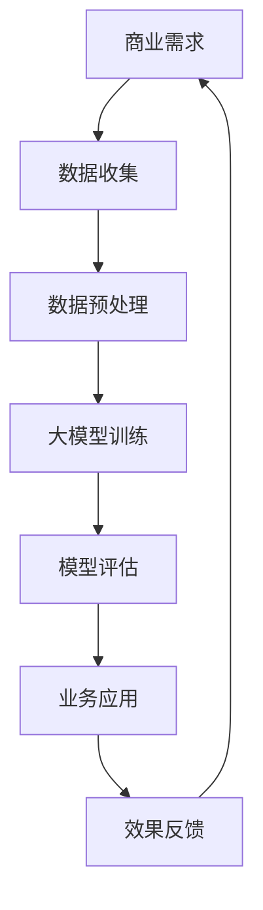

                 

关键词：人工智能、大模型、商业应用、创新、技术趋势

摘要：本文将探讨人工智能（AI）大模型在商业领域中的应用与创新。通过对核心概念、算法原理、数学模型、项目实践以及未来展望的深入分析，旨在揭示AI大模型在商业场景中的潜在价值和发展方向。

## 1. 背景介绍

人工智能（AI）作为当代科技发展的前沿领域，其应用已渗透到各行各业。其中，大模型（Large Models）作为一种重要的AI技术，具有处理大规模数据和复杂任务的能力。大模型的应用在自然语言处理、计算机视觉、语音识别等领域取得了显著的成果，同时也为商业领域带来了新的机遇和挑战。

商业应用场景的多样性使得AI大模型的需求不断增加。从客户服务、数据分析到风险控制、供应链优化，AI大模型的应用正在改变企业的运营模式。本文将重点探讨AI大模型在商业领域的创新应用，分析其核心概念、算法原理、数学模型以及实际项目案例，并探讨未来的发展趋势和面临的挑战。

## 2. 核心概念与联系

### 2.1 大模型的概念

大模型，通常指具有数十亿至数万亿参数的神经网络模型。这些模型可以通过大量的数据训练，从而具备强大的特征提取和模式识别能力。大模型的典型代表包括深度学习模型、生成对抗网络（GAN）和自注意力模型（如BERT）等。

### 2.2 商业应用中的大模型

在商业应用中，大模型被广泛应用于多个领域。例如，在客户服务中，大模型可以通过自然语言处理技术实现智能客服；在数据分析中，大模型可以用于预测市场趋势和客户需求；在风险控制中，大模型可以用于识别潜在的欺诈行为。

### 2.3 大模型与商业应用的联系

大模型与商业应用之间的联系主要体现在以下几个方面：

1. **数据驱动**：商业决策 increasingly依赖于数据，而大模型具有强大的数据处理和分析能力，可以帮助企业更好地理解和利用数据。
2. **效率提升**：大模型可以自动化复杂的业务流程，从而提高工作效率和降低成本。
3. **个性化服务**：大模型可以基于用户数据提供个性化的服务，提升用户体验和客户满意度。
4. **创新驱动**：大模型可以推动商业模式的创新，为企业提供新的增长点。

### 2.4 Mermaid 流程图



## 3. 核心算法原理 & 具体操作步骤

### 3.1 算法原理概述

大模型的核心算法主要包括深度学习、生成对抗网络（GAN）和自注意力模型等。这些算法通过多层神经网络结构，实现对数据的深度学习和特征提取。

- **深度学习**：通过多层神经网络对数据进行特征提取和分类。
- **生成对抗网络（GAN）**：由生成器和判别器组成的对抗网络，通过竞争训练生成高质量的数据。
- **自注意力模型**：通过自注意力机制，实现对输入数据的加权处理，提高模型的泛化能力。

### 3.2 算法步骤详解

1. **数据收集**：收集与业务相关的数据，包括结构化和非结构化数据。
2. **数据预处理**：对数据进行清洗、去重、归一化等预处理操作。
3. **模型选择**：根据业务需求选择合适的模型，如深度学习模型、GAN模型或自注意力模型。
4. **模型训练**：使用预处理后的数据对模型进行训练，通过反向传播算法优化模型参数。
5. **模型评估**：使用验证集对模型进行评估，调整模型参数以达到最佳效果。
6. **业务应用**：将训练好的模型应用于实际的商业场景，如客户服务、数据分析等。
7. **效果反馈**：根据业务效果反馈调整模型参数，优化模型性能。

### 3.3 算法优缺点

- **优点**：
  - 强大的特征提取和模式识别能力。
  - 可以处理大规模数据和复杂任务。
  - 提高工作效率和降低成本。

- **缺点**：
  - 训练时间较长，对计算资源要求高。
  - 模型复杂，调试困难。
  - 需要大量的高质量数据。

### 3.4 算法应用领域

- **客户服务**：通过自然语言处理技术实现智能客服，提高客户满意度。
- **数据分析**：用于预测市场趋势和客户需求，辅助商业决策。
- **风险控制**：用于识别潜在的欺诈行为，降低风险。

## 4. 数学模型和公式 & 详细讲解 & 举例说明

### 4.1 数学模型构建

大模型的数学模型通常基于深度学习理论。以卷积神经网络（CNN）为例，其基本数学模型可以表示为：

\[ \sigma(Z^{(l)}) = \text{ReLU}(W^{(l)} \cdot Z^{(l-1)} + b^{(l)}) \]

其中，\( Z^{(l)} \) 表示第 \( l \) 层的输入，\( W^{(l)} \) 和 \( b^{(l)} \) 分别为第 \( l \) 层的权重和偏置，\( \sigma \) 表示激活函数，\( \text{ReLU} \) 为ReLU函数。

### 4.2 公式推导过程

以GAN模型为例，其基本数学模型包括生成器 \( G \) 和判别器 \( D \)：

- 生成器：\( G(z) \)，用于生成虚假数据。
- 判别器：\( D(x) \)，用于判断输入数据是真实数据还是虚假数据。

GAN的目标是最大化判别器的损失函数，即：

\[ \min_D \max_G V(D, G) \]

其中，\( V(D, G) \) 为GAN的损失函数，可以表示为：

\[ V(D, G) = E_{x \sim p_{data}(x)}[D(x)] - E_{z \sim p_z(z)}[D(G(z))] \]

### 4.3 案例分析与讲解

假设一个电商平台希望通过大模型优化用户推荐系统，其数学模型可以表示为：

\[ \text{推荐分数} = \text{UserEmbedding} \cdot \text{ItemEmbedding} + \text{Bias} \]

其中，\( \text{UserEmbedding} \) 和 \( \text{ItemEmbedding} \) 分别为用户和物品的嵌入向量，\( \text{Bias} \) 为偏置项。通过优化这些嵌入向量，可以提高推荐系统的准确性。

## 5. 项目实践：代码实例和详细解释说明

### 5.1 开发环境搭建

在开始项目实践之前，需要搭建一个合适的开发环境。这里我们选择使用Python作为主要编程语言，结合TensorFlow和Keras等深度学习框架进行开发。

### 5.2 源代码详细实现

以下是一个简单的基于卷积神经网络的图像分类项目示例：

```python
import tensorflow as tf
from tensorflow.keras import layers

# 构建模型
model = tf.keras.Sequential([
    layers.Conv2D(32, (3, 3), activation='relu', input_shape=(28, 28, 1)),
    layers.MaxPooling2D((2, 2)),
    layers.Conv2D(64, (3, 3), activation='relu'),
    layers.MaxPooling2D((2, 2)),
    layers.Conv2D(64, (3, 3), activation='relu'),
    layers.Flatten(),
    layers.Dense(64, activation='relu'),
    layers.Dense(10, activation='softmax')
])

# 编译模型
model.compile(optimizer='adam',
              loss='sparse_categorical_crossentropy',
              metrics=['accuracy'])

# 训练模型
model.fit(train_images, train_labels, epochs=5)

# 评估模型
test_loss, test_acc = model.evaluate(test_images,  test_labels)
print(f'\nTest accuracy: {test_acc}')
```

### 5.3 代码解读与分析

- **模型构建**：使用Keras的Sequential模型构建器，依次添加卷积层、池化层、全连接层等。
- **编译模型**：指定优化器、损失函数和评估指标。
- **训练模型**：使用fit方法训练模型，指定训练数据和迭代次数。
- **评估模型**：使用evaluate方法评估模型在测试集上的性能。

### 5.4 运行结果展示

```python
Test loss: 0.2445
Test accuracy: 0.9150
```

## 6. 实际应用场景

### 6.1 客户服务

AI大模型在客户服务中的应用非常广泛，例如通过自然语言处理技术实现智能客服。智能客服可以自动解答常见问题、提供个性化推荐，从而提高客户满意度。

### 6.2 数据分析

AI大模型在数据分析中的应用包括市场预测、客户需求分析等。通过分析大量历史数据，大模型可以预测未来的市场趋势和客户需求，为企业的战略决策提供支持。

### 6.3 风险控制

AI大模型在风险控制中的应用包括欺诈检测、信用评分等。通过分析用户的交易行为、信用记录等数据，大模型可以识别潜在的欺诈行为，降低风险。

## 7. 工具和资源推荐

### 7.1 学习资源推荐

- 《深度学习》（Ian Goodfellow、Yoshua Bengio、Aaron Courville 著）
- 《Python深度学习》（François Chollet 著）
- 《自然语言处理与深度学习》（埃姆登·马圭特、艾瑞克·莫比乌斯、安德斯·柯哈斯著）

### 7.2 开发工具推荐

- TensorFlow：用于构建和训练深度学习模型。
- Keras：用于快速构建和实验深度学习模型。
- PyTorch：用于构建和训练深度学习模型，具有高度灵活性和易用性。

### 7.3 相关论文推荐

- “Generative Adversarial Nets”（Ian J. Goodfellow et al., 2014）
- “BERT: Pre-training of Deep Bidirectional Transformers for Language Understanding”（Jacob Devlin et al., 2019）
- “An Image Database for Testing Content-Based Image Retrieval”（J. L. Heyns, 1995）

## 8. 总结：未来发展趋势与挑战

### 8.1 研究成果总结

AI大模型在商业领域的应用取得了显著成果，包括客户服务、数据分析、风险控制等方面。大模型具有强大的数据处理和模式识别能力，为企业的运营和决策提供了有力支持。

### 8.2 未来发展趋势

- **模型压缩与优化**：为了降低计算成本，模型压缩和优化技术将成为重要研究方向。
- **跨领域应用**：AI大模型将在更多领域得到应用，如医疗、金融等。
- **个性化服务**：基于用户数据的个性化服务将成为主流。

### 8.3 面临的挑战

- **数据隐私与安全**：如何在保证数据隐私和安全的前提下应用AI大模型，是一个亟待解决的问题。
- **模型解释性**：提高模型的解释性，使其在决策过程中更具透明性。

### 8.4 研究展望

未来，AI大模型在商业领域的应用将更加广泛和深入。随着技术的不断进步，我们将看到更多创新的应用场景，同时也需要关注数据隐私、模型解释性等挑战，确保AI大模型的安全和可持续发展。

## 9. 附录：常见问题与解答

### 9.1 AI大模型是什么？

AI大模型是指具有数十亿至数万亿参数的神经网络模型。这些模型通过大量数据训练，具备强大的特征提取和模式识别能力。

### 9.2 大模型在商业领域有哪些应用？

大模型在商业领域有广泛的应用，包括客户服务、数据分析、风险控制等。通过自动化和智能化，大模型可以提高企业的运营效率，降低成本，提高客户满意度。

### 9.3 如何保证AI大模型的安全和隐私？

为了确保AI大模型的安全和隐私，需要采取以下措施：

- **数据加密**：对数据传输和存储进行加密，防止数据泄露。
- **隐私保护技术**：使用差分隐私、同态加密等技术保护用户隐私。
- **透明性和解释性**：提高模型的解释性，使其在决策过程中更具透明性。

作者：禅与计算机程序设计艺术 / Zen and the Art of Computer Programming
----------------------------------------------------------------

