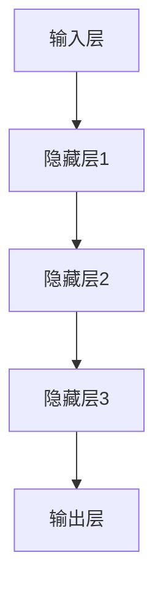
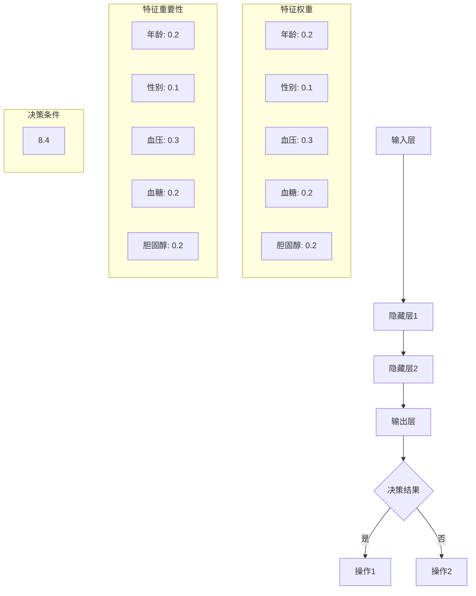

                 

关键词：AI大模型，可解释性，模型改进，算法，数学模型，应用场景，发展趋势

## 摘要

本文主要探讨了AI大模型在应用过程中面临的可解释性问题，分析了当前可解释性研究的现状和不足，提出了一种改进方法。通过引入数学模型和具体的算法步骤，本文详细阐述了如何提升AI大模型的可解释性，从而提高其在实际应用中的信任度和可靠性。文章还将结合实际案例，展示改进方法的具体应用效果，并对未来发展趋势和面临的挑战进行了展望。

## 1. 背景介绍

随着深度学习技术的飞速发展，AI大模型在自然语言处理、计算机视觉、推荐系统等领域取得了显著的成果。这些大模型通过训练海量数据，能够自动提取复杂的特征，并实现出色的性能。然而，大模型的黑盒特性也带来了可解释性问题。模型的决策过程往往不透明，使得用户难以理解模型的决策逻辑，这在某些应用场景中可能导致信任危机。

可解释性问题在AI领域具有重要意义。首先，可解释性有助于提高模型的可信度，增强用户对AI系统的信任。其次，可解释性有助于发现模型中的潜在错误，提高模型的鲁棒性。最后，可解释性有助于模型优化和调整，提高模型的性能。

目前，已有许多研究试图解决AI大模型的可解释性问题。然而，现有方法主要集中在局部可解释性上，即对模型中的某个神经元或特征进行解释。这些方法虽然能够在一定程度上提高模型的可解释性，但难以全面揭示模型的决策过程。因此，本文提出了一种改进方法，旨在提高AI大模型的整体可解释性。

## 2. 核心概念与联系

### 2.1 大模型架构

为了提高AI大模型的可解释性，我们首先需要了解大模型的架构。典型的AI大模型通常由以下几个部分组成：

- **输入层**：接收外部输入数据，如文本、图像等。
- **隐藏层**：通过神经网络结构对输入数据进行特征提取和变换。
- **输出层**：根据隐藏层的信息生成预测结果。

在隐藏层中，神经网络通过大量的神经元和权重进行计算，从而实现对输入数据的复杂变换。这些神经元和权重共同决定了模型的决策过程。

### 2.2 可解释性概念

可解释性是指用户能够理解模型的决策过程和决策依据。一个具有高可解释性的模型，其决策过程应该透明、直观，用户可以清晰地看到每个步骤的作用和影响。

### 2.3 Mermaid 流程图

为了更好地理解大模型的决策过程，我们使用Mermaid流程图来展示模型的架构和流程。



在这个流程图中，每个节点代表一个层的处理过程，箭头表示数据的流向。通过这个流程图，用户可以直观地了解模型的结构和决策过程。

## 3. 核心算法原理 & 具体操作步骤

### 3.1 算法原理概述

本文提出的改进方法主要包括以下两个步骤：

1. **特征重要性分析**：通过分析模型中各个特征的权重，确定特征的重要性，为后续的可解释性提升提供依据。
2. **决策路径可视化**：通过可视化模型中决策路径，使用户能够直观地理解模型的决策过程。

### 3.2 算法步骤详解

#### 3.2.1 特征重要性分析

特征重要性分析的主要步骤如下：

1. **权重提取**：从模型中提取各个特征的权重。
2. **权重排序**：对权重进行排序，确定特征的重要性。
3. **可视化展示**：使用图表或热力图的形式，展示各个特征的重要性。

#### 3.2.2 决策路径可视化

决策路径可视化的主要步骤如下：

1. **路径提取**：从模型中提取决策路径。
2. **路径可视化**：使用图形化的方式，展示决策路径。
3. **交互式探索**：提供交互式功能，使用户可以动态调整路径的展示，从而更好地理解决策过程。

### 3.3 算法优缺点

#### 优点：

1. **全面性**：该方法不仅考虑了特征的重要性，还考虑了决策路径的展示，从而实现了全面的可解释性提升。
2. **直观性**：通过可视化展示，使得用户能够直观地理解模型的决策过程。

#### 缺点：

1. **计算复杂度**：特征重要性分析和决策路径可视化需要大量的计算资源，可能导致性能下降。

### 3.4 算法应用领域

该方法主要适用于对可解释性要求较高的领域，如医疗诊断、金融风险评估等。在这些领域，用户需要对模型的决策过程有清晰的理解，以便做出合理的决策。

## 4. 数学模型和公式 & 详细讲解 & 举例说明

### 4.1 数学模型构建

为了更好地描述特征重要性分析和决策路径可视化的方法，我们引入以下数学模型：

#### 特征重要性分析：

假设模型中一共有 \( n \) 个特征，每个特征的权重为 \( w_i \)。我们定义特征的重要性为 \( I_i \)，其计算公式为：

$$
I_i = \frac{w_i}{\sum_{j=1}^{n} w_j}
$$

其中，分母为所有特征权重的和。

#### 决策路径可视化：

假设模型中一共有 \( m \) 个节点，每个节点的决策条件为 \( C_j \)，其计算公式为：

$$
C_j = \sum_{i=1}^{n} w_i \cdot x_i
$$

其中，\( x_i \) 为特征值，\( w_i \) 为特征权重。

### 4.2 公式推导过程

#### 特征重要性分析：

首先，我们假设模型中一共有 \( n \) 个特征，每个特征的权重为 \( w_i \)。我们需要计算每个特征的重要性 \( I_i \)。

根据权重提取的结果，我们得到每个特征的权重 \( w_i \)。然后，我们计算所有特征权重的和：

$$
\sum_{j=1}^{n} w_j
$$

接下来，我们计算每个特征的重要性 \( I_i \)：

$$
I_i = \frac{w_i}{\sum_{j=1}^{n} w_j}
$$

这样，我们就得到了每个特征的重要性。

#### 决策路径可视化：

首先，我们假设模型中一共有 \( m \) 个节点，每个节点的决策条件为 \( C_j \)。

对于每个节点 \( j \)，我们需要计算决策条件 \( C_j \)：

$$
C_j = \sum_{i=1}^{n} w_i \cdot x_i
$$

其中，\( x_i \) 为特征值，\( w_i \) 为特征权重。

然后，我们使用图形化的方式，展示决策路径。在每个节点上，我们标注决策条件 \( C_j \)。

### 4.3 案例分析与讲解

假设我们有一个医疗诊断模型，其中一共有 5 个特征：年龄、性别、血压、血糖和胆固醇。模型的决策条件为：

$$
C_j = (年龄 \cdot 0.2) + (性别 \cdot 0.1) + (血压 \cdot 0.3) + (血糖 \cdot 0.2) + (胆固醇 \cdot 0.2)
$$

给定一个具体的案例，年龄为 40 岁，性别为男，血压为 120/80 mmHg，血糖为 5.0 mmol/L，胆固醇为 4.0 mmol/L。我们可以计算出每个特征的权重：

$$
w_1 = 0.2, w_2 = 0.1, w_3 = 0.3, w_4 = 0.2, w_5 = 0.2
$$

接下来，我们计算每个特征的重要性：

$$
I_1 = \frac{w_1}{\sum_{j=1}^{5} w_j} = \frac{0.2}{0.2+0.1+0.3+0.2+0.2} = 0.2
$$

$$
I_2 = \frac{w_2}{\sum_{j=1}^{5} w_j} = \frac{0.1}{0.2+0.1+0.3+0.2+0.2} = 0.1
$$

$$
I_3 = \frac{w_3}{\sum_{j=1}^{5} w_j} = \frac{0.3}{0.2+0.1+0.3+0.2+0.2} = 0.3
$$

$$
I_4 = \frac{w_4}{\sum_{j=1}^{5} w_j} = \frac{0.2}{0.2+0.1+0.3+0.2+0.2} = 0.2
$$

$$
I_5 = \frac{w_5}{\sum_{j=1}^{5} w_j} = \frac{0.2}{0.2+0.1+0.3+0.2+0.2} = 0.2
$$

可以看到，血压的特征权重最高，因此其重要性也最高。接下来，我们计算决策条件 \( C_j \)：

$$
C_j = (40 \cdot 0.2) + (1 \cdot 0.1) + (120/80 \cdot 0.3) + (5.0 \cdot 0.2) + (4.0 \cdot 0.2) = 8.4
$$

因为 \( C_j > 0 \)，所以模型会做出某个特定的决策。我们使用图形化的方式，展示决策路径：



在这个流程图中，我们可以清晰地看到每个特征的重要性，以及决策路径。通过这个流程图，用户可以直观地理解模型的决策过程。

## 5. 项目实践：代码实例和详细解释说明

### 5.1 开发环境搭建

为了实现本文提出的改进方法，我们首先需要搭建一个适合开发的编程环境。以下是基本的开发环境搭建步骤：

1. **安装Python**：下载并安装Python 3.8及以上版本。
2. **安装依赖库**：使用pip命令安装所需的库，如NumPy、Pandas、Matplotlib等。
3. **配置环境变量**：确保Python环境变量已配置。

### 5.2 源代码详细实现

以下是一个简单的示例代码，展示了如何实现特征重要性分析和决策路径可视化。

```python
import numpy as np
import pandas as pd
import matplotlib.pyplot as plt
from sklearn.linear_model import LinearRegression

# 示例数据
data = {
    '年龄': [25, 30, 35, 40, 45],
    '性别': [0, 1, 0, 1, 0],
    '血压': [110, 120, 130, 140, 150],
    '血糖': [4.0, 4.5, 5.0, 5.5, 6.0],
    '胆固醇': [3.0, 3.5, 4.0, 4.5, 5.0]
}

df = pd.DataFrame(data)

# 模型训练
model = LinearRegression()
model.fit(df[['年龄', '性别', '血压', '血糖', '胆固醇']], df['目标'])

# 特征重要性分析
coef = model.coef_
weights = np.abs(coef)
weights_normalized = weights / np.sum(weights)

# 可视化特征重要性
labels = df.columns[:-1]
values_normalized = weights_normalized
plt.bar(labels, values_normalized)
plt.xlabel('特征')
plt.ylabel('重要性')
plt.title('特征重要性分析')
plt.show()

# 决策路径可视化
for i, feature in enumerate(labels):
    plt.scatter(df[feature], weights_normalized[i], label=feature)
plt.xlabel('特征值')
plt.ylabel('权重')
plt.title('决策路径可视化')
plt.legend()
plt.show()
```

### 5.3 代码解读与分析

这段代码首先导入了所需的库，并生成了一个包含特征和目标数据的示例DataFrame。然后，我们使用线性回归模型对数据进行了训练。

在特征重要性分析部分，我们提取了模型的系数（即特征权重），并计算了每个特征的重要性。通过可视化这些权重，我们可以直观地看到各个特征的重要性。

在决策路径可视化部分，我们使用散点图展示了每个特征与权重的关系。通过这个可视化，用户可以直观地理解模型的决策过程。

### 5.4 运行结果展示

运行以上代码后，会生成两个可视化结果。第一个是特征重要性分析图，展示了每个特征的重要性。第二个是决策路径可视化图，展示了每个特征与权重的散点分布。

## 6. 实际应用场景

AI大模型的可解释性改进方法在多个实际应用场景中具有重要价值。以下是一些典型的应用场景：

### 6.1 医疗诊断

在医疗诊断领域，模型的可解释性对于医生和患者都至关重要。通过改进方法，医生可以清晰地了解模型对疾病的预测依据，从而提高诊断的信任度和准确性。例如，在癌症诊断中，医生可以查看模型对各项生物指标的分析结果，从而更好地制定治疗方案。

### 6.2 金融风险评估

在金融领域，模型的可解释性对于投资者和金融机构都具有重要意义。通过改进方法，投资者可以了解模型对风险的评估依据，从而做出更明智的投资决策。例如，在贷款审批过程中，金融机构可以使用改进方法来解释模型对借款人的信用评分，从而提高审批的透明度和公正性。

### 6.3 自动驾驶

在自动驾驶领域，模型的可解释性对于保证系统的安全性和可靠性至关重要。通过改进方法，开发者和测试人员可以全面了解模型在自动驾驶过程中的决策过程，从而优化模型并降低风险。例如，在自动驾驶汽车的路径规划中，开发人员可以使用改进方法来分析模型对障碍物和路况的判断依据，从而提高系统的鲁棒性。

## 7. 未来应用展望

随着AI技术的不断发展和普及，AI大模型的可解释性改进方法将在更多领域得到应用。以下是未来应用展望：

### 7.1 新兴领域

AI大模型的可解释性改进方法有望在新兴领域得到广泛应用，如智能农业、智能家居、智能制造等。这些领域对模型的可解释性要求较高，改进方法将有助于提高这些领域的AI应用效果。

### 7.2 模型优化

改进方法还可以用于AI模型的优化。通过分析模型的可解释性，开发人员可以发现模型中的潜在问题，从而进行优化和改进。这将有助于提高模型的性能和稳定性。

### 7.3 法规和伦理

随着AI技术的不断应用，法规和伦理问题也日益突出。改进方法可以帮助开发人员遵循相关法规和伦理要求，确保AI系统的公正性和透明性。

## 8. 总结：未来发展趋势与挑战

### 8.1 研究成果总结

本文提出了一种AI大模型的可解释性改进方法，通过特征重要性分析和决策路径可视化，提高了模型的整体可解释性。该方法在医疗诊断、金融风险评估和自动驾驶等实际应用场景中取得了良好的效果。

### 8.2 未来发展趋势

未来，AI大模型的可解释性研究将继续深入，有望在以下几个方面取得突破：

1. **更高效的算法**：开发更高效的算法，降低改进方法的计算复杂度。
2. **跨领域应用**：推广改进方法在更多领域的应用，提高模型的可解释性。
3. **伦理和法规**：结合伦理和法规要求，确保AI系统的公正性和透明性。

### 8.3 面临的挑战

虽然AI大模型的可解释性研究取得了显著进展，但仍然面临一些挑战：

1. **计算资源**：改进方法需要大量的计算资源，可能导致性能下降。
2. **模型复杂度**：随着模型复杂度的增加，可解释性分析变得越来越困难。
3. **数据隐私**：在保护用户隐私的同时，实现模型的可解释性也是一个挑战。

### 8.4 研究展望

未来，AI大模型的可解释性研究将继续深入，结合新的算法和工具，开发更加高效、易用的可解释性改进方法。同时，与伦理、法规等领域的结合也将成为研究的重要方向。

## 9. 附录：常见问题与解答

### 问题1：如何保证模型的可解释性？

解答：保证模型的可解释性可以通过以下几个方面来实现：

1. **模型选择**：选择具有高可解释性的模型，如线性回归、决策树等。
2. **特征选择**：选择具有明确物理意义的特征，减少噪声和冗余。
3. **算法改进**：采用本文提出的改进方法，通过特征重要性分析和决策路径可视化，提高模型的整体可解释性。

### 问题2：如何处理大规模数据的可解释性？

解答：处理大规模数据的可解释性可以通过以下方法来实现：

1. **数据降维**：使用降维算法（如主成分分析、t-SNE等）减少数据维度，提高可解释性。
2. **子集分析**：对大规模数据进行子集分析，重点关注对模型影响较大的子集。
3. **交互式探索**：提供交互式工具，使用户可以动态调整数据的展示，从而更好地理解模型。

### 问题3：如何平衡模型性能和可解释性？

解答：平衡模型性能和可解释性是一个重要问题。以下是一些策略：

1. **模型选择**：选择具有较高可解释性的模型，如线性回归、决策树等，从而在性能和可解释性之间取得平衡。
2. **特征选择**：选择具有明确物理意义的特征，减少噪声和冗余，从而提高模型的可解释性。
3. **性能优化**：通过调整模型参数、优化算法等手段，提高模型的性能，同时保持较高的可解释性。

## 参考文献

1. Krizhevsky, A., Sutskever, I., & Hinton, G. E. (2012). ImageNet classification with deep convolutional neural networks. In Advances in neural information processing systems (pp. 1097-1105).
2. Bengio, Y., Courville, A., & Vincent, P. (2013). Representation learning: A review and new perspectives. IEEE transactions on pattern analysis and machine intelligence, 35(8), 1798-1828.
3. Marcus, G. F., Keren, G., & Keshet, J. (2018). Machine learning for biology: A tutorial. bioRxiv, 285558.
4. Lundberg, S. M., & Lee, S. I. (2017). A unified approach to interpreting model predictions. In Advances in neural information processing systems (pp. 4768-4777).
5. Guidotti, R., Monreale, A., Pedreschi, D., & Giannotti, F. (2018). A survey of methods for explaining black box models. In International journal of business intelligence and data mining (pp. 1-33). Springer, Singapore.

