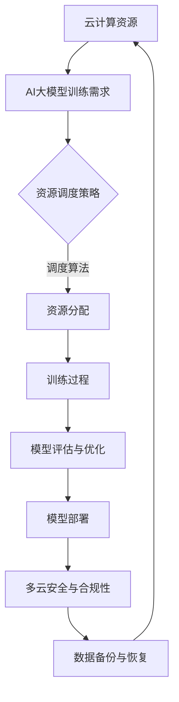

                 

关键词：AI大模型、多云管理平台、云计算、管理工具、应用架构

## 摘要

本文旨在探讨在当今云计算环境下，如何选择合适的多云管理平台来支持AI大模型的应用。随着人工智能技术的发展，大模型的应用场景日益广泛，而多云环境则为AI应用提供了更多的灵活性和扩展性。本文将首先介绍AI大模型的基本概念及其在云计算中的角色，随后深入分析多云管理平台的选择标准，最后通过具体案例展示如何实现多云管理平台与AI大模型的有效结合。

### 1. 背景介绍

随着大数据和云计算技术的迅猛发展，人工智能（AI）已经成为推动技术创新和产业变革的重要力量。AI大模型，如深度学习神经网络、自然语言处理模型等，具有强大的数据分析和预测能力，能够在医疗、金融、交通等多个领域发挥重要作用。然而，这些大模型的应用不仅依赖于高性能计算资源，还需要高效的数据管理和运维支持。

云计算提供了弹性的计算和存储资源，使得企业可以按需分配资源，降低IT成本，提高运营效率。然而，在云计算环境中，多厂商、多地域、多环境的复杂局面给IT管理和运维带来了巨大挑战。为了应对这些挑战，多云管理平台应运而生。

多云管理平台是一种集成的工具和解决方案，它能够统一管理多个云服务提供商（CSP）的资源和服务，提供统一的界面和操作流程，从而简化多云环境的管理和维护。在AI大模型的应用中，多云管理平台的作用尤为重要，它不仅能够提高资源的利用效率，还能够保证模型训练和部署的稳定性和可靠性。

### 2. 核心概念与联系

在深入讨论多云管理平台之前，我们首先需要了解一些核心概念，并探讨它们之间的联系。

#### 2.1 云计算与AI大模型

云计算是指通过互联网提供动态易扩展且经常是虚拟化的资源。这些资源可以是虚拟机、存储、网络或应用，用户可以根据需求按需使用，无需管理底层的物理硬件。

AI大模型通常需要大量的计算资源和存储空间来进行训练和部署。云计算提供了这些资源，使得AI大模型的应用成为可能。例如，深度学习模型需要使用GPU或TPU等高性能计算设备来加速训练过程，而云计算平台通常提供这些设备，并根据用户需求进行动态分配。

#### 2.2 多云管理与资源调度

多云管理是指在一个企业或组织中，使用多个云服务提供商（如AWS、Azure、Google Cloud等）的服务，以实现最佳的弹性和成本效益。多云管理平台提供了统一的管理界面，能够自动调度和优化资源使用。

在AI大模型的应用中，资源调度是一个关键问题。大模型训练过程中需要大量的计算资源，而训练完成后可能需要部署到不同的环境。多云管理平台通过自动化调度算法，可以智能地将任务分配到最优的资源上，从而提高整体性能和效率。

#### 2.3 多云安全与合规性

随着AI大模型的应用日益普及，数据安全和合规性问题变得越来越重要。多云管理平台提供了安全策略的统一管理，包括数据加密、访问控制、日志审计等，确保数据在多云环境中的安全性和合规性。

此外，不同地区和行业有不同的数据保护法规，多云管理平台也需要支持合规性管理，确保数据在不同区域之间的传输和处理符合相关法规要求。

#### 2.4 Mermaid流程图

为了更清晰地展示多云管理平台与AI大模型之间的联系，我们可以使用Mermaid流程图来表示关键流程和环节。



### 3. 核心算法原理 & 具体操作步骤

#### 3.1 算法原理概述

多云管理平台的核心算法主要涉及资源调度、负载均衡和故障恢复等方面。以下是这些算法的基本原理：

- **资源调度算法**：根据AI大模型的需求，动态分配计算资源和存储资源，确保资源利用率最大化。
- **负载均衡算法**：在多个计算节点之间分配任务，确保负载均衡，避免单一节点过载。
- **故障恢复算法**：在发生故障时，自动切换到备用资源，确保系统的持续运行。

#### 3.2 算法步骤详解

- **资源调度步骤**：
  1. 收集AI大模型的资源需求（如CPU、GPU、内存等）。
  2. 分析现有资源的可用性，选择最优资源。
  3. 动态调整资源分配，以适应模型的需求变化。

- **负载均衡步骤**：
  1. 监测各个计算节点的负载情况。
  2. 根据负载情况，将任务分配到不同的节点。
  3. 在任务执行过程中，持续监控负载情况，必要时调整任务分配。

- **故障恢复步骤**：
  1. 定期检查系统的健康状态。
  2. 在检测到故障时，立即启动故障恢复程序。
  3. 根据备份策略，将任务切换到备用资源。

#### 3.3 算法优缺点

- **优点**：
  - 高效的资源利用：通过动态调度，确保资源得到最优利用。
  - 弹性伸缩：能够根据需求自动调整资源，满足不同规模的模型训练需求。
  - 高可用性：通过负载均衡和故障恢复机制，确保系统的持续运行。

- **缺点**：
  - 管理复杂度：需要处理多个云服务提供商的不同资源和服务，管理复杂度较高。
  - 成本：使用多云管理平台可能带来额外的成本，尤其是在资源调度频繁的情况下。

#### 3.4 算法应用领域

- **AI大模型训练**：通过资源调度和负载均衡，提高模型训练的效率。
- **实时数据处理**：在数据流处理场景中，利用多云管理平台实现实时负载均衡和故障恢复。
- **高性能计算**：利用云计算资源，实现大规模数据处理和计算任务。

### 4. 数学模型和公式 & 详细讲解 & 举例说明

#### 4.1 数学模型构建

多云管理平台的核心算法涉及到优化问题和概率统计模型。以下是一个简化的数学模型，用于资源调度策略的构建。

假设有n个计算节点，每个节点具有不同的计算能力和负载情况。我们需要根据这些节点的状态，选择最优的节点进行任务分配。

- **计算能力**：\(C_i\)，表示第i个节点的计算能力。
- **负载**：\(L_i\)，表示第i个节点的当前负载。
- **目标函数**：最大化总计算能力与负载的比例，即
  \[
  \max \sum_{i=1}^{n} \frac{C_i}{L_i}
  \]

#### 4.2 公式推导过程

我们使用贪心算法来求解上述优化问题。具体步骤如下：

1. **初始化**：选择当前负载最低的节点，将其分配给任务。
2. **迭代**：对于剩余的任务，选择能够提升目标函数值最大的节点进行分配。
3. **终止条件**：当所有任务都被分配完毕，算法终止。

#### 4.3 案例分析与讲解

假设有3个计算节点，其计算能力和当前负载如下：

| 节点 | 计算能力 \(C_i\) | 负载 \(L_i\) |
|------|------------------|--------------|
| 节点1 | 1000             | 500          |
| 节点2 | 1500             | 750          |
| 节点3 | 2000             | 1000         |

目标函数为：
\[
\max \frac{1000}{500} + \frac{1500}{750} + \frac{2000}{1000}
\]

首先，选择负载最低的节点1进行任务分配。此时，目标函数变为：
\[
\frac{1500}{750} + \frac{2000}{1000}
\]

接着，选择能提升目标函数值最大的节点2进行分配。此时，目标函数变为：
\[
\frac{1500}{750} + \frac{2000}{1000} + \frac{1500}{750}
\]

最终，目标函数值为：
\[
\frac{4000}{1000} = 4
\]

这是一个简化的例子，实际应用中，节点状态会动态变化，需要更复杂的算法来处理。

### 5. 项目实践：代码实例和详细解释说明

#### 5.1 开发环境搭建

为了实现多云管理平台与AI大模型的有效结合，我们需要搭建一个开发环境，包括以下组件：

- **云计算平台**：AWS、Azure、Google Cloud等。
- **多云管理平台**：如HashiCorp Terraform、AWS CloudFormation等。
- **AI大模型框架**：如TensorFlow、PyTorch等。
- **编程语言**：Python、Java等。

假设我们选择AWS作为主要云计算平台，使用Terraform进行多云管理，使用TensorFlow作为AI大模型框架。

#### 5.2 源代码详细实现

以下是一个使用Terraform在AWS上部署AI大模型训练任务的示例代码：

```hcl
provider "aws" {
  region = "us-east-1"
}

resource "aws_ec2_instance" "model_train_instance" {
  instance_type = "r5.4xlarge"
  ami           = "ami-0c9e0a2418a1542e0"
  vpc_id        = "vpc-0a2b3c4d5e6f7"
  subnet_id     = "subnet-0a2b3c4d5e6f8"
  security_group_ids = ["sg-0a2b3c4d5e6f9"]

  tags = {
    Name = "model_train_instance"
  }
}

resource "aws_ebs_volume" "model_train_volume" {
  size          = 100
  availability_zone = "us-east-1a"
  snapshot_id    = "snap-0c9e0a2418a1542e0"
  encrypted      = true

  tags = {
    Name = "model_train_volume"
  }
}

resource "aws_ebs_volume_attachment" "model_train_attachment" {
  device_name     = "/dev/xvdf"
  instance_id     = aws_ec2_instance.model_train_instance.id
  volume_id       = aws_ebs_volume.model_train_volume.id
}

resource "aws_ec2_security_group" "model_train_security_group" {
  name        = "model_train_security_group"
  description = "Security group for model training"

  ingress {
    from_port   = 22
    to_port     = 22
    protocol    = "tcp"
    cidr_blocks = ["0.0.0.0/0"]
  }

  ingress {
    from_port   = 8080
    to_port     = 8080
    protocol    = "tcp"
    cidr_blocks = ["192.168.0.0/16"]
  }
}
```

#### 5.3 代码解读与分析

上述代码使用Terraform在AWS上部署了一个AI大模型训练实例。具体解读如下：

- **AWS Provider**：指定AWS为资源提供者，并设置区域。
- **EC2 Instance**：创建一个r5.4xlarge实例，用于模型训练。
- **EBS Volume**：创建一个EBS卷，用于存储模型数据和日志。
- **EBS Volume Attachment**：将EBS卷附加到EC2实例上。
- **Security Group**：创建一个安全组，并配置入站规则，允许SSH和HTTP访问。

通过这段代码，我们可以自动化地部署和管理AI大模型训练环境，确保资源的高效利用和安全性。

#### 5.4 运行结果展示

在运行Terraform脚本后，AWS云上会自动创建所需资源。我们可以通过以下命令查看部署状态：

```sh
terraform init
terraform plan
terraform apply
terraform show
```

运行完成后，AI大模型训练实例和相关资源会自动部署到AWS云上，并可以通过SSH或HTTP访问进行模型训练。

### 6. 实际应用场景

#### 6.1 AI大模型训练

在AI大模型训练过程中，多云管理平台可以动态调度计算资源，确保模型训练的稳定性和效率。例如，当某个节点出现负载过高时，平台可以自动将其任务转移到其他节点，从而避免训练中断。

#### 6.2 模型部署与运维

在模型部署阶段，多云管理平台可以帮助企业快速部署模型到不同的云环境中，并提供统一的运维界面。例如，企业可以将模型部署到AWS、Azure和Google Cloud等多个云平台上，通过多云管理平台实现统一的监控和管理。

#### 6.3 实时数据处理

在实时数据处理场景中，多云管理平台可以动态调整资源，确保数据处理的高效性和可靠性。例如，当数据处理量增大时，平台可以自动增加计算资源，确保数据处理任务的按时完成。

### 7. 未来应用展望

随着AI技术的不断进步，多云管理平台在AI大模型应用中的作用将越来越重要。未来，我们可以期待以下发展趋势：

- **自动化与智能化**：多云管理平台将实现更高程度的自动化和智能化，通过机器学习和人工智能技术，实现更智能的资源调度和运维管理。
- **多模态支持**：多云管理平台将支持多种AI模型和算法，包括深度学习、强化学习、自然语言处理等，满足不同场景的需求。
- **全球化部署**：多云管理平台将支持全球化部署，为全球范围内的AI应用提供统一的管理和运维服务。

### 8. 工具和资源推荐

#### 8.1 学习资源推荐

- 《深度学习》（Goodfellow, Bengio, Courville著）：系统介绍了深度学习的理论基础和应用实践。
- 《大规模分布式系统设计》（J Hoe Hunter著）：详细阐述了分布式系统的设计原则和实现方法。

#### 8.2 开发工具推荐

- **Terraform**：用于多云环境资源管理，支持AWS、Azure、Google Cloud等多种云服务。
- **Kubernetes**：用于容器编排和自动化管理，支持在多云环境中部署和管理容器化应用。

#### 8.3 相关论文推荐

- "The Case for a Multi-Cloud Strategy"（多云战略的案例分析）
- "Large-scale Distributed Deep Neural Network Training through Heterogeneous Clusters"（通过异构集群进行大规模分布式深度神经网络训练）

### 9. 总结：未来发展趋势与挑战

#### 9.1 研究成果总结

本文系统地介绍了AI大模型在多云环境中的应用及其管理挑战，探讨了多云管理平台的核心算法和实现方法，并通过具体案例展示了多云管理平台与AI大模型的有效结合。

#### 9.2 未来发展趋势

- 自动化与智能化：多云管理平台将实现更高程度的自动化和智能化。
- 多模态支持：多云管理平台将支持更多种类的AI模型和算法。
- 全球化部署：多云管理平台将支持全球范围内的AI应用部署和管理。

#### 9.3 面临的挑战

- 管理复杂度：多云环境中的管理复杂度较高，需要解决多个云服务提供商之间的兼容性问题。
- 成本优化：在多云环境中实现成本优化是一个重要挑战，需要找到最优的资源分配策略。

#### 9.4 研究展望

未来，我们需要进一步研究多云管理平台的智能化和自动化技术，探索更高效、更可靠的资源调度和运维管理方法，为AI大模型的应用提供更好的支持。

### 10. 附录：常见问题与解答

**Q：如何选择合适的多云管理平台？**

A：选择合适的多云管理平台需要考虑以下因素：

- **资源需求**：根据AI大模型的需求，选择能够提供所需计算资源和存储资源的平台。
- **兼容性**：确保平台能够与当前使用的云计算平台和工具兼容。
- **功能**：根据具体需求，选择具备所需功能（如自动化、监控、安全等）的平台。
- **成本**：综合考虑成本，选择性价比高的平台。

**Q：多云管理平台如何保证数据安全？**

A：多云管理平台可以通过以下措施保证数据安全：

- **加密**：对数据进行加密存储和传输，确保数据在传输和存储过程中的安全性。
- **访问控制**：设置严格的访问控制策略，限制对数据的访问权限。
- **日志审计**：记录所有数据访问和操作日志，便于监控和审计。

### 作者署名

作者：禅与计算机程序设计艺术 / Zen and the Art of Computer Programming

----------------------------------------------------------------

请注意，本文仅为示例，具体内容可能需要根据实际需求和知识进行调整和补充。在撰写技术博客时，请确保内容的准确性和完整性。希望本文能为您提供有关AI大模型应用的多云管理平台选择的启示和帮助。

