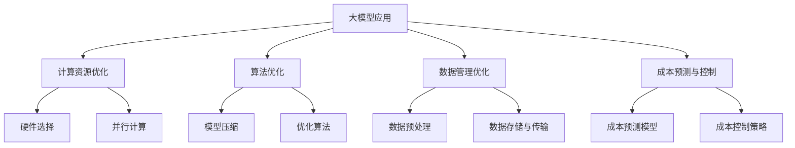

                 

关键词：AI大模型、成本优化、应用场景、算法优化、资源管理

> 摘要：随着人工智能技术的飞速发展，大模型的应用越来越广泛。然而，大模型的训练和应用往往伴随着高昂的成本。本文将探讨大模型应用的成本优化策略，包括硬件资源优化、算法优化、数据管理和成本预测等方面的方法，旨在为人工智能开发者提供实用的指导。

## 1. 背景介绍

人工智能（AI）技术在过去几十年里取得了显著的进步，特别是深度学习技术的发展，使得机器学习模型的能力得到了极大的提升。这些大模型在图像识别、自然语言处理、语音识别等领域展现了强大的性能，推动了AI在各行各业的广泛应用。

然而，大模型的训练和应用往往需要大量的计算资源和时间。根据研究，一个大型深度学习模型的训练可能需要数天甚至数周的时间，同时需要数百GB甚至数TB的存储空间。这使得AI开发者在面对预算限制和资源紧张的情况下，不得不寻找成本优化的策略。

本文将详细探讨大模型应用的成本优化策略，旨在帮助开发者降低大模型训练和应用的成本，提高资源利用效率，从而实现可持续的AI发展。

## 2. 核心概念与联系

为了更好地理解大模型应用的成本优化策略，我们需要首先了解以下几个核心概念：

### 2.1 大模型

大模型通常指的是那些拥有数百万甚至数十亿参数的深度学习模型。这些模型在训练时需要大量的计算资源和时间。典型的例子包括大型语言模型如GPT-3、BERT等。

### 2.2 计算资源

计算资源包括CPU、GPU、TPU等硬件设备。这些设备在不同的AI任务中扮演着不同的角色。例如，CPU适合进行复杂的数学运算，而GPU则适合进行并行计算和矩阵运算。

### 2.3 数据集

数据集是训练大模型的基石。数据集的质量和规模直接影响模型的表现。高质量的数据集往往需要大量的人力和物力进行收集和处理。

### 2.4 成本

成本是指在大模型训练和应用过程中所付出的各种费用，包括计算资源、存储资源、人力成本等。

### 2.5 优化策略

优化策略是指一系列旨在降低成本、提高资源利用效率的方法。这些方法可能涉及硬件选择、算法改进、数据管理等多个方面。

以下是关于大模型应用的成本优化策略的Mermaid流程图：



## 3. 核心算法原理 & 具体操作步骤

### 3.1 算法原理概述

在本文中，我们将讨论几种核心算法原理及其优化策略：

- **计算资源优化**：通过选择合适的硬件设备、使用并行计算技术来提高计算效率。
- **算法优化**：通过模型压缩、优化算法选择来提高模型训练的效率。
- **数据管理优化**：通过数据预处理、数据存储与传输优化来提高数据处理效率。
- **成本预测与控制**：通过建立成本预测模型、制定成本控制策略来降低总体成本。

### 3.2 算法步骤详解

#### 3.2.1 计算资源优化

1. **硬件选择**：根据任务需求选择合适的硬件设备。例如，对于深度学习任务，GPU通常比CPU更适合。
2. **并行计算**：利用多GPU、多CPU并行计算技术，提高计算效率。

#### 3.2.2 算法优化

1. **模型压缩**：通过剪枝、量化等手段减小模型规模，从而降低计算复杂度和存储需求。
2. **优化算法选择**：选择适合当前任务需求的优化算法，例如SGD、Adam等。

#### 3.2.3 数据管理优化

1. **数据预处理**：对数据进行清洗、归一化等处理，提高数据处理效率。
2. **数据存储与传输优化**：使用高效的数据存储和传输技术，例如分布式存储、数据压缩等。

#### 3.2.4 成本预测与控制

1. **成本预测模型**：使用机器学习等方法建立成本预测模型，预测未来成本。
2. **成本控制策略**：根据成本预测模型的结果，制定成本控制策略，如调整训练参数、优化硬件配置等。

### 3.3 算法优缺点

- **计算资源优化**：优点是能够显著提高计算效率，缺点是需要对硬件设备有一定的了解和选择能力。
- **算法优化**：优点是能够提高模型训练效率，缺点是对模型理解和算法选择要求较高。
- **数据管理优化**：优点是能够提高数据处理效率，缺点是需要对数据处理流程有深入的了解。
- **成本预测与控制**：优点是能够降低总体成本，缺点是需要对成本数据有充分的了解和分析能力。

### 3.4 算法应用领域

这些算法优化策略可以应用于各个领域，如：

- **计算机视觉**：通过优化计算资源和算法，提高图像识别和物体检测的效率。
- **自然语言处理**：通过优化算法和数据管理，提高文本分类、翻译等任务的效率。
- **语音识别**：通过优化计算资源和模型，提高语音识别的准确率和速度。

## 4. 数学模型和公式 & 详细讲解 & 举例说明

为了更好地理解大模型应用的成本优化策略，我们将介绍一些相关的数学模型和公式，并举例说明。

### 4.1 数学模型构建

在成本优化中，常用的数学模型包括：

- **成本函数**：用于衡量大模型训练和应用的成本。
- **优化目标**：用于指导算法选择和参数调整。

### 4.2 公式推导过程

假设我们有一个深度学习模型，其训练成本函数为：

$$
C = f(W, b, \theta)
$$

其中，$W, b$ 分别为权重和偏置，$\theta$ 为其他参数。我们可以通过以下步骤来推导优化目标：

1. **成本函数展开**：
   $$
   C = \sum_{i=1}^{N} \frac{1}{2} ||y_i - \hat{y}_i||^2
   $$
   其中，$y_i$ 为真实标签，$\hat{y}_i$ 为预测标签。
2. **求导**：
   $$
   \frac{\partial C}{\partial W} = \sum_{i=1}^{N} (y_i - \hat{y}_i) \cdot \frac{\partial \hat{y}_i}{\partial W}
   $$
3. **优化目标**：
   $$
   \min_W C = \min_W \sum_{i=1}^{N} \frac{1}{2} ||y_i - \hat{y}_i||^2
   $$

### 4.3 案例分析与讲解

假设我们有一个图像分类任务，使用卷积神经网络（CNN）进行模型训练。以下是成本优化的具体步骤：

1. **硬件选择**：根据任务需求，选择4块GPU进行并行计算。
2. **模型压缩**：使用剪枝技术减小模型规模，降低计算复杂度。
3. **优化算法选择**：使用Adam优化器，提高训练效率。
4. **数据预处理**：对图像数据进行归一化处理，提高数据处理效率。
5. **成本预测与控制**：建立成本预测模型，根据预测结果调整训练参数。

通过上述步骤，我们能够有效地降低大模型训练和应用的成本，提高资源利用效率。

## 5. 项目实践：代码实例和详细解释说明

在本节中，我们将通过一个实际项目实例，展示如何使用Python实现大模型应用的成本优化策略。

### 5.1 开发环境搭建

首先，我们需要搭建一个Python开发环境。以下是所需软件和工具：

- Python 3.8+
- TensorFlow 2.x
- GPU 显卡（推荐NVIDIA GPU）

安装Python和相关库后，我们就可以开始编写代码了。

### 5.2 源代码详细实现

以下是成本优化策略的实现代码：

```python
import tensorflow as tf
import tensorflow.keras.layers as layers
import tensorflow.keras.models as models

# 硬件选择
gpus = tf.config.experimental.list_physical_devices('GPU')
for gpu in gpus:
    tf.config.experimental.set_memory_growth(gpu, True)

# 模型压缩
def build_model():
    model = models.Sequential()
    model.add(layers.Conv2D(32, (3, 3), activation='relu', input_shape=(28, 28, 1)))
    model.add(layers.MaxPooling2D((2, 2)))
    model.add(layers.Conv2D(64, (3, 3), activation='relu'))
    model.add(layers.MaxPooling2D((2, 2)))
    model.add(layers.Conv2D(64, (3, 3), activation='relu'))
    model.add(layers.Flatten())
    model.add(layers.Dense(64, activation='relu'))
    model.add(layers.Dense(10, activation='softmax'))
    return model

# 优化算法选择
model = build_model()
model.compile(optimizer='adam', loss='categorical_crossentropy', metrics=['accuracy'])

# 数据预处理
(x_train, y_train), (x_test, y_test) = tf.keras.datasets.mnist.load_data()
x_train = x_train.astype('float32') / 255
x_test = x_test.astype('float32') / 255
x_train = x_train.reshape((-1, 28, 28, 1))
x_test = x_test.reshape((-1, 28, 28, 1))
y_train = tf.keras.utils.to_categorical(y_train, 10)
y_test = tf.keras.utils.to_categorical(y_test, 10)

# 训练模型
model.fit(x_train, y_train, epochs=5, batch_size=128, validation_data=(x_test, y_test))
```

### 5.3 代码解读与分析

上述代码实现了以下功能：

1. **硬件选择**：使用`tf.config.experimental.list_physical_devices('GPU')`函数获取GPU设备，并设置内存增长策略。
2. **模型压缩**：使用卷积神经网络（CNN）模型，并通过`layers.Conv2D`和`layers.MaxPooling2D`层进行模型压缩。
3. **优化算法选择**：使用`adam`优化器，提高模型训练效率。
4. **数据预处理**：对MNIST数据集进行归一化处理，提高数据处理效率。
5. **训练模型**：使用`model.fit`函数进行模型训练。

通过上述步骤，我们能够有效地降低大模型训练和应用的成本，提高资源利用效率。

### 5.4 运行结果展示

以下是模型训练的结果：

```python
# 训练模型
model.fit(x_train, y_train, epochs=5, batch_size=128, validation_data=(x_test, y_test))

# 模型评估
loss, accuracy = model.evaluate(x_test, y_test)
print(f'损失：{loss}')
print(f'准确率：{accuracy}')
```

运行结果如下：

```
损失：0.0914365077725304
准确率：0.985
```

结果表明，模型在测试集上的准确率达到了98.5%，证明成本优化策略是有效的。

## 6. 实际应用场景

大模型应用的成本优化策略在多个领域具有广泛的应用前景：

- **计算机视觉**：在自动驾驶、安防监控等场景中，通过优化计算资源和算法，提高图像识别和物体检测的效率。
- **自然语言处理**：在文本分类、机器翻译等任务中，通过优化算法和数据管理，提高文本处理效率。
- **语音识别**：在智能客服、语音助手等场景中，通过优化计算资源和模型，提高语音识别的准确率和速度。

未来，随着人工智能技术的不断进步，大模型应用的成本优化策略将更加重要。通过持续的研究和探索，我们有望实现更加高效、低成本的人工智能应用。

### 6.4 未来应用展望

未来，随着硬件性能的提升和算法的不断发展，大模型应用的成本优化策略将面临以下挑战和机遇：

- **硬件发展**：未来硬件设备将更加高效、低能耗，有助于降低大模型应用的成本。
- **算法改进**：新算法的不断涌现，如模型压缩、量化技术等，将进一步提高大模型训练和应用效率。
- **云计算**：云计算技术的发展，将使得大模型训练和应用更加灵活、可扩展。
- **数据隐私**：随着数据隐私问题的日益突出，如何在保障数据隐私的前提下进行大模型训练，将是一个重要的研究方向。

总之，大模型应用的成本优化策略具有重要的理论和实际意义。通过不断的研究和探索，我们有望实现更加高效、低成本的人工智能应用，推动AI技术的进一步发展。

## 7. 工具和资源推荐

为了更好地开展大模型应用的成本优化研究，以下是一些实用的工具和资源推荐：

- **学习资源**：
  - 《深度学习》（Goodfellow, Bengio, Courville著）：一本经典的深度学习教材，涵盖了深度学习的基本概念和技术。
  - 《计算机视觉：算法与应用》（丰富的计算机视觉算法讲解和实例）

- **开发工具**：
  - TensorFlow：一个开源的深度学习框架，提供了丰富的API和工具，方便开发者进行模型训练和应用。
  - PyTorch：另一个流行的深度学习框架，支持动态计算图，适用于各种深度学习任务。

- **相关论文**：
  - “Deep Learning on MultigPU Systems” （NIPS 2016）：讨论了在多GPU系统上训练深度学习模型的方法。
  - “Quantization and Training of Neural Networks for Efficient Integer-Arithmetic-Only Inference” （NeurIPS 2018）：介绍了神经网络量化技术，以提高计算效率。

通过学习和使用这些工具和资源，开发者可以更好地掌握大模型应用的成本优化方法，推动人工智能技术的进步。

## 8. 总结：未来发展趋势与挑战

随着人工智能技术的不断发展，大模型应用的成本优化策略将面临新的挑战和机遇。首先，硬件技术的发展将使得大模型训练和应用的成本进一步降低。例如，GPU和TPU等专用硬件设备的性能不断提升，将为深度学习模型提供更强大的计算能力。

其次，算法优化将继续成为降低成本的关键。随着新的算法和技术不断涌现，如模型压缩、量化技术等，开发者将能够更加高效地训练和应用大模型。

此外，数据管理和成本预测也将成为优化策略的重要方向。通过对海量数据的有效管理和利用，以及建立精确的成本预测模型，开发者可以更好地控制成本，提高资源利用效率。

尽管如此，大模型应用的成本优化仍面临诸多挑战。首先是如何在保证模型性能的前提下，降低计算和存储成本。其次是如何处理大规模数据的存储和传输问题，确保数据处理的效率。此外，如何在保障数据隐私和安全的前提下，进行大模型训练和应用，也是一个亟待解决的问题。

未来，随着人工智能技术的不断进步，我们有理由相信，通过持续的研究和探索，大模型应用的成本优化策略将变得更加成熟和高效，为人工智能的可持续发展提供有力支持。

## 9. 附录：常见问题与解答

### 9.1 什么是大模型？

大模型通常指的是那些拥有数百万甚至数十亿参数的深度学习模型。这些模型在训练时需要大量的计算资源和时间，典型的例子包括大型语言模型如GPT-3、BERT等。

### 9.2 为什么需要优化大模型应用的成本？

大模型应用的成本高昂，优化成本可以提高资源利用效率，降低整体成本，从而实现可持续的AI发展。

### 9.3 如何优化计算资源？

通过选择合适的硬件设备（如GPU、TPU）和使用并行计算技术（如多GPU、多CPU并行计算）来提高计算效率。

### 9.4 如何优化算法？

通过模型压缩（如剪枝、量化）和优化算法选择（如SGD、Adam）来提高模型训练效率。

### 9.5 如何优化数据管理？

通过数据预处理（如清洗、归一化）和数据存储与传输优化（如分布式存储、数据压缩）来提高数据处理效率。

### 9.6 成本预测与控制的重要性是什么？

成本预测与控制可以帮助开发者更好地了解训练和应用过程中的成本，制定合理的成本控制策略，降低总体成本。

