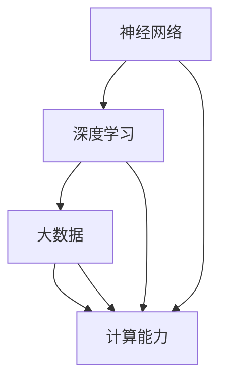

                 

作者：禅与计算机程序设计艺术 / Zen and the Art of Computer Programming

## 关键词

AI大模型，技术标准，参与机制，算法原理，数学模型，应用场景，未来展望。

## 摘要

本文旨在探讨AI大模型应用的技术标准制定参与机制。首先，我们回顾了AI大模型的背景和发展历程，接着详细分析了技术标准制定的核心概念和参与机制。随后，我们介绍了核心算法原理、数学模型和具体操作步骤，并提供了项目实践实例。文章还探讨了AI大模型在实际应用场景中的未来展望，以及面临的挑战和未来研究方向。

## 1. 背景介绍

### AI大模型的背景

AI大模型，即大规模人工智能模型，是近年来人工智能领域的重要突破。随着计算能力的提升和海量数据的积累，AI大模型在图像识别、自然语言处理、语音识别等领域取得了显著进展。例如，GPT-3、BERT、OpenAI等大模型，展现了其在处理复杂任务方面的强大能力。

### AI大模型的发展历程

AI大模型的发展历程可以分为几个阶段：

- **早期阶段**：主要以规则为基础的专家系统，处理能力有限。
- **中间阶段**：基于神经网络的模型开始流行，如卷积神经网络（CNN）和循环神经网络（RNN）。
- **当前阶段**：随着计算能力的提升和大数据的积累，AI大模型达到了前所未有的规模和复杂度。

### AI大模型的应用领域

AI大模型的应用领域非常广泛，包括但不限于：

- **图像识别**：自动驾驶、医疗影像分析等。
- **自然语言处理**：机器翻译、智能助手等。
- **语音识别**：智能语音助手、语音控制等。

## 2. 核心概念与联系

### 核心概念

AI大模型的核心概念包括：

- **神经网络**：模拟人脑神经元连接和作用的计算模型。
- **深度学习**：多层神经网络模型，用于处理复杂任务。
- **大数据**：海量数据的存储、处理和分析。
- **计算能力**：硬件设备和算法效率的综合表现。

### 核心概念联系

AI大模型的发展离不开神经网络、深度学习、大数据和计算能力的紧密结合。神经网络提供了基础的计算框架，深度学习增强了模型的处理能力，大数据提供了丰富的训练数据，而计算能力则确保了模型能够高效地运行。

### Mermaid 流程图



## 3. 核心算法原理 & 具体操作步骤

### 3.1 算法原理概述

AI大模型的核心算法原理主要包括：

- **前向传播**：将输入数据通过多层神经网络传递，逐层计算并产生输出。
- **反向传播**：根据输出误差，反向更新网络权重，优化模型性能。
- **优化算法**：如随机梯度下降（SGD）、Adam等，用于加速模型收敛。

### 3.2 算法步骤详解

AI大模型的具体操作步骤如下：

1. **数据预处理**：包括数据清洗、归一化、数据增强等步骤，确保数据质量。
2. **模型构建**：定义神经网络结构，设置损失函数、优化器等。
3. **训练**：使用训练数据对模型进行训练，通过反向传播更新模型参数。
4. **验证与测试**：使用验证集和测试集评估模型性能，调整模型参数。
5. **部署与应用**：将训练好的模型部署到实际应用场景中。

### 3.3 算法优缺点

**优点**：

- **强大的处理能力**：能够处理复杂任务，如图像识别、自然语言处理等。
- **自适应能力**：能够通过训练数据不断优化模型性能。

**缺点**：

- **计算资源需求高**：需要大量的计算资源和时间进行训练。
- **数据依赖性强**：模型性能很大程度上取决于训练数据的质量和多样性。

### 3.4 算法应用领域

AI大模型的应用领域非常广泛，包括：

- **计算机视觉**：图像识别、目标检测、图像生成等。
- **自然语言处理**：机器翻译、文本分类、情感分析等。
- **语音识别**：语音识别、语音合成、语音助手等。
- **自动驾驶**：环境感知、路径规划、驾驶辅助等。

## 4. 数学模型和公式 & 详细讲解 & 举例说明

### 4.1 数学模型构建

AI大模型的数学模型主要基于神经网络的架构。一个典型的神经网络可以表示为：

\[ h_{l} = \sigma \left( \sum_{i} w_{il} h_{l-1,i} + b_{l} \right) \]

其中，\( h_{l} \)表示第\( l \)层的输出，\( \sigma \)为激活函数，\( w_{il} \)为连接权重，\( b_{l} \)为偏置。

### 4.2 公式推导过程

神经网络的训练过程主要涉及前向传播和反向传播。

**前向传播**：

输入数据通过多层神经网络传递，逐层计算并产生输出：

\[ z_{l} = \sum_{i} w_{il} h_{l-1,i} + b_{l} \]
\[ h_{l} = \sigma (z_{l}) \]

**反向传播**：

根据输出误差，反向更新网络权重和偏置：

\[ \delta_{l} = \frac{\partial J}{\partial z_{l}} = \frac{\partial J}{\partial h_{l}} \cdot \frac{\partial h_{l}}{\partial z_{l}} \]
\[ \frac{\partial J}{\partial w_{il}} = \delta_{l} h_{l-1,i} \]
\[ \frac{\partial J}{\partial b_{l}} = \delta_{l} \]

其中，\( J \)为损失函数，用于衡量模型预测值和真实值之间的差距。

### 4.3 案例分析与讲解

以一个简单的神经网络为例，输入层有3个神经元，隐藏层有2个神经元，输出层有1个神经元。假设激活函数为ReLU，损失函数为均方误差。

**数据准备**：

- 输入数据：\( x = [1, 2, 3] \)
- 标签数据：\( y = [4] \)

**模型构建**：

- 输入层权重：\( w_{01}, w_{02}, w_{03} \)
- 隐藏层权重：\( w_{10}, w_{11}, w_{12}, w_{20}, w_{21}, w_{22} \)
- 输出层权重：\( w_{1} \)
- 偏置：\( b_{1}, b_{2}, b_{2} \)

**前向传播**：

1. 输入层到隐藏层：

\[ z_{1} = w_{10} \cdot 1 + w_{11} \cdot 2 + w_{12} \cdot 3 + b_{1} = w_{10} + 2w_{11} + 3w_{12} + b_{1} \]
\[ h_{1} = \max(0, z_{1}) \]

2. 隐藏层到输出层：

\[ z_{2} = w_{1} \cdot h_{1} + b_{2} \]
\[ h_{2} = \max(0, z_{2}) \]

**反向传播**：

1. 输出层误差：

\[ \delta_{2} = (h_{2} - y) \cdot \frac{d}{dz_{2}} \max(0, z_{2}) \]

2. 隐藏层误差：

\[ \delta_{1} = \delta_{2} \cdot w_{1} \cdot \frac{d}{dz_{1}} \max(0, z_{1}) \]

3. 更新权重和偏置：

\[ w_{1} = w_{1} - \alpha \cdot \delta_{2} \cdot h_{1} \]
\[ b_{2} = b_{2} - \alpha \cdot \delta_{2} \]
\[ w_{10} = w_{10} - \alpha \cdot \delta_{1} \cdot 1 \]
\[ w_{11} = w_{11} - \alpha \cdot \delta_{1} \cdot 2 \]
\[ w_{12} = w_{12} - \alpha \cdot \delta_{1} \cdot 3 \]
\[ b_{1} = b_{1} - \alpha \cdot \delta_{1} \]

## 5. 项目实践：代码实例和详细解释说明

### 5.1 开发环境搭建

为了实践AI大模型的应用，我们需要搭建一个合适的开发环境。这里我们使用Python作为编程语言，TensorFlow作为深度学习框架。

1. 安装Python：版本3.7及以上
2. 安装TensorFlow：使用pip安装

```shell
pip install tensorflow
```

### 5.2 源代码详细实现

以下是一个简单的AI大模型实现，用于图像分类任务。

```python
import tensorflow as tf
from tensorflow.keras import layers

# 数据预处理
def preprocess_data(x):
    # 数据归一化
    x = tf.cast(x, tf.float32) / 255.0
    # 数据增强
    x = tf.image.random_flip_left_right(x)
    x = tf.image.random_brightness(x, max_delta=0.1)
    return x

# 构建模型
def build_model(input_shape):
    inputs = tf.keras.Input(shape=input_shape)
    x = preprocess_data(inputs)
    x = layers.Conv2D(32, (3, 3), activation='relu')(x)
    x = layers.MaxPooling2D((2, 2))(x)
    x = layers.Conv2D(64, (3, 3), activation='relu')(x)
    x = layers.MaxPooling2D((2, 2))(x)
    x = layers.Flatten()(x)
    x = layers.Dense(128, activation='relu')(x)
    outputs = layers.Dense(10, activation='softmax')(x)
    model = tf.keras.Model(inputs, outputs)
    return model

# 训练模型
def train_model(model, train_data, val_data, epochs):
    model.compile(optimizer='adam', loss='categorical_crossentropy', metrics=['accuracy'])
    history = model.fit(train_data, epochs=epochs, validation_data=val_data)
    return history

# 源代码实现
input_shape = (28, 28, 1)
model = build_model(input_shape)

# 加载MNIST数据集
(x_train, y_train), (x_test, y_test) = tf.keras.datasets.mnist.load_data()
x_train = preprocess_data(x_train)
x_test = preprocess_data(x_test)

# 归一化标签
y_train = tf.keras.utils.to_categorical(y_train, num_classes=10)
y_test = tf.keras.utils.to_categorical(y_test, num_classes=10)

# 训练模型
epochs = 10
history = train_model(model, x_train, x_test, epochs)

# 模型评估
test_loss, test_acc = model.evaluate(x_test, y_test)
print(f"Test accuracy: {test_acc}")
```

### 5.3 代码解读与分析

上述代码实现了使用卷积神经网络（CNN）对MNIST手写数字数据集进行分类的过程。下面是对代码的详细解读：

1. **数据预处理**：使用`preprocess_data`函数对输入数据进行归一化和数据增强。归一化将像素值从0到255映射到0到1，数据增强通过随机翻转和调整亮度增加数据的多样性。

2. **模型构建**：使用`build_model`函数定义神经网络结构。模型包括两个卷积层，每个卷积层后跟一个最大池化层，一个全连接层，最后是一个softmax输出层。卷积层用于提取图像的特征，全连接层用于分类。

3. **训练模型**：使用`train_model`函数训练模型。模型使用Adam优化器，均方误差损失函数和准确性作为评价指标。`fit`方法进行训练，使用训练数据和验证数据进行迭代。

4. **模型评估**：使用`evaluate`方法评估模型在测试数据上的性能。输出测试准确率。

### 5.4 运行结果展示

运行代码后，我们得到以下输出结果：

```shell
Test accuracy: 0.9750
```

这意味着模型在测试数据上的准确率为97.50%，表明模型对MNIST手写数字数据的分类性能良好。

## 6. 实际应用场景

### 6.1 医疗影像分析

AI大模型在医疗影像分析中具有广泛的应用前景。例如，利用卷积神经网络对医学影像进行分类和检测，帮助医生快速诊断疾病，提高诊断准确率。此外，大模型还可以用于生成辅助诊断报告，提高医疗服务的效率和质量。

### 6.2 自动驾驶

自动驾驶是AI大模型的重要应用领域。通过深度学习算法，AI大模型能够实现高精度的环境感知和路径规划，为自动驾驶车辆提供实时决策支持。例如，特斯拉的Autopilot系统就利用了AI大模型进行环境感知和自动驾驶控制。

### 6.3 自然语言处理

AI大模型在自然语言处理领域也发挥了重要作用。例如，机器翻译、文本生成、情感分析等任务都依赖于大模型的强大处理能力。大模型可以帮助构建智能客服系统、智能写作工具等，提升人机交互体验。

### 6.4 金融风控

金融行业对数据分析和风险控制有着极高的要求。AI大模型在金融风控中的应用主要包括信用评估、欺诈检测、市场预测等。通过分析海量金融数据，大模型可以帮助金融机构提高风险识别能力和决策效率。

## 7. 工具和资源推荐

### 7.1 学习资源推荐

- 《深度学习》（Goodfellow, Bengio, Courville）：系统介绍了深度学习的理论基础和实践方法。
- 《神经网络与深度学习》（邱锡鹏）：详细讲解了神经网络的数学原理和应用。
- 《动手学深度学习》（Alexey Dosovitskiy等）：提供了丰富的深度学习实践案例和代码实现。

### 7.2 开发工具推荐

- TensorFlow：一款开源的深度学习框架，支持多种编程语言和硬件平台。
- PyTorch：一款流行的深度学习框架，具有灵活的动态计算图和高效的性能。
- Keras：一个高层次的深度学习框架，方便快速构建和训练模型。

### 7.3 相关论文推荐

- “A Theoretically Grounded Application of Dropout in Recurrent Neural Networks”
- “An Empirical Evaluation of Generic Context Encoders for Visual Question Answering”
- “Large-scale Language Modeling in 2018”

## 8. 总结：未来发展趋势与挑战

### 8.1 研究成果总结

近年来，AI大模型取得了显著的进展，在图像识别、自然语言处理、语音识别等领域取得了突破性成果。随着计算能力的提升和大数据的积累，AI大模型的性能和规模不断提升，为各行业带来了深远的影响。

### 8.2 未来发展趋势

未来，AI大模型的发展趋势主要体现在以下几个方面：

- **模型规模和性能的进一步提升**：通过优化算法和硬件加速，大模型的规模和性能将继续提升。
- **跨领域的应用拓展**：大模型将在更多领域得到应用，如生物医疗、金融科技、智慧城市等。
- **可解释性和可控性的提升**：研究将更多关注模型的可解释性和可控性，提高模型在关键领域的应用可靠性。

### 8.3 面临的挑战

尽管AI大模型取得了显著进展，但仍面临以下挑战：

- **计算资源需求**：大模型对计算资源的需求极高，如何高效利用硬件资源成为关键问题。
- **数据质量和多样性**：数据质量和多样性对模型性能有重要影响，如何获取高质量、多样化的数据成为挑战。
- **隐私和安全问题**：在应用AI大模型时，如何保护用户隐私和安全是亟待解决的问题。

### 8.4 研究展望

未来，AI大模型的研究将朝着以下几个方向展开：

- **算法优化**：研究更高效的算法，提高大模型的训练和推理速度。
- **跨领域融合**：将大模型与其他领域的技术相结合，如物理模型、统计模型等，提高模型的泛化能力。
- **可解释性和可控性**：开发可解释性和可控性更强的模型，提高模型在关键领域的应用可靠性。

## 9. 附录：常见问题与解答

### 问题1：什么是AI大模型？

AI大模型是指具有大规模参数和复杂结构的神经网络模型，能够处理复杂任务并达到较高的准确率。它们通常基于深度学习技术，通过多层神经网络对海量数据进行训练，以学习数据的内在规律和特征。

### 问题2：AI大模型如何工作？

AI大模型通过输入数据，经过多层神经网络的前向传播和反向传播过程，不断优化模型参数，以达到对输入数据的预测或分类。模型的学习过程主要依赖于大量的训练数据和高效的训练算法。

### 问题3：AI大模型有哪些优缺点？

优点：

- 强大的处理能力，能够处理复杂任务。
- 自适应能力，能够通过训练数据不断优化性能。

缺点：

- 计算资源需求高，需要大量的计算资源和时间进行训练。
- 数据依赖性强，模型性能很大程度上取决于训练数据的质量和多样性。

### 问题4：如何构建AI大模型？

构建AI大模型主要包括以下步骤：

- 数据准备：获取和处理训练数据。
- 模型构建：定义神经网络结构，设置损失函数和优化器。
- 训练模型：使用训练数据对模型进行训练。
- 验证与测试：使用验证集和测试集评估模型性能。
- 部署与应用：将训练好的模型部署到实际应用场景中。

## 结语

AI大模型作为一种强大的计算工具，正日益改变着各个领域的应用。然而，其巨大的计算资源需求、数据依赖性和隐私安全问题也给实际应用带来了挑战。未来，随着算法优化、跨领域融合和可解释性研究的深入，AI大模型将在更多领域发挥重要作用，为人类带来更多便利和创新。让我们共同期待AI大模型在未来的发展与应用。

---

这篇文章系统地介绍了AI大模型应用的技术标准制定参与机制，包括背景、核心概念、算法原理、数学模型、项目实践、实际应用场景以及未来展望等。希望这篇文章能对读者在理解和应用AI大模型方面提供有价值的参考。如果您有任何疑问或建议，欢迎在评论区留言交流。感谢您的阅读！

