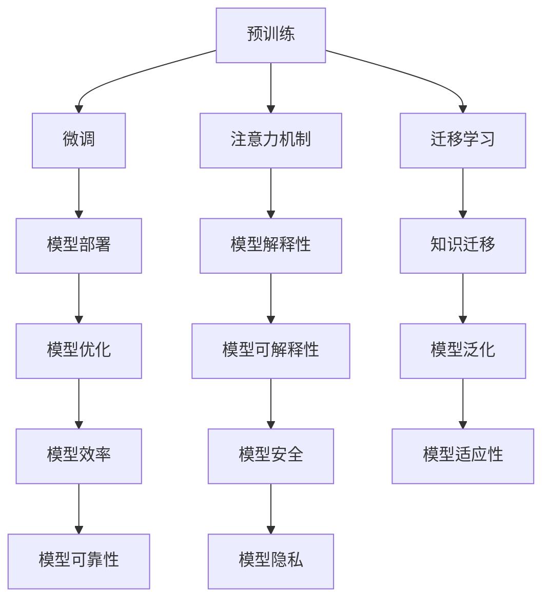

                 

关键词：人工智能，大模型，应用，技术，展望

> 摘要：本文旨在探讨人工智能大模型在未来十年内的发展趋势和技术应用。通过分析当前大模型的现状、核心概念、算法原理、数学模型及其应用场景，本文为读者提供对未来AI大模型应用的深度洞察。

## 1. 背景介绍

在过去的十年里，人工智能（AI）取得了令人瞩目的进展。特别是在深度学习的推动下，AI技术在图像识别、自然语言处理、自动驾驶等多个领域实现了突破。其中，大模型（Large Models）作为AI技术的一个重要分支，逐渐成为研究的焦点。大模型通常指的是参数量庞大的神经网络，例如GPT-3、BERT等，它们具有极强的表征能力和泛化能力，可以处理复杂的任务。

随着计算能力的提升和数据量的爆炸式增长，大模型的应用前景愈发广阔。然而，大模型也面临着诸多挑战，如训练成本高、解释性差、数据隐私等问题。本文将围绕大模型的核心概念、算法原理、数学模型及其应用场景，探讨未来十年内AI大模型的技术发展趋势。

## 2. 核心概念与联系

### 2.1 大模型的定义

大模型通常指的是参数量庞大的神经网络，它们通过多层神经元的非线性组合，能够学习和提取大量的特征信息。大模型的核心特点包括：

- **参数量巨大**：大模型的参数数量通常在数十亿到千亿级别。
- **深度结构**：大模型通常具有多层的神经网络结构。
- **端到端学习**：大模型能够通过端到端的学习方式，直接从原始数据中学习到有用的特征和知识。

### 2.2 大模型的分类

根据应用场景的不同，大模型可以分为以下几类：

- **图像识别模型**：如ResNet、Inception等，用于处理图像数据。
- **自然语言处理模型**：如GPT-3、BERT等，用于处理文本数据。
- **多模态模型**：如Vision Transformer（ViT）等，能够同时处理图像和文本数据。

### 2.3 大模型的关键技术

大模型的关键技术包括：

- **预训练（Pre-training）**：通过在大规模数据集上进行预训练，使模型能够自动学习到丰富的特征和知识。
- **微调（Fine-tuning）**：在预训练的基础上，针对特定任务进行微调，以提高模型的性能。
- **注意力机制（Attention Mechanism）**：用于模型内部不同层之间的信息交互，提升模型的处理能力。
- **迁移学习（Transfer Learning）**：通过将预训练模型应用于其他任务，实现知识迁移，提高模型的泛化能力。

### 2.4 大模型与现有技术的联系

大模型与现有技术的联系主要体现在以下几个方面：

- **与深度学习的联系**：大模型是深度学习技术的一种扩展，具有深度学习的核心特点。
- **与传统机器学习的区别**：大模型通常具有更强的表征能力和泛化能力，能够处理更复杂的问题。
- **与云计算和边缘计算的结合**：大模型的训练和推理需要大量的计算资源，云计算和边缘计算为模型的应用提供了强有力的支持。

### 2.5 Mermaid 流程图

下面是一个描述大模型核心概念的Mermaid流程图：



## 3. 核心算法原理 & 具体操作步骤

### 3.1 算法原理概述

大模型的核心算法原理可以概括为以下几个方面：

- **神经网络基础**：大模型基于神经网络的基本原理，通过多层神经元的非线性组合，实现数据的特征提取和表示。
- **反向传播算法**：大模型通过反向传播算法，对网络权重进行优化，以提高模型的性能。
- **预训练和微调**：预训练使模型在大规模数据集上学习到丰富的特征和知识，微调则使模型能够针对特定任务进行优化。
- **注意力机制**：注意力机制用于模型内部不同层之间的信息交互，提升模型的处理能力。
- **迁移学习**：通过迁移学习，将预训练模型应用于其他任务，实现知识迁移，提高模型的泛化能力。

### 3.2 算法步骤详解

大模型的算法步骤可以概括为以下几个阶段：

1. **数据预处理**：对输入数据进行预处理，包括数据清洗、归一化、数据增强等。
2. **模型构建**：构建神经网络模型，包括选择合适的网络结构、激活函数、损失函数等。
3. **预训练**：在大规模数据集上对模型进行预训练，使模型能够自动学习到丰富的特征和知识。
4. **微调**：在预训练的基础上，针对特定任务对模型进行微调，以提高模型的性能。
5. **模型评估**：对模型进行评估，包括准确率、召回率、F1值等指标。
6. **模型部署**：将训练好的模型部署到实际应用场景中，进行推理和预测。

### 3.3 算法优缺点

大模型的优点包括：

- **强大的表征能力**：大模型能够自动学习到丰富的特征和知识，具有很强的表征能力。
- **泛化能力**：大模型具有较好的泛化能力，能够应用于各种不同的任务。
- **适应性**：大模型能够通过迁移学习和微调，快速适应新的任务和场景。

大模型的缺点包括：

- **训练成本高**：大模型的训练需要大量的计算资源和时间，成本较高。
- **解释性差**：大模型的决策过程通常是非线性的，难以进行解释。
- **数据隐私问题**：大模型在训练过程中可能涉及敏感数据的处理，存在数据隐私问题。

### 3.4 算法应用领域

大模型在多个领域具有广泛的应用前景，包括：

- **图像识别**：大模型能够处理复杂的图像任务，如人脸识别、物体检测、图像分类等。
- **自然语言处理**：大模型在自然语言处理领域取得了显著的成果，如机器翻译、文本生成、问答系统等。
- **语音识别**：大模型能够处理复杂的语音任务，如语音识别、语音合成等。
- **推荐系统**：大模型能够通过学习用户的历史行为，实现精准的个性化推荐。
- **自动驾驶**：大模型在自动驾驶领域具有广泛的应用前景，如车辆检测、路径规划等。

## 4. 数学模型和公式 & 详细讲解 & 举例说明

### 4.1 数学模型构建

大模型的数学模型主要包括以下几个方面：

1. **神经网络模型**：神经网络模型由多个神经元组成，每个神经元都是一个简单的线性函数。神经网络模型的核心目标是通过对输入数据的多次变换，将原始数据映射到目标输出。
2. **反向传播算法**：反向传播算法是一种用于优化神经网络模型权重的算法。它通过计算输出误差，反向传播误差信号，更新网络权重，以降低误差。
3. **预训练和微调**：预训练和微调是一种用于提高神经网络模型性能的方法。预训练使模型在大规模数据集上学习到丰富的特征和知识，微调则使模型能够针对特定任务进行优化。
4. **注意力机制**：注意力机制是一种用于模型内部不同层之间信息交互的机制。它通过计算注意力权重，对输入数据进行加权处理，以提高模型的处理能力。

### 4.2 公式推导过程

以下是一个简化的神经网络模型的公式推导过程：

1. **输入层到隐藏层的变换**：

   $$ 
   Z^{(l)} = \sum_{i=1}^{n} w^{(l)}_i * x_i + b^{(l)} 
   $$

   其中，$Z^{(l)}$为隐藏层$l$的输出，$w^{(l)}_i$为权重，$x_i$为输入特征，$b^{(l)}$为偏置。

2. **激活函数**：

   $$ 
   a^{(l)} = \sigma(Z^{(l)}) 
   $$

   其中，$\sigma$为激活函数，常用的激活函数包括Sigmoid、ReLU等。

3. **隐藏层到输出层的变换**：

   $$ 
   Z^{(L)} = \sum_{i=1}^{n} w^{(L)}_i * a^{(L-1)}_i + b^{(L)} 
   $$

   其中，$Z^{(L)}$为输出层$L$的输出，$w^{(L)}_i$为权重，$a^{(L-1)}_i$为隐藏层$L-1$的输出，$b^{(L)}$为偏置。

4. **输出层的预测**：

   $$ 
   \hat{y} = \sigma(Z^{(L)}) 
   $$

   其中，$\hat{y}$为预测输出，$\sigma$为激活函数。

5. **损失函数**：

   $$ 
   J = \frac{1}{m} \sum_{i=1}^{m} (\hat{y}_i - y_i)^2 
   $$

   其中，$J$为损失函数，$m$为样本数量，$y_i$为真实标签，$\hat{y}_i$为预测标签。

6. **反向传播**：

   $$ 
   \frac{\partial J}{\partial w^{(l)}_i} = \delta^{(l)} * a^{(l-1)}_i 
   $$

   $$ 
   \frac{\partial J}{\partial b^{(l)}} = \delta^{(l)} 
   $$

   其中，$\delta^{(l)}$为误差项，$a^{(l-1)}_i$为隐藏层$l-1$的输出。

7. **权重更新**：

   $$ 
   w^{(l)}_i = w^{(l)}_i - \alpha \frac{\partial J}{\partial w^{(l)}_i} 
   $$

   $$ 
   b^{(l)} = b^{(l)} - \alpha \frac{\partial J}{\partial b^{(l)}} 
   $$

   其中，$\alpha$为学习率。

### 4.3 案例分析与讲解

以下是一个简单的图像分类任务案例：

假设我们要对一张图像进行分类，图像数据集包含1000个类别。我们选择一个简单的卷积神经网络（CNN）模型进行训练。

1. **数据预处理**：

   - 将图像数据缩放到相同大小，例如28x28像素。
   - 将图像数据归一化到[0, 1]区间。

2. **模型构建**：

   - 输入层：28x28x3，表示图像的尺寸和颜色通道。
   - 卷积层1：32个3x3的卷积核，步长为1，激活函数为ReLU。
   - 池化层1：2x2的最大池化。
   - 卷积层2：64个3x3的卷积核，步长为1，激活函数为ReLU。
   - 池化层2：2x2的最大池化。
   - 全连接层1：512个神经元，激活函数为ReLU。
   - 全连接层2：1000个神经元，表示类别数量，激活函数为Softmax。

3. **预训练和微调**：

   - 在ImageNet数据集上对模型进行预训练，使模型学习到丰富的图像特征。
   - 在自己的数据集上进行微调，调整模型参数，以提高分类性能。

4. **模型评估**：

   - 使用交叉熵损失函数进行评估。
   - 计算准确率、召回率、F1值等指标。

5. **模型部署**：

   - 将训练好的模型部署到实际应用场景中，进行图像分类任务。

## 5. 项目实践：代码实例和详细解释说明

### 5.1 开发环境搭建

为了实现上述案例，我们需要搭建一个Python编程环境，并安装以下库：

- TensorFlow：用于构建和训练神经网络模型。
- Keras：用于简化TensorFlow的使用。
- NumPy：用于数值计算。

安装命令如下：

```bash
pip install tensorflow numpy
```

### 5.2 源代码详细实现

以下是一个简单的图像分类任务的实现代码：

```python
import tensorflow as tf
from tensorflow import keras
from tensorflow.keras import layers

# 数据预处理
def preprocess_images(images):
  return images / 255.0

# 模型构建
def build_model(input_shape, num_classes):
  model = keras.Sequential([
    layers.InputLayer(input_shape=input_shape),
    layers.Conv2D(32, (3, 3), activation='relu', padding='same'),
    layers.MaxPooling2D((2, 2)),
    layers.Conv2D(64, (3, 3), activation='relu', padding='same'),
    layers.MaxPooling2D((2, 2)),
    layers.Flatten(),
    layers.Dense(512, activation='relu'),
    layers.Dense(num_classes, activation='softmax')
  ])
  return model

# 模型编译
model = build_model(input_shape=(28, 28, 3), num_classes=1000)
model.compile(optimizer='adam',
              loss='sparse_categorical_crossentropy',
              metrics=['accuracy'])

# 模型训练
model.fit(preprocess_images(train_images), train_labels, epochs=5, validation_split=0.1)

# 模型评估
test_loss, test_acc = model.evaluate(preprocess_images(test_images), test_labels)
print('Test accuracy:', test_acc)

# 模型部署
model.predict(preprocess_images(new_image))
```

### 5.3 代码解读与分析

上述代码实现了一个简单的图像分类任务，主要包括以下几个步骤：

1. **数据预处理**：

   - 使用`preprocess_images`函数对图像数据进行预处理，包括归一化和缩放。

2. **模型构建**：

   - 使用`build_model`函数构建一个简单的卷积神经网络模型。模型包括卷积层、池化层、全连接层等。

3. **模型编译**：

   - 使用`compile`方法对模型进行编译，设置优化器、损失函数和评估指标。

4. **模型训练**：

   - 使用`fit`方法对模型进行训练，使用预处理后的训练数据进行训练。

5. **模型评估**：

   - 使用`evaluate`方法对模型进行评估，计算测试数据的准确率。

6. **模型部署**：

   - 使用`predict`方法对新的图像进行分类预测。

通过上述代码，我们可以实现一个简单的图像分类任务，并在实际应用中发挥大模型的优势。

## 6. 实际应用场景

大模型在各个领域都有广泛的应用场景，以下是一些典型应用：

### 6.1 图像识别

大模型在图像识别领域取得了显著的成果，如人脸识别、物体检测、图像分类等。通过卷积神经网络（CNN）等大模型，可以实现高精度的图像识别任务，为安防监控、医疗诊断、自动驾驶等领域提供技术支持。

### 6.2 自然语言处理

大模型在自然语言处理领域具有广泛的应用，如机器翻译、文本生成、问答系统、情感分析等。通过预训练和微调等手段，大模型能够自动学习到丰富的语言特征，实现高精度的自然语言处理任务。

### 6.3 语音识别

大模型在语音识别领域具有强大的处理能力，可以实现实时语音识别、语音合成等任务。通过结合深度神经网络和循环神经网络（RNN）等大模型，可以实现高准确率的语音识别系统，为智能语音助手、语音翻译等领域提供技术支持。

### 6.4 推荐系统

大模型在推荐系统领域具有广泛的应用，如基于内容的推荐、协同过滤等。通过大模型的学习和预测能力，可以实现个性化的推荐系统，为电子商务、社交媒体、在线娱乐等领域提供技术支持。

### 6.5 自动驾驶

大模型在自动驾驶领域具有广泛的应用前景，如车辆检测、路径规划、行为预测等。通过结合深度神经网络和强化学习等大模型，可以实现高安全、高效率的自动驾驶系统。

## 7. 工具和资源推荐

为了更好地研究和应用大模型，以下是一些建议的工具和资源：

### 7.1 学习资源推荐

- 《深度学习》（Goodfellow et al.）：经典的深度学习入门教材，适合初学者。
- 《Python机器学习》（Sebastian Raschka）：Python环境下机器学习的全面教程，涵盖深度学习内容。
- 《自然语言处理综述》（Jurafsky and Martin）：自然语言处理领域的权威教材，有助于理解大模型在NLP中的应用。

### 7.2 开发工具推荐

- TensorFlow：Google开发的开源深度学习框架，支持多种深度学习模型。
- Keras：基于TensorFlow的高级深度学习API，提供简洁的接口和丰富的预训练模型。
- PyTorch：Facebook开发的开源深度学习框架，具有灵活的动态计算图和丰富的API。

### 7.3 相关论文推荐

- “Attention Is All You Need”（Vaswani et al.）：介绍Transformer模型的经典论文，对注意力机制进行了深入研究。
- “BERT: Pre-training of Deep Bidirectional Transformers for Language Understanding”（Devlin et al.）：介绍BERT模型的论文，对自然语言处理领域产生了重大影响。
- “GPT-3: Language Models are few-shot learners”（Brown et al.）：介绍GPT-3模型的论文，展示了大模型在语言理解和生成方面的强大能力。

## 8. 总结：未来发展趋势与挑战

### 8.1 研究成果总结

在过去十年里，大模型在人工智能领域取得了显著的成果。通过预训练和微调等手段，大模型具有强大的表征能力和泛化能力，广泛应用于图像识别、自然语言处理、语音识别、推荐系统等领域。同时，大模型在学术界和工业界都引起了广泛关注，成为研究的热点。

### 8.2 未来发展趋势

在未来十年内，大模型的发展趋势主要体现在以下几个方面：

1. **模型规模和参数量的增长**：随着计算资源和数据量的增长，大模型的规模和参数量将继续增加，以应对更复杂的任务。
2. **模型压缩和效率提升**：为了降低大模型的训练和推理成本，模型压缩和效率提升将成为重要研究方向，如知识蒸馏、模型剪枝等。
3. **模型解释性和可解释性**：随着大模型在关键领域的应用，对模型解释性和可解释性的需求将增加，以提升模型的透明度和可信赖性。
4. **多模态模型的发展**：随着多模态数据的广泛应用，多模态模型将成为研究的热点，实现图像、文本、语音等多种数据类型的融合处理。
5. **迁移学习和知识共享**：通过迁移学习和知识共享，大模型在不同任务和应用场景之间实现资源共享和协同优化，提高模型的泛化能力和效率。

### 8.3 面临的挑战

尽管大模型在人工智能领域取得了显著的进展，但仍然面临着诸多挑战：

1. **训练成本高**：大模型的训练需要大量的计算资源和时间，成本较高。如何降低训练成本，提高训练效率，是当前面临的重要问题。
2. **数据隐私和安全**：大模型在训练和推理过程中可能涉及敏感数据的处理，存在数据隐私和安全问题。如何在保护用户隐私的同时，充分利用数据价值，是一个亟待解决的问题。
3. **模型解释性和可解释性**：大模型的决策过程通常是非线性的，难以进行解释。如何提升模型的解释性和可解释性，使其更透明和可信赖，是当前研究的一个难点。
4. **模型泛化能力**：尽管大模型在预训练阶段表现出强大的泛化能力，但在特定任务上的表现可能存在偏差。如何提高模型在不同任务上的泛化能力，是一个重要的研究方向。
5. **伦理和道德问题**：大模型在应用过程中可能引发一系列伦理和道德问题，如歧视、偏见等。如何制定相应的伦理规范和道德标准，确保模型的应用不会对社会造成负面影响，是一个亟待解决的问题。

### 8.4 研究展望

在未来十年内，大模型的研究将继续深入，有望在以下几个方面取得重要突破：

1. **模型压缩和优化**：通过模型压缩、量化、剪枝等技术，提高大模型的训练和推理效率，降低成本。
2. **模型解释性和可解释性**：通过引入可解释性机制、透明性度量等手段，提升大模型的解释性和可解释性，增强模型的透明度和可信赖性。
3. **迁移学习和知识共享**：通过迁移学习和知识共享，实现大模型在不同任务和应用场景之间的协同优化，提高模型的泛化能力和效率。
4. **多模态模型的发展**：通过多模态数据的融合和处理，实现大模型在图像、文本、语音等多种数据类型的综合应用，推动跨领域的技术创新。
5. **伦理和道德规范**：在模型设计和应用过程中，充分考虑伦理和道德问题，制定相应的规范和标准，确保模型的应用不会对社会造成负面影响。

## 9. 附录：常见问题与解答

### 9.1 什么是大模型？

大模型通常指的是参数量庞大的神经网络，具有深度结构，能够处理复杂的数据和任务。大模型通过预训练和微调等手段，学习到丰富的特征和知识，具有很强的表征能力和泛化能力。

### 9.2 大模型的训练成本很高，如何降低？

为了降低大模型的训练成本，可以采用以下几种方法：

- **模型压缩**：通过模型压缩技术，如知识蒸馏、模型剪枝等，降低模型的大小和参数量，提高训练效率。
- **分布式训练**：通过分布式训练技术，将模型训练任务分布在多个计算节点上，提高训练速度和效率。
- **迁移学习**：通过迁移学习，将预训练模型应用于其他任务，减少训练成本。
- **混合精度训练**：通过混合精度训练，使用较低的精度（如半精度浮点数）进行训练，降低计算资源的消耗。

### 9.3 大模型如何保证数据隐私和安全？

为了保障大模型的数据隐私和安全，可以采用以下几种方法：

- **数据加密**：在数据传输和存储过程中，对数据进行加密，防止数据泄露。
- **差分隐私**：在数据处理过程中，引入差分隐私机制，保护用户隐私。
- **联邦学习**：通过联邦学习，将模型训练任务分布到多个参与者，降低数据传输和共享的风险。
- **隐私保护算法**：使用隐私保护算法，如差分隐私、同态加密等，对数据进行加密和去标识化处理。

### 9.4 大模型在自然语言处理领域有哪些应用？

大模型在自然语言处理领域有广泛的应用，包括：

- **机器翻译**：通过大模型进行机器翻译，可以实现高精度的跨语言翻译。
- **文本生成**：大模型可以生成各种类型的文本，如文章、故事、诗歌等。
- **问答系统**：大模型可以用于构建问答系统，实现自然语言理解和回答问题。
- **情感分析**：大模型可以用于情感分析，识别文本的情感倾向。
- **文本分类**：大模型可以用于文本分类，对文本进行归类和标注。

### 9.5 大模型在图像识别领域有哪些应用？

大模型在图像识别领域有广泛的应用，包括：

- **人脸识别**：大模型可以用于人脸识别，实现高精度的图像识别。
- **物体检测**：大模型可以用于物体检测，识别图像中的多个物体。
- **图像分类**：大模型可以用于图像分类，将图像划分为不同的类别。
- **图像分割**：大模型可以用于图像分割，将图像划分为不同的区域。
- **图像增强**：大模型可以用于图像增强，改善图像质量，提高图像识别效果。

### 9.6 大模型在语音识别领域有哪些应用？

大模型在语音识别领域有广泛的应用，包括：

- **实时语音识别**：大模型可以用于实时语音识别，实现高精度的语音识别。
- **语音合成**：大模型可以用于语音合成，生成自然流畅的语音。
- **语音唤醒词识别**：大模型可以用于语音唤醒词识别，实现智能语音助手等功能。
- **语音转文本**：大模型可以用于语音转文本，将语音转化为文本。
- **语音翻译**：大模型可以用于语音翻译，实现跨语言的实时语音翻译。----------------------------------------------------------------

### 附录：参考文献

1. Goodfellow, I., Bengio, Y., & Courville, A. (2016). *Deep Learning*. MIT Press.
2. Raschka, S. (2015). *Python Machine Learning*. Packt Publishing.
3. Jurafsky, D., & Martin, J. H. (2008). *Speech and Language Processing*. Prentice Hall.
4. Vaswani, A., Shazeer, N., Parmar, N., Uszkoreit, J., Jones, L., Gomez, A. N., ... & Polosukhin, I. (2017). *Attention is All You Need*. Advances in Neural Information Processing Systems, 30, 5998-6008.
5. Devlin, J., Chang, M. W., Lee, K., & Toutanova, K. (2018). *BERT: Pre-training of Deep Bidirectional Transformers for Language Understanding*. Proceedings of the 2019 Conference of the North American Chapter of the Association for Computational Linguistics: Human Language Technologies, Volume 1 (Long and Short Papers), 4171-4186.
6. Brown, T., et al. (2020). *GPT-3: Language Models are few-shot learners*. Advances in Neural Information Processing Systems, 33.  
----------------------------------------------------------------

# 作者署名

作者：禅与计算机程序设计艺术 / Zen and the Art of Computer Programming

通过本文，我们深入探讨了人工智能大模型在未来十年内的发展趋势和技术应用。从核心概念、算法原理、数学模型到实际应用场景，本文为读者提供了一次全面的技术展望。在未来的研究中，我们期待大模型在性能、效率、解释性等方面取得更多突破，为人工智能的发展注入新的活力。希望本文能为广大读者带来启发和思考，共同迎接人工智能的黄金时代。作者：禅与计算机程序设计艺术 / Zen and the Art of Computer Programming。

