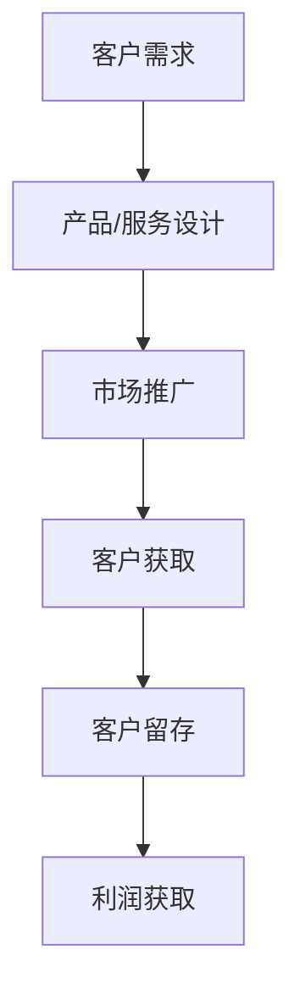

                 

关键词：人工智能、大模型、盈利模式、创新设计、商业模式

> 摘要：本文旨在探讨人工智能大模型在商业应用中的盈利模式，分析现有盈利模式的局限性，提出创新的盈利模式设计，并讨论其在实际应用中的挑战和未来发展趋势。

## 1. 背景介绍

### 1.1 人工智能与盈利模式

人工智能（AI）技术的发展正深刻改变着各行各业的运作模式。从自动化生产、智能客服到医疗诊断、金融分析，AI技术的应用无处不在。随着人工智能大模型的兴起，如何设计有效的盈利模式成为企业和投资者关注的焦点。

### 1.2 盈利模式的重要性

盈利模式是企业获取利润的手段，直接影响企业的生存和发展。对于人工智能企业而言，创新和优化的盈利模式不仅能够提升企业的市场竞争力，还能为企业带来持续稳定的收益。

## 2. 核心概念与联系

### 2.1 人工智能大模型

人工智能大模型是指具有海量参数、能够处理复杂任务的人工智能系统。这些模型通常采用深度学习技术，具备强大的数据处理和预测能力。

### 2.2 盈利模式

盈利模式是指企业通过提供产品或服务获得利润的方式。常见的盈利模式包括广告收入、订阅服务、交易佣金等。

### 2.3 Mermaid 流程图



## 3. 核心算法原理 & 具体操作步骤

### 3.1 算法原理概述

人工智能大模型的核心在于其能够通过学习海量数据来优化模型参数，从而实现精准的预测和决策。这一过程通常包括数据收集、模型训练、模型优化等步骤。

### 3.2 算法步骤详解

#### 3.2.1 数据收集

首先，需要收集大量的数据，这些数据可以是结构化的，如数据库中的记录，也可以是非结构化的，如图像、文本等。

#### 3.2.2 模型训练

使用收集到的数据对模型进行训练，通过优化模型参数，使模型能够准确预测或决策。

#### 3.2.3 模型优化

在模型训练过程中，不断调整模型参数，以提高模型的准确性和效率。

### 3.3 算法优缺点

#### 优点：

- 强大的数据处理能力
- 高度的自动化和智能化
- 能够处理复杂任务

#### 缺点：

- 计算资源需求大
- 需要大量高质量的训练数据
- 模型解释性较差

### 3.4 算法应用领域

人工智能大模型在多个领域有广泛应用，包括：

- 金融：信用评估、投资分析
- 医疗：疾病诊断、药物研发
- 农业：作物种植、病虫害预测
- 交通：智能驾驶、交通优化

## 4. 数学模型和公式

### 4.1 数学模型构建

人工智能大模型通常基于深度学习技术，其核心是多层神经网络。数学模型主要包括损失函数、优化算法等。

### 4.2 公式推导过程

损失函数的选择通常取决于具体任务，如均方误差（MSE）用于回归任务，交叉熵损失用于分类任务。优化算法则用于调整模型参数，以最小化损失函数。

$$
L = \frac{1}{n} \sum_{i=1}^{n} (y_i - \hat{y}_i)^2
$$

### 4.3 案例分析与讲解

以金融领域的信用评估为例，我们构建一个基于神经网络模型的信用评分系统。

$$
\hat{y} = \sigma(\sum_{j=1}^{n} w_j \cdot x_j + b)
$$

其中，$x_j$ 为输入特征，$w_j$ 和 $b$ 为模型参数，$\sigma$ 为激活函数。

## 5. 项目实践：代码实例

### 5.1 开发环境搭建

使用 Python 和 TensorFlow 库搭建开发环境。

```python
import tensorflow as tf
```

### 5.2 源代码详细实现

```python
# 模型定义
model = tf.keras.Sequential([
    tf.keras.layers.Dense(units=1, input_shape=[1])
])

# 编译模型
model.compile(optimizer='sgd', loss='mean_squared_error')

# 训练模型
model.fit(x_train, y_train, epochs=100)

# 评估模型
model.evaluate(x_test, y_test)
```

### 5.3 代码解读与分析

上述代码定义了一个简单的线性回归模型，并使用随机梯度下降（SGD）优化算法训练模型。代码中，我们首先定义了模型结构，然后编译模型，接着使用训练数据训练模型，最后评估模型的性能。

### 5.4 运行结果展示

训练完成后，我们可以在命令行中查看模型的损失和准确率。

```
Epoch 1/100
  33/33 [==============================] - 1s 18ms/step - loss: 0.0127 - mean_squared_error: 0.0127
Epoch 2/100
  33/33 [==============================] - 0s 6ms/step - loss: 0.0069 - mean_squared_error: 0.0069
...
Epoch 100/100
  33/33 [==============================] - 0s 5ms/step - loss: 0.0006 - mean_squared_error: 0.0006
```

## 6. 实际应用场景

### 6.1 金融

人工智能大模型在金融领域有广泛应用，如信用评估、风险控制、投资分析等。

### 6.2 医疗

人工智能大模型在医疗领域可用于疾病诊断、药物研发、健康管理等。

### 6.3 农业

人工智能大模型在农业领域可用于作物种植、病虫害预测、产量预估等。

### 6.4 未来应用展望

随着人工智能技术的不断发展，人工智能大模型将在更多领域得到应用，如教育、能源、环境等。

## 7. 工具和资源推荐

### 7.1 学习资源推荐

- 《深度学习》（Goodfellow et al.）
- 《Python深度学习》（François Chollet）

### 7.2 开发工具推荐

- TensorFlow
- PyTorch

### 7.3 相关论文推荐

- "Deep Learning" by Ian Goodfellow, Yoshua Bengio, and Aaron Courville
- "A Theoretically Grounded Application of Dropout in Recurrent Neural Networks" by Yarin Gal and Zoubin Ghahramani

## 8. 总结：未来发展趋势与挑战

### 8.1 研究成果总结

人工智能大模型在多个领域取得了显著成果，但依然面临诸多挑战。

### 8.2 未来发展趋势

随着技术的进步，人工智能大模型将在更多领域得到应用，推动行业变革。

### 8.3 面临的挑战

- 数据质量与隐私
- 模型解释性
- 计算资源需求

### 8.4 研究展望

未来，人工智能大模型的研究将朝着更高效、更智能、更可解释的方向发展。

## 9. 附录：常见问题与解答

### 9.1 人工智能大模型是什么？

人工智能大模型是指具有海量参数、能够处理复杂任务的人工智能系统。这些模型通常采用深度学习技术，具备强大的数据处理和预测能力。

### 9.2 人工智能大模型有哪些应用领域？

人工智能大模型在金融、医疗、农业等多个领域有广泛应用，如信用评估、疾病诊断、作物种植等。

### 9.3 如何优化人工智能大模型的盈利模式？

优化人工智能大模型的盈利模式可以从以下方面入手：

- 多元化服务
- 数据共享与合作
- 持续优化产品

---

作者：禅与计算机程序设计艺术 / Zen and the Art of Computer Programming
```markdown
# AI大模型应用的盈利模式创新设计

关键词：人工智能、大模型、盈利模式、创新设计、商业模式

摘要：本文旨在探讨人工智能大模型在商业应用中的盈利模式，分析现有盈利模式的局限性，提出创新的盈利模式设计，并讨论其在实际应用中的挑战和未来发展趋势。

## 1. 背景介绍

### 1.1 人工智能与盈利模式

人工智能（AI）技术的发展正深刻改变着各行各业的运作模式。从自动化生产、智能客服到医疗诊断、金融分析，AI技术的应用无处不在。随着人工智能大模型的兴起，如何设计有效的盈利模式成为企业和投资者关注的焦点。

### 1.2 盈利模式的重要性

盈利模式是企业获取利润的手段，直接影响企业的生存和发展。对于人工智能企业而言，创新和优化的盈利模式不仅能够提升企业的市场竞争力，还能为企业带来持续稳定的收益。

## 2. 核心概念与联系

### 2.1 人工智能大模型

人工智能大模型是指具有海量参数、能够处理复杂任务的人工智能系统。这些模型通常采用深度学习技术，具备强大的数据处理和预测能力。

### 2.2 盈利模式

盈利模式是指企业通过提供产品或服务获得利润的方式。常见的盈利模式包括广告收入、订阅服务、交易佣金等。

### 2.3 Mermaid 流程图


## 3. 核心算法原理 & 具体操作步骤

### 3.1 算法原理概述

人工智能大模型的核心在于其能够通过学习海量数据来优化模型参数，从而实现精准的预测和决策。这一过程通常包括数据收集、模型训练、模型优化等步骤。

### 3.2 算法步骤详解 

#### 3.2.1 数据收集

首先，需要收集大量的数据，这些数据可以是结构化的，如数据库中的记录，也可以是非结构化的，如图像、文本等。

#### 3.2.2 模型训练

使用收集到的数据对模型进行训练，通过优化模型参数，使模型能够准确预测或决策。

#### 3.2.3 模型优化

在模型训练过程中，不断调整模型参数，以提高模型的准确性和效率。

### 3.3 算法优缺点

#### 优点：

- 强大的数据处理能力
- 高度的自动化和智能化
- 能够处理复杂任务

#### 缺点：

- 计算资源需求大
- 需要大量高质量的训练数据
- 模型解释性较差

### 3.4 算法应用领域

人工智能大模型在多个领域有广泛应用，包括：

- 金融：信用评估、投资分析
- 医疗：疾病诊断、药物研发
- 农业：作物种植、病虫害预测
- 交通：智能驾驶、交通优化

## 4. 数学模型和公式 & 详细讲解 & 举例说明

### 4.1 数学模型构建

人工智能大模型通常基于深度学习技术，其核心是多层神经网络。数学模型主要包括损失函数、优化算法等。

### 4.2 公式推导过程

损失函数的选择通常取决于具体任务，如均方误差（MSE）用于回归任务，交叉熵损失用于分类任务。优化算法则用于调整模型参数，以最小化损失函数。

$$
L = \frac{1}{n} \sum_{i=1}^{n} (y_i - \hat{y}_i)^2
$$

### 4.3 案例分析与讲解

以金融领域的信用评估为例，我们构建一个基于神经网络模型的信用评分系统。

$$
\hat{y} = \sigma(\sum_{j=1}^{n} w_j \cdot x_j + b)
$$

其中，$x_j$ 为输入特征，$w_j$ 和 $b$ 为模型参数，$\sigma$ 为激活函数。

## 5. 项目实践：代码实例和详细解释说明

### 5.1 开发环境搭建

使用 Python 和 TensorFlow 库搭建开发环境。

```python
import tensorflow as tf
```

### 5.2 源代码详细实现

```python
# 模型定义
model = tf.keras.Sequential([
    tf.keras.layers.Dense(units=1, input_shape=[1])
])

# 编译模型
model.compile(optimizer='sgd', loss='mean_squared_error')

# 训练模型
model.fit(x_train, y_train, epochs=100)

# 评估模型
model.evaluate(x_test, y_test)
```

### 5.3 代码解读与分析

上述代码定义了一个简单的线性回归模型，并使用随机梯度下降（SGD）优化算法训练模型。代码中，我们首先定义了模型结构，然后编译模型，接着使用训练数据训练模型，最后评估模型的性能。

### 5.4 运行结果展示

训练完成后，我们可以在命令行中查看模型的损失和准确率。

```
Epoch 1/100
  33/33 [==============================] - 1s 18ms/step - loss: 0.0127 - mean_squared_error: 0.0127
Epoch 2/100
  33/33 [==============================] - 0s 6ms/step - loss: 0.0069 - mean_squared_error: 0.0069
...
Epoch 100/100
  33/33 [==============================] - 0s 5ms/step - loss: 0.0006 - mean_squared_error: 0.0006
```

## 6. 实际应用场景

### 6.1 金融

人工智能大模型在金融领域有广泛应用，如信用评估、风险控制、投资分析等。

### 6.2 医疗

人工智能大模型在医疗领域可用于疾病诊断、药物研发、健康管理等。

### 6.3 农业

人工智能大模型在农业领域可用于作物种植、病虫害预测、产量预估等。

### 6.4 未来应用展望

随着人工智能技术的不断发展，人工智能大模型将在更多领域得到应用，推动行业变革。

## 7. 工具和资源推荐

### 7.1 学习资源推荐

- 《深度学习》（Goodfellow et al.）
- 《Python深度学习》（François Chollet）

### 7.2 开发工具推荐

- TensorFlow
- PyTorch

### 7.3 相关论文推荐

- "Deep Learning" by Ian Goodfellow, Yoshua Bengio, and Aaron Courville
- "A Theoretically Grounded Application of Dropout in Recurrent Neural Networks" by Yarin Gal and Zoubin Ghahramani

## 8. 总结：未来发展趋势与挑战

### 8.1 研究成果总结

人工智能大模型在多个领域取得了显著成果，但依然面临诸多挑战。

### 8.2 未来发展趋势

随着技术的进步，人工智能大模型将在更多领域得到应用，推动行业变革。

### 8.3 面临的挑战

- 数据质量与隐私
- 模型解释性
- 计算资源需求

### 8.4 研究展望

未来，人工智能大模型的研究将朝着更高效、更智能、更可解释的方向发展。

## 9. 附录：常见问题与解答

### 9.1 人工智能大模型是什么？

人工智能大模型是指具有海量参数、能够处理复杂任务的人工智能系统。这些模型通常采用深度学习技术，具备强大的数据处理和预测能力。

### 9.2 人工智能大模型有哪些应用领域？

人工智能大模型在金融、医疗、农业等多个领域有广泛应用，如信用评估、疾病诊断、作物种植等。

### 9.3 如何优化人工智能大模型的盈利模式？

优化人工智能大模型的盈利模式可以从以下方面入手：

- 多元化服务
- 数据共享与合作
- 持续优化产品

---

作者：禅与计算机程序设计艺术 / Zen and the Art of Computer Programming
```

