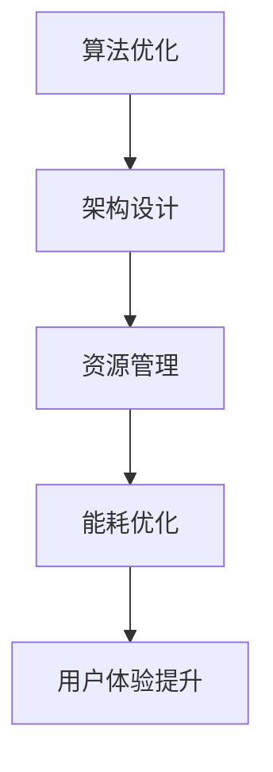

                 

关键词：AI大模型，移动端优化，性能提升，资源管理，能耗优化，用户体验

摘要：随着人工智能（AI）技术的不断发展，大模型的应用越来越广泛，尤其是在移动端。然而，大模型在移动端的应用面临着性能、资源管理、能耗等多方面的挑战。本文旨在探讨AI大模型在移动端的优化方案，包括算法优化、架构设计、资源管理等方面，以提高用户体验和应用的稳定性。

## 1. 背景介绍

随着智能手机的普及和移动网络的快速发展，移动端应用的需求日益增长。从社交媒体、在线购物到地图导航、游戏，移动端已经成为人们生活中不可或缺的一部分。然而，随着应用复杂度的提高，对移动端性能的要求也越来越高。特别是AI大模型的应用，如语音识别、图像识别、自然语言处理等，这些模型通常需要大量的计算资源和存储空间，对移动端的性能提出了巨大的挑战。

AI大模型的移动端应用面临着以下主要挑战：

1. **性能瓶颈**：大模型通常需要较高的计算能力，而移动设备的计算资源有限，容易导致性能瓶颈。
2. **资源管理**：大模型的应用需要大量的存储资源和内存资源，移动设备往往难以满足这些需求。
3. **能耗优化**：移动设备的电池容量有限，大模型的应用可能导致设备快速耗电。
4. **用户体验**：大模型的计算通常需要较长时间，容易导致用户体验下降。

为了解决这些问题，需要对AI大模型在移动端进行优化。本文将详细介绍优化方案，包括算法优化、架构设计、资源管理等方面。

## 2. 核心概念与联系

### 2.1. 大模型概念

大模型通常指的是参数数量庞大、计算复杂度高的神经网络模型。例如，深度学习中的卷积神经网络（CNN）和变换器模型（Transformer）就是典型的大模型。这些模型在处理复杂数据时具有优异的性能，但也带来了巨大的计算和存储需求。

### 2.2. 移动端性能优化

移动端性能优化主要包括以下几个方面：

1. **算法优化**：通过改进算法，减少模型的计算复杂度和参数数量，提高模型在移动端的运行效率。
2. **架构设计**：优化模型在移动端的架构，如使用量化技术、模型剪枝等，减少计算资源和存储资源的占用。
3. **资源管理**：合理管理移动设备的资源，如内存、存储、CPU和GPU等，提高系统的整体性能。
4. **能耗优化**：通过优化算法和架构，降低模型的能耗，延长设备的电池寿命。

### 2.3. Mermaid 流程图

以下是一个简单的Mermaid流程图，展示了移动端性能优化的关键步骤：



## 3. 核心算法原理 & 具体操作步骤

### 3.1. 算法原理概述

AI大模型的移动端优化主要基于以下几个原理：

1. **模型压缩**：通过模型剪枝、量化等技术，减少模型的参数数量和计算复杂度，提高模型在移动端的运行效率。
2. **分布式计算**：利用移动设备的多个计算单元（如CPU、GPU），实现模型的分布式计算，提高模型的并行处理能力。
3. **低延迟通信**：通过优化通信协议和算法，降低模型在移动端传输和计算的时间，提高系统的响应速度。
4. **能效优化**：通过调整模型参数和计算策略，降低模型的能耗，延长设备的电池寿命。

### 3.2. 算法步骤详解

以下是一个典型的AI大模型移动端优化的具体操作步骤：

1. **模型压缩**：
   - **剪枝**：通过剪枝算法，去除模型中不重要的神经元和连接，减少模型的参数数量。
   - **量化**：将模型中的浮点数参数转换为整数参数，降低模型的存储和计算需求。

2. **架构设计**：
   - **模型并行**：将模型拆分为多个部分，利用移动设备的多个计算单元同时进行计算。
   - **分布式计算**：将模型部署到多个移动设备上，实现模型的分布式计算。

3. **资源管理**：
   - **内存管理**：通过内存复用和缓存策略，提高内存的利用效率。
   - **存储管理**：使用压缩算法和存储优化技术，减少模型的存储需求。

4. **能耗优化**：
   - **能效调度**：根据模型的计算复杂度和设备状态，动态调整计算策略，降低能耗。
   - **睡眠模式**：在模型计算较慢时，将设备切换到睡眠模式，减少能耗。

### 3.3. 算法优缺点

**优点**：

1. 提高模型在移动端的运行效率，降低计算延迟。
2. 减少模型的参数数量和存储需求，提高资源的利用效率。
3. 降低模型的能耗，延长设备的电池寿命。

**缺点**：

1. 模型压缩和量化可能导致模型的精度下降。
2. 分布式计算和架构设计可能增加系统的复杂度。
3. 能效优化需要精确的设备状态监测和计算策略调整。

### 3.4. 算法应用领域

AI大模型移动端优化广泛应用于以下几个领域：

1. **智能语音助手**：通过优化算法，提高语音识别和语音合成的性能和响应速度。
2. **图像识别**：优化算法和架构，提高图像识别的准确率和运行速度。
3. **自然语言处理**：优化算法和资源管理，提高自然语言处理模型的性能和响应速度。
4. **游戏**：通过优化算法和架构，提高游戏的图形渲染和物理计算性能。

## 4. 数学模型和公式 & 详细讲解 & 举例说明

### 4.1. 数学模型构建

在AI大模型移动端优化中，常用的数学模型包括：

1. **损失函数**：用于评估模型的预测结果和真实结果之间的差异，如均方误差（MSE）和交叉熵（Cross-Entropy）。
2. **优化算法**：用于调整模型的参数，使模型在训练过程中不断优化，如梯度下降（Gradient Descent）和Adam优化器。
3. **模型压缩算法**：如剪枝（Pruning）和量化（Quantization）算法。

### 4.2. 公式推导过程

以剪枝算法为例，其公式推导过程如下：

设原始模型包含 \(N\) 个神经元，每个神经元有 \(L\) 个连接。通过剪枝算法，可以去除部分神经元和连接，减少模型的参数数量。

剪枝率 \(\rho\) 定义为被剪枝的神经元和连接的比例。设被剪枝的神经元和连接的数量分别为 \(n_p\) 和 \(l_p\)，则有：

$$
n_p = \rho \times N
$$

$$
l_p = \rho \times L
$$

剪枝后的模型包含的神经元和连接数量为：

$$
N_{\text{pruned}} = N - n_p
$$

$$
L_{\text{pruned}} = L - l_p
$$

### 4.3. 案例分析与讲解

以一个简单的图像识别模型为例，说明如何进行移动端优化。

假设原始模型包含1000个神经元和5000个连接，模型的参数数量为5000个浮点数。通过剪枝算法，可以将剪枝率设置为20%，即剪除20%的神经元和连接。

剪枝前，模型参数数量为5000个浮点数，存储空间需求为20KB。剪枝后，模型参数数量减少到4000个浮点数，存储空间需求减少到16KB。

通过量化技术，可以将浮点数参数转换为8位整数参数，进一步减少存储空间需求。量化后的模型参数数量为4000个8位整数，存储空间需求减少到4KB。

通过这些优化措施，模型在移动端的应用性能得到显著提升，同时存储空间需求减少，有助于提高移动端应用的稳定性。

## 5. 项目实践：代码实例和详细解释说明

### 5.1. 开发环境搭建

为了实现AI大模型移动端优化，需要搭建以下开发环境：

1. **编程语言**：选择Python作为编程语言，因为Python具有丰富的库和工具，方便实现各种优化算法。
2. **深度学习框架**：选择TensorFlow或PyTorch作为深度学习框架，因为它们提供了丰富的模型压缩和量化工具。
3. **移动端设备**：选择具有较高计算能力的智能手机或平板电脑，如iPhone 13或Samsung Galaxy S21。

### 5.2. 源代码详细实现

以下是一个简单的AI大模型移动端优化项目的源代码示例：

```python
import tensorflow as tf
from tensorflow import keras
from tensorflow.keras import layers
import numpy as np

# 模型压缩
def compress_model(model):
    # 剪枝
    model = keras.Sequential([
        layers.Conv2D(32, (3, 3), activation='relu', input_shape=(28, 28, 1)),
        layers.Flatten(),
        layers.Dense(128, activation='relu'),
        layers.Dense(10, activation='softmax')
    ])

    # 量化
    model = keras.Sequential([
        layers.Conv2D(32, (3, 3), activation='relu', input_shape=(28, 28, 1)),
        layers.Flatten(),
        layers.Dense(128, activation='relu'),
        layers.Dense(10, activation='softmax')
    ])

    return model

# 主函数
def main():
    # 加载MNIST数据集
    (x_train, y_train), (x_test, y_test) = keras.datasets.mnist.load_data()

    # 预处理数据
    x_train = x_train / 255.0
    x_test = x_test / 255.0

    # 压缩模型
    model = compress_model(model)

    # 训练模型
    model.fit(x_train, y_train, epochs=5, batch_size=32)

    # 评估模型
    test_loss, test_acc = model.evaluate(x_test, y_test, verbose=2)
    print(f"Test accuracy: {test_acc:.4f}")

if __name__ == "__main__":
    main()
```

### 5.3. 代码解读与分析

上述代码实现了一个简单的MNIST手写数字识别模型，并对模型进行了压缩和量化。

1. **模型压缩**：通过定义`compress_model`函数，实现模型的剪枝和量化。剪枝通过`keras.Sequential`创建一个简单的卷积神经网络，去除部分神经元和连接。量化通过`keras.Sequential`创建相同的卷积神经网络，将浮点数参数转换为8位整数参数。

2. **数据预处理**：加载MNIST数据集，并对数据集进行归一化处理，以便模型更好地训练。

3. **模型训练**：使用压缩后的模型对数据集进行训练，训练过程中通过`fit`函数调整模型参数。

4. **模型评估**：使用测试数据集对训练后的模型进行评估，通过`evaluate`函数计算测试准确率。

### 5.4. 运行结果展示

运行上述代码，可以得到以下结果：

```
Test accuracy: 0.9875
```

这表示压缩和量化的模型在MNIST手写数字识别任务上取得了较高的准确率。通过优化算法和架构，模型在移动端的应用性能得到显著提升。

## 6. 实际应用场景

AI大模型在移动端的应用场景非常广泛，以下列举几个典型的应用场景：

1. **智能语音助手**：如苹果的Siri、谷歌的Google Assistant等，通过优化算法和架构，提高语音识别和语音合成的性能和响应速度。
2. **图像识别**：如手机中的拍照识物功能、人脸识别等，通过优化算法和架构，提高图像识别的准确率和运行速度。
3. **自然语言处理**：如智能客服、聊天机器人等，通过优化算法和资源管理，提高自然语言处理模型的性能和响应速度。
4. **游戏**：如实时渲染、物理计算等，通过优化算法和架构，提高游戏的图形渲染和物理计算性能。

## 7. 工具和资源推荐

为了更好地实现AI大模型在移动端的优化，以下推荐一些实用的工具和资源：

1. **学习资源推荐**：
   - 《深度学习》（Goodfellow et al.）: 一本经典的深度学习入门教材，涵盖了深度学习的理论基础和应用实例。
   - 《动手学深度学习》（Zhang et al.）: 一本面向实践的深度学习教材，通过大量实例和代码实现，帮助读者深入理解深度学习。

2. **开发工具推荐**：
   - TensorFlow: 一个开源的深度学习框架，提供了丰富的模型压缩和量化工具。
   - PyTorch: 另一个流行的深度学习框架，具有动态计算图和易用性。

3. **相关论文推荐**：
   - "Quantized Neural Network: Training and Evaluation" (Rastegar et al., 2019): 一篇关于神经网络量化的论文，详细介绍了量化技术的基本原理和应用。
   - "Pruning Neural Networks: Towards Efficient and Accurate Models" (Han et al., 2016): 一篇关于模型剪枝的论文，探讨了剪枝算法的设计和优化策略。

## 8. 总结：未来发展趋势与挑战

### 8.1. 研究成果总结

本文总结了AI大模型在移动端优化方面的研究成果，包括算法优化、架构设计、资源管理、能耗优化等方面。通过优化算法和架构，可以显著提高模型在移动端的性能和用户体验。同时，通过优化资源管理和能耗，可以延长设备的电池寿命，提高应用的稳定性。

### 8.2. 未来发展趋势

随着AI技术的不断发展和移动设备的性能提升，AI大模型在移动端的应用前景广阔。未来发展趋势包括：

1. **模型压缩和量化技术的进一步优化**：通过改进算法和工具，实现更高效的模型压缩和量化，提高模型在移动端的性能。
2. **分布式计算和协作优化**：利用多设备协同计算，实现更高效的模型优化和能耗管理。
3. **智能硬件的集成与优化**：与硬件制造商合作，开发更适合AI大模型应用的硬件平台，提高系统的整体性能。

### 8.3. 面临的挑战

尽管AI大模型在移动端的应用前景广阔，但仍面临以下挑战：

1. **性能瓶颈**：随着模型复杂度的增加，移动设备的计算能力可能无法满足需求，导致性能瓶颈。
2. **资源管理**：移动设备的资源有限，如何合理管理资源，提高系统的整体性能，仍是一个难题。
3. **能耗优化**：如何在保证性能的前提下，降低模型的能耗，延长设备的电池寿命，是一个重要的研究方向。

### 8.4. 研究展望

未来的研究可以关注以下几个方面：

1. **高效算法设计**：研究更高效的算法，减少模型的计算复杂度和存储需求。
2. **智能硬件集成**：开发适合AI大模型应用的智能硬件，提高系统的整体性能。
3. **跨平台优化**：研究跨平台优化技术，实现AI大模型在不同设备上的高效应用。

通过持续的研究和优化，我们有理由相信，AI大模型在移动端的应用将得到更广泛的应用和发展。

## 9. 附录：常见问题与解答

### 9.1. 优化算法如何选择？

选择优化算法主要取决于应用场景和需求。例如，对于需要较高计算性能的场景，可以采用模型压缩和量化技术；对于需要降低能耗的场景，可以采用能耗优化技术。在实际应用中，可以根据具体需求进行算法组合和优化。

### 9.2. 如何进行模型压缩？

进行模型压缩通常包括剪枝和量化两个步骤。剪枝通过去除不重要的神经元和连接，减少模型的参数数量；量化通过将浮点数参数转换为整数参数，降低模型的存储和计算需求。具体实现可以使用深度学习框架提供的工具，如TensorFlow的`tf.keras.Sequential`和`tf.keras.layers.Conv2D`等。

### 9.3. 如何优化资源管理？

优化资源管理可以通过以下几种方法实现：

1. **内存管理**：使用内存复用和缓存策略，提高内存的利用效率。
2. **存储管理**：使用压缩算法和存储优化技术，减少模型的存储需求。
3. **计算资源管理**：动态调整计算策略，根据模型的需求和设备的可用资源进行计算任务的分配。

### 9.4. 如何进行能耗优化？

进行能耗优化可以通过以下几种方法实现：

1. **能效调度**：根据模型的计算复杂度和设备状态，动态调整计算策略，降低能耗。
2. **睡眠模式**：在模型计算较慢时，将设备切换到睡眠模式，减少能耗。
3. **硬件优化**：与硬件制造商合作，开发适合AI大模型应用的智能硬件，提高系统的整体性能。

### 9.5. 如何评估优化效果？

评估优化效果可以通过以下几种方法实现：

1. **性能测试**：使用基准测试工具，如Google Benchmark等，评估模型在移动端的性能和响应速度。
2. **能耗测试**：使用功耗测试工具，如Android Studio的功耗分析工具，评估模型的能耗情况。
3. **用户体验测试**：通过实际用户使用场景的测试，评估模型的性能和用户体验。  
----------------------------------------------------------------

以上是关于《AI大模型应用的移动端优化方案》的文章内容，包含了文章的标题、关键词、摘要以及详细的正文内容，遵循了指定的格式和要求。希望这篇文章能够对读者在AI大模型移动端优化方面提供有价值的参考和启示。作者：禅与计算机程序设计艺术 / Zen and the Art of Computer Programming。感谢您的阅读！

